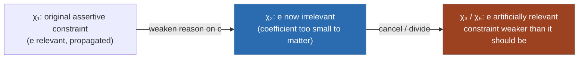

[[book-guidelines|↩ Back to guidelines]]

## Why clauses never have this problem, and pseudo-Boolean constraints always might

A CNF clause like $a \lor b \lor c$ has a property so obvious it's easy to forget it's a property at all: every literal in it is load-bearing. Drop $c$ and the clause becomes strictly weaker — some model that used to be excluded (all of $a,b,c$ false) is now excluded only if you keep $c$ around. In clausal learning, resolution never invents a literal that "doesn't matter" — every literal you see genuinely restricts the model set.

Pseudo-Boolean (PB) constraints don't give you that for free. A PB constraint is a linear inequality over literals,

$$\sum_i \alpha_i \ell_i \ge \delta,$$

and because the $\alpha_i$ are arbitrary weights, a literal's presence can become semantically pointless while its syntactic presence persists. Take

$$10a + 5b + 5c + 2d + e + f \ge 15.$$

Even setting $d, e, f$ all true only contributes $2+1+1=4$ towards the threshold of $15$; you always need at least $10a+5b+5c$ worth of support regardless of how $d,e,f$ are set. So $d$, $e$, $f$ can never change whether this constraint is satisfied — they are dead weight, syntactically present but semantically silent.

This is not just a curiosity. Wallon's Chapter 5 is about what happens when a PB *solver* — specifically, the CDCL-style conflict analysis that derives new (learned) constraints via the cutting-planes proof system — accumulates these dead-weight literals and, worse, sometimes turns a genuinely irrelevant literal back into one that looks relevant on paper (but shouldn't be). That mismatch quietly weakens every learned constraint it touches, which weakens the propagations that constraint can later trigger, which is exactly the currency solvers run on. This is a problem that is *specific to PB reasoning* — clauses and cardinality constraints (which are just clauses with a threshold, all coefficients equal to 1) can't manufacture this phenomenon, because a clause is already the "no irrelevant literals" fixed point (Prop. 40 in the next chapter makes this precise: weakening away every irrelevant/ineffective literal from a PB constraint always collapses it to a clause).

## Defining irrelevance precisely

**Definition 105 (Irrelevant Literal).** A literal $\ell$ is *irrelevant* with respect to a constraint $\chi$ when

$$\chi|_\ell \equiv \chi|_{\bar\ell},$$

where $\chi|_\ell$ is the conditioning of $\chi$ by $\ell$ — substitute $\ell = 1$ (or $\bar\ell = 1$ in the other case) and simplify. If the two conditionings are logically equivalent constraints, then whichever way you set $\ell$, the constraint behaves identically — $\ell$'s truth value has no effect. Otherwise $\ell$ is *relevant*, and we say $\chi$ *depends on* $\ell$.

This definition is exact but awkward to check directly (you'd have to compute and compare two conditioned constraints). **Theorem 10** gives the semantic reading that motivates the name: $\ell$ is irrelevant in $\chi$ iff, for every model $M$ of $\chi$, flipping $\ell$'s value in $M$ never turns $M$ into a counter-model. In other words: irrelevance means "no model's satisfaction of $\chi$ ever hinges on this one bit."

### A free monotonicity property

Because PB constraints are weighted, relevance interacts predictably with coefficient size:

**Proposition 35 (Monotonicity).** In $\chi = \alpha\ell + \sum_{i=1}^n \alpha_i \ell_i \ge \delta$, if $\ell$ is irrelevant, then every $\ell_i$ with $\alpha_i \le \alpha$ is also irrelevant.

Back to the running example, $10a+5b+5c+2d+e+f\ge 15$: once you've established $d$ (coefficient 2) is irrelevant, $e$ and $f$ (coefficients 1) are irrelevant automatically — no separate check needed. Symmetrically, if $c$ (coefficient 5) turns out relevant, so are $a$ and $b$ (coefficients 10 and 5), since they only make the constraint *easier* to satisfy without them. This gives a solver a cheap pruning rule: sort by coefficient, binary-search or scan for the relevance boundary, and you get most literals' status for free.

**Proposition 36** closes a natural gap: if $\chi$ is *assertive* (i.e., it's currently propagating a literal $\ell$ — falsifying $\ell$ would falsify $\chi$, satisfying it keeps $\chi$ satisfiable), then $\ell$ is necessarily relevant. A literal a constraint is actively forcing can never be one it doesn't care about.

## How cutting-planes rules manufacture irrelevant literals from nothing

The four cutting-planes inference rules a PB solver's conflict analysis uses — **weakening**, **division**, **addition**, **cancellation** — can each independently introduce an irrelevant literal into a *derived* constraint, even when none of the input constraints had one:

- **Weakening** $3a+3b+c+d\ge4$ on $d$ gives $3a+3b+c\ge3$ — now $c$ is irrelevant (its coefficient of 1 can't cross the gap from 3 to the needed threshold once $a,b$ are both false).
- **Division** of $6a+5b+c\ge6$ by 2 (rounding up) gives the same $3a+3b+c\ge3$ — same story, but via a different rule.
- **Addition** of $4a+3b+3c\ge6$ and $3b+2a+2d\ge3$ gives $6a+6b+3c+2d\ge9$, in which $d$ is now irrelevant even though it was relevant in its source constraint.
- **Cancellation** (resolution's PB analogue — add two constraints after scaling to make some literal's positive and negative coefficients equal, then eliminate it) behaves the same way.

None of this is exotic: it's exactly what conflict analysis does on every conflict. So a PB solver's learned constraints routinely accumulate irrelevant literals as a side effect of ordinary reasoning.

### The real threat: artificial relevance

Having an irrelevant literal sitting in a constraint is harmless *by itself* — it doesn't change what the constraint means. The danger is what happens on the **next** inference step:

**Definition 106 (Artificially Relevant Literal).** Given constraints $\chi_1,\dots,\chi_n$ combined by a cutting-planes rule $r$ into $\chi$, a literal $\ell$ is *artificially relevant* in $\chi$ if it's relevant in $\chi$ but was irrelevant in every $\chi_i$ that contained it.

This is the chapter's central pathology: a literal that carried zero information going in comes out carrying real weight, purely as an artifact of how the rule pushed coefficients and the degree around — not because anything was learned about that literal. The strength of the derived constraint is now worse than it needed to be, because the solver spent "coefficient budget" propping up a literal that didn't earn its relevance.

**Worked example (generalized-resolution solver, e.g. Sat4j).** A conflict arises on $\chi_1 = 4a+4b+3\bar e+3g+3h+2i+2j\ge16$, with $e$ propagated by $6a+6b+4c+3d+3e+2f\ge10$. To preserve the conflict while cancelling on $e$, the solver must first weaken away $c$ from the reason, giving $\chi_2 = 6a+6b+3d+3e+2f\ge6$ — in which $f$ is now irrelevant (its coefficient 2 can't cross from 6 down to the needed slack). Cancelling $\chi_1$ against $\chi_2$ on $e$ produces

$$\chi_3 = 10a+10b+3d+3g+3h+2f+2i+2j \ge 19,$$

and in $\chi_3$, $f$ has become artificially relevant — even though it was irrelevant in the constraint it came from.

**Worked example (division-based solver, RoundingSat-style).** Start from $17a+17b+8c+4d+2e+2f\ge23$, all literals relevant. During conflict analysis, $c,f$ are satisfied, everything else falsified; RoundingSat weakens on $f$ because its coefficient (2) doesn't divide the pivot's coefficient (4), giving $\chi_4 = 17a+17b+8c+4d+2e\ge21$ — now $e$ is irrelevant. Dividing by 4 (rounding up) yields $\chi_5 = 5a+5b+2c+d+e\ge6$, in which *every* literal, including $e$, is relevant again: $e$ has become artificially relevant.

This is not a coincidence of the example — **Proposition 38** proves it's structural: in RoundingSat, any irrelevant literal produced by weakening the reason is *always* made artificially relevant by the subsequent division. The division rule rounds up all coefficients below the pivot's — including the irrelevant literal's — to 1, and by the monotonicity of Proposition 35 (run in reverse), that rounding is exactly what restores relevance.



## Removing irrelevant literals: two strategies, neither dominant

Once you know $\ell$ is irrelevant in $\chi$, Definition 105 already tells you how to remove it while preserving *logical* equivalence: assign it either way. Concretely there are two distinct moves:

1. **Removal by weakening** (§5.3.1) — locally set $\ell$ to **1** (i.e. compute $\chi|_\ell$, which for $\alpha\ell + \sum \alpha_i\ell_i \ge \delta$ gives $\sum \alpha_i \ell_i \ge \delta - \alpha$). This is literally the weakening rule applied to $\ell$. Its upside: it can trigger the *saturation* rule afterwards (clamping any coefficient above the new degree down to the degree), which keeps coefficients small and arithmetic cheap.
2. **Simple removal** (§5.3.2) — locally set $\ell$ to **0** (compute $\chi|_{\bar\ell}$, i.e. just delete the term, degree unchanged). This is *not* one of the four cutting-planes rules; it's a bookkeeping move. Its upside: it strengthens the constraint *over the reals* (the two conditionings coincide over the Booleans by definition of irrelevance, but not necessarily as real-valued inequalities), so no information is discarded even in the finer-grained sense.

Continuing the running example $10a+5b+5c+2d+e+f\ge15$: setting $d,e,f$ all to 1 (weakening away all three) gives $10a+5b+5c\ge11$; setting them all to 0 (simple removal) gives $10a+5b+5c\ge15$. Both are equivalent over $\{0,1\}$-valued $a,b,c$, but the second is strictly stronger as a real inequality — for real-valued $a,b,c\in[0,1]$, requiring the sum to reach 15 rather than 11 rules out more of the real cube.

**Neither strategy dominates.** Revisiting the two worked examples above:

- For $\chi_2 = 6a+6b+3d+3e+2f\ge6$ (the generalized-resolution case), weakening $f$ away and then saturating gives $\chi_2' = 4a+4b+3d+3e\ge4$, which after cancellation yields a constraint strictly *stronger* than what simple removal would give. Weakening wins here.
- For $\chi_4 = 17a+17b+8c+4d+2e\ge21$ (the RoundingSat case), simple removal of $e$ then dividing by 4 gives $\chi_5'' = 5a+5b+2c+d\ge6$, strictly *stronger* than either keeping $e$ (χ₅) or weakening it away (χ₅′, which degenerates to $a+b\ge1$ — much weaker). Simple removal wins here.

### Choosing via slack

Since strength isn't monotone in the removal strategy, the chapter uses the **slack** of a constraint (roughly, how much room there is between "just satisfied" and "just falsified" — a smaller slack means a tighter, stronger constraint) as a cheap proxy, and picks whichever removal (weakening vs. simple removal) yields the **lower slack** (§5.3.3, using the fact that slack is subadditive under cutting-planes rules — Prop. 32 — so minimizing it locally tightens the bound on everything derived downstream). Re-running the two examples: for $\chi_2$, weakening gives slack 10 vs. simple removal's 12 (and the untouched constraint's 14) — weakening wins, matching the strength comparison above. For $\chi_4$, simple removal gives slack 25 vs. weakening's 27 (untouched: 27 too) — simple removal wins, again matching.

## Detecting irrelevant literals is NP-hard — so you approximate

Even with a removal policy in hand, you need to *find* irrelevant literals cheaply, and this is where the chapter turns pragmatic. Checking whether a single literal is relevant in a PB constraint is **NP-complete** [Chai–Kuehlmann-style result, cited to CLH11]. A solver cannot afford an exact check on every constraint it touches, on every conflict, so the chapter builds a pipeline of two complementary compromises: *when* to check, and *how* to check approximately.

### When to check (timing, §5.4.1)

Two propositions bound when a check is worth running:

- **Proposition 37**: weakening a constraint on a literal $\ell' \ne \ell$ never makes an already-irrelevant $\ell$ artificially relevant. So a generalized-resolution solver that applies several weakening steps in a row can defer the relevance check to *after* all of them, rather than re-checking after each individual weakening — this is a genuine algorithmic saving, not just a convenience.
- **Proposition 38** (already stated above): division in RoundingSat *does* turn weakened-away irrelevance into artificial relevance. So there, the check must run after weakening but strictly before division — there's no deferring it.

There's a subtlety worth flagging on the cancellation side: sometimes the *pivot itself* (the literal being cancelled on) becomes irrelevant partway through, because weakening satisfied literals with non-divisible coefficients can shrink its own contribution below the threshold that made it matter. When that happens the chapter's recommendation is to abort the cancellation and roll back the weakening — resolving on a literal that no longer matters is pointless work, and you don't want to pay its coefficient cost for nothing.

### How to check: SAT-based (§5.4.2), exact but slow

Checking $\ell$'s relevance reduces to checking the entailment

$$\sum_{i=1}^n \alpha_i\ell_i \ge \delta-\alpha \;\models\; \sum_{i=1}^n \alpha_i\ell_i \ge \delta,$$

equivalently the unsatisfiability of

$$\sum_{i=1}^n \alpha_i\ell_i \ge \delta-\alpha \;\wedge\; \sum_{i=1}^n \alpha_i\bar\ell_i \ge \Big(\sum_i\alpha_i\Big)-\delta,$$

a two-constraint PB formula you can hand to any PB solver. This is exact and sound but — despite looking small (only two constraints!) — can be as hard as **subset-sum**, so it's not fast in general. In practice the chapter runs it with a 5-second timeout per call, defaulting to "relevant" on timeout (so the method stays *sound* — never wrongly discards a relevant literal — but becomes *incomplete*, missing some genuinely irrelevant literals). The experiments (Sat4j-GeneralizedResolution and Sat4j-RoundingSat, over a large PB benchmark suite) confirm irrelevant literals really are produced in most families, but the detection overhead swamps any runtime benefit — most of the wall-clock time in many families goes to the relevance check itself, not to solving.

### How to check: dynamic-programming / subset-sum approximation (§5.4.3), fast but incomplete in a different way

The entailment above is exactly asking: does any subset of $\{\alpha_1,\dots,\alpha_n\}$ sum to a value in $[\delta-\alpha, \delta-1]$? If none does, $\ell$ is irrelevant. Classical subset-sum dynamic programming solves this exactly in $O(n\delta)$ — pseudo-polynomial, and in this setting both $n$ and $\delta$ can be large enough that this is still too slow.

The workaround: solve subset-sum **modulo a small prime** $p$. Modular arithmetic is compatible with addition, so if a real solution exists, a solution exists mod $p$ too — meaning "no solution mod $p$" soundly implies "no real solution," i.e. $\ell$ is genuinely irrelevant. But the converse can fail: a spurious collision mod $p$ can make a literal look relevant when it isn't. Concretely, with coefficients $\{10,5,5,1,1\}$ (checking $d$ in $10a+5b+5c+2d+e+f\ge15$): mod 6 the coefficients become $\{4,5,5,1,1\}$, whose subset sums mod 6 cover $\{0,\dots,5\}$ entirely — so the check wrongly reports $d$ (and hence, via a further check, potentially misses $e,f$) as relevant. Mod 5, the coefficients reduce to $\{0,0,0,1,1\}$, whose subset sums are only $\{0,1,2\}$ — since the target range needed is $\{3,4\}$, no collision occurs, and $e$ (and by monotonicity $f$) is correctly certified irrelevant.

To cut down on these false positives while staying fast, the chapter runs the check against **several small primes at once** (in practice 101, 199, 307, 401) — reminiscent of the Chinese Remainder Theorem's use of multiple small moduli to reconstruct information about a larger number — and declares $\ell$ irrelevant as soon as *any* one modulus certifies it. This stays sound (never wrongly clears a relevant literal — a real relevant literal will show a collision under every modulus) while being far cheaper than the SAT-based check and, empirically, detects almost as many irrelevant literals, except on one outlier family (`wnqueen`) where the SAT-based method — helped by being fast enough there not to time out — actually finds more.

## Does removing them actually help? A mixed answer, with one striking case

The headline empirical result is on the `vertexcover-completegraph` family (instances encoding that complete graphs have no small vertex cover): removing irrelevant literals shrinks the resulting proof **exponentially**. Digging into *why* is illuminating — it isn't that irrelevant literals pile up throughout the search. Only a handful ever get removed, and all of them arise right after the *very first* conflict analysis, which produces a constraint of the shape $kx_1+x_2+\cdots+x_k\ge k$ (with $k=\lceil n/2\rceil-1$): here $x_2,\dots,x_k$ together can only ever contribute $k-1$, so they're all irrelevant, and the constraint is really just the unit clause $x_1\ge1$ in disguise. Removing those few irrelevant literals at that one pivotal moment cascades into an exponentially smaller proof overall — a small, localized correction with an outsized global effect, precisely because that first learned constraint anchors everything that follows.

Interestingly, RoundingSat's built-in decision-level-0 simplification happens to catch this particular case for free (it independently derives the same unit clause). But a variant benchmark — `vertexcover-completehypergraph`, built from 3-uniform complete hypergraphs — produces irrelevant literals on a *higher* decision level (constraints of the form $kx_1+kx_2+\cdots+x_k+x_{k+1}\ge k$), where RoundingSat's level-0 shortcut doesn't apply, and there the explicit detection-and-removal machinery gives a real, if non-exponential, improvement.

Despite this, the chapter's conclusion is measured, not triumphant: **across the full benchmark suite, the detection cost outweighs the benefit** — both the SAT-based and dynamic-programming-based detectors spend most of their time detecting rather than solving, and the *ideal* runtime (subtracting out detection time) shows no clear win either. The mechanism is real and sometimes dramatic, but "systematically detect and remove every irrelevant literal" is not, in the state this chapter leaves it, a viable engineering default — it's evidence that a *cheaper*, more targeted countermeasure is needed. That's exactly the opening the next chapter (weakening strategies, Chapter 6) walks through: instead of detecting irrelevant literals after the fact, structure the weakening rule itself so it never introduces literals worth checking for in the first place — trading detection cost for a coarser, but far cheaper, prevention.

## Where this leads

This chapter sits at a structural pivot point in Part II of the thesis. It depends on:
- the cutting-planes proof system and its four rules (weakening, division, addition, cancellation) established in the chapter on cutting-planes solving,
- the notion of slack from the constraint-strength apparatus used throughout Part II.

And it feeds directly into:
- **Chapter 6 (Weakening Strategies)**, whose central move — weaken away all *ineffective* literals during conflict analysis — is justified in part by **Proposition 40: every irrelevant literal is ineffective**. That is, the cheap, purely-syntactic notion of "ineffective" used operationally by solvers is a superset of the semantically precise "irrelevant" studied here; irrelevant-literal removal is a special case of the more general weakening-based cleanup the next chapter develops as a *practical* substitute for the too-costly exact detection this chapter builds.
- The broader empirical throughline of the thesis: this is one of the concrete places where cutting-planes' theoretical strength (arbitrarily large coefficients, strictly more succinct than resolution) collides with an implementation cost that resolution-based (clausal) solving never has to pay.

**Focus Area connection (`sat-smt-csp`):** the SAT-based relevance check (§5.4.2) is a clean small-scale illustration of *reduction to satisfiability* as a general technique — the entailment check for one literal in one PB constraint becomes an unsatisfiability query handed to an off-the-shelf PB/SAT solver, exactly the CEGAR-adjacent pattern (encode a semantic question as a satisfiability query, solve it, use the answer) that recurs anywhere a CSP or abstract-interpretation kernel needs to discharge a side condition it can't decide syntactically. If you build a CSP kernel that needs to determine "does this literal/variable assignment actually constrain the feasible region," this chapter is a worked example of exactly that question, including the pragmatic lesson that an exact reduction to a hard subproblem (here, subset-sum) is often too slow, and a sound-but-incomplete modular/randomized relaxation (the multi-prime subset-sum check) is what actually ships.

### Illustrative code: checking relevance mod a small prime

The book's modular subset-sum detector is small enough to be worth seeing as actual code rather than only as prose — this is original code written to mirror the chapter's algorithm, not something transcribed from the book (which states the algorithm in prose and by worked example, §5.4.3).

```rust
/// Sound-but-incomplete relevance check for a literal with coefficient `alpha`
/// among `others` (the coefficients of every other literal in the constraint),
/// against threshold `delta`, performed modulo a small prime `p`.
///
/// Returns `true` only when `p` *certifies* irrelevance (no false negatives on
/// "irrelevant"); `false` means "inconclusive under this modulus", not
/// "relevant" — callers should try multiple primes before concluding relevant.
fn certifies_irrelevant_mod_p(alpha: u64, others: &[u64], delta: u64, p: u64) -> bool {
    // Target range (mod p) that would witness relevance: any subset sum of
    // `others` landing in [delta - alpha, delta - 1] would make `alpha`'s
    // literal able to flip the outcome, i.e. relevant.
    let lo = (delta.saturating_sub(alpha)) % p;
    let hi = ((delta.saturating_sub(1)).min(delta)) % p; // delta-1, reduced mod p
    let coeffs_mod_p: Vec<u64> = others.iter().map(|&a| a % p).collect();

    // Reachable subset sums mod p, via a bitset over Z/pZ.
    let mut reachable = vec![false; p as usize];
    reachable[0] = true;
    for &c in &coeffs_mod_p {
        let prev = reachable.clone();
        for r in 0..p as usize {
            if prev[r] {
                reachable[(r + c as usize) % p as usize] = true;
            }
        }
    }

    // If no reachable sum falls in the target window mod p, this modulus
    // certifies irrelevance (soundly — a real collision would appear here too).
    let window_hit = if lo <= hi {
        (lo as usize..=hi as usize).any(|r| reachable[r])
    } else {
        // wrapped window
        (lo as usize..p as usize).chain(0..=hi as usize).any(|r| reachable[r])
    };
    !window_hit
}

/// Try several small primes (as the book does: 101, 199, 307, 401) and accept
/// irrelevance as soon as any one of them certifies it.
fn is_irrelevant(alpha: u64, others: &[u64], delta: u64) -> bool {
    const PRIMES: [u64; 4] = [101, 199, 307, 401];
    PRIMES.iter().any(|&p| certifies_irrelevant_mod_p(alpha, others, delta, p))
}
```

The point this code makes concrete: relevance-checking is fundamentally a *reachability* question over a modular ring (which sums mod $p$ are hittable), and the false-positive risk lives entirely in collisions — two genuinely different real sums landing on the same residue. That's the same risk profile as any hash-based or randomized over-approximation used to prune a search space: sound in one direction, probabilistically incomplete in the other, and cheap exactly because it discards information the exact algorithm would have needed to keep.
