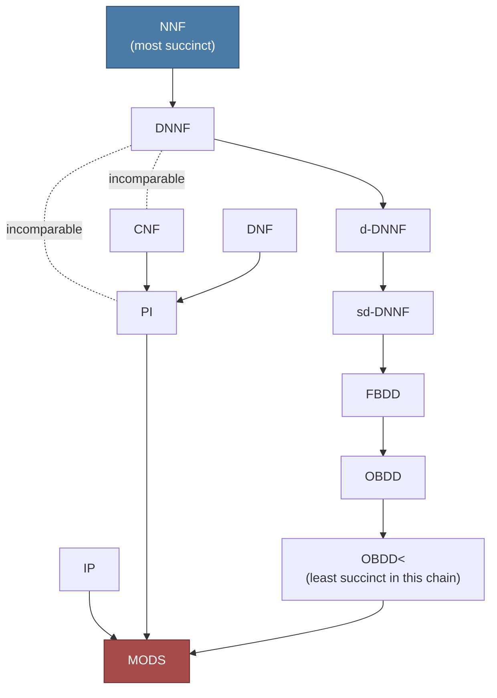

[[book-guidelines|↩ Back to guidelines]]

# Knowledge Compilation

## The problem: hard formulae, but the same formula asked over and over

A propositional formula is a fine way to store a piece of knowledge, but it is a terrible way to *answer questions* about that knowledge quickly. Checking whether an arbitrary circuit is satisfiable is NP-complete; checking whether it is valid is coNP-complete; counting its models is #P-hard. If your application has to answer these questions once, you eat the cost and move on. But many real systems — a configurator answering "is this combination of options still consistent?", a diagnosis engine, a planner — ask the *same underlying formula* thousands of queries over its lifetime, with only minor variations (a few variables get fixed, a few get forgotten). Re-running an NP-complete algorithm from scratch every time is not just slow, it's wasteful: you're re-discovering structure in the formula that hasn't changed since the last query.

Wallon frames the fix as an offline/online split (p. 23):

> "knowledge compilation takes advantage of this fact to perform the 'hard' operations once and for all, in an offline process, so that the operations to perform online become efficient."

Concretely: pay the (possibly exponential) cost *once*, translating the formula into a different **target language** — a restricted syntactic class of circuits, not a different logic — chosen so that the queries you actually care about become polynomial-time on formulae written in that language. This is exactly the "runtime guarantee" move: you move the exponential blow-up out of the request path and into a compilation step that happens ahead of time (or is amortized across many later queries).

The catch, and the reason an entire *map* of languages exists rather than one "best" compiled form, is that **there is no free lunch**: a language that makes satisfiability trivial might make counting models intractable; a language that supports fast equivalence checks might blow up exponentially in size compared to CNF for the same function. Choosing a compilation target is a multi-dimensional trade: how much space does it cost, and which operations does it actually make cheap? The Knowledge Compilation Map (Darwiche & Marquis, 2002; [DM02] in the text) is the tool for making that trade explicit, and it is what the rest of this article formalizes.

**What breaks without this framework:** without a shared vocabulary for "this language supports operation X in polynomial time," language choice becomes folklore — "BDDs are good for model checking," "DNF is good for enumerating models" — with no way to state precisely *why*, or to compare a new proposed language (like the pseudo-Boolean constraints this thesis studies) against the existing landscape. The map turns "is language L good?" into a table you can actually fill in.

---

## Part 1 — The languages being compiled into

Before the map's *criteria* (expressiveness, succinctness, queries, transformations) mean anything, you need the *objects* they're criteria about: circuits, restricted along two axes — structural (which sub-circuits are forced to look like normal forms) and semantic (decomposability, determinism).

### Circuits as the common substrate

Everything in the map is phrased over **circuits**, a strict generalization of formulae:

> **Def. 38 (Circuit).** A circuit is a directed acyclic graph $\Gamma$ such that the root and internal nodes are gates ($\lor$, $\land$, or $\lnot$) and the leaves are variables or Boolean constants. The root is the *output node*; $|\Gamma|$ (its size) is its node count.

The generalization over formulae (trees) is sharing: a circuit is a DAG, so the same sub-formula can be a shared input to multiple gates instead of being duplicated. This is precisely what lets compiled representations be exponentially smaller than the formula they represent — a formula with $2^k$ syntactically distinct but semantically related sub-parts can sometimes be a circuit with only $O(k)$ nodes if the redundancy factors through sharing. One structural convention is fixed throughout: the **read-once property** — every input variable labels exactly one leaf. Circuit semantics (Def. 39) is the obvious bottom-up evaluation: $\min$ for $\land$, $\max$ for $\lor$, $1 - x$ for $\lnot$, lifted from the standard Boolean-function semantics of formulae (this is literally interpreter evaluation over a DAG instead of a tree — memoize by node identity and you get the sharing benefit for free at query time too).

### Negation Normal Form (NNF): pushing negation to the leaves

> **Def. 40 (NNF).** A circuit is in Negation Normal Form if every $\lnot$ node's child is a leaf.

This single restriction — no negation may sit "above" a $\land$ or $\lor$ — is the parent language for almost everything that follows. It costs nothing in expressiveness (De Morgan's laws push any negation down to the leaves, at worst doubling the circuit size), but it buys the map a stable place to define the two properties that actually stratify the useful sub-languages: decomposability and determinism.

CNF and DNF, already familiar as syntactic restrictions on *formulae* (conjunctions of clauses / disjunctions of terms), are reintroduced here as they sit inside NNF: a CNF formula is an NNF circuit whose root is an $\land$ over $\lor$-over-literals gates; DNF is the mirror image. From CNF and DNF the text carves out two further sub-languages built from **prime** implicants/implicates — the *strongest* terms that still imply the formula, and the *weakest* clauses the formula still implies:

> **Def. 41 (Prime Implicant).** A term $\tau$ is a prime implicant of $\varphi$ if $\tau \models \varphi$ and no strictly weaker term $\psi$ (with $\tau \models \psi$) also implies $\varphi$.
>
> **Def. 42 (Prime Implicate).** Dually, a clause $\gamma$ is a prime implicate of $\varphi$ if $\varphi \models \gamma$ and no strictly stronger clause implied by $\varphi$ also implies $\gamma$.
>
> **Def. 43 (IP, PI).** A DNF $\varphi$ is in language **IP** if it is exactly the disjunction of its prime implicants; a CNF $\varphi$ is in **PI** if it is exactly the conjunction of its prime implicates.

For $\varphi \equiv a \lor \lnot(\lnot(b \lor c) \lor d)$, the book's running example, IP gives $a \lor (b \land \lnot d) \lor (c \land \lnot d)$ and PI gives $(a \lor b \lor c) \land (a \lor \lnot d)$ — these are the *canonical*, redundancy-free forms of DNF and CNF respectively, and (as you'll see in Part 2) that canonicity is exactly what buys IP/PI several queries that plain DNF/CNF don't get.

### Decomposability and determinism: the two properties that matter

The rest of the map's languages are all NNF circuits with one or both of these structural properties imposed everywhere in the circuit, not just at the root:

> **Def. 44 (Decomposability).** A conjunction $\varphi_1 \land \dots \land \varphi_n$ is decomposable iff $\mathrm{var}(\varphi_i) \cap \mathrm{var}(\varphi_j) = \emptyset$ for all $i \ne j$ — the conjuncts share no variables.
>
> **Def. 45 (Determinism).** A disjunction $\varphi_1 \lor \dots \lor \varphi_n$ is deterministic iff $\varphi_i \land \varphi_j \models \bot$ for all $i \ne j$ — the disjuncts share no *models*.

Why these two, specifically? Because they are exactly the conditions under which model-counting factors through the circuit's structure (Remark 10): the model count of a decomposable conjunction is the *product* of its conjuncts' counts (no shared variables means no double-constraining), and the model count of a deterministic disjunction is the *sum* of its disjuncts' counts (no shared models means no double-counting). Decomposability is what makes a circuit behave like an *independent product* of sub-problems; determinism is what makes a circuit behave like a *partition* of the model space. Both are local properties (imposed at every gate, not just the top), so they compose recursively — which is exactly what a compilation algorithm needs in order to build the whole thing bottom-up.

> **Def. 46 (DNNF, d-DNNF).** An NNF circuit is in **DNNF** if every conjunction in it is decomposable. It is in **d-DNNF** if it is DNNF *and* every disjunction in it is deterministic.

Take $\varphi = a \lor \lnot(\lnot(b\lor c)\lor d)$ again. A DNNF representation can group $b, \lnot d$ under one decomposable $\land$ and $c$ under a sibling structure without worrying about whether the two disjuncts of the top $\lor$ overlap in models. A d-DNNF representation for the same formula additionally has to arrange the disjuncts so no model is counted twice — e.g. splitting on $a$ first ($a \lor (\lnot a \land \dots)$), which is deterministic by construction since one disjunct fixes $a=1$ and the other $a=0$. This is the general recipe for building a d-DNNF from a DNNF: introduce a case-split variable at every $\lor$ so the branches become mutually exclusive by fiat. It costs circuit size (you may need many such splits) in exchange for buying determinism.

**What breaks without decomposability/determinism:** plain NNF gives you none of this — a general NNF circuit can share variables across conjuncts and models across disjuncts arbitrarily, so counting or enumerating its models is exactly as hard as for an arbitrary formula (Table 1.3, row NNF, is a wall of $\circ$). Decomposability and determinism are the *minimal* structural commitments that make polynomial-time counting/enumeration possible at all — that's why virtually every fast query in Table 1.3 lives on the DNNF/d-DNNF side of the map.

### Binary Decision Diagrams: an equivalent view via decision trees

BDDs are presented as a second, independently-motivated basis for compilation — not a special case of NNF circuits, but a different DAG shape entirely:

> **Def. 47 (BDD).** A Binary Decision Diagram is a DAG whose root/internal nodes are *decision nodes* labeled by variables, whose arcs are labeled $0$ or $1$ (the two branches of that variable's assignment), and whose leaves are exactly $0$ and $1$.

Semantics (Def. 48) is a path-following read: a root-to-$1$ path is a (possibly partial) satisfying assignment, a root-to-$0$ path a falsifying one. Two restrictions of BDDs recur throughout the rest of the thesis:

> **Def. 49 (FBDD).** A BDD in which every root-to-leaf path visits each variable at most once ("free" — no forced order across paths, but no repeats within one path).
>
> **Def. 50 (OBDD, OBDD$_<$).** An FBDD is an OBDD$_<$ (with respect to a fixed total order $<$ on variables) if every path respects that order: an ancestor's variable always precedes a descendant's. **OBDD** is the union of all OBDD$_<$ languages over every possible order $<$.

The ordering restriction is the crucial knob: OBDD$_<$ for a *fixed* $<$ is what gives you canonicity (two OBDD$_<$'s over the same order represent the same function iff they're graph-isomorphic after reduction — this is the classical Bryant result, referenced implicitly by the map's strongest query guarantees living on OBDD$_<$). But that canonical form is order-dependent: a function that's tiny under one variable order can blow up exponentially under a different order — this is *the* practical headache of BDD-based tools, and it's exactly why OBDD (union over all orders) is a strictly less useful language to reason about statically than any single OBDD$_<$: knowing "some order makes this small" doesn't tell you which one, or how to find it.

**Grounding (Rust).** DNNF/d-DNNF and BDD/FBDD/OBDD map onto two different but equally natural Rust representations, and the difference between them is instructive:

```rust
// A DNNF/d-DNNF-style circuit: an arena of shared nodes (the DAG sharing
// that makes compiled forms compact), with the decomposability/determinism
// invariants tracked as *properties a builder must maintain*, not enforced
// by the type system (they're global, not local structural facts).
enum Node {
    Lit(i32),                 // positive/negative literal, read-once leaf
    And(Vec<NodeId>),         // decomposable: var(children) pairwise disjoint
    Or(Vec<NodeId>),          // deterministic (d-DNNF only): children pairwise UNSAT
}

struct Circuit {
    nodes: Vec<Node>,
    root: NodeId,
}

// A BDD, by contrast, is naturally a *typestate*-shaped recursive enum —
// order-respecting-ness (OBDD<) is a global invariant over the recursion,
// just like decomposability is for DNNF, but the branching structure itself
// (decision node, two children) is much closer to a binary search tree.
enum Bdd {
    Leaf(bool),
    Decision { var: u32, lo: Rc<Bdd>, hi: Rc<Bdd> }, // lo = 0-branch, hi = 1-branch
}
```

The reason to notice this side by side: a DNNF's `And`/`Or` nodes carry *variable-set* obligations (decomposability, determinism) that are properties of a whole subtree, whereas a BDD's obligation (respecting `<`) is a property of the *path*, checkable node-by-node as you recurse. That's a big part of why OBDD queries in Table 1.3 below are uniformly stronger than DNNF's: a per-path invariant is cheaper to exploit algorithmically than a per-subtree one.

---

## Part 2 — The map itself: expressiveness, succinctness, queries, transformations

With the languages in hand, the map compares them along four independent axes. This is the actual payload of Section 1.3.2, and it's worth being precise about why there are *four* axes and not one "which language is best" score: a language can win on one axis and lose on another, and an application's requirements determine which axes matter.

### Axis 1 — Expressiveness: can it represent the function at all?

> **Def. 51 (Expressiveness).** $L \le_e L'$ iff every Boolean function representable in $L'$ is also representable (by *some* formula, of any size) in $L$.

This is a purely qualitative, size-blind notion — it asks nothing about *how big* the representation is, only whether one exists. As Wallon notes right after stating it: every language considered in this chapter (NNF and all its restrictions, CNF, DNF, BDD and its restrictions) is **fully expressive** — each can represent every Boolean function. So expressiveness, for this particular family of languages, turns out to be the axis that *doesn't* discriminate between them. That's not a wasted definition, though: it's precisely what justifies moving straight to succinctness as the axis that actually matters here, and it's also the axis where languages *can* differ dramatically once you go beyond this chapter's list (e.g. Horn-CNF is not fully expressive — it can't represent every Boolean function at all, regardless of size).

### Axis 2 — Succinctness: how big does the representation have to be?

> **Def. 52 (Succinctness).** $L \le_s L'$ iff there is a polynomial $p$ such that every function representable by some $\varphi \in L'$ is also representable by some $\psi \in L$ with $|\psi| \le p(|\varphi|)$.

Read $L \le_s L'$ as "*L is at least as succinct as L′*" — anything $L'$ can say compactly, $L$ can also say compactly (up to a polynomial factor; the polynomial bound, not exact size, is what makes this a coarse-grained but robust ordering rather than a fragile exact one). It's a preorder (Remark 11): reflexive and transitive but not antisymmetric — two languages can be mutually $\le_s$ without being syntactically identical. Notation 8 gives the strict version $L <_s L'$ for "$L \le_s L'$ but not conversely" — a genuine succinctness gap.

Table 1.2 lays out the resulting partial order across twelve languages (rows are $\le_s$-comparisons: entry at row $R$, column $C$ tells you whether $R \le_s C$). The shape worth internalizing, rather than every cell:



*(An arrow $X \to Y$ means $X \le_s Y$, i.e. $X$ can represent anything $Y$ can, polynomially — so $X$ dominates $Y$ in succinctness; MODS, the language of explicit model lists, sits at the bottom because everything can be compactly turned into an (exponentially large, but "polynomial in the number of models") list of models, while almost nothing can go the other way.)*

The chain NNF $\to$ DNNF $\to$ d-DNNF $\to$ sd-DNNF $\to$ FBDD $\to$ OBDD $\to$ OBDD$_<$ is strictly decreasing in succinctness at every step (marked $\not\le^{(1)}$ in the table going backward) — **every structural restriction you add (decomposability, then determinism, then structuredness, then acyclicity-as-a-tree, then free-ness, then a fixed order) costs you succinctness monotonically.** This is the map's central "no free lunch" fact made precise: you cannot get OBDD$_<$'s query guarantees at DNNF's compactness. Meanwhile CNF, DNF, PI, and IP are largely **incomparable** with the DNNF/BDD family ($\not\le$ in both directions) — they're not on the same succinctness ladder at all, they're a different trade entirely.

### Axis 3 — Queries: what can you ask in polynomial time?

A query takes a compiled representation and answers a question about the function it represents, without decompiling it. Eight are defined (Defs. 53–58):

| Query | Question | Def. |
|---|---|---|
| **CO** | Is $\varphi$ consistent (satisfiable)? | 53 |
| **VA** | Is $\varphi$ valid? | 53 |
| **CE** (Clausal Entailment) | Does $\varphi \models \gamma$ for a given clause $\gamma$? | 54 |
| **IM** (IMplication by a term) | Does a given term $\tau$ entail $\varphi$ ($\tau \models \varphi$)? | 56 |
| **EQ** (EQuivalence) | Are two representations $\varphi, \psi \in L$ equivalent? | 55 |
| **SE** (Sentential Entailment) | Does $\varphi \models \psi$ for two representations $\varphi, \psi \in L$? | 55 |
| **CT** (CounTing) | How many models does $\varphi$ have? | 57 |
| **ME** (Model Enumeration) | Enumerate all models of $\varphi$ (poly. in $|\varphi|$ + model count, or equivalently poly. delay — Remark 12) | 58 |

A language "satisfies" a query if there's a polynomial-time algorithm for it *on that language's representations specifically* — the same question can be NP-hard on CNF and trivial on OBDD$_<$, because the algorithm gets to exploit the syntactic guarantees the language enforces.

| | CO | VA | CE | IM | EQ | SE | CT | ME |
|---|---|---|---|---|---|---|---|---|
| NNF | ◦ | ◦ | ◦ | ◦ | ◦ | ◦ | ◦ | ◦ |
| DNNF | ✓ | ◦ | ✓ | ◦ | ◦ | ◦ | ◦ | ✓ |
| d-DNNF | ✓ | ✓ | ✓ | ✓ | ? | ◦ | ✓ | ✓ |
| sd-DNNF | ✓ | ✓ | ✓ | ✓ | ? | ◦ | ✓ | ✓ |
| BDD | ◦ | ◦ | ◦ | ◦ | ◦ | ◦ | ◦ | ◦ |
| FBDD | ✓ | ✓ | ✓ | ✓ | ? | ◦ | ✓ | ✓ |
| OBDD | ✓ | ✓ | ✓ | ✓ | ✓ | ◦ | ✓ | ✓ |
| OBDD$_<$ | ✓ | ✓ | ✓ | ✓ | ✓ | ✓ | ✓ | ✓ |
| DNF | ✓ | ◦ | ✓ | ◦ | ◦ | ◦ | ◦ | ✓ |
| CNF | ◦ | ✓ | ◦ | ✓ | ◦ | ◦ | ◦ | ◦ |
| PI | ✓ | ✓ | ✓ | ✓ | ✓ | ✓ | ◦ | ✓ |
| IP | ✓ | ✓ | ✓ | ✓ | ✓ | ✓ | ◦ | ✓ |
| MODS | ✓ | ✓ | ✓ | ✓ | ✓ | ✓ | ✓ | ✓ |

($\checkmark$ = polynomial time; $\circ$ = not, unless P = NP.)

Two patterns are worth pulling out rather than reading cell-by-cell:

1. **CNF and DNF are mirror-image specialists.** CNF gets VA and IM for free (checking validity of a conjunction of clauses, or whether a term implies it, is easy) but fails CO and CE — dually, DNF gets CO and CE but fails VA and IM. This is the formal cash-out of the intuition that CNF is "good for proving things false" (finding one falsified clause) and DNF is "good for proving things true" (finding one satisfied term) — checking the *opposite* direction requires reasoning about all clauses/terms simultaneously, which is exactly where the hardness lives.
2. **OBDD$_<$ is the unique language in this table with a full row of $\checkmark$s.** That's the direct payoff of fixing a variable order globally: canonicity under a fixed order is what makes SE and EQ — normally among the hardest queries, since they require comparing two representations, not just introspecting one — tractable by literally comparing the two (reduced) diagrams. This is the same mechanism that gives Lean's `isDefEq` a fast path for judgmental equality on head-normal forms: a canonical form turns semantic equivalence into syntactic (near-)identity. d-DNNF, sd-DNNF and FBDD all leave EQ marked `?` in the source table — an acknowledged open/unresolved question at the time of writing, not a claimed hardness result — which is itself informative: determinism alone (without a fixed order) gives you CE/IM/CT/ME for free but doesn't obviously settle sentential-level comparisons.

**Grounding (Rust).** A tractable-query language like OBDD$_<$ effectively gives you an equality trait for free once you fix a canonical (reduced) form:

```rust
impl PartialEq for ReducedObdd {
    // Under a fixed variable order and reduction (merge isomorphic subgraphs,
    // eliminate redundant tests), two OBDDs represent the same function iff
    // they are the same DAG — this is exactly what EQ being tractable buys you.
    fn eq(&self, other: &Self) -> bool {
        self.root_id_after_reduction() == other.root_id_after_reduction()
    }
}
```
That's not how you'd implement `PartialEq` for a raw `Circuit` (DNNF/NNF) — there, EQ has no known polynomial algorithm, so any equality check has to fall back to something exponential or approximate (e.g. bounded model checking against a SAT call).

### Axis 4 — Transformations: what can you *build* in polynomial time?

Where queries introspect a representation, transformations *produce a new representation of the same language* from an existing one, and the criterion is whether the output stays polynomially bounded.

> **Def. 59 (Conditioning).** $\varphi|\ell$ replaces every occurrence of literal $\ell$ in $\varphi$ by $\top$ (if $\ell$ positive) or $\bot$ (if negative) — "assume $\ell$ is true and simplify." Conditioning on a consistent term $\tau$ is conditioning on each of its literals in turn.
>
> **Def. 60 (CD).** $L$ satisfies CD if conditioning by a term stays in $L$ with polynomial cost.
>
> **Def. 61 (Forgetting).** $\exists v\,\varphi$ is the strongest consequence of $\varphi$ not mentioning $v$; concretely $\exists v\,\varphi \equiv (\varphi|v) \lor (\varphi|\lnot v)$ — "project $v$ out," keeping exactly the constraint that survives regardless of $v$'s value. Forgetting a *set* of variables iterates this.
>
> **Def. 62 (FO, SFO).** $L$ satisfies FO if forgetting an arbitrary variable set stays in $L$ in polynomial time (with respect to $|\varphi|$ *and* $|V|$); SFO is the same but only guaranteed for a single variable.
>
> **Def. 63 (∧C, ∨C).** $L$ is closed under conjunction/disjunction of a finite *set* of representations, in time polynomial in their total size.
>
> **Def. 64 (∧BC, ∨BC).** The bounded (binary) versions: just two representations combined, polynomial in the two sizes. (Weaker than ∧C/∨C, since a language can combine two things cheaply but blow up combining $n$ of them, e.g. if each pairwise combination doubles the size.)
>
> **Def. 65 (¬C).** $L$ is closed under negation, polynomially.

| | CD | FO | SFO | ∧C | ∧BC | ∨C | ∨BC | ¬C |
|---|---|---|---|---|---|---|---|---|
| NNF | ✓ | ◦ | ✓ | ✓ | ✓ | ✓ | ✓ | ✓ |
| DNNF | ✓ | ✓ | ✓ | ◦ | ◦ | ✓ | ✓ | ◦ |
| d-DNNF | ✓ | ◦ | ◦ | ◦ | ◦ | ◦ | ◦ | ? |
| sd-DNNF | ✓ | ◦ | ◦ | ◦ | ◦ | ◦ | ◦ | ? |
| BDD | ✓ | ◦ | ✓ | ✓ | ✓ | ✓ | ✓ | ✓ |
| FBDD | ✓ | • | ◦ | • | ◦ | • | ◦ | ✓ |
| OBDD | ✓ | • | ✓ | • | ◦ | • | ◦ | ✓ |
| OBDD$_<$ | ✓ | • | ✓ | • | ✓ | • | ✓ | ✓ |
| DNF | ✓ | ✓ | ✓ | • | ✓ | ✓ | ✓ | • |
| CNF | ✓ | ◦ | ✓ | ✓ | ✓ | • | ✓ | • |
| PI | ✓ | ✓ | ✓ | • | • | • | ✓ | • |
| IP | ✓ | • | • | • | ✓ | • | • | • |
| MODS | ✓ | ✓ | ✓ | • | ✓ | • | • | • |

($\checkmark$ = poly-time unconditionally; $\circ$ = not, unless P = NP; $\bullet$ = not *unconditionally* — i.e. there exist instances where it provably blows up, independent of P vs. NP.)

This table is where the trade-offs get sharp, and it's worth contrasting directly with the query table above:

- **CD (conditioning) is universal** — every single language in the table satisfies it. That makes sense: conditioning only ever *simplifies* a circuit (it substitutes constants and can be pushed down structurally without changing the overall shape), so no restricted language loses its defining structural property from conditioning.
- **d-DNNF loses almost everything DNNF had.** DNNF satisfies FO, SFO, ∨C, ∨BC; d-DNNF (the *same* language plus determinism) satisfies *none* of those. Determinism, which was exactly what bought you CT and ME as *queries*, is fragile under these *transformations*: forgetting a variable or taking a disjunction of two deterministic circuits doesn't preserve determinism for free — you may need to re-split disjuncts to restore mutual exclusivity, and that re-splitting isn't guaranteed to stay small. This is the map's cleanest illustration that query-tractability and transformation-tractability are genuinely different axes, not two views of the same underlying "how nice is this language" scalar.
- **OBDD$_<$ trades ∧C/∨C for ∧BC/∨BC.** Full closure under conjunction/disjunction of an arbitrary *set* is only conditional (•) even for the best-behaved language in the table, but the *binary* bounded versions (∧BC, ∨BC) are unconditional for OBDD$_<$. This is the Bryant apply-algorithm fact in disguise: combining two fixed-order OBDDs is polynomial in their sizes (you walk both DAGs together), but chaining $n$ such combinations can compound size multiplicatively, so the *n*-ary closure isn't guaranteed polynomial even though each individual step is.

**Grounding (Rust/Python).** Conditioning, being universally tractable, is the one transformation you'd actually want as a generic circuit-visitor rather than something language-specific:

```rust
fn condition(circuit: &Circuit, node: NodeId, lit: Literal) -> Circuit {
    // A structural fold: replace every leaf matching `lit` (resp. its
    // negation) with ⊤ (resp. ⊥), then propagate the resulting constant
    // upward through ∧/∨ gates (⊤ ∧ x = x, ⊥ ∨ x = x, etc.).
    // This is exactly why CD is free everywhere: it never needs to inspect
    // decomposability, determinism, or ordering — it's a pure rewrite pass.
    fold_and_simplify(circuit, node, |leaf| {
        if leaf.var() == lit.var() { Some(leaf.matches(lit)) } else { None }
    })
}
```
Forgetting, by contrast, is the transformation whose *definition itself* ($\exists v\,\varphi \equiv (\varphi|v) \lor (\varphi|\lnot v)$) already tells you why it's dangerous for restricted languages: it's built out of a disjunction of two conditioned circuits, so any language that doesn't handle $\lor$-closure gracefully (i.e. fails ∨C/∨BC, like d-DNNF) inherits that failure for forgetting too — you can see this compositionally straight from Def. 61's formula, without needing the hardness proof.

```python
# A five-line illustration of why forgetting costs what ∨C costs:
# it's *literally* the disjunction of two conditioned circuits.
def forget(compile_fn, disjoin_fn, phi, v):
    phi_v_true  = condition(phi, v, True)
    phi_v_false = condition(phi, v, False)
    return disjoin_fn(phi_v_true, phi_v_false)   # this call is where ∨C/∨BC-failure bites
```

---

## Why this matters even though every language here is "fully expressive"

Since Def. 51 told us every language in this chapter can represent every Boolean function, the entire practical content of "which language should I compile into?" lives in the succinctness/query/transformation tables, not in expressiveness. That's the map's real lesson: **choosing a compilation target is choosing which queries and transformations you need to be fast, and then finding the most succinct language that still offers them** — never the other way around (picking the "smallest" language and hoping the queries you need happen to be fast on it).

This is also precisely the setup Chapter 2 of the thesis exploits: pseudo-Boolean and cardinality constraints (languages PBC/CARD) are shown to be strictly more succinct than CNF, but — per the map's query/transformation criteria applied to PBC/CARD — they *lose* several of CNF's transformations (forgetting, closure under disjunction, closure under negation) while *keeping* CNF's tractable queries. In the map's own vocabulary: PBC/CARD sit in a different, mostly-incomparable position from the DNNF/BDD family, winning on succinctness against CNF but paying for it exactly where DNNF paid for its succinctness gains over d-DNNF — in the transformation columns.

---

## Where this leads

Within the thesis, this map is the yardstick against which Chapter 2 places pseudo-Boolean constraints (succinctness comparisons against OBDD$_<$, NNF, DNNF, IP, DNF; query/transformation satisfaction proofs using exactly the eight queries and eight transformations defined here), and Chapter 3's discussion of structured DNNF width builds directly on the DNNF/decomposability machinery from Section 1.3.1.

For the **`sat-smt-csp`** focus area specifically: this map *is* the formal vocabulary for a question that any CSP/constraint-solving backend has to answer implicitly even when it never states it explicitly — "what internal representation do I keep a learned constraint or a propagated domain in, and what does that choice cost me?" A domain-propagation engine that needs fast *consistency* checks and cheap *conditioning* (assigning a variable and simplifying) wants something like a d-DNNF or OBDD-shaped internal representation; one that needs to *combine* many learned constraints cheaply (∧C) might prefer something CNF-like even at a succinctness cost. The asymmetry between CO/VA (dual under negation, but *not* both tractable on the same restricted language, as CNF vs. DNF shows) is the same asymmetry a CEGAR loop lives inside: proving a candidate invariant *valid* and finding a *counterexample* to it are different queries with potentially different costs, and this map is where that distinction was first made load-bearing and precise. And the OBDD$_<$ row's uniquely tractable EQ/SE is worth remembering whenever a "does this representation, in canonical form, equal that one" check shows up elsewhere in the standing project — it's the same move as judgmental-equality-via-normal-forms, just instantiated for Boolean circuits instead of terms.
