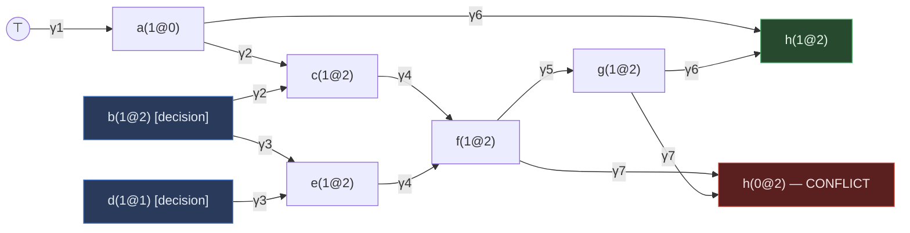

# Practical SAT Solving and the CDCL Architecture

[[book-guidelines|↩ Back to guidelines]]

## Why this section exists

SAT is NP-complete. That's not a footnote — it's the whole reason this section has to exist. There is no known algorithm that solves SAT in polynomial time in the worst case, and (almost certainly) never will be. And yet "modern" SAT solvers routinely dispatch industrial instances with *millions* of variables and clauses. That gap — worst-case intractability versus routine practical success — is not an accident or a benchmark artifact. It is the product of one specific architecture, **Conflict-Driven Clause Learning (CDCL)**, built from a small number of interlocking components: a way to explore assignments cheaply (unit propagation via watched literals), and a way to *learn from failure* instead of blindly retrying (conflict analysis via implication graphs and non-chronological backtracking).

This article covers the mechanics of that architecture as Wallon presents it in §4.1.1 ("Exploring the Search Space") and §4.1.2 ("Intelligent Backtracking") — decisions, propagation, watched literals, the DP and DPLL ancestors, implication graphs, conflict-driven clause learning, and backjumping. It deliberately stops short of *how the solver chooses what to do* (branching heuristics like VSIDS, phase saving, LBD-based clause deletion, restart policies) — that's §4.1.3, covered in the sibling article **[[Guiding-the-Search-in-CDCL-SAT-Solvers|Guiding the Search in CDCL SAT Solvers]]**. Think of this article as "the mechanism," and the sibling as "the policy that drives the mechanism."

If you're building a CSP kernel for counterexample search (as in the standing project this vault is organized around), read this as the architecture your verification-condition solver's search loop will need — decisions and propagation generalize directly to domain-narrowing search, and backjumping generalizes to "stop wasting time re-deriving the same failure."

---

## 1. Decisions and unit propagation — exploring the search space

### 1.1 What a SAT solver is actually doing

At its core, a SAT solver is doing search over partial assignments: pick a variable, guess a truth value, see what that guess *forces*, and repeat. Wallon formalizes the "guess" step first.

> **Definition 91 (Decision).** Making a decision is the process of selecting an unassigned variable of the input formula and assigning it to a chosen truth value.

Definition 91 is deliberately silent on *which* variable and *which* value to pick — that's exactly the part left to heuristics, and exactly the part deferred to the sibling article. What matters here is what happens *after* a decision: clauses containing the now-satisfied literal can be dropped, and clauses containing the now-falsified literal shrink by one literal.

```
Clause: a ∨ ¬b ∨ c
c := 0   →  shrinks to  a ∨ ¬b        (c falsified: drop it from the clause)
b := 0   →  ¬b becomes satisfied      (clause is satisfied: drop the whole clause)
```

A decision eliminates every model in which the *opposite* choice was made — that's what makes it a genuine restriction of the search space, not a no-op. There's one interesting exception: **pure literals**.

> **Definition 92 (Pure Literal).** Given a CNF formula $\Sigma$ and a literal $\ell \in \mathrm{lit}(\Sigma)$, $\ell$ is pure when $\lnot \ell \notin \mathrm{lit}(\Sigma)$ — i.e., its negation never occurs anywhere in the formula.

Satisfying a pure literal never strengthens the formula (it can't throw away a would-be model, since no clause depends on the *falsity* of that literal), so it's safe to fix pure literals for free. This preserves *equisatisfiability* but not *equivalence* — the resulting formula isn't logically the same formula, just satisfiable exactly when the original one is.

### 1.2 Unit propagation: the workhorse

The far more important case is the **unit clause** — the one place a decision-free, equivalence-preserving deduction is possible.

> **Definition 93 (Unit Clause).** A unit clause is a clause that contains exactly one literal, called the unit literal.

> **Definition 94 (Unit Propagation / BCP).** Unit propagation (Boolean Constraint Propagation) is the process of satisfying all unit literals in a CNF formula, simplifying the formula, and repeating until no more unit literals appear.

If $\lnot b$ is the only literal in a clause, then $\lnot b$ *must* be true — there's no other way to satisfy that clause. Crucially, this doesn't need a decision: it's forced. Wallon's Notation 10 captures this by attaching a **reason** to every propagated literal: when a unit clause $\gamma$ forces $\ell$ to true, $\mathrm{reason}(\ell) = \gamma$. This is the load-bearing distinction between the two kinds of assignment in a CDCL solver:

- a **decision** has no reason — it's a heuristic guess;
- a **propagation** has a reason — a specific clause that left no alternative.

That distinction is what conflict analysis (§2 below) will exploit: it can walk *backward* through reasons to reconstruct exactly which decisions caused a failure.

**Decision levels.** Because most SAT solvers never physically shrink clauses (mutating shared data on every assignment doesn't scale), they instead track, for every variable, *when* it was assigned:

> **Definition 95 (Decision Level).** The decision level $dl(v)$ of variable $v$ is $d$ if either $v$ is the $d$-th variable decided by the solver, or $v$'s value was unit-propagated after the $d$-th decision and before the $(d+1)$-th. $dl(\ell) = dl(\mathrm{var}(\ell))$.

The book's notation $v(b@d)$ — "variable $v$ is assigned Boolean value $b$ at decision level $d$" — appears constantly from here on; a literal propagated before any decision at all lives at level $0$, written $\ell(1@0)$. A clause is then **unit under a partial assignment** when exactly one of its literals is unassigned and every other literal is falsified — this is the *practical*, always-current notion of "unit" that a real solver checks, as opposed to the static, whole-formula Definition 93.

**What breaks without an efficient detection scheme.** Roughly 80% of a modern SAT solver's runtime is unit propagation [MMZ+01, as cited in Wallon]. A naive falsified-literal counter per clause requires updating that counter on *every* assignment change to *every* clause the literal appears in — a huge constant-factor tax that dominates for large instances. The entire rest of §1.2 exists to answer: how do you detect "this clause just became unit" without touching every clause on every assignment?

### 1.3 Watched literals: the lazy data structure

The key insight (Observation 4): **a clause with at least two non-falsified literals cannot possibly be unit.** So you don't need to track *all* literals of a clause — just enough to notice when the count of non-falsified literals might have dropped below two.

An earlier scheme (head-tail, Zhang & Stickel) tracks the first and last non-falsified literal with moving pointers, but it has to be repaired when literals become *unassigned* again (i.e., on backtracking) — expensive, because backtracking is frequent in CDCL.

**Watched literals** (Moskewicz et al., Chaff) fix this. Each clause keeps two designated "watched" literals, always positioned first in the clause, with the invariant: *both watched literals are unassigned, unless the clause is unit or falsified.* When a watched literal $\ell$ becomes falsified, the solver looks for a replacement among the clause's other literals; if none exists, the *other* watched literal is the one to propagate.

> **Algorithm 1 (updateWatchedLiterals).**
> Input: clause $\gamma$ with watched literals $\ell_1, \ell_2$, and a newly falsified literal $\ell$.
> 1. If $\ell \notin \{\ell_1, \ell_2\}$: nothing to do, return `null`.
> 2. If $\ell = \ell_1$: swap $\ell_1, \ell_2$ (so the falsified one is $\ell_2$).
> 3. Scan the clause's other (unwatched) literals for one that is *not* falsified; if found, swap it into $\ell_2$'s position and return `null`.
> 4. Otherwise, return $\ell_1$ — it must be propagated.

The payoff: **watched literals need updating only when one of them is falsified**, and — this is the part head-tail gets wrong — **they need no update at all when a literal becomes unassigned** during backtracking. If $\ell_2$ was watching a falsified literal that gets unassigned again, it's still a perfectly valid non-falsified watch; nothing to fix. This is exactly the property that makes the data structure *lazy* and cheap under CDCL's constant backtrack/re-decide cycle.

Here's Algorithm 1 in Rust, modeling a clause as a `Vec<Literal>` with the two watches kept at indices 0 and 1 by convention (matching Remark 20 — "the first literal is always the one to propagate"):

```rust
type Var = u32;

#[derive(Clone, Copy, PartialEq, Eq)]
struct Literal { var: Var, positive: bool }

impl Literal {
    fn negate(self) -> Literal { Literal { positive: !self.positive, ..self } }
}

/// Current assignment: None = unassigned, Some(b) = assigned to b.
struct Trail { values: Vec<Option<bool>> }

impl Trail {
    fn is_false(&self, lit: Literal) -> bool {
        match self.values[lit.var as usize] {
            Some(v) => v != lit.positive,
            None => false,
        }
    }
}

struct Clause { literals: Vec<Literal> } // literals[0], literals[1] are the watches

enum WatchUpdate {
    /// No new unit literal found — watches repaired in place.
    Ok,
    /// The clause became unit: propagate literals[0].
    Propagate,
    /// No replacement found and the other watch is already false too: conflict.
    Conflict,
}

fn update_watched_literals(clause: &mut Clause, falsified: Literal, trail: &Trail) -> WatchUpdate {
    let (w1, w2) = (clause.literals[0], clause.literals[1]);
    if falsified != w1 && falsified != w2 {
        return WatchUpdate::Ok; // this clause didn't watch the falsified literal
    }
    if falsified == w1 {
        clause.literals.swap(0, 1); // ensure the falsified watch is at index 1
    }
    // Search for a new, non-falsified literal to take over watch position 1.
    for i in 2..clause.literals.len() {
        if !trail.is_false(clause.literals[i]) {
            clause.literals.swap(1, i);
            return WatchUpdate::Ok;
        }
    }
    // No replacement: literals[0] is the sole remaining candidate.
    if trail.is_false(clause.literals[0]) {
        WatchUpdate::Conflict // both watches falsified — the clause itself is falsified
    } else {
        WatchUpdate::Propagate // literals[0] must now be true
    }
}
```

This is a direct, line-for-line translation of Algorithm 1 — every SAT solver's inner loop is, in essence, calling this function once per clause that watches a literal the moment that literal is falsified, and it's the reason unit propagation can be implemented with amortized near-constant work per assignment rather than a full clause scan.

---

## 2. Conflict analysis — the "intelligent" in intelligent backtracking

### 2.1 Where CDCL comes from: DP and DPLL

Before CDCL, there was **DP** (Davis–Putnam, 1960), built entirely on the resolution proof system:

$$
\frac{v \lor \bigvee_{i=1}^n \ell_i \qquad \bar v \lor \bigvee_{j=1}^m \ell'_j}{\bigvee_{i=1}^n \ell_i \lor \bigvee_{j=1}^m \ell'_j} \text{ (resolution)}
\qquad\qquad
\frac{\ell \lor \ell \lor \bigvee_{i=1}^n \ell_i}{\ell \lor \bigvee_{i=1}^n \ell_i} \text{ (merge)}
$$

The clauses above the line are **premises**; the clause below is **derived**. If two clauses share a variable $v$ with opposite polarity in *more than one* literal, the resolvent is a tautology (Remark 23) — logically vacuous, always discarded. The notation $\gamma \boxplus \gamma'$ denotes resolving $\gamma$ (containing $\ell$) against $\gamma'$ (containing $\lnot\ell$) on **pivot** $\ell$, applying the merge rule as needed.

Resolution earns its central role in SAT solving from two properties:

> **Definition 97 (Soundness).** A proof system is sound iff every formula it derives is a logical consequence of the conjunction of the original formulae.

> **Definition 98 (Refutation Completeness).** A proof system is refutation complete iff, for every inconsistent conjunction of formulae, its rules can derive $\bot$ (the empty clause) from those formulae.

Put together: if resolution derives the empty clause, the formula is genuinely unsatisfiable (soundness gives you no false positives), and if the formula *is* unsatisfiable, resolution is guaranteed to eventually find that empty clause (completeness gives you no missed refutations). This is precisely what makes SAT solving via resolution a *decision procedure*, not just a heuristic search — and it is the semantic core the CDCL algorithm below is built on.

DP applies resolution to systematically eliminate ("forget," in knowledge-compilation terms) one variable at a time: resolve every clause containing $v$ against every clause containing $\lnot v$, add the non-tautological resolvents, then discard all clauses mentioning $v$. Two practical problems killed DP as a competitive algorithm: resolvent explosion (both in time and space), and — worse for our purposes — DP never constructs a satisfying assignment even when the formula is satisfiable, since it only ever eliminates variables.

**DPLL** (Davis–Putnam–Logemann–Loveland, 1962) replaced resolution with **backtracking search**: pick a literal, recursively try it true, and if that fails, try it false.

```rust
fn dpll(formula: &mut Formula) -> SatResult {
    unit_propagate(formula);
    if formula.contains_empty_clause() {
        return SatResult::Unsat;
    }
    satisfy_pure_literals(formula);
    if formula.is_empty() {
        return SatResult::Sat;
    }
    let l = choose_literal(formula);
    let mut with_l = formula.clone();
    with_l.assert_literal(l);
    if dpll(&mut with_l) == SatResult::Sat {
        return SatResult::Sat;
    }
    let mut with_not_l = formula.clone();
    with_not_l.assert_literal(l.negate());
    dpll(&mut with_not_l)
}
```

DPLL is far more space-efficient than DP (only the current partial assignment matters, not an ever-growing resolvent set) and it produces an actual model. But it is stuck with **chronological backtracking**: when a conflict traces back to a decision made very early on, DPLL can only reconsider that decision after exhausting the *entire* subtree rooted at it — potentially re-deriving the same failure over and over through different, irrelevant later decisions. That's the precise gap CDCL closes.

### 2.2 The implication graph

CDCL's key move is to make the *causal structure* behind a conflict explicit, so it can jump straight to the decision actually responsible instead of backtracking one level at a time.

> **Definition 99 (Implication Graph).** A directed acyclic graph whose vertices are either $\top$ or an assignment $v(val(v)@dl(v))$; the predecessors of a propagated vertex are the assignments that triggered its unit propagation (or $\top$, if a unit clause of the original formula alone forced it); each edge is labeled with the clause that triggered that propagation.

In practice the graph is only *implicit* — the solver maintains a **trail** (assignment stack) of decisions and propagations, each tagged with its reason if it has one (Remark 24). A conflict is exactly the moment the graph would contain both $v(0@d)$ and $v(1@d)$ for the same variable at the same level.

Here is Wallon's own worked example (Example 46), reproduced as a diagram — this is exactly the structural, "why does this fork/converge" content that benefits from being drawn rather than described:



Clauses: $\gamma_1{:}\ a$, $\gamma_2{:}\ \lnot a \lor \lnot b \lor c$, $\gamma_3{:}\ \lnot b \lor \lnot d \lor e$, $\gamma_4{:}\ \lnot c \lor \lnot e \lor f$, $\gamma_5{:}\ \lnot f \lor g$, $\gamma_6{:}\ \lnot a \lor \lnot g \lor h$, $\gamma_7{:}\ \lnot f \lor \lnot g \lor \lnot h$. $a$ is forced at level 0 by $\gamma_1$ alone; $d$ and $b$ are decisions at levels 1 and 2; everything else at level 2 is propagated. The graph has both $h(1@2)$ (via $\gamma_6$) and $h(0@2)$ (via $\gamma_7$) — the conflict.

### 2.3 From conflict to a learned clause: the 1-UIP scheme

> **Remark 25.** In practice a conflict is identified not as "a literal propagated to both values" abstractly, but concretely as a **falsified clause** — the watched-literal machinery detects this directly (both watches falsified, no replacement available; see the `Conflict` case in the Rust code above). That falsified clause $\gamma_0$ is the starting point of conflict analysis.

Conflict analysis walks the trail **backward**, popping the most recently assigned literal, and resolving the current (still-conflicting) clause against that literal's reason:

> **Remark 26.** This resolution step can never produce a tautology — the conflicting clause contains only falsified literals, and the reason clause contains exactly one satisfied literal, so at most one variable appears with opposite polarity across the two.

This repeats until the derived clause is **assertive**:

> **Definition 100 (Assertive Clause).** A clause is assertive at decision level $d_i$ iff it is unit under the partial assignment given at level $d_i$.

The standard target for "when to stop resolving" is the **first Unique Implication Point (1-UIP)**:

> **Definition 101 (Unique Implication Point).** A conflicting clause $\gamma$ is a UIP if it contains a single literal assigned at the *current* (highest, $d_n$) decision level. $\gamma$ is then assertive at the decision level $d_i$ at which all its other literals are assigned.

> **Algorithm 4 (findUIP).**
> ```
> γ ← γ0
> while γ has more than one literal at the current decision level:
>     ℓ ← a literal of γ assigned at the current decision level
>     γ' ← reason(¬ℓ)
>     γ ← γ ⊞ γ'
> return γ
> ```
> A decision is always trivially a UIP (it has no reason to resolve against), so the loop is guaranteed to terminate — in the worst case at the decision itself (Remark 27).

Wallon walks Example 46 through this exactly: $\gamma_7 = \lnot f \lor \lnot g \lor \lnot h$ is falsified but not assertive (both $\lnot g$ and $\lnot h$ sit at level 2). Resolve against $\mathrm{reason}(h) = \gamma_6$ to get $\lnot a \lor \lnot f \lor \lnot g$ — still two level-2 literals. Resolve against $\mathrm{reason}(g) = \gamma_5$ to get $\lnot a \lor \lnot f$ — now only $\lnot f$ sits at level 2, so this **is** the 1-UIP clause, and it's assertive at level 0 (where $\lnot a$ is assigned). The solver **learns** $\lnot a \lor \lnot f$ and backjumps all the way to level 0, undoing both the level-1 decision ($d$) and the level-2 decision ($b$) *in one move* — the entire point of non-chronological backtracking. Chronological backtracking from DPLL would have retried level 2 with $\lnot b$ first, potentially re-deriving a near-identical conflict before ever reconsidering $d$.

Why 1-UIP specifically, among the many possible stopping points (Decision-UIP, Last-UIP, 2-UIP, ...)? It's the scheme essentially all modern solvers use, and it provably yields the highest possible backjump level — it undoes the maximum number of decisions the conflict actually permits.

### 2.4 The CDCL loop

> **Algorithm 5 (CDCL).**
> ```
> decisionLevel ← 0
> loop:
>     unitPropagate(Σ)
>     if Σ has a conflicting clause γ0:
>         if decisionLevel = 0: return UNSAT
>         γl ← findUIP(γ0)
>         Σ ← Σ ∧ γl                          // learn the clause
>         backtrackLevel ← assertionLevel(γl)
>         backjumpTo(backtrackLevel)
>         decisionLevel ← backtrackLevel
>     else:
>         ℓ ← chooseLiteral(Σ)
>         if ℓ = null: return SAT
>         decisionLevel ← decisionLevel + 1
>         assert ℓ (as a decision)
> ```

A conflict at decision level 0 (no decisions yet made) means the formula is unsatisfiable outright — there's nothing left to backjump past. Otherwise the learned assertive clause guarantees the very next unit propagation forces a literal that was *not* previously forced at that decision level — the solver provably makes forward progress instead of looping. This is the CDCL invariant that makes clause learning terminate rather than thrash.

A minimal Rust sketch of the trail-and-conflict-analysis core (omitting watched-literal bookkeeping, which was covered in §1.3):

```rust
struct Assignment { lit: Literal, level: u32, reason: Option<ClauseId> }

struct Solver {
    trail: Vec<Assignment>,
    clauses: Vec<Clause>,
    decision_level: u32,
}

impl Solver {
    /// Algorithm 4: derive the 1-UIP clause from a falsified clause.
    fn find_uip(&self, conflict: &Clause) -> Clause {
        let mut current = conflict.clone();
        while current.literals_at_level(self.decision_level).count() > 1 {
            let lit = current.pick_literal_at_level(self.decision_level);
            let reason_id = self.trail_reason_for(lit.negate())
                .expect("a non-decision literal always has a reason");
            let reason = &self.clauses[reason_id.0 as usize];
            current = resolve(&current, reason, lit.var); // γ ⊞ γ'
        }
        current
    }

    /// Algorithm 5's outer loop, conflict branch only.
    fn resolve_conflict(&mut self, conflict: &Clause) -> Result<(), Unsat> {
        if self.decision_level == 0 {
            return Err(Unsat);
        }
        let learned = self.find_uip(conflict);
        let backtrack_level = learned.assertion_level(); // highest level below the UIP literal
        self.backjump_to(backtrack_level);
        self.decision_level = backtrack_level;
        self.clauses.push(learned); // watches for the new clause get initialized here
        Ok(())
    }
}
```

The `resolve` function here is exactly $\gamma \boxplus \gamma'$ from Notation 14 — resolve on the shared variable, then merge duplicate literals. Everything downstream of "which clause to learn" (activity bumping on the clause's variables, LBD-based retention, restart triggers) is the sibling article's territory.

---

## Where this leads

This mechanism is the substrate everything else in pseudo-Boolean solving (Chapter 4 onward) is built by *generalizing*. §4.2 extends exactly these two pieces — propagation detection and conflict analysis — from clauses to pseudo-Boolean constraints: watched literals become a **slack**-based generalization (a clause's "exactly one unassigned, rest falsified" test doesn't directly make sense for $\sum \alpha_i \ell_i \ge \delta$, so Wallon defines assertivity via slack instead), and the resolution-based conflict analysis here becomes **cutting-planes** conflict analysis (addition, multiplication, division replacing plain resolution) — covered in "Pseudo-Boolean Solving via Cutting Planes." The sibling article, "Guiding the Search in CDCL SAT Solvers," picks up immediately where this one stops: given that the loop above learns a clause and backjumps, *which* variable should `chooseLiteral` pick next (VSIDS/EVSIDS), which polarity (phase saving), and when should learned clauses be thrown away or the whole search restarted (LBD, restart policies)?

For the CSP-kernel project this vault is built around: this loop *is* the shape of a constraint solver's search — decisions are exactly guesses in a domain, unit propagation is exactly constraint propagation forcing values once a domain narrows to one choice, watched literals are the general pattern for lazy propagation (don't touch a constraint until something it watches actually changes), and the implication graph/1-UIP/backjump machinery is precisely how a from-scratch CSP solver avoids the DPLL failure mode of rediscovering the same dead end through every irrelevant branch above it. If the CSP kernel is meant to search efficiently for concrete counterexamples to type/contract invariants (the bug-*presence* side of the project, per this book's `sat-smt-csp` focus area), CDCL's conflict-driven backjumping — not chronological backtracking — is the baseline architecture to build on, not an optional optimization.
