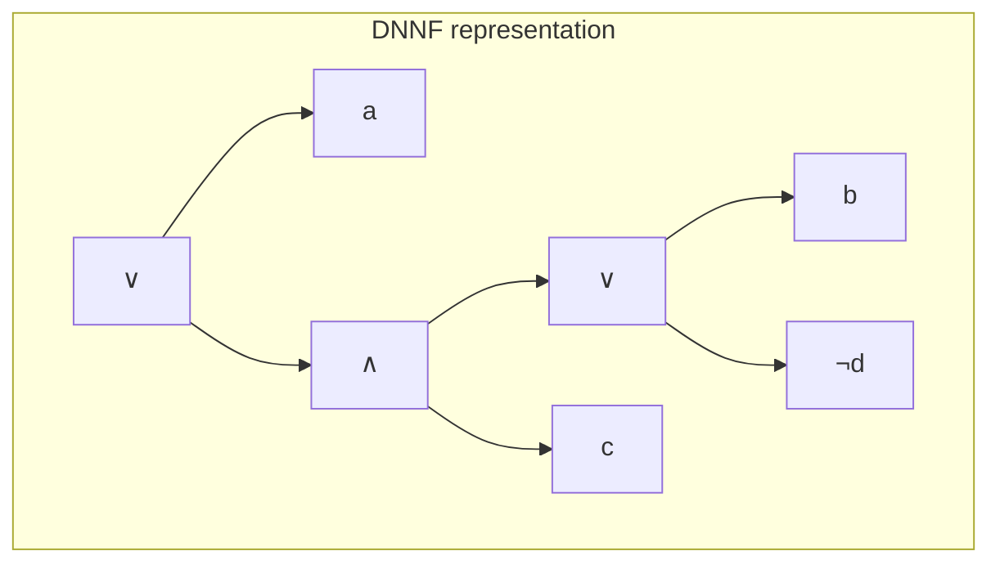
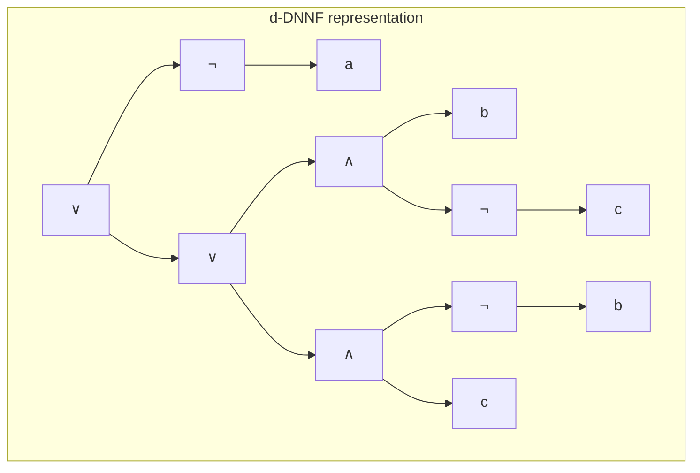
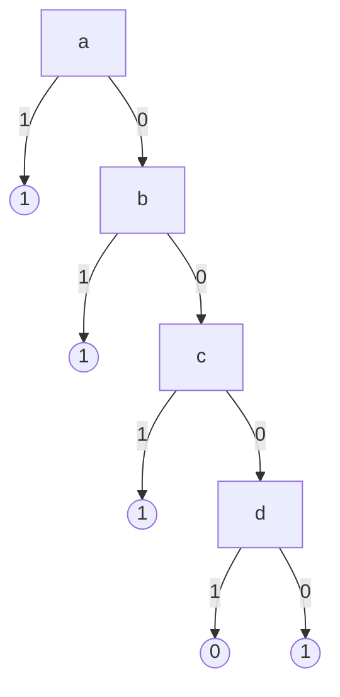
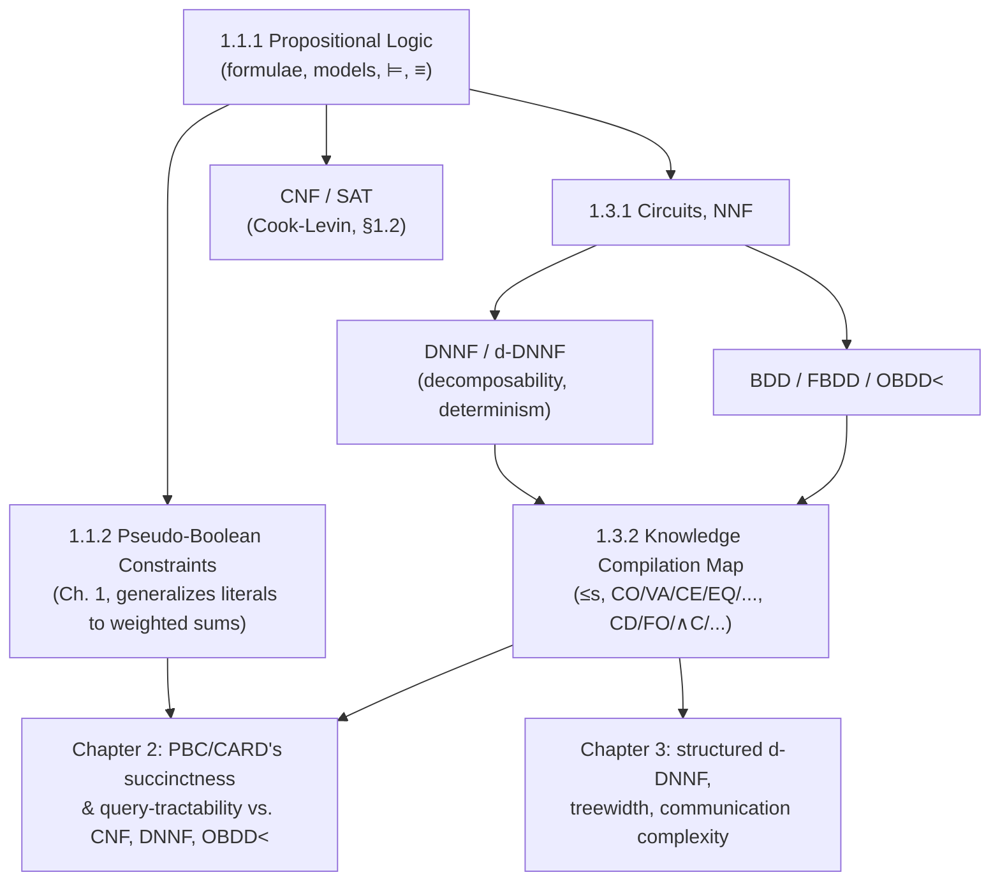

[[book-guidelines|↩ Back to guidelines]]

## Why this chapter exists before anything else

Wallon's thesis is fundamentally about a tradeoff: pseudo-Boolean (PB) constraints are a *more succinct* way to encode Boolean knowledge than CNF, but that succinctness has to be paid for somewhere. To even state that tradeoff precisely — "more succinct," "harder to query," "no extra tractable transformations" — you need a vocabulary in which "succinct" and "tractable" aren't hand-waves but the outputs of an actual definition you could implement a checker against. That's what Chapter 1 builds, and section 1.1.1 in particular is the base layer: formulae, models, entailment, and the CNF/DNF normal forms that every later chapter assumes you already have crisp definitions for.

Section 1.3 (compilation languages, and the *[[Knowledge-Compilation|Knowledge Compilation]] Map* of Darwiche and Marquis) exists for a second, related reason. The thesis's whole research program — "can pseudo-Boolean constraints replace CNF as a representation language?" — is only a well-posed question because there's a pre-existing methodology for comparing representation languages along two axes: how *succinct* they are (spatial efficiency) and which *queries and transformations* they support in polynomial time (temporal efficiency). NNF, DNNF, d-DNNF, and the BDD family are the languages that methodology was built around, and Chapter 2 will slot PB constraints into that same map. If you don't have DNNF's decomposability/determinism distinction solid before Chapter 2, "PBC and CARD are incomparable with DNNF" will read as a fact to memorize rather than a fact you can re-derive.

So: two things get built in this article. First, the syntax/semantics layer for propositional logic (formulae → interpretations → models → entailment → normal forms). Second, the *compiled* representations sitting on top of that layer — circuits, NNF, DNNF/d-DNNF, and BDDs — which trade a more restrictive shape for guaranteed cheap queries later.

## Part 1 — Formulae, literals, clauses, and normal forms

### The formula language itself

Wallon starts from the smallest possible base (Def. 1): $\mathrm{Prop}_{PS}$, the set of propositional formulae over a set $PS$ of variables, is the smallest set closed under

$$
v \in PS \cup \{\bot, \top\} \implies v \in \mathrm{Prop}_{PS}, \qquad
\varphi,\psi \in \mathrm{Prop}_{PS} \implies \neg\varphi,\ (\varphi \land \psi),\ (\varphi \lor \psi) \in \mathrm{Prop}_{PS}.
$$

This is a recursive/inductive definition in the same sense as any AST grammar — and that's exactly how you should read it if you've built a parser before. Every formula is either an atom (a variable, $\top$, or $\bot$) or a compound built from strictly smaller formulae via $\neg$, $\land$, $\lor$. $\mathrm{var}(\varphi)$ (Notation 1) is just the set of variable-leaves reachable in that tree.

```rust
enum Formula {
    Var(String),
    Top,
    Bot,
    Not(Box<Formula>),
    And(Box<Formula>, Box<Formula>),
    Or(Box<Formula>, Box<Formula>),
}
```

This is a completely unremarkable sum type — which is the point. Def. 1 is telling you "propositional formula" *means* "the free term algebra generated by this signature," nothing more mystical. The book's **size** measure, $|\varphi|$ (Def. 2), is the count of variable- and connective-*occurrences*, parentheses excluded (Remark 2) — i.e. exactly the node count of the AST above, since parentheses never become nodes in the `enum`. For $\varphi = a \lor \neg(\neg(b \lor c) \lor d)$ (the book's running Example 1), $|\varphi| = 9$: that's one node per symbol occurrence, and it will resurface constantly later as the unit in which the thesis measures "how much bigger is representation $X$ than representation $Y$."

**What breaks without a formal size measure:** without Def. 2, "PB constraints are more succinct than CNF" (the thesis's central succinctness claim) has no way to be made precise — succinctness (Def. 52, below) is *defined* in terms of a polynomial bound on $|\psi|$ relative to $|\varphi|$. No size measure, no succinctness theory.

### Boolean functions and interpretations

A **Boolean function** (Def. 3) is just $f : \mathbb{B}^n \to \mathbb{B}$ — nothing about syntax yet, purely an extensional object: given an assignment, it accepts (1) or rejects (0). The bridge from syntax (formulae) to semantics (Boolean functions) is the **interpretation** (Def. 4): a total function $I : V \to \mathbb{B}$ for some $V \subseteq PS$, *complete* when $V \supseteq \mathrm{var}(\varphi)$, *partial* otherwise (with **extension**, Def. 5, formalizing "assigning more variables without changing existing assignments").

```rust
use std::collections::HashMap;
type Interpretation = HashMap<String, bool>;

fn eval(f: &Formula, i: &Interpretation) -> bool {
    match f {
        Formula::Top => true,
        Formula::Bot => false,
        Formula::Var(v) => i[v],
        Formula::Not(a) => !eval(a, i),
        Formula::And(a, b) => eval(a, i) && eval(b, i),   // min(I(a), I(b))
        Formula::Or(a, b) => eval(a, i) || eval(b, i),    // max(I(a), I(b))
    }
}
```

That `eval` function *is* Def. 6 (Semantics) — the book states conjunction/disjunction as $\min$/$\max$ over $\{0,1\}$ rather than `&&`/`||` precisely because it wants the definition to generalize uniformly to pseudo-Boolean arithmetic later (a constraint's satisfaction is itself an arithmetic inequality). A **model** is an interpretation $I$ with $I(\varphi) = 1$; a **counter-model**, $I(\varphi) = 0$ (Def. 7) — for $\varphi = a \lor \neg(\neg(b\lor c)\lor d)$, $I(a)=1, I(b)=I(c)=I(d)=0$ is a model, while flipping to $I(a)=I(b)=I(c)=0, I(d)=1$ gives a counter-model (Example 3).

### Entailment, equivalence, validity — the semantic relations everything else reduces to

Three relations, all defined purely in terms of the model sets just introduced:

- **Logical entailment** $\varphi \models \psi$ (Def. 8): every model of $\varphi$ is a model of $\psi$. Equivalently (Remark 3), $\varphi \models \psi \iff \varphi \land \neg\psi \models \bot$ — this reformulation is *the* reason SAT solvers can be used as entailment checkers: asking "does $\varphi$ entail $\psi$?" reduces to asking "is $\varphi \land \neg\psi$ unsatisfiable?", a single SAT call.
- **Logical equivalence** $\varphi \equiv \psi$ (Def. 9): same model set exactly (i.e. $\varphi \models \psi$ and $\psi \models \varphi$).
- **Validity** (Def. 17): $\varphi$ is valid iff *every* interpretation of $\mathrm{var}(\varphi)$ is a model — equivalently, $\neg\varphi$ is contradictory (unsatisfiable, Def. 15).

**What breaks without the $\models / \equiv$ distinction:** later, the Knowledge Compilation Map defines a whole family of query problems (CO, VA, CE, EQ, SE...) that are pairwise *different complexity questions* precisely because entailment and equivalence are different relations with different quantifier structure ($\forall$ over one model set vs. $\forall$ over both). Collapsing them would collapse Table 1.3's entire structure into one row.

Theorem 1 (Folklore) then gives the usual equational theory — commutativity, associativity, idempotency, distributivity, double-negation, De Morgan — which is exactly the rewrite-rule set a normalizer/CNF-converter pass would implement. Example 5 walks $\varphi = a \lor \neg(\neg(b\lor c)\lor d)$ through exactly such a rewrite chain down to $(a\lor b\lor c)\land(a\lor\neg d)$ — i.e., CNF.

```python
# A five-line sketch of what Theorem 1's involution + De Morgan rules do
# to push negations to the leaves — the first pass of any CNF converter.
def push_negation(f):
    match f:
        case ('not', ('not', x)):        return push_negation(x)                    # involution
        case ('not', ('and', x, y)):     return ('or',  push_negation(('not', x)), push_negation(('not', y)))
        case ('not', ('or',  x, y)):     return ('and', push_negation(('not', x)), push_negation(('not', y)))
        case ('and', x, y):              return ('and', push_negation(x), push_negation(y))
        case ('or',  x, y):              return ('or',  push_negation(x), push_negation(y))
        case _:                          return f
```

### Literals, clauses, CNF, terms, DNF

- **Literal** (Def. 10): a variable $v$ or its negation $\neg v$; $\overline{\ell}$/$\bar v$ denotes the complement, and $\neg\neg v$ is folded back to $v$ using involution (so literals form a two-element quotient per variable, not an unbounded negation tower).
- **Clause** (Def. 11): a disjunction of literals, or $\bot$ (the **empty clause**, Def. 16 — always contradictory, since an empty disjunction has no way to become true).
- **Conjunctive Normal Form** (Def. 12): a conjunction of clauses, or $\top$.
- **Term/cube** (Def. 13) and **Disjunctive Normal Form** (Def. 14): the dual notions — a conjunction of literals (or $\top$, the **empty term**, Def. 18 — always valid), and a disjunction of terms.

Remark 5 licenses the representation you actually want to implement with: since $\land$/$\lor$ are commutative, associative, and idempotent (Theorem 1), a clause is *just a set of literals* and a CNF formula is *just a set of clauses* — order and duplication carry no semantic information. This is why every real SAT solver's internal data structure is `Vec<Vec<Literal>>` (or a sharper watched-literal structure over the same shape) rather than a literal binary tree of `And`/`Or` nodes:

```rust
#[derive(Clone, Copy, PartialEq, Eq, Hash)]
struct Literal { var: u32, polarity: bool }   // ℓ = v or ℓ = ¬v  (Def. 10)

type Clause = Vec<Literal>;                    // disjunction of literals, or empty ⇒ ⊥  (Def. 11)
type Cnf    = Vec<Clause>;                     // conjunction of clauses, or empty ⇒ ⊤   (Def. 12)
```

Consistency/contradiction (Def. 15) is then just "does this `Cnf` have a satisfying assignment" — the SAT problem proper, whose NP-completeness (Cook's theorem, covered a few pages later in 1.2) is the complexity anchor for the entire compilation-vs-solving tension this thesis studies.

## Part 2 — From formulae to circuits: NNF, DNNF, and d-DNNF

### Why generalize formula to circuit at all

A formula, as an AST, forces every subterm to be used exactly once — if $a$ appears twice in $\varphi$, the tree has two separate `Var("a")` leaves. That's wasteful, and worse, it caps how compact your representation can be: a formula's size is always at least linear in the number of *syntactically distinct* subformula occurrences, even when many of them are semantically (or even structurally) identical.

A **circuit** (Def. 38) fixes this by generalizing "tree" to "directed acyclic graph": internal/root nodes are gates ($\lor,\land,\neg$), leaves are variables or constants, and — crucially — a node can have multiple parents, so a repeated subexpression is computed once and *shared*. The book additionally assumes the **read-once property**: each input variable labels exactly one leaf. Semantics (Def. 39) is the same recursive $\min$/$\max$/$1{-}x$ evaluation as before, just over a DAG instead of a tree, so model/entailment/equivalence/validity all lift unchanged.

```rust
use std::rc::Rc;

enum Gate {
    Var(u32),
    Const(bool),
    Not(Rc<Gate>),
    And(Vec<Rc<Gate>>),
    Or(Vec<Rc<Gate>>),
}
// Rc lets two different `And` nodes point at the same shared `Rc<Gate>` subgraph —
// this sharing is exactly what a formula-as-tree cannot express, and it's the
// mechanism every later succinctness gap (NNF vs. CNF, DNNF vs. NNF, ...) rides on.
```

**What breaks without circuits:** every succinctness result in section 1.3.2 — "DNNF is strictly more succinct than DNF," "OBDD$_<$ is strictly less succinct than FBDD" — depends on being able to build formulas whose DAG representation is polynomial but whose *tree* (formula) representation is exponential. Without DAG sharing as a first-class notion, that whole comparison collapses to "everything is as succinct as everything else, trivially, because they're all trees."

**Negation Normal Form** (Def. 40): a circuit is in NNF when every $\neg$-node's child is a leaf — negation only ever touches a variable directly, never a compound. (Notation 7: since negations only ever sit right above leaves in NNF, you conventionally just write literals as the leaves and drop $\neg$ as a separate node type — which is exactly what the `Literal` struct above already does.) CNF and DNF (Defs. 12, 14) are both immediately seen to be special cases of NNF once you notice that a clause/term is a shallow $\lor$/$\land$ of literals — no deeply-nested negation ever occurs in either. **Prime implicants** (Def. 41, a $\models$-minimal term entailing $\varphi$) and **prime implicates** (Def. 42, a $\models$-minimal clause entailed by $\varphi$) give two more NNF sublanguages, **IP** and **PI** (Def. 43) — a DNF/CNF formula written as exactly the disjunction of its prime implicants / conjunction of its prime implicates.

### Decomposability and determinism — the two properties that make DNNF useful

These are properties of *individual gates*, not of a whole circuit:

- **Decomposability** (Def. 44): a conjunction $\varphi_1 \land \dots \land \varphi_n$ is decomposable iff the $\varphi_i$ share no variables — $\mathrm{var}(\varphi_i) \cap \mathrm{var}(\varphi_j) = \emptyset$ for $i \neq j$.
- **Determinism** (Def. 45): a disjunction $\varphi_1 \lor \dots \lor \varphi_n$ is deterministic iff the disjuncts share no models — $\varphi_i \land \varphi_j \models \bot$ for $i \neq j$.

**Why these particular properties, and not some other restriction?** Remark 10 gives the payoff directly: model counting becomes *compositional*. The number of models of a decomposable conjunction is the **product** of each conjunct's model count (because the conjuncts range over disjoint variable sets — pick any model of each independently and you get a model of the whole); the number of models of a deterministic disjunction is the **sum** of each disjunct's model count (because no model is double-counted across branches). Recursive, linear-time #SAT on the circuit follows immediately by structural induction. Without decomposability, you'd need inclusion-exclusion over conjuncts (exponential in the worst case); without determinism, the same for disjuncts.

**Decomposable NNF (DNNF)** (Def. 46): every conjunction in the circuit is decomposable. **Deterministic decomposable NNF (d-DNNF)**: DNNF, plus every disjunction is deterministic. For $\varphi = a \lor \neg(\neg(b\lor c)\lor d)$, the book gives both a DNNF and a (stricter) d-DNNF representation:





In the DNNF version, the top `∧` combines $a$ and $\neg\!\left(\neg(b\lor c)\lor d\right)$-shaped subgraphs — decomposable because $a$'s variable set $\{a\}$ is disjoint from the other side's $\{b,c,d\}$ — but its inner `∨` over $b$ and $\neg d$ is *not* required to be deterministic, and generally isn't (both disjuncts can be true simultaneously). The d-DNNF version restructures the disjunctions so that every `∨`'s branches are mutually exclusive, at the cost of a more complex (case-split) shape. This exactly mirrors a familiar compiler tradeoff: DNNF is like allowing arbitrary (possibly overlapping) pattern-match arms; d-DNNF is like requiring the arms to be *exhaustive and non-overlapping*, which is what lets a downstream analysis (here, model counting; in a compiler, exhaustiveness checking or jump-table codegen) run a simple structural recursion instead of a more expensive fixup.

## Part 3 — Binary Decision Diagrams

### From circuits to decision trees with sharing

A **Binary Decision Diagram (BDD)** (Def. 47) takes a different generalization path than the circuit: instead of DAG nodes being logic gates, they're *decision points* — every internal node is labeled by a variable, has exactly two outgoing arcs (labeled 0 and 1, for that variable's two possible values), and the two leaves are the constants 0 and 1 themselves. Semantics (Def. 48) is read directly off the graph: a root-to-leaf-1 path is a (possibly partial) interpretation satisfying the formula; a root-to-leaf-0 path, one falsifying it.

This is precisely a **decision tree with shared subtrees** — the DAG-sharing idea from circuits, applied to the "if-then-else on a variable" representation instead of the "logic gate" representation. For $\varphi = a \lor \neg(\neg(b\lor c)\lor d)$ (Example 29, solid = 1-arc, dotted = 0-arc):



Two structural restrictions matter for the succinctness/tractability tradeoffs studied later:

- **Free BDD (FBDD)** (Def. 49): every root-to-leaf path visits each variable at most once — no path re-decides a variable it already branched on.
- **Ordered BDD (OBDD$_{<}$)** (Def. 50): an FBDD additionally respecting a single *global* total order $<$ on variables — if $M$ is an ancestor of $N$, then $v_M < v_N$, along *every* path, not just some. **OBDD** is the union over all possible orders $<$.

The distinction is exactly "local variable order" vs. "one fixed global variable order," and it matters enormously in practice: the diagram above respects $a < b < c < d$ everywhere, so it's an OBDD$_{<}$ for that order (Example 30). Reordering to $a < d < c < b$ gives a *differently shaped but still valid* OBDD for the same function — canonical BDD packages (like the classic CUDD library) fix one global order and get canonicity (unique reduced representation per function) as a bonus, which is exactly why OBDD$_{<}$ supports **equivalence checking in polynomial time** (Table 1.3's EQ column) while plain BDD does not: two OBDD$_<$'s over the same order represent the same function iff, after reduction, they are the *same graph* — a linear-time graph-isomorphism check, not a semantic search.

```rust
enum Bdd {
    Leaf(bool),
    Node { var: u32, low: Rc<Bdd>, high: Rc<Bdd> },  // low = 0-arc, high = 1-arc
}

fn eval(b: &Bdd, i: &Interpretation) -> bool {
    match b {
        Bdd::Leaf(v) => *v,
        Bdd::Node { var, low, high } =>
            if i[&var.to_string()] { eval(high, i) } else { eval(low, i) },
    }
}
// FBDD ⇔ no path visits the same `var` twice.
// OBDD< ⇔ FBDD + a single global order enforced on every root-to-leaf path,
// which is exactly the invariant Rust's type system can't check for you here —
// it has to be an explicit build-time invariant of whatever constructs the Bdd.
```

**What breaks without the ordered restriction:** a plain (unordered) FBDD can represent some functions far more compactly than any OBDD$_<$ for a *badly chosen* order can — order matters a lot for size (this is the classical BDD folklore: an $n$-bit multiplier has polynomial OBDD size for no variable order at all, while other functions blow up exponentially under a bad order but stay small under a good one). The FBDD/OBDD split is precisely the tension between "smallest possible representation" and "canonical, easily comparable representation" — you cannot always have both.

## Part 4 — The Knowledge Compilation Map: how these languages get compared

Section 1.3.2 supplies the actual measuring stick the earlier definitions were built for: given the menu of languages just introduced (NNF, DNNF, d-DNNF, sd-DNNF, FBDD, OBDD, OBDD$_<$, DNF, CNF, PI, IP, MODS), how do you decide which one to compile *to*?

Two structural relations:

- **Expressiveness** $L \le_e L'$ (Def. 51): every function representable in $L'$ is representable in $L$. (All the languages above turn out to be equally expressive — they can all represent every Boolean function — so this axis doesn't actually discriminate between them here.)
- **Succinctness** $L \le_s L'$ (Def. 52): every function representable in $L'$ has an $L$-representation whose size is bounded by a *fixed polynomial* in the $L'$-representation's size. This is where the size measure from Def. 2/38/47 finally pays off — succinctness is a precise, checkable claim about size *growth*, not a vague "is more compact" intuition.

Table 1.2's succinctness ordering (NNF is at least as succinct as everything; going down to CNF, PI, IP, MODS the languages get strictly *less* succinct — CNF cannot, in general, polynomially simulate DNNF's size) is the direct ancestor of Chapter 2's central results: pseudo-Boolean constraints (PBC/CARD) turn out to be strictly more succinct than CNF but *incomparable* with DNNF, OBDD$_<$, NNF, and IP — meaning succinctness gains and query tractability don't automatically travel together, and the whole point of building this map first is to make that kind of "gain here, no gain there" claim precise rather than impressionistic.

The other two axes — **queries** (CO, VA, CE, IM, EQ, SE, CT, ME; Defs. 53–58) and **transformations** (CD, FO, SFO, $\land$C, $\land$BC, $\lor$C, $\lor$BC, $\neg$C; Defs. 59–65) — measure whether a *fixed* representation supports a given operation in polynomial time. Tables 1.3–1.4 make the tradeoff concrete: NNF (maximally succinct) offers essentially *no* tractable queries (every column is $\circ$ except when $P=NP$); OBDD$_<$ (least succinct in its family) offers *every* query and transformation in polynomial time except unbounded disjunction-closure. DNNF and d-DNNF sit in between: d-DNNF's determinism buys CT (counting) and ME (enumeration) that DNNF alone doesn't guarantee (this is exactly Remark 10's compositional-counting argument, now formalized as a language-level property in Table 1.3), at the cost of losing closure under conjunction/disjunction that plain NNF still has. There is no free lunch here — this table *is* the reason the field studies dozens of restricted normal forms instead of just using one.

## Where this leads

Structurally, this chapter is the load-bearing foundation for two separate later stories in the thesis:



Everything downstream of section 1.3 — Chapter 2's succinctness diagram (Fig. 2.1), Chapter 3's structured-DNNF/treewidth machinery — is a direct application of the vocabulary built here: "is language $X$ more succinct than $Y$," "does $X$ support query $Q$ in polynomial time," phrased using exactly Defs. 51–65.

For the **`sat-smt-csp`** focus area specifically: this chapter *is* the formal substrate SAT/SMT/CSP work sits on — every SAT solver is, underneath, a consistency-query ($\mathrm{CO}$) engine for CNF, and every reduction from entailment or equivalence checking to a SAT call leans on the $\varphi\models\psi \iff \varphi\land\neg\psi\models\bot$ identity from Remark 3. The DNNF/d-DNNF and BDD material is also the direct formal ancestor of *symbolic model checking*: OBDD-based reachability analysis (computing the set of reachable states of a transition system by iterating $\exists$-forgetting and disjunction over an OBDD-represented state set) is historically the technique that made model checking scale to industrial hardware designs, and it's exactly the FO/SFO (forgetting) and $\lor$C (disjunction-closure) transformation properties from Table 1.4 that make that iteration terminate in practice. If your CSP/abstract-interpretation kernel ever needs to represent and manipulate large sets of concrete states or assignments compactly, DNNF's compositional counting and OBDD$_<$'s canonicity are the two standard starting points, and this chapter is where their exact guarantees (and exact limits — no closure under conjunction for d-DNNF, no better-than-exponential worst case for OBDD under a bad order) are pinned down precisely rather than folklorically.
