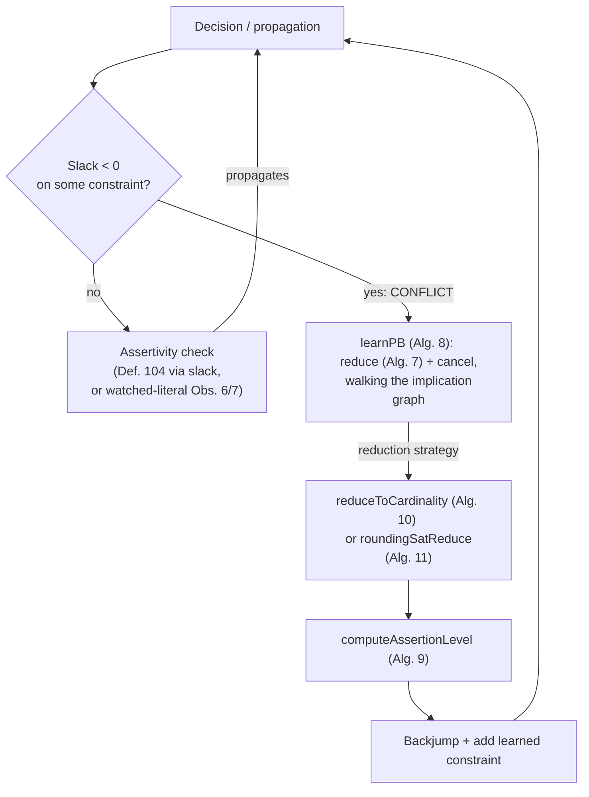

[[book-guidelines|↩ Back to guidelines]]

## Why CDCL needs a rewrite, not just a reinterpretation

CDCL SAT solving rests on a small number of load-bearing tricks: unit propagation detected via watched literals, conflicts recorded as an implication graph, and conflicts *resolved* into a new learned clause via the resolution rule, backjumping to the first level where that clause becomes unit. All of it is clause-shaped. A clause $\ell_1 \lor \dots \lor \ell_n$ propagates its last literal only when every other literal is falsified, and once falsified stays falsified — nothing about it changes if the assignment order changes, because a clause only ever asks "is at least one of you true?"

A pseudo-Boolean (PB) constraint $\sum_i \alpha_i \ell_i \ge \delta$ asks a *counting* question instead: "does the weighted sum of true literals reach $\delta$?" That single change breaks every clause-era assumption:

- **A clause propagates at most one literal at a time** (the last unfalsified one). A PB constraint can propagate *several* literals simultaneously at the same decision level, because several literals can simultaneously be "too important to leave false."
- **A clause's propagation status only changes when a literal *in it* is assigned.** A PB constraint can start propagating (or stop) purely because of *how much slack remains*, which is a global property of all its literals together, not a local one.
- **A clause never "changes its mind."** A PB constraint can propagate a literal at one decision level, and only later — with more literals assigned — become outright *conflicting*, even though nothing about that specific literal changed.

So a pseudo-Boolean CDCL solver needs three things reinvented from scratch, and this article works through the book's construction of each: how to *detect* that a constraint propagates or conflicts (the slack), how to keep that detection *cheap* (watched literals generalized to weighted sums), and how to *learn* a new constraint from a conflict when the underlying proof system is cutting planes rather than resolution. This is the machinery inside Sat4j and RoundingSat, the two solvers the thesis benchmarks throughout.

> The cutting-planes proof system itself — its axioms, the generalized-resolution subsystem, and its p-simulation of resolution — is developed in [[The-Cutting-Planes-Proof-System|The Cutting Planes Proof System]]. This article uses that system's rules (addition, multiplication, division, cancellation, saturation, weakening) as *tools* a solver calls, without re-deriving their soundness.

---

## 1. The slack: a single number that answers "propagate or conflict?"

### What breaks without it

In a SAT solver, detecting a unit clause is syntactic: count unassigned/true literals, if exactly one remains and none are true, propagate it. For a PB constraint you can't just count literals — a coefficient-8 literal and a coefficient-1 literal contribute wildly different amounts toward satisfying $\ge \delta$. You need a quantity that tracks *how much room is left*.

### Definition

> **Definition 103 (Slack).** For $\chi \equiv \sum_{i=1}^n \alpha_i \ell_i \ge \delta$, under the current partial assignment,
> $$\mathrm{slack}(\chi) = \Big(\sum_{i=1,\, \ell_i \neq 0}^{n} \alpha_i\Big) - \delta$$

In words: sum the coefficients of every literal that is *not currently falsified* (i.e. true or still unassigned — the "optimistic" literals), and subtract the degree. This is the maximum amount by which the constraint could still be over-satisfied if every remaining literal turned out true. (The book also calls this quantity *poss*, and defines the *absolute slack* as the same sum computed with no assignment at all — i.e. over all literals.)

**Example (the book's Example 49/50).** $8a + 2b + c + d \ge 10$, with $a$ satisfied at level 0 and $d$ falsified at level 3: $8a(1@0) + 2b(?@?) + c(?@?) + d(0@3) \ge 10$. Only $b$ and $c$ remain non-falsified besides the already-true $a$: slack $= (8+2+1) - 10 = 1$. (The absolute slack, ignoring the assignment entirely, is $8+2+1+1-10=2$.)

The payoff is immediate:

> **Observation 5.** If $\mathrm{slack}(\chi) < 0$, then $\chi$ is conflicting under the current partial assignment.

This is the natural generalization of "all literals falsified" — a negative slack means even satisfying *every* remaining literal isn't enough.

> **Definition 104 (Assertive constraint).** $\chi$ is *assertive* if it has an unassigned literal $\ell$ with coefficient $\alpha$ such that $\alpha > \mathrm{slack}(\chi)$. That literal $\ell$ is propagated.

The intuition: if $\ell$ were falsified instead of assigned true, the slack would drop to $\mathrm{slack}(\chi) - \alpha < 0$ — a conflict. So $\ell$ must be forced true (or its negation, if the coefficient is on $\bar\ell$) to prevent that. Applied to the running example: $8a+2b+c+d\ge10$ has slack 2 unassigned, so $b$ (coefficient 2, no — wait, it's $a$ with coefficient 8 > slack 2 that's forced first at decision level 0. Once $a$ is fixed and $d$ later falsifies, the residual constraint has slack 1, and *now* $b$ (coefficient $2 > 1$) is forced. Two propagations from the same constraint, at two different times — something no clause could ever do.

### Grounding: slack as a field you maintain incrementally

```rust
/// A normalized pseudo-Boolean constraint: sum(alpha_i * lit_i) >= degree,
/// with all alpha_i > 0 (negative literals absorbed via the `negation` axiom,
/// see the sibling article on the cutting-planes proof system).
struct PbConstraint {
    lits: Vec<Literal>,
    coeffs: Vec<u64>,
    degree: u64,
    /// slack(chi) under the *current* trail; recomputed incrementally.
    slack: i64,
}

enum LitStatus { True, False, Unassigned }

impl PbConstraint {
    /// Called whenever `lit` (one of this constraint's literals) is assigned.
    fn on_literal_falsified(&mut self, idx: usize) {
        // The literal leaves the "non-falsified" sum: slack drops by its coefficient.
        self.slack -= self.coeffs[idx] as i64;
    }

    fn on_literal_unassigned(&mut self, idx: usize) {
        // Backtracking: the literal re-enters the non-falsified sum.
        self.slack += self.coeffs[idx] as i64;
    }

    fn is_conflicting(&self) -> bool {
        self.slack < 0 // Observation 5
    }

    /// Definition 104: an unassigned literal whose coefficient exceeds the slack
    /// is forced true.
    fn assertive_literal(&self, status: &[LitStatus]) -> Option<Literal> {
        self.lits.iter().zip(&self.coeffs).zip(status)
            .find(|((_, &coeff), st)| matches!(st, LitStatus::Unassigned) && coeff as i64 > self.slack)
            .map(|((&lit, _), _)| lit)
    }
}
```

Note the `slack` field is exactly the counter you'd maintain if you were implementing bounds propagation for a linear integer inequality in a CP solver's domain-propagation loop — a pseudo-Boolean constraint *is* a linear inequality over $\{0,1\}$-domain variables, and `slack` is precisely the "how much headroom does this bound have" quantity a CP propagator tracks per constraint. This is the same structural idea RoundingSat's and Sat4j's propagators use, dressed as a Rust struct.

---

## 2. Watched literals, generalized

### Why maintaining the slack directly is expensive

The `on_literal_falsified`/`on_literal_unassigned` scheme above requires touching the constraint's slack on *every* assignment and *every* backtrack of any of its literals — this is the pseudo-Boolean analogue of the naive *counter-based* propagation scheme that watched literals were invented to avoid in clausal SAT solving. You'd like something that, like clausal watched literals, needs no update at all on backtracking and only rarely needs an update on assignment.

### Cardinality constraints: the easy generalization

For a cardinality constraint (all $\alpha_i = 1$) of degree $\delta$:

> **Observation 6.** A cardinality constraint of degree $\delta$ with at least $\delta+1$ non-falsified literals cannot be assertive.

So watch exactly $\delta + 1$ literals; as long as none of them is falsified, no propagation is possible and nothing needs checking. This is a direct generalization of clause watching (a clause is a degree-1 cardinality constraint, and you watch $1+1=2$ literals — exactly standard SAT practice).

### Pseudo-Boolean constraints: watching enough *weight*, not enough *literals*

With unequal coefficients, "enough literals" isn't the right invariant — "enough total weight" is:

> **Observation 7.** If a set $W$ of non-falsified literals has $\sum_{\ell_i \in W} \alpha_i > \delta + \alpha_{\max}$ (where $\alpha_{\max}$ is the largest coefficient among *unassigned* literals), the constraint is not assertive.

The reasoning: even if the single largest-remaining-coefficient literal in $W$ were forced false, the rest of $W$ alone would still cover $\delta$, so nothing is forced yet. Algorithm 6 (`updateWatchedLiteralsPB`) implements this: when a watched literal falsifies, greedily pull in more non-watched literals (largest coefficient first) until the watched-set's weight again clears $\delta + \alpha_{\max}$; if it can't (total available weight drops below $\delta$), the constraint is conflicting; otherwise, any literal whose coefficient exceeds the resulting margin $m = S - \delta$ is propagated.

**Worked example (the book's Example 52).** $5a + 2b + 2c + 2d + 2e + f \ge 6$. Initially $\alpha_{\max}=5$, so watched weight must exceed $5+6=11$: watch $\{a,b,c,d\}$ (weight 11). When $a$ falsifies, $\alpha_{\max}$ drops to 2 (now the largest *unassigned* coefficient), so the threshold drops to $2+6=8$: watch $\{b,c,d,e\}$ (weight 8). When $b$ then falsifies, watching $\{c,d,e,f\}$ only reaches weight 7 < 8 needed — so everything with coefficient $> 8-6=2$ is propagated: $c$, $d$, $e$. Note that the just-falsified literal $b$ stays in the watched set (even though falsified) purely so that a later backjump needs no re-scan — the same trick clausal watched literals use.

```rust
struct WatchState {
    watched: Vec<usize>,   // indices into lits/coeffs currently watched
}

/// Mirrors Algorithm 6. Called when a watched literal `falsified_idx` becomes false.
fn update_watched_pb(chi: &PbConstraint, ws: &mut WatchState, status: &[LitStatus],
                      falsified_idx: usize) -> PropagateResult {
    ws.watched.retain(|&i| i != falsified_idx);
    let mut sum: i64 = ws.watched.iter().map(|&i| chi.coeffs[i] as i64).sum();

    let alpha_max = status.iter().enumerate()
        .filter(|(_, s)| matches!(s, LitStatus::Unassigned))
        .map(|(i, _)| chi.coeffs[i] as i64)
        .max().unwrap_or(0);

    // candidates not yet watched, sorted by descending coefficient
    let mut candidates: Vec<usize> = (0..chi.lits.len())
        .filter(|&i| !matches!(status[i], LitStatus::False) && !ws.watched.contains(&i))
        .collect();
    candidates.sort_by_key(|&i| std::cmp::Reverse(chi.coeffs[i]));

    let mut it = candidates.into_iter();
    while sum < chi.degree as i64 + alpha_max {
        match it.next() {
            Some(i) => { sum += chi.coeffs[i] as i64; ws.watched.push(i); }
            None => break,
        }
    }

    if sum < chi.degree as i64 {
        ws.watched.push(falsified_idx); // keep it watched for backjump stability
        return PropagateResult::Conflict;
    }

    let margin = sum - chi.degree as i64;
    let mut to_propagate = vec![];
    for &i in &ws.watched {
        if margin < chi.coeffs[i] as i64 {
            if matches!(status[i], LitStatus::False) {
                ws.watched.push(falsified_idx);
                return PropagateResult::Conflict;
            }
            to_propagate.push(chi.lits[i]);
        }
    }
    PropagateResult::Propagate(to_propagate)
}
```

### Trading precision for simplicity: the conservative $\alpha_{\max}$

Recomputing $\alpha_{\max}$ exactly on every update costs a scan. **Galena** and **Pueblo** instead fix $\alpha_{\max}$ to the constraint's *global* largest coefficient, never updated. This over-watches (Example 53: watching $\{b,c,d,e,f\}$ where $\{b,c,d,e\}$ would have sufficed) but skips the recomputation cost. **RoundingSat**'s later *opt-watch* scheme goes further: it never looks for replacement literals when an "excess" watched literal (one beyond what's strictly necessary) falsifies, and keeps watched literals index-sorted by coefficient to make the propagation scan itself cheap.

Empirically (Figure 4.2, Sat4j on the PB-evaluation benchmark suite), **watched-literal schemes clearly outperform maintaining the slack directly** — the same lesson SAT solving learned a decade earlier, just re-derived for weighted constraints. Sat4j nonetheless defaults to slack-based detection for general PB constraints (simpler to implement correctly) while using watched literals for cardinality constraints and clauses; the original RoundingSat uses watched literals with the conservative $\alpha_{\max}$ throughout.

---

## 3. Conflict analysis: cancellation instead of resolution

### The mechanics, briefly

Cutting planes' **cancellation rule** eliminates a pivot literal $\ell$ between a reason $\alpha\ell + \sum \alpha_i \ell_i \ge \delta$ and a constraint $\beta\bar\ell + \sum \beta_i\ell_i' \ge \delta'$ containing $\bar\ell$, by scaling both to equalize the pivot's coefficient ($\rho\alpha = \rho'\beta$, typically via $\mathrm{lcm}(\alpha,\beta)$) and adding. Written $\rho\chi \boxplus \rho'\chi'$, it always includes an implicit **saturation** step afterward (capping every coefficient at the degree) — this is what the sibling article calls the *generalized resolution* subsystem, and it plays the same structural role resolution plays in clausal conflict analysis: eliminate the disagreeing literal, walk the implication graph backward, stop at the first assertive constraint (the pseudo-Boolean analogue of the 1-UIP).

### What's new: cancellation doesn't automatically preserve the conflict

In SAT solvers, resolving a conflicting clause with a reason clause on the right pivot *always* yields another falsified clause — that's baked into resolution. Cancellation has no such guarantee, because slack doesn't add linearly, it only bounds sub-additively:

> **Proposition 32 (Subadditivity of the slack).** $\mathrm{slack}(\rho\chi \boxplus \rho'\chi') \le \rho\,\mathrm{slack}(\chi) + \rho'\,\mathrm{slack}(\chi')$.

This is an *upper bound*, not an equality — so a non-negative estimate doesn't prove the result is non-conflicting (it might still be, as Example 58 in the book shows: an estimate of $+2$ can still resolve to an actually-conflicting clause after saturation collapses coefficients). But a *negative* estimate is a hard guarantee. This asymmetry is exactly what a solver can exploit cheaply: compute the bound (an $O(1)$ arithmetic check given the two operand slacks) rather than materializing $\rho\chi \boxplus \rho'\chi'$ and rechecking.

**Worked example (the book's Example 57).** Reason $\chi_2 = 6\bar b + 6c + 4e + f + g + h \ge 7$ (slack 2), conflicting $\chi_3 = 5a + 4b + c + d \ge 6$ (slack $-1$). The bound is $2\cdot 2 + 3\cdot(-1) = 1 \ge 0$ — cancellation on $b$ is *not* guaranteed to preserve the conflict.

### Reduction: forcing the guarantee

Whenever the bound is non-negative, **Algorithm 7** (`reduce`) weakens non-falsified literals out of the *reason* (largest-coefficient-preserving choices vary by implementation; Sat4j prefers unassigned literals first) one at a time, recomputing the pivot ratio and bound each time, until the bound goes negative.

```
reduce(χ_r reason for ℓ, χ_c conflicting, containing ℓ̄):
    ρ, ρ' ← lcm-based scaling of the ℓ / ℓ̄ coefficients
    while ρ·slack(χ_r) + ρ'·slack(χ_c) ≥ 0:
        pick a non-falsified literal ℓ' ≠ ℓ in χ_r
        χ_r ← saturate(weaken(ℓ', χ_r))
        recompute ρ
    return χ_r
```

This always terminates with the conflict preserved: in the worst case *every* non-falsified literal besides the pivot is weakened away, leaving a constraint where $\ell$ alone must satisfy the degree — slack exactly 0 — and cancelling a slack-0 reason against a negative-slack conflict is guaranteed negative by the same subadditivity bound (**Proposition 33**). A sharper sufficient condition, not requiring iteration at all, covers the common case directly:

> **Proposition 34.** If $\chi_1$ propagates $\ell$ and $\chi_2$ (containing $\bar\ell$) is conflicting, then $\chi_1 \boxplus \alpha\chi_2$ is conflicting. *(Proof: $\mathrm{slack}(\chi_1)\le\alpha-1$ from assertivity, $\mathrm{slack}(\chi_2)\le -1$ from conflict, so the subadditive bound is $\le (\alpha-1) + \alpha(-1) = -1 < 0$.)*

**Continuing Example 57 into Example 59–60**: weakening $h$ from $\chi_2$ still isn't enough (bound still $\ge 0$); weakening $g$ too, then saturating, produces $\chi_2'' = 5\bar b + 6c + 4e + f \ge 5$ with slack 1, and now $4\cdot1 + 5\cdot(-1) = -1 < 0$ — safe to cancel. The resulting constraint, after cancelling on $b$, is $25a+25c+16e+5d+4f \ge 30$ — not yet assertive, so a second cancellation step (against $\bar e$'s reason, pivot coefficient conveniently 1 so no reduction needed) yields $41a+25c+21d+4f\ge46$, assertive and forcing $d$ at decision level 2. **Algorithm 8** (`learnPB`) is the top-level loop: repeatedly reduce-and-cancel against the reason of the most recently assigned literal still present, stopping the instant the running constraint is assertive (or returning `CONFLICT` outright if the process derives an assertive-at-nothing, i.e. unsatisfiable, constraint — something resolution-based clausal learning can never do mid-search).

```rust
fn learn_pb(mut chi: PbConstraint, graph: &ImplicationGraph) -> LearnResult {
    while let Some(lit) = chi.most_recent_assigned_literal() {
        let reason = graph.reason(lit.negate());
        let reduced = reduce(reason, &chi);          // Algorithm 7
        chi = cancel(reduced, chi);                  // ⊞, includes saturation
        if chi.is_assertive() {
            return LearnResult::Learned(chi);
        }
    }
    LearnResult::Conflict // the whole formula is proven unsatisfiable
}
```

### Assertion level: not always "one level back"

Because a PB constraint can be assertive at *several* different decision levels (it can propagate different literals at different times — the whole reason slack exists), the backjump target isn't simply "the second-highest level in the learned constraint," as in clausal 1-UIP. **Algorithm 9** scans the constraint's *falsified* literals (a propagation can only happen when a literal becomes falsified — matching against unassigned literals is a subtler, weaker check) and returns the *lowest* decision level $d'$ at which the constraint is still assertive. The book found empirically (Figure 4.3, a head-to-head scatter plot) that checking **falsified** literals for this scan rather than merely **assigned** literals yields systematically deeper, more effective backjumps — a small implementation choice with an outsized runtime effect, and an early example of the "generalize-then-remeasure" methodology this thesis uses throughout Part II.

---

## 4. Coefficient growth: cutting planes' hidden cost

### What breaks without controlling it

Cancellation multiplies constraints by $\rho, \rho'$ before adding — coefficients only ever grow (Example 60 above: $5,6,\dots \to 25,16,\dots \to 41,25,21,4$, after just two cancellation steps). Learned constraints get reused as reasons later, compounding the growth across the search. Once coefficients exceed machine-word range you lose fixed-precision arithmetic (`u64`/`i64`) and must fall back to arbitrary-precision (`gmp`-style) integers — dramatically slower per-operation, on the *hot path* of the solver. Two independent mitigations are used in practice.

### Mitigation A: collapse to a cardinality constraint

**Algorithm 10** (`reduceToCardinality`) derives, from a PB constraint, the *strongest cardinality constraint it entails*: greedily take literals in descending coefficient order until their sum clears $\delta$ (this fixes the cardinality degree $d$ — the minimum count of literals that must hold), then try to *drop* the smallest-coefficient literals from the *support set* as long as doing so doesn't change $d$ (tracked via a running margin $\mu = \delta - (s-\alpha_{\text{last}})$; any literal with coefficient $< \mu$ is redundant to keep).

**Worked example (the book's Example 61).** $8a+2b+c+d\ge10$: the greedy pass needs $a,b$ ($8+2=10\ge10$) so $d=2$, giving $a+b+c+d\ge2$. But $\mu=2$ and $\min$ coefficient among remaining literals ($c,d$, coefficient 1) is $<\mu$, so $d$ (then $c$, if it also qualifies) can be dropped: the *stronger* $a+b+c\ge2$. This strength gain isn't cosmetic — a smaller support with the same degree is a logically stronger (more restrictive) constraint.

```python
def reduce_to_cardinality(lits_by_desc_coeff, coeffs, degree):
    """Mirrors Algorithm 10. Python is fine here: this is a one-pass greedy
    scan with no hot-path arithmetic-growth concerns of its own."""
    s = 0
    d = 0
    alpha_last = 0
    support = list(zip(lits_by_desc_coeff, coeffs))  # descending by coeff
    for i, (lit, alpha) in enumerate(support):
        s += alpha
        alpha_last = alpha
        d += 1
        if s >= degree:
            break
    remaining = list(support)          # candidates for the cardinality's support
    mu = degree - (s - alpha_last)
    remaining.sort(key=lambda p: p[1]) # ascending coefficient, to drop cheapest first
    kept = {lit for lit, _ in support}
    for lit, alpha in remaining:
        if alpha < mu:
            kept.discard(lit)
            mu -= alpha
        else:
            break
    return kept, d   # cardinality constraint: sum(kept) >= d
```

Cardinality constraints get all the benefits of Observation 6's simple $\delta{+}1$-literal watching and fixed-precision arithmetic forever — this is the appeal of dedicated cardinality-only solvers like MiniCARD. The cost is strength: forcing every learned constraint down to unit coefficients throws away exactly the information (weighted trade-offs among literals) that made pseudo-Boolean reasoning more succinct than CNF in the first place. (One caveat the book flags — Remark 36 — is that reduction can strip a *learned* constraint of its conflicting status entirely if applied carelessly; Galena guards against this by pre-weakening all non-falsified literals first when preservation isn't already guaranteed.)

### Mitigation B: RoundingSat's weaken-then-divide

RoundingSat takes a different bet: keep general pseudo-Boolean constraints, but aggressively **divide by the pivot's own coefficient before cancelling**, so the pivot always ends up with coefficient exactly 1 on both sides — which, by Proposition 34, *guarantees* the cancellation preserves the conflict, no `reduce`-style search loop needed.

**Algorithm 11** (`roundingSatReduce`): for pivot coefficient $\alpha$, every literal whose own coefficient is *not divisible* by $\alpha$ and is *not currently falsified* is weakened away outright (division must be exact — this is the division rule from cutting planes, and Remark 30 in the proof-system article notes exact division is what makes it strictly stronger than resolution); every remaining coefficient is divided by $\alpha$. Crucially: **no saturation step** — RoundingSat's proof system is division-plus-cancellation without saturation, trading some strength (Example 62's result is provably no stronger than generalized resolution's; compare its $2c+d+e\ge1$ against Example 60's $41a+25c+21d+4f\ge46$ for the same conflict) for coefficients that shrink on every reduction step instead of only ever growing.

```rust
/// Mirrors Algorithm 11 (roundingSatReduce). No saturation — by design.
fn rounding_sat_reduce(chi: &mut PbConstraint, pivot_idx: usize, status: &[LitStatus]) {
    let alpha = chi.coeffs[pivot_idx] as i64;
    for i in 0..chi.lits.len() {
        let a_prime = chi.coeffs[i] as i64;
        let mut a_prime = a_prime;
        if !matches!(status[i], LitStatus::False) && a_prime % alpha != 0 {
            chi.degree -= a_prime as u64; // weaken it away
            a_prime = 0;
        }
        chi.coeffs[i] = (a_prime / alpha) as u64; // exact by construction
    }
}
```

Empirically (Figures 4.4–4.7), RoundingSat's approach clearly outperforms generalized resolution on most benchmark families in head-to-head comparisons within Sat4j, and the native C++ RoundingSat solver (4442/…instances solved, vs. Sat4j-RoundingSat's 3843) further shows how much of the remaining gap is implementation, not proof system. But — as the book stresses and as later chapters (irrelevant literals, weakening strategies) return to at length — *which* literals get weakened away by Algorithm 11's "not divisible by $\alpha$" test is not a free lunch; it is itself a source of derived-constraint weakness that the thesis spends its next two chapters characterizing.

---

## Synthesis



This machinery is the pseudo-Boolean re-implementation of the CDCL loop, constraint by constraint: **slack** replaces "count unfalsified literals," **generalized watched literals** replace clausal watched literals, **cancellation with reduction** replaces resolution, and **assertion-level search over falsified literals** replaces "second-highest decision level." Everything here assumes the cutting-planes rules (addition, multiplication, division, cancellation, saturation) are sound — that foundational work is [[The-Cutting-Planes-Proof-System|The Cutting Planes Proof System]]'s job, not this article's.

For the standing project (`sat-smt-csp`): a pseudo-Boolean constraint is exactly a linear integer inequality over Boolean-domain variables, and the slack is exactly the kind of bound a CP propagator maintains for domain/interval propagation — this section is close to a worked case study in how to build a bounds-consistency propagator with efficient incremental data structures (watched literals) plus a conflict-driven learning layer on top. The reduction algorithms (cardinality collapse, RoundingSat's weaken-and-divide) are direct instances of the strength/size/cost tradeoff any constraint-learning CSP or lazy-SMT kernel has to make when the underlying proof system allows arbitrarily strong but arbitrarily large derived facts — worth remembering when the standing project's own CSP kernel has to decide how aggressively to generalize a learned nogood over integer domains.

### Where this leads

Chapter 5 (**Irrelevant Literals in Pseudo-Boolean Constraint Learning**) shows that the very rules used here — weakening, division, cancellation — can silently introduce literals that don't affect the constraint's truth value at all, weakening what gets learned. Chapter 6 (**Weakening Strategies**) studies exactly *when and where* — conflict side vs. reason side — Algorithm 11-style weakening should be applied. Chapter 7 (**Adapting CDCL Strategies**) revisits branching, deletion, and restarts (briefly introduced but not detailed here, in §4.2.3) in light of the coefficient/slack structure this article develops. None of those chapters make sense without the slack-and-cancellation machinery built here.
