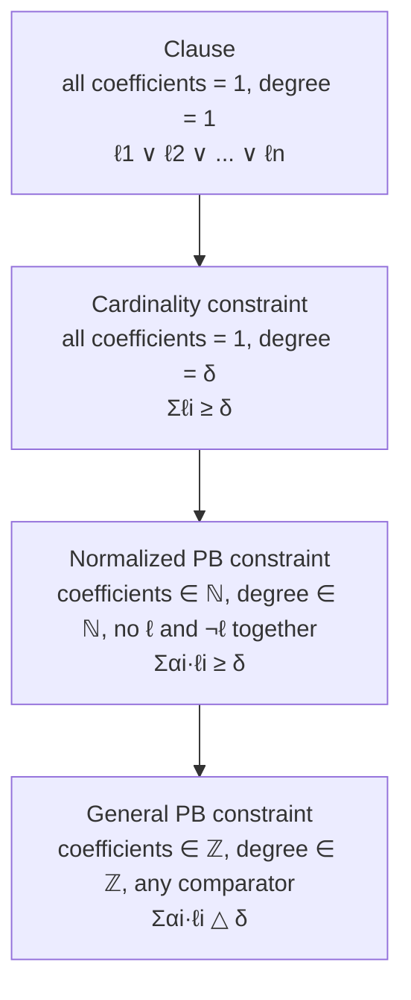
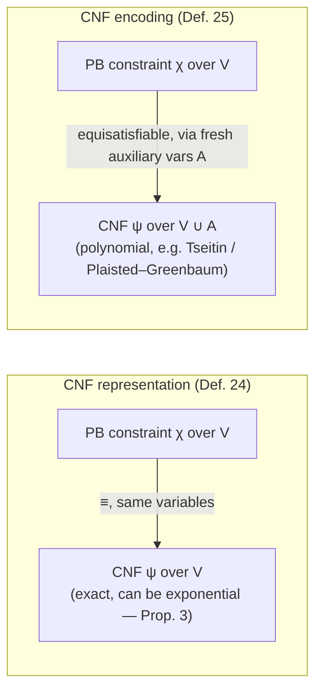

[[book-guidelines|↩ Back to guidelines]]

# Pseudo-Boolean and Cardinality Constraints

## Why clauses aren't enough

A CNF clause is a disjunction: at least one of these literals must be true. That's already a
constraint over Boolean variables, but it's a strangely weak one — every literal counts equally,
and the only threshold you can express is "at least one out of $n$." If you want to say
"at least 3 of these 5 must be true," or worse, "if $x_1$ is true it counts twice as much toward
the goal as $x_2$," a single clause simply cannot say that. You'd have to blow the constraint apart
into an enormous conjunction of clauses that only *approximates* the original statement's structure,
and — as this article will show concretely — that blow-up can be exponential.

This is the gap pseudo-Boolean (PB) constraints close. The idea is almost embarrassingly simple:
push propositional variables into ordinary arithmetic. A Boolean variable already has a natural
numeric reading — true is 1, false is 0 — so nothing stops you from writing a genuine linear
inequality over literals, with integer coefficients and an integer threshold, and asking when it's
satisfied. Wallon introduces this generalization in Chapter 1 immediately after finishing the
propositional-logic toolkit (clause, CNF, DNF, validity), precisely because everything that follows
in the thesis — from succinctness results to cutting-planes proof search — depends on having this
richer constraint object nailed down formally before reasoning about it.

## Pseudo-Boolean constraints as weighted linear inequalities over literals

**Definition 19 (Pseudo-Boolean Constraint).** A pseudo-Boolean constraint is an expression of the
form

$$\sum_{i=1}^n \alpha_i \ell_i \;\triangle\; \delta$$

where each $\alpha_i \in \mathbb{Z}$ is a *weight* (or *coefficient*), each $\ell_i$ is a literal,
$\triangle \in \{<, \le, =, \ge, >\}$, and $\delta \in \mathbb{Z}$ is the *degree* (also called the
*threshold*) of the constraint.

That's the whole definition, and it's worth sitting with how little it assumes: coefficients can be
negative, the relation can be any of the five comparison operators, and there's no restriction yet
tying the constraint back to clauses. `Notation 6` fixes the vocabulary used everywhere downstream:
for a constraint $\chi$, $\mathrm{var}(\chi)$ is its set of variables and $\mathrm{lit}(\chi)$ its set
of literals.

**What breaks without this generalization.** Try to express "at least 3 of $\{a,b,c,d,e\}$" as a
single clause — you can't; a clause only ever says "at least 1." You'd need $\binom{5}{3}=10$
clauses (one per way of picking the 2 literals allowed to be false, each forcing the rest true — see
Proposition 3 below for the general count), and the blow-up gets combinatorially worse as the
threshold grows. A pseudo-Boolean constraint expresses that same fact as one object:
$a+b+c+d+e \ge 3$.

**Semantics.** Just as a propositional interpretation has models, a pseudo-Boolean constraint has
models under `Definition 21`: an interpretation $I$ over $V \supseteq \mathrm{var}(\chi)$ is a model
of $\chi = \sum_i \alpha_i \ell_i \triangle \delta$ iff the arithmetic inequality
$\sum_i \alpha_i I(\ell_i) \triangle \delta$ actually holds once $I(\ell_i) \in \{0,1\}$ is
substituted in. Entailment, equivalence, consistency, contradiction, and validity are all lifted
verbatim from propositional logic using this notion of model — no new machinery needed, just a
richer notion of "satisfying assignment."

**Worked example (Example 13/14 in the book).** Consider

$$\chi_1: 6\bar b + 6c + 4e + f + g + h \ge 7$$

Here $\bar{b}$ is the negated literal ($\neg b$), with coefficient 6. Under the interpretation
$I(b)=I(c)=I(e)=I(g)=I(h)=0$, $I(a)=I(d)=I(f)=1$, we evaluate
$6\cdot I(\bar b) + 6\cdot 0 + 4\cdot 0 + 1\cdot 1 + 1\cdot 0 + 1\cdot 0 = 6\cdot 1 + 1 = 7 \ge 7$ — a
model.

### Grounding: representing a PB constraint in Rust

Because this is exactly the kind of object a constraint-solving kernel needs to store and evaluate
at speed, it's worth writing it down as real data:

```rust
#[derive(Clone, Copy, Debug, PartialEq, Eq)]
pub struct Literal {
    pub var: u32,
    pub negated: bool,
}

#[derive(Clone, Copy, Debug, PartialEq, Eq)]
pub enum RelOp { Lt, Le, Eq, Ge, Gt }

#[derive(Clone, Debug)]
pub struct PbConstraint {
    // (coefficient, literal) pairs — coefficients may be negative pre-normalization.
    pub terms: Vec<(i64, Literal)>,
    pub op: RelOp,
    pub degree: i64,
}

impl PbConstraint {
    /// Definition 21: evaluate the constraint under a total assignment.
    pub fn is_model(&self, assignment: &[bool]) -> bool {
        let lhs: i64 = self
            .terms
            .iter()
            .map(|(coef, lit)| {
                let val = assignment[lit.var as usize] ^ lit.negated;
                coef * (val as i64)
            })
            .sum();
        match self.op {
            RelOp::Lt => lhs < self.degree,
            RelOp::Le => lhs <= self.degree,
            RelOp::Eq => lhs == self.degree,
            RelOp::Ge => lhs >= self.degree,
            RelOp::Gt => lhs > self.degree,
        }
    }
}
```

This is deliberately the same shape a real PB/CSP solver (Sat4j, RoundingSat) uses internally: a
constraint is a small vector of `(weight, literal)` pairs plus a relation and a threshold. Everything
this thesis studies about pseudo-Boolean constraints — propagation, conflict analysis, weakening —
operates directly on structures shaped like this one.

## Size of a pseudo-Boolean constraint

`Definition 2` already gave a notion of size for a propositional formula (roughly, symbol count).
Pseudo-Boolean constraints need a size measure that also accounts for the coefficients and the
degree, since those are arbitrary integers, not just structural symbols:

$$|\chi| = \sum_{i=1}^n \bigl(\lceil \log_2(\alpha_i+1)\rceil + 1\bigr) + \lceil \log_2(\delta+1)\rceil$$

In words: for each literal you pay for the number of bits needed to write its coefficient, plus one
(for the literal itself), and you pay once more for the bits needed to write the degree. This
matters because a pseudo-Boolean constraint's "bigness" isn't just how many literals it mentions —
$3000000\,a + b \ge 1$ has only two literals but is far from small, because $3000000$ needs about 22
bits to encode. Chapter 2's succinctness results and later results on coefficient growth during
conflict analysis (Chapter 4) both depend on tracking size this way rather than by literal count
alone.

**Remark 6** flags something worth internalizing early: a constraint's PB-size and its
propositional-formula-size (if you happen to also view it as a clause) don't coincide — $\chi_4 =
\bar b + c + e \ge 1$ has $|\chi_4| = 7$ under Definition 20 but $|\gamma| = 6$ as the clause $\neg b
\lor c \lor e$. The two measures only ever differ by a linear factor, though, so nothing downstream
breaks by mixing the two views.

## Normalized form of a pseudo-Boolean constraint

Definition 19 is permissive — negative coefficients, any comparison operator, arbitrary integer
degree. That flexibility is exactly what makes reasoning *about* two constraints (are they equal?
does one entail the other?) awkward: there's no canonical shape to compare against. `Definition 22`
fixes this by requiring three things of a **normalized** pseudo-Boolean constraint
$\sum_i \alpha_i \ell_i \ge \delta$:

- for every $i$, $\bar\ell_i \notin \mathrm{lit}(\chi)$ — no variable appears both positively and
  negatively (that would let you trivially cancel terms),
- every $\alpha_i \in \mathbb{N}$ — no negative coefficients,
- $\delta \in \mathbb{N}$ — no negative degree, and the relation is fixed to $\ge$.

**Proposition 1** guarantees this isn't just a convenient restriction but a lossless one: *any*
pseudo-Boolean constraint can be rewritten as a conjunction of normalized ones, equivalent to the
original, in time linear in the constraint's size. The rewriting recipe (worked in Example 15) is a
short, mechanical sequence: push the relation to $\ge$ (flipping strict inequalities by $\pm 1$),
negate both sides if the leading coefficients are negative, and substitute $\bar\ell = 1-\ell$ to
turn any negative-coefficient literal into a positive-coefficient occurrence of its negation:

$$5\bar a + 4\bar b + \bar c + \bar d < 5 \;\equiv\; 5\bar a+4\bar b+\bar c+\bar d \le 4 \;\equiv\; 5a+4b+c+d \ge 7$$

**What breaks without normalization.** Every later algorithm in the thesis — watched-literal
propagation, cutting-planes addition, weakening — is stated for constraints in this exact shape.
Addition of two pseudo-Boolean constraints, for instance, is only sound as a syntactic operation on
matching literals if you already know no literal appears with mixed polarity or a negative weight;
without normalization you'd have to special-case signs at every single inference step instead of
proving properties once, for the normalized case, and using Proposition 1 as the on-ramp.

```rust
/// Definition 22 + Proposition 1's rewriting recipe (sketch).
/// Turns any (coef, literal) term with a negative coefficient into a positive-coefficient
/// term over the negated literal, adjusting the degree, then flips to `>=`.
fn normalize_term(coef: i64, lit: Literal, degree: &mut i64) -> (i64, Literal) {
    if coef < 0 {
        // alpha * l = alpha * (1 - not(l)) = alpha - alpha * not(l)
        *degree -= coef; // subtracting a negative increases the degree, matching the algebra above
        (-coef, Literal { negated: !lit.negated, ..lit })
    } else {
        (coef, lit)
    }
}
```

## Cardinality constraints as unit-coefficient pseudo-Boolean constraints

**Definition 23** specializes normalized PB constraints one notch further: a **cardinality
constraint** is one of the form $\sum_{i=1}^n \ell_i \ge \delta$ — every coefficient equal to 1. It
says exactly what it looks like: "at least $\delta$ of these $n$ literals must be true," with no
weighting between them.

**Observation 1** closes the loop back to where this article started: a clause $\ell_1 \lor \cdots
\lor \ell_n$ is *itself* nothing but the cardinality constraint $\sum_i \ell_i \ge 1$ — a clause is a
pseudo-Boolean constraint whose coefficients *and* degree are all 1. Even the empty clause $\bot$
fits: it's the degenerate cardinality constraint $0 \ge 1$ (an empty sum can never reach a threshold
of 1). This gives a clean three-level containment:



`Remark 7` is explicit that this containment isn't an accident of notation — Definition 22 was
*designed* so that each level generalizes the one below it, precisely so that algorithms built for
clauses (unit propagation, resolution, watched literals) have an obvious, mechanical generalization
path up through cardinality constraints to full pseudo-Boolean constraints. This is the throughline
that lets Chapter 4's CDCL-for-PB architecture reuse SAT-solver machinery almost verbatim at the
cardinality level, then generalize it further.

## Non-uniqueness of normalized representations, and the increasible-degree problem

Here's a fact that has real teeth: normalization (Definition 22) does **not** give you a canonical
form. A single pseudo-Boolean constraint has infinitely many normalized constraints equivalent to
it. The obvious source is scaling — multiply every coefficient and the degree by the same positive
constant and nothing changes semantically. But Example 18 shows the non-uniqueness runs deeper than
scaling:

$$18a+12b+6c \ge 22 \;\equiv\; 9a+6b+3c\ge11 \;\equiv\; 9a+6b+3c\ge12 \;\equiv\; 8a+6b+3c\ge11 \;\equiv\; 7a+3b+3c\ge10 \;\equiv\; 3a+2b+c\ge4 \;\equiv\; 3a+b+c\ge4 \;\equiv\; 2a+b+c\ge3$$

None of these are scalar multiples of one another — the coefficients and degree are shrinking in
genuinely different ratios while the constraint keeps meaning the same thing over $\{0,1\}$-valued
variables (even though several of these would *not* be equivalent over the reals). There's no
"smallest" or "simplest" member of this equivalence class that normalization alone picks out for
you; you would need something like Chow parameters (mentioned in a remark, cited to Crama & Hammer)
to get a genuine canonical form, and computing those is exponential in the worst case (only
pseudo-polynomial algorithms are known).

**The increasible-degree problem** (formally analyzed in Chapter 2, §2.1, immediately after this
material, since it needs the complexity-theory vocabulary from §1.2) makes this non-uniqueness
concrete and hard: given a normalized constraint $\chi$, can its degree $\delta$ be increased by 1
while preserving equivalence? Example 31 shows this can genuinely happen: $9a+6b+3c+d\ge 11$ is
equivalent to $9a+6b+3c+d\ge 12$ — bumping the degree changed nothing, because no model of the first
constraint satisfies the sum at exactly 11.

**Proposition 4.** *The increasible-degree problem is coNP-hard.* The proof reduces the
**complement** of increasible-degree from subset-sum. Given a set $S=\{\alpha_i\}\subseteq
\mathbb{N}$ and a target $\delta$, build $\chi: \sum_i \alpha_i v_i \ge \delta$. A subset summing
exactly to $\delta$ exists iff $\sum_i \alpha_i v_i = \delta$ is satisfiable — and *that* happens iff
the degree of $\chi$ **cannot** be increased (because a model hitting the threshold exactly would be
lost by bumping $\delta$ up by one). So: subset-sum instance solvable $\iff$ increasible-degree
answer is "no" — a reduction to the complement, giving coNP-hardness of the original problem.

A direct corollary (**Corollary 1**) is that the closely related **maximum-degree problem** (find
the largest degree a constraint can be strengthened to, which matters because it tightens the
constraint over the reals while leaving Boolean semantics untouched) is also coNP-hard — trivially,
since checking "is $\delta+1$ achievable" is exactly one instance of increasible-degree away from
"what's the max."

**Remark 13** gives the one case where you're safe: for a *consistent* cardinality constraint
$\sum_i \ell_i \ge \delta$, the degree can never be increased, because doing so would exclude models
that satisfy exactly $\delta$ literals (and consistency guarantees at least one such model — actually
one satisfying at least $\delta$ — exists on the boundary). Uniform coefficients remove the room for
the subtle degree-slack that Proposition 4's reduction exploits.

**What this means practically.** There is no free, efficient way to ask "is this the strongest
normalized form of this constraint?" — a solver has to either accept the constraint it's handed as
possibly non-maximal, or pay a coNP-hardness price to find out. This is the theoretical seed for a
whole family of engineering tradeoffs in Part II of the thesis (Chapters 6–7): rather than solving
increasible-degree exactly, real solvers use cheap syntactic operations (weakening, division,
saturation) that *sometimes* strengthen a constraint's degree as a side effect, accepting that they
won't always find the true maximum.

```python
# Illustrative only — brute-force increasible-degree check for small instances,
# to make the coNP-hardness statement concrete rather than just asserted.
from itertools import product

def is_model(coeffs, degree, bits):
    return sum(c * b for c, b in zip(coeffs, bits)) >= degree

def degree_increasible(coeffs, degree):
    n = len(coeffs)
    # bumping the degree is safe iff no assignment satisfies the sum at EXACTLY `degree`
    return not any(
        sum(c * b for c, b in zip(coeffs, bits)) == degree
        for bits in product((0, 1), repeat=n)
    )

# 9a + 6b + 3c + d >= 11  ->  increasible, per Example 31
print(degree_increasible([9, 6, 3, 1], 11))  # True
```

## CNF representation versus CNF encoding of a pseudo-Boolean constraint

Since clauses are a special case of pseudo-Boolean constraints (Observation 1), turning a CNF
formula into a pseudo-Boolean one is trivial — just read each clause as a unit-coefficient
constraint. The interesting direction is the reverse: given a pseudo-Boolean constraint, can you
write down an *equivalent* CNF formula over the same variables?

**Definition 24 (CNF Representation).** A CNF representation of a pseudo-Boolean formula $\varphi$
is a CNF formula $\psi$ such that $\varphi \equiv \psi$ **and** $\mathrm{var}(\varphi) =
\mathrm{var}(\psi)$ — same variables, logically equivalent, no extras.

**Proposition 2** constructs one, generically, for any $\chi = \sum_i \alpha_i \ell_i \ge \delta$: let

$$C = \Bigl\{\, L \subseteq \{\ell_1,\dots,\ell_n\} \;\Bigm|\; \sum_{i \mid \ell_i \notin L} \alpha_i < \delta \,\Bigr\}$$

Each $L \in C$ is a set of literals whose *absence* would make the constraint fail — so the
corresponding CNF clause $\bigvee_{\ell_i \in L} \ell_i$ says "at least one of these must hold,"
because letting all of them fail drops the achievable sum below the threshold. The conjunction
$\bigwedge_{L \in C} \bigvee_{\ell_i \in L} \ell_i$ is provably equivalent to $\chi$. Example 19 works
this out for $4a+2b+c+d \ge 6$: after removing every set that's a superset of a smaller set already
in $C$ (subsumption — $a \models a \lor b$, so the clause from $\{a,b\}$ is redundant once $\{a\}$'s
clause is present), the representation collapses to $(a)\land(b\lor c)\land(b\lor d)$.

**Proposition 3** shows the worst case is genuinely bad, specifically for cardinality constraints
$\kappa: \sum_{i=1}^n \ell_i \ge \delta$: the *smallest* CNF representation is

$$\bigwedge_{\substack{L\subseteq \mathrm{lit}(\kappa) \\ |L|=\delta+1}} \bigvee_{\ell_i\in L}\ell_i$$

i.e. one clause per size-$(\delta{+}1)$ subset of the literals — because a clause needs to rule out
every way of falsifying $\delta+1$ literals simultaneously (any $\delta$ falsified literals still
leave the threshold reachable). With $\delta = n/2$, that's $\binom{n}{n/2+1}$ clauses:
**exponential** in $n$. This is the formal justification for the "at least 3 of 5" example that
opened this article, generalized and made tight.

**Why CNF encodings exist.** Since CNF *representation* can blow up exponentially, practical tools
(MiniSat+, NaPS, OpenWBO) instead compute a **CNF encoding**: a CNF formula over the original
variables *plus a batch of freshly introduced auxiliary variables*, sized polynomially, that behaves
correctly for satisfiability purposes even though it's no longer logically equivalent term-for-term.

**Definition 25 (CNF Encoding).** Given disjoint variable sets $V$ (original) and $A$ (auxiliary),
and formulae $\varphi$ over $V$, $\psi$ over $V \cup A$: $\psi$ is a CNF encoding of $\varphi$ iff
$\psi$ is CNF and:

- every model $M$ of $\varphi$ extends to some model $M'$ of $\psi$ over $A$, and
- every counter-model of $\varphi$ has **no** extension to a model of $\psi$.

This is a strictly weaker requirement than Definition 24's equivalence — it only has to agree with
$\varphi$ on *whether a satisfying assignment to $V$ exists at all* (modulo extending it with
auxiliary bits), not agree on every intermediate logical consequence. That weaker relationship has a
name:

**Definition 26 (Equisatisfiability).** Two formulae $\varphi, \psi$ are equisatisfiable iff $\varphi$
is satisfiable exactly when $\psi$ is.



**Why this distinction matters for succinctness (Chapter 2's payoff).** If PB constraints only ever
admitted small CNF *representations*, they'd carry no real succinctness advantage over CNF — you
could always unfold them cheaply and the "more succinct" claim would be vacuous. Proposition 3's
exponential lower bound is exactly what rules that out and makes room for the succinctness results
this book builds toward (PBC/CARD strictly more succinct than CNF, Chapter 2, Proposition 19).
Meanwhile Definition 25's auxiliary-variable escape hatch is what makes PB constraints *usable in
practice* despite that lower bound — you trade exact equivalence for equisatisfiability and get
polynomial size back, which is the entire reason a CNF-based SAT solver can still be pointed at a
PB-encoded problem at all (studied further in Chapter 4, §4.3, on resolution-based PB solving).

```rust
/// Definition 24 vs Definition 25, made concrete: exhaustively representing versus
/// polynomially encoding a cardinality constraint sum(lits) >= degree.

/// CNF *representation* (Prop. 3): one clause per every (degree+1)-subset of literals.
/// Exponential in the worst case — this is a reference implementation, not a scalable one.
fn cnf_representation(lits: &[Literal], degree: usize) -> Vec<Vec<Literal>> {
    fn combinations(lits: &[Literal], k: usize) -> Vec<Vec<Literal>> {
        if k == 0 { return vec![vec![]]; }
        if lits.is_empty() { return vec![]; }
        let (first, rest) = (lits[0], &lits[1..]);
        let mut with_first = combinations(rest, k - 1);
        for combo in &mut with_first { combo.push(first); }
        let mut without_first = combinations(rest, k);
        without_first.extend(with_first);
        without_first
    }
    combinations(lits, degree + 1) // each subset of size degree+1 becomes a clause
}

/// CNF *encoding* (Def. 25) sketch: a sequential counter encoding introduces O(n*degree)
/// auxiliary variables to track "at least j of the first i literals are true" — polynomial,
/// but no longer variable-for-variable equivalent, only equisatisfiable.
struct SequentialCounterEncoding {
    clauses: Vec<Vec<Literal>>, // over original literals + register(i, j) auxiliary variables
}
```

## Where this leads

This chapter's definitions are the load-bearing wall for essentially everything that follows in the
thesis. Chapter 2 uses the increasible-degree hardness result (Proposition 4) directly to show that
pseudo-Boolean constraints, despite their succinctness advantage, *lose* several of CNF's
polynomial-time transformations — equivalence-checking (EQ) and sentential-equivalence (SE) become
coNP-hard for a single PB constraint (Proposition 10), precisely *because* there's no efficient way
to normalize toward a canonical, maximal-degree form. Part II's entire cutting-planes solving
machinery (Chapters 4–7) operates on exactly the normalized-constraint representation defined here:
watched-literal schemes generalize Definition 23's cardinality case before tackling full weighted
constraints, "slack" (used to detect propagation) is defined directly in terms of Definition 20's
size and Definition 21's model semantics, and the "irrelevant literal" phenomenon of Chapter 5 is a
direct consequence of the non-uniqueness surfaced in this section — a literal can look relevant in
one equivalent normalized form and irrelevant in another.

For the standing project (a Rust-based verifier with an embedded CSP kernel), this topic is the
`sat-smt-csp` foundation almost literally: `PbConstraint` as sketched above is the shape a
domain/lattice-propagation engine would actually store and dispatch on, and the CNF-representation-
vs-CNF-encoding distinction is the same tradeoff you'll face when lowering richer constraints
(linear arithmetic bounds, at-most-one over abstract-domain flags) down to a SAT-solvable core —
decide up front whether you need exact equivalence (expensive, Proposition 3) or can settle for
equisatisfiability with auxiliary variables (cheap, Definition 25) for a given verification
condition. The increasible-degree/coNP-hardness result is also a concrete, early instance of a
pattern worth remembering for the CSP kernel's completeness story: succinct constraint languages
routinely buy their compactness by giving up cheap canonicalization, which is exactly why "prove
absence of bugs" (needs canonical/maximal reasoning) and "prove presence of bugs via counterexample
search" (only needs one satisfying assignment) end up wanting different algorithmic machinery even
though they operate over the same constraint objects.
