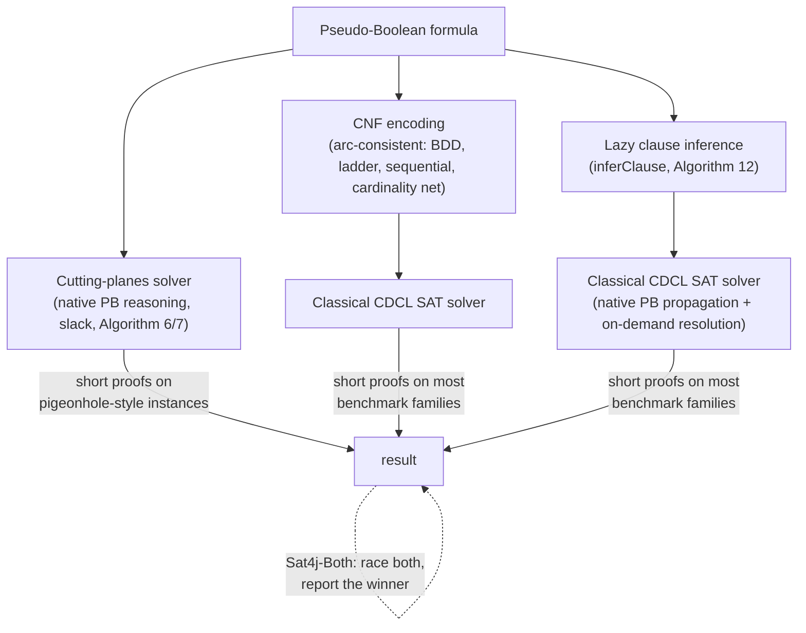

# Resolution-Based Pseudo-Boolean Solving

[[book-guidelines|↩ Back to guidelines]]

## Why this section exists

Part II of the thesis spends its first two sections building a *native* pseudo-Boolean solver: one that keeps constraints like $5a + 2b + 2c + 2d + 2e + f \ge 6$ intact, detects propagations on them via slack, and does conflict analysis with [[The-Cutting-Planes-Proof-System|the cutting planes proof system]] (see the sibling article, **Pseudo-Boolean Solving via Cutting Planes**). That approach is strictly stronger in theory — cutting planes p-simulates resolution, so it admits exponentially shorter refutations for some formula families (the pigeonhole principle being the canonical example).

But theory and engineering pull apart here. §4.3 opens with a blunt admission: "current implementations of the cutting planes proof system in CDCL pseudo-Boolean solvers fail to keep the promises of the theory." Deciding *which* cutting-planes rule to apply, and when, is itself hard, and the machinery is heavier than SAT solvers' resolution-based conflict analysis. So a second lineage of pseudo-Boolean solvers exists — SATIRE, MiniSat+, NaPS, Open-WBO, Sat4j-Resolution — that reduce the problem back to plain SAT and let a classical, extremely well-optimized CDCL engine do the work. This article is about how that reduction is done without paying an exponential price, and what you give up (and gain) by doing it.

If you're building a CSP/SAT backend for a verification-condition solver, this is the practical lesson: **the strongest proof system on paper is not always the strongest solver in practice** — sometimes the right move is to compile your richer constraint down to the substrate with the more mature, more tuned search engine, provided the compilation is careful about which information it throws away.

---

## 1. Two ways to turn a pseudo-Boolean constraint into clauses — and why one of them doesn't scale

Resolution-based solvers all share one design choice: internally, they hand a classical SAT solver a CNF formula, not a pseudo-Boolean formula. The question is *which* CNF formula. The thesis (back in §1.1.3, providing the vocabulary this section leans on) distinguishes two very different notions of "turning $\chi$ into clauses."

> **Definition 24 (CNF Representation).** A CNF representation of a pseudo-Boolean formula $\varphi$ is a CNF formula $\psi$ such that $\varphi \equiv \psi$ (logically *equivalent*) and $\mathrm{var}(\varphi) = \mathrm{var}(\psi)$ — no new variables.

This is the "no cheating" version: same variables, same models, exactly. **Proposition 2** shows it's always possible — collect every subset $L$ of literals whose complement-coefficients sum below the degree, and forbid the assignment that falsifies all of them:

$$\bigwedge_{L \in \mathcal{C}} \bigvee_{\ell_i \in L} \ell_i, \qquad \mathcal{C} = \Big\{ L \mid L \subseteq \{\ell_1,\dots,\ell_n\} \text{ and } \sum_{i \mid \ell_i \notin L} \alpha_i < \delta \Big\}$$

Worked example from the book: $4a + 2b + c + d \ge 6$ representation-compiles (after removing subsumed clauses) to $(a) \wedge (b \vee c) \wedge (b \vee d)$. Small here — but **Proposition 3** shows the general case is catastrophic: for a plain cardinality constraint $\sum_{i=1}^n \ell_i \ge \delta$, the *smallest* CNF representation needs one clause per $(\delta{+}1)$-subset of the literals, i.e. $\binom{n}{\delta+1}$ clauses. Set $\delta = n/2$ and that's exponential in $n$. A representation-based resolution solver would blow up on the same instances that make the pseudo-Boolean formulation attractive in the first place — the entire succinctness advantage of PB over CNF (established in the sibling article **Succinctness and Tractability of Pseudo-Boolean Languages**) would be handed straight back.

So resolution-based solvers use the other notion instead:

> **Definition 25 (CNF Encoding).** Let $V, A$ be disjoint variable sets, $\mathrm{var}(\varphi) = V$, $\mathrm{var}(\psi) = V \cup A$. $\psi$ is a CNF encoding of $\varphi$ iff (1) every model of $\varphi$ extends to some model of $\psi$ over $A$, and (2) every counter-model of $\varphi$ has *no* extension that models $\psi$.

> **Definition 26 (Equisatisfiability).** $\varphi$ and $\psi$ are equisatisfiable iff $\varphi$ is satisfiable exactly when $\psi$ is.

The variables in $A$ are **auxiliary (dependent) variables** — new Boolean symbols with no meaning in the original problem, introduced purely to keep the encoding small. The trade the encoding makes is precise: give up "same models over the same variables" (equivalence), keep only "same satisfiability" (equisatisfiability). That's a strictly weaker guarantee, but it's the one Tseitin-style transformations have exploited since the 1960s to keep CNF encodings of arbitrary circuits polynomial-size, and it's exactly what lets a PB constraint compile down to a CNF that a SAT solver can chew on without an exponential detonation.

```rust
// The shape of the distinction, not a runnable encoder:
// a CNF "representation" only ever talks about the constraint's own variables.
enum CnfRepresentation { Clauses(Vec<Clause>) } // over var(chi) only

// a CNF "encoding" is allowed fresh auxiliary variables,
// and only has to preserve SAT/UNSAT, not model-for-model equivalence.
struct CnfEncoding {
    clauses: Vec<Clause>,
    auxiliary_vars: Vec<VarId>,   // fresh symbols, meaningless outside psi
}
// Definition 26's contract, as a property test rather than a proof:
fn equisatisfiable(phi: &PbFormula, psi: &CnfEncoding) -> bool {
    is_sat(phi) == is_sat(psi)   // NOT: models(phi) == project(models(psi))
}
```

**What breaks without the encoding move:** without auxiliary variables, you're stuck choosing between Definition 24's exact-but-exponential representation and giving up on resolution-based solving of pseudo-Boolean constraints altogether. Auxiliary variables are the escape hatch — the same one that makes Tseitin transformations of circuits linear instead of exponential, and (per the sibling article **[[Graph-Width-Measures-for-CNF-Formulae-and-Encodings|Graph Width Measures for CNF Formulae and Encodings]]**) the same one that collapses the treewidth of the at-most-one function from $n-1$ down to $2$.

---

## 2. Arc-consistency: the encoding has to *propagate*, not just be satisfiable-equivalent

Equisatisfiability alone is a weak contract — a solver could satisfy it with an encoding that's technically correct but useless for search, because unit propagation over the encoded clauses fails to rediscover the deductions the original pseudo-Boolean constraint would have made directly. This matters enormously for CDCL: propagation strength is most of what makes a SAT solver fast. §4.3 names the property an encoding needs to preserve that strength:

> An encoding is **arc-consistent** when the same literals are propagated under the same partial assignment in both the original formula and its encoding.

This is not automatic. Consider a constraint like $\bar{a} + \bar{b} + \bar{c} \ge 2$ (an at-most-one over $a,b,c$, in complement form). If you build a CNF encoding via a chain of "adder"-style intermediate sum bits, unit propagation over the *encoded* clauses can require several resolution steps to derive a conclusion (e.g. "$c$ must be false") that the *native* pseudo-Boolean solver would get in a single slack computation. The encoding is equisatisfiable, but weaker at search time — the SAT solver inside will make more decisions and backtrack more before rediscovering facts the PB representation had for free.

The book names four families that *are* arc-consistent:

- **BDD-based encodings** (MiniSat+, and NaPS which specifically uses ROBDDs to represent PB constraints) — the reduced, ordered decision-diagram structure directly mirrors the constraint's implication structure, so propagation on the diagram matches propagation on the constraint.
- **The ladder encoding** — a chain of auxiliary "prefix" variables (used for at-most-one / sequential counting constraints).
- **The sequential encoding** — similarly built from a running-sum chain of auxiliary variables.
- **Cardinality networks** (as implemented in Open-WBO) — sorting-network-style circuits that preserve arc-consistency for cardinality constraints specifically.

And two that trade arc-consistency away for smaller size:

- **The adder encoding** (MiniSat+) — builds a binary-adder circuit computing the weighted sum, compact but not arc-consistent.
- **Sorting networks** (also MiniSat+) — smaller than a fully arc-consistent cardinality network, at the same propagation cost.

The book doesn't dive into the internals of any one of these (that's the domain of the works it cites — [ES06], [SN15], [AM05], [HMS12], [ANORC11]) — its point here is structural: **there is a genuine size/strength tradeoff on the table**, and different solvers make different choices along it. This is a recognizable instance of a very general tension in constraint compilation.

```python
# A sketch of "arc-consistent" as a checkable property, not an efficient algorithm:
# an encoding psi of constraint chi is arc-consistent iff, for every partial
# assignment rho, unit-propagation-closure(psi, rho) restricted to var(chi)
# equals the set of literals chi itself would propagate under rho.

def is_arc_consistent(chi, psi, partial_assignments):
    for rho in partial_assignments:
        native = pb_propagate(chi, rho)              # slack-based, Def. 103-104
        via_cnf = { lit for lit in unit_propagate(psi, rho)
                    if lit.var in chi.variables }      # drop auxiliary lits
        if native != via_cnf:
            return False
    return True
```

**Where the compiler-project payoff lives (`sat-smt-csp`, `static-analysis`):** this is precisely the concern a domain-propagation-based CSP kernel has to face when it lowers a rich abstract domain (e.g. an interval or octagon constraint) into a simpler propagator network — a naively-compiled network can be *sound* (never wrong) while still being strictly weaker at pruning than the richer domain would be directly. "Arc-consistency of the encoding" here is the pseudo-Boolean-specific instance of the general question "does my compiled representation propagate as much as my abstract one did?" — the same question that governs whether an over-approximating abstract-interpretation pass stays precise after being lowered to Horn clauses.

---

## 3. The other route: lazily deriving clauses during conflict analysis

Encoding the whole formula up front is one strategy. The second family of resolution-based solvers — SATIRE and Sat4j-Resolution — takes a different, lazier route: **keep the pseudo-Boolean constraints exactly as they are** for propagation and conflict detection (exactly as the cutting-planes-based solvers do, using slack — see the sibling article), and only convert to clauses *at the moment conflict analysis needs to combine two constraints by resolution*.

This is the pseudo-Boolean analogue of **lazy clause generation** in constraint programming: don't pre-compile every possible deduction into clauses ahead of time; derive the clause on demand, from whichever constraint is actually implicated in the current conflict.

### 3.1 Algorithm 12 — `inferClause`

Given a pseudo-Boolean constraint $\chi$ that is either **conflicting** (falsified by the current assignment) or **assertive** (about to propagate a literal), and a threshold $\theta$, the algorithm greedily selects falsified literals from $\chi$ until the remaining slack drops below $\theta$:

```text
inferClause(chi, theta):
    sigma <- sumOfCoefficients(chi) - degree(chi)      # initial slack
    F <- {}
    for each literal l with coefficient alpha in chi:  # by descending alpha (Remark 37)
        if l is falsified under current assignment:
            F <- F + {l}
            sigma <- sigma - alpha
            if sigma < theta:
                break
    return F
```

The threshold encodes which of the two situations you're in:

- **$\theta = 0$**, for a *conflicting* constraint — you want just enough falsified literals that flipping any one of them still leaves the clause $\bigvee_{\ell \in F} \ell$ conflicting (unsatisfied). $F$ becomes a **conflicting clause**.
- **$\theta = $ the coefficient of the propagated literal**, for an *assertive* constraint — you want just enough falsified literals to justify the propagation. $F$ becomes the **reason clause** for that propagation, exactly the role `reason(ℓ)` plays for unit clauses in a plain CDCL solver (see the CDCL-architecture article).

Iterating by descending coefficient (Remark 37) is a greedy heuristic for shorter clauses — literals with larger coefficients "use up" slack faster, so fewer of them are needed to cross the threshold.

**Worked example (Example 65 in the book).** Take $5a + 5b + c + d + e + f \ge 6$, where $a$ is falsified (decision level 3), $e$ is falsified (level 1), $f$ is satisfied (level 2), and $b, c, d$ are unassigned. This constraint currently propagates $b$ — so the reason threshold is $\theta = 5$ (b's coefficient). Slack starts at $\sigma = (5+5+1+1+1+1) - 6 = 8$. Walking falsified literals: $a$ (coefficient 5) is added, $\sigma \to 3$, which is below $\theta = 5$, so the loop stops. Reason for $b$: the clause $a \vee b \ge 1$, i.e. $\neg a \vee b$.

After $b$ is propagated, suppose the constraint $2a + \bar b + c + e \ge 2$ becomes conflicting. Now $\theta = 0$, $\sigma = (2+1+1+1) - 2 = 3$. All falsified literals ($a, \bar b, e$) get added, driving $\sigma$ down to $-1$ (below threshold, loop ends naturally). Conflicting clause: $a \vee \bar b \vee e \ge 1$.

From here, ordinary resolution on the two derived clauses ($\neg a \vee b$ and $a \vee \bar b \vee e$, resolving on $b$) yields $a \vee e$ — a completely standard SAT-solver resolution step, operating on clauses that happened to be *derived* from pseudo-Boolean constraints rather than *stored* as clauses from the start.

```rust
// A direct transcription of inferClause's control flow.
struct PbConstraint {
    literals: Vec<(Literal, u64)>, // (literal, coefficient), assume sorted desc by coeff
    degree: u64,
}

fn infer_clause(chi: &PbConstraint, theta: i64, assignment: &Assignment) -> Vec<Literal> {
    let sum: u64 = chi.literals.iter().map(|(_, a)| a).sum();
    let mut sigma: i64 = sum as i64 - chi.degree as i64;
    let mut reason = Vec::new();

    for &(lit, alpha) in &chi.literals {
        if assignment.is_falsified(lit) {
            reason.push(lit);
            sigma -= alpha as i64;
            if sigma < theta {
                break;
            }
        }
    }
    reason
}

// theta = 0            -> conflicting-clause mode
// theta = coeff_of(l)  -> reason-clause mode for propagated literal l
```

### 3.2 Why this is worth doing at all

The payoff, stated plainly in the book: this lets a solver "apply the efficient CDCL algorithm of classical SAT solvers, while considering a succinct (and implicit) CNF representation of the original pseudo-Boolean formula." Nothing is precompiled — no auxiliary variables, no encoding-size tradeoff from §2 — the clause only ever materializes for the specific literals actually involved in a specific conflict, and the underlying PB constraints still get the benefit of native (slack-based) propagation the rest of the time.

Empirically (§4.3's evaluation, Figures 4.10–4.15), this shows up in an interesting reversal: for **Sat4j-Resolution**, slack-based propagation detection beats watched-literals — the *opposite* of what the book found for the cutting-planes-based **Sat4j-GeneralizedResolution**. The explanation given is architectural: Sat4j-Resolution only ever derives *clauses* downstream, so the bookkeeping cost of maintaining watched literals on the general pseudo-Boolean constraints isn't amortized by enough payoff to justify it.

---

## 4. Complementarity, not competition

The chapter's closing move is to resist framing resolution-based and cutting-planes-based solving as "winner vs. loser." Both live in Sat4j side by side (`Sat4j-Resolution` and `Sat4j-GeneralizedResolution`), and the empirical comparison (Figure 4.11) is genuinely mixed:

- On most instances, resolution-based solving wins — it inherits decades of SAT-solver engineering maturity, and avoids the coefficient-growth and irrelevant-literal pathologies that plague cutting-planes conflict analysis (see the sibling articles **Pseudo-Boolean Solving via Cutting Planes** and **Irrelevant Literals in Pseudo-Boolean Constraint Learning**).
- On specific families — the book names `vertexcover` and `subsetcard` — generalized resolution (cutting planes) wins, because those families are *hard for the resolution proof system itself*: only exponential-size resolution refutations exist, while cutting planes (via p-simulation) admits polynomial ones. No amount of engineering cleverness rescues a solver stuck inside a provably weak proof system on an adversarial instance.

This is complementarity in the strict proof-complexity sense, not just "different solvers are good at different things by chance": the theoretical separation between resolution and cutting planes (established via the pigeonhole-principle formulas in the sibling article on the cutting planes proof system) is exactly what shows up empirically here.

The practical response is **`Sat4j-Both`**: run both approaches in parallel (one core each) and report whichever finishes first. A tuned variant, `Sat4j-Both (sober)`, runs generalized resolution for only one minute before ceding the rest of the time budget to the resolution-based approach — a bet that if cutting planes hasn't found the short proof quickly, the instance probably isn't one of the favorable ones. Both variants track close to the **Virtual Best Solver** (the hypothetical solver that always picks whichever real solver is fastest on each instance) — evidence that the two proof systems really are covering different blind spots rather than one just being uniformly better.



One caveat the book is careful to flag: the comparison also confounds *proof system* with *implementation language*. Sat4j is Java; RoundingSat and the MiniSat-family solvers are C++, and the book notes C++ implementations run roughly 3× faster than equivalent Java ones (backed by a direct MiniSat-vs-jMiniSat comparison, Figure 4.15) — a reminder that "resolution beat cutting planes on this benchmark" claims always need to be read alongside the engineering gap between the solvers being compared, not just the proof-theoretic gap.

---

## Where this leads

This section is the hinge between the thesis's proof-theoretic apparatus (cutting planes, generalized resolution, slack) and its empirical evaluation. It depends on:

- **Definitions 24–26** (§1.1.3) — CNF representation vs. encoding vs. equisatisfiability — for the vocabulary that makes "resolution-based solving" a well-posed idea rather than a hand-wave.
- **Slack and assertivity** (§4.2.1, in the sibling cutting-planes article) — the lazy-inference route still needs native propagation detection on PB constraints; only conflict analysis switches to clauses.

And it feeds directly into:

- **Chapter 5 (Irrelevant Literals)** — a pathology specific to cutting-planes-style constraint learning that resolution-based solving sidesteps entirely by working with clauses.
- **Chapter 7's experimental evaluation** — `Sat4j-Both` and its variants recur as reference points for "what a well-tuned combination of strategies can achieve."

**For the standing project (`sat-smt-csp`, `static-analysis`):** the core lesson generalizes past pseudo-Boolean solving. Any time you're deciding how to feed a richer constraint (a refinement-type obligation, an abstract-domain fact, a Horn clause) into a more mature but syntactically poorer solving substrate, you face exactly this fork: encode once (Definition 25's move — pay a size cost, maybe lose propagation strength unless you're careful to stay arc-consistent), or infer lazily on demand (Algorithm 12's move — keep the rich representation as the source of truth, and only degrade to the poorer language exactly when the poorer language's machinery — resolution, clause learning — is what you actually need). The "keep the strong native representation for propagation, drop to the weak substrate only at conflict-analysis time" pattern is a template worth remembering for a CSP kernel that mixes abstract-interpretation-style domain propagation with a SAT/SMT core underneath.
