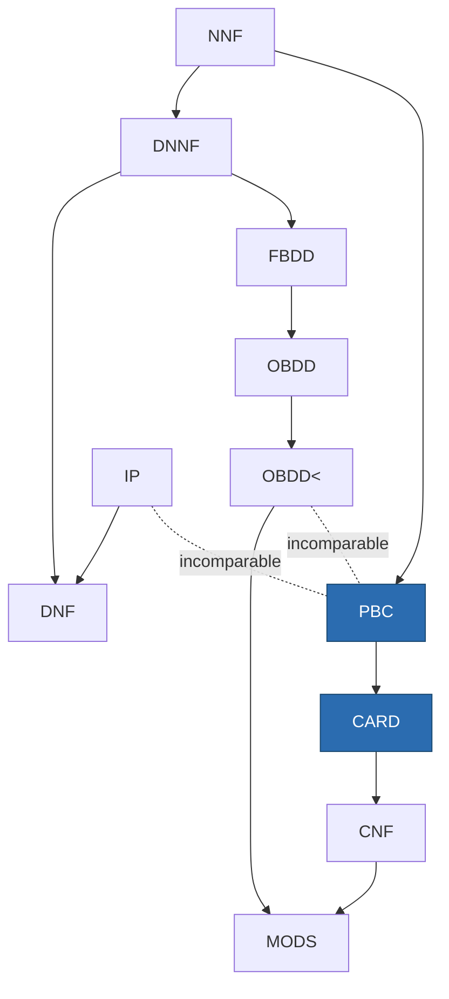
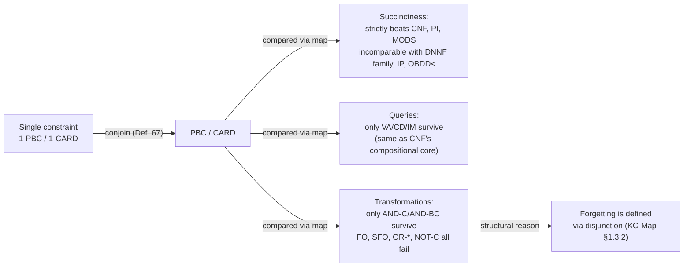

[[book-guidelines|↩ Back to guidelines]]

# Succinctness and Tractability of Pseudo-Boolean Languages

## The trade Chapter 1 promised, and the bill Chapter 2 makes you pay

Chapter 1 already gave the headline result: a single pseudo-Boolean (PB) constraint can encode an exponential number of clauses (Prop. 3 — think of $\sum_i 2^{i-1} x_i \geq k$, which packs a binary counter's worth of clausal structure into one linear inequality). That's a **succinctness** win, in the [[Knowledge-Compilation|knowledge compilation map]]'s technical sense: PB constraints are strictly more compact than CNF for the same Boolean function.

But the map's whole point is that succinctness is never free — Chapter 1 already showed this for the DNNF/BDD family (determinism buys you counting but costs you forgetting). Chapter 2 asks the same question of pseudo-Boolean constraints: **given that PBC is more succinct than CNF, what did it cost?** The answer turns out to be uncomfortable for anyone hoping pseudo-Boolean constraints are a strict upgrade over CNF as a *representation* language (as opposed to a *solving* language, which is Part II of the thesis): almost every query and transformation that is cheap on CNF becomes intractable on PB constraints, with only a narrow set of exceptions. This article works through that bill in the order the book presents it: first the properties of a *single* constraint (languages 1-PBC, 1-CARD), then the properties of *conjunctions* of constraints (PBC, CARD) compared against the rest of the compilation map.

Throughout, recall the normalized form from [[Pseudo-Boolean-and-Cardinality-Constraints]]: a pseudo-Boolean constraint is $\sum_{i=1}^n \alpha_i \ell_i \geq \delta$ with $\alpha_i \in \mathbb{N}_{>0}$, $\delta \in \mathbb{N}$, and no variable appearing twice (as both a literal and its negation); a cardinality constraint is the special case where every $\alpha_i = 1$.

---

## Part 1 — What a single constraint can and can't do (1-PBC, 1-CARD)

### Definition and why "single constraint" is worth its own language

> **Def. 66 (1-PBC, 1-CARD).** 1-PBC (resp. 1-CARD) is the language of pseudo-Boolean formulae composed of a *single* normalized pseudo-Boolean constraint (resp. cardinality constraint).

Neither language is fully expressive — a single linear inequality can't represent every Boolean function (there exist functions with no "threshold" structure at all). So Wallon doesn't treat them as compilation targets in the map's usual sense. Instead, 1-PBC/1-CARD are the right scope to ask a narrower, prerequisite question: even *within* the fragment of functions a single constraint *can* represent, how hard is it to manipulate that one constraint? This matters because every later result about conjunctions of constraints (PBC, CARD) is going to build on — or fail to build on — what's tractable here.

### The canonical-form problem you don't get: the increasible-degree problem

CNF clauses have an obvious canonical-ish handle: two clauses over the same literals are trivially comparable. Pseudo-Boolean constraints don't have this, because a single Boolean function has infinitely many equivalent normalized representations — you can scale coefficients, and less obviously, you can sometimes *raise the degree* without changing the model set.

> **Example 31.** $\chi = 9a + 6b + 3c + d \geq 11$ and $\chi' = 9a + 6b + 3c + d \geq 12$ are logically equivalent ($\chi \equiv \chi'$), even though $\chi'$ has a strictly larger degree. Every integer combination of the $\alpha_i$ that lies strictly between $11$ and $12$ is simply unreachable, so tightening the bound from $11$ to $12$ removes no models.

The **increasible-degree problem** asks: given a constraint, can its degree be raised while preserving equivalence? You'd want the answer for a canonicalization pass (always work with the *tightest* representation), but:

> **Proposition 4.** The increasible-degree problem is coNP-hard.

*Proof idea.* Reduce from subset-sum. Given $S = \{\alpha_i\}$ and target $\delta$, build $\chi = \sum \alpha_i v_i \geq \delta$. A subset $S' \subseteq S$ summing exactly to $\delta$ exists iff $\sum \alpha_i v_i = \delta$ is satisfiable, and — this is the crux — that's exactly the condition under which the degree of $\chi$ *cannot* be raised to $\delta+1$ without cutting off a model. So "the degree can be raised" is the complement of "a subset sums to exactly $\delta$," which pins the problem to coNP-hardness. $\square$

The immediate corollary is that the closely related **maximum-degree problem** (find the *largest* degree for which the constraint stays equivalent — useful because a tighter real-valued relaxation is a stronger LP/IP certificate while staying Boolean-equivalent) is coNP-hard too (Cor. 1). Note the asymmetry with cardinality constraints: a *consistent* cardinality constraint $\sum \ell_i \geq \delta$ can *never* have its degree raised (Remark 13) — raising $\delta$ by even 1 would exclude every model that satisfies exactly $\delta$ literals, and consistency guarantees at least one such model exists. Uniform coefficients remove the whole phenomenon; it's specifically the freedom to choose arbitrary weights that reopens the subset-sum-shaped hole.

**Rust grounding.** This is worth encoding directly, because it's the kind of "looks like a solved problem, isn't" trap a constraint-simplification pass in a real solver can walk straight into:

```rust
/// A normalized pseudo-Boolean constraint: sum(coeffs[i] * literal[i]) >= degree.
struct PbConstraint {
    coeffs: Vec<u64>,
    degree: u64,
}

/// Naive, EXPONENTIAL check — this is what "coNP-hard" buys you: no known
/// polynomial alternative exists (assuming P != NP). A real solver either
/// accepts non-canonical constraints as-is, or restricts canonicalization
/// to the uniform-coefficient (cardinality) special case where it's free.
fn can_increase_degree(c: &PbConstraint) -> bool {
    // True iff some subset of coeffs sums to EXACTLY c.degree.
    // (This is literally subset-sum -- no shortcut is known.)
    subset_sums_to_exactly(&c.coeffs, c.degree)
}
```

The lesson for a solver's internal representation: don't build a "simplify to canonical form" pass for PB constraints the way you might for CNF (e.g. removing duplicate/subsumed clauses is cheap) — the PB analogue of that convenience is coNP-hard, so real PB solvers (Part II of the thesis, and Sat4j/RoundingSat in practice) work directly with non-canonical constraints and pay the cost elsewhere (in inference rules like saturation, not in a global normalization pass).

### The queries that *do* stay cheap on a single constraint

Despite the canonicalization trap, most of the map's eight standard queries (defined in [[Knowledge-Compilation]] §1.3.2 — CO, VA, CE, IM, EQ, SE, CT, ME) *are* tractable for a single constraint, because each reduces to a bounded sum:

| Query | 1-CARD | 1-PBC | Mechanism |
|---|---|---|---|
| **CO** consistency | ✓ | ✓ | $\chi$ consistent iff $\sum \alpha_i \geq \delta$ (Prop. 5) — satisfying *every* literal is the best you can do |
| **VA** validity | ✓ | ✓ | $\chi$ valid iff $\delta = 0$ (Prop. 8) — the all-literals-falsified interpretation is a counter-model whenever $\delta > 0$ |
| **CD** conditioning | ✓ | ✓ | substituting a literal for a constant and renormalizing is linear-time (Prop. 6) |
| **CE** clausal entailment | ✓ | ✓ | $\chi \models \gamma$ iff $\sum_{\ell_i \notin \mathrm{lit}(\gamma)} \alpha_i < \delta$ (Prop. 7) — the literals *not* in $\gamma$ can't reach the degree alone |
| **IM** implicant check | ✓ | ✓ | follows from CD + VA (Cor. 7) |
| **ME** model enumeration | ✓ | ✓ | follows from CO + CD (Cor. 3) |
| **EQ** equivalence | ✓ | ✗ (coNP-hard) | Prop. 9 gives a clean criterion for *cardinality* constraints ($\kappa \models \kappa'$ iff $\delta' = 0$ or $|L \setminus L'| \leq \delta - \delta'$); Prop. 10 shows the general PB case reduces to increasible-degree, hence coNP-hard |
| **SE** sentential entailment | ✓ | ✗ (coNP-hard) | same split — Cor. 8 vs. Cor. 10 |

The CE criterion (Prop. 7) is worth internalizing because it's the workhorse the rest of the chapter's hardness proofs lean on: entailing a clause $\gamma$ is equivalent to asking whether the *complement* literals (those not mentioned in $\gamma$) can, on their own, reach the degree. It's a single weighted sum — no combinatorial search.

```rust
/// CE: does `constraint` entail clause `gamma`?  O(n) — Prop. 7.
fn entails_clause(c: &PbConstraint, literals: &[Literal], gamma: &[Literal]) -> bool {
    let complement_weight: u64 = c.coeffs.iter().zip(literals)
        .filter(|(_, lit)| !gamma.contains(lit))
        .map(|(w, _)| w)
        .sum();
    complement_weight < c.degree
}
```

The **EQ/SE split between 1-CARD and 1-PBC** is the chapter's first real signal that *weights specifically* — not "pseudo-Boolean-ness" in general — are the source of hardness. Cardinality constraints (uniform weight 1) get a combinatorial, countable criterion (Prop. 9: compare set differences against a degree gap); general weighted constraints inherit the increasible-degree problem's coNP-hardness the moment you ask "are these two the same function," because comparing two constraints for equivalence is exactly comparing whether one's degree could be silently the other's raised degree.

**Negation stays free**, interestingly, even for weighted constraints: $\neg\chi \equiv \sum \alpha_i \bar\ell_i \geq \left(\sum \alpha_i\right) - \delta + 1$ (Prop. 11) is a mechanical rewrite — negating a linear inequality over $\{0,1\}$ literals is arithmetic, not search.

### Where a single constraint is provably intractable: counting

The one place even 1-CARD can't rescue 1-PBC's badness is different from EQ/SE — it's **counting models** (CT):

> **Proposition 12.** Counting the models of a *cardinality* constraint is polynomial: with $n$ literals and degree $\delta$, the count is $\sum_{i=\delta}^{n} \binom{n}{i}$, computable directly since $n$ is given in unary (it's a literal count).
>
> **Proposition 13.** Counting the models of a general *pseudo-Boolean* constraint is **NP-hard**.

*Proof idea.* Reduce subset-sum again. Given $S = \{\alpha_i\}$, target $\delta$, build $\chi^+ = \sum \alpha_i x_i \geq \delta$ and $\chi^- = \sum \alpha_i \bar{x}_i \geq \left(\sum \alpha_i\right) + \delta$ (equivalently, $\chi^-$ says $\sum \alpha_i x_i \leq \delta$). These are constructed so that *every* interpretation satisfies at least one of $\chi^+, \chi^-$, while an interpretation satisfies *both* exactly when $\sum \alpha_i x_i = \delta$. By inclusion–exclusion over the full $2^n$ interpretation space, $\#(\sum \alpha_i x_i = \delta) = \#(\chi^+) + \#(\chi^-) - 2^n$. So a subset summing exactly to $\delta$ exists iff this quantity is nonzero — and computing it requires only #-counting $\chi^+$ and $\chi^-$. If counting models of a single PB constraint were polynomial, subset-sum's *solution existence* would be too. $\square$

This is the same subset-sum shadow that haunted the increasible-degree problem, showing up a second time from a different angle — **weighted linear constraints and subset-sum are, computationally, close cousins**, and this pairing recurs throughout the chapter's hardness results (also driving Props. 10, 20, 21 below in spirit). A `#SAT`-style backend that's happy counting models of a CNF formula compiled into d-DNNF (tractable, per [[Knowledge-Compilation]]) cannot assume the same tractability the moment even one clause in that formula gets replaced by a weighted PB constraint.

### What conjunction and disjunction of two constraints *can't* give you

The last single-constraint result closes off a tempting shortcut: could you represent the conjunction (or disjunction) of two PB constraints as a *single* PB constraint, avoiding the blow-up to multiple constraints entirely?

> **Proposition 15.** No — the conjunction of $a + b \geq 1$ and $\bar a + \bar b \geq 1$ (i.e., $a \oplus b$: exactly one of $a, b$ true) cannot be written as one PB constraint.

*Proof idea.* Set up the four linear inequalities a candidate combined constraint $\alpha_1 a + \alpha_2 \bar a + \beta_1 b + \beta_2 \bar b \geq \delta$ would have to satisfy (one per required model/counter-model), add pairs of them, and the two resulting inequalities contradict each other ($\beta_1 - \beta_2 \geq 1$ and $\beta_2 - \beta_1 \geq 1$ summed give $0 \geq 2$). $\square$

Disjunction fails too, by De Morgan plus the fact that negation stays inside 1-PBC (Prop. 16) — if disjunction of two PB constraints stayed representable as one PB constraint, you could derive conjunction-collapse from it, contradicting Prop. 15. So $\land$ and $\lor$ of even *two* single constraints already force you out into a genuine conjunction/disjunction of constraints — which is exactly the motivation for defining the multi-constraint languages PBC and CARD next.

---

## Part 2 — Conjunctions of constraints: PBC and CARD against the map

### The languages, and the diagram they earn a place in

> **Def. 67 (PBC, CARD).** PBC (resp. CARD) is the language of pseudo-Boolean formulae that are a finite conjunction of normalized PB constraints (resp. cardinality constraints).

This is the actual representation language the rest of the thesis's Part I cares about — closed under the "put more constraints in the formula" operation that any real encoding needs. Section 2.2 places PBC and CARD into the succinctness diagram alongside the map's standard languages (NNF, DNNF, CNF, DNF, IP, OBDD, OBDD$_<$, MODS — see [[Knowledge-Compilation]] for these):



*(An arrow $L_1 \to L_2$ means $L_1 \leq_s L_2$ — $L_1$ dominates $L_2$ in succinctness; a dotted line marks a proven incomparability, not an exhaustive list of the chapter's incomparability results.)*

The chain of results, each strengthening the last:

> **Proposition 17.** $\mathrm{PBC} <_s \mathrm{CARD}$ — pseudo-Boolean constraints are *strictly* more succinct than cardinality constraints, not just at least as succinct.

*Proof idea.* $\mathrm{PBC} \leq_s \mathrm{CARD}$ is trivial (CARD $\subseteq$ PBC). For the strict direction, take $\chi = \delta x + \sum_{i=1}^{2\delta} x_i \geq \delta$: a single weighted constraint. Any cardinality constraint $\kappa$ entailed by $\chi$ and using only $\chi$'s variables turns out forced to be a *clause* (degree exactly 1) — the weight-$\delta$ literal $x$ is too dominant to fit into any uniform-weight constraint with $\delta' > 1$ without violating entailment. So representing $\chi$ in CARD requires falling back to the exponentially-many-clauses regime from Prop. 3. $\square$

> **Proposition 19 / Corollary 16.** $\mathrm{CARD} <_s \mathrm{CNF}$, hence $\mathrm{PBC} <_s \mathrm{CNF}$ — this is Chapter 1's headline succinctness result (Prop. 3), now formally placed in the map. Transitively, PBC and CARD also dominate PI and MODS (Cor. 17).

> **Propositions 20–21.** PBC is **not** at least as succinct as $\mathrm{OBDD}_<$ or IP — i.e., these languages are genuinely incomparable with PBC/CARD, not merely "PBC wins everywhere."

The $\mathrm{OBDD}_<$ proof is a nice one to walk through because the target function is so simple: parity, $\varphi = \bigoplus_{i=1}^n x_i$. A fixed-order OBDD represents parity in linear size (textbook fact — parity is the canonical "OBDDs handle this trivially" example). But any conjunction of PB constraints entailed by parity is forced, by a chain of claims (every variable must appear; the negative literals must number evenly; every coefficient must equal $\delta$), into being a *clause* again — and representing parity via clauses alone costs $2^{n-1}$ of them, since flipping any single variable flips the truth value, so no clause can be "slack." **The same clause-collapse mechanism reappears** in the disjunction non-closure proof below (Prop. 27) and in Prop. 21's IP incomparability proof (via the "requires $2^{n-1}$ distinct constraints, one per even-Hamming-distance-2 assignment tuple" argument) — it's the chapter's recurring proof technique: show that any PB constraint entailed by the target function must, under the function's own symmetry, degenerate into an equal-weight (clause-like) constraint, then invoke the CNF-succinctness lower bound you already have.

**The net picture (Cor. 18, 20, 22):** PBC/CARD are strictly *more* succinct than CNF, PI, and MODS, but *incomparable* with the entire DNNF/BDD family (NNF, DNNF, d-DNNF, sd-DNNF, FBDD, OBDD, OBDD$_<$) and with IP/DNF. That's a narrower win than it might first sound: pseudo-Boolean constraints beat the *specific* language they're usually pitched as an upgrade to (CNF), but they don't dominate the compilation targets that knowledge-compilation practice actually reaches for when succinctness is the goal.

### The queries that survive the jump from one constraint to many

Section 2.3 is where the chapter's central thesis crystallizes. Going from a single constraint (Part 1 above) to a *conjunction* of constraints costs almost every query that survived Part 1:

| Query | CNF | CARD | PBC | Why the jump breaks it |
|---|---|---|---|---|
| CO | ◦ | ◦ | ◦ | any CNF formula translates to CARD in poly time (Prop. 22) — CARD inherits CNF's own CO-hardness, i.e., **plain SAT** |
| VA | ✓ | ✓ | ✓ | conjunction is valid iff *every* conjunct is valid (Prop. 23) — this one composes cleanly |
| CD | ✓ | ✓ | ✓ | condition each conjunct independently (Prop. 24) |
| IM | ✓ | ✓ | ✓ | follows from VA + CD (Cor. 24) |
| CE | ◦ | ◦ | ◦ | inherited from CNF via the same translation (Prop. 22) |
| EQ, SE, CT, ME | ◦ | ◦ | ◦ | all inherited from CNF's own hardness (Prop. 22, Cor. 23) |

The mechanism here is blunt and worth sitting with: **CNF embeds into CARD in polynomial time** (a clause is just a degree-1 cardinality constraint), so *every* CNF-hardness result — and CNF is already the map's "mostly-hard" baseline, failing CO/CE/EQ/SE/CT/ME — gets inherited wholesale by CARD, and then by PBC since CARD $\subseteq$ PBC. The only queries that survive are the ones that were compositional over conjunction to begin with (VA, CD, IM) — exactly the ones where "true for the whole formula" reduces cleanly to "true for each piece," which conjunction preserves and satisfiability-style queries don't.

This is the answer to the chapter's second Key Question (why is PBC still "better" than CNF despite failing more queries than it gains): **the tractable-query set of PBC/CARD is not a superset of CNF's — it's the same set, VA/CD/IM, that CNF already had along that axis.** Pseudo-Boolean's genuine advantage is purely the succinctness axis (Prop. 17–21), not a query-tractability axis. If your application needs fast CO/CE/EQ/SE/CT/ME, moving from CNF to PB constraints buys you nothing on that front — you were already stuck with an NP/coNP-hard query, and you still are.

### The transformations: conjunction survives, everything built on disjunction dies

> **Proposition 25.** CARD and PBC satisfy both $\land$C and $\land$BC — trivially, since conjoining formulae in these languages is just taking the union of their constraint sets.

But:

> **Propositions 26–27.** CARD does not satisfy $\lor$BC; neither does PBC.

*Proof idea (CARD, via the PBC $\leq_s$ CARD chain established already).* Disjoin $\kappa = (y \geq 1)$ with $\kappa' = \sum_{i=1}^{2\delta} x_i \geq \delta$. The result is logically $\delta y + \sum x_i \geq \delta$ — precisely the constraint from Prop. 17's succinctness proof, which is already known to require exponentially many cardinality constraints. So the two-constraint disjunction, computed as a *single* cardinality-constraint conjunction, is exponentially large. For PBC the proof runs the same clause-collapse pattern used against $\mathrm{OBDD}_<$: any PB constraint entailed by $\Delta = \left(\sum x_i \geq \delta+1\right) \lor \left(\sum \bar x_i \geq \delta+1\right)$ is forced (via a sequence of claims about variable coverage, balanced positive/negative literal counts, and uniform coefficients) into being a clause, and $\Delta$ needs exponentially many clauses. $\square$

Corollaries 25–26 then cascade: no $\lor$C (weaker than $\lor$BC — if you can't even do two, you can't do arbitrarily many), and — since $\land$C holds but $\lor$C doesn't — **no $\lnot$C either** (Cor. 26), because De Morgan would otherwise let you compute disjunction from conjunction plus negation in polynomial time, contradicting the $\lor$C failure. Contrast this with Part 1: a *single* constraint's negation was mechanical (Prop. 11) — it's specifically the multi-constraint setting where negation becomes hard, because "negate a conjunction" is "disjoin the negated conjuncts," and disjunction is exactly what just broke.

### Forgetting: the transformation the chapter singles out as the real casualty

The chapter's third Key Question is about forgetting, and it's worth being precise about what fails and why, because — as flagged in [[Knowledge-Compilation]] — forgetting is *defined* in terms of disjunction: $\exists v\, \varphi \equiv (\varphi|v) \lor (\varphi|\bar v)$. Any language that already lost $\lor$C/$\lor$BC has a structural reason to suspect FO/SFO are next.

> **Proposition 28.** CARD does not satisfy SFO (forgetting a *single* variable already fails).

*Proof idea.* Construct two cardinality constraints sharing exactly two variables $y, z$ (via a symmetric pair of larger constraints over disjoint $x$-blocks), forget $z$, and show that the resulting formula entails a distinct clause $\gamma$ for *each* of $\binom{n}{\delta - 1}^2$ specific counter-model patterns — and no single clause can cover two such patterns simultaneously, because the argument (Claims 12–14) forces each clause to correspond to exactly one falsifying interpretation of the forgotten formula. So representing the forgetting result requires exponentially many distinct clauses.

> **Proposition 29.** PBC does not satisfy SFO either — and elegantly, by direct reduction to the disjunction result already proved: introduce a fresh variable $s$ gating between $\chi$ and $\chi'$ (Prop. 27's non-representable disjunction), so that forgetting $s$ from $\chi_s \land \chi'_s$ recovers exactly $\chi \lor \chi'$. If forgetting were tractable, disjunction would be too — contradiction.

Corollary 27 then closes the loop: since neither language satisfies even the single-variable SFO, neither satisfies the fully general FO. **This is the chapter's sharpest practical warning.** Forgetting is the operation you need whenever you want to project a formula down to a subset of "interesting" variables — eliminating auxiliary/Tseitin variables after a CNF encoding step, or summarizing a sub-formula's effect on a smaller interface. CNF *does* offer this in principle (Table 2.4 — with caveats about output size), pseudo-Boolean constraints structurally cannot, not even for a single variable, and the reason traces directly back to disjunction's failure two subsections earlier.

**Python illustration of the mechanism** (not from the book — an original sketch of why forgetting reduces to disjunction, to make the composition concrete):

```python
def forget(formula, var):
    """Forgetting var from `formula`, defined structurally.
    This is *why* forgetting inherits disjunction's hardness: it's
    literally built out of a disjoin() call over two conditioned copies."""
    true_branch = condition(formula, var, True)
    false_branch = condition(formula, var, False)
    return disjoin(true_branch, false_branch)  # <- this call is where
                                                #    PBC/CARD's lor-BC
                                                #    failure (Prop. 26/27)
                                                #    bites, unconditionally
```

`condition` (CD) is cheap in PBC/CARD (Prop. 24); `disjoin` is exactly the operation Prop. 26/27 proved cannot stay inside PBC/CARD without exponential blowup. The composition is transparent even without redoing the combinatorial proof.

---

## Where this leaves pseudo-Boolean constraints — and where this leads

Zooming out to the chapter's own summary: pseudo-Boolean constraints trade **almost every transformation CNF has** (forgetting, closure under disjunction, closure under negation) for **strict succinctness gains over CNF specifically** — while keeping exactly the query set CNF already offered along the compositional axis (VA, CD, IM), and losing nothing further there. This is a genuinely different trade-off point from the DNNF/BDD family's trade (succinctness vs. determinism-dependent queries like CT/ME) — PBC/CARD sit in their own, mostly incomparable corner of the map, which is exactly what the succinctness diagram (Fig. 2.1 above) shows structurally.



Within the thesis this chapter is load-bearing for two later moves. First, **Chapter 3's width-measure results** (graph width of CNF encodings with auxiliary variables) take this chapter's succinctness/tractability split as its starting motivation: if you can't get PB's succinctness gains "for free" as a representation language, the next question becomes whether restricting *CNF encodings* (with fresh variables, mirroring how PB constraints sometimes get compiled back down to CNF for solving) can approximate PB succinctness while staying tractable — which is exactly where treewidth and communication complexity enter. Second, this chapter's negative results are precisely why **Part II of the thesis pivots to solving rather than compiling**: since PB constraints don't offer better representation-side query tractability than CNF, their real payoff has to come from a *stronger proof system* (cutting planes, [[Pseudo-Boolean-and-Cardinality-Constraints|building on the same normalized-constraint machinery]]) rather than from being a better static target for the knowledge-compilation map.

**For the `sat-smt-csp` focus area:** this chapter is the formal cash-out of a question any constraint-solving backend eventually has to answer — "should I represent a learned constraint as a clause or as a weighted linear inequality?" The proofs here say precisely what you give up by choosing the weighted form for anything beyond storage size: NP-hardness of counting solutions (relevant if the backend ever needs to reason about how many satisfying assignments a partial constraint set admits — proof-counting, weighted model counting), coNP-hardness of checking whether two constraints are equivalent (relevant for constraint deduplication/subsumption in a learned-constraint database), and outright non-representability of forgetting (relevant whenever a solver wants to eliminate auxiliary variables from a learned PB constraint before storing it — this is exactly the practical concern behind Chapter 5's later "irrelevant literals" problem, where cutting-planes inference on PB constraints accumulates literals that *can't* just be forgotten away the way a CNF-based solver would drop them). The recurring subset-sum reduction pattern (Props. 4, 13) is also a genuinely useful heuristic to keep: whenever a problem statement involves weighted linear constraints over Booleans and asks "is there an exact solution," subset-sum is usually the first reduction worth trying.
