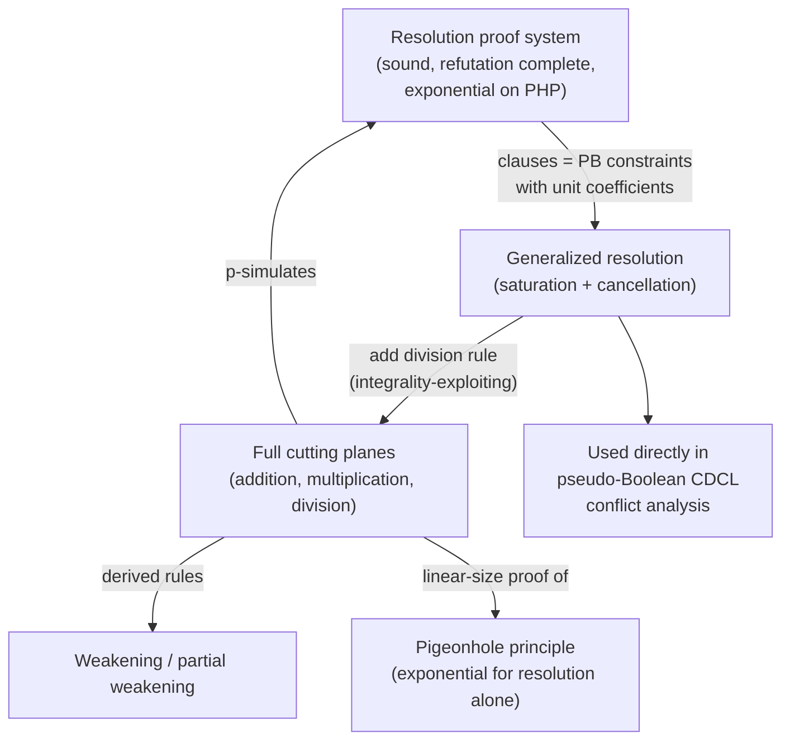

# The Cutting Planes Proof System

[[book-guidelines|↩ Back to guidelines]]

## Why resolution isn't enough

A SAT solver's unsatisfiability certificate is a resolution proof: a sequence of clauses, each derived from two earlier ones by the resolution rule, ending in the empty clause $\bot$. Resolution is *sound* (everything it derives is a logical consequence of the input) and *refutation complete* (Def. 97–98 in the book) — for any inconsistent CNF formula, some resolution proof of its inconsistency exists. The catch is "some": completeness says a proof exists, not that it's short. For certain formula families, every resolution proof is exponentially large in the number of variables, so a resolution-based solver is provably doomed to run forever in practice, no matter how clever its heuristics are.

The canonical hard family is the **pigeonhole principle** (PHP): "$n$ pigeons cannot fit into $n-1$ holes with one pigeon per hole." It's a trivial fact — a one-line counting argument — but Haken showed in 1985 that it requires exponentially many resolution steps to refute as a CNF formula [Hak85]. Resolution can only ever combine two clauses at a time by cancelling one literal; it has no way to *count*. Proving PHP by resolution means resolution is forced to simulate a counting argument one clause-pair at a time, and that simulation blows up.

Pseudo-Boolean (PB) constraints — linear inequalities over 0/1 literals, $\sum_i \alpha_i \ell_i \geq \delta$ — are exactly the representation that *can* count directly: a constraint's coefficients and degree are themselves an arithmetic statement. The **cutting planes** proof system is what lets a solver reason about PB constraints the way it reasons about clauses, but with arithmetic instead of pure matching. This is the mechanism the book introduces in §4.2.2 to justify why pseudo-Boolean solving is not just "CDCL with fancier constraints" — it's CDCL running on top of a strictly more powerful proof system.

## The axioms

Cutting planes starts from two axiom schemas, one per literal:

$$
\underbrace{0 \le x \le 1}_{\text{(bounds)}} \qquad\qquad \underbrace{\bar x = 1 - x}_{\text{(negation)}}
$$

*Bounds* says every Boolean variable is a 0/1 value — this is what lets the proof system treat variables as **integers** rather than reals, which turns out to be load-bearing (see the division rule below). *Negation* pins down what a negated literal means arithmetically: $\bar x$ isn't a separate symbol, it's a definition, $1-x$. Every inference rule below is stated purely in terms of these two axioms plus arithmetic — there is no separate "meaning" of a PB constraint beyond what these two facts imply.

## The three core inference rules

**Addition.** Two derived constraints can always be summed, coefficient-wise, degree-wise:

$$
\frac{\sum_{i=1}^n \alpha_i \ell_i \ge \delta \qquad \sum_{i=1}^{n'} \beta_i \ell_i' \ge \delta'}{\sum_{i=1}^n \alpha_i \ell_i + \sum_{i=1}^{n'} \beta_i \ell_i' \ge \delta + \delta'} \text{ (addition)}
$$

This is the arithmetic fact "if $A \ge a$ and $B \ge b$ then $A+B \ge a+b$" — soundness is immediate. It's also the rule that lets cutting planes do what resolution structurally can't: sum many constraints at once to build a counting argument (this is exactly the move the pigeonhole proof below relies on).

**Multiplication.** Any derived constraint can be scaled up by a positive integer $\lambda$:

$$
\frac{\sum_{i=1}^n \alpha_i \ell_i \ge \delta \qquad \lambda \in \mathbb{N}^*}{\sum_{i=1}^n \lambda\alpha_i \ell_i \ge \lambda\delta} \text{ (multiplication)}
$$

Notation: the book writes $\lambda\chi$ for "constraint $\chi$ scaled by $\lambda$" (Notation 15). Multiplication alone changes nothing logically — it just rescales — but it's the setup step that makes addition useful for cancelling out unwanted literals (scale two constraints so a literal's coefficients match, then add).

**Division.** This is the rule with teeth:

$$
\frac{\sum_{i=1}^n \alpha_i \ell_i \ge \delta \qquad \rho \in \mathbb{N}^*}{\sum_{i=1}^n \lceil \frac{\alpha_i}{\rho} \rceil \ell_i \ge \lceil \frac{\delta}{\rho} \rceil} \text{ (division)}
$$

where $\lceil x \rceil$ is the unique integer $r$ with $r - 1 < x \le r$ (Notation 16). Divide every coefficient *and* the degree by $\rho$, then round every coefficient (and the degree) **up**.

Here's what the rounding buys you, and why it's the whole point of the rule (Remark 30 in the book). Take $2x + 2y + 2z \ge 3$. Over the *rationals*, this constraint's solution set includes points like $x=y=z=0.75$ (sum of coefficients $\times$ values $= 4.5 \ge 3$). But dividing by $\rho=2$ and rounding up gives $x + y + z \ge \lceil 3/2 \rceil = 2$ — and $x=y=z=0.75$ no longer satisfies *that* ($0.75+0.75+0.75 = 2.25 \ge 2$, actually it still does in this case, but the general point holds: rounding tightens the feasible region). Concretely: over 0/1 integers, "$2x+2y+2z \ge 3$" and "$x+y+z\ge 2$" are logically equivalent (both mean "at least 2 of the three are true"), but the *rational relaxations* of these two constraints are different polytopes, and the second is strictly smaller. Division exploits the fact that the variables are integers (guaranteed by the *bounds* axiom) to legally shrink the rational relaxation without losing any integer solutions — a move with **no counterpart in resolution**, because resolution has no notion of coefficients to round. This is precisely why cutting planes is a strictly stronger proof system than resolution, and it is literally named after the geometric idea (Gomory cutting planes) of slicing away the fractional corners of an integer program's LP relaxation without cutting off any integer point.

One subtlety worth keeping: division does **not** preserve logical equivalence in general — only when $\rho$ evenly divides every coefficient does the derived constraint mean exactly the same thing as the original. When it doesn't divide evenly, rounding strictly *strengthens* the constraint (rules out more assignments), which is still sound (everything ruled out was already unsatisfiable-with-respect-to-what-you're-deriving) but not reversible. Note also that the *degree* $\delta$ doesn't need to be divisible by $\rho$ for the rule to apply — only the rounding-up matters.

```rust
/// A cutting-planes constraint: sum(coeffs[i] * literal[i]) >= degree.
/// Literals are represented as signed ints: positive = x, negative = ¬x.
#[derive(Clone, Debug)]
struct PbConstraint {
    terms: Vec<(u64, i64)>, // (coefficient, literal)
    degree: i64,
}

impl PbConstraint {
    fn multiply(&self, lambda: u64) -> Self {
        PbConstraint {
            terms: self.terms.iter().map(|(a, l)| (a * lambda, *l)).collect(),
            degree: self.degree * lambda as i64,
        }
    }

    fn divide_round_up(&self, rho: u64) -> Self {
        let ceil_div = |a: u64, b: u64| (a + b - 1) / b;
        PbConstraint {
            terms: self.terms.iter()
                .map(|(a, l)| (ceil_div(*a, rho), *l))
                .collect(),
            // degree can be negative in general PB reasoning; handle the
            // common non-negative case shown here for clarity.
            degree: ceil_div(self.degree as u64, rho) as i64,
        }
    }
}
```

A proof checker is just a straight-line interpreter over a trace of these rule applications — this is the "trusted kernel" analogue for pseudo-Boolean reasoning: as long as `PbConstraint::multiply`, `divide_round_up`, and `addition` (below) are each individually sound, any sequence of calls to them produces a sound derivation, and the checker never needs to re-derive *why* — only to replay the arithmetic. This is structurally the same trust argument a type-theoretic kernel makes about `isDefEq`: small, individually-verified primitive steps compose into large proofs the kernel doesn't need to "understand," only replay.

## The generalized resolution subsystem: saturation and cancellation

Using the three raw rules directly is powerful but unwieldy. In practice, both the book's presentation and real solvers work with a derived subsystem — **generalized resolution** [Hoo88] — built from two combined rules.

**Saturation** caps every coefficient at the constraint's own degree:

$$
\frac{\sum_{i=1}^n \alpha_i \ell_i \ge \delta}{\sum_{i=1}^n \min(\alpha_i, \delta)\ell_i \ge \delta} \text{ (saturation)}
$$

Intuitively: no single literal needs a coefficient bigger than $\delta$, because once a literal contributes $\delta$ or more on its own, the rest of the constraint is irrelevant to whether it's satisfied by that literal alone. Saturating never loses information about which assignments satisfy the constraint (it's a *normalization*, not a real weakening) — a derivable fact via addition, multiplication, and the axioms, which is why the book presents it as a rule rather than a primitive.

**Cancellation** is the generalization of resolution proper: eliminate a literal $\ell$ that appears positively in one constraint and negatively ($\bar\ell$) in another, by scaling each until the coefficients of $\ell$ match, then adding and subtracting the shared part:

$$
\frac{\alpha\ell + \sum_{i=1}^n \alpha_i\ell_i \ge \delta \qquad \beta\bar\ell + \sum_{i=1}^{n'} \beta_i\ell_i' \ge \delta' \qquad \rho,\rho'\in\mathbb{N}^* \qquad \rho\alpha = \rho'\beta}{\sum_{i=1}^n \rho\alpha_i\ell_i + \sum_{i=1}^{n'}\rho'\beta_i\ell_i' \ge \rho\delta + \rho'\delta' - \rho\alpha} \text{ (cancellation)}
$$

The book abbreviates "cancel then saturate (if needed)" as $\rho\chi \boxplus \rho'\chi'$ (Notation 18), typically choosing $\rho = \mathrm{lcm}(\alpha,\beta)/\alpha$ and $\rho'=\mathrm{lcm}(\alpha,\beta)/\beta$ — the smallest multipliers that make the two coefficients of $\ell$ equal, so they cancel exactly when added.

Here's the sharp point the book makes with Example 55: **cancellation alone is not refutation complete.** Take the classic 2-variable unsatisfiable CNF $(a\lor b)\land(a\lor\bar b)\land(\bar a\lor b)\land(\bar a\lor\bar b)$, written as PB constraints $a+b\ge1,\ a+\bar b\ge1,\ \bar a+b\ge1,\ \bar a+\bar b\ge1$. No sequence of pure cancellations derives $\bot$ from these. Why? Because cancellation, on its own, is sound *even over the rationals* — it never uses the fact that variables are integers. But this formula's unsatisfiability is an inherently integer fact (there's no rational point in $[0,1]^2$ that satisfies all four either — actually here the rational relaxation is also empty, but the general phenomenon Remark 31 flags is that cancellation-only reasoning is blind to integrality, and there exist formulas where the rational relaxation is satisfiable while the integer problem isn't, so cancellation alone cannot refute them). Saturation is what reintroduces the integrality fact into the reasoning — it's derived using the *bounds* axiom, which is precisely the fact "these are 0/1 integers, not reals." This is the same integrality argument that made division powerful above: cancellation without saturation is a purely linear-algebraic (rational) proof system, and generalized resolution needs saturation to recover full refutation completeness.

```python
# A tiny illustration of cancellation: eliminate literal `b` between
# a + b >= 1   and   ā + b̄ >= 1   (i.e. ¬a ∨ ¬b, so "a" cancels against "ā"... )
# Here we cancel on `b` vs `b̄` instead, between a+b>=1 and (1-a)+(1-b)>=1.
def cancel(c1, c2, lit):
    """c1, c2: dict[str, int] coefficients (negative var name = negated lit),
    plus a 'degree' key. lit: the variable name to cancel on (positive in c1,
    negative in c2, coefficients already scaled to match)."""
    result = {"degree": c1["degree"] + c2["degree"] - c1[lit]}
    keys = set(c1) | set(c2)
    keys.discard(lit)
    keys.discard("~" + lit)
    keys.discard("degree")
    for k in keys:
        result[k] = c1.get(k, 0) + c2.get(k, 0)
    return result  # caller then applies saturation: min(coeff, degree)
```

## Weakening and partial weakening

Two more rules — themselves derivable by combining addition, multiplication, and the axioms — are used constantly in conflict analysis to control how large derived constraints get.

**Weakening** drops a literal entirely, paying for it by lowering the degree by that literal's coefficient:

$$
\frac{\alpha\ell + \sum_{i=1}^n \alpha_i\ell_i \ge \delta \qquad \alpha\in\mathbb{N}}{\sum_{i=1}^n \alpha_i\ell_i \ge \delta - \alpha} \text{ (weakening)}
$$

Written `weaken(ℓ, χ)` in the book's Notation 19. Intuitively: if $\ell$ was contributing up to $\alpha$ toward satisfying the constraint, removing it entirely means the remaining literals must cover $\alpha$ less of the degree — hence $\delta \to \delta - \alpha$. This is always sound (a strict weakening: the new constraint is implied by, but does not imply, the old one) and it's how a solver shrinks a learned constraint's size at the cost of derivational strength.

**Partial weakening** generalizes this to shrinking a literal's coefficient instead of deleting it outright:

$$
\frac{\alpha\ell + \sum_{i=1}^n \alpha_i\ell_i \ge \delta \qquad \varepsilon\in\mathbb{N},\ 0\le\varepsilon<\alpha}{(\alpha-\varepsilon)\ell + \sum_{i=1}^n \alpha_i\ell_i \ge \delta - \varepsilon} \text{ (partial weakening)}
$$

Full weakening is the special case $\varepsilon = \alpha$. Partial weakening is the finer-grained knob: it lets a solver trade away exactly as much strength as needed to control coefficient growth, rather than being forced to choose between "keep the literal at full weight" and "delete it entirely." (This tradeoff — how aggressively to weaken during conflict analysis — is the subject of the sibling topic on pseudo-Boolean solving strategies; here the point is only that the *rule itself* is a derived, sound piece of the cutting planes calculus.)

## p-simulation: resolution is a special case

The reason cutting planes matters for a solver, not just in theory, is that it **p-simulates** resolution: every resolution proof translates into a cutting planes proof at most polynomially larger. Concretely, both of resolution's rules fall directly out of generalized resolution's rules, once clauses are read as PB constraints with all coefficients $1$ and degree $1$ (i.e. "at least one of these literals is true"):

$$
\frac{\ell + \sum_{i=1}^n \ell_i \ge 1 \qquad \bar\ell + \sum_{i=1}^{n'} \ell_i' \ge 1}{\sum_{i=1}^n \ell_i + \sum_{i=1}^{n'} \ell_i' \ge 1+1-1 = 1} \text{ (resolution = cancellation, } \rho=\rho'=1\text{)}
$$

$$
\frac{\sum_{i=1}^n \alpha_i\ell_i \ge 1}{\sum_{i=1}^n \min(\alpha_i,1)\ell_i \ge 1} \text{ (merge = saturation)}
$$

Resolution's rule is cancellation with the trivial scaling $\rho=\rho'=1$; the clausal *merge* rule (removing a duplicate literal produced when the same variable appears in both parent clauses) is exactly saturation, since capping every coefficient at degree $1$ is the same as capping it at $1$. So every resolution derivation is *already* a cutting planes derivation, literally step for step — this is what "p-simulation" means concretely, not just an asymptotic size bound but a direct syntactic embedding.

What p-simulation does **not** say is that the converse holds: it is not the case that every cutting planes proof translates back into a comparably-sized resolution proof. Cutting planes is *strictly* stronger — there exist formulas with exponential-size resolution proofs but only linear-size cutting planes proofs. Pigeonhole is exactly such a family, and it's worth actually building the proof to see where the extra power comes from, since the book states the result (citing [Hak85, CR79, CCT87, Nor15]) without walking through the derivation.

## A linear-size cutting planes proof of the pigeonhole principle

Set up variables $x_{i,j}$ for "pigeon $i$ goes in hole $j$," $i=1,\dots,n$, $j=1,\dots,n-1$. Two families of PB constraints encode "each pigeon in some hole" and "each hole holds at most one pigeon":

$$
C_i:\ \sum_{j=1}^{n-1} x_{i,j} \ge 1 \quad (i=1,\dots,n) \qquad\qquad H_j:\ \sum_{i=1}^{n} \bar x_{i,j} \ge n-1 \quad (j=1,\dots,n-1)
$$

($H_j$ says "at most one of the $n$ pigeons is in hole $j$," phrased as "at least $n-1$ of them are *not*.")

The proof needs exactly three moves, all uses of *addition*:

1. **Sum all $n$ pigeon constraints** $C_1,\dots,C_n$ (that's $n-1$ applications of addition):
 $$\sum_{i=1}^n\sum_{j=1}^{n-1} x_{i,j} \ge n$$
2. **Sum all $n-1$ hole constraints** $H_1,\dots,H_{n-1}$ ($n-2$ more applications of addition):
 $$\sum_{j=1}^{n-1}\sum_{i=1}^{n} \bar x_{i,j} \ge (n-1)^2$$
3. **Add these two totals together** (one more addition), then unfold every $\bar x_{i,j}$ via the *negation* axiom, $\bar x_{i,j} = 1-x_{i,j}$:
 $$\sum_{i,j} x_{i,j} + \sum_{i,j}(1-x_{i,j}) \ge n + (n-1)^2$$
 The left side telescopes to a constant, $n(n-1)$ (there are $n(n-1)$ terms, each pair $x_{i,j}+(1-x_{i,j})$ summing to $1$), while the right side is $n+(n-1)^2 = n^2-n+1$. So:
 $$n(n-1) \ge n^2-n+1 \quad\Longleftrightarrow\quad n^2-n \ge n^2-n+1 \quad\Longleftrightarrow\quad 0 \ge 1$$
 — a direct numeric contradiction, i.e. the degenerate constraint $0\ge1$, which is $\bot$.

Total proof size: $O(n)$ addition steps over $O(n)$ input constraints. Compare this to resolution, which is structurally unable to add two clauses' worth of "counting evidence" together — it can only ever match and cancel single literals between clause pairs — and is forced into an exponential case analysis over which pigeon goes in which hole. The cutting planes proof above never performs case analysis at all: it is a pure arithmetic sum, exactly the "count the pigeons, count the hole capacity, compare" argument a human would give informally. This is the payoff Remark 30 was pointing at — the extra power comes from treating constraints as genuine arithmetic objects that can be summed, not merely as sets of literals that can be pattern-matched.

```python
def php_cutting_planes_proof(n):
    """Builds the linear-size CP refutation of PHP(n pigeons, n-1 holes)
    as a trace of addition steps, returning the final contradictory bound."""
    holes = n - 1
    # C_i: sum_j x_{i,j} >= 1  -- summed over all i gives sum >= n
    pigeon_total_degree = sum(1 for _ in range(n))          # = n
    # H_j: sum_i not(x_{i,j}) >= holes  -- summed over all j gives >= holes^2... 
    # (n-1) holes each contributing degree (n-1):
    hole_total_degree = sum(holes for _ in range(holes))    # = (n-1)^2
    lhs_constant = n * holes                                 # telescoped sum
    rhs = pigeon_total_degree + hole_total_degree
    assert lhs_constant < rhs, "contradiction: 0 >= (rhs - lhs_constant) > 0"
    return rhs - lhs_constant  # the derived "0 >= k" for k = 1
```

```lean
-- A skeletal Lean rendering of one cutting-planes derivation step: the
-- addition rule, as a theorem about sums rather than an opaque proof rule.
-- `PBConstraint` bundles the coefficients/literals/degree; `holds` is its
-- semantics under a 0/1 assignment.
structure PBConstraint where
  terms  : List (Nat × Bool)  -- (coefficient, literal-is-positive) pairs, over shared vars
  degree : Int

-- Soundness of `addition` is not an axiom here — it is *proved*, by exactly
-- the same arithmetic fact used informally above ("if A ≥ a and B ≥ b then
-- A + B ≥ a + b"), which is why the trusted kernel can stay small: it only
-- needs `Int.add_le_add`, not a bespoke cutting-planes axiom.
theorem addition_sound (a b δa δb : Int) (ha : a ≥ δa) (hb : b ≥ δb) :
    a + b ≥ δa + δb :=
  Int.add_le_add ha hb
```

The Lean sketch above is the point worth dwelling on: unlike a type-theoretic kernel deciding definitional equality (which must always be checking a *meaning-preserving* relation — `rfl` never changes what a term denotes), the cutting planes *division* rule is deliberately **not** meaning-preserving in general. A kernel built to check cutting planes proofs therefore cannot reuse "is this step definitionally trivial" as its notion of validity — it has to check "is this step sound," which is a strictly weaker requirement admitting genuine strengthening steps. That's a useful contrast to keep in mind when the elaborator/kernel design in your own compiler project reaches for a proof-checking style: type-checking judgments and inference-rule proof checking share the same "small trusted core replays primitive steps" shape, but the primitive steps themselves don't have to preserve equivalence — only soundness.

## Where this leads



Within the book's own structure, this proof system is the theoretical foundation the rest of Chapter 4 builds a *solver* on top of: §4.2.2 immediately continues by using cancellation and saturation as the actual conflict-analysis mechanism of a pseudo-Boolean CDCL solver (bounding coefficient growth via reduction algorithms, computing assertion levels, and so on) — that engineering layer is the sibling topic "Pseudo-Boolean Solving via Cutting Planes." It's also the reason Chapters 5 and 6 exist at all: cutting planes' rules (cancellation, weakening) are what introduce the "irrelevant literals" phenomenon studied there — literals a rule leaves behind in a constraint without them actually affecting its truth value.

For the standing project (`automated-reasoning`, `sat-smt-csp` focus areas): this is a directly transferable *trusted-kernel* pattern for the theorem prover's clause/resolution engine. A cutting planes checker is small, arithmetic, and individually verifiable rule-by-rule — exactly the shape you want for a proof-producing architecture where the solver searches freely (using whatever heuristics) but every accepted refutation is replayed through a minimal, independently-auditable checker before being trusted. The division rule's non-equivalence-preserving strengthening is also a useful conceptual bridge to Craig interpolation and abductive clause generation: both are places where a "stronger, non-equivalent but still sound" derived fact is exactly the point, not a defect to engineer around.
