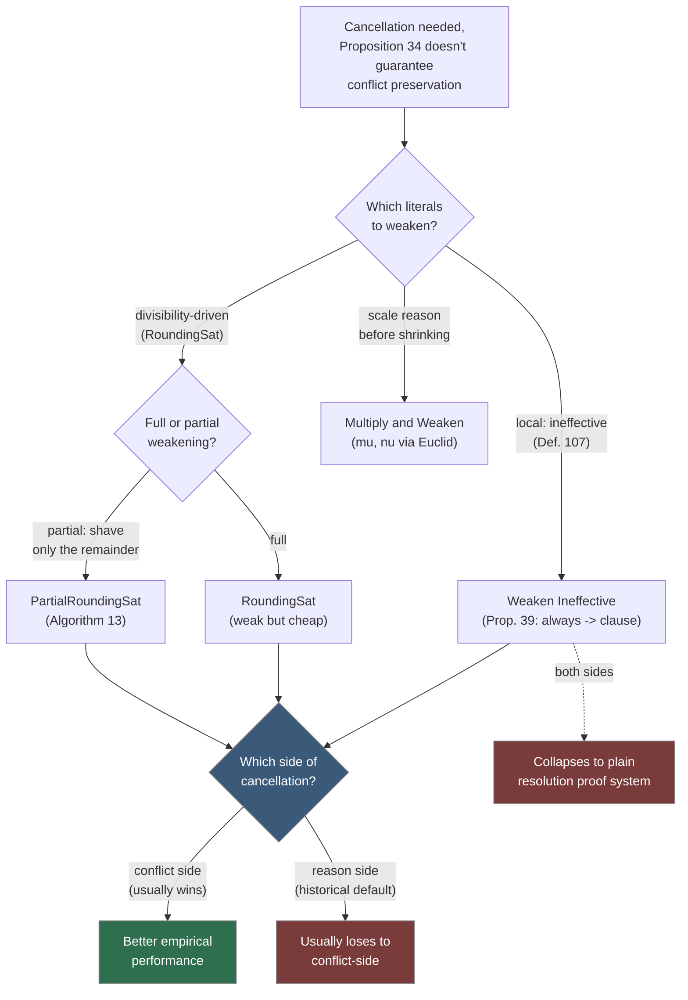

# Weakening Strategies for Pseudo-Boolean Solvers

[[book-guidelines|↩ Back to guidelines]]

## Why this chapter exists

A pseudo-Boolean CDCL solver's conflict analysis is built from one workhorse rule, the **cancellation rule**, plus a helper, the **weakening rule**, that is invoked whenever cancellation alone can't be trusted to preserve the conflict. Recall the shape of cancellation (§4.2.2, Notation 18): given a conflicting constraint and the reason for a literal it depends on, you multiply each by a coefficient and add them so the pivot literal disappears:

$$
\frac{\alpha\ell + \sum_{i=1}^n \alpha_i \ell_i \ge \delta \qquad \beta\bar\ell + \sum_{i=1}^m \beta_i \ell_i' \ge \delta' \qquad \rho, \rho' \in \mathbb{N}^* \qquad \rho\alpha = \rho'\beta}{\sum_{i=1}^n \rho\alpha_i \ell_i + \sum_{i=1}^m \rho'\beta_i \ell_i' \ge \rho\delta + \rho'\delta' - \rho\alpha} \quad (\text{cancellation})
$$

**Proposition 34** guarantees this stays conflicting *only* when one side propagates $\ell$ and the other is already conflicting under the current assignment — the clean case that mirrors resolution in a SAT solver. Outside that case, cancellation can silently lose the conflict. The fallback is the **weakening rule**:

$$
\frac{\alpha\ell + \sum_{i=1}^n \alpha_i \ell_i \ge \delta \qquad \alpha \in \mathbb{N}}{\sum_{i=1}^n \alpha_i \ell_i \ge \delta - \alpha} \quad (\text{weakening})
$$

which just drops a literal and pays for it by lowering the degree — sound, but strictly weakening the constraint (hence the name). The sibling article **Irrelevant Literals in Pseudo-Boolean Constraint Learning** (Chapter 5) studies one *cost* of this machinery: cutting-planes inference can turn a literal that never mattered semantically into one that looks syntactically load-bearing ("artificially relevant"). This chapter studies the *policy* question sitting right next to it: given that you sometimes *must* weaken to keep the proof sound, which literals do you weaken, on which side of the cancellation, and how aggressively? Wallon shows there is no free lunch here — every choice trades constraint **strength** against constraint **size** and **coefficient growth**, and the four strategies studied (Weaken Ineffective, RoundingSat, PartialRoundingSat, Multiply and Weaken) sit at different points on that tradeoff curve, with none dominating empirically.

If you're designing a CDCL-style search procedure for a CSP/SMT kernel — where "conflict analysis" is really "which part of the failed branch do I generalize into a no-good, and how aggressively do I drop irrelevant sub-constraints from it" — this chapter is a worked case study in exactly that decision, complete with the empirical verdict that *the meta-strategy (portfolio/VBS) beats every fixed policy*.

---

## 1. Effective and ineffective literals — the cheapest strategy

The first strategy doesn't ask "is this literal irrelevant" (Chapter 5's global, assignment-independent notion) — it asks a cheaper, local question: *does this literal matter for the propagation or conflict at hand, right now, under the current partial assignment?*

> **Definition 107 (Effective Literal).** Given a conflicting (resp. assertive) pseudo-Boolean constraint $\chi$, a literal $\ell$ of $\chi$ is **effective** in $\chi$ if it is falsified and satisfying it would not preserve the conflict (resp. propagation). $\ell$ is **ineffective** when it is not effective.

Read it operationally: flip $\ell$ from false to true (i.e., satisfy it) and re-check the slack. If the constraint is still conflicting (or the propagation still holds), $\ell$ wasn't doing any work — it's ineffective. This is a per-assignment, per-constraint notion, not a global property of $\chi$ as a Boolean function; the same literal can be effective under one partial assignment and ineffective under another.

**What breaks without this distinction:** a naive solver that always weakens whatever cancellation happens to touch will keep coefficients and clutter around that never contributed to the derivation, bloating both the learned constraint and every future cancellation against it.

### The strategy, and what it collapses to

**Weaken Ineffective**: before applying cancellation, weaken away every ineffective literal in the constraint. The book proves this isn't just a heuristic cleanup — it has an exact characterization:

> **Proposition 39.** The constraint derived after weakening away all ineffective literals in a conflicting or assertive constraint $\chi$ is equivalent to the disjunction of all the literals it contains — i.e., **to a clause**.

*Why (sketch).* If any literal $\ell_{i_0}$ had coefficient $\alpha_{i_0} < \delta$ strictly, then satisfying it would leave $\delta - \alpha_{i_0} > 0$ on the conflicting side — still conflicting — contradicting effectiveness. So every surviving literal must have coefficient exactly $\delta$ (after saturation), which is precisely what "clause" means for a normalized pseudo-Boolean constraint. In other words: *keep only what you couldn't safely throw away, and what's left has no room for coefficients above 1.*

This connects the two chapters directly:

> **Proposition 40.** Any literal $\ell$ that is irrelevant in $\chi$ (Chapter 5's global sense) is also ineffective in $\chi$ (this chapter's local sense).

So Weaken Ineffective is a **sound, efficient over-approximation** for getting rid of irrelevant literals — cheap to compute (no SAT call, no subset-sum DP, unlike Chapter 5's detection algorithms), but at a cost: it necessarily weakens away literals that *are* relevant too, because it can't tell the two apart (Remark 40). You get soundness and a tight explanation of the conflict, but you give up ever deriving a genuine, non-clausal pseudo-Boolean constraint through this path.

> **Worked example (Ex. 80–82).** $\chi = 5a_{(0@3)} + 5b_{(?@?)} + c_{(?@?)} + d_{(?@?)} + e_{(0@1)} + f_{(1@2)} \ge 6$ propagates $b$. Weakening away the ineffective literals $c, d, e, f$ and saturating leaves $a_{(0@3)} + b_{(?@?)} \ge 1$ — a clause, and exactly the one clause (out of the three clauses $\chi$ is semantically a conjunction of) that actually triggers the propagation of $b$.

### One side, both sides, or neither

Two further observations sharpen the strategy into three variants:

- **Both sides** (weaken ineffective literals on the conflict constraint *and* the reason before cancelling): the pivot's coefficient is always forced to 1 on both sides, so cancellation always succeeds *and* Proposition 34's precondition is trivially met. But since both operands are now clauses, cancellation degenerates to plain **resolution** — the proof system's strength collapses to that of SAT-style resolution, giving up cutting planes' exponential succinctness advantage entirely.
- **One side only** (conflict *or* reason): keeps the other side's coefficients intact, so cancellation can still produce genuine pseudo-Boolean constraints when Proposition 34 doesn't force weakening at all.
- Empirically (Figure 6.1, Table 6.1), **weakening on the conflict side outperforms weakening on the reason side** — a result the book flags as *counterintuitive*, since historically (RoundingSat aside) cutting-planes solvers weaken the reason by convention. The proposed explanation: literals introduced into the conflict side by a *later* cancellation step can still be caught and weakened away by a *subsequent* application of the strategy, so conflict-side weakening is self-correcting across the whole conflict-analysis loop in a way reason-side weakening isn't.

```rust
/// Definition 107, decided against the *current* partial assignment.
/// `slack_if_satisfied` recomputes the constraint's slack pretending `lit`
/// has been flipped to true; effectiveness asks whether that flip would
/// have rescued the conflict / killed the propagation.
fn is_effective(chi: &PbConstraint, lit: LitId, assign: &Assignment) -> bool {
    if assign.value(lit) != Some(false) {
        return false; // not falsified => vacuously ineffective
    }
    match chi.status(assign) {
        Status::Conflicting => chi.slack_if_satisfied(lit) < 0,   // still conflicting?
        Status::Assertive { propagated } => {
            chi.slack_if_satisfied(lit) < chi.coefficient(propagated)
        }
        Status::Satisfied | Status::Unresolved => false,
    }
}

/// Weaken-Ineffective, applied to exactly one operand of a cancellation.
/// `side` is Conflict or Reason — Chapter 6's empirical finding is that
/// Conflict tends to win, so callers should default to it.
fn weaken_ineffective(chi: &mut PbConstraint, assign: &Assignment) {
    let dead: Vec<LitId> = chi.literals()
        .filter(|&l| !is_effective(chi, l, assign))
        .collect();
    for l in dead {
        chi.weaken(l); // degree -= coefficient(l); drop l
    }
    chi.saturate(); // Proposition 39: what remains is now a clause
}
```

---

## 2. Stronger constraints: one-sided RoundingSat, and partial weakening

RoundingSat [EN18] is the pragmatic baseline the rest of the chapter improves on: it applies weakening-and-division unconditionally on the reason side before every cancellation, which keeps coefficients small (and the pivot coefficient always 1, so cancellation trivially preserves conflicts) — but at the cost of systematically inferring *weaker* constraints than generalized resolution's saturate-and-cancel approach. Two refinements are explored.

### 2.1 Weaken only when you have to, and only on one side

Instead of RoundingSat's unconditional weakening, apply the weakening-and-division reduction **only when Proposition 34's precondition fails**, and **only on one operand**. This preserves more information on the untouched side:

> **Worked example (Ex. 84).** Reason $4c_{(0@2)} + 2\bar b_{(?@?)} + 2\bar d_{(?@?)} + \bar a_{(1@1)} \ge 4$ (propagating $\bar b, \bar d$), conflict $8a_{(1@1)} + 7b_{(0@2)} + 7c_{(0@2)} + 2d_{(0@2)} + 2e_{(0@1)} + f_{(?@?)} \ge 11$. Weakening-and-dividing *only the reason* on $b$ gives $2c_{(0@2)} + \bar b_{(0@2)} + \bar d_{(0@2)} \ge 2$; cancelling against the untouched conflict yields $21c + 8a + 5d + 2e + f \ge 16$ — strictly stronger than the clause $c \lor e$ that fully-symmetric RoundingSat would have produced.

Same empirical pattern as §1: conflict-side weakening beats reason-side (Figure 6.5), though neither one-sided variant beats stock (both-sided) RoundingSat outright — the VBS across all three shows real room left on the table.

### 2.2 Partial weakening: shave off the remainder instead of the whole literal

The **partial weakening rule** is the finer instrument this whole chapter is really building toward:

$$
\frac{\alpha\ell + \sum_{i=1}^n \alpha_i \ell_i \ge \delta \qquad \varepsilon \in \mathbb{N} \qquad 0 \le \varepsilon < \alpha}{(\alpha - \varepsilon)\ell + \sum_{i=1}^n \alpha_i \ell_i \ge \delta - \varepsilon} \quad (\text{partial weakening})
$$

Full weakening is the special case $\varepsilon = \alpha$ (the literal disappears entirely). Partial weakening instead *shrinks* a literal's coefficient just enough — no more. **PartialRoundingSat** exploits this to fix RoundingSat's biggest waste: RoundingSat's division step requires every coefficient to be exactly divisible by the pivot's weight, and it enforces that by weakening a non-divisible literal away *completely*, even when only a small remainder is blocking divisibility.

> **Algorithm 13 (partialRoundingSatReduce).** For pivot $\ell$ with coefficient $\alpha$: for every other literal $\ell'$ with coefficient $\alpha'$ that is *not currently falsified*, if $\alpha'$ isn't divisible by $\alpha$, set $\mu \leftarrow \alpha' \bmod \alpha$, subtract $\mu$ from both the degree and $\alpha'$ (a partial-weakening step), then divide every coefficient by $\alpha$ as usual.

The key move: only the **remainder** $\mu = \alpha' \bmod \alpha$ is paid, not the whole coefficient. Divisibility (needed for the division rule to stay exact) is restored at minimal cost, and only for literals that aren't currently falsified — falsified literals are left alone since they're the ones the propagation/conflict actually depends on.

> **Worked example (Ex. 85).** Conflict $8a_{(1@1)} + 7b_{(0@2)} + 7c_{(0@2)} + 2d_{(0@2)} + 2e_{(0@1)} + f_{(?@?)} \ge 11$, cancelling on $b$ (coefficient 7). Partial weakening reduces this to $7a + 7b + 7c + 2d + 2e \ge 9$ (note: $f$, at coefficient 1, vanishes completely — $1 \bmod 7 = 1$ removes all of it), which divides by 7 to $a + b + c + d + e \ge 2$. Compare RoundingSat's own output on this example: the clause $b \lor c \lor d \lor e$ — PartialRoundingSat kept literal $a$ that full weakening would have discarded.

```rust
/// Algorithm 13, literally: reduce chi around pivot `lit` before dividing
/// by its coefficient, the way `div_rule` in stock RoundingSat would need
/// every coefficient to already be exactly divisible.
fn partial_rounding_sat_reduce(chi: &mut PbConstraint, lit: LitId, assign: &Assignment) {
    let alpha = chi.coefficient(lit);
    for other in chi.literals().filter(|&l| l != lit) {
        if assign.value(other) == Some(false) {
            continue; // falsified literals are never touched here
        }
        let alpha_prime = chi.coefficient(other);
        let mu = alpha_prime % alpha;
        if mu != 0 {
            // partial-weakening step: pay only the remainder
            chi.set_degree(chi.degree() - mu);
            chi.set_coefficient(other, alpha_prime - mu);
        }
    }
    // now every coefficient is a genuine multiple of alpha
    chi.divide_all_coefficients(alpha);
}
```

Empirically (Figure 6.6, Table 6.3), PartialRoundingSat applied on both sides beats stock RoundingSat — the extra bookkeeping (a modulo, versus RoundingSat's straight division) buys real strength at essentially the same asymptotic cost. Interestingly, the thesis reports the *opposite* of what [EN18, Remark 3.4] observed for the original RoundingSat implementation (Remark 42) — a reminder that "the same rule" can behave differently depending on exactly when it's invoked (RoundingSat applies weakening unconditionally; Sat4j's variants only when Proposition 34 forces it), which is itself a lesson about how sensitive these empirical comparisons are to implementation detail, not just to the proof-theoretic rule being implemented.

---

## 3. The need for tradeoffs: Multiply and Weaken

Every strategy above weakens the *reason* or the *conflict* — never both coefficients up together. **Multiply and Weaken** is different in kind: instead of shrinking one side down to match, it can **scale the reason up** first.

Let $r$ be the pivot's coefficient in the reason, $c$ its coefficient in the conflict. Find $\mu, \nu \in \mathbb{N}$ (via Euclidean division) with

$$(\nu - 1)\cdot r < \mu \cdot c \le \nu \cdot r$$

Multiply the *reason* by $\nu$, then weaken (successively dropping ineffective literals, with partial weakening to land exactly on target) until the reason's pivot coefficient is reduced to $\mu \cdot c$ — matching what cancellation needs. Because this manipulation doesn't automatically preserve the conflict the way a straight cancellation would, an extra weakening pass (as in generalized resolution) may still be needed afterward.

```python
# The mu, nu search that opens the Multiply-and-Weaken procedure:
# find mu, nu with (nu-1)*r < mu*c <= nu*r, via Euclidean division of mu*c by r.
def multiply_and_weaken_targets(r: int, c: int) -> tuple[int, int]:
    mu = 1
    q, rem = divmod(mu * c, r)
    nu = q + (1 if rem else 0)          # ceil(mu*c / r)
    assert (nu - 1) * r < mu * c <= nu * r
    return mu, nu
    # The reason is then multiplied by nu, and weakened (with partial
    # weakening where needed) until its pivot coefficient is exactly mu*c.
```

> **Worked example (Ex. 86).** Reason $5a_{(0@1)} + 5b_{(?@?)} + 3c_{(?@?)} + 2d_{(0@2)} + e_{(1@1)} \ge 6$ (propagates $b$, pivot coefficient 5), conflict $3\bar b_{(0@2)} + 2a_{(0@1)} + 2d_{(0@2)} + \bar e_{(0@1)} \ge 5$ (pivot coefficient 3). Rather than reaching for $\mathrm{lcm}(3,5) = 15$ (which is what plain cancellation with minimal multipliers would use), the reason is weakened on $e$ and *partially* on $c$, landing on $3a + 3b + 2d + c \ge 3$ after saturation — pivot coefficient exactly 3, matching the conflict's. Cancelling then gives $5a + 4d + c + \bar e \ge 5$.

The point isn't that this specific $\mu, \nu$ scheme is the best possible — the book is candid that Multiply and Weaken **underperforms** the other three families empirically, only modestly beating plain generalized resolution (Figure 6.11). **Its value is methodological**: it demonstrates that the design space of weakening policies is much larger than "weaken this literal or don't," and that scaling before shrinking is a legitimate additional axis, even if this particular instantiation of it doesn't pay off.

---

## 4. The empirical verdict: no dominant strategy, but a large VBS gap

Across all the experiments (Sat4j, 1200s timeout, 32GB memory), the same structural finding recurs at every level of comparison:

| Strategy family | Best variant | Solved instances (of ~3900+) | SOTA contribution of the *family* |
|---|---|---:|---:|
| Generalized Resolution | — | 3711 | 3 |
| Multiply and Weaken | — | 3767 | 4 |
| RoundingSat | both | 3843 | 12 |
| PartialRoundingSat | both | 3855 | 17 |
| Weaken Ineffective | both | 3815 | 76 |

("SOTA contribution" = instances solved by *that* family and by no other strategy in the comparison — Table 6.4.) PartialRoundingSat (both sides) is the strongest single strategy, edging out RoundingSat by 12 instances family-wide — but **Weaken Ineffective contributes the most unique solves (76)**, despite never producing anything but clauses. No strategy subsumes another: different families of benchmarks (`tsp`, `wnqueen`, `vertexcover-instances`, `FPGA_SAT05`, …) have sharply different winners, and the **virtual best solver (VBS)** — an oracle that always picks the fastest strategy per-instance — beats every individual strategy by a wide margin in every comparison in the chapter (Figures 6.1, 6.5, 6.6, 6.11).



That "no dominant strategy, but a big VBS gap" pattern is itself the chapter's real conclusion, and it generalizes past pseudo-Boolean solving. It's the same shape of result you see in portfolio SAT solving, algorithm selection for CSP backtracking heuristics, and — closer to a compiler/verifier context — choosing *which* over-approximation to weaken a Hoare-style loop invariant into when widening in an abstract interpreter: cheap-but-lossy generalization (Weaken Ineffective) sometimes beats expensive-but-precise generalization (PartialRoundingSat) on a given instance, for reasons that are hard to predict a priori from the instance alone.

---

## Where this leads

Structurally, this chapter sits between two others in Part II: Chapter 5 diagnoses *why* weakening produces artificially relevant literals, and this chapter is the response — a menu of concrete policies for applying the rule the solver is forced to use anyway, ranging from "always collapse to a clause" (cheap, safe, sometimes best) to "scale up before shrinking down" (Multiply and Weaken, an underperforming but instructive proof of concept). Chapter 7 picks up immediately where this leaves off: since none of these strategies dominates, and different strategies bump different literals during conflict analysis, Chapter 7 studies how the **VSIDS/EVSIDS branching heuristic** itself needs adapting once literals in a constraint carry unequal coefficients — a direct downstream consequence of which literals a given weakening strategy chooses to keep or discard here.

For the `sat-smt-csp` focus area, the load-bearing mechanism to carry forward is the **conflict-side-vs-reason-side asymmetry** and the **VBS-beats-every-fixed-policy** pattern: if your CSP kernel's conflict-driven no-good learning (the propositional-clause analogue of nogood generation over richer domains) ever needs a rule for "how much do I generalize away from this failure," this chapter is direct precedent that (a) local, cheap effectiveness checks (Definition 107's per-assignment test, no global analysis required) already buy most of the benefit of expensive relevance detection, and (b) a portfolio over 2–3 cheap policies, rather than committing to one "best" policy, is where the real performance is. It's also a concrete illustration — the partial-weakening rule of §2.2 especially — of a recurring idea in abstract interpretation: don't throw away a fact entirely just because it's slightly inconvenient (not exactly divisible); shave off only the part that's actually blocking the next step, and keep the rest.
