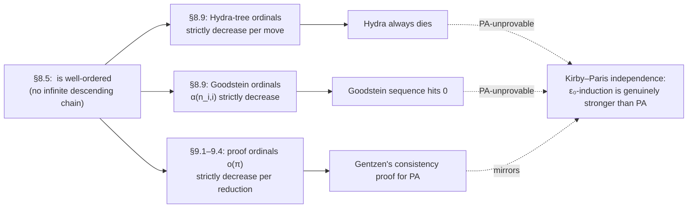

# Applications of Induction up to $\varepsilon_0$

[[book-guidelines|↩ Back to guidelines]]

## Why this chapter earns a party trick before the main event

Everything Chapter 8 built — well-orderings, ordinal notations $< \varepsilon_0$, the natural sum $\#$ — exists in the book to serve one purpose: giving Gentzen's consistency proof in Chapter 9 a termination measure strong enough to survive proof-size blowup ([[Ordinal-Notations-up-to-Epsilon-0|see the companion article on §§8.1–8.5]]). But before cashing that machinery in on something as involved as "does this proof-reduction procedure terminate," the book pauses to show it working on two problems you can state to a child: a game about chopping heads off a monster, and a sequence of numbers built from nothing but exponent bookkeeping. Both look like they're about finite, mundane objects — trees, natural numbers — with no ordinal in sight. Both turn out to require $\varepsilon_0$-induction to prove terminating, and, remarkably, **cannot be proven terminating by any means available inside Peano Arithmetic (PA) itself**. That last fact is the real payoff of this section: it's a concrete, hands-on preview of exactly the boundary that Gödel's second incompleteness theorem draws around PA, arrived at without a single mention of provability predicates or diagonalization.

*What breaks without $\varepsilon_0$*: if you tried to prove either the Hydra game terminates or a Goodstein sequence reaches $0$ using only ordinary induction on $\mathbb{N}$ — the strongest induction principle PA has — you would fail, provably. Not "fail because you're not clever enough": Kirby and Paris (1982) showed these statements are *true* (in the standard model of arithmetic) but *unprovable in PA*. The only route to a proof runs through a well-ordering that PA cannot certify as well-founded — precisely $\varepsilon_0$.

## A third witness for $\varepsilon_0$: finite trees

Before getting to the games, the book adds a third order-isomorphic copy of $\varepsilon_0$ to the two you already have (ordinals $<\varepsilon_0$ under $<$, and ordinal notations $<\varepsilon_0$ under $\prec$): **finite, finitely branching trees**.

> **Definition 8.65.** The set $\mathbb{T}$ of finite, finitely branching trees is defined inductively: a single node is a tree (height 1); if $T_1,\ldots,T_n$ are trees, attaching them all under a new root is a tree of height $k+1$, where $k = \max(\text{height}(T_1),\ldots,\text{height}(T_n))$; nothing else is a tree.

The ordering on $\mathbb{T}$ is defined by the same recipe you've already internalized for ordinal notations — compare children **in non-increasing order**, lexicographically, by height:

> **Definition 8.66.** Write $T$ and $T'$ (both of height $>1$) with their subtrees sorted $T_1 \succeq \cdots \succeq T_n$ and $T_1' \succeq \cdots \succeq T_n'$. Then $T = T'$ iff $n=n'$ and $T_i = T_i'$ for all $i$; and $T < T'$ iff either ($n < n'$ and $T_i = T_i'$ for $i \le n$) or (there's a $k$ with $T_i = T_i'$ for $i<k$ and $T_k < T_k'$).

This is *literally* the same construction as an ordinal notation $\boldsymbol{\omega}^{\alpha_1}+\cdots+\boldsymbol{\omega}^{\alpha_n}$ with $\alpha_1 \succeq \cdots \succeq \alpha_n$ — a node's identity **is** the non-increasing sequence of its children, exactly as an ordinal notation's identity is the non-increasing sequence of its exponents. Problems 8.67–8.68 (left to the reader) ask you to check that $\langle \mathbb{T}, < \rangle$ is a genuine strict linear order and that it's order-isomorphic to $\varepsilon_0$ — unsurprising, since you can literally read off an ordinal notation from a tree by recursively translating "$n$ children with values $\alpha_1 \succeq \cdots \succeq \alpha_n$" into "$\boldsymbol{\omega}^{\alpha_1}+\cdots+\boldsymbol{\omega}^{\alpha_n}$."

**Grounding (Rust).** A finite, finitely-branching tree is exactly the recursive data type you already reach for as an AST node:

```rust
#[derive(Clone, PartialEq, Eq)]
enum Tree {
    Node(Vec<Tree>), // children, no separate "Leaf" needed: Node(vec![]) is a leaf/head
}

impl Tree {
    fn height(&self) -> usize {
        match self {
            Tree::Node(children) => 1 + children.iter().map(Tree::height).max().unwrap_or(0),
        }
    }
}

impl Ord for Tree {
    fn cmp(&self, other: &Self) -> std::cmp::Ordering {
        // Definition 8.66: compare children in non-increasing order, lexicographically,
        // shorter-but-agreeing sequence loses (mirrors slex/lex on the ordinal-notation side).
        let (Tree::Node(a), Tree::Node(b)) = (self, other);
        let mut a_sorted = a.clone(); a_sorted.sort_by(|x, y| y.cmp(x));
        let mut b_sorted = b.clone(); b_sorted.sort_by(|x, y| y.cmp(x));
        a_sorted.cmp(&b_sorted) // Vec's lexicographic Ord does exactly clause (a)/(b)
    }
}
```

The comparator falling directly out of `Vec<T>`'s derived lexicographic ordering (once children are sorted) is not a coincidence — it *is* Definition 8.66, because a non-increasing sequence over an already-well-ordered type, compared lexicographically, is precisely how §8.2's machinery builds new well-orderings out of old ones.

## The Hydra game

> Imagine a tree as a many-headed monster, its leaves the heads. In the Greek myth, Hercules cuts off a head and the Hydra grows two more. In the **Hydra game**: when you remove a leaf node, the removed leaf's *parent* and its *remaining* descendants get **copied $n$ times** (any $n$ you like — you choose it fresh each move, and the game doesn't require you to be consistent).

Concretely: cut a head $C$ whose parent is $P$. $P$'s remaining children (after $C$ is gone) form a subtree rooted at $P$; that whole subtree — $P$ together with its surviving children — gets duplicated $n$ times, and all $n$ copies become new children of $P$'s own parent, replacing the single old $P$.

The diagram below reconstructs the book's worked example (a tree of height 4, with one head $C$ marked for removal, its sibling subtree $P$ shown with dashed edges to flag it as "the part that gets copied"), together with the ordinal notation the proof below assigns to every node.

<svg viewBox="0 0 640 430" xmlns="http://www.w3.org/2000/svg" font-family="Georgia, serif">
  <!-- edges -->
  <g stroke="#666" stroke-width="1.6" fill="none">
    <line x1="320" y1="380" x2="150" y2="290"/>
    <line x1="320" y1="380" x2="320" y2="300"/>
    <line x1="320" y1="380" x2="490" y2="290"/>
    <line x1="150" y1="290" x2="60" y2="190"/>
    <line x1="150" y1="290" x2="150" y2="200"/>
    <line x1="150" y1="290" x2="240" y2="190"/>
    <line x1="490" y1="290" x2="450" y2="190"/>
    <line x1="490" y1="290" x2="530" y2="190"/>
    <line x1="150" y1="200" x2="90" y2="90" stroke-dasharray="6 4"/>
    <line x1="150" y1="200" x2="150" y2="100" stroke-dasharray="6 4"/>
  </g>
  <line x1="150" y1="200" x2="210" y2="90" stroke="#666" stroke-width="1.6"/>

  <!-- nodes -->
  <g>
    <circle cx="320" cy="380" r="7" fill="#666"/>
    <circle cx="150" cy="290" r="7" fill="#666"/>
    <circle cx="320" cy="300" r="6" fill="#666"/>
    <circle cx="490" cy="290" r="7" fill="#666"/>
    <circle cx="60" cy="190" r="6" fill="#666"/>
    <circle cx="150" cy="200" r="7" fill="#666"/>
    <circle cx="240" cy="190" r="6" fill="#666"/>
    <circle cx="450" cy="190" r="6" fill="#666"/>
    <circle cx="530" cy="190" r="6" fill="#666"/>
    <circle cx="90" cy="90" r="6" fill="#666"/>
    <circle cx="150" cy="100" r="6" fill="#666"/>
    <circle cx="210" cy="90" r="7" fill="none" stroke="#c0392b" stroke-width="2.5"/>
  </g>

  <!-- labels -->
  <g font-size="13" fill="#555">
    <text x="335" y="410">root: $\omega^{Q}+\omega^{R}+\omega^{0}$</text>
    <text x="345" y="380">$= \boldsymbol{\omega}^{\boldsymbol{\omega}^{\boldsymbol{\omega}^0\cdot3}+\boldsymbol{\omega}^0\cdot2}+\boldsymbol{\omega}^{\boldsymbol{\omega}^0\cdot2}+\boldsymbol{\omega}^0$</text>
    <text x="20" y="270">$Q=\boldsymbol{\omega}^{\boldsymbol{\omega}^0\cdot3}+\boldsymbol{\omega}^0\cdot2$</text>
    <text x="330" y="295">head, $0$</text>
    <text x="500" y="270">$R=\boldsymbol{\omega}^0\cdot2$</text>
    <text x="15" y="180">$0$</text>
    <text x="160" y="180">$P=\boldsymbol{\omega}^0\cdot3$</text>
    <text x="250" y="180">$0$</text>
    <text x="410" y="180">$0$</text>
    <text x="540" y="180">$0$</text>
    <text x="65" y="75">$A{=}0$</text>
    <text x="115" y="75">$B{=}0$</text>
    <text x="218" y="75" fill="#c0392b">$C{=}0$ (cut)</text>
  </g>
</svg>

*Reading the diagram bottom-up (root at the bottom, per the book's own convention): the root has three children — $Q$, a lone head, and $R$. $Q$ has three children — a lone head, $P$, and another lone head. $P$ has three head-children $A,B,C$, with $C$ marked for removal; $A,B$ (dashed) are "the remaining subtree" that gets duplicated.*

### The assignment and the termination theorem

> **Theorem 8.69 (Kirby and Paris, 1982).** If you keep cutting off heads, in any manner, the Hydra eventually dies.

The proof needs no combinatorial cleverness about *how* you play — it needs exactly one clean idea: assign every node an ordinal notation $<\varepsilon_0$ in a way that mirrors the ordinal-notation constructor itself, then show that a legal move can only decrease the root's notation.

> **Proof (Theorem 8.69).** Assign ordinal notations to nodes: (1) heads get $0$; (2) if a node's descendants (children) carry $\alpha_1 \succeq \cdots \succeq \alpha_n$, the node gets $\boldsymbol{\omega}^{\alpha_1}+\cdots+\boldsymbol{\omega}^{\alpha_n}$.
>
> A node directly above a head carries $\underbrace{\boldsymbol{\omega}^{\alpha_1}+\cdots+\boldsymbol{\omega}^{\alpha_n}}_{\alpha}+\boldsymbol{\omega}^0$ (the $\boldsymbol{\omega}^0$ contributed by the head itself). Two levels below a head, the grandparent carries $\underbrace{\boldsymbol{\omega}^{\beta_1}+\cdots+\boldsymbol{\omega}^{\beta_m}}_{\beta}\#\boldsymbol{\omega}^{\alpha+\boldsymbol{\omega}^0}$.
>
> If the head is removed, its immediate parent's notation drops from $\alpha+\boldsymbol{\omega}^0$ to $\alpha \prec \alpha+\boldsymbol{\omega}^0$. If that parent's remaining part is now copied $n$ times, the grandparent's notation becomes $\beta \# \underbrace{\boldsymbol{\omega}^\alpha+\cdots+\boldsymbol{\omega}^\alpha}_{n \text{ copies}, =\gamma}$. But $\gamma \prec \boldsymbol{\omega}^{\alpha+1}$ — no matter how large $n$ is, $n$ copies of $\boldsymbol{\omega}^\alpha$ never catch up to a single $\boldsymbol{\omega}^{\alpha+1}$ (this is Proposition 8.38 from §8.4, doing the same job it did for the proof-assignment in §9.1). So the grandparent's notation strictly decreases, hence — by monotonicity of $\#$ — so does everything above it, all the way to the root. $\square$

This is the entire proof. It never bounds $n$, never argues about the game's *strategy*, and never talks about how many heads there are (which can grow without any bound at all after a single move — a size-based measure is hopeless here, exactly the same "detours can grow the proof" phenomenon that ruled out an $\mathbb{N}$-valued measure for cut-elimination). It works because $\boldsymbol{\omega}^{\alpha+1}$ dominates *any finite number* of copies of $\boldsymbol{\omega}^\alpha$ — the single fact that makes an ordinal-valued measure strictly stronger than anything $\mathbb{N}$ can express.

### Worked example: watching the root actually decrease

Problem 8.70 asks you to compute what happens to the example tree above once $C$ is cut. Walking it through: $P = \boldsymbol{\omega}^0\cdot 3$ (three head-children $A,B,C$) loses $C$, leaving $P' = \boldsymbol{\omega}^0\cdot 2$ (children $A,B$ only). This reduced subtree $P'$ — the "remaining subtree," height 2 — gets copied $n=4$ times and reattached to $Q$ in place of the single old $P$. $Q$'s children are now: a lone head ($0$), four copies of $P'$ (each valued $\boldsymbol{\omega}^0\cdot2$), and another lone head ($0$) — six children in all, giving

$$Q_{\text{new}} = \boldsymbol{\omega}^{\boldsymbol{\omega}^0\cdot 2}\cdot 4 + \boldsymbol{\omega}^0\cdot 2.$$

Compare exponents first, as the ordering demands: $\boldsymbol{\omega}^0\cdot2 \prec \boldsymbol{\omega}^0\cdot 3$ (both height 1, coefficient $2<3$), so $\boldsymbol{\omega}^{\boldsymbol{\omega}^0\cdot2}$-anything is dominated by $\boldsymbol{\omega}^{\boldsymbol{\omega}^0\cdot 3}$-anything *regardless of how many copies pile up on the smaller-exponent side* — that's exactly Proposition 8.38 in miniature, with $n=4$ instead of some symbolic bound. Hence $Q_{\text{new}} \prec Q$, and since $Q$ was the root's dominant term, the whole root strictly decreases:

$$\text{root}_{\text{new}} = \boldsymbol{\omega}^{Q_{\text{new}}}+\boldsymbol{\omega}^{R}+\boldsymbol{\omega}^0 \;\prec\; \boldsymbol{\omega}^{Q}+\boldsymbol{\omega}^{R}+\boldsymbol{\omega}^0 = \text{root}.$$

Notice what just happened to the *tree's size*: it grew from $12$ nodes to $12 - 1 + 4\cdot 3 = 23$ nodes (removing $C$, then tripling three times over — each copy of $P'$ carries its own two children). Bigger tree, smaller ordinal. That gap is the entire reason $\varepsilon_0$ was worth building.

### Why "eventually" hides an independence result

Kirby and Paris didn't stop at proving Theorem 8.69 — they went on to show it is **not provable in PA**. The intuition, informally: any PA-provable statement of the form "this process, however you run it, always terminates" secretly bounds how long the process can run by some function PA can define — and PA-definable functions, however fast-growing (even towers of exponentials), are eventually all dominated by comparing against $\varepsilon_0$-recursive functions in a way PA's induction schema cannot certify. The Hydra game's survival time, as a function of the starting tree and the (adversarial, unbounded) choice of $n$ at each step, grows faster than any function PA can prove total. So the *statement* "the Hydra always dies" is true (you just proved it, using induction along $\langle \mathbb{T}, <\rangle \cong \varepsilon_0$), but PA — restricted to induction along $\mathbb{N}$ — cannot reach it. This is a genuine, mathematically clean instance of Gödel incompleteness: a true, meaningful, combinatorial $\Pi^0_2$ statement that outruns PA's proof strength, with the "extra strength needed" identified exactly, as $\varepsilon_0$-induction.

**Grounding (Rust) — the failure mode made concrete.** If you try to certify Hydra termination with an ordinary size- or depth-based measure, Rust's own type system won't stop you from writing code that plainly doesn't terminate in any way you can bound in advance:

```rust
fn play(mut hydra: Tree, mut cut: impl FnMut(&Tree) -> (Vec<usize>, usize)) -> u64 {
    let mut moves = 0;
    while !matches!(hydra, Tree::Node(ref cs) if cs.is_empty()) {
        let (_path, _n) = cut(&hydra); // adversary picks a head and a multiplier n
        // ... perform the cut-and-duplicate rewrite along `_path` with multiplier `_n` ...
        moves += 1; // this counter is NOT the termination certificate — it's exactly
                    // what has no a priori upper bound, which is the whole point.
    }
    moves
}
```

There is no way to instrument this loop with a `u64` (or even a symbolic polynomial, or a tower-of-exponentials) fuel counter fixed *in advance of seeing the adversary's choices* — that is what "not provable in PA" cashes out to operationally. The only certificate that works is exactly the ordinal-notation assignment above, recomputed at each step; this is the sharpest illustration in the whole book of why a Rust (or Lean) termination checker built only on structural/`u64`-valued decrease would be strictly weaker than one that accepts ordinal-valued measures — precisely the gap that a well-founded-recursion checker (Lean's `decreasing_by`, or a hand-rolled ranking-function checker in a program verifier) has to be able to reach for whenever a loop's "obviously it decreases" argument doesn't come with a syntactic upper bound.

## Goodstein sequences

The second application swaps trees for a much more mundane-looking object: writing numbers in different bases.

### Hereditary base-$b$ notation

Every $n$ can be written in base $b$ ($b \geq 2$) as $n = a_k b^k + a_{k-1}b^{k-1}+\cdots+a_1 b+a_0$ with $a_i < b$, $a_k > 0$. **Hereditary** base-$b$ notation additionally requires the *exponents themselves* to be written in hereditary base $b$ notation — recursively, all the way down. For example, $25{,}739$ in base $10$ is already hereditary (every exponent — $4,3,2,1$ — is $<10$):

$$25{,}739 = 2\cdot10^4+5\cdot10^3+7\cdot10^2+3\cdot10+9.$$

But in base $3$, the exponents themselves need decomposing. The book gives

$$25{,}739 \;\overset{?}{=}\; 3^9+2\cdot3^7+2\cdot3^4+2\cdot3^3+2\cdot3+2,$$

with the hereditary form obtained by rewriting the exponents $9=3^2$, $7=2\cdot3+1$, $4=3+1$:

$$25{,}739\;\overset{?}{=}\;3^{3^2}+2\cdot3^{2\cdot3+1}+2\cdot3^{3+1}+2\cdot3^3+2\cdot3+2.$$

*(A brief arithmetic flag, worth naming since the whole point of this section is precision about exactly this kind of bookkeeping: the printed identity doesn't check out — the right-hand side sums to $24{,}281$, not $25{,}739$. The correct base-$3$ expansion needs an extra $2\cdot3^6$ term: $25{,}739 = 3^9+2\cdot3^7+2\cdot3^6+2\cdot3^4+2\cdot3^3+2\cdot3+2$, hereditarily $3^{3^2}+2\cdot3^{2\cdot3+1}+2\cdot3^{2\cdot3}+2\cdot3^{3+1}+2\cdot3^3+2\cdot3+2$. The mechanism the book is illustrating — that exponents nest recursively once you leave base 10 — is exactly right; only this one worked numeral is off by a missing digit.)*

### The sequence and Goodstein's theorem

> **Definition.** The Goodstein sequence for $n$ is $n=n_2,n_3,n_4,\ldots$, where $n_{i+1}$ is obtained by writing $n_i$ in hereditary base-$i$ notation, changing every $i$ to $i+1$, and subtracting $1$.

Starting from $n_2 = 10 = 2^{2+1}+2$ (hereditary base $2$), the book computes:

$$
\begin{aligned}
n_3 &= 3^{3+1}+3-1 = 83\\
n_4 &= 4^{4+1}+2-1 = 4^{4+1}+1 = 1{,}025\\
n_5 &= 5^{5+1}+1-1 = 5^{5+1} = 15{,}625\\
n_6 &= 6^{6+1}-1 = 279{,}935 = 5\cdot6^6+5\cdot6^5+5\cdot6^4+5\cdot6^3+5\cdot6^2+5\cdot6+5\\
n_7 &= 5\cdot7^7+5\cdot7^5+5\cdot7^4+5\cdot7^3+5\cdot7^2+5\cdot7+5-1 = 4{,}215{,}754
\end{aligned}
$$

(Each of these checks out arithmetically — unlike the base-3 example above.) Elements explode: from $10$ to over four million in five steps, with no ceiling in sight. Every raw intuition says this sequence runs away to infinity. And yet:

> **Theorem 8.72.** The Goodstein sequence for $n$ eventually reaches $0$, for every $n$.

### The proof: the same trick, wearing a number-theoretic costume

The proof is a direct transplant of the Hydra argument: find a map from Goodstein numbers into ordinal notations $<\varepsilon_0$ under which the *number* can grow arbitrarily but the *ordinal* strictly decreases at every step.

> **Proof.** Given $n$'s base-$b$ representation, let $\alpha(n,b)$ be the ordinal notation obtained by replacing every $b$ (including inside exponents) with $\boldsymbol{\omega}$ — a genuine ordinal notation $<\varepsilon_0$, since $\boldsymbol{\omega}$-towers built this way are always well-formed. Assign $n_i \mapsto \alpha(n_i, i)$. Claim: $\alpha(n_i,i) \succ \alpha(n_{i+1},i+1)$.
>
> Write $n_i$'s base-$i$ form as $a_k i^k+\cdots+a_j i^j+a_0$ ($a_j > 0$), so $\alpha(n_i,i) = \boldsymbol{\omega}^{\alpha_k}\cdot a_k+\cdots+\boldsymbol{\omega}^{\alpha_j}\cdot a_j+a_0$. Bumping every $i$ to $i{+}1$ leaves $\alpha(n_i',i{+}1) = \alpha(n_i,i)$ unchanged as a notation (same shape, just relabeled base) — then subtracting $1$ either (a) decrements the constant term $a_0 \to a_0-1$, giving $\alpha(n_{i+1},i{+}1) = \boldsymbol{\omega}^{\alpha_k}\cdot a_k + \cdots + (a_0{-}1) \prec \alpha(n_i,i)$ trivially; or (b), if $a_0=0$, borrows from the lowest nonzero term $a_j$, replacing $\boldsymbol{\omega}^{\alpha_j}\cdot a_j$ with $\boldsymbol{\omega}^{\alpha_j}\cdot(a_j{-}1) + \sum_{s<j}\boldsymbol{\omega}^{\alpha(s,i+1)}\cdot i$ — a sum of terms all with exponent $\prec \alpha_j$ (since $s<j \Rightarrow \alpha(s,i{+}1)\prec\alpha_j$). Either way, the highest term where the two notations differ is $\boldsymbol{\omega}^{\alpha_j}\cdot a_j$ versus $\boldsymbol{\omega}^{\alpha_j}\cdot(a_j-1)$ — a strict decrease at the leading point of disagreement, so $\alpha(n_i,i) \succ \alpha(n_{i+1},i{+}1)$. $\square$

For the running example, $\alpha(n_4,4) = \boldsymbol{\omega}^{\boldsymbol{\omega}+1}+1 \succ \alpha(n_5,5) = \boldsymbol{\omega}^{\boldsymbol{\omega}+1} \succ \alpha(n_6,6) = \boldsymbol{\omega}^{\boldsymbol{\omega}}\cdot5+\boldsymbol{\omega}^5\cdot5+\boldsymbol{\omega}^4\cdot5+\boldsymbol{\omega}^3\cdot5+\boldsymbol{\omega}^2\cdot5+\boldsymbol{\omega}\cdot5+5$ — you can watch the *numbers* rocket upward from $1{,}025$ to $15{,}625$ to $279{,}935$ while the corresponding ordinal notations strictly shrink at every single step. Since $\langle O,\prec\rangle$ is well-ordered (Corollary 8.46), this descending chain of ordinal notations must be finite — so the Goodstein sequence itself must terminate (and it can only terminate at $n_i=0$, since $\alpha(0,i)=0$ is the unique minimum).

Just as with the Hydra game, **PA cannot prove Theorem 8.72** (Kirby–Paris, 1982): the Goodstein function — $n \mapsto$ (length of $n$'s Goodstein sequence) — grows so fast that it eventually dominates every function PA can prove total, so no PA-internal induction can certify that the sequence always bottoms out, even though the ordinal argument above (a two-page finitary proof!) settles it completely from outside PA.

**Grounding (Rust) — where "obviously terminates" would first go wrong.** Implementing this naively runs headlong into the growth rate before it runs into anything conceptually interesting:

```rust
use num_bigint::BigUint; // ordinary u64/u128 overflows within a handful of steps

/// One step of a Goodstein sequence: `n` is given already in base `b`
/// (as coefficient list, exponents recursively in the same base),
/// bump base to `b+1`, then subtract 1.
fn goodstein_step(n: &HereditaryBase, b: u32) -> HereditaryBase {
    let bumped = n.reinterpret_base(b, b + 1); // syntactic replace, value unchanged
    bumped.checked_sub_one()                   // the only place real work happens
          .expect("Goodstein numbers never hit 0 by underflow before the theorem says so")
}
```

The honest engineering lesson here is the *absence* of a natural loop invariant expressible over `u64`: nothing about the raw magnitude of `n` ever decreases, so a termination checker that only understands "this integer counter goes down" gives up immediately. What decreases is a value in a completely different codomain — $\varepsilon_0$ — that the sequence's own representation doesn't mention at all. That is the general shape of every non-trivial *total-correctness* argument for a program whose loop bound isn't syntactically obvious: you exhibit a ranking function into a well-founded order that need not be $\mathbb{N}$, exactly the move an abstract interpreter or termination analyzer makes when it certifies a loop's termination via a lexicographic or ordinal-valued ranking function rather than a literal decreasing counter in the program text. **Lean's mathlib** contains a formalization of Goodstein's theorem built on precisely this map into `Ordinal`, discharged via well-founded recursion on the ordinal order — the machine-checked version of exactly the ordinal-descent argument above, and a genuine example of a proof whose *statement* is pure arithmetic but whose *justification* is irreducibly transfinite, sitting inside a trusted kernel that has no trouble accepting it (Lean's logic is far stronger than PA) even though PA's kernel, so to speak, would reject the same induction.

## Where this leads

Structurally, this section is a **capstone demonstration**, not a dependency the rest of the book builds on: §9.1–9.4 assign ordinal notations to *proofs* (not trees or numbers) and show *proof reduction steps* (not head-cutting or base-bumping) strictly decrease them, but it is the exact same well-foundedness fact — Corollary 8.46, that $\langle O, \prec\rangle$ has no infinite descending chain — doing the work in both places. If you've followed why the Hydra's root ordinal must decrease, you already understand the shape of the argument Gentzen makes for PA's consistency; only the objects change.



The independence results are the sharpest possible confirmation that Hilbert's finitary program, as rescued by Gentzen, needed *exactly* $\varepsilon_0$ and not a whit less: PA (first-order induction on $\mathbb{N}$) cannot see far enough to prove these two elementary-sounding statements, and it is that same limitation — dressed up as "PA cannot prove its own consistency" — that Gödel's second incompleteness theorem generalizes. Chapter 9's proof of PA's consistency and this section's proofs of Hydra/Goodstein termination are, at bottom, the same theorem about the same well-ordering, applied to different finitary objects.

**For the compiler/verifier project this vault is building toward:** this section is the cleanest possible worked example of a *ranking function that isn't natural-number-valued* — directly relevant the moment your Hoare-triple contracts need to express **total correctness** (termination), not just partial correctness. A `requires`/`ensures`/`decreases` discipline that only accepts `u64`-valued measures is provably too weak for programs whose natural loop invariant looks exactly like a Goodstein sequence or a Hydra-style rewrite (unbounded local blowup, guaranteed eventual global decrease) — precisely the situation where an abstract interpreter's invariant-generation pass would need to synthesize an ordinal- or lexicographically-ordered ranking function instead of a scalar one. And on the elaboration side, a kernel that (like Lean's) accepts well-founded recursion over arbitrary well-orders — not just structural recursion — is exactly the trusted-computing-base feature that lets a proof of Goodstein's theorem, or any termination certificate shaped like it, be checked at all.
