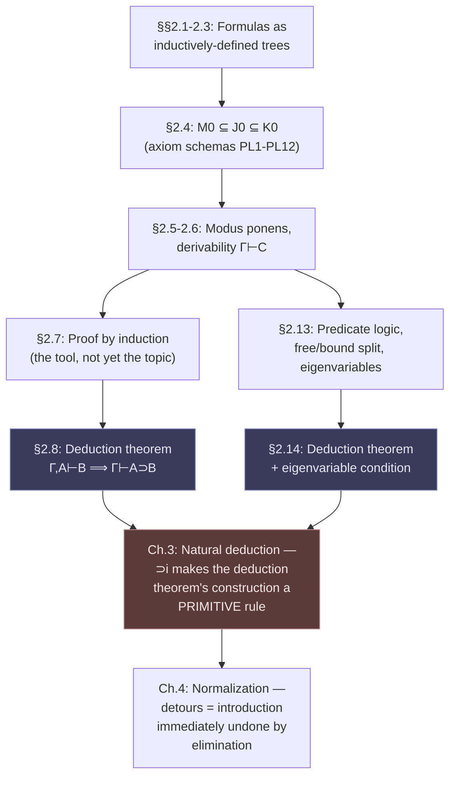

[[book-guidelines|↩ Back to guidelines]]

# Axiomatic (Hilbert-Style) Proof Systems

## Why start with the ugliest proof system in the book

Before you can appreciate why Gentzen invented [[Natural-Deduction|natural deduction]] and [[The-Sequent-Calculus|the sequent calculus]], you have to feel the pain his predecessors lived with. Hilbert's school, Frege, and Whitehead–Russell's *Principia Mathematica* all built logic the same way: a short list of **[[The-Sequent-Calculus#Axioms|axioms]]** (logical truths taken as starting points) plus a bare minimum of **inference rules** for grinding out new truths from old ones. That's it. No structured way to reason "suppose $A$ — then..."; no built-in machinery for hypothetical reasoning at all. Every hypothetical step has to be smuggled in and then paid for later, formula by formula.

Mancosu, Galvan, and Zach open the book with this system anyway, and deliberately make you suffer through a real derivation before showing you the escape hatch (the deduction theorem). That's a pedagogical choice worth taking seriously: the deduction theorem is not just a convenience lemma, it is the seed of everything Gentzen builds afterward — natural deduction's assumption-discharge rules are essentially the deduction theorem's proof *turned into a primitive rule of the calculus itself*. If you've done any work with typed lambda calculi or dependent type theory, this should already be ringing a bell: proving "if $\Gamma, A \vdash B$ then $\Gamma \vdash A \supset B$" by literally constructing a proof term is exactly what happens when a type checker introduces a function via `fun (h : A) => ...`. Keep that thought — we'll cash it in at the end.

This article covers §§2.1–2.14 of Chapter 2: formulas as inductively-defined objects, the three propositional calculi ($M_0, J_0, K_0$), modus ponens as the sole rule, proof by induction as a meta-tool, the deduction theorem, and predicate logic with its free/bound variable split and eigenvariable-restricted quantifier rules. (§§2.10–2.12, on the informal semantics of negation and an alternative axiomatization of $J_0$, and §2.15's Gödel–Gentzen translation, are covered by the guidelines but fall outside this topic's scope — they're worth a separate pass if you need them.)

---

## 1. Formulas as inductively defined trees

### What problem this solves

You need a *precise*, *decidable* answer to "is this string of symbols a formula?" — and you need that answer to come with a canonical way to do induction over formulas (which you will need constantly, starting in the very next section). An inductive definition gives you both for free.

**What breaks without the extremal clause.** The book makes this concrete rather than hand-wavy (Def. 2.2, discussion pp. 15–16): an inductive definition has a *basis clause* (atomic formulas are formulas), an *inductive clause* (if $A, B$ are formulas, so are $\neg A$, $(A \wedge B)$, $(A \vee B)$, $(A \supset B)$), and an *extremal clause* — "nothing else is a formula," i.e., the set of formulas is the **smallest** set closed under the first two clauses. Drop the extremal clause and the definition stops pinning down a unique set: any superset that happens to be closed under the connectives — say, one that also contains some junk symbol $\bigstar$ and everything you can build from it — satisfies the basis and inductive clauses too. The extremal clause is what rules out $\bigstar, \neg\bigstar, (\neg\bigstar \wedge p_3)$ as formulas. This is precisely the difference between a *coinductive* (greatest fixed point, "anything not excluded is allowed") and an *inductive* (least fixed point, "only what's explicitly built is allowed") reading of the same generating clauses — if you've touched Lean or Coq, you've seen this distinction as the difference between `inductive` and the (much rarer) `coinductive`/`CoInductive` definitions.

### Rust: the formula as an AST

The book's inductive definition *is* a context-free grammar, and in Rust it's just an enum — this is the same move a compiler frontend makes for expressions:

```rust
#[derive(Clone, PartialEq, Eq, Hash, Debug)]
enum Formula {
    Atom(u32),                          // p_1, p_2, ... (basis clause)
    Not(Box<Formula>),                  // ¬A
    And(Box<Formula>, Box<Formula>),    // (A ∧ B)
    Or(Box<Formula>, Box<Formula>),     // (A ∨ B)
    Implies(Box<Formula>, Box<Formula>),// (A ⊃ B)
}
```

The extremal clause is enforced automatically here: Rust's enum is a closed, inductively generated type — you *cannot* construct a `Formula` value that isn't built from finitely many applications of these five constructors. This is the payoff of encoding an inductive definition as an inductive *type*: the type checker becomes the extremal clause's enforcer, for free. This is also exactly why, later in the book, proofs "by induction on the construction of a formula" (§2.7) correspond one-to-one with Rust's/Lean's structural recursion on this type — there is no other way to build a `Formula`, so a `match` covering all five variants covers all formulas.

### The degree function, and reading formulas as trees (§§2.2–2.3, 2.5 in the book's numbering)

The book represents a formula's construction as a literal tree — leaves are atomic formulas, each internal node is labeled by the formula obtained by applying one connective to its children, and the root is the whole formula. This isn't just an illustration; it's the same tree that `Formula`'s recursive `enum` shape *is* in Rust — a formula's AST and its "construction tree" are the same object, described two ways.

From the tree structure the book defines the **degree** $d(A)$ — the number of logical symbols in $A$ — recursively (Def. 2.5):
$$d(A) = 0 \text{ if } A \text{ atomic}, \quad d(\neg B) = d(B)+1, \quad d(B \circ C) = d(B) + d(C) + 1 \ (\circ \in \{\wedge,\vee,\supset\})$$

```rust
fn degree(f: &Formula) -> u32 {
    match f {
        Formula::Atom(_) => 0,
        Formula::Not(a) => degree(a) + 1,
        Formula::And(a, b) | Formula::Or(a, b) | Formula::Implies(a, b) =>
            degree(a) + degree(b) + 1,
    }
}
```

Degree is the book's first example of a **well-founded measure over the syntax** — a role it will play over and over in the rest of the book (normalization measures, cut-elimination's degree/rank, ordinal notations). Get comfortable with "define a measure by recursion on formula structure, then induct on that measure" now; it is the load-bearing proof technique of proof theory.

**Lean cross-check.** In Lean, the same inductive family with the same recursive `degree` function would be:
```lean
inductive Formula where
  | atom : Nat → Formula
  | not  : Formula → Formula
  | and  : Formula → Formula → Formula
  | or   : Formula → Formula → Formula
  | imp  : Formula → Formula → Formula

def degree : Formula → Nat
  | .atom _   => 0
  | .not a    => degree a + 1
  | .and a b  => degree a + degree b + 1
  | .or  a b  => degree a + degree b + 1
  | .imp a b  => degree a + degree b + 1
```
Lean's kernel accepts `degree` because it can see the recursive calls are on strictly smaller subterms — this is literally the extremal clause doing its job as a termination certificate. This correspondence (inductive definition ⟷ inductive type ⟷ structural-recursion termination argument) is the first of many places this chapter is quietly teaching you the mechanics that make a trusted kernel trustworthy.

---

## 2. The three propositional calculi: $M_0 \subseteq J_0 \subseteq K_0$

### What problem this solves

The book wants to compare minimal, intuitionistic, and classical logic *as objects*, not just as vague philosophical stances. Doing that axiomatically forces you to say exactly, symbol for symbol, what separates them — and the answer is startlingly small: **two extra axiom schemas**, nothing else.

$M_0$ (minimal logic) has ten axiom schemas built purely from $\wedge, \vee, \supset$ (PL1–PL10, §2.4.1), e.g.
$$\text{PL1. } A \supset (A \wedge A) \qquad \text{PL6. } (A \wedge (A \supset B)) \supset B \qquad \text{PL9. } [(A\supset C)\wedge(B\supset C)]\supset[(A\vee B)\supset C]$$
$J_0$ (intuitionistic logic) is $M_0$ plus
$$\text{PL11. } \neg A \supset (A \supset B) \quad \text{(ex falso quodlibet)}$$
$K_0$ (classical logic) is $J_0$ plus
$$\text{PL12. } \neg\neg A \supset A \quad \text{(double negation elimination)}$$

Each axiom is a **schema** — every formula matching the shape, with metavariables uniformly instantiated by *any* formulas, counts as an axiom. This sidesteps needing a substitution rule (Gentzen, following Heyting, builds it into the definition of "axiom" instead).

**What this buys you, precisely stated:** $M_0 \subsetneq J_0 \subsetneq K_0$ as *sets of theorems* — a genuine strict hierarchy of logical strength, built by literally adding two lines. If you are building a verifier that has to support multiple logics (say, a constructive core with an optional classical extension for double-negation-elimination-using tactics), this axiomatic layering is the cleanest possible mental model: classical logic isn't a different logic, it's $J_0$ with one extra fact asserted about $\neg\neg$. A refinement-type or Hoare-logic checker that wants to stay constructive (so its proof terms remain computationally meaningful, e.g., for extracting a witness from an existential) is precisely a system that refuses PL12 — this is the proof-theoretic version of "no classical excluded-middle axiom in your tactic set."

---

## 3. Modus ponens as the sole inference rule, and derivability

### What problem this solves — and what it costs

All three calculi share exactly **one** rule: modus ponens (mp) — from $A$ and $A \supset B$, infer $B$. A **derivation** in $S_0$ (where $S_0 \in \{M_0, J_0, K_0\}$) is a finite sequence $A_1, \ldots, A_n$ where each $A_i$ is either an axiom instance or follows from two earlier lines by mp (Def. 2.6); $A_n$ is the *end-formula*, and if $A_n = B$ we write $\vdash_{S_0} B$.

The book makes you feel the cost of this minimalism immediately: it walks through an 11-line derivation of the utterly trivial-sounding $p_1 \supset (p_2 \vee p_1)$ (§2.5, p. 20), and the derivation is, in the book's own words, "incredibly hard to read." There is no built-in mechanism for hypothetical reasoning — every intermediate fact must already be a *theorem* (derivable from nothing), because the only move you have is mp between two already-established lines. This single-rule austerity is exactly the shape of a minimal trusted kernel: fewer primitive inference rules means a smaller, more auditable trusted computing base, at the direct cost of every derivation being longer and less discoverable. It's the proof-theoretic equivalent of writing everything in an assembly language with one instruction — sound, complete, and nearly unusable without derived macros.

The immediate fix the book reaches for (before the deduction theorem) is **derived rules**: prove a schematic meta-derivation once (e.g. $\wedge\mathrm{intro}$: if $\vdash A$ and $\vdash B$ then $\vdash A \wedge B$; $\supset\mathrm{trans}$: if $\vdash A \supset B$ and $\vdash B \supset C$ then $\vdash A \supset C$), and cite it by name thereafter, exactly the way a compiler pass builds a library of reusable transformation lemmas on top of a small IR.

### Derivability from assumptions

Def. 2.9 generalizes: $C$ is derivable from a set $\Gamma$ (written $\Gamma \vdash_{S_0} C$) if each line is an axiom, a member of $\Gamma$, or follows by mp from earlier lines, ending in $C$. Provability is the special case $\Gamma = \emptyset$. Two structural facts fall straight out of the definition and matter later:

- **Monotonicity**: if $\Gamma \vdash A$ and $\Gamma \subseteq \Gamma^\star$, then $\Gamma^\star \vdash A$ — you can never lose a derivable fact by adding more assumptions. (This is the proof-theoretic analogue of weakening — the structural rule you'll meet again explicitly as a named rule in the sequent calculus in Chapter 5. Here it's invisible, baked into the definition of "sequence of formulas.")
- Combination lemmas (Prop. 2.10, 2.11): if $\Gamma \vdash B$ and $\Delta \vdash B \supset C$ then $\Gamma \cup \Delta \vdash C$ — you can literally concatenate two derivations and append one mp step, because a derivation from $\Gamma$ is still a valid derivation from any superset of $\Gamma$.

**This is a context**, in the type-theoretic sense, even though the book never uses that word. $\Gamma$ plays exactly the role of a typing context in a judgment $\Gamma \vdash e : T$: a finite set of "things you're allowed to assume," monotonically extensible, combinable across sub-derivations. Every judgment form you'll meet in a bidirectional type checker or a Hoare-logic verification-condition generator inherits this same shape. Read $\Gamma \vdash_{S_0} C$ as "$C$ is well-formed / provable relative to context $\Gamma$" and you already have the right intuition for reading $\Gamma \vdash e : \tau$ later.

---

## 4. Proof by induction, as a proof-theoretic tool (§2.7)

The chapter pauses to formalize *induction itself*, because the deduction theorem's proof needs it and nothing so far in the book has proved a statement about **all derivations**. Two forms:

- **Successor induction**: $P(0)$, and $\forall n\,(P(n) \Rightarrow P(n+1))$, gives $\forall n\, P(n)$.
- **Strong induction**: $P(0)$, and $\forall n\,(\forall m<n\, P(m) \Rightarrow P(n))$, gives $\forall n\, P(n)$.

The book's own justification for why strong induction is valid is worth internalizing because it's the one you'll actually use for termination arguments in a solver or elaborator: any decreasing chain $n > m_1 > m_2 > \cdots$ of natural numbers must terminate (there is no infinite strictly-decreasing sequence of naturals), so the chain of conditionals "$P(m_k) \Rightarrow \cdots \Rightarrow P(n)$" bottoms out at the base case. This is *literally* the well-foundedness argument behind every terminating recursive function in Rust or Lean, and it's the same argument that later justifies induction along an arbitrary well-ordering (Chapter 8) and, eventually, transfinite induction up to $\varepsilon_0$ for Gentzen's consistency proof. **This is where the book quietly plants the seed for the whole second half of the book**: "induction always reduces to no-infinite-descending-chains" is the single idea that scales from $\mathbb{N}$ all the way to ordinal notations.

Both forms generalize immediately to induction on formula structure (using the "stage" at which a formula is generated by the inductive clauses) and — critically for §2.8 — to induction on the **length of a derivation**, since a derivation is just a finite sequence and length is a natural number.

---

## 5. The deduction theorem — the escape hatch

### The theorem, and why it's the chapter's centerpiece

> **Theorem 2.16.** If $\Gamma, A \vdash B$, then $\Gamma \vdash A \supset B$.

In words: if you can derive $B$ by (temporarily) assuming $A$ in addition to $\Gamma$, then you can derive $A \supset B$ from $\Gamma$ alone, with no assumption left over. This licenses exactly the move Hilbert-style calculi otherwise forbid you from writing down directly: "assume $A$; ...; therefore $A \supset B$."

**What breaks without it**: you're stuck re-deriving results like the ones in Problem 2.7 (transitivity-style facts about $\supset$) laboriously, formula by formula, with no way to reason hypothetically at all — exactly the pain demonstrated in §2.5.

### How the proof actually works (this is the important part)

The proof is by induction on the *length* $n$ of the derivation of $B$ from $\Gamma \cup \{A\}$ (pp. 30–32). It is not an existence proof — it's a **construction**: it shows you, mechanically, how to *transform* a derivation of $B$ from $\Gamma, A$ into a derivation of $A \supset B$ from $\Gamma$ alone.

- **Basis** ($n=1$): $B$ is either an axiom, or $B = A$, or $B \in \Gamma$. In each case a short 2–3 line derivation of $A \supset B$ falls out using axiom PL5 ($B \supset (A \supset B)$) or PL5-with-reflexivity.
- **Inductive step**: if $B_n$ was obtained by mp from earlier $B_i$ and $B_k = (B_i \supset B_n)$, the inductive hypothesis already gives you derivations of $A \supset B_i$ and $A \supset (B_i \supset B_n)$ from $\Gamma$. Theorem 2.8 — $\vdash [A \supset (B \supset C)] \supset [(A \supset B) \supset (A \supset C)]$, itself a theorem of $M_0$ proved earlier using only mp and the derived rules — then lets you glue these into a derivation of $A \supset B_n$ by two more applications of mp.

**This is exactly $\lambda$-abstraction.** If you replace "derive $B$ from $\Gamma, A$" with "construct a term $t : B$ in context $\Gamma, h{:}A$," the deduction theorem's proof *is* the algorithm `fun (h : A) => t` uses to produce a term of type $A \to B$ — case-split on how $t$ was built, and for each case (variable, application) show how to push the abstraction inward. Theorem 2.8 is doing the work that, in a typed lambda calculus, is invisible because $\lambda$-abstraction is a *primitive* term former rather than something you have to prove admissible over an mp-only calculus. This is the single cleanest place in the book to see **why Gentzen's natural deduction exists**: NM/NJ/NK will simply take the deduction theorem's construction and turn it into a primitive rule ($\supset$i, "conditional introduction," discharging the assumption $A$ directly), the same way a language designer, having proven that closures are expressible via records-of-functions, decides to just make closures a primitive of the language instead.

```lean
-- deduction theorem, propositionally, read as a Lean term-mode proof:
-- Γ, A ⊢ B  corresponds to  Γ ⊢ (A → B)  via `fun`.
theorem deduction {Γ A B : Prop} (pf : A → B) : A → B := pf
-- The real content isn't this trivial wrapper — it's *how* `pf` is
-- built compositionally out of sub-derivations, which is exactly
-- what Theorem 2.16's induction on derivation length constructs
-- by hand for a system where `fun` isn't a primitive.
```

### A worked example, and why derivations-with-assumptions read better

The book demonstrates the payoff directly (p. 32–33): proving $[A \wedge ((A \wedge B) \supset C)] \supset (B \supset C)$ becomes a short, readable derivation *from assumptions* $A \wedge ((A \wedge B) \supset C)$ and $B$, ending in $C$, and then two clean applications of the deduction theorem discharge the assumptions in reverse order to hand you back the original conditional — no more staring at an 11-line wall of nested conditionals reverse-engineered from axioms.

---

## 6. Derivations as trees, not just sequences (§2.9)

The book notes a subtlety that matters a great deal once you start building actual proof-checking software: a *linear* (sequence-form) derivation can reuse a line an unbounded number of times for free — appeal to line 1 twice costs nothing extra in the list. A *tree* representation of the same derivation, by contrast, needs a **separate leaf for every use** of a repeatedly-cited formula, because a tree node has exactly one set of children built from exactly one rule application.

This is precisely the **DAG vs. tree** distinction that shows up constantly in compiler IRs and proof certificates: a sequence-form (or DAG-form) derivation shares sub-derivations, a tree-form derivation duplicates them. The book's own example (p. 34) shows a derivation that reuses $A \supset B$ twice in sequence form, requiring two separate boxed leaves in tree form. If you're designing a **proof-certificate format** for an embedded theorem prover, this is the exact tradeoff you'll face: DAG-shared certificates are smaller and faster to check but require a bit more infrastructure (hash-consing, structural sharing) than tree-shaped certificates, which are simpler to serialize but can blow up exponentially in size relative to the "logical content" of the proof — precisely the same size explosion the book flags again later, more dramatically, for *normal* natural-deduction proofs (§4.5) and again for cut-free sequent proofs.

---

## 7. Predicate logic: free and bound variables as genuinely different syntactic categories (§2.13)

### What problem this solves — and the design decision that eliminates a whole bug class

Here the book makes an unusual and very deliberate choice, one it flags explicitly as non-standard (p. 45–46): **free variables ($a_1, a_2, \ldots$) and bound variables ($x_1, x_2, \ldots$) are two disjoint syntactic categories from the start**, not one category with a derived free/bound *status* depending on quantifier scope. Terms are built only from free variables (and constants, function applications) — a bound variable literally cannot appear in a term. A quantified formula $\forall x\, A[x/a]$ is formed by taking a formula $A$ containing free variable $a$, and *replacing every occurrence of $a$ by the bound variable $x$* (Def. 2.30(c)).

**What breaks without this design, made completely concrete** (p. 47–48, Example 2.32 and surrounding discussion): in the standard single-category presentation, an axiom like $\forall x\, A(x) \supset A(t)$ needs an explicit side-condition — "$t$ is free for $x$ in $A(x)$" — to block **variable capture**. The book gives you the failure mode directly: if $A(x)$ is $\exists y\, P(x,y)$ and you (incorrectly) instantiate $t := y$, you get
$$\forall x\, \exists y\, P(x,y) \supset \exists y\, P(y,y)$$
which is invalid — read $P(x,y)$ as "$x < y$" over the naturals: the antecedent is true, the consequent is false. The free/bound split makes this failure **syntactically impossible rather than merely forbidden by a side-condition you have to remember to check**: since $t$ is a *term*, and terms provably cannot contain bound variables, $y$ (a bound variable) simply cannot be substituted in as $t$ in the first place. The type system of the syntax itself rules out capture.

**This is the "well-scoped syntax" design pattern**, and it is directly the ancestor of two things you'll build in a real elaborator:
- **Locally-nameless / de Bruijn representations**, which separate free ("global"/context) variables from bound ("local"/binder-relative) variables at the *representation* level precisely so that substitution can never accidentally capture — the exact same motivation, one level more mechanized (bound variables become de Bruijn indices instead of a separate named category, but the free/bound type-level separation is identical in spirit).
- **Rust's own borrow checker intuition**, if you want a loose but genuinely illuminating analogy: a bound variable is scoped strictly to its binder, exactly the way a reference's lifetime is scoped to where it's valid — you cannot "leak" a bound variable outside its quantifier any more than you can return a reference outside its lifetime, and both invariants are enforced structurally rather than by convention.

```rust
// A term can only ever mention free variables — this is enforced
// by construction, since BoundVar has no term-level constructor.
enum Term {
    Const(u32),
    FreeVar(u32),                  // a, b, c, ... — the only variable kind in Term
    App(u32 /* function symbol */, Vec<Term>),
}

enum PredFormula {
    Atom(u32 /* predicate */, Vec<Term>),
    Not(Box<PredFormula>),
    And(Box<PredFormula>, Box<PredFormula>),
    Or(Box<PredFormula>, Box<PredFormula>),
    Implies(Box<PredFormula>, Box<PredFormula>),
    // Binding a free variable turns it into a *distinct* bound-variable slot —
    // capture is a type error, not a runtime bug, because Term::FreeVar
    // and this binder's bound slot are different types.
    Forall(BoundVarId, Box<PredFormula>),
    Exists(BoundVarId, Box<PredFormula>),
}
```

### Eigenvariables: the freshness condition that makes the quantifier rules sound

Two axioms and two inference rules extend $M_0, J_0, K_0$ to $M_1, J_1, K_1$ (§2.13):

$$\text{QL1. } \forall x\,A(x) \supset A(t) \qquad \text{QL2. } A(t) \supset \exists x\,A(x)$$
$$\mathrm{qr}_1\text{: from } A \supset B(a),\ a\notin A \ \vdash\ A \supset \forall x\,B(x) \qquad \mathrm{qr}_2\text{: from } B(a)\supset A,\ a\notin A\ \vdash\ \exists x\,B(x)\supset A$$

The free variable $a$ in $\mathrm{qr}_1$/$\mathrm{qr}_2$ is called the **eigenvariable** of the inference (from German *Eigenvariable*, "characteristic/proper variable" — same *Eigen-* as eigenvalue/eigenvector). The side-condition "$a$ does not occur in $A$" is doing all the soundness work here, and the book shows you exactly what collapses without it (p. 48): drop the restriction, take $A := B(a)$, and $B(a) \supset B(a)$ (trivially derivable) plus unrestricted $\mathrm{qr}_1$ gets you $B(a) \supset \forall x\, B(x)$; chain with unrestricted $\mathrm{qr}_2$ and you can derive $\exists x\, B(x) \supset \forall x\, B(x)$ — "from something exists, everything holds" — obviously invalid.

**The eigenvariable condition is a freshness/scope-escape check**, and it is one of the most transferable ideas in this chapter for the compiler/elaborator project:

- It is exactly the condition a **Skolemization** procedure enforces when it replaces an existentially-quantified variable with a fresh function symbol that must not appear in anything outside the current proof obligation.
- It is exactly the shape of the **fresh-metavariable / rigid-variable discipline** a bidirectional elaborator needs when it introduces a fresh universe or implicit-argument metavariable inside a local context and then has to check, at the point of solving that metavariable, that the solution doesn't mention variables that were only in scope *inside* that local context (the "occurs check" and "scope check" that pattern unification — Miller's fragment — performs on metavariable solutions is structurally the same freshness discipline: a variable introduced locally must not escape into a context where it isn't bound).
- It is exactly why Lean's kernel tracks which free variables are permitted to appear in a metavariable's assigned value, and rejects assignments that would let a locally-bound variable leak out through unification — this eigenvariable condition is the propositional-logic-textbook-sized ancestor of that machinery.

**Dependence** (§2.13.1) formalizes, precisely, which lines of a derivation actually rely on which assumption — needed because the deduction theorem for predicate logic has to track not just *that* $B$ was assumed, but whether a *specific* eigenvariable-restricted inference step used a formula that depended on $B$.

---

## 8. The deduction theorem for predicate logic — the eigenvariable condition strikes back (§2.14)

The propositional deduction theorem generalizes, but not for free:

> **Theorem 2.38.** Suppose $\Gamma, B \vdash A$, and whenever $\mathrm{qr}_1$ or $\mathrm{qr}_2$ is applied in the derivation *to a formula that depends on $B$*, the eigenvariable $a$ of that inference does not occur in $B$. Then $\Gamma \vdash B \supset A$.

**Why the extra clause is unavoidable, not pedantic.** If a step $\mathrm{qr}_1$ generalizes over eigenvariable $a$ on a line that depends on the assumption $B$, and $a$ happens to occur free in $B$ itself, then discharging $B$ (turning $B \supset (\ldots)$ into a genuine theorem) would be smuggling a free occurrence of $a$ out of the very side-condition that made the $\mathrm{qr}_1$ step legal in the first place — you'd be trying to generalize over a variable that your own hypothesis still mentions. The proof (again by induction on derivation length, again splitting into cases on the last rule used) handles this by case-splitting on whether the premise of a $\mathrm{qr}_1$/$\mathrm{qr}_2$ step depends on $B$ or not, and only in the "does not depend" case can it apply the earlier Lemma 2.37 to drop $B$ for free.

This is the predicate-logic analogue of a **context-validity / well-scopedness proof obligation** you'd write in a dependently-typed kernel: "you may only close over/abstract a hypothesis if doing so doesn't let a locally-eigenvariable-scoped name escape its scope." Anywhere your compiler project needs to prove that generalization (e.g., generalizing a type variable at a `let`-binding, or closing over a metavariable's dependencies) is sound, you are re-deriving a specialized instance of exactly this theorem.

---

## Where this leads



This chapter is Chapter 3's origin story. Every rule of NM/NJ/NK is either a primitivized derived rule from this chapter ($\supset$i is the deduction theorem made primitive; $\wedge$i/$\wedge$e mirror $\wedge$intro and the E1/E3 exercises) or a quantifier rule whose eigenvariable condition is a direct descendant of $\mathrm{qr}_1$/$\mathrm{qr}_2$'s. Once natural deduction exists, the book immediately asks (Ch. 4) what a *detour-free* proof looks like — an introduction rule whose conclusion is immediately consumed by the matching elimination rule is exactly the pattern you get when you use the deduction theorem to build $A \supset B$ and then immediately apply mp to strip it back off; normalization is the theory of proofs that never do that unnecessary round-trip.

**For the compiler/elaborator project specifically**: this chapter is where three of your standing threads first appear in their simplest, propositional-logic-sized form, before the book (or your own type theory) adds dependent types on top —

1. **Judgment forms and contexts** ($\Gamma \vdash C$) are already exactly the shape of a typing judgment, monotone in $\Gamma$, combinable across sub-derivations — internalize this now, because everything from here on (natural deduction's open assumptions, the sequent calculus's antecedents, PA's induction-rule side conditions) is a variation on the same judgment-with-context idea.
2. **The deduction theorem is $\lambda$-abstraction proved admissible**, the cleanest illustration in the book of Curry–Howard showing up *before* the book ever uses that name — worth remembering when Chapter 3 makes $\supset$i primitive and effectively adopts $\lambda$ as a built-in term former.
3. **The eigenvariable condition is the propositional-logic ancestor of scope-checking in metavariable unification** — the exact discipline that makes Miller's pattern fragment tractable and that a trusted kernel must enforce when it accepts a metavariable assignment. If your elaborator's `isDefEq`/unifier ever needs an occurs-check-plus-scope-check, this is the two-line rule it's secretly implementing.
