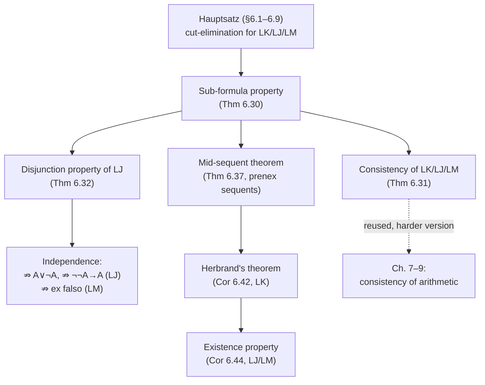

# Consequences of Cut-Elimination

[[book-guidelines|↩ Back to guidelines]]

## Why the Hauptsatz alone isn't the point

By the end of §6.9 the book has done the hard technical work: any LK/LJ/LM proof with a `cut` can be rewritten into a cut-free proof of the same end-sequent, via the auxiliary `mix` rule and a [[Induction-as-a-Proof-Method#Double induction|double induction]] on degree and rank. That theorem — the *Hauptsatz* — is impressive machinery, but machinery is not why Gentzen built it. Section 6.10 opens by saying this almost apologetically: "one often emphasizes the general philosophical significance of the theorem, but one cannot have access to it without taking into account some of the most important corollaries that flow from it." This article is entirely about those corollaries — pp. 253–268, the last two sections of Chapter 6.

The throughline is one single structural fact, proved once and then spent five different ways: **a cut-free proof only ever contains sub-formulas of what it ends in.** Everything else in this article — consistency of three logics, two hallmark constructive properties of intuitionistic logic, and a normal form theorem for classical proofs with its own famous corollary (Herbrand's theorem) — is that one fact, applied to a sequent shaped to make the conclusion pop out almost for free. If you've internalized the analogous story from [[Natural-Deduction|natural deduction]] (Chapter 4's normalization ⟹ sub-formula property ⟹ consistency), this chapter is the sequent-calculus rerun, but pushed further: [[The-Sequent-Calculus|the sequent calculus]]'s exposed structure (an antecedent/succedent *pair*, rather than an undifferentiated tree of assumptions) lets you extract *two more* theorems that natural deduction's format doesn't hand you as cleanly — the mid-sequent theorem and Herbrand's theorem.

**What breaks without cut-elimination:** none of this is available for an arbitrary LK-proof. A proof that uses `cut` can smuggle in an intermediate formula of essentially unbounded complexity — the sub-formula property fails immediately, since the formula introduced and later discarded by a cut need not be a sub-formula of anything in the end-sequent. Every theorem below is a theorem about cut-*free* proofs; the Hauptsatz is the bridge that lets you assert it about *all* proofs.

## The sub-formula property, restated for sequents

The book re-gives the definition of sub-formula (Definition 6.29, repeating Definition 4.13 from the natural-deduction chapter) with one adjustment: since sequents don't have the natural-deduction absurdity constant $\bot$ built in the same way, they drop the earlier convention that $\bot$ counts as a sub-formula of $\neg A$. Otherwise it's the expected recursive definition — atomic formulas are their own only sub-formula; $\neg B$'s sub-formulas are itself plus $B$'s; a binary connective's sub-formulas are itself plus both sides' recursively; and for a quantified formula $\exists x\, B(x)$ or $\forall x\, B(x)$, the sub-formulas are itself plus the sub-formulas of *every* instance $B[t/a]$ for *any* term $t$ — not just the one eigenvariable instance that happens to appear in a given proof.

> **Theorem 6.30 (Sub-formula property).** Let $\Theta \Rightarrow \Lambda$ be a sequent occurring in a cut-free proof $\pi$ of $\Gamma \Rightarrow \Delta$. Then any formula in $\Theta \cup \Lambda$ is a sub-formula of some formula in $\Gamma \cup \Delta$.

The proof is a clean induction on proof size, and the *reason* it works is worth naming explicitly because it's the load-bearing fact for everything downstream: **every LK/LJ/LM rule except `cut` is sub-formula-preserving upward** — a formula appearing in a premise of an axiom, structural rule, or operational rule either survives unchanged into the conclusion, or survives as a sub-formula of something the rule's operational step introduces. `cut` is the one rule that lets a formula (the cut formula) appear in a premise and then vanish entirely from the conclusion, with no trace connecting it back to the end-sequent. Remove `cut`, and induction on proof size does the rest: trace any formula in any sequent of the proof back through the (now sub-formula-preserving) rules all the way to the end-sequent.

**Grounding (Rust).** If you're building a proof checker, this theorem is exactly the invariant that makes a *bottom-up, goal-directed* proof search decidable in the propositional fragment: since every formula that can appear anywhere in a cut-free proof of a goal sequent is drawn from a finite, staticaly computable set (the sub-formula closure of the goal), you can enumerate the whole search space in advance.

```rust
/// The sub-formula closure of a formula: itself plus every sub-formula,
/// recursively — for a quantified formula, closed under *all* term instances
/// occurring in some fixed universe (e.g. the terms already in the goal).
fn subformula_closure(f: &Formula, terms: &[Term]) -> HashSet<Formula> {
    let mut acc = HashSet::new();
    fn go(f: &Formula, terms: &[Term], acc: &mut HashSet<Formula>) {
        if !acc.insert(f.clone()) { return; } // already visited
        match f {
            Formula::Atomic(_) => {}
            Formula::Not(b) => go(b, terms, acc),
            Formula::And(b, c) | Formula::Or(b, c) | Formula::Imp(b, c) => {
                go(b, terms, acc);
                go(c, terms, acc);
            }
            Formula::Forall(x, body) | Formula::Exists(x, body) => {
                for t in terms {
                    go(&body.subst(*x, t), terms, acc);
                }
            }
        }
    }
    go(f, terms, &mut acc);
    acc
}
```

This is precisely why a resolution-style or tableau-style automated prover can commit, up front, to a *finite Herbrand universe* strategy (more on this below) instead of guessing arbitrary lemma formulas the way a `cut`-permitting proof could: cut-freeness is what makes proof search a search over a *known, finite* space rather than an open-ended one.

## Consistency of LK, LJ, and LM, in one paragraph

The book first pins down what "consistent" cashes out to concretely in each of its formalisms, because the phrase means something slightly different depending on which system you're in:

- In the axiomatic systems $J_0, K_0$: if you can prove $A \land \neg A$ you can prove *anything*, since $(A \land \neg A) \supset B$ is a theorem for arbitrary $B$.
- In natural deduction NJ, NK: if you can prove $\bot$ you can prove anything, via $\bot_J$.
- In the sequent calculi LJ, LK: if you can *derive the empty sequent* $\Rightarrow$, you can derive anything, by weakening it on either side (`wr`, `wl`) into whatever sequent you like.

So "the empty sequent is unprovable" is the sequent-calculus system's single litmus-test statement for non-triviality — the sequent-calculus analogue of "$\bot$ is unprovable" in ND or "$A \land \neg A$" in axiomatic systems.

> **Theorem 6.31 (Consistency).** LK, LJ, and LM are consistent, i.e. they do not prove the empty sequent.

The proof is a two-line argument once the Hauptsatz and sub-formula property are in hand: *if* $\Rightarrow$ were provable, by the Hauptsatz it would have a cut-free proof; but a direct induction on the size of a cut-free proof shows the empty sequent has none — the base case fails because an axiom is always of shape $A \Rightarrow A$ (never empty), and the inductive step fails because no structural rule (`w`, `i`, `c`) or operational rule can ever *produce* an empty sequent from non-empty premises (operational rules always introduce a complex formula on one side; structural rules never delete every formula). Note this argument never touches `cut` at all — it's a statement purely about the shape of cut-free derivability, which is exactly why cut-elimination is the thing doing all the work: it's what licenses moving from "provable" to "cut-free provable" in the first sentence.

This is the direct sequent-calculus counterpart of Chapter 4's consistency corollary for NM/NJ/NK via the natural-deduction sub-formula property — same idea, same one-line pivot ("if it were derivable it'd have a normal/cut-free derivation, and normal/cut-free derivations of the trivializing statement don't exist by inspection"), applied to a different proof format.

## The disjunction property: a constructive fingerprint of intuitionistic logic

This is where the intuitionistic systems separate from LK in a way that has real payoff, not just aesthetic interest.

> **Theorem 6.32 (Disjunction property of LJ).** If $\Rightarrow A \lor B$ is derivable in LJ, then either $\Rightarrow A$ or $\Rightarrow B$ is derivable in LJ.

The proof leans entirely on the *shape constraint* cut-freeness imposes on the very last rule applied. By the Hauptsatz, take a cut-free LJ-proof of $\Rightarrow A \lor B$. Its last inference has to have $\Rightarrow A \lor B$ as its conclusion, and — because LJ's succedent holds at most one formula — the only candidate rules are `wr` (introducing $A \lor B$ by weakening) or `∨r` (introducing it operationally). `wr` is ruled out immediately: its premise would have to be $\Rightarrow$, the empty sequent, which Theorem 6.31 just proved unprovable. That leaves `∨r`, whose premise is *already* $\Rightarrow A$ or $\Rightarrow B$ — the disjunct falls straight out of the last rule application, no search required.

This is a genuinely constructive statement, and it's the sequent-calculus version of a fact you already know from the type-theoretic side even if the book never says so: **the disjunction property is exactly what you'd expect from a system where $\lor$ behaves like a tagged sum type.** A term of type $A + B$ *is*, definitionally, either a tagged $A$ or a tagged $B$ — there's no third way to inhabit a sum other than to pick a side and provide a witness. Classical logic's $A \lor \neg A$ (excluded middle) has no such witness-producing proof in general, which is exactly why LK does *not* have the disjunction property (LK's succedent can hold multiple formulas, so `wr` is not the dead end it is in LJ, and a classical proof of $\Rightarrow A \lor \neg A$ can legitimately end without either disjunct being separately provable).

**Grounding (Lean).** This is the proof-theoretic mirror of why `Or.inl`/`Or.inr` are the *only* two constructors of `Or` in Lean's kernel, and why `Classical.em` is an axiom bolted on rather than something derivable from the inductive definition of `Or` itself:

```lean
-- Or is a genuine sum type: exactly two constructors, no third way in.
inductive Or (a b : Prop) : Prop where
  | inl : a → Or a b
  | inr : b → Or a b

-- A closed proof of `Or A B` (no free hypotheses) MUST bottom out in
-- one of these two constructors — that's the disjunction property, read
-- off the inductive type's constructors instead of off ∨r vs wr.
```

Two independence corollaries fall out immediately by combining the disjunction property with consistency:

> **Proposition 6.33.** LJ does not prove $\Rightarrow A \lor \neg A$ for all formulas $A$.

If it did, the disjunction property would force LJ to prove either $\Rightarrow A$ or $\Rightarrow \neg A$ for *every* $A$ — but since $A$ ranges over all formulas, this would let you derive $\Rightarrow B \land \neg B$ (by substituting a provably-false instance) and then, by a cut against the LJ-provable $B \land \neg B \Rightarrow$, derive the empty sequent — contradicting Theorem 6.31.

> **Corollary 6.34.** LJ does not prove $\Rightarrow \neg\neg A \supset A$ for all formulas $A$.

Because $\neg\neg A \supset A \Rightarrow A \lor \neg A$ is easily provable in LJ, a proof of $\Rightarrow \neg\neg A \supset A$ would cut against it to give $\Rightarrow A \lor \neg A$ — again contradicting Proposition 6.33.

> **Corollary 6.35.** LM does not prove $\Rightarrow (A \land \neg A) \supset B$ for all $A, B$ (i.e. minimal logic really does lack *ex falso quodlibet*).

This one is proved by direct inspection of what a cut-free proof of $A, \neg A \Rightarrow B$ (its LM-equivalent form) could look like: with `wr` unavailable in LM and `¬l` unavailable (it would need $B$ already in the succedent of its premise, which nothing produces), only `cl`, `il`, `wl` remain — and none of these can manufacture an axiom out of $A, \neg A \Rightarrow B$ when $A \ne B$ are atomic.

The book notes these three results were *already* available via NJ's normalization theorem in Chapter 4 (Corollaries 4.46–4.47) — this is not new information, but a second, independent proof route through the sequent calculus, which is itself a small piece of evidence for why Chapter 9 later bothers proving LJ and NJ equivalent: the same theorems keep falling out of both formalisms because they're really facts about intuitionistic provability, dressed in two different notations.

## The mid-sequent theorem: pulling all the quantifiers to one seam

Section 6.11 shifts from propositional corollaries to a genuinely new structural theorem about the *shape* of cut-free proofs of prenex sequents.

> **Definition 6.36 (Prenex normal form).** A formula is in prenex normal form if it has the shape $Q_1 x_1 \ldots Q_n x_n\, A(x_1, \ldots, x_n)$, where each $Q_i$ is $\forall$ or $\exists$ and $A$ is quantifier-free.

> **Theorem 6.37 (Mid-sequent theorem).** If $\Delta \Rightarrow \Lambda$ contains only prenex formulas and has an LK-proof, then it has a cut-free proof $\pi'$ containing a **mid-sequent** — a sequent with no quantifiers at all — such that everything *above* the mid-sequent uses only [[The-Sequent-Calculus#Axioms|axioms]], propositional rules, and structural rules, and everything *below* it uses only quantifier rules and structural rules.

In other words: every cut-free proof of a prenex sequent can be reshaped so all the propositional reasoning happens first, in one contiguous block, and *all* the quantifier instantiation happens afterward, in a single non-branching chain straight down to the end-sequent. This is a strong claim about proof search architecture — it says you never *need* to interleave "pick a witness term" with "do propositional case analysis"; you can always front-load every instantiation decision and finish with pure propositional logic.

**Why cut-freeness is essential here, twice over.** First, the sub-formula property is what guarantees every formula anywhere in the proof stays prenex (or quantifier-free) once the end-sequent is prenex — a `cut` could smuggle in a non-prenex intermediate formula with no such guarantee. Second, the proof of the theorem itself is a permutation argument: it repeatedly finds a quantifier inference immediately followed by a propositional inference and *swaps their order*, pushing quantifier rules downward one step at a time. This swap is driven by a termination measure, the **order** of a proof:

> **Definition 6.38 (Order).** The order $o(I)$ of a quantifier inference $I$ is the number of propositional inferences occurring below $I$ in the proof. The order $o(\pi)$ of the whole proof is the sum of $o(I)$ over all its quantifier inferences.

Each swap strictly decreases the order of the swapped inference (it moves one step further from the propositional inferences it used to sit above), giving a clean induction: $o(\pi) = 0$ is exactly the base case where a single unambiguous mid-sequent already exists (the topmost sequent with no quantifier rules above and no propositional rules below); $o(\pi) = n+1$ reduces to $o(\pi) = n$ by performing one swap.

**Grounding (Rust) — this is a compiler pass.** If you squint, the mid-sequent theorem is a *normal-form-scheduling* result of exactly the kind a compiler pass reorders instructions to achieve: "hoist all instantiation-like operations to one contiguous region, keep the pure propositional/boolean reasoning in another." The swap step is a local peephole rewrite driven by a strictly decreasing cost metric — precisely the shape of a terminating optimization pass:

```rust
/// One step of the mid-sequent-theorem transformation: find an adjacent
/// (quantifier-inference, propositional-inference) pair with the
/// quantifier inference *above*, and swap their relative order.
/// Strictly decreases `order(proof)` — the number of propositional
/// inferences below any given quantifier inference, summed over all of them.
fn push_quantifier_down(proof: &mut ProofTree) -> bool {
    if let Some((quant_step, prop_step)) = find_swappable_pair(proof) {
        swap_adjacent_inferences(proof, quant_step, prop_step);
        true // made progress; order(proof) strictly decreased
    } else {
        false // already order 0 on every remaining quantifier inference
    }
}

fn normalize_to_mid_sequent(mut proof: ProofTree) -> ProofTree {
    while push_quantifier_down(&mut proof) {}
    proof // mid-sequent now sits at the propositional/quantificational seam
}
```

The one subtlety the book is careful about — worth flagging because it is exactly the kind of bookkeeping detail that breaks a naive implementation — is that swapping requires the proof to be **regular** first (Proposition 5.23: every eigenvariable distinct, occurring only above its own quantifier rule). Without that normalization, pushing a $\forall$r rule downward past a propositional rule risks the eigenvariable condition being violated at the new site, because context formulas ($\Delta$, $\Pi$ in the book's notation) introduced elsewhere by weakening might already contain the eigenvariable. This is precisely the *capture-avoidance* concern that shows up whenever you reorder or hoist a binder past other structure — the same discipline your elaborator needs whenever it reorders metavariable instantiation relative to other constraint-solving steps.

## Herbrand's theorem: finitizing an existential claim

The mid-sequent theorem is a means to an end; the end is a theorem that hands you something genuinely computational.

> **Corollary 6.42 (Herbrand's theorem).** Let $B(a_1, \ldots, a_n)$ be quantifier-free, and suppose $\Rightarrow \exists x_1 \ldots \exists x_n\, B(x_1, \ldots, x_n)$ is provable in LK. Then there exist $m$ sequences of terms $t^j_1, \ldots, t^j_n$ ($j = 1, \ldots, m$), drawn from the terms already occurring in the proof, such that
> $$\Rightarrow B(t^1_1, \ldots, t^1_n),\, B(t^2_1, \ldots, t^2_n),\, \ldots,\, B(t^m_1, \ldots, t^m_n)$$
> is provable in LK.

The proof is short precisely because the mid-sequent theorem did the heavy lifting: apply it to get a mid-sequent with empty antecedent (forced, since the end-sequent's antecedent is empty and only `∃r`, `ir`, `wr`, `cr` occur below the mid-sequent) whose succedent consists of finitely many *ground instances* $B(t_1, \ldots, t_n)$ of the matrix — quantifier-free formulas obtained by substituting concrete terms for the bound variables. The mid-sequent's succedent, read off directly, *is* the disjunction of instances the theorem asserts; the quantifier-instantiation work is already done and sitting at that one seam.

**This is the theorem that makes automated theorem proving over first-order logic possible at all**, and it's worth being explicit about why, since the book states it purely proof-theoretically and leaves the algorithmic reading implicit:

- An existential statement $\exists x\, B(x)$ over an *infinite* domain of terms is, on its face, not something you can check by brute enumeration — there's no bound on how far you'd have to search for a witness.
- Herbrand's theorem says: if the statement is provable *at all*, a witness (or finite disjunction of witnesses) exists using only *finitely many, specific terms already present in some proof* — the **Herbrand universe** built from the proof's own vocabulary.
- This is exactly what licenses a resolution-based or SMT-style prover to search a term universe incrementally (try ground instances built from function symbols and constants seen so far, widen the universe if no proof is found) instead of reasoning about the infinite quantified statement directly — **Herbrand's theorem is the theoretical justification for instantiation-based first-order proof search**, i.e. for treating "prove $\forall\vec{x}\, C(\vec{x})$" as "find a finite unsatisfiable/provable set of ground instances of $C$," which is the architecture underlying both classical resolution provers and the ground/ instantiation layer beneath most SMT solvers' quantifier handling (E-matching, trigger-based instantiation) before they hand a quantifier-free formula to the core SAT/theory solver.

**Grounding (Rust) — the search loop this licenses:**

```rust
/// Herbrand-style search for a proof of `exists x1..xn. B(x1..xn)`:
/// enumerate finite sets of ground instances drawn from an expanding
/// term universe, and check whether their disjunction is provable
/// (in the quantifier-free/propositional fragment, e.g. via SAT).
fn herbrand_search(matrix: &Formula, initial_terms: &[Term]) -> Option<Vec<Term>> {
    let mut universe: Vec<Term> = initial_terms.to_vec();
    loop {
        // Try every growing finite subset of ground instantiations.
        for k in 1..=universe.len() {
            for combo in combinations(&universe, k) {
                let disjunction = combo.iter()
                    .map(|t| matrix.instantiate(t))
                    .fold(Formula::False, Formula::or);
                if is_propositionally_valid(&disjunction) {
                    return Some(combo); // Herbrand disjunction found
                }
            }
        }
        universe = expand_universe(&universe); // add function applications, etc.
    }
}
```

(This is a schematic sketch, not the book's own algorithm — the book proves *existence* of a Herbrand disjunction constructively from a given proof, rather than describing a search procedure for finding one from scratch. But the search loop above is exactly what Herbrand's theorem *justifies as terminating-in-principle* whenever the original existential claim is actually a theorem.)

The book closes the section with a worked instance (Example 6.43): for $\Rightarrow \exists x_1 \exists x_2\, B(x_1, x_2)$ with three proof-terms $t_1, t_2, t_3$ available, there are nine candidate ground closures $B(t_i, t_j)$, and the mid-sequent picks out some subset of them whose disjunction is provable — concretely illustrating that "some finite subset of the full grid of instances suffices" rather than needing the full Cartesian product.

## The existence property: Herbrand's theorem specialized to LJ/LM

> **Corollary 6.44 (Existence property).** If $\Rightarrow \exists x_1 \ldots \exists x_n\, B(x_1, \ldots, x_n)$ (with $B$ quantifier-free) is derivable in LM or LJ, then there exist specific terms $t_1, \ldots, t_n$ — *effectively computable from the proof* — such that $\Rightarrow B(t_1, \ldots, t_n)$ is derivable in LM or LJ respectively.

This sharpens Herbrand's theorem in exactly the way you'd expect the intuitionistic restriction to sharpen a classical result: LM/LJ succedents hold at most one formula, so the general Herbrand disjunction (which for LK could genuinely need several disjuncts) is forced to collapse to a *single* instance — the mid-sequent theorem holding for LJ/LM (mentioned as Theorem 6.40, following as an immediate corollary of the Hauptsatz for those systems) means the mid-sequent itself can only ever contain one occurrence of the matrix formula.

This is the *computational content* of intuitionistic existence claims made completely explicit, and it is the direct proof-theoretic ancestor of something you already know under a different name: **the existence property is exactly what the Curry–Howard correspondence gives you for free when a $\Sigma$-type's proof term is forced to actually carry a witness.** A closed term of type $\Sigma x{:}A.\, B(x)$ *is*, by the type's own constructor, a pair `⟨t, proof_of_B(t)⟩` — you cannot inhabit a $\Sigma$-type without producing the witness component, structurally, the same way you cannot cut-freely derive $\Rightarrow \exists x\, B(x)$ in LJ without the mid-sequent handing you a concrete $t$. Classical logic's proof of $\exists x\, B(x)$ by, e.g., a double-negation argument has no such obligation — which is exactly why LK doesn't have the existence property in this single-witness form (only the weaker, possibly-disjunctive Herbrand form).

**Grounding (Lean).** This is precisely why extracting a program from a Lean/constructive proof of an existential works at all:

```lean
-- A proof of `∃ x, B x` in a constructive setting is, by Exists's own
-- single constructor, forced to bundle a witness with a proof about it —
-- this IS the existence property, read off the type former.
theorem constructive_existence : ∃ n : Nat, n * n = 4 :=
  ⟨2, by decide⟩   -- the witness `2` must be produced, not merely postulated

-- `Classical.choice`/`Classical.em`-based proofs of existentials, by
-- contrast, need not compute a witness this way — the same asymmetry
-- as LK's Herbrand disjunction (possibly several disjuncts, no single
-- canonical witness) versus LJ's existence property (exactly one).
```

## Where this leads



Two threads pick up directly from here. First, the **consistency** argument is explicitly flagged by the book as *not* the one Gentzen actually wanted — proving arithmetic consistent needs a "more involved proof transformation," which is exactly Chapters 7–9's project: the induction rule `cj` blocks a direct application of this chapter's cut-elimination strategy, forcing Gentzen to a different reduction procedure whose termination needs ordinal notations up to $\varepsilon_0$ (Chapters 8–9). The opening paragraph of Chapter 7 makes the connection to this article explicit, restating the sub-formula-property argument for consistency almost verbatim before explaining why it doesn't scale to PA.

Second, for the standing compiler/elaborator project: this chapter is where "cut-freeness gives you a finite, statically-known search space" stops being a slogan and becomes two theorems you can actually cite by name in a design doc. **The sub-formula property** is the reason a tableau/sequent-based decision procedure for propositional logic terminates at all. **The mid-sequent theorem and Herbrand's theorem together** are the direct theoretical justification for *any* instantiation-based approach to first-order proof search or SMT quantifier handling your CSP/CHC kernel will eventually need — "search over ground instances built from the term universe, don't reason about the quantifier directly" is not a heuristic, it's licensed by a proof-theoretic theorem with a completely explicit witness-extraction procedure. And **the existence property**, read through Curry–Howard, is the same fact your elaborator already assumes every time it treats a $\Sigma$-type proof obligation as "go find me a concrete witness term" rather than "prove non-emptiness abstractly" — LJ's cut-free mid-sequent and a $\Sigma$-type's pair constructor are, structurally, the same commitment to constructive witness-production.
