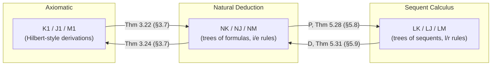

# Equivalence of the Proof Systems

[[book-guidelines|↩ Back to guidelines]]

## Why three systems, and why bother proving they agree

By the time you reach this point in the book, you have three ways of writing down "$A$ is provable": an **axiomatic (Hilbert-style) derivation** in $K_1$/$J_1$/$M_1$ (a flat list of formulas, each an axiom instance or the result of modus ponens), a **[[Natural-Deduction|natural deduction]]** in $NK$/$NJ$/$NM$ (a tree of formulas built from assumptions, with rules that introduce and eliminate each connective), and — starting in Chapter 5 — a **sequent calculus** proof in $LK$/$LJ$/$LM$ (a tree of *sequents* $\Gamma \Rightarrow \Delta$, built from operational left/right rules plus structural rules and cut). These are not three notational skins on one idea handed down from on high; they were invented for different reasons, at different times, with different design goals — axiomatic systems for economy of primitives, natural deduction to mirror how mathematicians actually reason ("assume $A$... therefore $B$... discharge the assumption"), and [[The-Sequent-Calculus|the sequent calculus]] as a technical device Gentzen needed to *prove things about* natural deduction (specifically, to get cut-elimination, which does not go through cleanly for $NK$/$NJ$ directly).

Once you have three systems, you owe the reader a proof that they're not secretly different logics. That's what this topic is: a set of **translations**, each direction proved by structural induction, that turn a proof in one system into a proof of the *same formula* in another. No new mathematics is invented here — no new theorem about logic — but the translations themselves are exactly the kind of artifact you'll be writing constantly if you build a compiler or an elaborator: a certified, meaning-preserving map from one representation of a program (or proof) to another.

**What breaks without this:** without an equivalence proof, "$NJ$" and "$J_1$" would just be two separate, unrelated formal games, and every theorem proved about one (e.g., normalization for $NJ$, or the deduction theorem for $J_1$) would tell you nothing about the other. The entire payoff of Chapter 4 (normalization) and Chapter 6 (cut-elimination) — that they yield consistency, the disjunction property, etc. for the *same* underlying logic — depends on already knowing $NJ \equiv J_1 \equiv LJ$ prove exactly the same formulas.

Gentzen's own reason for doing this the hard, syntactic way is a nice bit of history worth keeping in mind: in 1935 there was no semantics for intuitionistic logic to prove soundness/completeness against, and Gödel's completeness theorem for classical logic was three years old. So instead of the "modern" route (show $NJ$ is sound and complete for some model theory), Gentzen proved the systems equivalent to each other *directly*, formula-by-formula, rule-by-rule — the "remaining, and easier, option" as the authors put it. This is worth internalizing as an engineering lesson too: when you don't yet trust a semantic denotation for your system (or don't have one), a direct syntactic translation into an already-trusted system is often the only honest way to establish correctness. This is precisely the situation a trusted proof-checking kernel is in.



The book proves the left leg (axiomatic $\leftrightarrow$ natural deduction) in §3.7, and the right leg (natural deduction $\leftrightarrow$ sequent calculus) in §§5.8–5.9. It does not draw the third leg (axiomatic $\leftrightarrow$ sequent calculus) directly — that one you get for free by composing the other two, which is itself a small but real insight: once you have two independently-verified translations sharing a common intermediate representation, you get a third translation as their composition, with no additional proof obligation beyond correctness of composition. This is exactly why compilers factor through an intermediate representation instead of writing $n^2$ pairwise translators between $n$ front-ends and back-ends.

---

## Part I — Axiomatic derivations $\leftrightarrow$ Natural deduction ($K_1 \leftrightarrow NK$)

### The forward direction: every axiomatic derivation becomes an $NK$-proof

**Theorem 3.22.** *If $A$ has a derivation in $K_1$, then there is an $NK$-proof of $A$.*

The proof is by induction on the number of inferences in the $K_1$-derivation — the standard "successor induction on derivation length" tool from Chapter 2, reused here because a $K_1$-derivation is a flat sequence and length is the natural measure.

- **Basis (0 inferences):** the derivation is a single axiom instance. So you need: an $NK$-proof of every instance of every axiom schema in $K_0$, plus $QL1$ ($\forall x\,A(x) \supset A(t)$) and $QL2$ ($A(t) \supset \exists x\,A(x)$). The book had already produced several of these as worked examples earlier in Chapter 3 (e.g. $PL2$, $PL5$, $PL9$), and gives $PL10$ explicitly here:

$$
\dfrac{\dfrac{(A\supset B)\wedge(A\supset\neg B)^{\,2} \quad A^{\,1}}{\dfrac{A\supset\neg B}{\neg B}} \qquad \dfrac{(A\supset B)\wedge(A\supset\neg B)^{\,2}\quad A^{\,1}}{\dfrac{A\supset B}{B}}}{\dfrac{\bot}{\ ^{1}\dfrac{\neg A}{^2 ((A\supset B)\wedge(A\supset\neg B))\supset\neg A}}}
$$

(read: from the shared assumption $(A\supset B)\wedge(A\supset\neg B)$, extract both $A \supset \neg B$ and $A \supset B$ via $\wedge$e, apply each to the assumption $A$ via $\supset$e to get $\neg B$ and $B$, close with $\neg$e to get $\bot$, then discharge $A$ with $\neg$i and the conjunction with $\supset$i). A sharp observation buried in a footnote here: only $PL12$ ($\neg\neg A \supset A$) needs $\bot_K$, and only $PL11$ ($\neg A \supset (A\supset B)$) needs $\bot_J$ — so this single induction, done once for $NK$, silently also establishes that $M_1$-provable formulas have $NM$-proofs and $J_1$-provable formulas have $NJ$-proofs, just by restricting attention to the sub-cases that don't touch $PL11$/$PL12$.

- **Inductive step ($n>0$ inferences):** split on the last rule. Modus ponens is immediate — if the premises $B \supset A$ and $B$ each already have $NK$-proofs $\delta_2, \delta_1$ (by the IH, since their sub-derivations are shorter), just apply $\supset$e:

$$\dfrac{\delta_2 \;\; \delta_1}{\dfrac{B\supset A \quad B}{A}}\;{\supset}\text{e}$$

  The $qr_1$ case is more interesting because it's exactly the same "conditional-then-eigenvariable" move you saw for the deduction theorem in Chapter 2: from a proof $\delta$ of $B \supset C(a)$ (with $a$ not occurring in $B$, by the side condition on $qr_1$), build

$$
\dfrac{\dfrac{\delta}{\dfrac{B\supset C(a)\quad B^{\,1}}{C(a)}}}{\dfrac{\forall x\,C(x)}{{}^{1}\;B\supset\forall x\,C(x)}}
$$

  i.e., apply $\supset$e to strip the conditional (discharging $B$ as assumption 1), generalize with $\forall$i (legal exactly because $a\notin B$ — the eigenvariable condition on $\forall$i is *the same side condition* the axiomatic $qr_1$ rule already required), then re-introduce the conditional with $\supset$i. Note how the single side-condition from the axiomatic world (don't quantify into the antecedent) reappears, unchanged, as the eigenvariable condition in the natural-deduction world — it isn't a coincidence, it's the same soundness fact wearing two different formal costumes.

### The harder direction: every $NK$-deduction becomes a $K_1$-derivation

**Theorem 3.24.** *If $A$ has a deduction in $NK$, then there is a derivation of $A$ in $K_1$.*

The book flags this one explicitly as *not proved directly by Gentzen* and harder, for a structural reason: axiomatic derivations have no notion of "assumption" at all (every line is either an axiom or follows by mp from earlier lines), whereas a natural-deduction proof of $A$ typically has *open assumptions* $B_1,\dots,B_k$ still hanging off it. So the translation has to produce, by induction on the deduction's **size** (number of inferences — the tree-shaped analogue of length), a $K_1$-derivation not of $A$ but of

$$(B_1 \wedge (B_2 \wedge \cdots (B_{k-1}\wedge B_k)\cdots)) \supset A.$$

Every open assumption becomes a conjunct in an explicit antecedent. Discharging an assumption in $NK$ then corresponds to *removing a conjunct from that antecedent* on the $K_1$ side — which is exactly what $\supset$i does. Walking two representative cases makes the mechanism concrete:

- **$\wedge$e** doesn't discharge anything, so the open assumptions of the conclusion are the same as the premise's. If $\delta_1$ (size $n-1$) gives a $K_1$-proof of $G \supset (A\wedge B)$, compose it with the fixed lemma $(A\wedge B)\supset A$ (already available from Problem 2.7) via the derived rule $\supset$trans, to get $G \supset A$ directly — no new assumption bookkeeping needed because nothing was discharged.
- **$\supset$i** *does* discharge. If $\delta_1$ (proving $C$ from $\Gamma,B$) gives $G_1 \supset C$ where $G_1$ conjoins everything in $\Gamma \cup \{B\}$, and $G_2 := G \wedge B$ is a different-looking-but-provably-equivalent conjunction of the same set, then $\vdash G_2 \supset G_1$, so by $\supset$trans, $\vdash (G\wedge B) \supset C$, and by an already-proved schema this rearranges (via mp) into $\vdash G \supset (B \supset C)$ — i.e., $\vdash G \supset A$. The discharged assumption $B$ has migrated from being a conjunct on the left of $\supset$ to being the antecedent of a nested conditional on the right. That migration *is* the deduction theorem, run in the translation itself.

**A programming-language way to see both directions at once.** If you've ever implemented [bracket abstraction](https://en.wikipedia.org/wiki/Combinatory_logic) — the classical algorithm for compiling closed $\lambda$-terms into combinators ($S$, $K$, $I$) — this pair of theorems is structurally the same problem. An axiomatic $K_1$-derivation, with its single rule (mp = application) and fixed schemas ([[The-Sequent-Calculus#Axioms|axioms]] = combinators), is combinator calculus. An $NK$-deduction, with named/discharged assumptions and $\supset$i literally binding a variable, is the $\lambda$-calculus. Theorem 3.22 (axiomatic $\to$ natural deduction) is the trivial direction — every combinator term already denotes a $\lambda$-term, you just unfold the definitions ($S$, $K$, $I$ already have known $\lambda$-encodings). Theorem 3.24 (natural deduction $\to$ axiomatic) is bracket abstraction itself: to eliminate a bound variable $B$ from a term/proof, you don't substitute — you find a *combinator-free-of-that-variable* expression that behaves the same when applied, exactly how $\supset$trans + the fixed lemma schemas here manufacture a $B$-free antecedent replacement. If you build the elaborator described in your project's learning goals, you will re-derive this exact algorithm when you lower checked, named-binder proof terms into a point-free/combinator-style trusted core — the mechanism is identical down to the induction-on-structure shape.

```rust
// A deliberately tiny sketch of the "erase the discharge, keep the meaning"
// idea behind Theorem 3.24 — not from the book, but the same shape as its
// case analysis on the last rule.
enum NkProof {
    Assumption(FormulaId),
    AndElim(Box<NkProof>, Side),          // no discharge
    ImpIntro(FormulaId, Box<NkProof>),    // discharges `FormulaId`
    ImpElim(Box<NkProof>, Box<NkProof>),  // B⊃A , B  ⊢ A
}

// Returns a K1-style closed proof term of `conjoin(open_assumptions) ⊃ conclusion`.
fn to_axiomatic(p: &NkProof) -> K1Term {
    match p {
        NkProof::Assumption(a) => k1_reflexivity(*a),       // ⊢ A ⊃ A
        NkProof::AndElim(sub, side) => {
            let g_and_ab = to_axiomatic(sub);                // ⊢ G ⊃ (A ∧ B)
            k1_imp_trans(g_and_ab, k1_and_elim_axiom(*side)) // ⊢ G ⊃ A   (chain through fixed lemma)
        }
        NkProof::ImpIntro(discharged, sub) => {
            let g1_imp_c = to_axiomatic(sub);   // ⊢ (Γ ∧ B) ⊃ C   (B = `discharged`)
            k1_curry(g1_imp_c, *discharged)     // ⊢ Γ ⊃ (B ⊃ C)   — the discharge "migrates right"
        }
        NkProof::ImpElim(major, minor) => {
            let g1_imp_ba = to_axiomatic(major); // ⊢ G1 ⊃ (B ⊃ A)
            let g2_imp_b  = to_axiomatic(minor); // ⊢ G2 ⊃ B
            k1_combine_and_apply(g1_imp_ba, g2_imp_b) // ⊢ (G1∧G2) ⊃ A
        }
    }
}
```

---

## Part II — Natural deduction $\leftrightarrow$ Sequent calculus ($NJ \leftrightarrow LJ$)

This is the translation the book cares most about developing carefully, because it's the one Chapter 6 (cut-elimination) implicitly relies on to transport consequences of the *Hauptsatz* (proved for $LJ$) back into statements about $NJ$.

### Setting the stage: what a sequent "means" as a deduction

An $NJ$-deduction proves a single formula $A$ from a *set* of open assumptions $\Gamma$. An $LJ$-proof proves a *sequent* $\Gamma \Rightarrow A$ (antecedent, succedent). The bridge is the obvious reading: "$\Gamma \Rightarrow A$" *just is* "$A$ is deducible from $\Gamma$." Formally, `As(δ)` denotes the (multi-)set of $\delta$'s undischarged assumptions, and the two theorems say:

- **Theorem 5.28.** If $A$ has an $NJ$-deduction $\delta$, then $\Gamma \Rightarrow A$ is $LJ$-provable, where $\Gamma = \mathrm{As}(\delta)$.
- **Theorem 5.31.** If $\Gamma \Rightarrow A$ has an $LJ$-proof $\pi$, then there is an $NJ$-deduction $D(\pi)$ of $A$ with $\mathrm{As}(D(\pi)) \subseteq \Gamma$.

Both are proved by structural induction on the *last rule* of the source proof — not on length or size, but by case-splitting on what the bottom-most inference is and recursing on its premises' sub-proofs. This is the same induction principle you use to write a recursive-descent compiler pass: handle each node-kind of the source AST once, recursively transform the children, then reassemble.

### $P$: $NJ \to LJ$ — introduction rules are easy, elimination rules need `cut`

The translation $P$ falls into two flavors, and the split is the single most important thing to take away from §5.8:

**Introduction rules translate directly into the matching right rule.** $\wedge$i becomes $\wedge$r, $\vee$i becomes $\vee$r, $\forall$i becomes $\forall$r, and so on — you translate the premise sub-deduction(s), then apply the structurally analogous sequent rule. For $\wedge$i:

$$
\dfrac{\gamma \quad \gamma'}{\dfrac{B \quad C}{B\wedge C}}\;{\wedge}\text{i}
\qquad\Longrightarrow\qquad
\dfrac{P(\gamma)\quad P(\gamma')}{\dfrac{\Gamma\Rightarrow B \quad \Gamma'\Rightarrow C}{\Gamma,\Gamma'\Rightarrow B\wedge C}}\;{\wedge}\text{r}
$$

The one wrinkle is $\supset$i, because it discharges assumptions: the resulting antecedent $\Gamma'$ in $\Gamma'\Rightarrow B\supset C$ must have $B$ removed via contraction/interchange if $B$ was actually discharged — bookkeeping, not a new idea.

**Elimination rules translate into a `cut` against a canonical identity proof.** This is the conceptually load-bearing case. Take $\wedge$e — from a proof $\gamma$ of $A \wedge B$, $NJ$'s $\wedge$e directly yields $A$. There is no "$\wedge$e" rule in $LJ$; instead:

$$
\dfrac{\gamma}{\dfrac{A\wedge B}{A}}\;{\wedge}\text{e}
\qquad\Longrightarrow\qquad
\dfrac{P(\gamma) \qquad \dfrac{A\Rightarrow A}{A\wedge B\Rightarrow A}\;{\wedge}\text{l}}{\dfrac{\Gamma\Rightarrow A\wedge B \quad A\wedge B\Rightarrow A}{\Gamma \Rightarrow A}}\;\mathrm{cut}
$$

Every elimination rule in $NJ$ ($\wedge$e, $\supset$e, $\forall$e, $\exists$e, $\vee$e) becomes, in $LJ$, a `cut` between (a) the translated proof of the major premise and (b) a small, fixed, rule-specific proof built from the identity axiom plus the matching *left* rule. **This is the single cleanest statement in the whole book of what the cut rule is actually *for*:** cut is the sequent-calculus's substitute for "use a previously-established fact as a premise of a further inference" — precisely natural deduction's elimination rules. You met this same point qualitatively in §5.4 ("[[The-Sequent-Calculus#The significance of cut|The significance of cut]]"); here it's made completely explicit and mechanical.

### $D$: $LJ \to NJ$ — right rules are easy, left rules need substitution (and regularity)

Symmetrically:

**Right rules translate directly into introduction rules** — $\wedge$r $\to$ $\wedge$i, $\forall$r $\to$ $\forall$i, etc.

**Left rules translate into elimination rules where the *major premise is a bare open assumption*, and the rest of the deduction gets substituted underneath it.** For $\wedge$l:

$$
\dfrac{\gamma}{\dfrac{B,\Gamma\Rightarrow[A]}{B\wedge C,\Gamma\Rightarrow[A]}}\;{\wedge}\text{l}
\qquad\Longrightarrow\qquad
\dfrac{\dfrac{B\wedge C}{B}\;{\wedge}\text{e}\quad D(\gamma)}{A^{*}}
$$

— every open occurrence of the assumption $B$ inside $D(\gamma)$ gets an $\wedge$e inference grafted on top of it, converting it into a use of the (new) assumption $B\wedge C$. The $\supset$l and cut cases go further: they literally **substitute one deduction for every occurrence of an assumption formula inside another**, written $D(\theta)[\delta/C]$ — replace every leaf labeled $C$ in $D(\theta)$ with the whole sub-deduction $\delta$ that proves $C$. This is *exactly* substitution of a term for a variable in the $\lambda$-calculus, and it inherits the same hazard: **variable capture**. An eigenvariable that's fine where it originally sat can become illegally bound once you graft a new sub-deduction underneath it.

This is precisely why §5.7's **variable-replacement lemma** and the notion of a **regular proof** (an $LJ$-proof where every eigenvariable belongs to exactly one $\forall$r/$\exists$l inference and occurs only above it — Definition 5.22, with Proposition 5.23 showing every proof can be made regular by systematic renaming) get invoked as a precondition on Theorem 5.31, right at the top of its proof: *"By Proposition 5.23, we may assume that $\pi$ is regular."* Without regularity, the substitution performed in the $\supset$l/cut cases could smuggle a variable into scope where it violates an eigenvariable condition — the sequent-calculus analogue of capture-avoiding substitution needing $\alpha$-renaming first. If you've implemented substitution in a type-checker, you've written exactly this precondition, probably as a "freshen the bound variables first" pass before substituting.

```rust
// The two translation halves, matched to the case-split above.
// `major_is_bare_assumption(d)` grafts an elimination rule onto every leaf of `d`
// that is exactly the discharged/left formula — this is the D-side counterpart
// of substitution, and (per Lemma 4.8 in the book) needs the source proof to be
// "regular" first, or eigenvariable conditions can be violated by the graft.
fn lj_to_nj(pi: &LjProof) -> NjDeduction {
    match pi {
        LjProof::AndR(l, r) => NjDeduction::AndIntro(
            Box::new(lj_to_nj(l)), Box::new(lj_to_nj(r))),      // right rule -> intro rule
        LjProof::AndL(b, c, sub) => {
            let d_sub = lj_to_nj(sub);                          // premise: B, Γ ⇒ [A]
            graft_and_elim(d_sub, *b, *c)                       // wrap every open `B` leaf in ∧e
        }
        LjProof::ImpL(gamma_proof, minor) => {
            let delta = wrap_imp_elim(lj_to_nj(gamma_proof));   // B⊃C, then B → C via ⊃e
            substitute(lj_to_nj(minor), /*for*/ formula_c(minor), delta) // D(θ)[δ/C]
        }
        LjProof::Cut(theta, lambda, cut_formula) => {
            let delta = lj_to_nj(theta);
            substitute(lj_to_nj(lambda), *cut_formula, delta)   // D(λ)[D(θ)/B]
        }
        // ... remaining right/left rules follow the same two patterns
    }
}
```

### Reading this pair through a bidirectional-typing lens

If you've spent time with bidirectional type systems (inference $\Rightarrow$ / checking $\Leftarrow$, à la Pierce–Turner or Dunfield–Krishnaswami), the right/left split in $LJ$ should feel *very* familiar, because it's the same split under different names:

- **Right rules decompose the goal.** To prove $\Gamma \Rightarrow B \wedge C$ you split into proving $\Gamma \Rightarrow B$ and $\Gamma \Rightarrow C$ — you are *checking against* a known target formula, exactly like a checking-mode ($\Leftarrow$) typing rule that decomposes the expected type.
- **Left rules decompose a hypothesis.** To use $B \wedge C, \Gamma \Rightarrow [A]$ you commit to using the compound hypothesis by breaking it into its parts — exactly like an inference-mode ($\Rightarrow$) rule that takes a hypothesis of known (compound) type and extracts information from its shape.

And now Theorems 5.28/5.31 say something sharp about the two proof-term calculi you get from this: the natural-deduction proof term for a checking-mode/introduction step is *direct* (an $NJ$ deduction and an $LJ$ right-rule-only proof correspond one-to-one, no cut needed), while every use of a hypothesis (every "elimination," every inference-mode step) *requires cut* to stitch the sub-proof producing the fact together with the sub-proof consuming it. This is precisely the phenomenon that later, focused/polarized sequent calculi (Andreoli's focusing, Zeilberger's spine calculi, and the sequent-calculus formulations that underlie some elaborators' internal proof representations) are built to make syntactically explicit and search-efficient. If your compiler's elaborator ends up representing intermediate proof obligations as sequents rather than raw terms — which is a very natural choice once you have contexts, goals, and bidirectional inference/checking modes — this is the theorem that tells you *your elimination-rule proof terms are secretly insertions of cut*, and that a cut-free (i.e., normal/focused) sequent proof corresponds to a *normal* natural-deduction term with no unnecessary detours. That is not a coincidence — it is the same correspondence Chapter 4 (normalization/detours) and Chapter 6 (cut-elimination) will independently establish from the *other* direction, on each system separately.

---

## Where this leads

- **Immediately:** the equivalence lets every consistency/independence result proved syntactically for one system (e.g. "$NJ$ doesn't prove $A \vee \neg A$," from Chapter 4's sub-formula property) be read as a fact about the *logic itself*, not an artifact of one particular formalization — because you now know $J_1$, $NJ$, and $LJ$ all prove exactly the same theorems.
- **Structurally:** the $P$/$D$ translations of §§5.8–5.9 are the concrete bridge Chapter 6 needs. The Hauptsatz (cut-elimination) is proved *for the sequent calculus*, and its headline consequence — the sub-formula property for cut-free $LJ$-proofs — only becomes a statement about *natural deduction's* detour-free deductions (Chapter 4's independent normalization result) once you can move proofs back and forth between the two systems via exactly the maps built here. The book is quietly setting up two independent routes to the same destination (consistency, disjunction property, etc.) — normalization on the $NJ$ side, cut-elimination on the $LJ$ side — and this topic is the proof that the destination really is the same one.
- **For your compiler/elaborator project:** this pair of case studies (bracket-abstraction-shaped translation between a binder calculus and a combinator calculus; cut-insertion/cut-elimination translation between a natural-deduction term calculus and a sequent/bidirectional calculus) is the load-bearing prerequisite for designing a **proof-producing architecture with a small trusted kernel**: you search for proofs in whichever representation makes search easy (often sequent-style, with explicit contexts and left/right rules mapping to inference/checking modes), then translate the result into whichever representation your trusted kernel checks cheaply (often natural-deduction/term style, closer to `isDefEq`-style definitional-equality checking). The correctness of that whole pipeline is *exactly* a theorem of this shape — a translation function, proved total and meaning-preserving by structural induction on the source proof's last rule.
