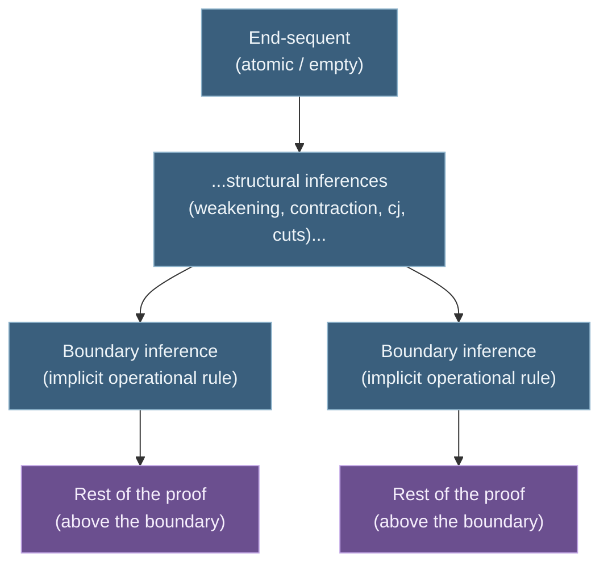

# Gentzen's Consistency Proof of Arithmetic

[[book-guidelines|↩ Back to guidelines]]

## Why cut-elimination alone doesn't settle arithmetic

The previous topic showed that LK, LJ, and LM are consistent: cut-elimination gives every provable sequent a cut-free proof, and a cut-free proof of the empty sequent is impossible because every rule except cut preserves the "at least one formula per sequent" invariant, and the empty sequent violates it trivially. That's a complete answer for *pure logic*. It says nothing about *arithmetic* — a theory with its own non-logical [[The-Sequent-Calculus#Axioms|axioms]] about $0$, successor, $+$, $\cdot$, and $=$, plus induction. Hilbert's program needed exactly this: a finitary consistency proof for a theory strong enough to do real mathematics, not just for the underlying logic.

The natural move is to try to bolt Peano arithmetic onto LK the same way you'd add axioms to any Hilbert system: throw in some initial sequents for the arithmetic axioms and see if cut-elimination still goes through. Six of PA's axioms translate cleanly into atomic initial sequents ($\mathrm{PA}_S1$–$\mathrm{PA}_S6$, plus $\mathrm{PA}_S7$–$\mathrm{PA}_S10$ for $+$ and $\cdot$):

$$\mathrm{PA}_S1.\ \Rightarrow a=a \qquad \mathrm{PA}_S4.\ a'=0 \Rightarrow \qquad \mathrm{PA}_S7.\ \Rightarrow a+0=a \qquad \ldots$$

But the induction axiom, $[F(0) \land \forall x (F(x) \supset F(x'))] \supset \forall x\, F(x)$, cannot become an atomic initial sequent — it's built from a quantifier and two connectives, for *any* formula $F$. Gentzen's fix is to promote it to an **inference rule** instead, the induction rule $\mathsf{cj}$ (from German *vollständige Induktion*, using the old convention of writing capital $I$ as $J$):

$$\dfrac{F(a), \Gamma \Rightarrow \Theta, F(a')}{F(0), \Gamma \Rightarrow \Theta, F(t)}\ \mathsf{cj}$$

Here $a$ is an eigenvariable (may not occur in $\Gamma$, $\Theta$, or $t$), and $t$ can be *any* term. $F(0)$ and $F(t)$ are the rule's principal formulas. Call LK plus mathematical initial sequents plus $\mathsf{cj}$ the system **PA**. This rule is genuinely load-bearing, not a convenience: even a fact as basic as commutativity of $+$, $\forall x\forall y\,(x+y)=(y+x)$, is not derivable without it, even though every ground instance ($1+2=2+1$, etc.) is.

**What breaks without treating induction as a rule.** If Peano's seventh axiom stayed as an initial sequent $S$ containing $\forall x\,F(x)$ as a subformula, the subformula property that made pure-logic consistency work would immediately license operational inferences producing arbitrarily complex ancestors of $S$ deep inside a proof — and worse, the whole mix/cut-elimination induction (on rank and degree) has no way to push a $\mathsf{cj}$ inference *past* a mix, because the mix's exchange-of-order step needs the premise's succedent to line up with the next inference's antecedent, and nothing about the eigenvariable condition on $\mathsf{cj}$ guarantees that the term $t$ substituted below is a term you could have derived the premise for above:

$$\dfrac{F(a),\Gamma \Rightarrow F(a') \quad \mathsf{cj}}{\dfrac{F(0),\Gamma \Rightarrow F(t) \qquad F(t)\Rightarrow \Lambda}{F(0),\Gamma\Rightarrow\Lambda}\ \mathsf{mix}}$$

To swap the order you'd need $F(a')\Rightarrow\Lambda$ derivable whenever $F(t)\Rightarrow\Lambda$ is, but $t$ ranges over all terms while $a$ is a single eigenvariable — there's no substitution instance that makes this go through in general. **So the ordinary Hauptsatz machinery is stuck on PA.** Gentzen needs an entirely different reduction procedure, and it is markedly more elaborate than eliminating cut in pure LK.

## The target: what a "simple" proof looks like

The overall strategy still rhymes with cut-elimination: find a "simple" normal form that manifestly cannot prove the empty sequent, then show every PA-proof reduces to one. The definition of "simple" here is different from "cut-free," though — it has to be, since PA needs *some* cuts (atomic ones) just to do basic arithmetic like proving $(0+0)'=0'$ from $\Rightarrow 0+0=0$ and $0+0=0\Rightarrow (0+0)'=0'$ by a cut.

**Definition (simple proof).** A proof in PA is *simple* if (a) it contains no free variables, (b) every formula in it is atomic, and (c) the only rules used are weakening, contraction, interchange, and **atomic cuts** (cuts whose cut-formula is atomic). No operational rules, no $\mathsf{cj}$, no complex cuts.

Because a simple proof is variable-free and atomic throughout, every formula in it is a ground equation $n = m$ between numerals. Gentzen calls such an equation *true* if $n$ and $m$ are syntactically the same numeral, *false* otherwise — a purely syntactic, decidable notion that carries no metaphysical baggage (it does not presuppose a Tarskian truth definition, which Hilbert-style finitism wouldn't accept anyway). Extend this to sequents: a variable-free atomic sequent is true if it has a false formula on the left or a true formula on the right. Then:

**Proposition 7.10.** Every sequent in a simple proof is true.

The proof is a clean two-part induction — every mathematical initial sequent ($\mathrm{PA}_S1$–$\mathrm{PA}_S6$, and later $\mathrm{PA}_S7$–$\mathrm{PA}_S10$ once you define $\mathrm{val}(t)$ recursively over $+,\cdot,{}'$) is true by direct case analysis, and weakening/contraction/interchange/atomic-cut all preserve truth. The atomic-cut case is the interesting one and is worth internalizing because it is literally the base case of the entire consistency argument: given $\Gamma \Rightarrow \Theta, A$ and $A, \Delta \Rightarrow \Lambda$ both true, if either premise is true *because of* a formula other than $A$, the conclusion inherits that; the only remaining possibility — $A$ simultaneously true (making the left premise true) and false (making the right true) — is a contradiction, since a ground equation cannot be both.

**The payoff is immediate:** the empty sequent is atomic and variable-free, and it is *not* true (no false antecedent, no true succedent, no formulas at all). So **no simple proof of the empty sequent exists.** If Gentzen can show that every PA-proof of an atomic, variable-free end-sequent reduces to a simple proof of that same sequent (or a subsequent of it), consistency follows immediately: a hypothetical proof of $\Rightarrow$ (empty sequent) in PA would reduce to a simple proof of it, which cannot exist.

```rust
// The finitary notion of "true" that grounds Proposition 7.10 —
// entirely mechanical, no semantic commitment beyond arithmetic on numerals.
enum Term { Zero, Succ(Box<Term>), Add(Box<Term>, Box<Term>), Mul(Box<Term>, Box<Term>) }

fn val(t: &Term) -> u64 {
    match t {
        Term::Zero => 0,
        Term::Succ(s) => val(s) + 1,
        Term::Add(s, t) => val(s) + val(t),
        Term::Mul(s, t) => val(s) * val(t),
    }
}

// An atomic ground formula s = t is "true" (Gentzen's sense) iff val(s) == val(t).
// This is exactly the decidable oracle a trusted kernel needs at its leaves —
// note it never inspects a quantifier or connective, by design (see note 6, p. 277).
fn is_true_equation(s: &Term, t: &Term) -> bool { val(s) == val(t) }
```

This is worth flagging for the elaborator/verifier project: `is_true_equation` is precisely the kind of **ground decision procedure at the base of a trusted kernel** — the layer a proof-checker calls into instead of re-deriving arithmetic facts symbolically. Gentzen's insistence that "true" here is *purely syntactic and decidable, never quantified* is the finitist discipline that keeps the whole consistency proof itself finitary — it's the ur-example of restricting a kernel's primitive judgments to something checkable by direct computation.

## The machinery for talking about "the same formula, later": bundles, ancestors, boundary inferences

Cut-elimination's reduction steps were *local*: you look at a mix and the two sub-proofs immediately above it, and rewrite just that neighborhood. Gentzen's arithmetic reduction is not local — it operates on **the entire path a formula takes through a proof**, so the book has to build vocabulary for that first.

**Successor/predecessor (Definition 7.22).** In any inference, a formula occurrence $F'$ in the conclusion is the *successor* of an occurrence $F$ in a premise if $F'$ arose from $F$ — as principal formula from auxiliary formula in an operational rule, as the surviving occurrence in a contraction, across an interchange, across the two induction-rule correspondences ($F(0)$ succeeds $F(a)$ on the left, $F(t)$ succeeds $F(a')$ on the right), or simply as an untouched side formula carried through any rule. $F$ is then a *predecessor* of $F'$. Cut-formulas and end-sequent formulas have no successors; weakening formulas and formulas in initial sequents have no predecessors.

**Bundle (Definition 7.24).** A *bundle* is a maximal chain $F_1, \ldots, F_n$ linked by the successor relation, starting at a formula with no predecessor (born by weakening or as an axiom) and ending at a formula with no successor (either a cut-formula or a formula that survives into the end-sequent). If $i<j$, $F_i$ is an *ancestor* of $F_j$ and $F_j$ a *descendant* of $F_i$. Think of a bundle as **a formula's entire biography inside the proof** — from where it's introduced to where it either gets consumed by a cut or survives to the conclusion.

**Implicit vs. explicit (Definition 7.25).** A bundle is *implicit* if it terminates in a cut (the formula disappears), *explicit* if it terminates in the end-sequent (the formula survives). An inference is implicit if its principal formula belongs to an implicit bundle.

**The end-part and boundary inferences (Definition 7.26).** The **end-part** of a proof is the smallest set of sequents containing the end-sequent and closed under: if a conclusion is in the end-part, so are its premises, *unless* the inference producing that conclusion is an implicit operational inference. Equivalently: the end-part is everything between the end-sequent and the lowermost implicit operational inferences (or all the way to the axioms, if there are none on some thread). Those lowermost implicit operational inferences are the **boundary inferences** — literally the frontier between "formulas destined to vanish via a cut nearby" and "everything upstream of that."

When the end-sequent is atomic (the case the consistency proof actually needs — including the degenerate case where it's *empty*), every operational inference *must* be implicit, because its principal formula is non-atomic and therefore cannot be an ancestor of anything in an atomic end-sequent. So for the proofs Gentzen cares about, the end-part is simply everything strictly between the end-sequent and the nearest layer of operational inferences (or axioms) on each thread.



Why does this matter engineering-wise? Because the reduction procedure's three steps (below) are only *guaranteed* to find their target ($\mathsf{cj}$ inferences, weakenings, suitable cuts) **inside the end-part** — that's the whole point of defining it. This is the arithmetic-proof analogue of restricting a compiler optimization pass to a well-defined "live region" instead of the whole program: you don't touch anything above the boundary because nothing there is guaranteed to have the shape the rewrite rule expects.

## The three-step reduction procedure

Given a regular proof $\pi$ of PA (regularity — each eigenvariable used for exactly one $\forall r$/$\exists l$/$\mathsf{cj}$ inference, extended straightforwardly from Chapter 5's LK notion by Proposition 7.16) with atomic, variable-free end-sequent and all free variables acting as eigenvariables, the goal is a simple proof of the same (or a sub-)sequent. Gentzen's strategy repeats three steps, always restricted to the end-part:

1. **Replace suitable induction inferences by cuts.**
2. **Remove weakenings.**
3. **Reduce suitable complex cuts.**

### Step 1 — suitable inductions become cuts

A $\mathsf{cj}$ inference is *suitable* if its right principal formula's term $t$ is closed (contains no free variables) — since the end-sequent is variable-free and all free variables are eigenvariables used exactly once, **every lowermost $\mathsf{cj}$ inference in the end-part is automatically suitable** (Proposition 7.27): there are no operational inferences below it in the end-part (they'd have to be implicit, hence not below a lowermost cj on the frontier) and no cj inferences below it either, so nothing downstream could still be threading a free eigenvariable through $F(t)$.

Once $t$ is a numeral $n$, the trick is exactly "unroll the induction into $n$ ground instances and chain them with cuts" — the finitary content of mathematical induction laid bare as *iteration*, not as a schema:

$$\dfrac{F(a),\Gamma\Rightarrow\Theta,F(a')}{F(0),\Gamma\Rightarrow\Theta,F(t)}\ \mathsf{cj}
\quad\longrightarrow\quad
\underbrace{\dfrac{\vdots}{F(0),\Gamma\Rightarrow\Theta,F(1)}}_{\pi'(0)}
\ \ \mathrm{cut}\ \ 
\underbrace{\dfrac{\vdots}{F(1),\Gamma\Rightarrow\Theta,F(2)}}_{\pi'(1)}
\ \cdots\ \mathrm{cut}\ \ 
\underbrace{\dfrac{\vdots}{F(n{-}1),\Gamma\Rightarrow\Theta,F(n)}}_{\pi'(n-1)}$$

where each $\pi'(k)$ is $\pi'(a)$ (the proof of the $\mathsf{cj}$ premise) with $a$ substituted by the numeral $k$ (licensed by Proposition 7.19, which needs regularity: since $a$ occurs only above its one $\mathsf{cj}$ use and not below, substituting it is uniformly safe). This is the induction rule *compiled down to a for-loop over the standard model*, and it's exactly why $\mathsf{cj}$ can be removed at all: the removal is possible **only because $t$ is closed**, i.e., only because you know at reduction time exactly how many iterations to unroll.

**Why this doesn't obviously terminate — and why it does anyway.** Naively this looks bad: removing one $\mathsf{cj}$ inference replaces it with $n$ *copies* of $\pi'(a)$, and if $\pi'(a)$ itself contains $\mathsf{cj}$ inferences, the new proof's end-part now has $n$ times as many. Termination is *not* by counting total $\mathsf{cj}$ inferences (that can grow without bound); it's by a [[Induction-as-a-Proof-Method#Double induction|double induction]] on:

- $m(\pi)$ — the length of the longest **induction chain** (a maximal sequence $I_1,\ldots,I_k$ of $\mathsf{cj}$ inferences in the end-part, each below the previous, with no other $\mathsf{cj}$ in the end-part strictly between them, above the first, or below the last), and
- $o(\pi)$ — the number of induction chains achieving that maximal length.

Removing the *lowermost* inference $I_m$ of a maximal-length chain replaces it with $n$ copies of $\pi'(a)$; each copy still has whatever chains it had internally, but none of those can reach length $m$ (if one did, appending $I_m$ back would have made the original chain longer than maximal — contradiction). So the new proof's chains are all $<m$, or if some remain at exactly $m$ (from a *different* chain untouched by this step), their count strictly decreased. Lexicographic induction on $(m(\pi), o(\pi))$ terminates step 1 in finitely many rounds — a textbook case of a well-founded measure that has nothing to do with proof *size* (size explodes) and everything to do with a structural invariant (chain depth) that can only shrink.

```rust
// The induction-chain measure that actually decreases, even though proof size explodes.
// This is the Rust-shaped mental model: don't measure "work done," measure "structural depth
// of the worst-case dependency," exactly like measuring recursion depth instead of node count
// when arguing a recursive-descent parser terminates on shrinking inputs.
struct ChainMeasure {
    max_chain_len: usize,       // m(pi)
    chains_at_max_len: usize,   // o(pi)
}
// Ordered lexicographically: (m, o) strictly decreases on every application of step 1,
// even though the proof it's measuring can get arbitrarily larger.
impl PartialOrd for ChainMeasure {
    fn partial_cmp(&self, other: &Self) -> Option<std::cmp::Ordering> {
        (self.max_chain_len, self.chains_at_max_len)
            .partial_cmp(&(other.max_chain_len, other.chains_at_max_len))
    }
}
```

### Step 2 — eliminating weakenings

This step is purely preparatory: it doesn't reduce logical complexity, it just clears out clutter so step 3 can find what it needs. **Proposition 7.34**: given a proof of atomic $\Gamma \Rightarrow \Theta$ whose end-part has no free variables and no induction inferences, there's a proof $\pi^*$ of a *sub-sequent* $\Gamma^* \Rightarrow \Theta^*$ (with $\Gamma^*\subseteq\Gamma$, $\Theta^*\subseteq\Theta$) whose end-part has no weakenings at all.

The proof is a structural induction on the end-part working bottom-up: a weakening inference is simply deleted (dropping its introduced formula from the sub-sequent); contraction/interchange collapse or vanish depending on whether the duplicated/relevant formula survived in the recursively-obtained sub-sequent; and a cut is kept only if the cut-formula survives on *both* sides after recursion — otherwise the whole cut collapses to whichever premise's reduced proof didn't lose the formula. The key invariant that makes this sound: **the procedure never crosses a boundary inference**, so it can only ever shrink or preserve the end-part, never accidentally simplify above it. This is exactly "dead code elimination restricted to the last inlined region" — you prune structural padding but stop the moment you hit code (here, an operational inference) that the region was built around.

### Step 3 — suitable cuts are guaranteed to exist, and reducing one raises the boundary

A cut in the end-part is **suitable** if it's complex (non-atomic cut-formula) *and* both occurrences of the cut-formula descend from principal formulas of boundary inferences — i.e., both sides of the cut trace straight back to an operational rule sitting right at the frontier, with only structural inferences (weakening already removed, so: contraction, interchange, other cuts) in between.

**Why "suitable" is the right notion, and why it's guaranteed to exist (Proposition 7.36):** once weakenings are gone and there are no complex logical axioms left (both handled upstream), a proof that is *not* already its own end-part must contain an implicit operational inference, hence a complex cut. If the *lowermost* such cut isn't suitable — say its left cut-formula occurrence isn't a boundary-inference descendant — the proof shows this forces a contradiction: with weakenings gone and axioms atomic, the only way for a complex formula to reach that premise without descending from a boundary inference is... it can't, unless there's *another* boundary inference further up feeding it, in which case that inner sub-proof has strictly fewer complex cuts in its own end-part, and induction on that count finds a suitable cut there instead. So a suitable cut is always findable, even if it isn't the lowermost complex cut.

**Reducing a suitable cut on, say, $\forall x\,F(x)$**, introduced by $\forall r$ on the left and $\forall l$ (instantiating some numeral $n$) on the right:

$$\dfrac{\Gamma_1\Rightarrow\Theta_1,F(a)}{\Gamma_1\Rightarrow\Theta_1,\forall x F(x)}\ \forall r
\qquad
\dfrac{F(n),\Delta_1\Rightarrow\Lambda_1}{\forall x F(x),\Delta_1\Rightarrow\Lambda_1}\ \forall l
\qquad\text{cut}$$

is replaced by a construction that (a) keeps a cut on the *original* formula $\forall x F(x)$ but with the operational inferences that produced it demoted to **weakenings**, and (b) introduces a *new*, lower-degree cut directly on $F(n)$ — obtained by substituting the eigenvariable $a\mapsto n$ into the $\forall r$'s premise proof and combining it with the $\forall l$'s premise proof via cut. Structurally: you prove $F(n)$ two independent ways (once from each original branch) and cut them against each other, while retaining a residual cut on the whole quantified formula so the rest of the surrounding proof still type-checks.

**Why this looks like it makes things worse, and why it isn't:** the new proof is roughly double the size, has *three* cuts where there was one, and only one of the three is lower-degree. But two things change that matter more than size:

1. Where the two copies of the boundary's premises now end in **weakenings instead of operational inferences**, the sub-proofs above them fall inside the end-part of the new proof — **the boundary has been raised**. Material that used to sit safely above the frontier is now exposed to steps 1–3.
2. Once step 2 removes those fresh weakenings, the cuts that were only there to reintroduce the weakened formula become **vacuous** — a cut $\Gamma\Rightarrow\Theta,A \quad A\Rightarrow A / \Gamma\Rightarrow\Theta,A$ against a bare logical axiom collapses to its non-axiom premise for free. The net effect, after steps 1–2 mop up, is that the *one* surviving cut is on a proper subformula of the original — genuine progress, just not visible until you look past the immediate size increase.

This "raise the boundary, then let steps 1–2 clean up the exposed material" dynamic is the real engine of the procedure. It's worth sitting with the book's own toy illustration (a cut on $\lnot A$ splitting into cuts on $A$, $\lnot A$-against-a-weakening, and $\lnot A$-against-a-weakening again) because it's the smallest case where you can see the boundary-raising effect without the bookkeeping of quantifiers.

## A complete worked reduction (§7.10, condensed)

The book's running example proves $\Rightarrow 0+0'''=0'''+0$ (i.e., $0+3=3+0$) from the general law $\Rightarrow \forall x\, 0+x = x+0$, itself proved by induction with $F(a) \equiv 0+a=a+0$:

$$\underbrace{\dfrac{\overbrace{\vphantom{X}}^{\pi_1(a)}}{0+a=a+0\Rightarrow 0+a'=a'+0}}_{\text{inductive step, atomic cuts only}}\ \mathsf{cj}
\quad\to\quad
\dfrac{\Rightarrow 0+0=0+0 \quad 0+0=0+0\Rightarrow 0+b=b+0}{\Rightarrow 0+b=b+0}\ \mathrm{cut}
\ \dfrac{}{\Rightarrow \forall x\,(0+x=x+0)}\ \forall r$$

then a cut against $\forall x F(x) \Rightarrow F(3)$ (from $\forall l$) yields the theorem. Walking the reduction:

- The $\mathsf{cj}$ inference sits **above** the $\forall r$/$\forall l$ boundary, so it is *not yet* in the end-part — step 1 has nothing to do at the outer level yet.
- No weakenings in the end-part either — step 2 is a no-op initially.
- Step 3 finds the suitable cut on $\forall x F(x)$ and reduces it exactly as above: the $\forall r$ and $\forall l$ become weakenings, exposing $\pi_1(a)$ and the numeral-instantiated copy underneath them.
- Step 2 now fires for real: removing the fresh weakenings collapses the redundant cuts down to a single cut $\Rightarrow F(3), \ F(3)\Rightarrow F(3)$ — and a cut against a bare logical axiom is always eliminable outright, leaving just $\Rightarrow F(0) \quad F(0)\Rightarrow F(3) \big/ \Rightarrow F(3)$, with $F(0) \Rightarrow F(3)$ still headed by the (now exposed) $\mathsf{cj}$ inference.
- Step 1 fires again: since $\mathsf{cj}$'s conclusion has closed term $t=3$, unroll into three cuts chaining $F(0)\Rightarrow F(0'), F(0')\Rightarrow F(0''), F(0'')\Rightarrow F(0''')$, each built from $\pi_1$ instantiated at $0,1,2$ — and since $F(a)$ here is the *atomic* formula $0+a=a+0$, every one of these cuts is already atomic.

Result: a proof using only mathematical axioms and atomic cuts — a **simple proof** of $\Rightarrow 0+0'''=0'''+0$, exactly as Proposition 7.10 requires for consistency to be meaningful.

## Termination: why the raising of the boundary must stop (a bridge to Chapter 9)

Everything above shows the procedure is *well-defined at each step* — a suitable induction, a clean weakening-removal, a suitable cut are each always available when needed (Propositions 7.28, 7.34, 7.36). What it does **not** show is that repeating steps 1–3 *terminates*, and this is where the book is candid about hand-waving: proof size is not a workable measure (step 1 can multiply $\mathsf{cj}$ inferences $n$-fold; step 3 triples cuts), and no single number or pair of numbers — the double induction that sufficed for cut-elimination's rank/degree measure — is expressive enough to track "chain length AND cut degree AND how many times the boundary still has to be raised on every thread" simultaneously.

Gentzen's actual answer, developed across Chapter 8's from-scratch combinatorial theory of ordinal notations up to $\varepsilon_0$ and completed in Chapter 9 (§9.1), is to assign each proof an **ordinal notation** $o(\pi) \prec \varepsilon_0$, built from the *level* of each sequent — the maximum degree of any cut or $\mathsf{cj}$ inference below it — such that:

- simple proofs get notation $\prec \boldsymbol{\omega}_1$, non-simple proofs get $\succ \boldsymbol{\omega}_1$;
- step 2 (weakening removal) never *increases* $o(\pi)$, and it's independently finite because it shrinks the proof;
- steps 1 and 3 each *strictly decrease* $o(\pi)$.

Since the ordinal notations below $\varepsilon_0$ are well-ordered (no infinite strictly-descending sequence — Chapter 8's central theorem), a strictly-decreasing sequence of $o(\pi)$'s must terminate, and it can only terminate at a proof with $o(\pi)\prec\boldsymbol{\omega}_1$ — which, for a proof of an atomic end-sequent, means simple. This is the finitary-but-not-primitive-recursive core of Hilbert's program surviving Gödel: PA cannot prove induction up to $\varepsilon_0$ (Gentzen 1943 also showed PA *does* prove induction up to any $\alpha<\varepsilon_0$, so nothing smaller than $\varepsilon_0$ could have worked without PA proving its own consistency, contradicting Gödel's second theorem). **This ordinal-notation construction and its termination argument are the subject of the next two topics** — here the point is only to see *why* the three-step procedure above needs something at this level of strength to close the loop, not to carry out the construction itself.

## Where this leads


Two threads worth carrying forward into the compiler/elaborator project:

- **The induction rule as a rewrite-to-iteration compilation target.** Step 1's reduction — a $\mathsf{cj}$ inference with closed conclusion term $n$ unrolls into $n$ chained cuts — is literally what a dependently-typed kernel does when it reduces `Nat.rec` (or an inductive eliminator) applied to a numeral: recursion over an inductive type only computes because the discriminee is a closed constructor term, exactly the "suitable" condition here (closed $t$). Anywhere your compiler needs to justify that unfolding a recursor terminates on ground data, this is the finitary argument underneath it, made completely explicit at the level of proof objects rather than terms.
- **A well-founded measure that isn't proof/term size.** The chain-length/chain-count double induction for step 1, and the ordinal-notation assignment for the whole procedure, are both instances of a recurring pattern your termination checker or your CSP-based counterexample search will need: when the "obvious" measure (size, syntactic complexity) doesn't decrease, look for a *structural* invariant — nesting depth, dependency-chain length, a well-founded order on annotations — that does. This is the same move Gentzen makes twice in this chapter alone (chain-length for induction, level-indexed ordinal notation for the whole reduction), and it is exactly the discipline behind proving termination of any rewrite-based elaboration or unification procedure whose intermediate terms can temporarily blow up in size, such as constraint-solving with occurs-check-driven unfolding or CEGAR loops whose counterexample-guided refinements don't shrink monotonically in raw size but do shrink in some derived well-founded measure.
