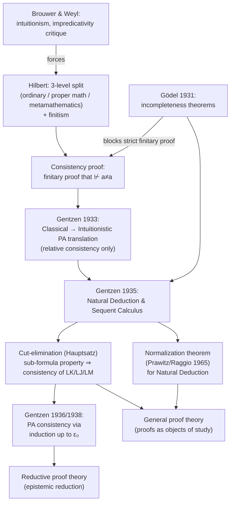

[[book-guidelines|↩ Back to guidelines]]

# Hilbert's Program and the Foundations of Proof Theory

## The problem this whole book is downstream of

Before there's a normalization theorem, a sequent calculus, or a cut-elimination proof to teach, there's a much blunter question sitting underneath all of it: **how do you know your formal system doesn't secretly let you derive a contradiction?**

This isn't idle paranoia. By the late 19th century, mathematics had been pushing hard into the infinite — Cantor's transfinite set theory, non-constructive existence proofs, impredicative definitions — and Frege, Peano, Russell, and Whitehead had shown that you *could* formalize mathematical proof completely, syntax and all. But formalizing something doesn't automatically make it safe. If your [[The-Sequent-Calculus#Axioms|axioms]] are secretly contradictory, then *every* formula is derivable (ex falso quodlibet), and the entire enterprise is vacuous. You need an actual proof that this can't happen — and it has to come from *somewhere outside* the system, because a system can't bootstrap trust in itself without begging the question.

This is the problem David Hilbert set out to solve, and Chapter 1 of this book is a compressed history of what happened when he tried: the conceptual apparatus he built to make a non-circular consistency proof even *conceivable*, the fight it triggered with Brouwer and Weyl, Gödel's theorems that appeared to torpedo the whole plan, and Gentzen's technical work — [[Natural-Deduction|natural deduction]], [[The-Sequent-Calculus|the sequent calculus]], cut-elimination, ordinal analysis — that rescued something usable from the wreckage. That rescue is the actual subject matter of the rest of the book; this chapter is why the subject matter exists at all.

If you're coming at this from a compiler/type-theory background: this is the historical seed of the distinction between an *object language* and a *metalanguage* that your whole verification stack depends on — the difference between the program being checked and the (trusted) code doing the checking. Keep that parallel in mind; it'll come back explicitly at the end.

## Hilbert's three-level architecture: ordinary math, proper math, metamathematics

Hilbert's first move, from his 1899 work on the foundations of geometry, was to notice that a formal theory doesn't have to commit to what its symbols "mean." A predicate like $L(x)$ can be read as "$x$ is a line" under one interpretation, or as a set of pairs of real numbers under another — the theory only constrains which *interpretations* satisfy the axioms; it doesn't hard-code a single intended model. This is exactly the modern distinction between syntax and semantics, and Hilbert's assistant Paul Bernays made it fully explicit in his 1918 dissertation: a formal system, a semantic interpretation, and a soundness/completeness proof relating the two.

But formalizing the *object theory* only pushes the consistency question up one level: now you need to reason *about* the formal system — about which strings of symbols are provable, about whether "$a \neq a$" is among them — and that reasoning has to happen somewhere. Poincaré spotted the trap immediately: if you try to prove arithmetic consistent by an argument that itself uses induction, and induction is one of the very things whose safety is in question, you've assumed what you're trying to prove.

Hilbert's answer (1922) was to split the world into three levels:

| Level | What it is |
|---|---|
| **Ordinary mathematics** | Mathematics as mathematicians actually do it — informal, semantically loaded |
| **Proper mathematics** (*eigentliche Mathematik*) | The fully formalized version of ordinary mathematics: symbols, axioms, explicit inference rules, no appeal to meaning |
| **Metamathematics** | The *study of* proper mathematics — statements and arguments *about* the formal system, restricted to reasoning secure enough that even an intuitionist would accept it |

The trick that defeats Poincaré's circularity charge: metamathematics is not required to use the *same* inferential resources as the object-level induction axiom being scrutinized. Hilbert's 1922 claim was that consistency of arithmetic could be established using only a *small, epistemically privileged* fragment of reasoning — one that doesn't presuppose the full strength of what's being checked. He called this fragment **finitary** (*finit*) reasoning: contentual ("*inhaltlich*" — literally "having content," as opposed to purely formal/symbol-pushing) inference about finite, concrete combinations of symbols, of a kind that even a radical constructivist critic would have to accept as unproblematic.

**What breaks without this distinction:** if you don't separate object-level and meta-level reasoning, "prove arithmetic is consistent" collapses into "assume arithmetic's reasoning is trustworthy, then verify arithmetic is trustworthy" — a proof with no epistemic force at all, since a genuinely inconsistent system could "prove" its own consistency too. The three-level split is what turns a circular non-question into a well-posed one: can a *strictly weaker, independently-trustworthy* theory certify a *strictly stronger* one?

This is precisely the shape of a **trusted computing base (TCB)** in a verification toolchain. A type checker or proof checker earns trust not by being formally verified *in its own logic* (which would be circular the same way Poincaré meant), but by being small, simple, and inspectable enough that you can convince yourself of its correctness by other means — reading the code, testing it, or checking it in a strictly more primitive, independently-trusted system. Hilbert's finitary metamathematics *is* the TCB for all of formalized mathematics: everything else (the object theory, however powerful) is "untrusted" until metamathematics vouches for it. When you design a proof-producing elaborator whose kernel must stay small "so the kernel can be trusted," you are re-deriving Hilbert's proper-mathematics/metamathematics split for your own system.

## What a consistency proof actually has to show

Concretely, Hilbert's program required: formalize a mathematical theory (first analysis, later — increasingly — arithmetic) completely, including its logical inference rules, and then give a **finitary metamathematical proof** that it is impossible to derive, within that formal system, the formula $a \neq a$ (equivalently, that you can never derive both $a = b$ and $a \neq b$).

The reason this is a tractable *kind* of question, even though the theory itself might talk about infinite sets, is that a formal proof — no matter what infinitary objects it's *about* — is itself a finite string of symbols. Metamathematics gets to treat proofs as finite combinatorial objects and reason about *them* by induction (e.g., induction on proof length), without needing to accept the infinitary content the proofs are asserting. This is the "finitary guarantee of the admissibility of infinitary objects": the object theory can talk about the transfinite, as long as the metatheoretic argument that it never breaks stays entirely finite and contentual.

## The foundational crisis: Brouwer and Weyl

Hilbert's program wasn't developed in a vacuum — it was explicitly a *reaction*. Weyl's *Das Kontinuum* (1918) attacked classical analysis and set theory as "a house built on sand," singling out **impredicative definitions** as a specific structural flaw: a definition of a set $X$ that quantifies over a totality *to which $X$ itself belongs*. The book's own example: defining the natural numbers as the intersection of all sets that contain $0$ and are closed under successor — this quantifies over "all such sets," a collection that includes the very set of natural numbers being defined. Russell, Poincaré, and Weyl all read this as a vicious circle. Weyl's fix, *predicativism*, restricted quantification to individuals in the domain, rebuilding a workable chunk of analysis without impredicative moves.

By 1921, Weyl had gone further, joining Brouwer's far more radical **intuitionism**: reject the law of excluded middle for infinite totalities, reject non-constructive existence proofs, and accept that most of infinitary classical mathematics has to go. Weyl called it "die Revolution."

Hilbert's program is best understood as the *conservative* counter-proposal to this revolution: don't throw away classical mathematics — instead, *prove* (by means even the intuitionist has to accept) that it can't go wrong. This is why Hilbert's target audience for a consistency proof is specifically the intuitionist critic, and why "finitary" is defined as "acceptable even to someone with Brouwer/Weyl's scruples." The whole three-level architecture and the finitary restriction exist *because* of this specific adversarial framing — Hilbert isn't choosing finitism for its own sake, he's choosing the most restrictive standard his opponents would still sign off on, precisely so that a successful proof would be dialectically unassailable.

## Gentzen's 1933 result: a partial answer that isn't a consistency proof

Before Gödel intervened, Gentzen (and independently Gödel, 1933) produced a result worth flagging carefully because it's easy to misclassify: a translation showing that **any derivation in classical arithmetic can be converted into a derivation in intuitionistic arithmetic.** (This is developed in full in Chapter 2 as the Gödel–Gentzen negative translation.)

This is *not* a finitary consistency proof in Hilbert's sense — it doesn't show directly, by contentual means, that no contradiction is derivable. What it shows is *relative* consistency: **if** intuitionistic arithmetic is consistent, **then** so is classical arithmetic. Dialectically this is still a real move, though: it flips part of the Brouwer/Weyl challenge back on itself. Their charge was "classical mathematics might be inconsistent, so we should retreat to the safer intuitionistic ground." Gentzen's translation shows that any inconsistency in classical arithmetic *would already be present* in intuitionistic arithmetic — so intuitionism doesn't buy you the safety margin it claimed to. It also revealed, contrary to the assumption at the time, that Hilbert's finitary standpoint is strictly *more* restrictive than intuitionistic reasoning generally — finitism and intuitionism aren't the same thing, even though they'd been treated as roughly interchangeable up to that point.

## Gödel's incompleteness theorems and their impact on the program

Then Gödel (1931) proved the result that reshapes everything downstream: **no consistent, sufficiently expressive, specifiable formal system can prove its own consistency using only means expressible within that system.** (These are Gödel's two incompleteness theorems, referenced together here; the book takes them as known background rather than re-deriving them in this chapter.)

The consequence for Hilbert's program is sharp: if the totality of finitary reasoning could itself be captured inside some fixed formal system (which is what most logicians of the time believed — that finitary methods lived inside something like Peano arithmetic, or not too far beyond it), then Gödel's theorem says **no finitary proof of that system's own consistency can exist.** The strictly-weaker-certifies-strictly-stronger structure that made the three-level architecture non-circular has a hard ceiling: you cannot use a system to certify a system whose full strength includes the certifying system itself.

This is the moment the naive version of Hilbert's program dies. But — and this is the chapter's real payoff — it is not the moment proof theory dies. What Gödel's result actually constrains is *how weak* the certifying metatheory can be, not whether reduction-style consistency proofs are possible at all. This distinction — between "no finitary proof of arithmetic's consistency is possible" and "no proof of arithmetic's consistency is possible" — is exactly the gap Gentzen exploited in 1936 and 1938.

## Gentzen's actual consistency proof: what changed and what didn't

Gentzen's 1936 proof of the consistency of Peano arithmetic (with a second version in 1938) is not a finitary proof in Hilbert's original, most restrictive sense — but it is still a *combinatorial, syntactic* proof, and this is the crucial nuance the chapter wants you to hold onto. The manipulation of proofs themselves — string-rewriting on finite proof-trees — stays completely finitary throughout. What goes beyond strict finitism is the *induction principle* used to show the rewriting process terminates: instead of ordinary induction on the natural numbers, Gentzen needed **[[Induction-as-a-Proof-Method#Induction along a well-ordering|induction along a well-ordering]] of order type $\varepsilon_0$** — the least ordinal not expressible via a certain finite combinatorial notation system built from $0$ and $\omega$ closed under sums and exponents (developed from scratch in Chapters 8–9).

The mechanism, sketched at the level Chapter 1 gives it (full detail in Chapters 7 and 9): formulate Peano arithmetic as a sequent-calculus system where every axiom except induction is an atomic sequent, and replace the induction *axiom scheme* with an induction *inference rule*. Then show that any proof of an atomic sequent (in particular, a proof of the empty sequent — a formalized contradiction) can be progressively transformed — by removing induction inferences, weakenings, and complex cuts — into a "simple" proof containing none of these, and simple proofs can be shown, by completely elementary reasoning, to never derive a contradiction. Each transformation step is shown to strictly decrease an assigned ordinal notation below $\varepsilon_0$; since there's no infinite strictly-decreasing sequence of such notations (they're well-ordered), the reduction process must terminate — and when it terminates, you're left with a simple proof, which can't prove the empty sequent. Therefore no proof of the empty sequent exists in Peano arithmetic in the first place. That's the consistency proof.

This is worth sitting with as an early instance of a **termination argument via a well-founded measure** — precisely the technique you'd reach for to prove a rewrite system, an abstract-interpretation fixpoint iteration, or a proof-search procedure terminates. The measure here just happens to need [[Transfinite-Ordinals|transfinite ordinals]] rather than natural numbers, because a naive-numbers count of "proof size" or "cut complexity" doesn't monotonically decrease under the rewriting steps Gentzen needs (removing one induction can, in the short run, *multiply* the number of cuts in the proof) — you need a richer order that can still certify well-foundedness despite local increases in simpler measures. This is the same reason lexicographic or ordinal-valued termination measures show up in modern proof assistants' termination checkers whenever a naive structural-recursion argument fails.

## Reductive proof theory versus general proof theory

The chapter closes its historical arc by naming a distinction that reorganizes everything that follows in the book — not a difference in *technique*, but in *purpose*:

- **Reductive proof theory** is proof theory in the direct service of Hilbert's epistemic reduction program: the point of studying proofs is to reduce trust in a strong (possibly infinitary) system to trust in a weaker, safer one. A consistency proof is the paradigm reductive result.
- **General proof theory** studies proofs and their transformations as mathematical objects of interest *in their own right*, without being constrained by any specific epistemological payoff. Normalization of natural-deduction proofs, cut-elimination for the sequent calculus, and the sub-formula property are results *about proofs as such* — they don't need a foundational crisis to motivate them, even though historically that's exactly the crisis that produced them.

Gentzen himself sits at the hinge: his natural deduction and sequent calculus were developed as tools *for* the reductive project, but they immediately generated results — cut-free proofs have the sub-formula property, hence LK/LJ/LM are trivially consistent; normal natural-deduction proofs likewise — that are naturally read as general proof theory, since they're facts about the *structure* of proofs, not facts purchased specifically to rescue an epistemic reduction. Prawitz and Kreisel sharpened this contrast explicitly in the 1970s. Structurally: reductive proof theory is a *use case* of general proof theory, not a separate formal apparatus.

If you're building a proof-producing verification toolchain, this distinction maps onto a real architectural choice you'll have to make explicitly: are you studying proof normal forms, cut-elimination-style transformations, and proof search **because** you need them to certify a weaker trusted core (reductive — e.g. "reduce trust in my SMT solver's output to trust in a small proof-checking kernel that replays a certificate"), or because you want the structural properties (sub-formula property, canonical forms, decidability of proof search) **for their own algorithmic value** — faster proof search, smaller certificates, better error messages? Both are legitimate; conflating them is how projects lose track of what their trusted base actually needs to guarantee.

## What this chapter is setting up

Every later chapter of the book is, in this sense, already announced here:

- **Chapters 2–3** (axiomatic calculi, natural deduction) build the actual formal systems Gentzen introduced — the tools this chapter only describes in prose.
- **Chapter 4** (normalization) delivers the general-proof-theory result mentioned at the end: Prawitz/Raggio's normalization theorem, the natural-deduction analog of cut-elimination.
- **Chapters 5–6** (sequent calculus, Hauptsatz) deliver the cut-elimination theorem this chapter names but doesn't prove, along with its "free" consistency corollary via the sub-formula property.
- **Chapters 7–9** (consistency of arithmetic, ordinal notations) deliver the actual Gentzen 1936/1938 argument — the induction-along-$\varepsilon_0$ termination proof sketched above, done in full combinatorial detail.

**[[Applications-of-Induction-up-to-Epsilon-0#Where this leads|Where this leads]]:** everything from here on is either (a) building the precise formal machinery (natural deduction, sequent calculus) whose *informal* motivation this chapter just gave you, or (b) working out, with full rigor, the one technical argument — Gentzen's ordinal-based reduction procedure — that this chapter claims succeeded where naive finitism could not. The Hilbert/Gödel tension established here is also the reason the book bothers to prove consistency *twice*, in two senses: once structurally (cut-elimination ⇒ consistency of the *pure logic*, no induction involved, fully finitary) and once arithmetically (the ε₀ argument ⇒ consistency of *Peano arithmetic*, needing the extra-finitary ordinal induction). Watching where that second, harder proof needs to go beyond the first is the throughline of the whole book — and it's the direct historical ancestor of the modern question of exactly how much metatheoretic strength a trusted kernel needs before it can certify a given object theory, which is precisely the question you're implicitly answering every time you decide what your own verifier's trusted core is allowed to assume.
