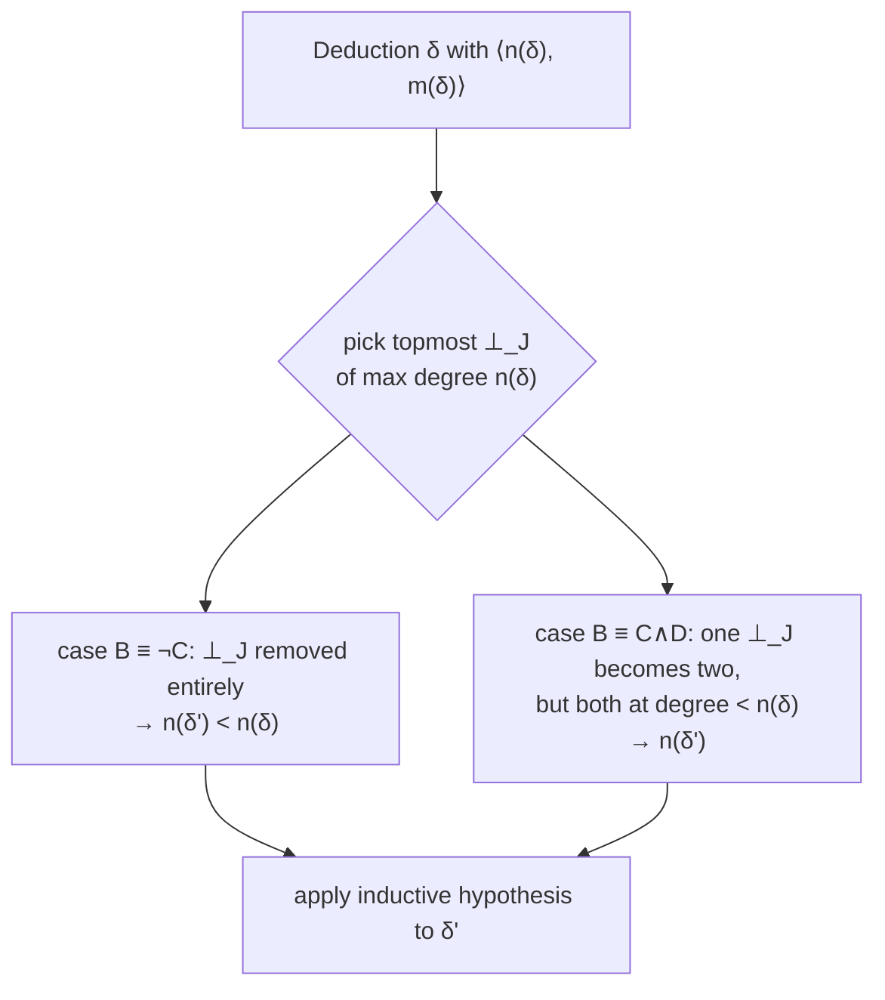
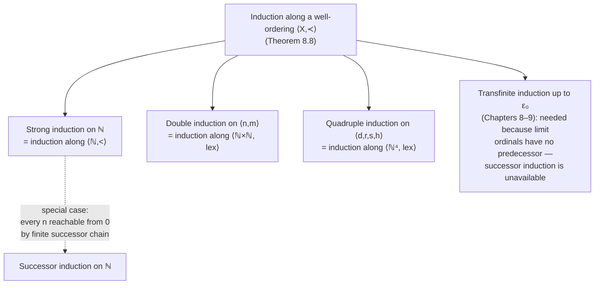

[[book-guidelines|↩ Back to guidelines]]

# Induction as a Proof Method

## Why proof theory needs its own theory of induction

Everything downstream in this book — normalization, cut-elimination, Gentzen's consistency proof for arithmetic — is a statement about *all* derivations, or *all* deductions, or *all* proofs of a certain shape. You cannot check infinitely many derivations one at a time. What you need is a method that lets a finite argument cover an infinite class of syntactic objects. That method is induction, and the book treats it not as a background fact borrowed from arithmetic, but as a proof-theoretic tool in its own right — one that gets *generalized* over the course of the book, from ordinary induction on $\mathbb{N}$, to induction on trees, to induction on pairs of measures, to induction on quadruples of measures, and finally to induction along an arbitrary well-ordering. Each generalization exists because a specific theorem needed it and plain successor induction wasn't strong enough to prove it.

If you've written a recursive function over an AST, you've already used the mechanism underneath all of this: structural recursion terminates because the AST's subterms are "smaller" in some well-founded sense. What this chapter of the book does is take that intuition and make it fully rigorous and fully general, because proof theory is going to lean on multi-dimensional and transfinite versions of "smaller" that no ordinary recursive function needs.

## Successor induction and strong induction on $\mathbb{N}$

The book starts from the plainest form (Definition 2.12, p. 26):

**Successor induction.** A property $P$ holds of all natural numbers provided:
$$
(0)\ P(0), \qquad (n^{\#})\ \text{for arbitrary } n \ge 0,\ \text{if } P(n) \text{ then } P(n+1).
$$

This is the induction principle every programmer has already internalized as "base case + inductive case." What's worth noticing is *why* it's valid, because that justification is what gets reused (and stress-tested) later: if $(0)$ and every instance of $(n^{\#})$ are true, but some $P(n)$ were false, you could walk backwards — $P(n)$ false forces $P(n-1)$ false (via the contrapositive of $((n-1)^{\#})$), which forces $P(n-2)$ false, and so on. This produces an infinite *strictly decreasing* sequence of natural numbers, $n > n-1 > n-2 > \cdots$, and no such sequence exists — every decreasing sequence of naturals bottoms out at $0$. So there is no counterexample. The bottom line: successor induction works *because* $\mathbb{N}$ under $<$ has no infinite descending chains. Everything the book calls "induction" for the rest of the book is a variant of this exact argument, applied to different sets and different orderings.

The book then strengthens this to **strong induction** (Definition 2.13, p. 28), because the inductive step often needs more than "$P$ at the immediate predecessor" — it needs $P$ at *some* smaller number, which one depending on the case:

$$
(0)\ P(0), \qquad (n^{*})\ \text{for arbitrary } n > 0,\ \text{if } P(m) \text{ for all } 0 \le m < n,\ \text{then } P(n).
$$

The book's own worked example (p. 28) is exactly this shape: every $n \ge 2$ is a product of primes. If $n$ itself is prime, you're done directly. If not, $n = m_1 \cdot m_2$ with $2 \le m_1, m_2 < n$ — and you need the inductive hypothesis at *two arbitrary* smaller numbers, neither of which is $n-1$. Successor induction can't express this without contortion; strong induction expresses it directly. The book is careful to note that on $\mathbb{N}$ the two principles are provably equivalent — strong induction is successor induction where the inductive step is instantiated with a *specific* $m < n$ each time — but strong induction is the more *general* pattern, and it's the one that survives the trip to structures other than $\mathbb{N}$ (this becomes explicit in Chapter 8, below).

**Rust grounding.** Successor induction is what you get for free from `enum`-based recursion on `Nat`-like structures: matching `0 => base_case()` and `n+1 => step(recurse(n))` is *structural* recursion, and the compiler's termination argument for it is successor induction in disguise. Strong induction is what you need the moment your recursive call isn't on the immediate predecessor — e.g. a primality-factoring routine that recurses on an arbitrary smaller divisor:

```rust
fn factor_into_primes(n: u64) -> Vec<u64> {
    if is_prime(n) { return vec![n]; }
    let m1 = smallest_nontrivial_divisor(n); // 2 <= m1 < n
    let m2 = n / m1;                          // 2 <= m2 < n
    // Neither m1 nor m2 is n - 1: this recursion needs
    // "assume it works for ALL smaller values," not just n - 1.
    let mut result = factor_into_primes(m1);
    result.extend(factor_into_primes(m2));
    result
}
```
Rust's own termination checker doesn't verify this (Rust has no totality checker), but a dependently-typed host language does — and the proof obligation it discharges is precisely strong induction on `n`.

**Lean grounding.** Lean's kernel has two relevant primitives here worth distinguishing precisely, because the elaborator project this book feeds into will need both: `Nat.rec` gives you successor induction directly (it *is* the eliminator generated from `Nat`'s two constructors, `zero` and `succ`). Strong induction is not a primitive eliminator — it's a derived principle, `Nat.strongRecOn` / `Nat.strongInductionOn`, itself *proved* using well-founded recursion on `<` (which is where Chapter 8's material closes the loop: strong induction is induction along the well-ordering $\langle \mathbb{N}, < \rangle$). This is the first sign that "which induction principle you're licensed to use" is a fact about the *order structure* of the domain, not a fact about the domain's syntax — a theme the book makes fully explicit in §8.1.

## Induction on formula complexity and on derivation length

The book's second move (still in §2.7, pp. 29–30) is to point out that induction isn't tied to arithmetic properties of numbers at all — it applies to *any* inductively-defined syntactic class, by inducting on the **stage** at which an object is generated. Formulas are built up from propositional variables (stage 1) by applying connectives to already-generated formulas (stage $n$ built from formulas of stage $< n$). To prove every formula has property $Q$, you prove "$P(n)$: every formula generated at stage $n$ has $Q$" by induction on $n$ — and the inductive step *is itself* a case split on the formula's main connective, each case appealing to the inductive hypothesis on the (necessarily lower-stage) immediate subformulas. The book's worked example is exactly the kind of invariant you'd carry through a parser: every formula has equally many left and right parentheses, proved by a one-line case analysis on whether the formula is $\neg A$, $A \wedge B$, $A \vee B$, or $A \supset B$.

This is **structural induction dressed as numerical induction** — "stage" is just a numeric proxy for "how deep is this term's construction tree." The book uses the numeric framing throughout Chapter 2 because the axiomatic systems it's built around present formulas and derivations as *sequences*, but the underlying argument is really: an inductively defined set's induction principle mirrors its constructor set one-for-one, with the inductive hypothesis available at every *immediate* constituent.

The pattern is used constitutively, not just illustratively: the **deduction theorem** (Theorem 2.16, p. 30 — "if $\Gamma, A \vdash B$ then $\Gamma \vdash A \supset B$") is proved by induction on the *length of the derivation sequence* $B_1, \dots, B_n$ witnessing $\Gamma \cup \{A\} \vdash B$. Once [[Natural-Deduction|natural deduction]] is introduced in Chapter 3, where deductions are *trees* rather than sequences, "length" stops making unambiguous sense, and the book introduces two tree-native replacements (Definitions 3.13–3.14, pp. 90–91):

- **size**$(\delta)$: $0$ for a bare assumption; $1 + \sum(\text{sizes of premise sub-deductions})$ for a deduction ending in an inference — i.e. the number of inference steps.
- **height**$(\delta)$: $1$ for a bare assumption; $1 + \max(\text{heights of premise sub-deductions})$ — i.e. the length of the longest branch.

Both are defined *by structural recursion on the deduction tree itself*, and both support induction: "every deduction of size $n$ has property $Q$, given it holds for size $< n$." The book immediately puts this to serious work in Lemma 3.16 and Lemma 3.18 (pp. 91–95), proving the **substitution lemma** for natural deduction — that replacing an eigenvariable throughout a deduction yields another correct deduction — by induction on size, with a genuine case split on the deduction's *last inference rule* ($\wedge$i, $\forall$i, $\exists$e, …). This is worth dwelling on because it's the direct proof-theoretic ancestor of a substitution lemma you'll need for any type checker: "substituting a well-typed term for a free variable throughout a derivation/typing tree preserves derivability" is exactly this shape of theorem, exactly this shape of proof.

**Rust grounding — the case split *is* the match arm.** Induction on formula/deduction structure translates almost literally into a recursive function whose `match` arms mirror the constructors, and whose recursive calls are licensed by "the subterm is structurally smaller":

```rust
enum Deduction {
    Assumption(Formula),
    AndIntro(Box<Deduction>, Box<Deduction>),
    ImpIntro { discharged: Formula, body: Box<Deduction> },
    ForallIntro { eigenvar: Var, body: Box<Deduction> },
    // ...
}

fn size(d: &Deduction) -> usize {
    match d {
        Deduction::Assumption(_) => 0,
        Deduction::AndIntro(d1, d2) => 1 + size(d1) + size(d2),
        Deduction::ImpIntro { body, .. } => 1 + size(body),
        Deduction::ForallIntro { body, .. } => 1 + size(body),
    }
}

// Substitution lemma, proved (informally) by structural recursion —
// exactly Lemma 3.16's induction on size(δ), case-split on the
// constructor, i.e. on δ's last inference rule.
fn substitute_eigenvar(d: &Deduction, from: Var, to: Var) -> Deduction {
    match d {
        Deduction::Assumption(f) => Deduction::Assumption(f.subst(from, to)),
        Deduction::AndIntro(d1, d2) => Deduction::AndIntro(
            Box::new(substitute_eigenvar(d1, from, to)),
            Box::new(substitute_eigenvar(d2, from, to)),
        ),
        Deduction::ForallIntro { eigenvar, body } => {
            // side condition: eigenvar must be freshened to avoid capture —
            // this is precisely the "eigenvariable condition" bookkeeping
            // the book spends two full lemmas getting right.
            todo!("rename eigenvar if it clashes with `to`, then recurse on body")
        }
        // ...
    }
}
```
Every recursive call above is on a strictly smaller `size`, which is exactly the numeric witness the book's induction principle needs — Rust's borrow/recursion checker doesn't verify termination, but the proof obligation discharged if you *were* asked to prove this function total is, again, structural (= strong) induction on `size(d)`.

**Lean grounding.** This is the textbook use case for Lean's `induction` tactic generating cases directly from an inductive type's constructors — for a `Deduction`-like inductive family, `induction d` produces exactly the case split the book performs by hand (one goal per constructor, one inductive hypothesis per recursive occurrence). The eigenvariable-freshness side conditions in Lemma 3.16/3.18 are the informal-proof version of what Lean's `Expr` de Bruijn representation and `Name`-generation machinery (`mkFreshFVarId`, etc.) exist to make airtight — this is a direct preview of the substitution/context management plumbing your elaborator will need under Hoare-triple soundness proofs and definitional-equality checking.

## Double induction

Chapter 4 needs a strictly stronger tool for the normalization theorem, and the book introduces it carefully as its own principle rather than folding it silently into an example (§4.2, pp. 105–107). **Double induction** proves $P(n,m)$ for all naturals $n, m$ via:

1. **Basis:** $P(0,0)$.
2. **Inductive hypothesis:** $P(k,\ell)$ holds whenever $k < n$, **or** $k = n$ and $\ell < m$.
3. **Inductive step:** derive $P(n,m)$ from that hypothesis.

This is induction on pairs ordered *lexicographically*: $\langle n, m\rangle$ counts as "smaller" than $\langle n', m'\rangle$ if $n < n'$, or $n = n'$ and $m < m'$. The book's justification (p. 106) is the same descending-sequence argument as before, just run on pairs: a counterexample $\langle n_1, m_1\rangle$ generates a decreasing sequence $\langle n_1,m_1\rangle > \langle n_2,m_2\rangle > \cdots$ under this lexicographic order, and — crucially — *this sequence must still terminate*, because within a fixed first coordinate the second coordinate can only decrease finitely often before the first coordinate has to drop, and the first coordinate is itself a natural number. No infinite descending chain of pairs exists, so no counterexample exists.

The book's worked application (Proposition 4.2, pp. 106–109) is instructive precisely because it shows *why* a single measure isn't enough. The goal: every deduction can be transformed so every $\bot_J$ (ex falso) inference concludes an *atomic* formula. The natural strategy is to remove the $\bot_J$ inference of highest-complexity conclusion first — but removing one such inference can *spawn several new* $\bot_J$ inferences (look at the $B \equiv C \wedge D$ case: one $\bot_J$ of conclusion $C \wedge D$ becomes *two* $\bot_J$ inferences, on $C$ and on $D$ separately). So the *count* of high-complexity inferences is not monotonically decreasing — only the *pair* $\langle n(\delta), m(\delta)\rangle$ = ⟨max degree of a $\bot_J$ conclusion, number of $\bot_J$ inferences at that max degree⟩ decreases lexicographically: degree either drops, or degree stays the same and the count at that degree drops. This is the general shape double induction is *for*: an inductive step that can locally make one measure worse while a coarser, higher-priority measure gets strictly better.



**Rust grounding — lexicographic termination measures.** This is the standard technique for proving termination when a single recursive call can locally "grow" a substructure, as long as a coarser measure strictly shrinks. It shows up literally as tuple comparison:

```rust
// Termination measure: (max_degree_of_bad_inferences, count_at_that_degree).
// Rust's `Ord` on tuples is already lexicographic — this is not a coincidence,
// it's the same order the book defines by hand on p. 106.
fn measure(d: &Deduction) -> (u32, u32) {
    (max_bot_j_degree(d), count_bot_j_at_max_degree(d))
}

fn atomize_bot_j(d: Deduction) -> Deduction {
    let (n, m) = measure(&d);
    if n == 0 { return d; } // basis: already normal form
    let d2 = rewrite_topmost_max_degree_bot_j(d);
    debug_assert!(measure(&d2) < measure(&d)); // lexicographic tuple `<`
    atomize_bot_j(d2)
}
```
This is exactly the pattern you'll reach for when proving a constraint-solver or worklist-fixpoint loop terminates despite a single step increasing the number of *active* constraints — as long as some coarser potential (e.g. abstract-domain height, or a priority-degree like here) strictly drops.

**Lean grounding.** Lean's `termination_by` machinery accepts exactly this: a measure into a type with a well-founded order, and `Prod.lex` gives you the lexicographic order on pairs directly, so `termination_by (n(d), m(d))` with the standard product well-founded relation `WellFoundedRelation` reduces *definitionally* to the book's own justification — Lean isn't doing something different from the book here, it's discharging the identical proof obligation via `Nat ×ₗ Nat`'s well-foundedness.

## Quadruple induction

Chapter 4's hardest result — normalizing NK, classical natural deduction — needs even more resolving power, and the book is explicit that this is a *generalization* of the same idea rather than a new one (§4.9, pp. 158–159). The classical absurdity rule $\bot_K$ creates detours that resist the $\wedge/\supset/\neg/\forall$-fragment's normalization strategy, so the book tracks **four** measures on a deduction $\delta$ (Definition 4.55, p. 158):

$$
d(\delta),\ r(\delta),\ s(\delta),\ h(\delta)
$$

— maximal cut degree, maximal rank among cuts of that degree, the count of cuts at that maximal degree-and-rank ("maximal cuts"), and the sum of heights of those maximal cuts, respectively. Normalization for NK (Theorem 4.58) then proceeds by showing that every transformation step strictly decreases the quadruple $\langle d,r,s,h\rangle$ under the lexicographic order:
$$
d' < d,\quad\text{or}\quad d'=d \wedge r'<r,\quad\text{or}\quad d'=d \wedge r'=r \wedge s'<s,\quad\text{or}\quad d'=d\wedge r'=r\wedge s'=s\wedge h'<h.
$$

The book's own framing (p. 159) is worth quoting for how self-aware it is about the generalization: *"you might want to revisit this proof after reading [Chapter 8]... for now you can think of it as an extension of the principle of double induction, and take it on faith that it works the same way."* That's a deliberate promissory note — the book is telling you explicitly that quadruple induction isn't a fundamentally new principle, just double induction's argument re-run one dimension further, and that the real justification (why *any* finite tuple of naturals, lexicographically ordered, has no infinite descending chain) is coming in Chapter 8. The double-induction proof in §4.2's application (the $\langle n,m\rangle$ pair for the $\bot_J$ proposition) generalizes without modification: a lexicographically-decreasing sequence of $k$-tuples of naturals still must terminate, because it terminates coordinate-by-coordinate from the most significant down, exactly as with pairs.

This same pattern reappears, independently, in Chapter 6's proof of the **Main Lemma** for cut-elimination (§§6.1–6.2, pp. 204–208): there the measure is a *pair* $\langle \mathrm{dg}(\pi), \mathrm{rk}(\pi)\rangle$ — the **degree** of the mix formula (its logical complexity) and the **rank** of the proof (roughly, how far the mix formula's occurrences are from the mix inference along both branches). The book is explicit that degree is given *more weight* than rank precisely because that's what makes the lexicographic order well-founded in the way the proof needs: dropping degree by even one unit licenses the inductive hypothesis for *any* rank, while dropping rank alone only helps at the same degree. This mirrors §4.2's chocolate-bar-grid picture exactly, and is the same double induction the normalization proofs use, applied to a completely different syntactic object (sequent proofs ending in `mix`, rather than natural deduction trees).

**Rust/Lean grounding.** The generalization from pairs to quadruples is exactly the generalization from `(u32, u32)` to a 4-tuple `(u32, u32, u32, u32)` under lexicographic `Ord`, or in Lean, from `Nat ×ₗ Nat` to a nested `Nat ×ₗ (Nat ×ₗ (Nat ×ₗ Nat))`. Nothing about the *proof technique* changes — only the arity of the tuple. This generalizes further, and this is the load-bearing point for anything you build with multiple interacting cost measures (a CSP backtracking search with, say, ⟨remaining unassigned variables, constraint-graph width, domain size sum⟩ as a termination/progress measure, or a unification algorithm tracking ⟨metavariable depth, occurs-check cost, substitution size⟩): as long as each dimension lives in a well-ordered set and the tuple order is lexicographic, you get termination for free from the well-foundedness of the lexicographic product — which is precisely Chapter 8's theorem, applied.

## Induction along a well-ordering

Chapter 8 (§8.1, pp. 312–315) finally states the principle that successor induction, strong induction, double induction, and quadruple induction were all secretly instances of. First, the book defines the order-theoretic vocabulary precisely:

- A **strict linear order** $\prec$ on a set $X$: transitive, asymmetric, total (Definition 8.2).
- A **well-ordering**: a strict linear order in which *every non-empty subset has a least element* (Definition 8.3).

The book proves (Proposition 8.5, p. 314) that well-orderings are exactly the linear orders with **no infinite descending sequence** $x_1 \succ x_2 \succ x_3 \succ \cdots$ — which should look familiar, since "no infinite descending sequence" was the informal justification given for successor induction on $\mathbb{N}$, for double induction on $\mathbb{N}^2$, and for quadruple induction on $\mathbb{N}^4$, every single time. This is the theorem that retroactively explains all of the earlier proof techniques as one theorem:

> **Theorem 8.8 (Induction along well-orderings).** If $\langle X, \prec\rangle$ is a well-ordering and, for every $x \in X$, $P(x)$ holds whenever $P(y)$ holds for all $y \prec x$, then $P(x)$ holds for all $x \in X$.

The proof (p. 315) is three lines and is the cleanest version of the argument the book has been running since Chapter 2: suppose some $z$ has $P(z)$ false; then $\{y : P(y)\text{ false}\}$ is a non-empty subset of $X$; since $\prec$ is a well-ordering, this set has a *least* element $x_1$; by minimality, $P(y)$ holds for every $y \prec x_1$; but then the hypothesis forces $P(x_1)$ — contradiction. Notice this proof doesn't even need to *construct* a descending sequence (as the $\mathbb{N}$-specific arguments earlier in the book did) — the well-ordering's defining property (every non-empty subset has a least element) does the entire job in one step. This is the mathematically cleaner formulation, and the book deliberately introduces it only after building intuition with the sequence-based arguments on $\mathbb{N}$, pairs, and quadruples.

The punchline the book draws out explicitly (p. 313, and again at the start of §8.2, p. 315) is: **strong induction on $\mathbb{N}$ is induction along the well-ordering $\langle \mathbb{N}, <\rangle$; double induction is induction along the well-ordering of $\mathbb{N} \times \mathbb{N}$ under the lexicographic order; and quadruple induction is the same fact for $\mathbb{N}^4$.** Successor induction, meanwhile, is described as strictly *weaker* than strong induction as a general principle — it only coincides with strong induction on $\mathbb{N}$ because every natural number is reachable from $0$ by finitely many applications of successor. On a well-ordering where elements aren't all reachable "from below" by a successor step (the book's forward pointer here is to the ordinal notations of Chapter 8 itself, going up to $\varepsilon_0$ in Chapter 9, where most elements are *limits*, reachable only by a supremum of infinitely many smaller elements, not by any single predecessor), successor induction is simply not available — you *must* use the strong/well-ordering form. This is exactly why Gentzen's ordinal-based consistency proof for arithmetic (Chapters 7–9, and previewed in the guidelines' Chapter 8 summary) needs induction along $\varepsilon_0$ and not some numbered analogue of successor induction: the ordinals below $\varepsilon_0$ include limit ordinals with no immediate predecessor at all.



**Rust grounding — well-founded recursion, made explicit.** This is precisely the theoretical justification for "termination measure into a well-founded order," which is the standard escape hatch every verified-recursion framework offers when structural recursion alone won't type-check. In Rust terms, if you ever reach for a `measure: T -> M` where `M` carries a well-founded order and you argue `measure(recursive_call_arg) < measure(current_arg)`, Theorem 8.8 is the theorem that licenses treating that as a valid proof of termination/correctness by induction — not an informal heuristic. This is also the exact fixpoint-termination argument behind abstract interpretation: a monotone transfer function iterated over a finite-height abstract lattice terminates because the lattice's ascending-chain condition is precisely "no infinite ascending sequence," the mirror image of well-ordering's "no infinite descending sequence" — and widening operators exist specifically to *impose* a well-founded (finite-height, or at least ACC-satisfying) structure onto lattices that don't naturally have one, so that this same induction principle becomes available.

**Lean grounding.** This is `WellFounded.fix` / the `Acc` (accessibility) predicate in Lean's core library, essentially verbatim: `Acc r x` holds exactly when every `r`-descending sequence starting at `x` terminates, and `WellFounded r` says every element is `Acc`. Lean's `decreasing_by` / `termination_by` tactic machinery, when it can't find structural recursion, falls back to exactly Theorem 8.8, instantiated at whatever order you supply — including lexicographic products, which is what makes double- and quadruple-induction-style Lean definitions type-check without any special-casing beyond "give me a well-founded relation." If you are building a custom termination checker for the compiler's own recursive elaboration/inference procedures, this theorem — not any $\mathbb{N}$-specific induction principle — is the one your trusted kernel needs to certify, since your metavariable-resolution and constraint-propagation loops will almost certainly use multi-component, lexicographically-ordered progress measures rather than a single natural number.

## Where this leads

Within the book, this section is pure infrastructure — but load-bearing infrastructure, used everywhere from here on:

- **Normalization (Ch. 4)** uses double induction for the $\wedge,\supset,\neg,\forall$-fragment and quadruple induction for full NK — both are, per the book's own admission, instances of Chapter 8's single theorem, used before that theorem is stated.
- **Cut-elimination (Ch. 6)** reuses the identical double-induction-on-a-pair pattern (degree, rank of a mix) to prove the Main Lemma — the Hauptsatz's entire proof is organized around it.
- **Gentzen's consistency proof for PA (Chapters 7 and 9)** is where the generalization pays off maximally: induction along a well-ordering is pushed all the way to induction along the ordinal notations up to $\varepsilon_0$ (Chapter 8's main technical content), precisely because $\mathbb{N}$-only strong induction (equivalently, successor induction) is not strong enough to measure the termination of Gentzen's reduction procedure on proofs — you need transfinite induction, and Theorem 8.8 is what makes "transfinite induction" a rigorous instance of the same principle rather than a leap of faith.

For the compiler/elaborator project this vault is ultimately in service of: this is the general theorem behind *every* termination and soundness argument you will need to formalize in a trusted kernel — type-safety proofs (progress/preservation) are induction on typing-derivation structure, exactly like the book's Chapter 3 substitution lemma; a bidirectional elaborator's termination is a well-founded-recursion argument over a measure combining term size, metavariable count, and unification-problem complexity — structurally identical to the book's $\langle d,r,s,h\rangle$ quadruple; and a CSP/abstract-interpretation fixpoint loop's termination is the same well-ordering argument run on a lattice's height instead of a proof's rank. When you eventually need to certify one of these arguments inside a trusted kernel, Theorem 8.8 (or its Lean incarnation, `WellFounded.fix`) is the actual theorem doing the work — everything else, including this book's own double and quadruple inductions, is that one theorem applied to a specific well-ordered measure.
