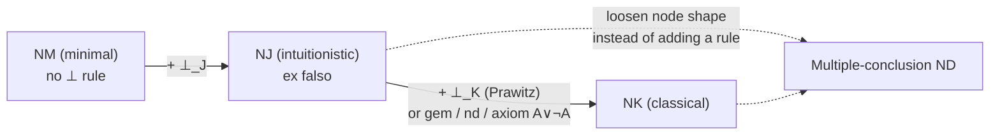

# Natural Deduction

[[book-guidelines|↩ Back to guidelines]]

## Why Gentzen threw out the axioms

Chapter 2 of the book builds axiomatic (Hilbert-style) systems $M_1$, $J_1$, $K_1$: a handful of axiom schemas plus modus ponens, everything else derived by grinding through substitution instances. It works, but the authors are blunt about *why nobody proves anything that way*: axiomatic systems are terrible for actually finding proofs. Two specific failures motivate everything in this chapter.

First, real mathematical reasoning is saturated with **temporary assumptions** — "suppose $X$ is finite," "let $p$ be an arbitrary prime," "assume, for contradiction, that..." — that get discharged once their job is done. An axiomatic derivation has no place for this: every line is already an established truth, derived from [[The-Sequent-Calculus#Axioms|axioms]]. The deduction theorem *simulates* conditional reasoning after the fact, but the system itself has no native concept of a hypothesis you're allowed to retract.

Second, and more damning for automation: axioms and modus ponens aren't chosen to make proof search tractable. If your only rule is "from $A$ and $A \supset B$, infer $B$," there is no syntactic hint connecting the theorem you want ($B$) to the premise you need ($A$) — $A$ can be anything. You are, in the book's words, "left to guess."

Gentzen's 1935 dissertation (with Jaśkowski independently arriving at similar ideas around 1926) fixes both problems at once with **natural deduction**: instead of deriving theorems from axioms, you reason from hypothetically-assumed formulas using inference rules that mirror the informal patterns mathematicians actually use — conditional proof, proof by cases, generalizing on an arbitrary object. The book deliberately doesn't split propositional and predicate natural deduction into separate systems the way Chapter 2 did for the axiomatic systems; it presents the full predicate-logic systems from the start and calls them **NM**, **NJ**, **NK** — natural deduction for minimal, intuitionistic, and classical logic (short for NM₁, NJ₁, NK₁).

**What breaks without this:** try to axiomatically prove something as simple as $(A \land B) \supset (B \land A)$ and you must already know that you'll eventually apply the deduction theorem to whatever you derive from $A \land B$. Natural deduction makes that scaffolding *the object itself* — assumptions and their discharge are first-class syntax, not a meta-theorem you invoke afterward.

## Deductions are trees, not sequences

The central representational move — and the one with the most direct payoff for anyone building a proof/type checker — is this: a natural deduction *cannot* be a sequence of formulas the way an axiomatic derivation is.

Here's why. An axiomatic modus ponens step just needs $A$ and $A \supset B$ to have appeared *somewhere earlier* in the list. But natural deduction's conditional-proof rule needs to know which formulas *depend on* which assumption — $B$ was derived *using* $A$, and that dependency must be trackable so $A$ can be discharged precisely when $A \supset B$ is inferred, and nowhere else. A flat sequence can't express "this formula's justification structurally rests on that hypothesis." A tree can.

> **Definition 3.1.** A *deduction* of a formula $A$ is a tree of formulas in which every formula that is not an assumption is the conclusion of a correct application of one of the inference rules. The assumptions not discharged by any rule in the deduction are its *open assumptions*. If there are no open assumptions at all, the deduction is a **proof** of $A$, and $A$ is a **theorem**.

Every formula occurrence in the tree is the premise of at most one inference and the conclusion of at most one inference — no reuse, unlike axiomatic derivations where a line can feed multiple later modus ponens steps. If you need a formula twice, you re-derive it (or re-assume it) at a second leaf. Leaves are assumptions; the root is the *end-formula*.

**Grounding (Rust).** This is exactly an AST with parent-tracked scoping, not a linear IR. Model it as:

```rust
enum Deduction {
    Assumption { formula: Formula, id: AssumptionId },
    Rule {
        conclusion: Formula,
        premises: Vec<Deduction>,
        discharges: Vec<AssumptionId>, // which open assumptions this
                                       // inference retires, by label
    },
}

fn open_assumptions(d: &Deduction, discharged: &HashSet<AssumptionId>) -> Vec<&Formula> {
    match d {
        Deduction::Assumption { formula, id } if !discharged.contains(id) => vec![formula],
        Deduction::Assumption { .. } => vec![],
        Deduction::Rule { premises, discharges, .. } => {
            let mut discharged = discharged.clone();
            discharged.extend(discharges.iter().cloned());
            premises.iter().flat_map(|p| open_assumptions(p, &discharged)).collect()
        }
    }
}
```

The `discharges` field on a `Rule` node is doing precisely the labeling work the book describes: "we label the inference at which the assumptions are discharged and the assumptions there discharged with the same numerical label." Two deductions that are identical trees but discharge different assumption *occurrences* at a given rule application are, by the book's own convention, **different deductions** — this is not pedantry, it matters later for normalization (Chapter 4), where you rewrite deductions and need to know exactly which occurrences move together.

Here is the book's own worked example, a proof of $(A \land B) \supset (B \land A)$, showing how $\land$e, $\land$i, and $\supset$i compose (label 1 marks the two assumption occurrences discharged by the final $\supset$i):

$$
\dfrac{\dfrac{A \land B^{\,1} \qquad A \land B^{\,1}}{\dfrac{B \qquad\qquad A}{B \land A}\, \land\text{i}}}{(A \land B) \supset (B \land A)}\; {\scriptstyle 1}\;\supset\text{i}
$$

Notice the discharge is *permissive*, never *mandatory*: an assumption of the matching shape may go undischarged forever (making it an open assumption of the whole deduction), and an inference need not have any matching open assumptions available to discharge at all. This matters — it's what lets the same rule set support both proofs (closed deductions) and deductions-from-hypotheses (open ones), the latter being what you actually build incrementally while searching for the former.

## Introduction and elimination, or: this chapter *is* bidirectional typing

Before working through the individual connectives, it's worth naming the pattern explicitly, because the book's own organizing principle is one you already know from type-checker design, even though the book never uses this vocabulary.

Every connective gets exactly two rules (three, for ⊥, discussed below):

- An **introduction rule** (i) whose *conclusion* has the connective as its main operator — it tells you how to *construct* a formula of that shape.
- An **elimination rule** (e) whose *major premise* has the connective as its main operator — it tells you how to *use/consume* a formula of that shape, extracting information from it.

This is the exact shape of **bidirectional typing**: introduction rules are *checking* mode (build a term against an expected type/shape), elimination rules are *inference* mode (given a term of known shape, derive something about it — this is literally what your elaborator's `infer` function does when it sees an application node and looks at the function's type to determine the argument's expected type). The book's own proof-search heuristic — "when looking for a deduction of a non-atomic formula, find a deduction that ends with the i-rule for its main connective, then apply the same strategy to the premises" — is bidirectional type-directed search, stated a chapter before the phrase "type theory" would ever appear in a modern text.

This pairing is also, of course, exactly the **Curry–Howard correspondence**: introduction rules are term constructors, elimination rules are destructors/eliminators, and a deduction *is* a typed term (the "formula" is the type, the deduction tree is the proof term). The book doesn't develop this connection (it's a proof-theory text, not a type-theory one), but since your target project is a dependently-typed compiler, treat every rule below as simultaneously: (a) a logical inference rule, and (b) a typing rule for a term constructor/eliminator pair.

### $\land$ — the simplest case

$$
\dfrac{A \quad B}{A \land B}\,\land\text{i} \qquad\qquad \dfrac{A \land B}{A}\,\land\text{e} \qquad\qquad \dfrac{A \land B}{B}\,\land\text{e}
$$

No assumptions, no restrictions — $\land$e comes in two versions (left/right projection), which the book flags as one of only two places (the other being $\lor$i) where a connective has *two* versions of one of its rules. This duality becomes important machinery in the normalization chapter.

**Grounding.** This is a product type, full stop.

```rust
struct And<A, B>(A, B);      // ∧i: construct from a proof of A and a proof of B
fn and_e_left<A, B>(p: And<A, B>) -> A { p.0 }   // ∧e (left version)
fn and_e_right<A, B>(p: And<A, B>) -> B { p.1 }  // ∧e (right version)
```
```lean
-- Lean's And is defined exactly this way; And.intro is ∧i,
-- .left / .right (or And.elim) are the two ∧e's.
example (h : A ∧ B) : B ∧ A := And.intro h.right h.left
```

### $\supset$ — conditional proof and modus ponens

$$
\dfrac{\begin{matrix}[A]\\ \vdots \\ B\end{matrix}}{A \supset B}\,\supset\text{i} \qquad\qquad \dfrac{A \supset B \quad A}{B}\,\supset\text{e}
$$

$\supset$e is modus ponens, no surprise. $\supset$i is the formal version of conditional proof: *if you can deduce $B$ from a deduction that (possibly) uses assumption $A$*, you may conclude $A \supset B$ outright, discharging every open occurrence of $A$ used in that sub-deduction. Crucially — and this is a point worth sitting with — discharge is not "the last assumption used," it's "every open occurrence of the matching formula in the sub-deduction feeding this premise," found anywhere in that subtree, however deep.

**What breaks without labeling:** the book insists every discharge gets a distinct numerical label precisely because deductions can nest $\supset$i under $\supset$i under $\supset$i, each with its own pool of $A$'s to discharge; without labels you can't tell which occurrence of $A$ belongs to which discharge event. This is identical to why a type checker needs de Bruijn indices or unique binder identities rather than bare names — "$A$" as a bare formula-shape is exactly as ambiguous as an unqualified variable name under nested `let`s.

**Grounding.** $\supset$i/$\supset$e is function abstraction and application — the canonical Curry–Howard pair:

```rust
// ⊃i: a closure capturing zero or more copies of a value of type A,
// producing B — the "assumption A" is the closure parameter.
fn imp_i<A: Clone, B>(deduce_b_from_a: impl Fn(&A) -> B) -> impl Fn(&A) -> B {
    deduce_b_from_a
}
// ⊃e: application, i.e. modus ponens.
fn imp_e<A, B>(f: impl Fn(A) -> B, a: A) -> B { f(a) }
```
```lean
-- ⊃i is `fun`, ⊃e is application. Exactly:
example : A → (A ∧ A) := fun (h : A) => And.intro h h   -- PL1, from Problem 3.3
```

### $\lor$ — disjunction and case analysis

$$
\dfrac{A}{A \lor B}\,\lor\text{i} \qquad \dfrac{B}{A \lor B}\,\lor\text{i} \qquad\qquad \dfrac{A \lor B \quad \begin{matrix}[A]\\B\end{matrix}C \quad \begin{matrix}[B]\\\vdots\end{matrix}C}{C}\,\lor\text{e}
$$

$\lor$e is the natural-deduction rendering of proof-by-cases: given $A \lor B$ (major premise), plus a deduction of some $C$ from assumption $A$ (minor premise 1) and a deduction of the *same* $C$ from assumption $B$ (minor premise 2), conclude $C$ — discharging the respective $A$'s and $B$'s in the two minor sub-deductions (never in the major premise's own sub-deduction).

**Grounding.** This is `enum` + exhaustive `match`:

```rust
enum Or<A, B> { Left(A), Right(B) }   // ∨i, two constructors

fn or_e<A, B, C>(disj: Or<A, B>,
                 from_a: impl FnOnce(A) -> C,
                 from_b: impl FnOnce(B) -> C) -> C {
    match disj {
        Or::Left(a)  => from_a(a),   // the [A] branch, A gets discharged
        Or::Right(b) => from_b(b),   // the [B] branch, B gets discharged
    }
}
```
The compiler's *exhaustiveness check* on `match` is doing the job of $\lor$e's requirement that **both** minor premises be present — you cannot eliminate a disjunction by handling only one disjunct, just as you cannot compile a non-exhaustive `match` (without `unreachable!()`, which is precisely where $\bot_J$ enters, below).

### $\neg$ and $\bot$ — where NM, NJ and NK start to diverge

$\bot$ is treated as a distinguished atomic formula standing for outright contradiction. Negation can be taken as *primitive*, with its own rules:

$$
\dfrac{\begin{matrix}[A]\\ \vdots \\ \bot\end{matrix}}{\neg A}\,\neg\text{i} \qquad\qquad \dfrac{\neg A \quad A}{\bot}\,\neg\text{e}
$$

or — and the book proves these are interderivable — as an *abbreviation* $\neg A :\equiv A \supset \bot$, in which case $\neg$i/$\neg$e are just $\supset$i/$\supset$e specialized to $B = \bot$. The book keeps them separate "for clarity," but if your elaborator defines `Not A` as `A -> Void`/`A -> Empty` (as Lean, Agda, and Rust's hypothetical never-type approach all do), you get $\neg$i/$\neg$e for free from function introduction/elimination — no separate rule needed in the kernel.

This is where the **absurdity rules** enter, and this is the single most important fork in the whole chapter:

$$
\dfrac{\bot}{D}\,\bot_J \qquad\qquad \dfrac{\begin{matrix}[\neg A]\\ \vdots \\ \bot\end{matrix}}{A}\,\bot_K
$$

- **NM** (minimal logic) = the i/e rules for $\land,\lor,\supset,\neg,\forall,\exists$ **without** any $\bot$ rule at all. From a contradiction, minimal logic derives nothing beyond $\bot$ itself.
- **NJ** (intuitionistic logic) = NM **+ $\bot_J$** ("ex falso quodlibet" — from a contradiction, *any* formula $D$ follows, but you cannot discharge anything to get there).
- **NK** (classical logic) = NJ **+ $\bot_K$** (due to Prawitz, 1965) — this is a strict generalization of $\bot_J$: it derives $A$ (not just any $D$) from a deduction of $\bot$ from the *assumption* $\neg A$, and it may (but need not) discharge open occurrences of $\neg A$ in that sub-deduction. Setting $A$ to anything and simply not discharging $\neg A$ recovers plain $\bot_J$-like behavior; the extra power comes from being allowed to *use* $\neg A$ as a genuine hypothesis and then discharge it — this is proof by contradiction in its fullest form, and it is exactly what's needed to prove $A \lor \neg A$ (excluded middle) and $\neg\neg A \supset A$, neither of which is a theorem of NJ.

The book proves this concretely: to derive $A \lor \neg A$, assume $\neg(A \lor \neg A)$, derive $\neg A$ (by deducing $\bot$ from $A$ plus that assumption, via $\lor$i then $\neg$e), then derive $A$ itself by $\bot_K$ using $\neg A$ as its own discharged hypothesis, and finally combine with $\lor$i and a last $\bot_K$ to discharge the outer $\neg(A \lor \neg A)$. Gentzen's *original* route to classical logic was different but equivalent — add $\neg\neg A \supset A$ as an assumption schema, or equivalently the rule
$$\dfrac{\neg\neg A}{A}\,\neg\neg$$
which he himself worried "falls outside the framework" because it eliminates a negation without deriving that elimination from how $\neg$ was introduced. Prawitz's $\bot_K$ was designed specifically to stay inside the discharge-based framework that makes the normalization theorem (next chapter) provable.

**Grounding — this is where the connection to your project is sharpest.** $\bot_J$ is the *never type* / uninhabited-type eliminator:

```rust
enum Void {}  // uninhabited — the type-level ⊥
fn bot_j<D>(absurd: Void) -> D { match absurd {} }  // ⊥_J: exhaustive match on nothing
```
```lean
example (h : False) (D : Prop) : D := False.elim h   -- ⊥_J, verbatim
```

$\bot_K$ is **not** a normal function elimination — it is a *control operator*. The Curry–Howard reading of classical logic (Griffin's theorem) identifies $\bot_K$ with **call/cc** (call-with-current-continuation): "assume $\neg A$ [install an exception handler / capture the current continuation], derive $\bot$ [throw], conclude $A$ [the handler's return value becomes the result]." Rust has no first-class continuations, but the *shape* is exactly `catch_unwind`/early-return-via-`?`: you assume "I have failed to produce $A$" (an error/handler value of type $\neg A = A \to {!}$), and if every path through the computation either produces $A$ directly or hits that handler, you get $A$ unconditionally. Lean's `Classical.byContradiction` is the direct proof-term analogue:

```lean
theorem em (A : Prop) : A ∨ ¬A :=
  Classical.byContradiction (fun h => h (Or.inr (fun a => h (Or.inl a))))
```
**This is exactly the book's own $\bot_K$ derivation of $A \lor \neg A$, term-for-term** — `Classical.byContradiction` *is* the $\bot_K$ rule, and its Lean signature `(¬A → False) → A` is $\bot_K$'s premise-to-conclusion shape read off directly. If your compiler's kernel is going to support classical reasoning for verification conditions (e.g. discharging a Hoare-triple side condition by contradiction), $\bot_K$/`Classical.byContradiction` is the primitive you need to add on top of an otherwise-constructive (NJ-shaped) core — and it should live in a clearly marked, axiomatically-isolated part of the trusted kernel, precisely because (unlike every other rule in this chapter) it has no computational/reduction behavior of its own; it only participates *logically*.

### $\forall$ — and the eigenvariable condition

$$
\dfrac{A(c)}{\forall x\, A(x)}\,\forall\text{i} \qquad\qquad \dfrac{\forall x\, A(x)}{A(t)}\,\forall\text{e}
$$

$\forall$e is unrestricted: instantiate the bound variable with *any* term $t$. $\forall$i is where a genuinely new kind of restriction enters, one with no analogue among the propositional rules: the free variable $c$ generalized upon — called the **eigenvariable** of the inference — must **not occur in any assumption still open** in the sub-deduction ending in the premise $A(c)$.

**What breaks without this condition.** The book gives the canonical counterexample directly:

$$
\dfrac{A(c)^{\,1}}{\dfrac{\forall x\, A(x)}{A(c) \supset \forall x\, A(x)}}{\scriptstyle 1}\,\supset\text{i} \quad \text{(!! invalid: eigenvariable condition violated)}
$$

This "deduction" of the invalid formula $A(c) \supset \forall x\, A(x)$ is illegitimate because at the moment $\forall$i fires, the assumption $A(c)$ is *still open* — it's only discharged one step later, by $\supset$i. The eigenvariable condition looks *forward* through the rest of the (partial) deduction being built, not just at the immediate premise. The book stresses this is easy to get subtly wrong: reordering the rules in an attempt to derive the generalized-conditional-proof rule $\text{qr}_1$ (from $A \supset B(c)$, infer $A \supset \forall x\,B(x)$, provided $c \notin A$) directly inside natural deduction *fails* for exactly this reason — you can satisfy the $\forall$i restriction only by moving it past the point where $A \supset B(c)$'s underlying deduction is *closed* (no open assumptions at all), not merely by checking that $c$ doesn't occur in $A$ syntactically.

Symmetrically, $c$ must not occur in the *conclusion* $\forall x\,A(x)$ itself (this is automatic since $A(x)$ is defined as $A(c)$ with every $c$ replaced by $x$) — without this, you could derive $\forall x\,P(x,x) \supset \forall x \forall y\, P(x,y)$, plainly invalid, by generalizing the *same* eigenvariable into two independent quantifier positions.

**Grounding.** The eigenvariable condition is **the exact scoping discipline behind generic functions and universe-polymorphic definitions**: a function `fn foo<T>(...)` may only be "generic in $T$" if $T$ doesn't leak in from an enclosing, already-fixed context — you cannot generalize a type parameter that's secretly tied to something the caller already committed to. In Lean's kernel this is precisely what a **local constant** (an `fvar`) enforces: you introduce a fresh free variable to go under a binder, do your reasoning, and the kernel's `mkLambda`/`mkForall` step *checks that the fvar doesn't escape* into the surrounding context before it's allowed to be abstracted back into a bound variable. This is not an analogy — it is the same well-scopedness invariant your elaborator's metavariable-and-local-context machinery must maintain when generalizing over a fresh variable introduced to check a `Π`-type body, and it's exactly the invariant that Miller's pattern-unification fragment needs when deciding whether a metavariable may be solved by abstracting over a given set of local variables (the "distinct bound variables" / no-capture condition in pattern unification is a first cousin of the eigenvariable condition here).

```rust
// A crude but faithful check: c must not be free in any still-open
// assumption feeding this ∀i application.
fn forall_i_is_valid(c: &Var, open_assumptions: &[Formula]) -> bool {
    !open_assumptions.iter().any(|f| f.free_vars().contains(c))
}
```

### $\exists$ — the mirror image, with its own eigenvariable condition

$$
\dfrac{A(t)}{\exists x\, A(x)}\,\exists\text{i} \qquad\qquad \dfrac{\exists x\, A(x) \quad \begin{matrix}[A(c)]\\ \vdots \\ C\end{matrix}}{C}\,\exists\text{e}
$$

$\exists$i is unrestricted witness introduction. $\exists$e is trickier and is the quantifier analogue of $\lor$e: given $\exists x\,A(x)$ (major premise) and a deduction of $C$ from the *assumption* $A(c)$ for a fresh eigenvariable $c$ (minor premise), conclude $C$ — provided $c$ occurs **neither in $C$, nor in any assumption still open after the inference** (i.e., not in the major premise's dependencies, and not in any assumption of the minor-premise sub-deduction other than the discharged $A(c)$ occurrences themselves). Intuitively: "pretend $c$ names *some* witness — reason about it generically — then, since your conclusion $C$ doesn't mention $c$ by name, it must hold regardless of which witness it was."

The book shows both ways this can go wrong with the invalid formula $\exists x\,A(x) \supset \forall x\,A(x)$: applying $\exists$e first and $\forall$i second violates $\exists$e (the eigenvariable $c$ ends up in the conclusion $\forall x\,A(x)$); swapping the order to apply $\forall$i first and $\exists$e second instead violates $\forall$i (at the point $\forall$i fires, $A(c)$ is still an open assumption, only discharged by the later $\exists$e). There is no ordering that dodges both restrictions — which is exactly the point: the formula genuinely isn't valid.

**Grounding.** $\exists$e is destructuring an existential/sigma-typed package without letting its witness escape — this is `impl Trait`'s opacity in Rust, or unpacking a Lean `Exists`/`Subtype`:

```rust
// existential elimination: you get a witness of unknown-but-fixed identity,
// use it generically, and the *result type* C must not mention it.
fn exists_e<C>(pkg: impl ExistsWitness<Pred = /* A */>,
               use_witness: impl for<'c> FnOnce(/* fresh, opaque witness c */) -> C) -> C {
    // the closure's return type C is checked without any dependency on
    // the concrete witness type — exactly the "c not in C" restriction.
    todo!()
}
```
```lean
example (h : ∃ x, A x) (hAC : ∀ c, A c → C) : C :=
  Exists.elim h hAC   -- Lean forces C to not mention the bound c, by its very type
```
`Exists.elim`'s type signature in Lean enforces the restriction *for you*, at the type-checker level — `C` is quantified outside the scope where the witness variable is bound, so it is a type error, not a runtime check, for `C` to depend on it. That's the cleanest illustration in this whole chapter of how an "informal side-condition on a paper rule" becomes "structurally enforced by scoping" once you commit to an actual implementation.

## Alternative routes to classical logic, and multiple-conclusion ND

Section 3.4 shows $\bot_K$ isn't the only door into NK. Two single-conclusion alternatives:

$$
\dfrac{\begin{matrix}[A]\\B\end{matrix}\quad \begin{matrix}[\neg A]\\B\end{matrix}}{B}\,\text{gem (Tennant, 1978)} \qquad\qquad \dfrac{\begin{matrix}[\neg A]\\A\end{matrix}}{A}\,\text{nd (Curry, 1963)}$$

both provably equivalent to $\bot_K$ (Problem 3.12).

More structurally interesting is **multiple-conclusion natural deduction**, where a node in the tree can carry a *set* of formulas rather than one, written $A, \Gamma$ for $\Gamma \cup \{A\}$. Rules thread the side-set through:

$$
\dfrac{A,\Gamma \quad B,\Delta}{A \land B, \Gamma, \Delta}\,\land\text{i} \qquad\qquad \dfrac{\begin{matrix}[A]\\B,\Gamma\end{matrix}}{A \supset B, \Gamma}\,\supset\text{i} \qquad\qquad \dfrac{\begin{matrix}[A]\\ \Sigma\end{matrix}}{\neg A, \Sigma}\,\neg\text{i}$$

The payoff: with $\neg$i allowed to leave a *non-empty* $\Sigma$ behind (rather than forcing $\Sigma$ to be exactly $\{\bot\}$), excluded middle falls out with **no extra classical rule at all**:

$$
\dfrac{\dfrac{\dfrac{A^{\,1}}{\neg A, A}\,\neg\text{i}}{A \lor \neg A,\, A}\,\lor\text{i}}{A \lor \neg A,\, A \lor \neg A} \;=\; A \lor \neg A$$

(the last step is set-contraction: $\{A \lor \neg A, A \lor \neg A\}$ just *is* $\{A \lor \neg A\}$, not a rule application). This is a genuinely different way of packaging classicality: instead of a stronger discharge rule bolted onto single-formula trees, you loosen the *shape* of a node. It's a preview of [[The-Sequent-Calculus|the sequent calculus]] (Chapter 5), where "multiple formulas per side" is the default rather than a variant — multiple-conclusion ND is, structurally, the sequent calculus's succedent smuggled into natural deduction one connective at a time.

## Measuring and manipulating deductions

Because a deduction is a tree, "length" (the axiomatic-derivation measure from Chapter 2) doesn't directly apply. Two replacement measures, both defined by structural induction exactly the way you'd define them over any recursive AST:

- **Size** $|\delta|$: 0 for a bare assumption; for a deduction ending in an inference, $1 + \sum$(sizes of the premise sub-deductions). This counts inference nodes — for a compiler person, this is just "number of non-leaf AST nodes."
- **Height**: 1 for a bare assumption; $1 + \max$(heights of the premise sub-deductions) otherwise — the longest root-to-leaf path, i.e. tree depth.

These aren't idle bookkeeping: the entire proof method used throughout the rest of the book — induction on the size or height of a deduction, sometimes on a *pair* $\langle d(\delta), r(\delta)\rangle$ of measures simultaneously ([[Induction-as-a-Proof-Method#Double induction|double induction]], previewed here, fully deployed in Chapter 4's normalization proof) — depends on deductions being well-founded trees with these measures well-defined. Section 3.6's **substitution lemma** (Lemma 3.16 onward) is the first real payoff: substituting a term for a free variable throughout a deduction is proved correct by structural induction on size, and the proof has to handle eigenvariables with care — naive uniform substitution can *break* an eigenvariable condition that held before (the book's example: substituting $b$ for $a$ throughout a deduction where $a$ was fine as an eigenvariable can make it coincide with an existing bound occurrence). This is precisely the capture-avoidance problem your elaborator's substitution and unification routines must solve, stated here in its original, non-type-theoretic home.

## Where this leads



Section 3.7 (just past this topic's scope) closes the chapter by proving NK-deductions and $K_1$-axiomatic derivations are inter-translatable — the two proof formalisms from Chapters 2 and 3 prove exactly the same theorems, so nothing semantic is gained or lost by switching representations, only *tractability of search*.

This chapter's real destination, though, is **Chapter 4, Normalization**. Everything set up here — introduction/elimination pairing, the size/height measures, the substitution lemma with its eigenvariable care — exists to support the observation that a "detour" (an i-rule immediately undone by an e-rule on the same connective, e.g. $\land$i immediately followed by $\land$e) is a *redundancy* that can always be removed. That removal procedure is, term-for-term, **β-reduction** on the Curry–Howard-corresponding proof term: normalizing a natural deduction is computing with it. If you're building a kernel that both type-checks *and* evaluates/reduces proof terms, this chapter's i/e pairs are your term constructors and eliminators, and the normalization theorem is the guarantee that your reduction relation terminates (weakly, for NJ; the book flags where strong normalization needs more) and preserves the sub-formula property — the proof-theoretic ancestor of subject reduction and canonicity in a modern type-theory kernel. The eigenvariable discipline developed here is exactly the well-scopedness invariant your elaborator must maintain across every β/ι-reduction and every metavariable instantiation from that point forward.
