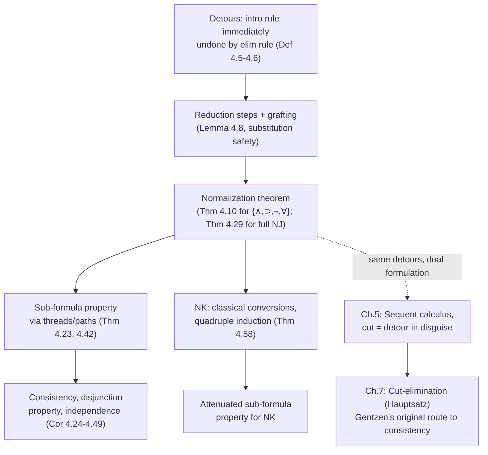

# Normalization of [[Natural-Deduction|Natural Deduction]]

[[book-guidelines|↩ Back to guidelines]]

## What actually makes a proof simple?

Suppose you already know $(A \wedge B) \supset A$ and $(C \supset D) \supset (\neg D \supset \neg C)$, and you want $\neg A \supset \neg (A \wedge B)$. The laziest path is to instantiate the second fact ($C := A \wedge B$, $D := A$) to get $((A\wedge B)\supset A) \supset (\neg A \supset \neg(A \wedge B))$, then feed it the first fact via $\supset\!\text{e}$. Two established results, one modus ponens, done — "no new thinking required," as the book puts it.

But look at what that construction actually contains. Building $((A\wedge B)\supset A) \supset(\neg A \supset \neg(A\wedge B))$ from scratch means, at some point, *introducing* the formula $(A\wedge B)\supset A$ with a $\supset\!\text{i}$ inference — and then the very next thing you do with the combined proof is treat that same formula as the major premise of a $\supset\!\text{e}$ inference and eliminate it. You built a formula you already had lying around, purely to tear it back down one step later. That round-trip is called a **detour**, and it is exactly what happens whenever an introduction rule's conclusion is immediately consumed by an elimination rule.

This matters because "detour-free" turns out to be a much sharper notion of proof simplicity than "short." The lazy reuse-of-lemmas proof above is actually *shorter* than a direct proof of the same conditional (eight inferences vs. four, in the book's example) — reuse can save steps even while introducing detours. Proof theorists since Gentzen have cared about directness, not brevity, because directness is what makes a proof's internal structure legible: a direct proof only ever talks about sub-formulas of what it starts and ends with. A detour temporarily drags in a formula — like $(A\wedge B)\supset A$ in the example — that has nothing to do with either the assumptions or the conclusion. If you've done any work with the Curry–Howard correspondence, this should already smell familiar: a detour *is* a beta-redex. An introduction rule builds a term the way a constructor does (`Pair::new`, `Ok(..)`, a closure literal); an elimination rule immediately following it (`.fst()`, `match`, function application) is exactly a destructor firing on a value you just built rather than on something opaque. Chapter 4 is the proof-theoretic half of the story whose type-theoretic half you already know as "beta-reduction terminates and produces a normal form."

The chapter's payoff is threefold, and each part is used constantly in later proof theory (and in anything that inspects proof/program terms mechanically):

1. **Normalization**: every deduction can be *transformed*, step by step, into a detour-free ("normal") one with the same conclusion and assumptions.
2. **The sub-formula property**: normal deductions only ever mention sub-formulas of their assumptions or conclusion — nothing extraneous ever appears.
3. **Corollaries for free**: consistency, the disjunction property, and several independence results all drop out of (1) and (2) almost mechanically.

## Detours, cuts, and grafting

The book first pins down the vocabulary precisely, since "detour" needs to be made syntactic before you can eliminate it algorithmically.

**Branch** (Def. 4.5): a sequence of formula occurrences $A_1, \dots, A_k$ in a deduction $\delta$ where $A_1$ is an assumption, $A_k$ is the end-formula, and each $A_i$ is a premise of an inference whose conclusion is $A_{i+1}$. Every deduction decomposes into some finite set of branches, one for each assumption occurrence.

**Cut** (Def. 4.6, informally called a "maximal formula" elsewhere in the literature): a formula occurrence that is *simultaneously* the conclusion of an introduction rule and the **major** premise of an elimination rule. The "major premise" qualifier is load-bearing: in

$$\dfrac{A \quad B}{\dfrac{A \wedge B \quad (A\wedge B)\supset C}{C}\ {\scriptstyle\supset\text{e}}}\ {\scriptstyle\wedge\text{i}}$$

$A \wedge B$ is introduced and then appears as the *minor* premise of $\supset\!\text{e}$ — not a cut, and (crucially) not obviously reducible. Only when the introduced formula is the thing being *eliminated* — the operand the elimination rule is actually breaking apart — is it a genuine, provably-removable detour. This is the same asymmetry Rust's type checker cares about between the scrutinee of a `match` and an unrelated argument sitting next to it: only the scrutinee's shape matters for reduction.

Every cut can be removed by a **reduction step** tailored to its main connective. For $\wedge$, discard the unused branch:

$$\dfrac{\dfrac{\delta_1 \;\; \delta_2}{A\quad B}}{\dfrac{A\wedge B}{A}\ {\scriptstyle\wedge\text{e}}}\ {\scriptstyle\wedge\text{i}} \quad\Longrightarrow\quad \delta_1$$

For $\supset$, splice the deduction of the argument into every place the discharged assumption was used:

$$\dfrac{\dfrac{[A]^1 \;\; \delta_1}{B}}{A\supset B}\ {\scriptstyle\supset\text{i}}^1 \qquad \delta_2 \; (\text{of } A) \qquad\Longrightarrow\qquad \delta_1[\delta_2/A]$$

For $\forall$, substitute the witnessing term for the eigenvariable throughout the sub-proof. In every case the mechanism is the *same* operation: replace an open assumption everywhere it occurs by a complete deduction of it. The book gives this operation a name and a lemma of its own because it is used constantly for the rest of the chapter:

> **Grafting.** If $\delta_1$ ends in $B$, then $\delta_2[\delta_1/B]$ is the result of replacing every open occurrence of assumption $B$ in $\delta_2$ (with a chosen discharge label) by the complete deduction $\delta_1$, renumbering discharge labels to keep them disjoint.

**Lemma 4.8** proves, by induction on the size of $\delta_1$, that grafting is *safe*: the result is a correct deduction, its open assumptions are exactly what you'd expect (those of $\delta_1$ minus the replaced one, plus those of $\delta_2$), and — provided $\delta_2$'s open assumptions avoid $\delta_1$'s eigenvariables — no eigenvariable condition is violated. This is precisely a **substitution lemma**: the same load-bearing plumbing that makes substitution sound in a typed lambda calculus (or in your compiler's elaborator, where substituting a solved metavariable's value into a context must not capture a bound variable or violate a scoping invariant). If you're building a checker where contexts get extended and later substituted back into open terms, Lemma 4.8 is the natural-deduction-flavored version of the lemma you will prove — and probably already miss an edge case of — for your own substitution operation.

One thing to notice immediately: grafting can be *dangerous*. Removing a detour on $A \supset B$ by grafting $\delta_2$ into $\delta_1$ can introduce a *brand new* detour, if the formula at the bottom of $\delta_1$ (now $B$, formerly discharged $A$'s sibling) happens itself to be introduced right where an elimination rule sits below it. The book works a concrete case where reducing a cut on $(C\supset D)\wedge B$ produces a fresh cut on $C \supset D$ — smaller, since it's a sub-formula of the original, but still a cut. This single observation is why the normalization proof can't just induct on "number of cuts": removing one cut can create another. It has to induct on something that's guaranteed to strictly decrease even when the *count* doesn't.

## The technique that makes it work: double induction

Ordinary induction proves $P(n)$ for all $n$ by handling $P(0)$ and then $P(n)$ assuming $P(n{-}1)$. **[[Induction-as-a-Proof-Method#Double induction|Double induction]]** proves $P(n,m)$ for all pairs by handling $P(0,0)$ and then $P(n,m)$ assuming $P(k,\ell)$ for every $\langle k,\ell\rangle$ *lexicographically* below $\langle n,m\rangle$ — i.e. $k<n$, or $k=n$ and $\ell<m$. It terminates for the same reason ordinary induction does: any strictly-decreasing sequence of pairs under this order must eventually bottom out at $\langle 0,0\rangle$, because within a fixed first coordinate the second coordinate can only fall finitely many times before the first coordinate has to drop.

The book first exercises this on a smaller problem — restricting the intuitionistic absurdity rule $\bot_J$ (from arbitrary conclusion $B$) to only atomic conclusions — using the measure $\langle n(\delta), m(\delta)\rangle$ where $n$ is the maximal degree of any $\bot_J$-conclusion and $m$ counts how many such maximal-degree applications there are. Reducing a topmost maximal-degree $\bot_J$ application either eliminates it outright or splits it into new $\bot_J$ applications of *strictly lower degree* — so $n$ drops, or $n$ stays and $m$ drops. Exactly the same lexicographic-decrease pattern reappears for the main normalization theorem, and then again (as a *quadruple*) for classical logic. If you've implemented a terminating structural-recursion checker, or a termination-measure synthesizer for a verifier, this is precisely the shape of argument you're producing mechanically: a well-founded lexicographic order over a tuple of syntactic measures, with each rewrite step provably decreasing it.

## Normalization for the {∧, ⊃, ¬, ∀} fragment

Restricting first to $\wedge, \supset, \neg, \forall$ (deferring $\vee$ and $\exists$, which complicate things — see below) lets the core argument appear cleanly.

Define the **cut degree** $d(\delta)$ as the maximum logical degree (count of connectives) among $\delta$'s cuts, and the **cut rank** $r(\delta)$ as how many cuts of that maximal degree $\delta$ has. Order deductions lexicographically by $\langle d(\delta), r(\delta)\rangle$; a deduction is normal exactly when $d(\delta)=r(\delta)=0$.

**Theorem 4.10.** Every deduction $\delta$ (in this fragment) of $A$ from $\Gamma$ reduces to a normal deduction $\delta^*$ of $A$ from (a subset of) $\Gamma$.

*Proof sketch.* Pick a **topmost, rightmost** cut of maximal degree $d(\delta)$ — one is guaranteed to exist because $\delta$ is a finite tree. Apply the appropriate reduction ($\wedge$, $\supset$, $\neg$, or $\forall$, as above). Case-by-case, you can show:

- any cuts *inside* the reduced sub-deductions were already of lower degree (else the chosen cut wouldn't have been topmost among maximal-degree ones),
- any *newly created* cut is on a proper sub-formula of the eliminated cut formula, hence strictly lower degree,
- so either the maximal degree strictly drops, or it stays the same and the count of maximal-degree cuts strictly drops.

Either way $\langle d(\delta^*), r(\delta^*)\rangle < \langle d(\delta), r(\delta)\rangle$, and the double-induction hypothesis finishes the job. $\blacksquare$

This is the textbook proof-theoretic analogue of proving that beta-reduction is strongly normalizing by a reducibility/degree argument — you're not tracking redex *count* (which can go up), you're tracking a measure engineered to strictly decrease regardless.

## Weak vs. strong normalization

Two different claims are conflated in casual talk about "normalizing a proof," and the book is careful to separate them:

- A **normal form theorem** just asserts *existence*: if $A$ has a deduction from $\Gamma$, it has *some* normal deduction from $\Gamma$. This can be proved non-constructively (even model-theoretically) without ever exhibiting the transformation.
- A **normalization theorem** — what Theorem 4.10 actually proves — gives a *constructive rewriting procedure*: start from any given deduction and transform it, one reduction at a time, into a normal one. This is strictly more informative: it lets you relate proof-complexity measures across the transformation, something an existence proof can't do.
- **Weak normalization** means: *some* strategy of applying reductions (e.g., "always reduce the topmost-rightmost maximal cut") terminates in a normal form. **Strong normalization** means: *every* strategy terminates — you cannot get stuck in an infinite reduction sequence no matter which order you pick.

Theorem 4.10's proof only establishes weak normalization: it prescribes a specific order (topmost-rightmost, maximal-degree-first). The stronger claim — **Theorem 4.32 (Prawitz 1971)**: *there are no infinite conversion sequences at all, for any strategy* — is stated but its proof is (deliberately) out of scope for an introductory text.

If you've studied the simply-typed lambda calculus, this split is exactly weak vs. strong normalization of beta-reduction, and the connection isn't just an analogy — it's the Curry–Howard correspondence made explicit, which the book flags directly (citing Sørensen–Urzyczyn and Wadler on programming-language applications). This distinction is the one your kernel design actually has to care about: a type-checker that reduces terms to weak-head normal form using *some fixed* evaluation order only needs weak normalization of that order to guarantee termination; but if your elaborator ever needs to reduce under binders in an order it doesn't fully control (e.g., because unification triggers reduction at arbitrary points chosen by a solver), you need the strong result to be safe against getting stuck. Lean's kernel sidesteps needing the general strong-normalization theorem by using a *specific*, engineered reduction strategy (whnf plus definitional unfolding under a well-founded fuel/structural argument) — which is the "weak normalization along a chosen strategy" side of this exact distinction.

## Full NJ: cut segments and permutation conversions

Adding $\vee$ and $\exists$ back in breaks the clean picture, because their elimination rules ($\vee\text{e}$, $\exists\text{e}$) can pass a formula through **unchanged** on the way to the conclusion:

$$\dfrac{B\vee C \qquad [B]\;\delta_2\; D \qquad [C]\;\delta_3\;D}{D}\ {\scriptstyle\vee\text{e}}$$

If $D$ here also happens to be a formula introduced earlier and then eliminated further down, the "detour" isn't a single formula occurrence anymore — it's a **chain**: introduce $D$, thread it through one or more $\vee\text{e}$/$\exists\text{e}$ minor-premise slots (where it survives unchanged as *both* minor premise and conclusion), and *then* hit an elimination rule. This generalized detour is a **cut segment** (Def. 4.26): a sequence $A_1, \dots, A_n$ where $A_1$ is the conclusion of an i-rule (or $\bot_J$), each $A_i$ is a $\vee\text{e}$/$\exists\text{e}$ minor premise whose conclusion is $A_{i+1}$, and $A_n$ is the major premise of an e-rule. Length-1 segments are exactly the old notion of cut.

Two flavors of conversion now do the work:

- **Simplification conversions**: if a $\vee\text{e}$ or $\exists\text{e}$'s discharged assumption isn't actually used in the corresponding sub-deduction, just discard the disjunction/existential entirely and keep the relevant branch.
- **Permutation conversions**: the real novelty. Push the *outer* elimination rule **upward**, past the $\vee\text{e}$/$\exists\text{e}$, so it applies directly to each minor premise instead of to the shared conclusion:

$$\dfrac{B\vee C \quad [B]\; A \quad [C]\; A}{\dfrac{A}{C}\ {\scriptstyle\star\text{e}}}\ {\scriptstyle\vee\text{e}} \quad\Longrightarrow\quad \dfrac{B\vee C \quad \dfrac{[B]\;A}{C}\ {\scriptstyle\star\text{e}} \quad \dfrac{[C]\;A}{C}\ {\scriptstyle\star\text{e}}}{C}\ {\scriptstyle\vee\text{e}}$$

This is *exactly* the commuting-conversion you'd write for a `match` expression whose result is immediately consumed: instead of `f(match x { P1 => e1, P2 => e2 })`, you distribute the outer call into each arm, `match x { P1 => f(e1), P2 => f(e2) }`. Compilers do this transformation routinely (it's a standard A-normal-form / CPS-conversion move), and Lean's kernel performs the analogous "iota-reduction commuting with projections" step when reducing terms built from `casesOn`. The permutation conversion *shortens* the cut segment by one (it doesn't remove it outright — the eliminated rule now sits above the $\vee\text{e}$, so a shorter chain of the same cut-formula persists), which is why the induction measure has to change too: the rank $r^*(\delta)$ becomes the *sum of lengths* of maximal-degree cut segments, not just their count.

Picking *which* segment to reduce first also needs more care than "topmost rightmost": the book defines a **highest cut segment** (Def. 4.27) as one of maximal degree, with no maximal-degree segment ending above its start, and whose "downstream" minor premises (if the segment ends by feeding an e-rule with side branches) don't themselves sit on another maximal segment. Proposition 4.28 shows such a segment always exists by a finite search process — essentially "keep climbing past interfering segments; the deduction is finite, so you terminate." With this refined machinery, **Theorem 4.29** re-proves normalization for the whole of NJ, again by double induction on $\langle d(\delta), r^*(\delta)\rangle$.

The book's worked example (Section 4.7 — deducing $A\supset C$ from $(A\supset C)\vee(B\supset C)$ and $A\supset B$) is worth internalizing precisely because it shows the "reduce a cut, get shorter but *more numerous* segments" phenomenon in miniature: an initial deduction with $d=5,r^*=1$ first reduces to $d=3, r^*=4$ (more, shorter cuts, after a detour conversion exposes a second copy of a permutation-eligible cut segment), before permutation conversions bring the rank down to $2$, then $1$, then $0$. The measure genuinely can look like it's getting worse by a naive count before it resolves — which is the entire reason the induction is on the engineered lexicographic pair, not on segment count.

## The sub-formula property: threads and paths

This is the theorem that makes normal deductions worth having, and it's proved by tracking two different notions of "a line through the proof."

**Threads** (the {∧,⊃,¬,∀}-only version, Def. 4.15, then generalized in Def. 4.33 for full NJ) are initial segments of branches that stop the moment they hit the minor premise of an elimination rule. **Proposition 4.16/4.34** shows that in a *normal* deduction every thread splits cleanly into three consecutive zones:

1. an **e-part**, where each formula is the major premise of an elimination rule (so each is a sub-formula of the one before it — elimination rules only ever strip structure off),
2. a single **minimum formula** — the pivot, at the boundary,
3. an **i-part**, where each formula is a premise of an introduction rule feeding the next (so each is a sub-formula of the one *after* it — introduction rules only ever add structure that's already implicit in the premises).

This three-zone shape is only guaranteed *because* the deduction is normal: a cut would be exactly a violation of "e-part strictly before i-part" — an introduced formula immediately being eliminated, i.e., the i-part bleeding back into an e-part. No cuts, no bleeding, and the thread necessarily monotonically strips (e-part) then monotonically builds (i-part), so anything on it is a sub-formula either of the assumption starting the thread or of the formula ending it.

Once every formula is shown to lie on *some* thread (Prop. 4.17/4.38 — straightforward induction on deduction size), the only gap left is: threads don't all end at the end-formula, and don't all start at an *open* assumption — some end at a minor premise of $\supset\!\text{e}/\neg\text{e}$, and some start at an assumption *discharged* elsewhere. The book closes this gap with an **order** assigned to threads (Def. 4.39): order 0 for threads ending at the end-formula, order $n{+}1$ for a thread ending at a minor premise whose major premise sits on an order-$n$ thread. A short induction on this order (Lemma 4.40, 4.41, culminating in **Theorem 4.42**) shows every formula, transitively, bottoms out as a sub-formula of the end-formula or of an open assumption — however many minor-premise hops it takes to get there.

For full NJ, $\vee\text{e}$ and $\exists\text{e}$ break the "each formula is a sub-formula of its neighbor" property outright (their conclusion need not be a sub-formula of their major premise — it's copied straight from the minor premises instead). The fix is the **path** (Def. 4.35): instead of always stepping premise→conclusion, a path is allowed to jump from the major premise of $\vee\text{e}$/$\exists\text{e}$ *sideways*, to the assumption it discharges in one of the minor-premise sub-deductions. Grouping consecutive minor-premise/conclusion pairs into a **segment** recovers the same three-zone shape (e-segments, a minimum segment, i-segments — Prop. 4.36), and the same order-based induction (Def. 4.39 generalized) delivers **Theorem 4.42**: every formula in a normal NJ-deduction of $A$ from $\Gamma$ is a sub-formula of $A$ or of a formula in $\Gamma$.

**Theorem 4.23 / 4.42 (Sub-formula property).** Normal deductions never contain a formula that isn't a sub-formula of the conclusion or an assumption.

Why this matters beyond aesthetics: the sub-formula property is exactly what makes *bounded* proof search possible — if you're searching for a proof of $A$ from $\Gamma$, you only ever need to consider the (finite) set of sub-formulas of $A$ and $\Gamma$, never anything conjured out of nowhere. This is the proof-theoretic ancestor of why tableaux-style and sequent-calculus decision procedures can terminate on decidable fragments, and it's the same intuition that makes SMT-style clause learning restrict itself to sub-terms of the original problem rather than an unbounded universe of formulas.

## Corollaries: consistency, the disjunction property, independence

With normalization and the sub-formula property both in hand, several deep-looking results become almost bookkeeping:

- **Consistency (Cor. 4.24, 4.43, 4.45).** If NM/NJ were inconsistent, there'd be a deduction of $\bot$ from *no* assumptions, hence (by normalization) a *normal* one. But by the sub-formula property, every formula in it would have to be a sub-formula of $\bot$ — and the only sub-formula of $\bot$ is $\bot$ itself. So the deduction could contain no introduction rule (nothing introduces $\bot$) and no elimination rule (nothing eliminates $\bot$ as a major premise) — it would have to be empty, which is impossible for a proof of $\bot$ from nothing. Contradiction; hence no such deduction exists.
- **The disjunction property (Cor. 4.46).** If NJ (or NM) proves $A \vee B$ outright (no open assumptions), then NJ proves $A$ or NJ proves $B$. Proof: take the normal deduction of $A \vee B$; by the segment-structure proposition it must end in $\vee\text{i}$ or $\bot_J$, and $\bot_J$ is ruled out (it discharges nothing, and a $\bot_J$-headed proof from no assumptions would again be a proof of $\bot$, contradicting consistency). So it ends in $\vee\text{i}$, and the sub-deduction feeding that inference is already a proof of $A$ or of $B$.
- **Independence results (Cor. 4.47, 4.49).** NJ does *not* prove $A \vee \neg A$ for all $A$ (excluded middle genuinely fails intuitionistically — if it held, the disjunction property would force NJ to prove $p$ or $\neg p$ for an atomic $p$, both of which lead to contradictions via consistency). Symmetrically, NM (natural deduction *without* $\bot_J$/ex-falso at all) doesn't prove $(A\wedge\neg A)\supset B$ — a normal proof of $B$ from $A,\neg A$ would need $B$ atomic and minimal on some path, but the only thing an elimination rule can conclude from $A$ and $\neg A$ together is $\bot$, not an arbitrary atomic $B$.

Each of these is a *syntactic*, fully constructive proof — no models, no semantics, just "normal deductions have a restricted shape, and $\bot$'s shape is too restricted to be inhabited from nothing." If you've encountered **canonicity** in dependent type theory — the theorem that every closed, well-typed term of an inductive type reduces to a constructor application (every closed `Nat` reduces to a numeral; every closed `Bool` reduces to `true` or `false`) — you're looking at the exact same argument shape one level up: canonicity is normalization plus a "shape restriction on normal forms of this type" argument, and the disjunction property above is literally the propositions-as-types instance of canonicity for the `Or`/sum type. A kernel that can't prove strong normalization for its reduction relation can't prove canonicity either — and without canonicity, "closed proof of `False`" can't be ruled out by inspection the way it is here.

## Classical logic resists: NK's extra conversions

Everything so far is intuitionistic (NJ/NM). Classical logic's extra rule, $\bot_K$ (discharging $\neg A$ to conclude $A$ from $\bot$), breaks the clean story, and *why* it breaks is genuinely illuminating.

Naively trying the same fix used for $\bot_J$ fails outright: if $\bot_K$ discharges $\neg(B\wedge C)$ to conclude $B \wedge C$, and that's immediately eliminated by $\wedge\text{e}$ to get $B$, you cannot simply "point the $\bot_K$ at $B$ instead" — the assumption being discharged below still says $\neg(B\wedge C)$, and everything hanging off that assumption elsewhere in the proof depends on its exact shape. You have to replace the *assumption itself* by a deduction that manufactures $\neg(B\wedge C)$ from a differently-shaped hypothesis $\neg B$. **Statman (1974)** proposed exactly this:

$$\dfrac{[\neg(B\wedge C)] \quad \delta}{\dfrac{\bot}{B\wedge C}\ {\scriptstyle\bot_K}} \;\Longrightarrow\; \dfrac{\left(\dfrac{[B\wedge C]}{\dfrac{B}{\bot}\ {\scriptstyle\neg\text{e}}}\right) \; [\neg B]}{\dfrac{\neg(B\wedge C)}{\bot} \; \delta}{\dfrac{}{B}\ {\scriptstyle\bot_K}}$$

But this can *introduce a new cut of higher degree than the one you just removed* — the discharged assumption $\neg(B\wedge C)$ is now the *conclusion* of a $\neg\text{i}$ inference rather than a bare assumption, and if something below eliminates it, that's a fresh detour, potentially bigger than the one you started with. Worse, for a $\vee$-headed cut the replacement can introduce a cut on a formula ($D$, the shared conclusion of the surrounding $\vee\text{e}$) with **no syntactic relationship at all** to the original cut formula — it can be of arbitrarily higher degree. The naive fix doesn't just fail to strictly decrease the measure; it can point the wrong direction entirely.

The book follows **Andou's (1995)** repair. Two normalizing preprocessing steps first put deductions into a canonical shape: every $\bot_K$ actually discharges something (else replace it with the harmless $\bot_J$), and every discharged $\neg A$ ("$\bot_K$-assumption") is arranged to be the major premise of a $\neg\text{e}$ inference. With that shape guaranteed, the **classical conversions** replace not just an assumption but the *entire sub-deduction* feeding each occurrence of the $\bot_K$-assumption — different occurrences can get different replacement sub-deductions, since the point is to push the *specific* elimination context ($\star\text{e}$ applied where $\neg A$'s $\neg\text{e}$ partner used to sit) up into the position the $\bot_K$ vacates. The generalized notion of "cut" now includes $\bot_K$-conclusions as detourable, and "segment" includes chains through both $\vee\text{e}$/$\exists\text{e}$ *and* through $\bot_K$-discharged $\neg\text{e}$ pairs.

To make the induction close, the book needs **four** measures, not two: cut degree $d(\delta)$, cut rank $r(\delta)$ (now: the *longest* segment at maximal degree, not merely a count), $s(\delta)$ (how many segments achieve that maximal rank), and $h(\delta)$ (the sum of *heights* — depth-below-root — of those maximal segments). **Theorem 4.58** proves normalization for NK by induction on the resulting quadruple $\langle d,r,s,h\rangle$ under lexicographic order — literally the double-induction principle from Section 4.2, run one level deeper, because a single scalar measure (or even a pair) genuinely isn't fine-grained enough to guarantee every classical conversion strictly decreases something.

The payoff is only an **attenuated** sub-formula property (end of Section 4.9): every formula in a normal NK-deduction is a sub-formula of the end-formula or an open assumption, *or*, if the formula has the form $\neg B$, then $B$ itself is such a sub-formula. That "or" is the permanent scar classical logic leaves on the theorem — $\bot_K$ can legitimately introduce negated formulas that aren't themselves sub-formulas of anything in sight, only their un-negated core is guaranteed to be traceable.

This is worth pausing on if you know the **Curry–Howard correspondent of classical logic**: $\bot_K$ (and $\neg\neg A \supset A$, which it's equivalent to) corresponds under the extended correspondence to **control operators** — `call/cc`, exceptions, first-class continuations (Griffin's theorem). The reason NK's normalization needs an entire extra apparatus — replacing whole sub-deductions rather than single assumptions, needing a fourth induction measure — is the proof-theoretic shadow of exactly why adding `call/cc` or exception handlers to a language with a clean operational semantics is notoriously harder to reason about than the purely functional core: control effects don't respect the tidy "eliminate what you just built, locally" discipline that makes intuitionistic reduction so well-behaved. If your compiler's IR ever needs a classical-logic-flavored feature (backtracking search, early-exit continuations, abductive "assume this counterexample doesn't exist" reasoning for your CSP kernel), expect the same kind of measure-engineering headache Andou had to solve here.

## Where this leads

Inside the book, this chapter is the natural-deduction rehearsal for the sequent-calculus cut-elimination theorem (Chapter 7): the cut rule in LK/LJ/LM is the sequent-calculus formalization of exactly the same "introduced-then-immediately-consumed" phenomenon, and the double-(then quadruple-)induction technique reappears essentially unchanged. The consistency and sub-formula-property payoffs here are the blueprint for the more general Hauptsatz consequences in Chapter 8.

For the compiler/elaborator project this vault is ultimately in service of, three things here are directly load-bearing, not just analogous:

- **Normalization is definitional equality's engine.** The reduction relation you build for detours (introduction immediately consumed by elimination) is precisely the beta/iota-reduction relation a kernel's `whnf`/`isDefEq` implements. The weak-vs-strong distinction is the exact question you must answer before trusting *any* fixed evaluation strategy in your type-checker: is your chosen strategy merely *a* terminating one, or does termination hold no matter what order unification forces reductions in?
- **The sub-formula property is why proof search and elaboration can be bounded.** Any proof-search or unification procedure that wants a decidable or complexity-bounded search space needs an analogue of this theorem for its own proof system — it's the reason your metavariable-resolution and CSP components can restrict attention to a finite universe of relevant terms instead of an unbounded one.
- **The disjunction property is a special case of canonicity**, the property your trusted kernel absolutely needs: every closed term of an inductive type must reduce to a constructor form. Get normalization wrong (non-terminating reduction, or a classical-flavored primitive added without Andou-style care) and canonicity — hence the soundness of your entire verification pipeline — is what silently breaks.
