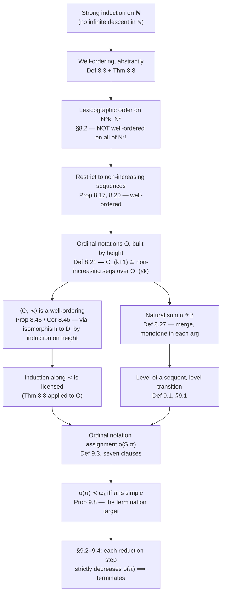

# Ordinal Notations up to $\varepsilon_0$

[[book-guidelines|↩ Back to guidelines]]

## Why you need more than $\mathbb{N}$

Gentzen's consistency proof for Peano arithmetic (Chapters 7 and 9) is, structurally, a termination argument: it repeatedly rewrites a proof — eliminating a suitable induction, a weakening, a suitable complex cut — and needs to show that this rewriting process cannot go on forever. That is exactly the shape of problem you already know how to solve: assign each state a value in some well-founded order, show every rewrite strictly decreases it, done. The catch is that ordinary induction on $\mathbb{N}$ is not a strong enough measure. Reducing a single complex cut can *increase* the number of inferences in a proof — sometimes drastically, since the cut gets pushed past the two subproofs on either side and duplicated (this is exactly the same "detours can grow the proof" phenomenon you saw in normalization, §4.5). A proof-size measure valued in $\mathbb{N}$ would go up on some steps, and you'd have no contradiction to derive from an infinite reduction sequence.

What you need is a measure valued in an order rich enough to encode "the number of remaining cuts of degree $n$" as more significant than any change to "the number of remaining cuts of degree $< n$" — no matter how much the latter count grows, it never outweighs the former going down. That is precisely what a transfinite ordinal buys you: $\omega \cdot 2 + 5$ beats $\omega \cdot 1 + 1{,}000{,}000$. But the book is explicit about *not* wanting to import full-blown set-theoretic ordinals for this (§8.3, and reiterated at the end of §8.5): Hilbert's program, and Gentzen's rehabilitation of it, is committed to *finitary* metamathematics. If the consistency proof of arithmetic secretly depended on the axiom of choice or the cumulative hierarchy, it would prove far less than advertised — you'd be reducing the consistency of arithmetic to the consistency of a system at least as strong (naive set theory), which is circular in exactly the way Hilbert needed to avoid.

The resolution is what this topic builds: **ordinal notations**, a purely combinatorial, finitary object — a certain set of finite strings of symbols with an ordering — that turns out to be order-isomorphic to the ordinals below $\varepsilon_0$, without ever mentioning a set, a von Neumann ordinal, or a transfinite object of any kind. You get all the well-ordering power you need, built from syntax alone.

*What breaks without this*: if you tried to run the consistency proof using only the natural numbers as your termination measure, you'd be stuck the moment a single reduction step could increase proof size — which happens routinely for the cut-reduction step here (§9.2–9.4, downstream of this topic). You'd have no way to see the "decrease" that must exist for the whole procedure to terminate.

## Well-orderings: the abstract engine behind induction

The book starts from something you already accept as valid — strong induction on $\mathbb{N}$ — and strips it down to the property that actually makes it work. Strong induction says: if $P(0)$ and $P(n)$ follows whenever $P(m)$ holds for all $m<n$, then $P(n)$ holds for all $n$. Why does this work? Not because of anything special about numbers — it works because there is no infinite *descending* sequence $m_1 > m_2 > m_3 > \cdots$ of natural numbers. If $P$ failed somewhere, you could keep finding smaller and smaller counterexamples forever, which is impossible; contradiction. Definition 8.3 names this property directly:

> **Definition 8.3.** A well-ordering $<$ of $X$ is a relation which is a strict linear ordering of $X$ (Definition 8.2: transitive, asymmetric, total) and which has the property that every non-empty subset $Y \subseteq X$ has a least element under $<$.

And Theorem 8.8 generalizes strong induction verbatim to *any* well-ordering, not just $\langle \mathbb{N}, < \rangle$:

> **Theorem 8.8 (Induction along well-orderings).** Suppose $\langle X, < \rangle$ is a well-ordering, and $P$ a property of elements of $X$. If for every $x \in X$, $P(x)$ holds whenever $P(y)$ holds for all $y < x$ — call this condition $I(P,x)$ — then $P(x)$ holds for all $x \in X$.

The proof is the same contrapositive argument you already know: if $P$ failed somewhere, $\{y : P(y) \text{ is false}\}$ would be non-empty, hence (by well-ordering) would have a least element $x_1$; but then $I(P,x_1)$ is violated, since $P(y)$ holds vacuously-or-actually for all $y<x_1$ yet $P(x_1)$ fails. No properties of $\mathbb{N}$ were used — only well-orderedness.

This is the load-bearing abstraction: **"well-ordered" is the exact and only property a termination measure's codomain needs.** Once you have a well-ordering $\langle X, < \rangle$, you get induction (and, dually, guaranteed termination of any process that strictly decreases in $X$) for free, regardless of how exotic $X$ is. The rest of this topic is entirely about constructing one particular, unusually rich well-ordering $\langle O, \prec \rangle$ out of nothing but syntax.

**Order isomorphism** (Definition 8.9) is the tool that lets you transport well-orderedness between sets: a bijection $f: X \to Y$ that also preserves order ($x < y \iff f(x) <' f(y)$) is an order isomorphism, and Proposition 8.10 shows that if $\langle X,<\rangle$ is well-ordered and $f$ is an order isomorphism onto $\langle Y, <'\rangle$, then $Y$ is well-ordered too. This is the workhorse used repeatedly below: instead of proving a complicated ordering is well-founded from scratch, you exhibit an order isomorphism to something already known to be well-founded.

**Rust grounding.** A well-ordering is precisely what Rust's `Ord` trait *tries* to model when you use it for a termination argument (e.g., a decreasing loop variant), except `Ord` alone gives you a total order, not well-foundedness — Rust's type system cannot check "no infinite descending chain" for you; that's a proof obligation you carry externally. This is the same gap a refinement-type checker needs to close: a `decreases` clause on a recursive function is a claim that some expression's value, under some declared well-founded relation, strictly decreases on each call — exactly Theorem 8.8's hypothesis, checked syntactically instead of taken on faith.

```rust
/// A termination measure is only sound if `Measure` is well-founded under `Ord`.
/// Rust's derived `Ord` gives you totality; well-foundedness is a proof obligation
/// the verifier must discharge separately (this is exactly what §8.5 does for
/// ordinal notations).
trait TerminationMeasure: Ord + Clone {}
```

## Lexicographic orderings: well-founding sequences

Before defining ordinal notations, the book builds the piece of machinery that makes them well-ordered: orderings on *sequences*. This is motivated by something you've already used without naming it as such — **[[Induction-as-a-Proof-Method#Double induction|double induction]]** (§4.2, §6.2). Double induction on $\langle n, m \rangle$ pairs is induction along the **lexicographical ordering** on $\mathbb{N}^2$:

$$\langle k, \ell \rangle \prec_{lex} \langle n, m \rangle \iff k < n, \text{ or } (k = n \text{ and } \ell < m).$$

This generalizes to $\mathbb{N}^k$ (Definition 8.13: compare position by position, first difference decides) and, with more care, to $\mathbb{N}^*$ — sequences of *arbitrary, varying* length:

> $s \prec_{lex} t$ iff either (a) $s$ is a proper initial segment of $t$, or (b) at the first position where $s$ and $t$ disagree, $s$'s entry is smaller.

Here's the trap, and it is exactly the kind of trap that separates "looks like an order" from "actually well-founded": $\langle \mathbb{N}^*, \prec_{lex}\rangle$ is a genuine linear order, but it is **not** a well-order. The book exhibits the counterexample directly (§8.2):

$$\langle 1 \rangle \succ_{lex} \langle 0,1 \rangle \succ_{lex} \langle 0,0,1 \rangle \succ_{lex} \langle 0,0,0,1 \rangle \succ_{lex} \cdots$$

— an infinite descending chain, because you can always insert one more leading $0$. Lexicographic order alone is not the source of well-foundedness; something else has to constrain the sequences. Two fixes appear:

1. **Short-lex** ($\prec_{slex}$): sort by length first, and only break ties lexicographically. `Problem 8.16` asks you to check that $\langle \mathbb{N}^*, \prec_{slex} \rangle$ *is* well-ordered — length is bounded below by $0$ and can only take finitely many values below any bound, which blocks the "insert a longer prefix" trick entirely.
2. **Restrict to decreasing/non-increasing sequences**, keep plain $\prec_{lex}$: if $\langle X, < \rangle$ is well-ordered, then the set $X_>^*$ of *strictly decreasing* finite sequences of elements of $X$ is well-ordered by $\prec_{lex}$ (Proposition 8.17), and — with an extra layer of argument via "constant sequences" $X_=^*$ (Prop 8.18) — so is the set $X_\geq^*$ of **non-increasing** sequences (Proposition 8.20). The counterexample above fails this hypothesis: $\langle 1 \rangle, \langle 0,1\rangle, \langle 0,0,1\rangle, \ldots$ are not non-increasing sequences (each one *ends* in an entry larger than its predecessors), so they never qualify.

Proposition 8.20's proof is a clean instance of the order-isomorphism technique: it shows $X_\geq^*$ is order-isomorphic to the set of *strictly decreasing* sequences of the *constant-sequence* set $X_=^*$, which is well-ordered by Proposition 8.17 applied one level up. This "well-orderedness transported through an isomorphism to sequences-of-sequences" pattern is exactly the induction-on-height machine used to build $O$ in the next section — you should recognize it when it recurs.

**What breaks without the non-increasing constraint**: nothing in the definition of "sum of powers of $\omega$" *forces* non-increasing exponents by itself; it's a side-condition the book bakes into the definition of ordinal notation (clause (iii) below) precisely because it's the thing that keeps the construction inside the well-founded fragment $X_\geq^*$ rather than the pathological $X^*$.

## Ordinal notations, built by height

Now the actual object. An **ordinal notation** is a finite string built from `0` and `ω`, using sum and (a restricted form of) exponentiation — nothing else. For example, $\boldsymbol{\omega}^{\boldsymbol{\omega}^0}$, $\boldsymbol{\omega}^{\boldsymbol{\omega}^0+\boldsymbol{\omega}^0}+\boldsymbol{\omega}^0$, and $0$ are ordinal notations; $\boldsymbol{\omega}$ (bare, no exponent) and $\boldsymbol{\omega}^0 + 0$ are *not* — legality is defined jointly with the ordering, by simultaneous induction on a stratification the book calls **height**.

> **Definition 8.21 (Ordinal notations $< \varepsilon_0$).**
> 1. *Basis*: $0$ is the only ordinal notation of height $0$; $O_{=0} = O_{\leq 0} = \{0\}$, and $\prec_0 = \emptyset$.
> 2. *Inductive step*: given $O_{=k}, O_{\leq k}, \prec_k$, the notations of height $k+1$ are all expressions
> $$\boldsymbol{\omega}^{\alpha_1} + \boldsymbol{\omega}^{\alpha_2} + \cdots + \boldsymbol{\omega}^{\alpha_n}$$
> where (i) $\alpha_1 \in O_{=k}$ (the *leading* exponent is exactly at the previous height — this is what makes height well-defined and unique), (ii) every other $\alpha_i \in O_{\leq k}$, and (iii) $\alpha_i \succeq_k \alpha_{i+1}$ (non-increasing exponents — the constraint from §8.2, now load-bearing).
>
> The ordering $\prec_{k+1}$ extends $\prec_k$: everything of height $k{+}1$ beats everything of height $\leq k$; between two notations of height $k{+}1$, compare the exponent sequences **lexicographically** using $\prec_k$, with a shorter sum beating a longer one that agrees on a shared prefix (i.e., $O_{=k+1}$ is literally $\langle (O_{\leq k})_\geq^*, \prec_{lex}\rangle$ in disguise — a non-increasing sequence of previous-height notations, dressed up in "$\boldsymbol{\omega}^{(\cdot)}+\cdots$" notation).
>
> Finally $O = \bigcup_k O_{\leq k}$, $\prec = \bigcup_k \prec_k$.

Every non-zero ordinal notation therefore has a *uniquely determined* height, visible directly in the string as the number of nested $\boldsymbol{\omega}$'s on the leftmost spine — $\boldsymbol{\omega}^0 + \cdots$ is height 1, $\boldsymbol{\omega}^{\boldsymbol{\omega}^0+\cdots}+\cdots$ is height 2, and so on. Writing $1 := \boldsymbol{\omega}^0$ as an abbreviation, examples given in the text include $0,\ 1,\ 1+1,\ \boldsymbol{\omega}^{1+1},\ \boldsymbol{\omega}^{1+1}+1,\ \boldsymbol{\omega}^{\boldsymbol{\omega}^{1+1}+1}+\boldsymbol{\omega}^{1+1}+1$.

The abbreviated (Cantor-normal-form-like) presentation groups repeated exponents:

> **Definition 8.28.** For distinct $\gamma_1 \succ \cdots \succ \gamma_k$ and $c_1,\ldots,c_k \geq 0$: $\boldsymbol{\omega}^{\gamma_1}\cdot c_1 + \cdots + \boldsymbol{\omega}^{\gamma_k}\cdot c_k$ abbreviates the sum with $c_i$ literal copies of $\boldsymbol{\omega}^{\gamma_i}$ (or $0$ if every $c_i=0$).

and Definition 8.39 defines the **tower function**, an $n$-fold self-exponentiation used later to state how much an ordinal notation can grow in one step:

$$\omega_0(\alpha) = \alpha, \qquad \omega_{n+1}(\alpha) = \boldsymbol{\omega}^{\omega_n(\alpha)}.$$

**Why "combinatorial" is the right word, and why this is not cheating**: notice that nowhere in Definition 8.21 does a set, a cardinal, or an infinite object appear. $O$ is a set of *finite strings*, defined by an ordinary induction on a natural-number-valued stratification (height), exactly like how you'd define, say, well-formed formulas by induction on parse-tree depth. The name "ordinal notation" and the symbol $\boldsymbol{\omega}$ are suggestive of the connection to [[Transfinite-Ordinals|transfinite ordinals]] (made precise later in §8.6–8.8, outside this topic's scope), but the object and its ordering are fully specified without that connection. This is the finitary content that lets Gentzen's proof stay inside the boundaries Hilbert's program allows.

**Rust grounding — this is a data structure you'd actually write.** The Cantor-normal-form abbreviation (Definition 8.28) is the natural representation:

```rust
/// An ordinal notation < ε₀, in Cantor-normal-form shape:
/// ω^γ₁·c₁ + ω^γ₂·c₂ + ... with γ₁ ≻ γ₂ ≻ ... ≻ γₖ (strictly decreasing, no ties —
/// ties are folded into the coefficient) and every cᵢ ≥ 1.
/// The empty vector represents 0.
#[derive(Clone, PartialEq, Eq)]
struct OrdNotation(Vec<(OrdNotation, u64)>); // (exponent, coefficient), strictly ω-descending

impl PartialOrd for OrdNotation {
    fn partial_cmp(&self, other: &Self) -> Option<std::cmp::Ordering> {
        Some(self.cmp(other))
    }
}
impl Ord for OrdNotation {
    fn cmp(&self, other: &Self) -> std::cmp::Ordering {
        // Proposition 8.25 / 8.31: compare term-by-term; first differing
        // exponent decides, and if all shared exponents agree, the
        // shorter (lower-degree) sum is smaller. This is *exactly* what
        // the derived lexicographic Ord on Vec<(K, V)> gives you for free —
        // provided K's own Ord is itself well-founded, which is the
        // induction hypothesis at the next height down.
        self.0.cmp(&other.0)
    }
}
```

The comment is not incidental: Rust's derived (or manually implemented, as above) lexicographic ordering on `Vec<(K, V)>` is *definitionally* the lexicographic order the book proves ($\S$8.5, Proposition 8.25) is equivalent to $\prec$. The recursion is the same recursion as height: `OrdNotation`'s `Ord` impl calls into `OrdNotation`'s own `Ord` impl one level down in the exponent — soundness of the whole comparator rests on that recursion bottoming out, i.e., on the height stratification being well-founded, which is precisely Proposition 8.45 below.

## The natural sum: combining measures without collapsing information

Ordinal notations need an addition operation for the same reason two independent termination arguments (e.g., "outer loop count" and "inner loop count," or "degree of a cut" and "rank of a cut," recall Chapter 6's double induction) need to be combined into a single measure without one silently swallowing the other. The book's answer is the **natural sum** $\alpha \# \beta$ (also called the Hessenberg sum in the ordinal-arithmetic literature, though the book doesn't need that name):

> **Definition 8.27.** $0 \# \beta = \beta$, $\alpha \# 0 = \alpha$, and otherwise, writing $\alpha = \boldsymbol{\omega}^{\alpha_1}+\cdots+\boldsymbol{\omega}^{\alpha_n}$ and $\beta = \boldsymbol{\omega}^{\beta_1}+\cdots+\boldsymbol{\omega}^{\beta_m}$: merge the two exponent multisets $\{\alpha_i\} \cup \{\beta_j\}$ into a single non-increasing sequence $\gamma_1 \succeq \cdots \succeq \gamma_{n+m}$, and set $\alpha \# \beta = \boldsymbol{\omega}^{\gamma_1}+\cdots+\boldsymbol{\omega}^{\gamma_{n+m}}$.

In the Definition 8.28 abbreviated form this is just **coefficientwise addition on matching exponents**: if $\alpha = \boldsymbol{\omega}^{\gamma_1}\cdot a_1 + \cdots + \boldsymbol{\omega}^{\gamma_k}\cdot a_k$ and $\beta = \boldsymbol{\omega}^{\gamma_1}\cdot b_1 + \cdots + \boldsymbol{\omega}^{\gamma_k}\cdot b_k$ (padding with zero coefficients as needed so both sums range over the same $\gamma_i$'s), then

$$\alpha \# \beta = \boldsymbol{\omega}^{\gamma_1}\cdot(a_1+b_1) + \cdots + \boldsymbol{\omega}^{\gamma_k}\cdot(a_k+b_k) \qquad \text{(Proposition 8.29).}$$

This is a **merge**, structurally identical to merging two sorted association lists by key — which is exactly how you'd implement it:

```rust
/// Natural sum: merge two Cantor-normal-form notations, adding coefficients
/// on shared exponents. Structurally a sorted-merge, O(k) in the number
/// of distinct exponents — no recursion into the exponents themselves needed,
/// because addition happens only at matching keys.
fn natural_sum(a: &OrdNotation, b: &OrdNotation) -> OrdNotation {
    let mut result = Vec::new();
    let (mut i, mut j) = (0, 0);
    while i < a.0.len() && j < b.0.len() {
        use std::cmp::Ordering::*;
        match a.0[i].0.cmp(&b.0[j].0) {
            Greater => { result.push(a.0[i].clone()); i += 1; }
            Less    => { result.push(b.0[j].clone()); j += 1; }
            Equal   => { result.push((a.0[i].0.clone(), a.0[i].1 + b.0[j].1)); i += 1; j += 1; }
        }
    }
    result.extend_from_slice(&a.0[i..]);
    result.extend_from_slice(&b.0[j..]);
    OrdNotation(result)
}
```

Two properties matter for everything that follows, and both are proved directly from the merge structure:

- **Commutativity** (Proposition 8.30): trivial — addition of coefficients is commutative, order of the merge doesn't matter.
- **Strict monotonicity in each argument** (Propositions 8.33, 8.34, 8.36): $\alpha \preceq \alpha \# \beta$ always, with $\alpha \prec \alpha \# \beta$ whenever $\beta \neq 0$; and $\beta \prec \delta \implies \alpha\#\beta \prec \alpha\#\delta$. This is the property that makes $\#$ usable *as* a termination-measure combinator: adding to one side can never make the total *smaller*, and a strict decrease on one side yields a strict decrease overall.

A special case worth internalizing because it recurs constantly in §9.1: writing $\boldsymbol{n}$ for $1 + \cdots + 1$ ($n$ copies, i.e. $\boldsymbol{\omega}^0 \cdot n$), Corollary 8.37 gives $\alpha \prec \alpha \# 1$ — "adding one" always strictly increases — and Proposition 8.38 gives, for $\alpha = \boldsymbol{\omega}^{\alpha_1}+\cdots+\boldsymbol{\omega}^{\alpha_n}$, that $\alpha \prec \boldsymbol{\omega}^{\alpha_1 \# 1}$: bumping the *leading exponent* by one via $\#1$ produces something that dominates the *entire* original sum, regardless of how many terms it had. This single fact is exactly what licenses the ordinal notation assigned to an induction (`cj`) inference in §9.1 below — it is what guarantees that "one more induction unfolding" is dominated by "the exponent going up," no matter how large the unfolded proof gets.

## Proving $\langle O, \prec \rangle$ is actually a well-order

Everything above only entitles you to call $\prec$ an "ordering" if it's shown to have the formal properties of one, and only entitles you to run induction along it (Theorem 8.8) once it's shown to be a *well*-order. Both are proved, and both proofs recycle machinery you've already seen rather than introducing anything new.

**$\prec$ is a strict linear order** (Proposition 8.43): transitivity and asymmetry follow directly from the "first differing exponent decides" characterization (Proposition 8.25) — the same argument shape as showing lexicographic order on tuples is transitive. Totality is left as Problem 8.44.

**$\langle O, \prec \rangle$ is well-ordered** (Proposition 8.45, Corollary 8.46) is where the sequence machinery from §8.2 pays for itself in full. The argument is by induction on height $k$: $O_{\leq 0} = \{0\}$ is trivially well-ordered (no room for an infinite descent in a singleton). For the step, observe that $\langle O_{\leq k+1}, \prec_{k+1}\rangle$ is **order-isomorphic** to the set of non-increasing sequences over $\langle O_{\leq k}, \prec_k \rangle$, ordered lexicographically — that's *literally* what Definition 8.21's inductive clause constructs, just written with "$\boldsymbol{\omega}^{(\cdot)}+\cdots$" instead of angle brackets. By the induction hypothesis $O_{\leq k}$ is well-ordered, so by Proposition 8.20 (non-increasing sequences over a well-order are well-ordered) the sequence set is well-ordered, and by Proposition 8.10 (order isomorphism transports well-orderedness) so is $O_{\leq k+1}$. Corollary 8.46 then extends this from each finite-height layer $O_{\leq k}$ to the full union $O$: any descending chain in $O$ has a first element of some height $k$, and since higher-height elements always beat lower ones, the whole chain lives inside $O_{\leq k}$ — which is already known to be well-ordered.

This is the payoff of building lexicographic-sequence well-foundedness as its own lemma rather than re-deriving it inline: the *entire* well-foundedness of an $\varepsilon_0$-sized ordering reduces, via two applications of "transport across an isomorphism," to a fact about finite sequences of natural-number-indexed symbols. No transfinite recursion, no choice principle, no appeal to $\varepsilon_0$ as a set — just induction on the height index $k\in\mathbb{N}$, applied to a fact (Prop 8.20) that was itself proved by induction on sequence length. This is the concrete cash-out of "purely combinatorial": the well-foundedness proof genuinely is finitary induction, all the way down.

**Lean grounding — this is the shape of a `WellFounded` proof.** If you were formalizing this, `OrdNotation` would be an inductive type, and well-foundedness would be a `WellFounded` instance built by exactly this induction-on-height argument, rather than (say) transporting well-foundedness from `Ordinal` in Mathlib. Structurally:

```lean
-- Sketch: the induction here is on `height`, mirroring Definition 8.21 exactly.
-- A real development would index by height explicitly or use a well-founded
-- recursion principle derived from it, rather than structural recursion on
-- `OrdNotation` alone (which doesn't obviously terminate for the ordering,
-- since exponents are *not* structurally smaller than the whole term in the
-- naive sense — this is precisely why the book proves Prop 8.45 rather than
-- asserting it).
inductive OrdNotation : Type
  | zero : OrdNotation
  | sum  : List (OrdNotation × Nat) → OrdNotation  -- (γᵢ, cᵢ), strictly ω-descending

-- The theorem you actually need for induction along ≺ to be licensed at all:
theorem ordNotation_wellFounded : WellFounded ((· ≺ ·) : OrdNotation → OrdNotation → Prop) :=
  -- proved by induction on height, via the sequence lemma (Prop 8.20),
  -- exactly as in Prop 8.45 / Cor 8.46 above.
  sorry
```

This is worth naming explicitly for the compiler project: **every time your termination checker accepts a `decreases`/`variant` clause on a recursive definition, it is implicitly discharging an instance of exactly this obligation** — that the codomain of the measure, under the claimed relation, is well-founded. Lean's kernel does not re-derive well-foundedness of `Nat` or `Ordinal` from scratch each time; it appeals to a proved `WellFounded` instance, cached once. If your language lets users declare custom well-founded measures for termination (which you'll want, if refinement types are meant to express recursion over structures more exotic than `Nat`), this chapter is a template for what the *proof obligation* looks like when the measure type is itself a custom inductive structure rather than a library ordinal: you must either exhibit an order-isomorphism to something already known well-founded (the book's strategy throughout), or do the height-stratified induction directly.

## From ordinal notations to proofs: level and level transition

Chapter 9 puts this apparatus to work by defining an assignment $o(\pi)$ of an ordinal notation $\prec \varepsilon_0$ to every PA-proof $\pi$, such that each of the three reduction steps (replacing suitable inductions, removing weakenings, reducing suitable complex cuts — §7.4) strictly decreases $o(\pi)$. Since $\langle O, \prec \rangle$ is well-ordered (just proved), that termination argument goes through *for free* once the assignment is defined correctly — this is Theorem 8.8 doing its job.

The subtlety is that the ordinal notation assigned to a sequent is not a purely local property of the sub-proof above it — it also depends on *what happens below it* in the proof. That dependency is captured by **level**:

> **Definition 9.1.** The level of a sequent $S$ in a proof $\pi$ is the maximum degree of all cuts and induction (`cj`) inferences occurring *below* $S$ in $\pi$; if there are none, level $0$. (The degree of a cut or `cj` is the degree of the cut-formula or induction-formula, resp. — recall degree from Definition 2.3/§6.1.)

Since level is defined by "what's below," it can only stay the same or *decrease* as you move downward toward the end-sequent (never increase) — reversed from how you might first guess. The **level transition** for $S$ is the topmost inference below $S$ where the level actually drops between premise and conclusion; only a cut or `cj` inference can be a level transition, since those are the only inference types whose associated formula has a "degree" that level tracks.

The book's worked example (reproduced from §7.10) makes this concrete: in a proof of $\;\Rightarrow F(3)$ built from a sub-derivation $\pi_1(a)$ of $F(a)\Rightarrow F(a')$ (all atomic, degree $0$) via a `cj` inference into $F(0)\Rightarrow F(b)$, then two further cuts/quantifier rules down to the atomic end-sequent — the *only* level-1 inference is the **final** cut, whose cut-formula $\forall x\,F(x)$ has degree $1$. Every sequent strictly above that final cut therefore has level $1$ (dominated by that one cut lurking below it), and the end-sequent itself has level $0$.

## The assignment $o(S;\pi)$: seven clauses, one goal

Definition 9.3 defines $o(I;\pi)$ (ordinal notation of an *inference*) and $o(S;\pi)$ (of a *sequent*) by simultaneous induction up the proof tree:

1. **Initial sequent**: $o(S;\pi) = 1 = \boldsymbol{\omega}^0$.
2. **Structural** (weakening/contraction/interchange), premise $S'$: $o(I;\pi) = o(S';\pi)$ — unchanged.
3. **Operational, one premise** $S'$: $o(I;\pi) = o(S';\pi) \# 1$ — bump by one (Corollary 8.37 guarantees this is a genuine, strict increase).
4. **Operational, two premises** $S', S''$: $o(I;\pi) = o(S';\pi) \# o(S'';\pi)$ — combine via natural sum, using its monotonicity (Prop 8.36) to guarantee the result dominates each side.
5. **Cut**, premises $S',S''$: $o(I;\pi) = o(S';\pi) \# o(S'';\pi)$ — same combinator as (4). (A historical footnote: Gentzen originally used $\max(o(S'),o(S'')) + 1$; the book follows Takeuti's simpler $\#$-based assignment, noting the difference is inconsequential since both guarantee $o(I;\pi) \succ o(S';\pi), o(S'';\pi)$.)
6. **Induction (`cj`)**, premise $S'$ with $o(S';\pi) = \boldsymbol{\omega}^{\alpha_1}+\cdots+\boldsymbol{\omega}^{\alpha_n}$: $o(I;\pi) = \boldsymbol{\omega}^{\alpha_1 \# 1}$ — this is exactly Proposition 8.38's construction, chosen precisely because it dominates the *entire* premise sum regardless of how many terms $n$ it has (i.e., regardless of how large the unfolded induction gets when reduced to iterated cuts in §9.2 — the very "reduction increases proof size" phenomenon that motivated needing ordinals at all).
7. **Level transition**: if $S$ is the conclusion of $I$, premise level $k$, conclusion level $\ell$ ($k \geq \ell$ always), then $o(S;\pi) = \omega_{k-\ell}(o(I;\pi))$ — apply the **tower function** (Definition 8.39) $k-\ell$ times. If $I$ is *not* a level transition, $k=\ell$, $\omega_0$ is the identity, and $o(S;\pi) = o(I;\pi)$ — the tower only ever activates exactly where the level genuinely drops.

Walking the worked example through these clauses: the atomic sub-proof $\pi_1(a)$ (all inferences at level 1, no transitions) accumulates ordinal notation $9 = \boldsymbol{\omega}^0\cdot 9$ at its conclusion $F(a)\Rightarrow F(a')$, purely by repeated $\#1$/$\#$-combination (clauses 2–5) — a finite natural-number-like notation, because nothing here is a level transition yet. The `cj` inference into it (clause 6) then produces $\boldsymbol{\omega}^{0\#1} = \boldsymbol{\omega}^1$ — note that the *size* of the premise ($9$) was thrown away, replaced by just its leading exponent bumped by one; this is Proposition 8.38 doing exactly its job. Since the `cj` is not itself a level transition here, the conclusion also carries $\boldsymbol{\omega}^1$. Continuing down through a cut ($\#1$), a $\forall\mathsf{r}$ ($\#1$ again) gives $\boldsymbol{\omega}^1+2$ on the left branch; the right branch (an axiom then $\forall\mathsf{l}$) gives $2$; the final cut combines them to $\boldsymbol{\omega}^1+4$ — and *this* cut **is** the level transition (level $1\to 0$), so clause 7 fires: $o(\pi) = \omega_{1-0}(\boldsymbol{\omega}^1+4) = \boldsymbol{\omega}^{\boldsymbol{\omega}^1+4}$.

Two structural facts close the loop and set up the termination argument carried out in §9.2–9.4 (just past this topic's boundary, but worth stating since they're the *reason* this machinery was built):

> **Proposition 9.6.** Ordinal notations never decrease going downward: if $S$ occurs below $S'$ in $\pi$, then $o(S;\pi) \succeq o(S';\pi)$.

> **Proposition 9.8.** For a proof $\pi$ of an atomic, variable-free end-sequent: $o(\pi) \prec \boldsymbol{\omega}_1$ **if and only if** $\pi$ is simple (no complex cuts, no `cj` inferences — the terminal state the whole reduction procedure is chasing, from §7.2).

Proposition 9.8 is the payoff: it turns "the reduction procedure terminates" into "the ordinal notation assigned to the proof eventually drops below the single fixed threshold $\boldsymbol{\omega}_1$" — and *that* claim is exactly what well-foundedness of $\langle O, \prec\rangle$ (Corollary 8.46) certifies must eventually happen, given that each reduction step strictly decreases $o(\pi)$ (established in §9.2–9.4, downstream).

**Where the learning-goals connection is sharpest.** This assignment procedure — a structural, syntax-directed function computing a well-founded measure over a derivation, used purely to *certify* that a rewriting/reduction procedure terminates, with no bearing on what the procedure actually *computes* — is architecturally identical to a **termination certificate** in a verified compiler or theorem-proving kernel: the ranking function CEGAR loops or Horn-clause solvers attach to a candidate invariant to prove convergence, or the decreasing-measure obligation a dependent type checker discharges for a recursive function accepted only because some argument provably shrinks in a well-founded order. The "level" mechanism specifically — a measure that depends not just on local structure but on *what inferences occur below it in the whole tree* — is the same phenomenon as a context-dependent measure in abstract interpretation, where a widening/narrowing operator's ranking argument must account for the ambient fixpoint-iteration context, not just the local transfer function. If you build a CSP/abstract-interpretation kernel that needs to certify its own termination (rather than merely hoping it terminates), Definition 9.1 and Definition 9.3 are a fully worked example of how to build such a certificate compositionally, bottom-up over a tree, with a clean well-foundedness proof backing the whole thing.

## Structure at a glance



## Where this leads

Everything downstream of this chapter cashes in the well-orderedness of $O$: §9.2–9.4 show that each of the three reduction steps from Chapter 7 strictly decreases $o(\pi)$, and Corollary 8.46 then licenses the conclusion that the reduction procedure must terminate — in a simple proof, by Proposition 9.8 — which is precisely Gentzen's consistency proof for PA. Backward, this chapter depended on nothing beyond ordinary induction on $\mathbb{N}$ (for height) and induction on sequence length (for the lexicographic well-ordering lemmas of §8.2); it is genuinely self-contained finitary combinatorics, which is the entire point given Hilbert's finitist constraints. Chapter 13 revisits the same material from the *other* direction — defining $\varepsilon_0$ as a von Neumann ordinal via set theory and showing the notations of this chapter are order-isomorphic to it — but that correspondence is a bonus fact about the *meaning* of the notations, not a dependency: everything proved here (well-foundedness, the natural sum, the proof-assignment machinery) stands on its own without it.
