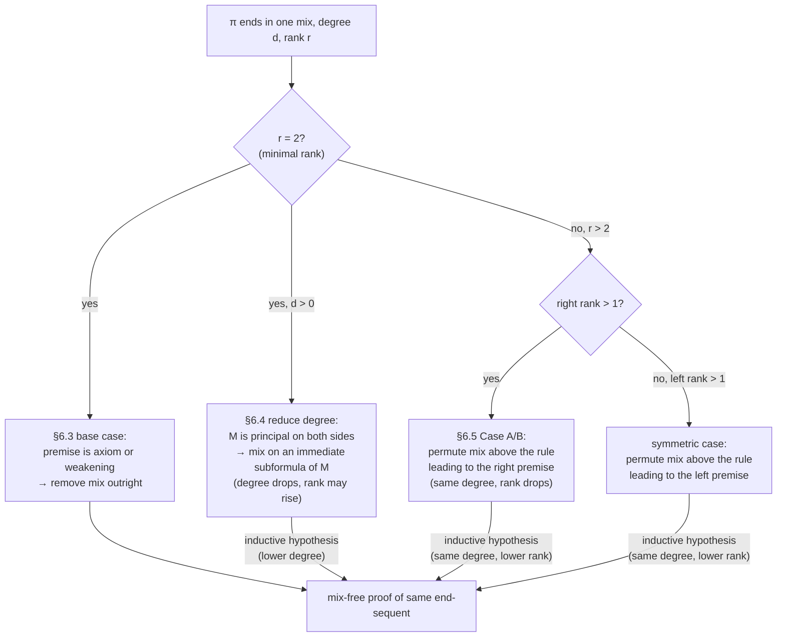
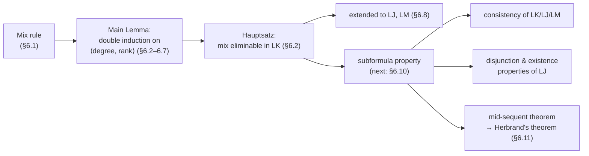

# The Cut-Elimination Theorem (Hauptsatz)

[[book-guidelines|↩ Back to guidelines]]

## The problem cut creates

[[The-Sequent-Calculus|The sequent calculus]] (LK, LJ, LM) has a rule, cut, that lets you use an already-proved lemma inside a bigger proof:

$$\dfrac{\Gamma \Rightarrow \Theta, A \qquad A, \Delta \Rightarrow \Lambda}{\Gamma, \Delta \Rightarrow \Theta, \Lambda}\ \text{cut}$$

This is exactly what you'd want from an engineering standpoint: prove a fact once ($A$), then reuse it, the way a compiler reuses a monomorphized function or a theorem prover reuses a previously-discharged lemma. But cut has a property every other rule in LK lacks: the formula $A$ that gets consumed does not have to appear anywhere in the conclusion sequent $\Gamma, \Delta \Rightarrow \Theta, \Lambda$, and it does not have to be a subformula of anything in it. $A$ can be arbitrarily complex — more complex than everything else in the proof — and it vanishes without a trace.

Every *other* rule in LK obeys the **subformula property**: everything in a premise is either already in the conclusion or is an immediate subformula of something introduced in the conclusion. That property is what makes cut-free proofs so valuable: it bounds what a proof can even mention, which is what later powers the consistency proof, the disjunction and existence properties for LJ, and Herbrand's theorem (Chapter 6, §6.10 — the chapter's payoff, treated in [[Consequences-of-Cut-Elimination|the next topic]] once it exists). Cut breaks all of that: a proof with cut can talk about anything, including formulas unrelated to what's actually being proved. If you've ever debugged a type-checker where an elaborated term contains a metavariable instantiation that never surfaces in the final type — a "detour" through information that the final answer doesn't depend on — you already have the right intuition for what a cut-formula does to a derivation and why removing it should be possible: the *conclusion* the proof reaches doesn't have any use for that middle-man material.

Gentzen's *Hauptsatz* ("main theorem," 1935) is the theorem that this detour is always eliminable: every LK/LJ/LM proof that uses cut can be mechanically transformed into a cut-free proof of the *same end-sequent*. This is a genuine **proof-transformation** result, not just an existence claim — Gentzen (and this book, closely following him) gives an actual algorithm, which is the part worth understanding in engineering terms: it's a terminating, well-founded rewrite system over proof trees, and its termination argument is a real piece of machinery you will re-derive, in miniature, anywhere you build a normalizer, an elaborator that inlines lemma applications, or a resolution-style prover that has to eliminate a cut-like resolution step.

## The mix rule as a technical substitute for cut

Gentzen does not attack cut head-on. Instead he introduces an auxiliary rule, **mix**, that is deductively equivalent to cut but structurally easier to induct on, and proves *mix* eliminable. The mix rule erases *every* occurrence of a chosen formula from both premises in one shot:

$$\dfrac{\Gamma \Rightarrow \Theta \qquad \Delta \Rightarrow \Lambda}{\Gamma, \Delta^{*} \Rightarrow \Theta^{*}, \Lambda}\ \text{mix}$$

Here $M$ (the **mix formula**) must occur at least once in $\Theta$ and at least once in $\Delta$, and $\Theta^{*}$, $\Delta^{*}$ are $\Theta$, $\Delta$ with *every* occurrence of $M$ erased — not just one. Compare this to cut, which consumes exactly one occurrence of $A$ on each side and leaves any other copies of $A$ untouched.

That difference is the entire reason mix exists. Cut and contraction interact badly (more on this in [Why mix, not cut](#why-cut-cannot-be-eliminated-directly) below); mix sidesteps the interaction by building the multiple-occurrence case into the rule itself. The two rules are shown equivalent modulo the rest of LK:

- **Proposition 6.1 (mix is derivable in LK).** Given $\Gamma \Rightarrow \Theta$ and $\Delta \Rightarrow \Lambda$, derive $\Gamma, \Delta^{*} \Rightarrow \Theta^{*}, \Lambda$ by first using $ir$/$cr$ and $il$/$cl$ to collect *all* occurrences of $M$ at the edge of each sequent, and then closing with a single ordinary cut.
- **Proposition 6.2 (cut is derivable in LK − cut + mix).** Given $\Gamma \Rightarrow \Theta, A$ and $A, \Delta \Rightarrow \Lambda$, apply mix on $A$ to get $\Gamma, \Delta^{*} \Rightarrow \Theta^{*}, \Lambda$, then restore any copies of $A$ that mix over-erased using weakening/interchange.

With that equivalence in hand, the actual theorem gets restated as a claim about mix:

> **Theorem 6.3 (Hauptsatz).** Mix is eliminable: every proof in $\mathrm{LK} - \mathrm{cut} + \mathrm{mix}$ has an equivalent mix-free proof of the same end-sequent.

The reduction from "eliminate all mixes anywhere in a proof" to "eliminate the *last* mix in a proof that contains only that one mix" is a standard bottom-up peeling argument: take the first mix in the proof (by some fixed traversal order), the subproof ending there has exactly one mix as its last step, eliminate it by the lemma below, splice the mix-free replacement back in, repeat. All of the real content is therefore in one lemma about a single terminal mix — the **Main Lemma** — and that lemma is what the rest of this article is about.

**Grounding.** If you've written a compiler pass that inlines a call and then has to re-derive downstream invariants because the call site duplicated the callee's effects, you've hit the mix/cut distinction already: mix is "inline and immediately dedupe," cut is "inline once." A `Vec<Formula>`-based sequent representation makes the difference completely mechanical:

```rust
struct Sequent { antecedent: Vec<Formula>, succedent: Vec<Formula> }

/// mix: erase *every* occurrence of `m` from both sides, then merge.
fn mix(gamma: &Sequent, delta: &Sequent, m: &Formula) -> Sequent {
    Sequent {
        antecedent: gamma.antecedent.iter().cloned()
            .chain(delta.antecedent.iter().filter(|f| *f != m).cloned())
            .collect(),
        succedent: gamma.succedent.iter().filter(|f| *f != m).cloned()
            .chain(delta.succedent.iter().cloned())
            .collect(),
    }
}
```

The `.filter(|f| *f != m)` is doing exactly what $\Theta^{*}$ and $\Delta^{*}$ do in the book's notation — erase *all* matches, not just one — which is precisely the operation that made Proposition 6.1's derivation need repeated contraction to simulate with plain cut.

## Degree and rank of a mix

The induction that eliminates mix needs a complexity measure on proofs, and the book defines two, corresponding to the two ways a proof can be "hard": how complex the mix-formula is, and how deeply it's buried in the surrounding derivation.

**Degree.** The degree of a formula is its count of logical connectives/quantifiers (Section 2.3). The **degree of a mix**, $\mathrm{dg}(\pi)$, is just the degree of its mix-formula $M$. Degree 0 means $M$ is atomic.

**Rank.** This is the more interesting measure, because it's about *shape*, not content. Fix a proof $\pi$ ending in a single mix; call the subproof ending in its left premise the **left branch** and the one ending in its right premise the **right branch**.

- The **left rank** $\mathrm{rk}_l(\pi)$ is the length of the longest unbroken chain of consecutive sequents, ending at the left premise, all of which still contain $M$ in their succedent.
- The **right rank** $\mathrm{rk}_r(\pi)$ is the same but ending at the right premise, with $M$ tracked in the *antecedent*.
- $\mathrm{rk}(\pi) = \mathrm{rk}_l(\pi) + \mathrm{rk}_r(\pi)$.

Since $M$ must occur in the succedent of the left premise and the antecedent of the right premise (that's what makes it a legal mix), both partial ranks are at least 1 — so **the minimum possible rank of any mix is 2**. Rank is measuring "how far back in the derivation does $M$'s trail run before it stops being explicitly present" — i.e., how many inference steps you'd have to reach through if you tried to permute the mix upward past its neighbors.

Example 6.9 from the text makes the two measures concrete on a real proof with $\mathrm{rk}_l = 3$, $\mathrm{rk}_r = 4$, so $\mathrm{rk}(\pi) = 7$ — a rank that has nothing to do with how syntactically big $M$ is, only with how many rule applications sit along the two branches while still "carrying" $M$.

**Grounding.** Degree is just AST depth of the cut/mix formula — trivial to compute with a recursive size function in Rust, Python, or Lean (`Formula.size` by structural recursion). Rank is the less obvious one: it's a **provenance-tracking depth**, closer to a dataflow liveness range than a size metric — "for how many steps upstream is this specific formula-occurrence still live in the sequent." If you've implemented a borrow-checker-style liveness pass or a definition-use chain, rank is exactly that computation specialized to one designated occurrence:

```rust
/// Longest chain of ancestors, starting at `leaf`, whose succedent
/// (for the left branch) still contains `m`.
fn left_rank(proof: &Proof, leaf: NodeId, m: &Formula) -> u32 {
    let mut n = 0;
    let mut cur = leaf;
    while proof.node(cur).sequent.succedent.contains(m) {
        n += 1;
        match proof.parent(cur) { Some(p) => cur = p, None => break }
    }
    n
}
```

This is the kind of measure that, in an elaborator, would track "how many unification steps upstream is this metavariable's instantiation still visibly threaded through the context" — the same shape of question as asking how long a metavariable stays unresolved before a later constraint pins it down.

## Double induction on degree and rank: the Main Lemma

> **Lemma 6.10 (Main Lemma).** Any regular proof containing exactly one mix, as its last inference, can be transformed into a mix-free proof of the same end-sequent. ("Regular" just means each eigenvariable is used for at most one critical inference — Proposition 5.23 lets you always get there first.)

The proof is by **[[Induction-as-a-Proof-Method#Double induction|double induction]]**, ordered lexicographically: $\pi_1$ is *less complex* than $\pi_2$ iff $\mathrm{dg}(\pi_1) < \mathrm{dg}(\pi_2)$, **or** $\mathrm{dg}(\pi_1) = \mathrm{dg}(\pi_2)$ and $\mathrm{rk}(\pi_1) < \mathrm{rk}(\pi_2)$. Degree is the *primary* key and rank the *secondary* key — degree dropping even by 1 licenses the inductive hypothesis regardless of what happens to rank, but rank dropping alone only helps at *equal* degree. This ordering choice is the crux of the whole proof, and it's worth sitting with, because the actual induction steps sometimes **increase** rank while decreasing degree — that's fine precisely because degree is weighted first.

Concretely, the case structure is:



**Base case ($\mathrm{dg} = 0$, $\mathrm{rk} = 2$, Lemma 6.14).** Minimal rank forces $M$ to be introduced *immediately* above each premise — as an axiom, a weakening, or (impossible here, since $\mathrm{dg}=0$ rules out any connective) an operational rule. Two sub-lemmas dispatch this completely:

- **Lemma 6.11** (a premise is an axiom $M \Rightarrow M$): splice the *other* branch directly into the conclusion via weakening/contraction/interchange — the axiom branch contributed nothing but $M$ itself, which mix erases anyway.
- **Lemma 6.13** (a premise is a weakening whose principal formula is $M$, occurring nowhere else): swap the *order* of mix and weakening — weaken the *other* branch's conclusion instead, using structural rules to reassemble the shape.

Both lemmas hold **for $M$ of any degree**, which is why they double as *base cases* for the rank induction as well as tools reused inside the harder inductive steps (e.g. Lemma 6.15, used to discharge a side-condition later: if $M$ also happens to sit passively in the antecedent of the left premise or succedent of the right premise, the *other* branch's derivability transfers straight across via weakening, since $M$ is already sitting there to receive it).

**Reducing the degree ($\mathrm{rk} = 2$, $\mathrm{dg} > 0$, Lemma 6.16).** Now both premises are conclusions of *operational* rules with $M$ principal — there are exactly six cases, one per main connective. The pattern is identical in each: replace the mix on $M$ with a mix on $M$'s immediate subformula(e), which is legal because at minimal rank $M$ doesn't occur anywhere else that would need re-erasing. Take conjunction ($M = A \wedge B$) as the template:

$$\dfrac{\Gamma_1 \Rightarrow \Theta_1, A \quad \Gamma_1 \Rightarrow \Theta_1, B}{\Gamma_1 \Rightarrow \Theta_1, A \wedge B}\ \wedge r \qquad\qquad \dfrac{A, \Gamma_2 \Rightarrow \Theta_2}{A \wedge B, \Gamma_2 \Rightarrow \Theta_2}\ \wedge l$$

$$\dfrac{\Gamma_1 \Rightarrow \Theta_1, A \wedge B \qquad A \wedge B, \Gamma_2 \Rightarrow \Theta_2}{\Gamma_1, \Gamma_2 \Rightarrow \Theta_1, \Theta_2}\ \text{mix}$$

rewrites to a mix on the strictly smaller formula $A$:

$$\dfrac{\Gamma_1 \Rightarrow \Theta_1, A \qquad A, \Gamma_2 \Rightarrow \Theta_2}{\Gamma_1, \Gamma_2^{*} \Rightarrow \Theta_1^{*}, \Theta_2}\ \text{mix} \quad \leadsto \quad \Gamma_1, \Gamma_2 \Rightarrow \Theta_1, \Theta_2 \ \ (\text{via } w, i)$$

$\mathrm{dg}$ has strictly dropped (from $\deg(A \wedge B)$ to $\deg(A)$), so the inductive hypothesis applies *regardless of what the rank of the new mix turns out to be* — which is exactly the point of weighting degree first. The other five cases ($\vee$, $\supset$, $\neg$, $\forall$, $\exists$) follow the same template; $\supset$ and the quantifiers are the instructive variants:

- $M = A \supset B$: the $\supset l$ rule has *two* premises, so eliminating produces *two* chained mixes (one on $A$, one on $B$), each individually of lower degree — you resolve them one at a time, replacing each with its mix-free result before tackling the next.
- $M = \forall x\, F(x)$ / $\exists x\, F(x)$: eliminating swaps the mix to the *instantiated* body $F(t)$, and the eigenvariable side of the derivation needs the **variable-replacement lemma** (Corollary 5.25) to rename the bound eigenvariable $b$ to the witnessing term $t$ throughout — legal exactly because $b$'s critical-rule side condition guarantees it doesn't occur free in the rest of that branch's context.

Note the invariant that makes the whole degree-reduction phase work: rank is allowed to go *up* in every one of these six transformations. The book gives a small explicit example where a mix of rank 2 becomes a mix of rank 4 after a degree-lowering step — and that's not a bug, because the new mix has strictly lower degree, so the primary induction key has already dropped and the secondary key (rank) is irrelevant to whether the inductive hypothesis applies.

**Reducing the rank ($\mathrm{rk} > 2$, Lemma 6.17/6.18).** Here degree stays fixed and the move is to **permute the mix upward** past whichever structural or operational rule produced the "extra" occurrence of $M$ that's inflating the rank. Concretely, if the right rank is $> 1$, the right premise's own premise still contains $M$ — so you can apply mix *one level higher* (mixing $\Pi \Rightarrow \Sigma$ directly against that higher sequent), which strictly shortens the counted chain, then reattach the intervening rule *below* the now mix-free result:

$$\dfrac{\Pi \Rightarrow \Sigma \qquad \dfrac{\Psi \Rightarrow \Omega}{\Xi \Rightarrow \Omega}\, wl/cl/il}{\Pi, \Xi^{*} \Rightarrow \Sigma^{*}, \Omega}\ \text{mix} \quad\leadsto\quad \dfrac{\dfrac{\Pi \Rightarrow \Sigma \qquad \Psi \Rightarrow \Omega}{\Pi, \Psi^{*} \Rightarrow \Sigma^{*}, \Omega}\ \text{mix}}{\Xi^{*}, \Pi \Rightarrow \Sigma^{*}, \Omega}\ wl/cl/il\ (\text{+ interchange})$$

The new mix has the *same degree* ($M$ unchanged) and strictly lower rank (one fewer sequent in the chain), so this time the inductive hypothesis on the *secondary* key applies directly. When the structural rule's principal formula *is* $M$ itself, the trick still works because $\Xi^{*}$ and $\Psi^{*}$ (both with $M$ erased) are already identical, so no re-erasure step is even needed. Operational rules with two premises leading to the mixed side (the harder half of §6.5, past the excerpted pages here) split analogously into two successive rank-reducing mixes, mirroring the $\supset$ case above.

**Grounding.** This entire lemma is a textbook example of proving termination of a rewrite system via a **lexicographic well-founded order** — the exact machinery Lean's `termination_by` invokes when a single structural decrease isn't available. In Lean you'd write the eliminator with a measure on `(degree, rank) : ℕ ×ₗ ℕ` (Lean's `Prod.Lex`, or an explicit `WellFoundedRelation` built from it) and Lean's kernel would accept the recursive calls exactly because each branch supplies a proof that the pair strictly decreased lexicographically — matching the book's "degree first, rank second" weighting almost syntactically:

```
def eliminateMix (π : Proof) (h : endsInSingleMix π) : Proof :=
  match rankCase π h with
  | .baseCase h2       => removeDirectly π h2
  | .degreeStep π' h3  => eliminateMix π' h3    -- dg π' < dg π
  | .rankStep π' h4    => eliminateMix π' h4    -- dg π' = dg π, rk π' < rk π
termination_by (degree π, rank π)
decreasing_by all_goals (first | (left; omega) | (right; omega))
```

A Rust port of the same algorithm is a recursive function over an inductively defined `Proof` enum, dispatching on premise shape exactly like the book's case analysis (axiom / weakening / operational-rule-with-$M$-principal / other), with the termination argument carried informally by the type system's `usize` degree/rank pair rather than checked — which is precisely the gap a "trusted kernel" has to close formally if you want the elimination procedure itself to be part of the *checked* core rather than an untrusted preprocessing pass.

## Why cut cannot be eliminated directly

This is the question the chapter is implicitly answering by going through mix at all, and §6.9 makes the reason explicit by showing *where the direct strategy for cut breaks down*.

Degree-reduction works identically for cut and mix — nothing above depended on multiple occurrences. The failure is entirely in **rank-reduction**, specifically when the rule producing the extra occurrence is **contraction on the cut-formula itself**. Suppose a cut's right premise is the conclusion of a $cl$ contracting two copies of $A$:

$$\dfrac{\Pi \Rightarrow A \qquad \dfrac{A, A, \Psi \Rightarrow B}{A, \Psi \Rightarrow B}\ cl}{\Pi, \Psi \Rightarrow B}\ \text{cut}$$

With mix, you'd permute past this for free, because mix erases *both* copies of $A$ in one step regardless of how many there are. With cut, only one occurrence is consumed per application, so the natural fix is to apply cut *twice* — once for each copy of $A$ in $A, A, \Psi \Rightarrow B$:

$$\dfrac{\Pi \Rightarrow A \qquad \dfrac{A, A, \Psi \Rightarrow B}{\Pi, A, \Psi \Rightarrow B}\ \text{cut}}{\Pi, \Pi, \Psi \Rightarrow B}\ \text{cut} \quad \leadsto\ (\text{contract}) \quad \Pi, \Psi \Rightarrow B$$

Now look at the *upper* of these two new cuts: it has the same cut-formula $A$ and strictly lower rank than the original, so the inductive hypothesis eliminates it, yielding a cut-free proof $\pi'_3$ of $\Pi, A, \Psi \Rightarrow B$. Substitute that in, and you still have a *second* cut left — $\Pi \Rightarrow A$ against $\pi'_3$ — and now the argument stalls: **there is no guarantee that this remaining cut has lower rank than the one you started with.** Why not? Because you don't control how many occurrences of $A$ show up in $\pi'_3$'s antecedent — that proof was produced by the inductive-hypothesis black box, and cut-elimination (unlike mix-elimination) doesn't come with a bound on how many copies of a formula a mix-free — sorry, *cut*-free — replacement proof might introduce along the way. Mix sidesteps this exact problem by construction: since it erases *all* copies of $M$ in a single step, "how many copies are left" is never a variable the induction has to track.

And this is not a quirk of LJ's single-succedent restriction — in full LK the situation is worse, since contraction can act on *either* side of the cut formula simultaneously (the book's example: both premises of a cut are themselves conclusions of a contraction on the cut-formula). So Gentzen's choice isn't a stylistic preference — it's a real technical necessity, and the mix rule's "erase every occurrence at once" behavior is precisely the extra bit of bookkeeping that makes the double induction close. (The book notes a direct cut-elimination strategy *is* possible with more machinery — Borisavljević (2003) — and other traditions, e.g. Troelstra & Schwichtenberg (2000), avoid the issue with a different rule set entirely; mix is Gentzen's specific fix, not the only one.)

**Grounding.** This is the sequent-calculus analogue of a hazard you'll recognize from any substitution-based rewrite engine: substituting a term for a variable that occurs *more than once* in the target can blow up the size or structure of the result in a way a naive "substitute once, recurse" termination argument doesn't account for. It's the same reason call-by-name evaluators need care around duplicated redexes, and the same reason Miller's pattern-unification fragment is valuable precisely *because* it restricts metavariable applications to **distinct** bound variables — ruling out exactly the "multiple occurrence, unclear multiplicity" case that breaks a naive occurs-check-and-substitute termination proof, the same way unrestricted mix duplication breaks naive cut-permutation.

## Cut-elimination for LJ and LM

Gentzen's argument transfers to the intuitionistic calculus **LJ** almost mechanically: LJ is LK with sequents restricted to at most one succedent formula ($[C]$ meaning "$C$ or nothing"), $cr$ and $ir$ dropped as redundant, and every rule reshaped to respect the restriction (e.g. $\supset l$ becomes $\dfrac{\Gamma \Rightarrow A \quad B, \Delta \Rightarrow [C]}{A \supset B, \Gamma, \Delta \Rightarrow [C]}$). The book leaves formulating LJ's mix rule and re-proving the derivability equivalences as Problem 6.26, and states cut-elimination for LJ as **Theorem 6.27** — the same double-induction proof goes through verbatim, because nothing in the degree/rank argument used the *number* of succedent formulas, only their presence or absence.

One genuine wrinkle: the weakening-on-the-right rule ($wr$) is *restricted* in LJ (you can only weaken into an *empty* succedent, since there's room for at most one formula), so Lemma 6.13's argument needs care wherever it invoked $wr$ — the fix is that in the restricted setting, either $\Theta$ or $\Lambda$ is guaranteed empty already, so the case degenerates rather than breaking. **LM**, minimal logic's sequent calculus, sharpens the restriction further by *dropping $wr$ entirely* — which means there is no proof at all where the left premise of a mix is a $wr$-conclusion, eliminating one whole case from Lemma 6.13's proof rather than complicating it (Problem 6.28 asks the reader to carry this through explicitly for the $\neg, \wedge, \supset$ fragment).

## Where this leads

This chapter's Main Lemma is the engine; §6.10 (the next topic) spends the cut-freeness it buys — the subformula property, consistency of LK/LJ/LM, LJ's disjunction and existence properties, and the mid-sequent/Herbrand theorems — all of which are corollaries that *only* make sense once you know cut-free proofs exist and can be produced algorithmically, not just asserted to exist.



For the standing compiler/elaborator project, this chapter is directly load-bearing in two ways. First, the **double induction on ⟨degree, rank⟩** is the concrete template for *any* proof-normalization or proof-reconstruction pass you write for a trusted kernel: a checker that accepts "cut-like" lemma-application steps from an untrusted prover (an SMT solver, a Horn-clause resolution engine, a CEGAR loop) but wants to *re-derive* a cut-free, subformula-bounded certificate before trusting it needs exactly this kind of well-founded, lexicographically-ordered elimination procedure — and the failure mode analyzed in §6.9 (contraction duplicating an occurrence and breaking a naive single-measure induction) is the general shape of why proof-certificate checkers need a real termination argument, not just "it always seems to get simpler." Second, the **subformula property** that cut-elimination buys is the theoretical reason bounded proof search and decision procedures for fragments of a logic are even conceivable: an automated theorem prover (or the CSP/abstract-interpretation kernel in the compiler project) searching for a proof of a sequent under the invariant "everything in the search state is a subformula of the goal" is implicitly relying on a cut-free calculus — which is exactly what this chapter constructs.
