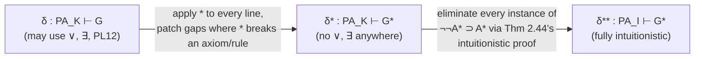

[[book-guidelines|↩ Back to guidelines]]

# The Gödel–Gentzen Translation

## The problem: who gets to trust arithmetic?

By the early 1930s there were, in effect, two arithmetics. **Classical Peano arithmetic** ($\text{PA}_K$) uses the ordinary logic every programmer already thinks in: excluded middle, double-negation elimination, proof by contradiction. **Intuitionistic Peano arithmetic** ($\text{PA}_I$, also known as Heyting arithmetic, HA) has the *same non-logical [[The-Sequent-Calculus#Axioms|axioms]]* — the same facts about $0$, successor, $+$, and $\cdot$ — but only intuitionistic logic in the background. No excluded middle, no unrestricted double-negation elimination. Existence claims must be witnessed; a proof of $\exists x\,F(x)$ has to come with a way of producing an $x$.

Brouwer and Weyl considered classical reasoning about infinite domains — like the naturals treated as a completed totality — epistemically suspect. Hilbert refused to let go of classical mathematics, but he needed a way to *answer* the suspicion rather than just assert it away. His proof-theoretic program was exactly this: show, using reasoning that even a constructivist accepts, that classical theories can't produce a contradiction.

Here's what breaks without a result like the one in this section: intuitionists could concede "fine, classical arithmetic looks internally coherent" while still insisting it rests on principles (excluded middle, unrestricted RAA) that have no constructive justification and might, for all anyone knew, eventually generate a contradiction that constructive reasoning would have avoided. Simply *asserting* that $\text{PA}_K$ is as safe as $\text{PA}_I$ settles nothing. What Gentzen (1933) and, independently, Gödel (1933) supplied was a *formal translation*: a mechanical procedure that takes any classical derivation and produces an intuitionistic derivation of a related (in fact intuitionistically equivalent-in-content) formula. If $\text{PA}_I$ is consistent, this procedure forces $\text{PA}_K$ to be consistent too — not by philosophical argument, but by exhibiting an actual construction.

This is also a preview, in miniature, of the technique the whole book is building toward: a **relative consistency proof** via **interpretability** — translate a theory you're worried about into one you trust more, and let the translation carry the consistency guarantee across. The ordinal-analysis consistency proof of Chapters 7–9 is the same idea scaled up to an absolute (not merely relative) result.

**What this section is *not*:** it is not itself a finitary consistency proof of arithmetic in Hilbert's strict sense — it just relocates the trust question from $\text{PA}_K$ to $\text{PA}_I$. Historically this mattered too: the field initially assumed intuitionistic reasoning *was* finitary reasoning, so this result briefly looked like it settled Hilbert's program for arithmetic. It didn't — it clarified that intuitionism is strictly broader than finitism, sharpening what "finitary" had to mean going forward. That sharpening is what set up the need for Gentzen's later, genuinely ordinal-based consistency proof.

## Setting up: PA parametrized by its logic

The book's move here is elegant: instead of writing three separate arithmetics from scratch, it defines *one* set of non-logical axioms and lets a subscript pick the background logic.

**Language.** Constant $0$, one-place function symbol $'$ (successor, written postfix), two two-place function symbols $+, \cdot$, and one predicate symbol $=$ (treated here as *non-logical*, following Herbrand). Terms and formulas are the usual inductively-defined trees from predicate logic (Definitions 2.29–2.30 in the book), except atomic formulas are restricted to the shape $t_1 = t_2$.

**Axioms.** On top of a background propositional/predicate calculus, add all instances of:

$$
\begin{aligned}
&\text{PA1. } a=a \qquad \text{PA2. } a=b \supset b=a \qquad \text{PA3. } (a=b \wedge b=c) \supset a=c\\
&\text{PA4. } \neg a'=0 \qquad \text{PA5. } a=b \supset a'=b' \qquad \text{PA6. } a'=b' \supset a=b\\
&\text{PA7. } [F(0) \wedge \forall x(F(x) \supset F(x'))] \supset \forall x\, F(x) \quad \text{(induction, any } F(a)\text{)}\\
&\text{PA8. } \neg\neg a=b \supset a=b\\
&\text{PA9. } (a+0)=a \qquad \text{PA10. } (a+b')=(a+b)' \qquad \text{PA11. } (a\cdot 0)=0 \qquad \text{PA12. } (a\cdot b')=((a\cdot b)+a)
\end{aligned}
$$

Now:

- $\mathrm{PA}_M$ = these axioms on top of minimal logic $M_1$.
- $\mathrm{PA}_I$ = these axioms on top of intuitionistic logic $J_1$ (this is Heyting Arithmetic, HA).
- $\mathrm{PA}_K$ = these axioms on top of classical logic $K_1$ (this is ordinary first-order PA — PA8 becomes redundant, since it's an instance of the classical axiom PL12, $\neg\neg A \supset A$).

This "logic as a parameter, mathematical content held fixed" framing is worth internalizing on its own: it is exactly the design move you'd make if you were building a proof assistant's core calculus as a family of kernels sharing one signature and one set of non-logical axioms, differing only in which structural/logical rules the type-checker admits. A Rust sketch of the shared skeleton:

```rust
enum Formula {
    Eq(Term, Term),
    Not(Box<Formula>),
    And(Box<Formula>, Box<Formula>),
    Or(Box<Formula>, Box<Formula>),
    Implies(Box<Formula>, Box<Formula>),
    ForAll(Var, Box<Formula>),
    Exists(Var, Box<Formula>),
}

trait Logic {
    /// Which axiom schemas this background logic licenses,
    /// beyond the shared PA1..PA12 non-logical axioms.
    fn licenses_excluded_middle(&self) -> bool;
    fn licenses_double_negation_elim(&self) -> bool;
}

struct Minimal;   // neither
struct Intuitionistic; // neither, but adds PL11 (ex falso): ¬A ⊃ (A ⊃ B)
struct Classical; // adds PL12: ¬¬A ⊃ A  (equivalently, excluded middle)
```

$\mathrm{PA}_K$ is *prima facie* stronger: with excluded middle around, you can derive things $\mathrm{PA}_I$ can't. The book gives a sharp witness — the induction principle $\mathrm{IP}(F)$ and the least-number principle $\mathrm{LNP}(F)$ are classically interderivable, but *only one direction* $(\mathrm{LNP}(F) \supset \mathrm{IP}(F))$ survives intuitionistically; $\mathrm{IP}(F) \supset \mathrm{LNP}(F)$ genuinely needs excluded middle. So this isn't a notational curiosity — $\text{PA}_K$ really does prove more, in the naive sense of raw derivability. The translation has to work *despite* that asymmetry, not by pretending it isn't there.

## Step 1: double-negation is invisible on the $\{\neg,\wedge,\supset,\forall\}$ fragment

The key technical fact that makes everything else work: **restricted to formulas built only from $\neg, \wedge, \supset, \forall$ (no $\vee$, no $\exists$), classical and intuitionistic logic already agree on double-negation elimination.**

**Theorem 2.44.** If $A$ is a formula of arithmetic containing neither $\vee$ nor $\exists$, then $\neg\neg A \supset A$ is derivable in $\mathrm{PA}_I$.

*Proof idea* (by induction on the degree $d(A)$, i.e. structural induction on formula complexity — the book's standard technique from §2.7, applied here as one more instance of "prove a property of all formulas by proving it compositionally over the inductive definition"):

- **Basis:** $A$ atomic, i.e. $t_1 = t_2$. Then $\neg\neg t_1{=}t_2 \supset t_1{=}t_2$ is literally axiom PA8.
- **Step:** $A$ is $\neg B$, $B \wedge C$, $B \supset C$, or $\forall x\,B[x/a]$ (the only shapes left once $\vee,\exists$ are excluded). By the inductive hypothesis, $\neg\neg B \supset B$ and $\neg\neg C \supset C$ are already available intuitionistically. A separate lemma (Theorem 2.43, itself assembled from earlier exercises) shows double-negation elimination *propagates upward* through each of these four connectives/quantifier — e.g. from $\neg\neg B \supset B$ you can derive $\neg\neg\neg B \supset \neg B$, and similarly for conjunction, implication, and universal quantification.

Why this matters: it isolates *exactly* where classical and intuitionistic logic diverge — at $\vee$ and $\exists$. Disjunction and existence are the connectives whose intuitionistic reading demands a witness (a proof of $B\vee C$ must actually contain a proof of $B$ or a proof of $C$; a proof of $\exists x\,F(x)$ must actually contain a witnessing term). Everything else — negation, conjunction, implication, universal quantification — has an intuitionistic reading that's *already* classically well-behaved with respect to double negation. So the entire translation strategy reduces to: **eliminate $\vee$ and $\exists$ by defining them away in terms of $\neg,\wedge,\forall$**, and then double-negation elimination becomes a solved problem on the resulting formula for free.

This is the proof-theoretic analogue of a fact type-theorists meet again in different clothes: $\vee$ and $\exists$ are exactly the *positive, witness-carrying* connectives (they correspond to sum types $\Sigma$/`enum` and dependent-pair types respectively) whose elimination rules genuinely destroy information if you erase to classical logic — whereas $\wedge, \supset, \forall$ (products, functions, $\Pi$-types) survive a double-negation "CPS-style" reinterpretation unscathed. If you've seen the Curry–Howard correspondence, this is the same asymmetry showing up as "which connectives need continuation-passing to survive negative translation."

## Step 2: the translation $G^*$

**Definition 2.46.** Define $G^*$ by induction on the structure of $G$:

$$
\begin{aligned}
G^* &= G && \text{if } G \text{ atomic}\\
(\neg F)^* &= \neg F^*\\
(F \wedge H)^* &= F^* \wedge H^*\\
(F \vee H)^* &= \neg(\neg F^* \wedge \neg H^*)\\
(F \supset H)^* &= F^* \supset H^*\\
(\forall x\, F[x/a])^* &= \forall x\, F^*[x/a]\\
(\exists x\, F[x/a])^* &= \neg \forall x\, \neg F^*[x/a]
\end{aligned}
$$

Read the two nontrivial clauses aloud and they say exactly what you'd expect from De Morgan's laws under classical logic: "$F$ or $H$" becomes "not (not-$F$ and not-$H$)"; "there exists an $x$ such that $F$" becomes "it is not the case that all $x$ fail $F$." These are the standard classical equivalences — but here they're not being *asserted*, they're being used to define a syntactic transformation that eliminates $\vee$ and $\exists$ entirely, replacing them with $\neg,\wedge,\forall$-only equivalents. By construction, $G^*$ never contains $\vee$ or $\exists$ (Problem 2.47, an easy induction on $d(G)$), so Theorem 2.44 applies to every $G^*$.

A minor technical wrinkle worth noting because it's easy to gloss over and it *is* the kind of thing that would bite you in an implementation: the book is careful that formulas like $\forall x\,F(x)$ are really $\forall x\,F[x/a]$ — a formula-with-a-free-variable $F(a)$, closed under a universal quantifier that renames $a$ to a fresh bound $x$. The translation is defined on the *open* formula $F(a)$ (which has strictly lower degree, so the induction goes through), and the quantifier is reattached afterward. This is exactly the de Bruijn-index bookkeeping issue you hit writing a substitution function over a `Formula` AST with a `ForAll(Var, Box<Formula>)` constructor: you recurse on the body under the binder, and the binder itself has to be "put back" without accidentally capturing anything. In Rust terms:

```rust
fn translate(f: &Formula) -> Formula {
    match f {
        Formula::Eq(..) => f.clone(),
        Formula::Not(a) => Formula::Not(Box::new(translate(a))),
        Formula::And(a, b) => Formula::And(Box::new(translate(a)), Box::new(translate(b))),
        Formula::Implies(a, b) => Formula::Implies(Box::new(translate(a)), Box::new(translate(b))),
        Formula::Or(a, b) => Formula::Not(Box::new(Formula::And(
            Box::new(Formula::Not(Box::new(translate(a)))),
            Box::new(Formula::Not(Box::new(translate(b)))),
        ))),
        // recurse under the binder, then reattach the quantifier — the
        // "put it back without capturing" step
        Formula::ForAll(x, body) => Formula::ForAll(x.clone(), Box::new(translate(body))),
        Formula::Exists(x, body) => Formula::Not(Box::new(Formula::ForAll(
            x.clone(),
            Box::new(Formula::Not(Box::new(translate(body)))),
        ))),
    }
}
```

Two facts about $G^*$ the book states without belaboring, both provable by an easy structural induction:
1. If $G$ already avoids $\vee,\exists$, then $G^* = G$ (the translation is the identity on its own fixed points — reassuring, since it means the translation doesn't disturb formulas that were already "safe").
2. $\vdash_{K_1} G \supset G^*$ and $\vdash_{K_1} G^* \supset G$ — *classically*, $G$ and $G^*$ are provably equivalent. (Not intuitionistically, in general — that's the whole point; $G^*$ is intuitionistically tamer than $G$ even though classically they say the same thing.)

## Step 3: lifting the translation to whole derivations

Translating a single formula is easy. The hard content of the section is **Theorem 2.48**: *a derivation in $\mathrm{PA}_K$ with end-formula $G$ can be transformed into a derivation in $\mathrm{PA}_I$ with end-formula $G^*$.* The proof is a two-stage pipeline:



**Why you can't just translate line-by-line naively.** If $\delta = S_1, S_2, \dots, S_n = G$, the tempting guess is that $S_1^*, \dots, S_n^* = G^*$ is *already* a derivation. It isn't — the naive scheme breaks the moment $\delta$ opens with an axiom instance containing $\vee$ or $\exists$. Concrete failure mode from the text: if $S_1$ is an instance of axiom PL7 ($A \supset (A\vee B)$), say $0{=}0 \supset (0{=}0 \vee \neg(0{=}0))$, its translation $S_1^*$ is $0{=}0 \supset \neg(\neg(0{=}0)\wedge\neg\neg(0{=}0))$ — which is *not itself an instance of any axiom*. Translation doesn't commute with "being an axiom." So the proof has to patch every place this can happen.

The patching is exhaustive but mechanical — this is the part of the proof that is 90% bookkeeping and 10% idea, and the idea is already stated above (Step 1). Concretely:

- **Mathematical axioms (PA1–PA12):** none contain $\vee$/$\exists$ except implicitly through the schematic $F$ in the induction axiom PA7. But $[F^*(0) \wedge \forall x(F^*(x)\supset F^*(x'))] \supset \forall x\,F^*(x)$ is *still an instance of PA7* (just instantiated at $F^*$ instead of $F$) — so induction survives translation for free, by Problem 2.47 guaranteeing $F^*$ is $\vee,\exists$-free.
- **Logical axioms not mentioning $\vee/\exists$** (e.g. PL1: $A \supset (A\wedge A)$) translate to instances of themselves, since only the *schematic metavariable* gets substituted, never the schema's own connectives.
- **The four axioms that do mention $\vee/\exists$** — PL7 ($A\supset(A\vee B)$), PL8 ($(A\vee B)\supset(B\vee A)$), PL9 (disjunction elimination, $((A\supset C)\wedge(B\supset C))\supset((A\vee B)\supset C)$), QL2 ($F(t)\supset\exists x\,F(x)$) — each needs an explicit intuitionistic derivation of its *translated* form (e.g. $\mathrm{PL7}^*$: $A^*\supset\neg(\neg A^*\wedge\neg B^*)$). The book carries out each of these four derivations in full, using only intuitionistically valid steps and — this is checked carefully — never introducing a fresh occurrence of $\vee$ or $\exists$ along the way. (QL2$^*$ was already proved earlier, in Example 2.34, reused here.)
- **Inference rules:** modus ponens and $qr_1$ (the $\forall$-introduction-style rule) translate transparently — $B$ from $A, A\supset B$ becomes $B^*$ from $A^*, A^*\supset B^*$, no patching needed. The one rule needing real work is $qr_2$ ($\exists$-elimination-style): $\dfrac{B(a)\supset A}{\exists x\,B(x)\supset A}$ translates to $\dfrac{B^*(a)\supset A^*}{\neg\forall x\,\neg B^*(x)\supset A^*}$, and the book gives an explicit 8-line derivation bridging the two, again purely by contraposition and $qr_1$, with no illegitimate connectives introduced.

Running this over every line of $\delta$ produces $\delta^*$ — a derivation *still formally in $\mathrm{PA}_K$*, but now $\vee,\exists$-free throughout, ending in $G^*$. The only remaining classical residue is however many instances of axiom PL12 ($\neg\neg A \supset A$) got used along the way — and because $\delta^*$ is $\vee,\exists$-free, every such instance has the shape $\neg\neg A^* \supset A^*$ for a $\vee,\exists$-free $A^*$, which is *exactly* what Theorem 2.44 hands you an intuitionistic derivation of. Splice those in, and every trace of classicality is gone: the result, $\delta^{**}$, is a bona fide $\mathrm{PA}_I$ derivation of $G^*$.

## The payoff: three corollaries, ending in relative consistency

**Corollary 2.49.** If $\delta$'s end-formula $G$ happens to already avoid $\vee,\exists$, then $G^* = G$, so $\delta$ transforms into an $\mathrm{PA}_I$-derivation of the *very same* $G$ — not just something equivalent to it.

**Corollary 2.50.** For *every* arithmetic formula $A$, there's a classically-equivalent $B$ (namely $B = A^*$) such that $\vdash_{\mathrm{PA}_K} A \Rightarrow \vdash_{\mathrm{PA}_I} B$. This is the fully general form: nothing provable in $\mathrm{PA}_K$ is intuitionistically inaccessible — you just may have to state it in its negatively-translated form. The proof runs $\vdash_{\mathrm{PA}_K} A \Rightarrow \vdash_{\mathrm{PA}_K} A^* \Rightarrow \vdash_{\mathrm{PA}_I} A^*$, chaining $K_1$'s classical equivalence of $A, A^*$ (from Step 2) with Theorem 2.48.

**Corollary 2.52 (the target result).** *If $\mathrm{PA}_I$ is consistent, then $\mathrm{PA}_K$ is consistent.*

*Proof.* Suppose (for contradiction) $\vdash_{\mathrm{PA}_K} \neg 0{=}0$. Since $\neg 0{=}0$ already avoids $\vee,\exists$, Corollary 2.49 gives $\vdash_{\mathrm{PA}_I}\neg 0{=}0$. But $0{=}0$ is a $\mathrm{PA}_I$ theorem too (it's axiom PA1), so $\mathrm{PA}_I$ would be inconsistent — contradiction. Hence $\mathrm{PA}_K$ never proves $\neg 0{=}0$, and (using Proposition 2.53: since $\vdash_T 0{=}0$ always holds, $T$ is consistent iff $T \not\vdash \neg 0{=}0$) $\mathrm{PA}_K$ is consistent. $\blacksquare$

Notice the *direction*. The proof only ever moves derivability from $\mathrm{PA}_K$ into $\mathrm{PA}_I$ (via $G^*$), never the reverse — that asymmetry is exactly why the theorem says "consistency of $\text{PA}_I$ implies consistency of $\text{PA}_K$" and not the other way around. A hypothetical classical inconsistency would be *forced down* into an intuitionistic one; the argument gives you no tool for pushing an intuitionistic inconsistency back up into a classical witness, nor would you want one — the whole point is to make $\mathrm{PA}_I$ the trusted base.

### What this means philosophically, and why it backfired on "finitism = intuitionism"

The result reads, in isolation, as a clean vindication of classical arithmetic: your worries about excluded middle in number theory are no worse than your (already-accepted) worries about intuitionistic reasoning about the naturals. But the book is explicit that historically the lesson drawn was the *opposite* of reassuring for Hilbert's original project: since $\mathrm{PA}_I$ was assumed to be part of the "safe," finitistically acceptable core, this result was initially read as closing the book on relative consistency for arithmetic. Instead, closer scrutiny of *what kind of reasoning the translation itself uses* (double-negation manipulation, induction on formula complexity over an unbounded domain) showed that reasoning to be intuitionistically fine but not obviously *finitary* in Hilbert's stricter sense. The upshot: intuitionism turned out to be a strictly more permissive standpoint than finitism. That gap is precisely what forced a sharper definition of "finitary," and it's the reason a *second*, harder consistency proof (Gentzen's ordinal-based one, in Chapters 7–9) was still needed even after this result was in hand.

## Where this leads

- **Immediately (Chapter 2 close, and echoed conceptually in later chapters):** this is the book's first worked example of the *interpretability* method — translate a theory you distrust into one you trust, transporting consistency across the translation. Chapters 7–9 use the same shape of argument (transform proofs until they're manifestly consistent) but replace "translate into intuitionistic logic" with "reduce to a *simple proof*, using ordinal notations below $\varepsilon_0$ to guarantee the reduction terminates" — a purely proof-theoretic, genuinely finitary analogue of what this section does semantically-by-logic-swap.
- **Structurally, this section is logic-system-agnostic in spirit** even though it's carried out in the axiomatic (Hilbert-style) system: the book flags explicitly that the same translation could be redone once [[Natural-Deduction|natural deduction]] (NM/NJ/NK, Chapter 3) and [[The-Sequent-Calculus|the sequent calculus]] (LM/LJ/LK, Chapter 5) are available — worth watching for as an implicit callback when reading those chapters, since a working translation between a classical and an intuitionistic *sequent calculus* is exactly the shape of thing a bidirectional type checker's "erase to a decidable core" pass would need.

**Load-bearing for the compiler/elaborator project:** this section is the cleanest textbook instance of a *syntactic, meaning-preserving program transformation carried out by induction on term structure, with an explicit case analysis proving every axiom/rule of the source system is still respected after translation* — which is structurally identical to what a trusted elaborator does when it lowers a surface language with classical-feeling constructs (e.g. pattern matches compiled via `match` exhaustiveness reasoning, or refinement obligations discharged by classical SMT reasoning) down into a strictly constructive kernel calculus that a small trusted checker can verify. If your verifier's front end ever allows classical reasoning in its specification language (e.g. classical propositional logic inside a Hoare-style postcondition) while its trusted kernel only checks constructive proof terms, the Gödel–Gentzen translation is the literal template for the soundness argument you'd need: "every classically-derivable obligation has an intuitionistically-checkable image, and the kernel only ever has to trust the image."
