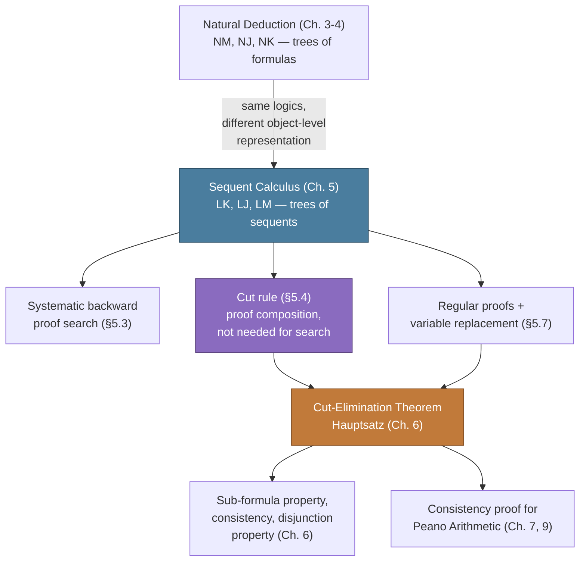

# The Sequent Calculus

[[book-guidelines|↩ Back to guidelines]]

## Why build a second proof system at all

Chapters 3–4 already gave us [[Natural-Deduction|natural deduction]] — NM, NJ, NK — with paired introduction/elimination rules that read like the informal reasoning mathematicians actually do. So why does Gentzen immediately turn around and build a *second*, less intuitive-looking calculus?

The book's own answer, in §5.1, is architectural rather than philosophical: natural deduction proves single *formulas* from a set of open assumptions, but nothing in NJ/NK forces you to track the antecedent and the goal in the same syntactic object at every step. Elimination rules (⊃e most obviously) require you to already have a proof of the *whole* major premise sitting around — you can't grow it incrementally from a target formula alone. Gentzen's fix, borrowed structurally from Hertz (1929) but extended with rules for the logical operators, is to make **the thing you're proving into the object the rules operate on**. That object is the **sequent**:

$$
\Gamma \Rightarrow \Delta
$$

read (informally, for now) as "if everything in $\Gamma$ holds, something in $\Delta$ holds." Once assumptions-so-far and goals-so-far both live inside one expression, every inference rule can be stated as a rewrite on that expression, and — this is the payoff the rest of the chapter cashes in — proofs can be searched for **systematically**, bottom-up, in a way natural deduction's elimination rules don't support directly. This is not a minor implementation convenience: it is precisely the reason logic programming (Prolog's SLD-resolution, tableau methods, and eventually your own proof-search kernel) descends from sequent-style presentations rather than natural-deduction ones. If you are building a CSP/proof-search kernel, the sequent calculus is the ancestor of your search state representation, not just an alternative formalism.

**What breaks without this:** try to mechanically search for an NJ-deduction of $A \supset B \Rightarrow \lnot A \lor B$ bottom-up. The moment you need to apply ⊃e "in reverse" you must *guess* the antecedent $A$ out of thin air — nothing in the target formula tells you what it should be. In the sequent calculus, as we'll see in §5.3, every operational rule is invertible in the sense that if you know a sequent was derived by a given rule, you can reconstruct exactly what its premises must look like. That determinacy is what makes systematic proof search possible.

## Sequents: what they are and what they mean

**Definition 5.1 (Sequent).** If $\Gamma$ and $\Delta$ are (possibly empty) finite *sequences* of formulas, then $\Gamma \Rightarrow \Delta$ is a sequent. $\Gamma$ is the **antecedent**, $\Delta$ is the **succedent**, and "$\Rightarrow$" is the sequent arrow.

Three things about this definition matter more than they first appear:

1. **Sequences, not sets.** The book is explicit that Gentzen's own sequents are *ordered lists that can repeat formulas* — not sets, not multisets. This is a deliberate choice with consequences: since order and repetition are visible in the syntax, the calculus needs dedicated **structural rules** just to reorder and deduplicate (§5.2.2, below). Had Gentzen used sets from the start, those rules would be redundant — a fact the book flags explicitly (footnote-adjacent remark after the operational rules). This is worth sitting with if you've only ever seen sequent calculi presented with $\Gamma$ as a set or multiset (as most modern presentations, including many automated-proving papers, do) — you'd be seeing a simplified descendant.
2. **Empty sequences are allowed.** $\Rightarrow \Delta$, $\Gamma \Rightarrow$, and the **empty sequent** $\Rightarrow$ are all legitimate sequents. This is what lets sequents express unconditional truth ($\Rightarrow \Delta$: something in $\Delta$ holds outright) and outright falsity of a conjunction ($\Gamma \Rightarrow$: the formulas in $\Gamma$ are jointly contradictory) — the empty sequent itself stands for $\bot$.
3. **The translation into a single formula** makes the semantics precise rather than "roughly this." For $\Gamma = A_1,\dots,A_n$ and $\Delta = B_1,\dots,B_m$:

$$
\Gamma \Rightarrow \Delta \quad\text{means}\quad (A_1 \land \cdots \land A_n) \supset (B_1 \lor \cdots \lor B_m)
$$

with the degenerate cases $n=0$ collapsing the antecedent conjunction to "true" and $m=0$ collapsing the succedent disjunction to "false" (so $\Gamma \Rightarrow$ means $\lnot(A_1 \land \cdots \land A_n)$, and the bare $\Rightarrow$ means $\bot$).

**What breaks without the multiple-succedent-formula reading:** classical logic's law of the excluded middle needs a succedent that can hold *several disjuncts open at once* while you work — you'll see below that the LK proof of $\Rightarrow A \lor \lnot A$ genuinely needs both $A$ and $\lnot A$ sitting side-by-side in the succedent before they get merged into one disjunction. Restrict the succedent to at most one formula — the **intuitionistic** restriction — and that specific proof strategy becomes unavailable. This single syntactic restriction is, in fact, *the entire difference* between LK and LJ, as we'll see.

**Grounding (Rust).** A sequent is a struct wrapping two ordered formula lists — exactly the search-state representation a resolution/tableau prover would use:

```rust
struct Sequent {
    antecedent: Vec<Formula>, // Γ — ordered, may repeat
    succedent:  Vec<Formula>, // Δ — ordered, may repeat
}
```

Note this is *not* `HashSet<Formula>` — using a set here would silently discard the book's own structural rules (contraction, interchange) as no-ops, which is fine for a from-scratch implementation choice but means you've built the "sets" variant the book mentions in passing, not Gentzen's original.

## The rules of LK

LK is Gentzen's calculus for **classical** logic (the "K" is for *klassisch*). Its rules fall into three groups: one axiom scheme, structural rules that just rearrange formulas, and operational rules that introduce logical operators. A **proof** in LK is a finite tree of sequents, built inductively from axioms by these rules (Definition 5.4) — structurally the same "trees, not sequences" move natural deduction made, but now the tree nodes are sequents rather than bare formulas.

### Axioms

**Definition 5.2.** Any sequent of the form $A \Rightarrow A$ is an axiom (initial sequent).

These are "the sequents that turn on the inferential engine" — every proof tree's leaves are axioms (or, later, atomic axioms only — see §5.6). A **general axiom** $\Gamma, A, \Delta \Rightarrow \Sigma, A, \Theta$ is derivable from $A \Rightarrow A$ by weakening and interchange alone, and the book treats these as axioms too without comment once this is established (§5.5).

### Structural rules: the bookkeeping cost of sequences

Because $\Gamma$ and $\Delta$ are ordered, repeatable lists, three pairs of rules exist purely to manage that ordering and repetition — they touch no logical operator at all:

**Weakening** (add a formula to either side):
$$
\dfrac{\Gamma \Rightarrow \Theta}{A, \Gamma \Rightarrow \Theta}\,\text{wl} \qquad\qquad \dfrac{\Gamma \Rightarrow \Theta}{\Gamma \Rightarrow \Theta, A}\,\text{wr}
$$

**Contraction** (collapse two adjacent copies of a formula into one):
$$
\dfrac{A, A, \Gamma \Rightarrow \Theta}{A, \Gamma \Rightarrow \Theta}\,\text{cl} \qquad\qquad \dfrac{\Gamma \Rightarrow \Theta, A, A}{\Gamma \Rightarrow \Theta, A}\,\text{cr}
$$

**Interchange** (swap two adjacent formulas):
$$
\dfrac{\Delta, A, B, \Gamma \Rightarrow \Theta}{\Delta, B, A, \Gamma \Rightarrow \Theta}\,\text{il} \qquad\qquad \dfrac{\Gamma \Rightarrow \Theta, A, B, \Lambda}{\Gamma \Rightarrow \Theta, B, A, \Lambda}\,\text{ir}
$$

The book flags (fn. 1, §5.2.2) that these three rules are exactly Curry's combinators from combinatory logic under different names: weakening is $K$, contraction is $W$, interchange is $C$ — worth knowing if your CSP/type-theory reading has already run into combinatory logic, because it's the same structural phenomenon (a rule that manipulates the *context* rather than *content* of a judgment) appearing independently in two formalisms your learning goals both touch.

**What breaks without them:** if $\Gamma, \Delta, \dots$ were sets rather than sequences, weakening, contraction, and interchange would all be free (a set doesn't care about order or duplicates) — but Gentzen's calculus needs them stated as explicit, countable inference steps, because later chapters (especially the cut-elimination Hauptsatz, Chapter 6) do *induction on the number of structural inferences in a proof* — a measure that only exists because these rules cost a proof step. This is a genuine design tension worth noticing: the sequence-based presentation is more finicky to write proofs in, but it's exactly what makes proof-size-based induction arguments in Chapter 6 tractable.

### Cut: the odd one out

$$
\dfrac{\Gamma \Rightarrow \Theta, A \qquad A, \Delta \Rightarrow \Lambda}{\Gamma, \Delta \Rightarrow \Theta, \Lambda}\,\text{cut}
$$

Cut is counted among the structural rules but "has a special status: it's the only rule that does not have a left and right version" (§5.2.3). The formula $A$ that vanishes from premises to conclusion is the **cut formula**. We come back to cut in its own section below, because its role is subtle enough that the book dedicates all of §5.4 to it.

### Operational rules: introducing connectives on the left or the right

Every connective gets a **left rule** (its formula ends up as the main connective of something in the antecedent) and a **right rule** (main connective in the succedent) — the sequent-calculus analogue of natural deduction's introduction/elimination pairing, but reorganized around *which side of the arrow* the connective lands on rather than *construct vs. consume*.

$$
\dfrac{A, \Gamma \Rightarrow \Theta}{A \land B, \Gamma \Rightarrow \Theta}\,\land\text{l} \quad
\dfrac{B, \Gamma \Rightarrow \Theta}{A \land B, \Gamma \Rightarrow \Theta}\,\land\text{l} \qquad\qquad
\dfrac{\Gamma \Rightarrow \Theta, A \quad \Gamma \Rightarrow \Theta, B}{\Gamma \Rightarrow \Theta, A \land B}\,\land\text{r}
$$

$$
\dfrac{A, \Gamma \Rightarrow \Theta \quad B, \Gamma \Rightarrow \Theta}{A \lor B, \Gamma \Rightarrow \Theta}\,\lor\text{l} \qquad\qquad
\dfrac{\Gamma \Rightarrow \Theta, A}{\Gamma \Rightarrow \Theta, A \lor B}\,\lor\text{r} \quad
\dfrac{\Gamma \Rightarrow \Theta, B}{\Gamma \Rightarrow \Theta, A \lor B}\,\lor\text{r}
$$

$$
\dfrac{\Gamma \Rightarrow \Theta, A \quad B, \Delta \Rightarrow \Lambda}{A \supset B, \Gamma, \Delta \Rightarrow \Theta, \Lambda}\,{\supset}\text{l} \qquad\qquad
\dfrac{A, \Gamma \Rightarrow \Theta, B}{\Gamma \Rightarrow \Theta, A \supset B}\,{\supset}\text{r}
$$

$$
\dfrac{\Gamma \Rightarrow \Theta, A}{\lnot A, \Gamma \Rightarrow \Theta}\,\lnot\text{l} \qquad\qquad
\dfrac{A, \Gamma \Rightarrow \Theta}{\Gamma \Rightarrow \Theta, \lnot A}\,\lnot\text{r}
$$

$$
\dfrac{A(t), \Gamma \Rightarrow \Theta}{\forall x\, A(x), \Gamma \Rightarrow \Theta}\,\forall\text{l} \qquad\qquad
\dfrac{\Gamma \Rightarrow \Theta, A(a)}{\Gamma \Rightarrow \Theta, \forall x\, A(x)}\,\forall\text{r}\ !
$$

$$
\dfrac{A(a), \Gamma \Rightarrow \Theta}{\exists x\, A(x), \Gamma \Rightarrow \Theta}\,\exists\text{l}\ ! \qquad\qquad
\dfrac{\Gamma \Rightarrow \Theta, A(t)}{\Gamma \Rightarrow \Theta, \exists x\, A(x)}\,\exists\text{r}
$$

Note two immediate structural facts the book highlights (§5.2.4):
- $\land$l and $\lor$r each come in **two versions** (project out $A$-only or $B$-only), mirroring the two-version phenomenon you saw in $\land$e/$\lor$i in natural deduction — the book's own terminology for disambiguating them is $\land^1$l/$\land^2$l and $\lor^1$r/$\lor^2$r.
- Every rule's newly-introduced formula is its **principal formula**; the sub-formula(s) feeding it in the premise(s) are **auxiliary formulas**; everything else riding along untouched ($\Gamma$, $\Theta$, etc.) is the rule's **context**.

The rules marked with "!" — $\forall$r and $\exists$l — are **critical (eigenvariable) rules**, exactly as in natural deduction, and for exactly the same reason: they generalize from an arbitrary instance $a$ to a universal/existential claim, and that generalization is only sound if $a$ is genuinely arbitrary — i.e., doesn't already occur in the context $\Gamma, \Theta$ or in the quantified formula itself.

**What breaks without the eigenvariable condition** — and the book walks through both directions of failure explicitly (§5.2.4):

Drop it from $\forall$r, and you can "prove" the invalid $\exists x\,A(x) \supset \forall x\,A(x)$:
$$
\dfrac{\dfrac{A(a) \Rightarrow A(a)}{A(a) \Rightarrow \forall x\, A(x)}\,\forall\text{r (unsound!)}}{\dfrac{\exists x\, A(x) \Rightarrow \forall x\, A(x)}{\Rightarrow \exists x\, A(x) \supset \forall x\, A(x)}\,{\supset}\text{r}}\,\exists\text{l}
$$
The violation is visible syntactically: $a$ still occurs in the antecedent $A(a)$ of the conclusion sequent of the "$\forall$r" step, which is exactly what the side condition forbids.

Symmetrically, drop it from $\exists$l and you can "prove" $\Rightarrow \forall y(\exists x\,A(x) \supset A(y))$ — also invalid, for the same reason with the sides swapped.

And the condition isn't merely a safety brake on invalid conclusions — it also **correctly rejects a "proof" of a valid sequent** when that proof reuses a variable illegitimately: $\forall x\,A(x) \Rightarrow \forall x\,A(x)$ has an incorrect "proof" via $\forall$r-then-$\forall$l reusing eigenvariable $a$ across both, right alongside a *correct* proof via $\forall$l-then-$\forall$r. The rule doesn't just block bad end-sequents; it blocks bad *derivation shapes* of good end-sequents too, which is exactly the discipline you want from a trusted kernel — soundness of the rule, not just soundness of derivable end-sequents, is what you're actually implementing when you code an eigenvariable/freshness check.

**Grounding (Rust).** The eigenvariable check is a freshness/occurs-check, structurally identical to the one your unifier will need for Miller-pattern metavariables:

```rust
fn forall_r_ok(gamma: &[Formula], theta: &[Formula], eigenvar: Var, quantified: &Formula) -> bool {
    // `eigenvar` must not occur free in the context or in the conclusion's
    // quantified formula — a literal "occurs check" against the whole
    // lower sequent, not just the immediate premise.
    !gamma.iter().any(|f| f.free_vars().contains(&eigenvar))
        && !theta.iter().any(|f| f.free_vars().contains(&eigenvar))
        && !quantified.free_vars().contains(&eigenvar)
}
```

**Grounding (Lean).** This is precisely what Lean's kernel does when type-checking a `fun x => ...` binder used to prove a `∀`: the bound variable must not "escape" — cannot appear free in the resulting type outside its own scope. The eigenvariable condition here is the proof-theoretic ancestor of what elaborators call *variable capture avoidance*; when your own elaborator introduces a fresh metavariable or skolem constant during unification, this is the exact soundness obligation you must re-derive and check.

## LJ and LM: classical, intuitionistic, and minimal, by successive restriction

$$
\textbf{Definition 5.5.} \text{ A sequent is intuitionistic if its succedent has at most one formula. A proof in LJ consists only of intuitionistic sequents.}
$$
$$
\textbf{Definition 5.6.} \text{ A proof in LM is a proof in LJ that never uses wr.}
$$

This is a strikingly clean hierarchy, worth stating as a single fact: **every LM-proof is an LJ-proof, and every LJ-proof is an LK-proof.** LJ and LM aren't independently-axiomatized systems that happen to resemble LK — they are literally LK with a syntactic filter applied. This is a genuinely different relationship than the one between NM/NJ/NK, where minimal and intuitionistic logic were built by *adding* axioms/rules ($\bot_J$, $\bot_K$) on top of a common core; here the classical system is the base, and its subsystems arise from *removing capacity* (multiple right-hand formulas; the ability to introduce an unused right-hand formula via wr).

Why does restricting the succedent to one formula give you intuitionistic logic specifically? Intuitively: a multi-formula succedent $\Gamma \Rightarrow A, B$ lets you assert "$A$ or $B$ follows" without committing to *which one* — and that's exactly the classical move (as in the LK proof of excluded middle below, which genuinely needs $A$ and $\lnot A$ both sitting in the succedent simultaneously before being merged). Forbid more than one succedent formula and you forbid that non-committal disjunctive bookkeeping — which is precisely the constructive discipline intuitionistic logic imposes (a proof of $A \lor B$ must actually determine which disjunct holds).

LM (**minimal logic**, due to Johansson 1937 — not in Gentzen's original papers, just as NM wasn't) additionally forbids wr, the rule that would let you weaken in an *arbitrary* right-hand formula. Minimal logic doesn't get ex falso quodlibet ($\bot \Rightarrow A$ for arbitrary $A$) for free — a contradiction only gets you the empty succedent, not license to assert anything. This mirrors NM's $\bot_J$-free character precisely.

**Grounding (Rust).** This is exactly a bitflag / newtype-restriction pattern over a single validated data structure, not three separate ASTs:

```rust
enum Logic { Classical, Intuitionistic, Minimal }

fn rule_allowed(logic: Logic, rule: RuleKind, conclusion: &Sequent) -> bool {
    match logic {
        Logic::Classical => true,
        Logic::Intuitionistic => conclusion.succedent.len() <= 1,
        Logic::Minimal =>
            conclusion.succedent.len() <= 1 && rule != RuleKind::Wr,
    }
}
```

A single `LK` proof-checker with a `Logic` parameter, rather than three separate rule sets, is the more faithful (and more maintainable) rendering of Definitions 5.5–5.6 — the book is explicit these are *restrictions on LK proofs*, not new grammars.

## Constructing proofs bottom-up: why sequent calculus search actually terminates (mostly)

Here is the payoff promised at the start of this article. §5.3 develops a genuinely **systematic backward proof-search procedure**, and its correctness rests on a property natural deduction's elimination rules lack: **every operational rule, read bottom-up, tells you deterministically what its premise(s) must be** — you never have to guess an arbitrary formula the way you would guessing the antecedent of an ⊃e application.

Almost. Three snags arise, and the book's fixes to each are worth internalizing individually, because each is a small piece of the general discipline "proof search = goal-directed rewriting with a controlled amount of backtracking/duplication" that your CSP/proof-search kernel will need throughout.

### Snag 1 — rules with two versions need contraction first

$\land$l and $\lor$r each have two versions. Applied bottom-up to $A \land B, \Gamma \Rightarrow \Theta$, you must commit to reducing via the $A$-version or the $B$-version *before* knowing which one leads to an axiom — and picking wrong can strand you at a non-axiom sequent with no way back.

The fix: **duplicate the formula with contraction first**, then apply *both* versions, one to each copy:

$$
\dfrac{\dfrac{B, A \Rightarrow B\quad A \Rightarrow A}{\dfrac{A \land B, A \Rightarrow B \qquad A \land B, A \Rightarrow A}{\dfrac{A \land B, A \land B \Rightarrow B \land A}{A \land B \Rightarrow B \land A}\,\text{cl}}\,\land\text{r}}{}\,{\land\text{l (both versions)}}
$$

(shown here as the book's own worked derivation of $A \land B \Rightarrow B \land A$, §5.3 — contract first, then split into the two $\land$l applications, each targeting the copy that will actually reach an axiom). Note also the **interchange** needed in the middle of the book's full derivation to bring the surviving conjunction to the far-left position where $\land$l can apply to it — operational rules only fire on principal formulas sitting at the *outside* of the sequent, so interchange is the "reposition" primitive that makes that possible. The general recipe: contract before applying a two-version rule backward, so you have one spare copy per version to try.

### Snag 2 — the general "goal has a shared formula" shortcut

Once a sequent contains the *same formula on both sides* — e.g. $B, A \Rightarrow B$ — you don't need to reduce it further: it's provable from the axiom $A \Rightarrow A$ purely by weakening and interchange (a **general axiom**, defined above). Recognizing this early is what makes the search terminate quickly on the "easy" branches rather than continuing to decompose formulas that are already trivially provable.

### Snag 3 — quantifiers introduce genuine indeterminacy

This is the sharpest snag, and it's where backward proof search stops being fully deterministic. If the succedent contains $\exists x\,A(x)$, you know to apply $\exists$r backward — but $\exists$r's premise is $\Gamma \Rightarrow \Theta, A(t)$ for *some term* $t$, and nothing forces a choice. Pick badly and you can get stuck even on a provable sequent: the book's worked failure case is $\exists x\,A(x) \Rightarrow \exists x(A(x) \lor B)$, where guessing eigenvariable $a$ for the (non-critical) $\exists$r step and then being *forced* to reuse $a$ for the ($\exists$l, critical) step below it produces a sequent violating the eigenvariable condition — but picking a genuinely fresh variable $b$ instead yields an unprovable premise $A(b) \Rightarrow A(a) \lor B$.

The book's resolution is an ordering discipline, not a full decision procedure: **always discharge the critical rules ($\forall$r, $\exists$l) first, with a brand-new variable; only then apply the non-critical rules ($\forall$l, $\exists$r), reusing a variable already present in the sequent.** Applied to the example above:

$$
\dfrac{\dfrac{A(a) \Rightarrow A(a)}{A(a) \Rightarrow A(a) \lor B}\,\lor\text{r}}{\dfrac{A(a) \Rightarrow \exists x(A(x) \lor B)}{\exists x\,A(x) \Rightarrow \exists x(A(x) \lor B)}\,\exists\text{l}}\,\exists\text{r}
$$

— critical $\exists$l fires last (bottom), with fresh $a$; non-critical $\exists$r fires first (top), reusing that same $a$. This ordering heuristic doesn't fully eliminate the indeterminacy (you can still need multiple attempts at *which term* to instantiate a non-critical rule with, when quantifiers interact with propositional structure), but it eliminates the specific failure mode above.

**Why this matters for your project, directly:** this is Miller-pattern-style discipline in embryonic form. The critical/non-critical ordering is exactly the same intuition behind processing **rigid** unification problems (where the head is a fixed constant/eigenvariable, forced) before **flexible** ones (where a metavariable could unify against many things) in a pattern unification algorithm — solve the constrained, low-choice subgoals first so they prune the search space available to the high-choice ones, rather than committing to a guess early and backtracking. Gentzen's ordering heuristic for $\forall$r/$\exists$l-before-$\forall$l/$\exists$r is a two-line special case of the general proof-search principle "resolve determinate goals before indeterminate ones," which is the backbone of any resolution-style or tableau-style automated prover, and directly informs how you'd order constraint propagation in a CSP kernel: process the fully-determined (rigid) constraints before the ones with open choices.

**Grounding (Python — quick illustrative sketch, not load-bearing).** A skeletal backward-search loop embodying the ordering discipline:

```python
def prove(sequent):
    if is_axiom(sequent) or provable_by_weakening(sequent):
        return True
    # 1. critical rules first, fresh eigenvariable, if applicable
    if (rule := find_critical_rule(sequent)) is not None:
        return prove(rule.premise(fresh_var()))
    # 2. two-version rules: contract, then try both versions
    if (rule := find_two_version_rule(sequent)) is not None:
        contracted = contract(sequent, rule.principal_formula)
        return all(prove(p) for p in rule.both_premises(contracted))
    # 3. non-critical quantifier rules: reuse an existing term/variable
    if (rule := find_noncritical_quantifier_rule(sequent)) is not None:
        return prove(rule.premise(existing_term(sequent)))
    # 4. remaining deterministic operational rules
    if (rule := find_operational_rule(sequent)) is not None:
        return all(prove(p) for p in rule.premises(sequent))
    return False
```

## The significance of cut

If backward proof search never needs cut — and the book states plainly that "the procedure we have for finding proofs will produce proofs that never use the cut rule" (§5.4) — what is cut actually *for*?

**1. Combining independently-built proofs.** Given a proof $\pi_1$ of $A \supset B \Rightarrow \lnot A \lor B$ and a proof $\pi_2$ of $\lnot A \lor B \Rightarrow \lnot(A \land \lnot B)$, cut glues them directly into a proof of $A \supset B \Rightarrow \lnot(A \land \lnot B)$ in one extra line:

$$
\dfrac{\pi_1 \qquad \pi_2}{A \supset B \Rightarrow \lnot(A \land \lnot B)}\,\text{cut}
$$

instead of re-deriving the combined result from scratch (which the book shows would take 20 sequents versus a much shorter direct route). This is proof composition as a first-class operation — the sequent-calculus analogue of function composition, and structurally identical to how a proof-carrying-code system links independently-checked lemma certificates without re-verifying their internals.

**2. Simulating inference steps that no purely operational chain can reach.** This is the deeper point, and the book makes it with a clean impossibility argument (§5.4): every non-cut rule of LK has the property that *every formula in a premise reappears (perhaps as a sub-formula) in the conclusion*. So no chain of non-cut rules can ever turn $\Rightarrow A$ and $\Rightarrow A \supset B$ into $\Rightarrow B$ — $B$'s premises literally don't contain the sub-formula material needed, without cut, to reach a $B$-only conclusion. Modus ponens — completely native to natural deduction as ⊃e — is *not* directly available as an LK operational rule; cut is what reconstructs it:

$$
\dfrac{\pi_4 \Rightarrow A \supset B \qquad \dfrac{A \Rightarrow A \quad B \Rightarrow B}{A \supset B, A \Rightarrow B}\,{\supset}\text{l}}{\dfrac{\pi_3 \Rightarrow A \qquad A \Rightarrow B}{\Rightarrow B}\,\text{cut}}\,\text{cut}
$$

**3. It's a formula-level "detour," in exactly the normalization sense.** The book is explicit here: cut generates "a similar kind of phenomenon in LK-proofs as what we called 'cuts' in the proof of the normalization theorem" (§5.4) — an ⊃-introduction (the end of $\pi_4$) immediately followed by an elimination-like consumption via cut. Proofs with cut are *indirect* the same way NJ/NK deductions with detours are indirect. This naming is not a coincidence or a pun: Gentzen's **cut-elimination theorem (Hauptsatz)**, the subject of Chapter 6, is the sequent-calculus counterpart of the normalization theorem you already met in Chapter 4 — it shows cut, like a detour, can *always* be removed, yielding a "direct" cut-free proof of the same end-sequent whenever any proof exists at all.

**4. Cut can make proofs dramatically shorter, at the price of the sub-formula property.** Cut-free proofs are built entirely from sub-formulas of the end-sequent (this is what §5.6 and Chapter 6 will formalize as the **sub-formula property**), but a cut-formula $A$ need not be a sub-formula of anything in the end-sequent at all — it can be an arbitrary "lemma" smuggled in and immediately discarded. This is exactly the tradeoff a Hoare-logic verifier faces when choosing whether to invoke an auxiliary lemma versus inlining its proof: the lemma (cut formula) can be much larger or more complex than anything visible in the goal, and using it can collapse an exponential-length unfolded proof into a short one. The cost, made precise in Chapter 6, is that a lemma/cut formula is *not* subject to the sub-formula property's guarantee of "only ever mentions material already present in what you're proving" — which is exactly why automated provers that insist on cut-free search (subformula-restricted, decidable search spaces) trade away the shortcuts a human prover (or an SMT solver's lemma-learning) would happily take.

## Worked examples: reading the classical/intuitionistic boundary directly off the proofs

Section 5.5 derives a battery of standard logical laws, several of which the book uses specifically to make the LK/LJ/LM boundary *visible in the proof structure itself* rather than asserted abstractly. Two are worth internalizing because they show the "succedent has at most one formula" restriction actually biting:

**Tertium non datur** ($\Rightarrow A \lor \lnot A$) genuinely needs two succedent formulas at once mid-proof:

$$
\dfrac{\dfrac{A \Rightarrow A}{\Rightarrow A, \lnot A}\,\lnot\text{r}}{\dfrac{\dfrac{\Rightarrow A, A \lor \lnot A}{\Rightarrow A \lor \lnot A, A}\,\text{ir}}{\dfrac{\Rightarrow A \lor \lnot A, A \lor \lnot A}{\Rightarrow A \lor \lnot A}\,\text{cr}}\,\lor\text{r}}\,\lor\text{r}
$$

The move from $\Rightarrow A, \lnot A$ to $\Rightarrow A, A \lor \lnot A$ to (after interchange) $\Rightarrow A \lor \lnot A, A$ to $\Rightarrow A \lor \lnot A, A \lor \lnot A$ is doing real work: it needs $A$ and $\lnot A$ *both present and separately manipulable* in the succedent before contraction can merge them. That's structurally unavailable once the succedent is capped at one formula — which is exactly why, as the book notes, TND has no proof in LJ (and indeed isn't intuitionistically valid).

**The Pseudo-Scotus law** ($A, \lnot A \Rightarrow B$, ex contradictione sequitur quodlibet), by contrast, has *both* an LK proof (using wr to introduce $B$ before the ¬l step) and a genuinely different LJ proof (deriving the empty succedent $A, \lnot A \Rightarrow$ first, then weakening $B$ in at the very end) — but the book poses as an exercise why *that* LJ-style proof fails in LM: LM disallows wr, so it has no way to weaken an arbitrary $B$ into the succedent at all. This is the cleanest illustration in the chapter of what LM's restriction actually costs: minimal logic really does refuse to license "anything follows from a contradiction."

## Atomic axioms and the variable replacement lemma: the two technical lemmas everything later depends on

Two results close out the chapter's technical core, and both are exactly the kind of "boring-looking lemma that everything downstream silently assumes" that a from-scratch verifier implementation cannot skip.

### Every proof can be normalized to use only atomic initial sequents (§5.6)

**Proposition 5.17.** Any LK-proof can be transformed into one whose logical initial sequents (axioms $A \Rightarrow A$) are all *atomic* — i.e., contain no logical operators at all.

The proof is a clean structural induction on the degree (operator count) of $A$: given proofs of $B \Rightarrow B$ and $C \Rightarrow C$ from atomic axioms, you can *build* a proof of $(B \land C) \Rightarrow (B \land C)$ from atomic axioms using exactly the machinery already in hand (weakening, $\land$l/$\land$r, contraction, interchange) — no new primitive is needed. This matters because Chapter 7's arithmetic consistency proof needs to restrict attention to proofs whose axioms are all atomic (mathematical, not logical, initial sequents) — this proposition is what guarantees that restriction loses no generality.

**Why this is exactly a normal-form theorem your kernel needs too:** a trusted proof-checking kernel is smaller and more auditable if it only has to trust a *minimal* axiom schema (atomic reflexivity, `a = a` for atoms) rather than an unbounded family of "reflexivity at every type/formula shape." This proposition is the sequent-calculus proof that you lose nothing by insisting on the minimal schema — directly analogous to why a dependently-typed kernel prefers to derive `rfl`-at-complex-types from `rfl`-at-primitives plus congruence, rather than taking reflexivity-at-every-type as a primitive judgment.

### The variable replacement lemma (§5.7) — and why it's the soundness argument behind substitution itself

**Lemma 5.19 (Variable replacement).** If $\pi(a)$ is a proof, $t$ is a term containing none of $\pi(a)$'s eigenvariables, and $a$ is *not itself used as an eigenvariable* anywhere in $\pi(a)$, then uniformly replacing every occurrence of $a$ by $t$ throughout the proof — call the result $\pi(t)$ — yields a *correct* proof.

This sounds almost too obvious to need a proof (surely substitution just works?), but the book proves it carefully by induction on proof length precisely because the eigenvariable condition makes it non-trivial: the inductive step for $\forall$r has to re-verify, after substitution, that the *result's* eigenvariable condition still holds — it's not automatic that a proof stays valid under substitution once eigenvariable freshness constraints are in play. This is the sequent-calculus proof-theoretic version of a **substitution lemma**, the exact kind of lemma every type-theoretic metatheory needs (that substituting a well-typed term for a free variable preserves typing) and the exact kind of lemma that becomes subtle the moment your calculus has binders with side conditions, rather than being free-form capture-avoiding substitution alone.

From this lemma the book derives, in sequence:

- **Corollary 5.21:** if an eigenvariable $a$ is used at only *one* $\forall$r/$\exists$l inference in a proof $\pi$, you can freely rename it to any fresh $b$ throughout $\pi$ without breaking anything.
- **Definition 5.22 (regular proof):** a proof is **regular** if every eigenvariable is tied to exactly one $\forall$r or $\exists$l inference, occurring only *above* that inference (never reused, never appearing below where it was introduced).
- **Proposition 5.23:** *every* proof can be transformed into a regular one, by systematically applying Corollary 5.21's renaming wherever an eigenvariable is currently shared or occurs out of scope. The induction here measures "number of eigenvariable-sharing violations remaining" and strictly decreases it with each renaming — a clean well-founded induction, structurally the same shape as an unshadowing/alpha-renaming pass.
- **Corollary 5.25:** for a *regular* proof specifically, you can substitute a term for its free (non-eigenvariable) variable throughout — cleanly, without the eigenvariable-freshness caveats of the general lemma, because regularity has already guaranteed the variable in question was never doing eigenvariable duty anywhere in the proof.

**Why this matters immediately, not just eventually:** regularity is the exact hygiene condition — "every bound name is used exactly once, at exactly the binder that owns it" — that a de-Bruijn-indexed or globally-uniquely-named AST representation gives you *for free*, and that a bare-name representation must re-establish by an explicit alpha-renaming pass, which is exactly what Proposition 5.23 is. If you implement sequent-calculus proof objects with string variable names (as the book does, for readability), you must implement this renaming pass before doing any term substitution into a proof — skip it, and substitution can silently capture a variable that was serving as an eigenvariable elsewhere in the proof, producing an unsound "proof." This is the single most concrete, load-bearing "what breaks without this" in the whole chapter for anyone actually implementing a checker: Corollary 5.25 is the licence to substitute at all, and it is earned entirely by regularity, not assumed.

**Grounding (Rust).** Regularization is exactly a renaming pass over a proof tree keyed by inference identity, not just variable name:

```rust
fn regularize(proof: &Proof, fresh: &mut FreshVarSupply) -> Proof {
    // Walk the proof; at each ∀r / ∃l inference whose eigenvariable
    // is already "used up" (shared with another inference, or
    // occurring below this one), rename it — and every occurrence
    // in the sub-proof above it — to a variable fresh for the whole proof.
    // This is alpha-renaming with a proof-tree-shaped scope, not a
    // single lexical scope.
    ...
}
```

**Grounding (Lean).** This is precisely the discipline Lean's kernel enforces automatically via its internal (locally-nameless / de-Bruijn) representation of bound variables — Lean never lets you observe a name collision because bound variables aren't names at the representation level at all. Reading Definition 5.22 is a good exercise in appreciating *why* de Bruijn indices exist: regularity is a property you'd otherwise have to prove and maintain by hand, exactly as this section does.

## LJ and NJ prove the same things: sketching the translation (§5.8–5.9)

The chapter closes by making precise something claimed informally throughout: LJ and NJ are the *same logic*, dressed differently. **Theorem 5.28** gives a translation $P$ from NJ-deductions to LJ-proofs, by induction on the deduction's last rule — each natural-deduction rule maps to a small, fixed LJ-proof fragment built from the corresponding operational rule plus whatever structural bookkeeping (weakening, contraction, interchange, and — notably — **cut**) is needed to line up contexts. Two cases make the "cut is where natural-deduction's compositionality goes" point vividly:

- **⊃e (modus ponens)** translates using cut, gluing the LJ-proof of $\Gamma \Rightarrow B \supset A$ to the axiom-derived sequent $B \supset A, B \Rightarrow A$ (via ⊃l) — exactly mirroring the "cut reconstructs modus ponens" argument from §5.4 above, now shown to be *forced*, not optional, by the translation.
- **∧e** likewise needs a cut against the derivable fact $A \land B \Rightarrow A$ to extract a single conjunct from a whole-conjunction proof.

The converse direction, $D$: LJ $\to$ NJ (§5.9, Theorem 5.31), needs **regular** LJ-proofs specifically — the cut case of the translation explicitly invokes the fact that "since $\pi$ is regular, no eigenvariable of $\lambda$ occurs in $\theta$," which is exactly what licenses substituting one translated sub-deduction into open assumptions of another without variable capture. This is the payoff of §5.7's work: the translation from LJ back to natural deduction is *only correct as stated because regularity was established first*. It's a clean illustration of a theme worth carrying forward: a "boring" structural lemma proved early (regularity) becomes a silent hypothesis of a much more interesting theorem proved later (LJ/NJ equivalence) — exactly the kind of dependency chain a trusted-kernel implementation has to track explicitly, because skipping the boring lemma doesn't just weaken the later theorem, it can make its proof outright wrong.

## Where this leads



This chapter is the direct on-ramp to Chapter 6's cut-elimination theorem — Gentzen's Hauptsatz — which is the sequent-calculus's structural payoff in the same way normalization was natural deduction's: it proves that cut, exactly the "detour" identified in §5.4, is always eliminable, and everything provable in LK/LJ/LM has a direct, sub-formula-respecting proof. The three technical results developed here are exactly what Chapter 6 assumes as already in hand: **regular proofs** (so eliminating a cut can freely rename eigenvariables without capture), **atomic initial sequents** (so the base case of the elimination induction is uniform), and the **systematic understanding of what cut buys you** (so you know precisely what capability the elimination procedure has to reconstruct by other means when it removes a cut).

For your elaborator/verifier project specifically: this chapter is where "proof search" stops being a metaphor and becomes an actual, partially-deterministic bottom-up procedure with a well-understood failure mode (quantifier indeterminacy) and a well-understood ordering fix (critical rules before non-critical ones) — this is the direct proof-theoretic ancestor of goal-directed resolution and of the rigid-before-flexible discipline in pattern unification. The eigenvariable/regularity machinery in §5.2 and §5.7 is, concretely, the freshness and capture-avoidance obligation your kernel's binder-introducing rules (∀-introduction, Π-formation, existential-witness extraction) must discharge every time — get it wrong here, in the same shape the book shows explicitly can go wrong, and your "verified" checker admits invalid proofs. And the cut rule itself — a device for combining proofs and simulating inferences unreachable operationally, at the cost of the sub-formula property — is the exact proof-theoretic shape of the lemma/interpolant-invocation tradeoff you'll face when deciding whether your CSP/abstract-interpretation engine should use externally-supplied lemmas (Craig interpolants, learned clauses) versus insisting on a fully sub-formula-restricted, and hence more easily audited, search.
