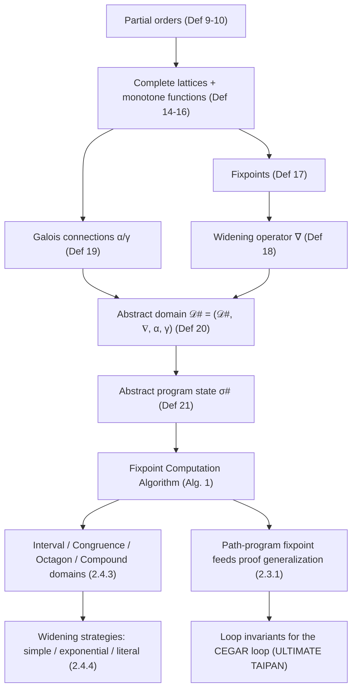

[[book-guidelines|↩ Back to guidelines]]

# Abstract Interpretation

## Why you'd want this at all

Suppose you want to prove a loop-carrying program correct without running it. You can't enumerate concrete executions — there may be infinitely many, and even for a finite program the state space explodes. So instead of tracking exact values (`x = 0`, `x = 1`, `x = 2`, ...), you track a *summary* of the set of values a variable could hold — an interval like `x ∈ [0, 100]`, say. This is the whole idea of abstract interpretation: replace the concrete semantics of a program (which manipulates concrete states) with an *abstract* semantics (which manipulates summaries of sets of concrete states), chosen so that the abstract computation is guaranteed to terminate and is guaranteed to over-approximate — never miss a real behavior — even though it may admit spurious ones.

Greitschus introduces this machinery (Section 2.2.2) because his software model-checking approach (Chapter 2) needs exactly this: given a *path program* (a program obtained by projecting the control-flow graph along one candidate error trace — see Definition 8 in the surrounding material), compute a fixpoint that either proves the path program's error location unreachable, or reports "unknown." The entire point of route through abstract interpretation, rather than pure SMT-based trace analysis, is that abstract interpretation over a complete lattice with a widening operator is *guaranteed to terminate* on programs with loops — something a naive SMT-based CEGAR loop that unwinds loops one iteration at a time cannot promise.

Before any of that machinery makes sense, you need four pieces of order theory: what it means for values to be "more or less precise" than each other (partial orders), what it means for a whole set of values to have a single best summary (complete lattices), what it means for repeatedly applying an abstract step to converge (fixpoints), and what to do when convergence isn't guaranteed on its own (widening). Then you need a principled way to relate the abstract world back to the concrete one (Galois connections) — otherwise "abstract interpretation" is just an ad hoc approximation with no soundness guarantee at all.

## Partial orders: "more precise than" as a mathematical relation

**What breaks without this.** If you don't have a formal ordering on abstract values, you can't even *state* what "the fixpoint computation is making progress" or "domain A is more precise than domain B" means — you'd be stuck comparing abstract states by eyeballing them case by case.

The book's Definition 9 (p. 17) is the standard one: a binary relation $\sqsubseteq: L \times L \to \{\text{true}, \text{false}\}$ on a set $L$ is a **partial order** if it is reflexive ($l \sqsubseteq l$), transitive ($l_1 \sqsubseteq l_2 \wedge l_2 \sqsubseteq l_3 \Rightarrow l_1 \sqsubseteq l_3$), and antisymmetric ($l_1 \sqsubseteq l_2 \wedge l_2 \sqsubseteq l_1 \Rightarrow l_1 = l_2$). The pair $(L, \sqsubseteq_L)$ is then a **partially ordered set** (Definition 10). Read $l_1 \sqsubseteq l_2$ as "$l_1$ is at least as precise as $l_2$'s over-approximation" — or equivalently, "the set of concrete values $l_1$ stands for is a subset of what $l_2$ stands for." For example, on integer intervals, $[3,3] \sqsubseteq [0,10] \sqsubseteq (-\infty,\infty)$.

This is not a total order — that's the point: $[0,5]$ and $[3,8]$ are simply incomparable, neither contains the other. That's why you need bounds (Definition 11): $l$ is an **upper bound** of a subset $M$ if every element of $M$ is $\sqsubseteq l$; a **least upper bound** ($\bigsqcup M$) is the smallest such upper bound. Lower bounds and the **greatest lower bound** ($\sqcap M$, written $\bigsqcap M$ for a set) are defined symmetrically.

A **chain** (Definition 12) is a subset that *is* totally ordered — any two of its elements are comparable. An **ascending chain** is a chain where you walk strictly upward; it **eventually stabilizes** (Definition 13) if past some index $n_0$ all further elements are equal. This stabilization property is the one you actually care about operationally: it's what makes a fixpoint computation loop terminate.

```rust
// A minimal encoding of the partial-order contract as a trait — this is
// exactly what an abstract-domain implementation in a Rust verifier must
// satisfy for the fixpoint engine to be sound.
trait PartialOrder: PartialEq {
    /// self ⊑ other
    fn leq(&self, other: &Self) -> bool;
}

// Interval example. Note: Rust's derived `PartialOrd` assumes a total
// order semantics that doesn't match "incomparable" abstract values well,
// so a hand-written `leq` (not `PartialOrd`) is the right encoding.
#[derive(Clone, Copy, Debug, PartialEq)]
enum Bound { NegInf, Val(i64), PosInf }

#[derive(Clone, Copy, Debug, PartialEq)]
struct Interval { lo: Bound, hi: Bound } // Empty interval == ⊥

impl PartialOrder for Interval {
    fn leq(&self, other: &Self) -> bool {
        // [a,b] ⊑ [c,d]  iff  c <= a  and  b <= d  (containment)
        le_bound(&other.lo, &self.lo) && le_bound(&self.hi, &other.hi)
    }
}
```

In Lean, the same contract is literally the `Preorder`/`PartialOrder` typeclasses from Mathlib — `l₁ ≤ l₂` with `le_refl`, `le_trans`, `le_antisymm` as the proof obligations. If you're building a trusted kernel around abstract interpretation, this is not an analogy: you'd want to discharge these three laws as actual Lean proof obligations for every abstract domain you register, precisely so the fixpoint engine's soundness proof can invoke them generically rather than per-domain.

## Monotone functions and complete lattices

**What breaks without this.** A partial order alone doesn't guarantee that "the least upper bound of *any* subset" exists — and the fixpoint computation algorithm needs to combine information at merge points (e.g., after an `if`) using exactly such a least upper bound. Without completeness, `⊔` and `⊓` could simply be undefined for some inputs.

Definition 14 gives the **join** ($\sqcup$) and **meet** ($\sqcap$) operators as the binary versions of least-upper-bound and greatest-lower-bound: $l_1 \sqcup l_2 = \bigsqcup\{l_1, l_2\}$, $l_1 \sqcap l_2 = \bigsqcap\{l_1, l_2\}$. Definition 15 defines **monotonicity**: $f: L \to M$ is monotone if $l \sqsubseteq_L l' \Rightarrow f(l) \sqsubseteq_M f(l')$ — informally, "more precise input never yields less precise output," which is exactly the property you need for abstract *transformers* (the functions that step an abstract state across a program statement) to be trustworthy.

A **complete lattice** (Definition 16) is a tuple $(L, \sqsubseteq_L, \bigsqcup, \bigsqcap, \bot, \top)$ where every subset of $L$ (not just pairs) has both a least upper bound and greatest lower bound, with $\bot = \bigsqcup \emptyset = \bigsqcap L$ the global minimum and $\top = \bigsqcap \emptyset = \bigsqcup L$ the global maximum. The book's worked example is the power set of $\{1,2,3\}$ ordered by inclusion — a Hasse diagram with $\emptyset$ at the bottom and $\{1,2,3\}$ at the top, joins found by "the first point where both upward paths meet."

Why completeness matters concretely: in the fixpoint algorithm, every program location starts at $\bot$ (line 1 of Algorithm 1) — "nothing is known to be reachable yet" — and the initial location is set to $\top$ — "any value is possible, before analysis narrows it." Both of those constants have to actually exist in the lattice, which is precisely what completeness guarantees.

**What breaks without this, concretely.** Consider a program with an unbounded loop incrementing a variable (the book's Figure 8: `x := 0; while(true) x := x + 1;`). The chain of values $0, 1, 2, 3, \dots$ never stabilizes — it's an infinite strictly ascending chain in $(\mathbb{Z}, \le)$. A naive fixpoint computation over this chain literally does not terminate. This motivates widening (below), but note the chain problem exists *because* $\mathbb{Z}$ under the ordinary integer order isn't itself sufficient — you need the completed lattice $(\mathbb{Z} \cup \{-\infty, +\infty\}, \le, \sup, \inf, -\infty, +\infty)$ so that $\top = \infty$ actually exists as an element to converge to.

```rust
// Monotone transformer as a trait bound — the fixpoint engine can only
// be sound if every abstract post-condition function satisfies this.
trait AbstractDomain: PartialOrder + Clone {
    fn bottom() -> Self;
    fn top() -> Self;
    fn join(&self, other: &Self) -> Self;   // ⊔
    fn meet(&self, other: &Self) -> Self;   // ⊓
}

// A transformer post# : State -> Stmt -> State is "abstract-sound" exactly
// when it is monotone in its state argument: leq(s1, s2) implies
// leq(post(s1, stmt), post(s2, stmt)).
```

## Fixpoints: what the whole computation is chasing

A **fixpoint** of a monotone function $f: L \to L$ over a complete lattice is an element $l$ such that $f(l) = l$ (Definition 17). The set of all fixpoints, $\mathrm{fxp}(f)$, itself has a least and greatest element (a consequence of the Knaster–Tarski theorem, though the book doesn't name it explicitly — it's implicit in "since $L$ is a complete lattice, $\mathrm{fxp}(f)$ has a greatest lower bound... and a least upper bound").

For a program with variable domain $(\mathbb{Z} \cup \{\pm\infty\}, \le)$, a feasible trace's sequence of states forms a chain in this lattice. If the program has loops, nothing guarantees this chain stabilizes — hence the unbounded-increment example above never reaches a fixpoint under plain evaluation.

**What this buys you, mechanically:** the fixpoint computed for a program's locations is an over-approximation of every concrete reachable state. If the fixpoint says location $\ell$'s abstract state is $\bot$, that's a *proof* $\ell$ is unreachable (since the abstract transformer, being sound, could only ever compute $\bot$ if no execution reaches it). This is the load-bearing soundness argument for the entire technique: reachability of $\top$ tells you nothing, but reachability of $\bot$ (or absence from the reachable set) is a genuine correctness certificate.

## Widening: forcing convergence when the lattice is too tall

**What breaks without this.** Even a complete lattice with $\top$ as an element doesn't guarantee that the specific ascending chain your fixpoint iteration produces reaches $\top$ (or any fixpoint) in finitely many steps — the interval domain over $\mathbb{Z} \cup \{\pm\infty\}$ has infinite ascending chains like $[0,0] \sqsubseteq [0,1] \sqsubseteq [0,2] \sqsubseteq \cdots$ that never stabilize on their own. Left alone, the naive fixpoint algorithm just keeps widening the interval by one each iteration, forever.

Definition 18 (**widening operator**) fixes this: a total function $\nabla: L \times L \to L$ is a widening operator if (1) it always returns something at least as large as either input — $l_1 \sqsubseteq (l_1 \nabla l_2)$ and $l_2 \sqsubseteq (l_1 \nabla l_2)$ — and (2) applying it repeatedly along *any* ascending chain forces eventual stabilization, i.e. for $l_n^\nabla$ defined inductively as $l_1$ (base case) or $l_{n-1}^\nabla \nabla l_n$ (step case), there exists $n_0$ such that $l_n^\nabla = l_{n_0}^\nabla$ for all $n \ge n_0$.

For the unbounded-loop example, a trivial widening operator that jumps straight to $\infty$ on the second occurrence of a widening point turns $x=0, x=1, x=2, \ldots$ into $x=0, x=1, x=\infty, x=\infty, \ldots$ — the chain stabilizes at $x = \infty$ after two steps, and the algorithm can terminate. This is deliberately crude — it's Definition 18's *minimal* example, not what you'd actually ship. Section 2.4.4 (below) is entirely about doing this less crudely.

**Where widening gets applied, algorithmically, matters as much as how it's defined.** Widening is only sound to apply — and only necessary — at *loop heads*: locations with an incoming back-edge. Apply it everywhere and you throw away precision for no reason; apply it nowhere and non-loop control-flow merges (`if`/`else` joins) still need only a *join*, not a widen, because those don't risk unbounded chains.

## Galois connections: relating the abstract world back to the concrete one

**What breaks without this.** Suppose you invent an abstract domain and a widening operator, but never establish how it relates to the *concrete* semantics you actually care about. Nothing then stops you from building an "abstraction" that's unsound (misses real behaviors) or one that's sound but has no principled way to convert concrete facts into abstract ones and back.

Definition 19 (**Galois connection**) is the standard fix. Given two complete lattices $(L, \sqsubseteq_L, \ldots)$ and $(M, \sqsubseteq_M, \ldots)$, and monotone functions $\alpha: L \to M$ (**abstraction function**) and $\gamma: M \to L$ (**concretization function**), the tuple $(L, \alpha, \gamma, M)$ is a Galois connection iff:

$$\forall l \in L: l \sqsubseteq_L \gamma(\alpha(l)) \qquad \text{and} \qquad \forall m \in M: m \sqsupseteq_M \alpha(\gamma(m))$$

Read these two inequalities as: abstracting-then-concretizing never loses information you started with (you get back *at least* what you put in — possibly more, since abstraction is lossy), and concretizing-then-abstracting never *manufactures* extra precision (you never get back something smaller than what you started with). The book's worked example: $L = 2^{\mathbb{Z}}$ (sets of integers), $M = 2^{\{-,0,+\}}$ (sets of signs), with $\alpha_{\text{sign}}(Z) = \{\mathrm{sign}(z) \mid z \in Z\}$ and $\gamma_{\text{sign}}(G) = \{z \in \mathbb{Z} \mid \mathrm{sign}(z) \in G\}$. This is the textbook sign-abstraction example, made precise: the infinitely large but exact power set of integers is mapped to the finite but imprecise power set of three sign symbols, and back.

**This is the same shape of idea as a type-checker's `isDefEq`/unification boundary, just aimed the other direction.** Where a Miller-pattern unifier tries to find the *most general* concrete solution consistent with an abstract metavariable constraint, a Galois connection formalizes losing information *deliberately* and *soundly* in the other direction — you're choosing to forget concrete detail on purpose, but you want a mathematically precise bound on how much you're allowed to forget before the abstraction becomes unsound (i.e., before $\gamma(\alpha(l))$ stops over-approximating $l$).

```lean
-- The Galois-connection shape as a structure, mirroring how you'd encode it
-- in Lean if building a trusted kernel around this abstract interpreter.
-- (Order.GaloisConnection already exists in Mathlib; this reconstructs its
-- essential shape for exposition.)
structure GaloisConnection {L M : Type} [CompleteLattice L] [CompleteLattice M]
    (α : L → M) (γ : M → L) : Prop where
  monotone_α : Monotone α
  monotone_γ : Monotone γ
  le_gamma_alpha : ∀ l : L, l ≤ γ (α l)
  alpha_gamma_le : ∀ m : M, α (γ m) ≤ m
```

Given a Galois connection, **abstract domain** (Definition 20) packages up everything needed for the fixpoint computation: $A^\# = (\mathcal{D}^\#, \nabla, \alpha, \gamma)$, where $\mathcal{D}^\#$ is a complete lattice of abstract values, $\nabla$ a widening operator on it, and $(\mathcal{D}, \alpha, \gamma, \mathcal{D}^\#)$ a Galois connection from the concrete lattice $\mathcal{D}$. An **abstract program state** (Definition 21) is then a total function $\sigma^\#: \mathrm{Var} \to \mathcal{D}^\#$, obtained from a concrete state $\sigma$ by applying $\alpha$ pointwise: $\sigma^\# = \alpha(\sigma)$.

## The fixpoint computation algorithm (Algorithm 1)

This is where the order-theoretic apparatus becomes a concrete procedure. The algorithm's input is a program $\mathcal{P} = (\mathrm{Loc}, \delta, \ell_0)$, an abstract domain $A^\# = (\mathcal{D}^\#, \nabla, \alpha, \gamma)$, and a set $\mathrm{Loc}^\nabla \subseteq \mathrm{Loc}$ of *widening locations* (loop heads). Its output is a map $f: \mathrm{Loc} \to S^\#$ assigning every location an abstract state — the fixpoint.

```text
Algorithm 1: Fixpoint Computation Algorithm
Input : Program 𝒫=(Loc,δ,ℓ₀), abstract domain A#=(𝒟#,∇,α,γ), Loc∇ ⊆ Loc
Output: f : Loc → S#

1  f := (ℓ ↦ ⊥) for all ℓ ∈ Loc          // pessimistic init: nothing reachable
2  f := f[ℓ₀ ↦ ⊤]                        // optimistic start state: anything possible
3  ℒO := {ℓ₀}                            // "open" worklist
4  while ℒO ≠ ∅ do
5      ℓ := pick and remove a location from ℒO
6      σℓ# := f(ℓ)
7      for (ℓ, s, ℓ′) ∈ δ do              // every outgoing transition of ℓ
8          σℓ′# := post#(σℓ#, s)          // apply the abstract transformer
9          if ℓ′ ∈ Loc∇ then
10             σℓ′# := f(ℓ′) ∇ σℓ′#        // loop head: widen against prior state
11         else
12             σℓ′# := f(ℓ′) ⊔ σℓ′#        // ordinary merge: join
13         end
14         if σℓ′# ⋢ f(ℓ′) then           // did the state actually get bigger?
15             f := f[ℓ′ ↦ σℓ′#]
16             ℒO := ℒO ∪ {ℓ′}            // re-visit ℓ′'s successors
17         end
18     end
19 end
20 return f
```

Walking through the design decisions:

- **Line 1–2 (initialization).** Every location starts at $\bot$ — "unreachable until proven otherwise" — except the entry location $\ell_0$, which starts at $\top$ — "any input is possible." This is the standard forward, reachability-flavored abstract interpretation setup (as opposed to a backward, weakest-precondition-flavored one).
- **Lines 9–12 (widen vs. join).** The choice between widening and joining is entirely determined by whether the *target* location is a widening location. This is what stops widening from being applied gratuitously at every control-flow merge — a widening location is specifically one with an incoming back-edge (a loop head), where an ascending chain could otherwise be unbounded.
- **Line 14 (fixpoint check).** The core worklist-algorithm idiom: a location is only re-added to the open set if its abstract state actually grew — $\sigma_{\ell'}^\# \not\sqsubseteq f(\ell')$. Once no location's state can grow any further, the algorithm has literally reached a fixpoint of the abstract transition system, and termination follows from the fact that widening at loop heads forces every ascending chain touched by the algorithm to eventually stabilize (Definition 18's second clause, applied per-location).
- **Termination depends entirely on the choice of $\mathrm{Loc}^\nabla$.** The book is explicit that soundness of termination requires $\mathrm{Loc}^\nabla$ to contain (at least) every loop head — a location with two outgoing transitions, one entering the loop body (which eventually returns to the head) and one exiting past the loop.
- **What a $\bot$ result actually certifies.** If the fixpoint computation terminates with some location's abstract state at $\bot$, that is a *proof* that location is unreachable — the abstract transformer, being sound, can only produce $\bot$ when no concrete execution reaches that point. This is exactly the mechanism the rest of Chapter 2 (trace abstraction, Hoare-triple generalization) hooks into: an abstract-interpretation fixpoint over a path program that proves the program's error location is $\bot$-reachable *is* a loop invariant.

```rust
// A direct transliteration of Algorithm 1. This is close to what
// ULTIMATE's `FixpointEngine` actually does (per Section 2.4.2).
use std::collections::{HashMap, HashSet, VecDeque};

fn fixpoint<D: AbstractDomain>(
    prog: &Program,
    is_widening_loc: impl Fn(LocId) -> bool,
    post: impl Fn(&D, &Stmt) -> D,
) -> HashMap<LocId, D> {
    let mut f: HashMap<LocId, D> =
        prog.locations().map(|l| (l, D::bottom())).collect();
    f.insert(prog.entry(), D::top());

    let mut open: VecDeque<LocId> = VecDeque::from([prog.entry()]);
    let mut in_open: HashSet<LocId> = HashSet::from([prog.entry()]);

    while let Some(l) = open.pop_front() {
        in_open.remove(&l);
        let sigma_l = f[&l].clone();
        for (stmt, l_prime) in prog.successors(l) {
            let mut sigma_l_prime = post(&sigma_l, &stmt);
            sigma_l_prime = if is_widening_loc(l_prime) {
                f[&l_prime].widen(&sigma_l_prime)   // ∇
            } else {
                f[&l_prime].join(&sigma_l_prime)     // ⊔
            };
            if !sigma_l_prime.leq(&f[&l_prime]) {
                f.insert(l_prime, sigma_l_prime);
                if in_open.insert(l_prime) {
                    open.push_back(l_prime);
                }
            }
        }
    }
    f
}
```

## Abstract domains: what actually fills in $\mathcal{D}^\#$

Section 2.4.3 describes the domains ULTIMATE ABSTRACT INTERPRETATION actually implements. Two are **non-relational** (each variable's abstract value is tracked independently), one is **relational** (tracks pairwise constraints between variables), and one is a generic combinator over any set of domains.

**The precision problem non-relational domains share.** If an `assume` statement constrains multiple variables jointly (e.g. `assume x == y`), a non-relational domain can't update each variable's abstract value independently and stay precise — the naive fix ("evaluate the condition, if it can be true keep the old state unchanged") is sound but throws away everything the assumption told you. The book's fix is an **expression-evaluation algorithm**: build an expression tree for the assumed Boolean expression, propagate interval-valued bounds down and back up the tree (inverting arithmetic operators as needed, e.g. turning `y == x - 5` around to solve for `y`), and combine the two sides with the meet operator ($\sqcap$). Worked example (their Figure 16): starting from $\sigma^\# = (x \in [0,10], y \in [5,15])$ and `assume x == (y + 5)`, evaluating both subtrees and meeting the results yields the precise $(x \in [10,10], y \in [5,5])$ — strictly tighter than either side alone.

### Interval domain

The simplest non-relational domain: each variable gets an interval $[a,b]$, $a,b \in \mathbb{R} \cup \{-\infty,\infty\}$. $\bot$ is the empty interval, $\top$ is $(-\infty,\infty)$. Because concrete comparisons like `x < y` can be indeterminate over interval abstractions (e.g. $x \in [0,10], y \in [5,15]$: could go either way), comparisons return a **three-valued Boolean** — `true`, `false`, or $\top$ — true only if the concrete comparison holds for *every* pair of values in both intervals, false only if it holds for *no* pair, $\top$ otherwise. Arithmetic ($+, -, \times, \div, \bmod$) and join/meet ($\sqcup([a_1,b_1],[a_2,b_2]) = [\min(a_1,a_2), \max(b_1,b_2)]$; $\sqcap$ analogously with $\max$/$\min$, or $\emptyset$ if the result is invalid) are all defined componentwise, and lifted to whole abstract states by applying them independently, variable by variable — which is precisely what "non-relational" means operationally.

### Congruence domain

Based on Granger's divisibility congruences: each variable's value is either a known concrete constant, or a set $a\mathbb{Z} \setminus C$ (all multiples of $a$, optionally excluding $0$). $\top = 1\mathbb{Z} \setminus \{\}$ ("any integer"). This is deliberately imprecise about *magnitude* but precise about *divisibility* — for `z := x * y` where `x` is known constant $2$, the domain correctly infers $z \in 2\mathbb{Z} \setminus \{0\}$ regardless of what `y` is. The dissertation's stated motivation for including a domain this coarse: C-to-Boogie translation encodes integer overflow as modular arithmetic (`x := (4294967295 + 1) % 4294967295`), and the congruence domain is the *only* implemented domain that tracks this kind of fact precisely — intervals and octagons can't represent "divisible by $2^{32}$" at all.

### Octagon domain

The relational domain (Miné's octagons), storing constraints of the form $\pm v_i - \pm v_j \le c$ for every pair of variables in a **difference bound matrix (DBM)**. This subsumes plain intervals (via $+v_i - (-v_i) \le c$-style self-constraints) and adds genuine pairwise relations like $x - y \le 10$ that an interval domain structurally cannot express. Because relational constraints induce *transitive* dependencies ($a \le b+1 \wedge b \le c+2 \Rightarrow a \le c+3$), the domain runs a **closure algorithm** (strong closure for real-valued variables, tight closure for integers, both $\mathcal{O}(n^3)$ in the variable count) to propagate these — computed lazily, only when values are actually read, since it's the dominant cost. Join and meet are elementwise $\max$/$\min$ over the DBM entries. Non-affine or too-large expressions get projected down to intervals for evaluation, at a known precision cost.

This is the domain the book's Section 2.1 motivating example needs: a relational loop invariant like "$x = y$ throughout the loop" is unrepresentable in a non-relational domain no matter how it's tuned, but falls directly out of an octagon constraint.

### Compound domain and reduced product

The **compound domain** $C = (D_1, \ldots, D_n)$ is a plain Cartesian product: run every operation ($\mathrm{post}^\#$, $\nabla$, $\sqcup$, $\sqcap$) on each wrapped domain independently and pair up the results, $\sigma^\# = (\sigma_1^\#, \ldots, \sigma_n^\#)$ with componentwise order $p \sqsubseteq_C q \iff \bigwedge_i p_i \sqsubseteq_i q_i$. This lets ULTIMATE combine, say, the fast-but-blind congruence domain with the precise-but-divisibility-blind octagon domain, running both and keeping both results — no domain's weakness is hidden, but also no domain's strength leaks into the other's computation unless you go further.

That "going further" is **reduced product** (Definition 24), and it's the theoretically sharper construction:

$$S = \{\rho(r) \mid r \in \mathcal{D}_C^\#\}, \qquad \rho(r) = \bigsqcap\{r' \mid \gamma_C(r) \sqsubseteq_C \gamma_C(r')\}$$

i.e. $\rho$ maps every compound state to the *most precise* compound state with the same concretization — the greatest lower bound of everything that concretizes to the same set. $\rho$ must be **reductive** ($\rho(r) \sqsubseteq_C r$ — it never loses information) and **sound** ($\gamma_C(\rho(r)) = \gamma_C(r)$ — it never adds spurious precision). The book's worked example (from Cortesi et al.): with an interval-and-parity compound domain, $\rho([2,4], \mathrm{odd}) = \rho([2,3], \mathrm{odd}) = \rho([3,4], \mathrm{odd}) = ([3,3], \mathrm{odd})$ — knowing "between 2 and 4" *and* "odd" pins the value down to exactly 3, information neither domain alone captures, and the reduction operator is what makes that cross-domain inference explicit.

Practically, Greitschus's implementation stops short of a general reduction operator $\rho$ (noting it would need to be defined per *combination* of domains, which doesn't compose modularly) and instead does something weaker but cheaper: before each `post#` call, it *assumes* the conjunction of all domains' current state assertions as extra information fed back into each domain. His own worked example: interval domain has $x \in [1,5]$, congruence domain independently has $x \in 2\mathbb{Z}\setminus\{0\}$ (even); assuming $\phi \equiv x \ge 1 \wedge x \le 5 \wedge x \bmod 2 = 0$ before the next `post#` sharpens the interval side to $x \in [2,4]$. This is a **cheap, non-modular approximation of reduced product** — a design tradeoff worth remembering if you're building your own CSP-style domain-propagation kernel: full reduced product buys the most precision but costs a hand-written reduction rule per domain-pair, whereas "assume-and-reproject" buys a chunk of the same precision generically, at some redundant recomputation cost.

```rust
// The compound-domain shape — the natural "product of typestates" pattern
// if you're building a Rust CSP/domain-propagation kernel (per the
// project's dependent/refinement-type compiler goals): each constituent
// domain is a propagator, and the compound domain's post#/widen/join/meet
// are literally "run every propagator, pair up the results."
struct Compound<const N: usize> {
    states: [Box<dyn AbstractDomainDyn>; N],
}

impl<const N: usize> Compound<N> {
    fn post(&self, stmt: &Stmt) -> Self {
        Compound {
            states: self.states.each_ref().map(|d| d.post(stmt)),
        }
        // A reduced-product-style refinement would insert, right here,
        // a `reduce(&mut states)` step: assume each domain's derived
        // predicate into every other domain before returning — exactly
        // the CHC-propagation / constraint-satisfaction pattern named in
        // this workbench's standing goals (domain/lattice propagation
        // over a compound abstract-and-CSP kernel).
    }
}
```

## Widening strategies (Section 2.4.4)

Simple widening — jump straight to $\top$ the moment a widening-location's value changes — is *sound* and *guarantees* single-step stabilization (satisfying Definition 18 trivially), but it throws away essentially all precision the instant a loop is entered. The book presents three progressively less destructive strategies, all applied only where Algorithm 1 calls for $\nabla$ (line 10).

- **Simple widening.** $v_1 \ne v_2 \Rightarrow v_1 \nabla v_2 = \top$ (removes the bound entirely). Fast, terrible precision — a baseline, not a real strategy.

- **Exponential widening.** Instead of jumping straight to $\infty$, grow the bound *exponentially* (doubling, roughly — the book's $e(v) = 2v$ in the general case) up to a configured bound $b$, only collapsing to $\infty$ once the value exceeds $b$. Small values near zero get special-cased with a threshold $\varepsilon$ so the operator doesn't get stuck oscillating around $0$. The intuition: most loop counters that do eventually blow past any fixed threshold do so by roughly doubling their reachable range each widening application, so exponential growth converges in $\mathcal{O}(\log b)$ steps rather than one, while (unlike simple widening) still preserving *some* bound information for many more iterations.

- **Literal widening.** Rather than growing toward $\infty$ by a fixed schedule, widen toward the nearest *program literal* — a numeric constant that actually occurs in the source program's statements, in the direction of growth — before falling back to $\pm\infty$ once no further literal exists past the current value. This directly exploits the very common pattern of loop bounds being literal constants (`while (x < 100)`): if the loop condition compares against 100, literal widening will try $x \le 100$ before giving up to $\top$, which is often *exactly* the invariant you need and simple/exponential widening would never propose on its own.

- **Congruence-domain widening.** Neither exponential nor literal widening make sense for a domain whose values aren't real-valued bounds at all — the congruence domain doesn't have a notion of "closer to $\infty$." Instead, the book observes that the congruence domain's *join* operator already produces an eventually-stabilizing ascending chain on its own (a consequence of GCDs only ever getting smaller, bottoming out), so **join is reused as widening** for this domain. This is a nice illustration that "widening" isn't a fixed algorithm but a *contract* (Definition 18) — sometimes an existing operator already satisfies it and there's no need to invent a separate one.

The three real-valued strategies trade off identically along one axis: **speed of stabilization vs. retained precision**. Simple widening stabilizes fastest and loses the most; literal widening is the most surgical (when the program's structure cooperates) but can degrade to simple widening's worst case when no useful literals exist; exponential widening sits in between, giving a tunable, bounded number of "grace" iterations regardless of program structure.

```python
# A compact illustration of the three real-valued strategies operating on
# a single scalar bound (not a full interval domain) — enough to see the
# shape of the decision each one makes.
def simple_widen(v1, v2):
    return v1 if v1 == v2 else float('inf') if v2 > v1 else float('-inf')

def exponential_widen(v1, v2, bound, eps=1e-6):
    if v1 == v2:
        return v1
    def e(v):
        if v > 2*eps: return 2*v
        if v > 0:     return eps
        if v > -2*eps: return 0
        return 2*v  # v <= -2*eps, growing toward -inf symmetrically
    if v2 > v1:
        return float('inf') if bound < v2 else min(bound, e(v2))
    else:
        return float('-inf') if v2 < -bound else max(-bound, e(v2))

def literal_widen(v1, v2, literals):
    if v1 == v2:
        return v1
    lits = sorted(literals)
    if v2 > v1:
        candidates = [l for l in lits if l >= v2]
        return min(candidates) if candidates else float('inf')
    else:
        candidates = [l for l in lits if l <= v2]
        return max(candidates) if candidates else float('-inf')
```

## Where this leads



Within the book's own structure: this section is the mathematical engine underneath everything else in Chapter 2. Section 2.3's CEGAR algorithm calls Algorithm 1 directly, on *path programs* rather than the whole program at once — precisely because restricting the input program limits how much precision is lost to joins at each fixpoint step. Section 2.3.1 then turns a successful fixpoint's abstract states directly into a set of valid Hoare triples (a proof), sidestepping expensive SMT queries via the abstract-transformer-based checker `htc#`. Section 2.4.6 (dynamic block encoding) is a direct consequence of the interval domain's expressiveness limits documented above — the fact that intervals can't represent $b' = a'$ is exactly why conjunct ordering in a transition formula changes the precision of `post#`.

For the standing project of building a Rust-based refinement-type compiler with an embedded CSP/theorem-prover kernel: this section is close to a direct blueprint. The `PartialOrder` / `AbstractDomain` traits above are the load-bearing interface your invariant-generation pass needs; the Galois connection is the formal contract your soundness argument for "abstract interpretation over-approximates" rests on; the compound-domain / reduced-product distinction is exactly the tradeoff you'll face when combining, say, an interval propagator with a domain over algebraic data structures represented as DFA-style automata (per this workbench's stated CSP goals) — full reduced product gives maximum precision at the cost of per-pair reduction rules, while an "assume-and-reproject" compound domain gives you most of the benefit for free. And Definition 20's abstract domain tuple — a lattice, a widening operator, and a Galois connection to the concrete semantics — is essentially the type signature every abstract domain plugin in such a kernel needs to implement, whether it's intervals, octagons, or a bespoke automaton-shaped domain over inductive data structures.
