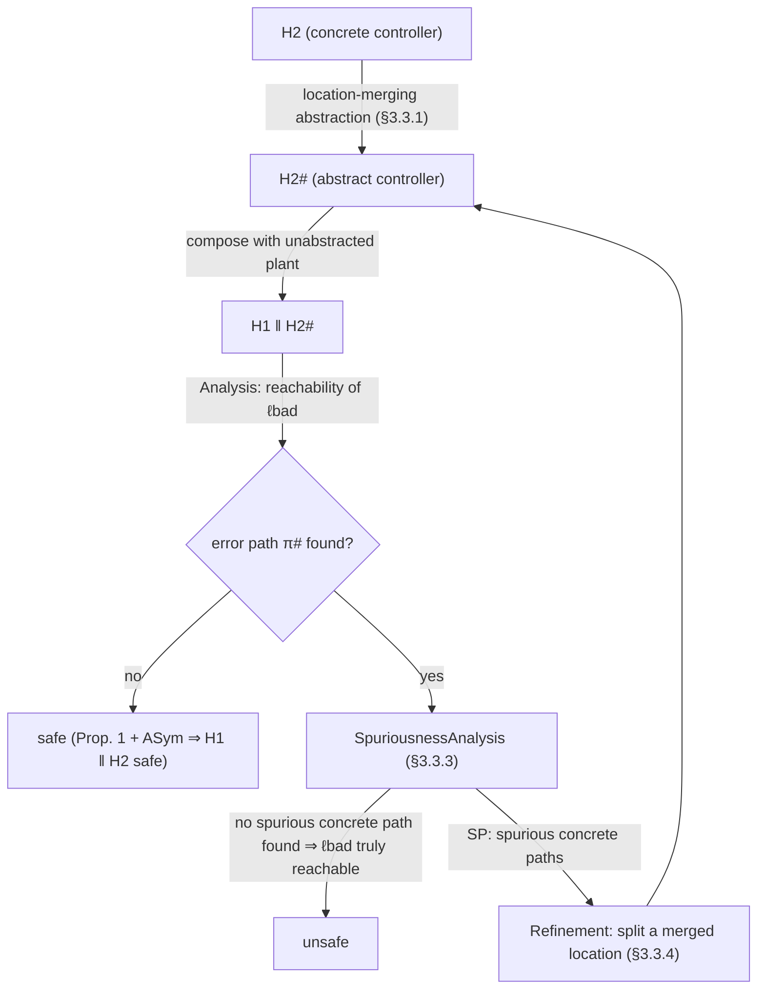

# Assume-Guarantee Reasoning for Hybrid Systems

↩ [[book-guidelines|Back to guidelines]] · prerequisite: [[Hybrid-Automata-and-Their-Semantics]] (Defs. 25–32: affine hybrid automata, states, traces, safety, symbolic paths)

## The problem: composition makes reachability blow up

A hybrid automaton — as [[Hybrid-Automata-and-Their-Semantics]] sets up — is already expensive to analyze: every reachable *region* has to be propagated through continuous flows and discrete jumps, and each branch in the automaton multiplies the number of regions that must be tracked. Now compose two of them, a plant $\mathcal{H}_1$ and a controller $\mathcal{H}_2$, running in parallel ($\mathcal{H}_1 \| \mathcal{H}_2$). If the controller has $k$ discrete options per decision point and makes $n$ decisions, a monolithic analysis of $\mathcal{H}_1 \| \mathcal{H}_2$ has to consider on the order of $k^n$ branches — because the analysis can't tell, ahead of time, which of the controller's options are actually relevant to the safety property being checked.

This is the same shape of problem CEGAR (counterexample-guided abstraction refinement) solves for software: don't analyze the exact system, analyze a coarser one, and refine only where the coarseness actually causes a false alarm. What's new here is *compositionality*: instead of abstracting the whole system, the thesis abstracts **only the controller**, leaving the plant untouched. This is a deliberate, structural choice, and it is what the chapter is built around. Understanding *why* it's sound requires a short detour into assume-guarantee reasoning.

## From first principles: why "assume-guarantee" instead of "just abstract everything"

Standard CEGAR abstracts the whole transition system and refines wherever a spurious counterexample points. For hybrid systems that's expensive and doesn't exploit structure: a plant/controller decomposition is usually known ahead of time, and only one side (typically the controller, which is often a large discrete-ish state machine) is where the combinatorial blow-up lives. Compositional verification asks: can we verify $\mathcal{H}_1$ and $\mathcal{H}_2$ mostly *separately*, and combine the results?

The classical answer is assume-guarantee (AG) reasoning: to prove a property $P$ of $\mathcal{H}_1 \| \mathcal{H}_2$, find an *assumption* $A$ — a description of $\mathcal{H}_2$'s behavior that's coarser than $\mathcal{H}_2$ itself but still faithful enough to be useful — such that:

$$
\textbf{Rule ASym:} \quad
\frac{\mathcal{H}_1 \| A \models P \qquad \mathcal{H}_2 \models A}{\mathcal{H}_1 \| \mathcal{H}_2 \models P}
$$

Read the two premises as two separate proof obligations, each smaller than the original:

1. **Premise 1** ($\mathcal{H}_1 \| A \models P$): if you swap out the real controller for the assumption $A$, the plant still satisfies $P$. This is a verification task over $\mathcal{H}_1$ composed with something *simpler* than $\mathcal{H}_2$.
2. **Premise 2** ($\mathcal{H}_2 \models A$): the real controller actually behaves within the bounds described by $A$ — i.e., $A$ is a faithful (over-)description of $\mathcal{H}_2$.

If both hold, the conclusion $\mathcal{H}_1 \| \mathcal{H}_2 \models P$ follows for free — no need to ever construct or analyze the full product system. This is *the* payoff of AG reasoning: it turns one hard, exponential verification problem into two smaller ones.

**[[Counterexample-Guided-Abstraction-Refinement-(CEGAR)#What breaks without it|What breaks without it]].** The catch is premise 2: finding an assumption $A$ that is simultaneously (a) simple enough that premise 1 is tractable and (b) accurate enough that $\mathcal{H}_2 \models A$ actually holds is, in general, exactly as hard as the original problem — this is the crux that makes AG reasoning historically hard to automate (classical work like Păsăreanu et al.'s $L^*$-based learning approach targets exactly this: automatically *learning* $A$).

**The move made here.** Sidestep the search for $A$ by construction: let $A$ be an **over-approximation** of $\mathcal{H}_2$ — call it $\mathcal{H}_2^{\#}$ — built directly from $\mathcal{H}_2$'s syntax by *merging locations*. Because $\mathcal{H}_2^{\#}$ is constructed to over-approximate $\mathcal{H}_2$'s behavior by design, premise 2 ($\mathcal{H}_2 \models \mathcal{H}_2^{\#}$, i.e. every behavior of $\mathcal{H}_2$ is also a behavior of $\mathcal{H}_2^{\#}$) holds **automatically**, with no proof obligation left to discharge. All the real work goes into premise 1: checking $\mathcal{H}_1 \| \mathcal{H}_2^{\#} \models P$, and — if that fails — deciding whether the failure is real or an artifact of over-approximation, and refining $\mathcal{H}_2^{\#}$ if it's an artifact. That refinement loop is a CEGAR loop where the abstraction is *compositional*: only the controller side is ever abstracted or refined; the plant $\mathcal{H}_1$ is never touched.



## Location merging: the concrete abstraction mechanism

### Motivating example first

The book's own tank-and-controller toy example (Fig. 22) makes the intuition concrete before any formalism. The plant $\mathcal{H}_1$ evolves a variable $x$ via $\dot{x}(t) = v$ for up to $1000$ time units. The controller $\mathcal{H}_2$ runs in iterations of length $10$ time units; each iteration it picks one of three options, setting $v$ to $1$, $2$, or $3$. Naively unwound, this gives $3^n$ branches over $n$ iterations of the controller.

But suppose the safety property only cares about bounds on $v$ (e.g. "$x = 4000$ is never reached within $1000$ time units"). Then replace the three locations $\ell_1, \ell_2, \ell_3$ (with $v = 1$, $v = 1$, $v = 3$ respectively — note two of the three even coincide) by a single merged location $\ell^{\#}$ whose invariant is the *interval bound* $1 \le v \le 3$ instead of the exact values. That single merge turns the exponential branching into a single self-loop — linear in the number of iterations.

**What if this abstraction is too coarse?** Consider a tighter property: "at $t = 2$, $v \ne 2.5$." The merged automaton's invariant $1 \le v \le 3$ doesn't rule this out — it produces a *spurious* counterexample. The fix is targeted: split $\ell^{\#}$ back into two locations, one with $v = 1$ and one with $2 \le v \le 3$ (not all the way back to three separate locations — just enough to eliminate the specific spuriousness). This is the whole refinement idea in miniature: merge coarsely, split only exactly as much as a concrete counterexample demands.

The reason this technique targets **stratified controllers** specifically: a stratified controller's locations naturally partition into *strata* (layers), where each stratum groups the controller's alternative options for one decision (e.g. "which of these $k$ throughput settings to pick this cycle"). Merging locations *within* a stratum is safe and natural because those locations are mutually exclusive alternatives for the same decision — merging plant locations instead would conflate physically distinct dynamical regimes and likely produce useless, wildly imprecise abstractions.

### Formalizing the merge (Defs. 33–35)

The abstraction function and its inverse are, in effect, a partition-with-representatives pair over locations:

- **Location abstraction function** $\alpha: \mathrm{Loc} \to \mathrm{Loc}^{\#}$ (Def. 33) maps every concrete location to the abstract (merged) location it becomes part of.
- **Location concretization function** $\alpha^{-1}: \mathrm{Loc}^{\#} \to 2^{\mathrm{Loc}}$ (Def. 34) is the inverse: given a merged location, which concrete locations were folded into it.

The interesting content is in **Definition 35 (Location-Merging Abstraction)**, which says exactly how every component of $\mathcal{H}_2^{\#} = (\mathrm{Loc}^{\#}, \mathrm{Var}^{\#}, \mathrm{Init}^{\#}, \mathrm{Flow}^{\#}, \mathrm{Trans}^{\#}, \mathrm{Inv}^{\#})$ is built from $\mathcal{H}_2$:

- **Variables** are untouched: $\mathrm{Var}^{\#} = \mathrm{Var}$.
- **Initial conditions and invariants** at a merged location are the **convex hull of the disjunction** of the corresponding concrete conditions:
$$
\mathrm{Inv}^{\#}(\ell^{\#}) = \mathcal{CH}\Big(\bigvee_{\ell \in \alpha^{-1}(\ell^{\#})} \mathrm{Inv}(\ell)\Big)
$$
  i.e., take every point satisfying *any* of the merged locations' invariants, and cover them all with their convex hull. This is exactly the over-approximation step: the merged invariant admits everything the concrete invariants did, plus whatever extra points the hull adds.
- **Transitions** are unioned structurally: an edge exists between abstract locations $\ell^{\#}, \hat\ell^{\#}$ iff *some* concrete edge connected *some* representative of $\ell^{\#}$ to *some* representative of $\hat\ell^{\#}$. Figure 26 spells out the bookkeeping cases: a transition *within* a merged location becomes a self-loop; incoming/outgoing transitions get redirected to/from the merged location; self-loops on merged concrete locations persist.
- **The bad location is never merged**: $|\alpha^{-1}(\ell^{\#}_{\mathrm{bad}})| = 1$. This is a load-bearing side condition — the whole point of the abstraction is to decide reachability of exactly this location, so it must remain a first-class, unambiguous target.

### The trickiest part: merging continuous dynamics

Merging discrete structure (invariants, transitions) is comparatively simple set algebra. Merging the *continuous evolutions* $\dot{x}(t) = Ax(t) + u(t)$ of several locations into one is the genuinely interesting step, and it uses **differential inclusion**:

1. For each concrete location $\ell$ being merged, eliminate the *unprimed* state variables from the flow constraint (existentially quantify them out), keeping only the constraint over the *derivatives* $\dot x$, restricted by that location's invariant:
$$
F_\ell = \exists\, x \in \mathbb{R}^n : \big(\mathrm{Flow}(\ell)(x, \dot x) \wedge \mathrm{Inv}(\ell)(x)\big)
$$
   Intuitively: "given that $x$ must satisfy this location's invariant, what derivatives are reachable?" — this projects a full flow specification down to a constraint purely on rates of change.
2. Take the **convex hull of the union** of all these derivative-constraints across the merged locations:
$$
\mathrm{Flow}^{\#}(\ell^{\#})(x, \dot x) = \mathcal{CH}\Big(\bigcup_{\ell \in \alpha^{-1}(\ell^{\#})} F_\ell\Big)
$$

The book's worked example (Fig. 25) makes this tangible: two locations $\ell_1, \ell_2$ with different affine dynamics over $(x, y)$ and different invariants each produce a derivative-constraint polytope $F_1$, $F_2$ in the $(\dot x, \dot y)$-plane; the merged location's evolution is the convex hull enclosing both. If a location was *not* actually merged with anything ($|\alpha^{-1}(\ell^{\#})| = 1$), its exact concrete flow is kept unchanged — there's no reason to introduce imprecision where no merging happened.

**Why this guarantees soundness (Proposition 1).** Every component of $\mathcal{H}_2^{\#}$ is either carried over exactly or deliberately over-approximated (never under-approximated), and $\mathrm{Loc}^{\#}$ has at most as many locations as $\mathrm{Loc}$. So the reachable region space of $\mathcal{H}_2^{\#}$ is a *superset* of the reachable region space of $\mathcal{H}_2$ (with the correspondence given by $\alpha/\alpha^{-1}$). Hence: if $\ell^{\#}_{\mathrm{bad}}$ is unreachable in the abstraction, $\ell_{\mathrm{bad}}$ is unreachable in the concrete system. This is precisely what feeds premise 2 of rule ASym "for free," as discussed above.

### Rust sketch: the abstraction as a data structure

Location merging is fundamentally a union-find-shaped operation over automaton locations, with per-partition-class payload computation (convex hulls). A skeleton that mirrors Def. 33–35 directly:

```rust
use std::collections::HashMap;

type LocId = usize;

struct Polytope { /* half-space representation: A x <= b */ }

impl Polytope {
    /// Existentially quantify out `vars`, leaving a constraint over
    /// the remaining (derivative) variables — Fourier-Motzkin or an
    /// LP-based projection in a real implementation.
    fn project_out(&self, vars: &[usize]) -> Polytope { todo!() }
    fn convex_hull(sets: &[Polytope]) -> Polytope { todo!() }
    fn union_disjunction(sets: &[Polytope]) -> Polytope { todo!() } // as a single hull input
}

struct HybridAutomaton {
    locations: Vec<LocId>,
    invariant: HashMap<LocId, Polytope>,
    flow: HashMap<LocId, Polytope>,   // constraint over derivatives (A, U) folded in
    bad: LocId,
}

/// alpha: concrete location -> abstract (merged) location id.
/// This *is* Def. 33; its fibers alpha^-1(l#) are exactly Def. 34.
struct LocationMerge {
    alpha: HashMap<LocId, LocId>,
}

impl LocationMerge {
    fn concretize(&self, abstract_loc: LocId) -> Vec<LocId> {
        self.alpha.iter()
            .filter(|(_, &a)| a == abstract_loc)
            .map(|(&c, _)| c)
            .collect()
    }

    /// Def. 35: build H2# from H2 and this partition.
    fn build_abstraction(&self, concrete: &HybridAutomaton) -> HybridAutomaton {
        assert_eq!(self.concretize(self.alpha[&concrete.bad]).len(), 1,
                   "bad location must never be merged (Def. 35, side condition)");

        let abstract_locs: Vec<LocId> = self.alpha.values().copied().collect();
        let mut invariant = HashMap::new();
        let mut flow = HashMap::new();

        for &l_hash in &abstract_locs {
            let members = self.concretize(l_hash);
            if members.len() == 1 {
                // no merging happened here: keep the concrete flow exactly
                flow.insert(l_hash, concrete.flow[&members[0]].clone());
            } else {
                let projected: Vec<Polytope> = members.iter()
                    .map(|l| concrete.flow[l].project_out(/* unprimed state vars */ &[]))
                    .collect();
                flow.insert(l_hash, Polytope::convex_hull(&projected));
            }
            let invs: Vec<Polytope> = members.iter().map(|l| concrete.invariant[l].clone()).collect();
            invariant.insert(l_hash, Polytope::convex_hull(&invs));
        }
        // transitions built analogously from Fig. 26's three structural cases (omitted)
        HybridAutomaton { locations: abstract_locs, invariant, flow, bad: self.alpha[&concrete.bad] }
    }
}
```

The point of writing it this way is that the *soundness argument* (Prop. 1) is visible in the types: nothing in `build_abstraction` can shrink a region — every operation is either an identity copy or a hull, and hulls are monotonic supersets by construction.

## The compositional CEGAR loop (Algorithm 4)

With the abstraction mechanism in hand, the loop is exactly the diagram sketched earlier, spelled out as pseudocode in the book:

```
Algorithm 4: CompositionalAnalysis(N = H1 ‖ H2)
  H2# := ConstructAbstraction(H2)
  loop:
    π# := Analysis(H1 ‖ H2#)             # reachability search for ℓbad
    if π# is empty:
      return "safe"                       # Prop. 1 + ASym ⇒ N is safe
    SP := SpuriousnessAnalysis(N, H2#, π#)
    if SP is empty:
      return "unsafe"                      # ℓbad genuinely reachable in N
    H2# := Refinement(H2#, SP)             # split a merged location
```

Termination is not obvious a priori — refinement could in principle loop forever — but it's guaranteed by construction: **Proposition 2** shows every call to `Refinement` strictly increases the number of locations in $\mathcal{H}_2^{\#}$ by exactly one, and $|\mathrm{Loc}^{\#}|$ is bounded above by $|\mathrm{Loc}|$. In the absolute worst case the abstraction is refined all the way back to the concrete controller, at which point the analysis is exactly as expensive as the unabstracted problem — but no more.

### Spuriousness analysis (Algorithm 5): walking the concrete shadow of an abstract path

Given an abstract error path $\pi^{\#} = s_0^{\#} \dots s_m^{\#}$ ending in $\ell^{\#}_{\mathrm{bad}}$, the question is: does *some* concrete path through the corresponding concrete locations also reach $\ell_{\mathrm{bad}}$?

The algorithm is a breadth-first exploration that walks *in lockstep* with the abstract path, but using the exact concrete update functions $\mathrm{cont}_{\mathcal{R}}$ and $\mathrm{disc}_{\mathcal{R}}$ (not the abstract ones) at every step:

- Start from the concrete initial states that correspond to the abstract path's first location, $\alpha^{-1}(s_0^{\#}) \cap \mathcal{I}$.
- At each step, apply the concrete continuous update, then look for concrete discrete successors whose target location is among $\alpha^{-1}(s_{i+1}^{\#})$ — i.e., "does the next hop of the abstract path actually correspond to a real transition here?"
- If at any point there's no matching concrete discrete successor (`S' = ∅`), that branch of concrete exploration dead-ends — the branch is stored as a *spurious* witness.
- If the walk survives all the way to position $m$ (the last abstract state) and the resulting concrete state's location really is $\ell_{\mathrm{bad}}$, the counterexample is **real** — return the empty set, signaling "not spurious," and the analysis stops (case handled by line 9 of Algorithm 4).
- Otherwise, every dead-ending branch is collected into the result set $\mathcal{SP}$: pairs $(\pi^{\#}, \pi)$ of the abstract path and the longest concrete path that could be built while shadowing it.

This is a concretization search, not a full re-verification — it reuses exactly the same $\mathrm{cont}_{\mathcal{R}}/\mathrm{disc}_{\mathcal{R}}$ machinery the concrete system's own analysis would use, so wherever it succeeds it's exact, not another layer of over-approximation.

### Refinement (Section 3.3.4): split as little as possible

Once $\mathcal{SP}$ is nonempty, refinement picks the tuple $(\pi^{\#}, \pi_{\max})$ containing the **longest** concrete path — the one that survived deepest before failing to shadow the abstract path — because no other concrete path could possibly extend further. The refinement then has exactly three structural cases, illustrated in Fig. 27:

1. **No concrete edge exists at all** between any representative of the last merged location and the representative(s) of the next abstract location. Split the offending merged location in two: the specific representative the concrete path was heading toward, versus the rest.
2. **A concrete edge exists, but the target location's invariant rejects the concrete valuation** (e.g. merged invariant is $0 \le x \le 10$ from two pieces $0 \le x \le 4$ and $6 \le x \le 10$; the abstract transition can fire at $x=5$, but neither concrete piece can). Split the *target* merged location.
3. **Fallback**: neither the last nor the next location on the path can be split (both are already unmerged). Walk backward along $\pi^{\#}$ to the most recent merged location and split *that* one instead — this guarantees progress even when the immediate failure point offers nothing to split.

Case 3 is the reason **Proposition 2** (strict progress: $+1$ location per refinement call) holds unconditionally: if no location anywhere on $\pi^{\#}$ were splittable, every location on the path would already be unmerged, meaning $\pi^{\#}$ *is* a concrete error path — but then `SpuriousnessAnalysis` would have already classified it as non-spurious, and `Refinement` would never have been invoked. So a splittable location is guaranteed to exist whenever refinement actually runs.

## Soundness and relative completeness

Two theorems close out the theoretical core of the chapter, and both are short precisely *because* the heavy lifting was already done by Proposition 1 (abstraction is sound) and Proposition 2 (refinement terminates):

> **Theorem 1 (Soundness).** If the compositional analysis proves $\mathcal{H}_1 \| \mathcal{H}_2^{\#}$ cannot reach $\ell^{\#}_{\mathrm{bad}}$, then $\mathcal{N} = \mathcal{H}_1 \| \mathcal{H}_2$ cannot reach $\ell_{\mathrm{bad}}$.

The proof is literally "chain Proposition 1 with rule ASym": Prop. 1 gives $\mathcal{H}_2^{\#}$-safe $\Rightarrow \mathcal{H}_2^{\#}$ is a valid over-approximating assumption; ASym's two premises are then satisfied ($\mathcal{H}_1 \| \mathcal{H}_2^{\#} \models P$ directly from the algorithm's success, and $\mathcal{H}_2 \models \mathcal{H}_2^{\#}$ by construction), so the rule discharges $\mathcal{H}_1 \| \mathcal{H}_2 \models P$.

> **Theorem 2 (Relative Completeness).** If the algorithm identifies a **non-spurious** abstract error path, then a genuine concrete error path exists in $\mathcal{N}$.

"Relative" is doing real work in that name. Full reachability of general affine hybrid automata is **undecidable**, so no algorithm can be unconditionally complete (able to always terminate with a correct yes/no). What Theorem 2 delivers instead is: *if* the algorithm terminates having classified a path as real (not spurious), that classification is correct — completeness relative to termination, not termination itself. This is the same shape of guarantee CEGAR schemes generally give (compare to how the software-side CEGAR in Chapter 2's `ULTIMATE TAIPAN` is complete only in the sense that it will *find* a loop invariant whenever [[Abstract-Interpretation|abstract interpretation]]'s fixpoint computation succeeds — the "relative" qualifier tracks exactly where the undecidable core of the problem still hides).

**A note on the mechanism vs. the theory, connecting to your compiler/prover project:** this soundness argument has the same *shape* as soundness proofs for a type checker or a Hoare-logic verifier built from a trusted small kernel — the trusted core here is just Proposition 1 (the abstraction never shrinks the reachable set) plus rule ASym, and everything else (the refinement heuristics, the three splitting cases) is a *search strategy* that never needs to be trusted for soundness, only for termination and precision. That is exactly the "trusted kernel vs. proof search" separation that shows up in elaborators and provers: a small, obviously-correct core (here: convex hulls are supersets) carries the entire soundness burden, while the elaborate refinement logic around it only affects how fast — never whether — you get a correct answer.

## Benchmarks: switched buffer networks

To validate the technique at scale, the thesis extends the **switched buffer network** benchmark family: a network of tanks connected by channels, with liquid flowing from a designated source tank to a sink tank, and a **stratified controller** governing channel throughput. The hybrid system is a large parallel composition:
$$
\mathcal{N} = \mathcal{H}_1^c \| \dots \| \mathcal{H}_n^c \| \mathcal{H}_1^t \| \dots \| \mathcal{H}_m^t \| \mathcal{H}_G
$$
of $n$ channel automata, $m$ tank automata, and one controller automaton $\mathcal{H}_G$. Each tank's fill level evolves by $\dot f_T(t) = \sum_i v_{\mathrm{in}_i} - \sum_j v_{\mathrm{out}_j}$ — the difference of its inflows and outflows — and the property checked concerns the fill level of the sink tank.

The controller (Fig. 28) is explicitly stratified into **open** and **close** phases alternating over time, and each phase offers a stratum of mutually exclusive **options** — exactly the shape the location-merging abstraction targets. Three controller *modes* independently vary how "smoothly" a channel opens once selected:

1. **No dynamics**: throughput jumps to $v \in [v_{\min}, v_{\max}]$ instantaneously.
2. **Constant dynamics**: throughput ramps linearly, $\dot v(t) = c$.
3. **Affine dynamics**: throughput exponentially approaches a target, $\dot v(t) = c(v_{\mathrm{target}} - v)$.

This gives a benchmark generator with independently tunable axes of scale (tanks, channels, phases, options per phase) and dynamical complexity (mode). 36 benchmark instances (12 structural variants × 3 modes) were run through both the unmerged (original SpaceEx) and merged (compositional AGAR) pipelines, comparing iteration counts and wall-clock time.

**Headline results:**
- The compositional analysis is **generally faster**, often dramatically: instance 4 drops from ~609s to ~158s; instance 25 (affine dynamics) drops from ~1544s to ~86s, an 18× speedup, because merging collapses the exponential branching from the controller's options.
- It handles **unsafe** instances too (finding a real counterexample), not just safety proofs: instance 5 drops from ~196s to ~67s, with the abstract error path concretizing successfully on the very first iteration.
- Refinement, when needed, is cheap in the common case: instance 6 needs 2 refinement iterations yet still finishes faster overall (~255s vs ~640s, 1648 vs 3242 iterations) than the unmerged analysis.
- **The one documented pathology (instance 30)**: when the chosen abstract error paths never actually help prove or disprove the property — every abstract counterexample found turns out spurious, and refinement must eventually split *every* merged location back to the concrete controller — the accumulated cost of repeated re-analysis after each incremental refinement step can exceed the unmerged baseline by roughly **3×** (2159s merged vs. 707s unmerged, 15068 vs. 6129 iterations). This is the concrete face of the worst-case bound implied by Proposition 2: refinement is guaranteed to terminate, but termination alone says nothing about whether the accumulated work along the way stays cheap.
- Performance is **largely mode-independent**: the technique's benefit comes from reducing branching factor, which is orthogonal to whether the underlying dynamics are instantaneous, linear, or exponential.

## Where this leads

Within the dissertation, this chapter is the *discrete-abstraction* counterpart to Chapter 4's *continuous-abstraction* problem: here, spuriousness comes from merging too many **locations**; in Chapter 4, spuriousness comes from over-coarse **flowpipe** approximations of the continuous evolution within a single location, addressed via support-function-based separation and the Minkowski sum. The two techniques are complementary layers of the same reachability-analysis stack, both implemented in SpaceEx, and both structured as CEGAR-family loops: construct an over-approximation, analyze, check spuriousness against the exact semantics, refine minimally, repeat.

For the broader project of building a verifier/elaborator: the soundness argument here — a small, monotone "abstraction never shrinks reachable behavior" kernel (Proposition 1) plus a compositional rule (ASym) that never needs re-verification once its premises are established by construction — is the same architecture you want from a **trusted proof-checking core** wrapped by an untrusted, heuristic-driven **search/refinement layer** (here, the three-case splitting heuristic; in a prover, tactic search or E-graph-driven proof search). The soundness of the whole system rests on the small kernel, not on the sophistication of the search strategy around it — exactly the separation of concerns you want between a trusted kernel and an elaborator's unification/search machinery.
