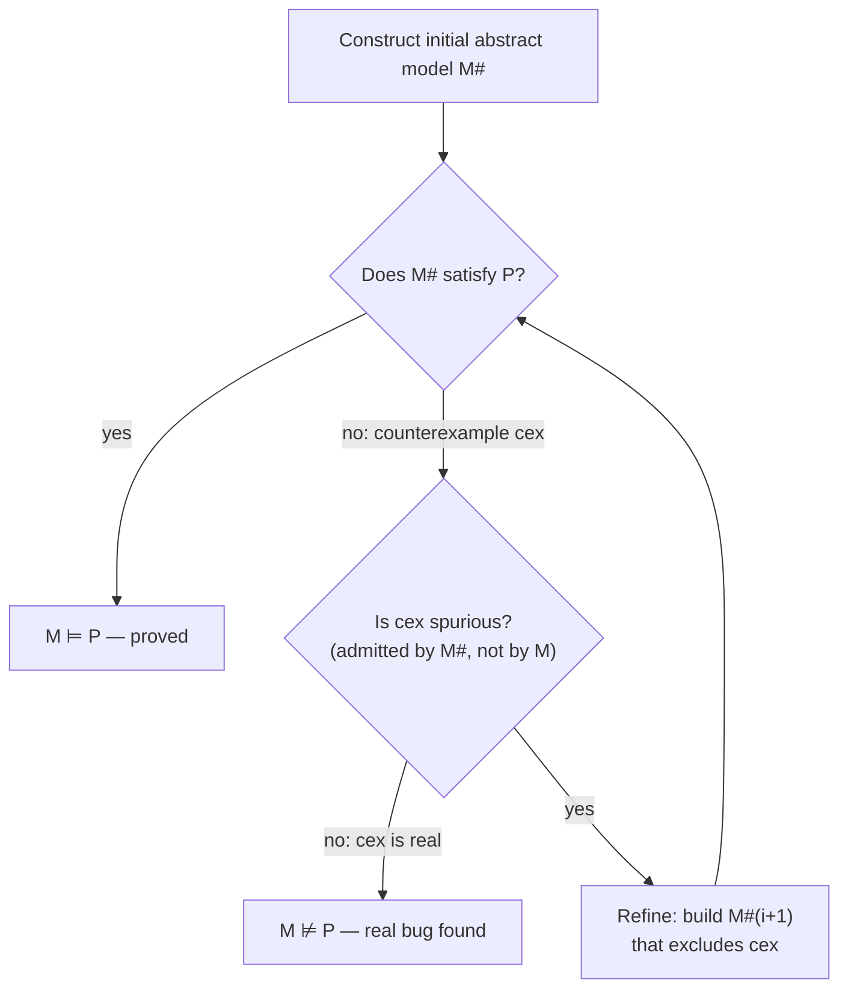
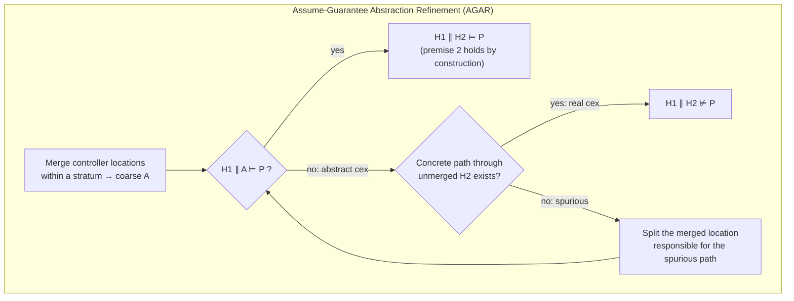

# Counterexample-Guided Abstraction Refinement (CEGAR)

[[book-guidelines|↩ Back to guidelines]]

## The problem CEGAR solves

Suppose you want to prove a program (or a hybrid controller, or a hardware circuit) correct. The direct way — enumerate every reachable state and check the property on each — is hopeless for anything but toy systems: state spaces blow up exponentially, and continuous or infinite-domain variables make "every reachable state" not even a finite set. Model checking's standard escape hatch is to *not* analyze the real system at all. Instead you build a **model** $\mathcal{M}^\#$ that is bigger — every behavior of the real system $\mathcal{M}$ is also a behavior of $\mathcal{M}^\#$ — but structurally simpler, and you check the property on that.

This works only if $\mathcal{M}^\#$ is *sound as an over-approximation* (nothing real is missing) *and* precise enough that the property still holds on the padding you added. That second condition is where everything gets hard. Greitschus opens the dissertation by naming this directly: "the pivotal point of model checking is the construction of the abstract model" (Ch. 1, p. 1). Too coarse, and $\mathcal{M}^\#$ admits behaviors that violate the property even though the real system never does — a **false alarm**. Too precise, and you've just re-built the exponential state space you were trying to avoid.

CEGAR is the algorithmic answer to "how coarse can I get away with, and how do I know when I've gotten it wrong": *start* coarse, and let the false alarms themselves tell you exactly where to add precision back.

### What breaks without it

Picture the alternative: you hand-pick an abstraction level up front (say, "track variables only modulo their sign") and hope it's fine-grained enough. If it isn't, you either get a wall of false alarms with no idea which predicates would fix them, or you overcompensate and track everything exactly, defeating the purpose of abstracting at all. CEGAR removes the guesswork: the abstraction is *derived from the property's own failure*, not chosen a priori.

## The refinement loop

Formally, CEGAR is a loop over an alternating sequence of *abstract, verify, refine*:

1. **Abstract.** Construct an initial (typically very coarse) abstract model $\mathcal{M}^\#$ of the system $\mathcal{M}$, such that $\mathcal{M}^\#$ over-approximates $\mathcal{M}$: every execution of $\mathcal{M}$ is also an execution of $\mathcal{M}^\#$.
2. **Verify.** Check whether $\mathcal{M}^\#$ satisfies the correctness property $\mathcal{P}$.
   - If yes — since $\mathcal{M}$'s behaviors are a subset of $\mathcal{M}^\#$'s, $\mathcal{M} \models \mathcal{P}$ follows immediately. Done.
   - If no, the checker returns a **counterexample**: an execution of $\mathcal{M}^\#$ that violates $\mathcal{P}$.
3. **Check the counterexample.** Does this counterexample correspond to a real execution of $\mathcal{M}$?
   - If yes, $\mathcal{M}$ really does violate $\mathcal{P}$. Done (with a bug report).
   - If no — it's **spurious** — go to step 4.
4. **Refine.** Use the spurious counterexample to build a new, less-coarse abstract model $\mathcal{M}^\#_{i+1}$ that no longer admits that particular spurious execution. Go to step 2.

Greitschus's own definition (Ch. 1, Key Definitions): a counterexample of an abstract model is spurious *"if it corresponds to an execution admitted by the abstract model, but does not correspond to any execution admitted by the original model."* Notice how load-bearing this definition is — spuriousness is defined purely in terms of set membership between two execution sets, which is exactly what makes the loop's correctness argument almost trivial to state (if hard to *compute*, since checking "does this execution exist in $\mathcal{M}$" is itself the hard reachability question you're trying to avoid solving directly).



### The picture the thesis draws

Figure 1 of the dissertation (Ch. 1, p. 2) makes the set-containment argument visual: draw $\mathcal{P}$ (the set of executions the property permits) and $\mathcal{M}$ (the set of executions the real system can produce, with $\mathcal{M} \subseteq \mathcal{P}$ since the system is actually correct). An abstract model $\mathcal{M}_1^\#$ is drawn as a larger region *containing* $\mathcal{M}$ but poking outside $\mathcal{P}$ — that sliver outside $\mathcal{P}$ but inside $\mathcal{M}_1^\#$ is exactly the spurious counterexamples: real enough to trigger a property violation in the abstract model, but not reachable in $\mathcal{M}$ itself (since $\mathcal{M} \subseteq \mathcal{P}$ entirely). Refinement shrinks $\mathcal{M}_1^\#$ down to some $\mathcal{M}_2^\#$ that still contains $\mathcal{M}$ but now fits entirely inside $\mathcal{P}$ — property proved.

This is worth sitting with because it's the geometric intuition behind every soundness argument you'll see for a CEGAR-style tool: **soundness is "abstract model ⊇ concrete model" preserved at every iteration; completeness (finding real bugs) is "spurious counterexamples eventually get eliminated."** The loop can only go wrong in two ways — an unsound abstraction (accidentally excluding real behavior) or a refinement step that never converges. The thesis's whole first three chapters are, at bottom, about fixing instances of that second failure mode.

### Rust: the loop as a state machine

The control-flow shape maps directly onto a `enum`-driven typestate loop — useful because it forces you to be honest about what data each phase actually needs, which the prose description glosses over:

```rust
enum CheckOutcome<M, Cex> {
    Verified,
    Counterexample(Cex),
}

enum SpuriousnessOutcome<Cex, Model> {
    Real(Cex),
    Spurious { refined_model: Model },
}

fn cegar_loop<M, P, Cex>(
    mut abstraction: M,
    property: &P,
    verify: impl Fn(&M, &P) -> CheckOutcome<M, Cex>,
    check_spurious: impl Fn(&Cex, &M) -> SpuriousnessOutcome<Cex, M>,
) -> Result<(), Cex> {
    loop {
        match verify(&abstraction, property) {
            CheckOutcome::Verified => return Ok(()),
            CheckOutcome::Counterexample(cex) => {
                match check_spurious(&cex, &abstraction) {
                    SpuriousnessOutcome::Real(real_cex) => return Err(real_cex),
                    SpuriousnessOutcome::Spurious { refined_model } => {
                        abstraction = refined_model; // loop again — no guaranteed bound
                    }
                }
            }
        }
    }
}
```

The signature is honest about the thing the dissertation spends its next 140 pages fixing: this `loop` has no termination proof attached to it. `refined_model` could, in the worst case, differ from `abstraction` by an infinitesimal amount, and the loop keeps spinning forever without either proving or refuting the property.

## Termination — and its absence in classical CEGAR

This is the crux Greitschus builds the whole software-verification contribution (Chapter 2) around, and it's stated with unusual bluntness for a dissertation introduction: *"there exists no termination guarantee for the abstraction refinement loop"* (Ch. 1, p. 2).

Trace *why*. In the classical, SMT-based instantiation of CEGAR for software (predicate abstraction, lazy abstraction, bounded model checking — all cited by name in Ch. 1), the spuriousness check works like this: an SMT solver is asked whether the counterexample trace is satisfiable. If it's unsatisfiable (the trace is infeasible — spurious), the solver's own *unsatisfiability proof* is mined for new predicates or assertions, and those get added to the abstraction. The catch: nothing about that process guarantees the new assertions are actually a **loop invariant**. If they're not, the model checker is stuck reasoning about one more unrolled loop iteration than before, and the counterexample it must next rule out has simply moved one iteration further into the loop.

> "A commonly observed behavior in CEGAR-based software model checking techniques that rely on an SMT solver is that loops are unwound iteratively if the generated assertions are no loop invariants. Even though the CEGAR scheme guarantees progress, this progress can be infinitesimally small in the worst case (with one loop unwinding at a time)." (Ch. 1, p. 3)

This is the crucial distinction: CEGAR *always* makes progress in the sense that iteration $i+1$'s abstraction strictly excludes the counterexample that iteration $i$ found. That is a **progress guarantee**, not a **termination guarantee** — nothing stops the loop from needing one refinement per loop iteration of the *program*, forever, if the program's real loop invariant never gets synthesized as a single assertion.

Greitschus's fix (developed fully in Chapter 2, only previewed here) swaps the SMT-based spuriousness check for **abstract interpretation** applied to a *path program* — a projection of the input program restricted to a single infeasible trace. Abstract interpretation, run to a fixpoint over an abstract domain with a widening operator, is *guaranteed to terminate* and, when it succeeds, the fixpoint it computes is by construction a loop invariant — not "an assertion that happens not to falsify the current counterexample," but something inductive strong enough to summarize the whole loop in one shot. This trades some precision (abstract domains lose information at joins) for an unconditional termination guarantee on that half of the loop — the tradeoff the rest of the dissertation is engineered around, spelled out as its own topic ([[Abstract-Interpretation|Abstract Interpretation]]) and ([[Path-Programs-and-Loop-Invariants|Path Programs and Loop Invariants]] if present).

### Lean: what "termination guarantee" is actually asking for

If you've built anything in a proof assistant, this distinction should feel familiar — it's exactly the difference between a general recursive function (which might not terminate, and Lean's kernel will refuse to accept it without a separate termination proof) and a *structurally* — or *well-founded* — recursive one. Classical SMT-CEGAR's refinement step is like a `partial def` in Lean: it type-checks, it can be run, but the kernel (or here, the mathematics) offers you no promise it halts. Abstract interpretation's fixpoint computation, by contrast, is closer to Lean's `WellFoundedRecursion`: the widening operator is precisely a *termination measure* — a proof obligation ("this ascending chain stabilizes") that the algorithm discharges automatically, every time, by construction of the abstract domain's lattice. The thesis is, in effect, replacing an SMT-CEGAR loop with no decreasing measure by an abstract-interpretation loop that carries one intrinsically.

## Spurious counterexamples in practice

It's worth being precise about what "spurious" buys you operationally, beyond the definitional set-membership fact above. A spurious counterexample is not just discarded — it is the *only* input the refinement step gets. The entire quality of the next abstraction depends on how much information you can extract from *why* this particular execution turned out to be infeasible.

This is where the two abstraction-refinement techniques for hybrid systems (Chapters 3 and 4) diverge from each other, and it's a distinction worth internalizing because it recurs across the whole thesis:

- **Chapter 3** targets *discrete* spuriousness — the abstract counterexample takes a sequence of *locations* (control states) that, once you try to find matching concrete continuous trajectories for each step, turns out to have no witness. The fix is discrete: split a merged location.
- **Chapter 4** targets *continuous* spuriousness — a transition looks reachable only because the over-approximated flowpipe (the set of states reachable by an ODE) is represented too coarsely, not because a real trajectory reaches the guard. The fix is continuous: add more refined support-function directions to shrink the over-approximation.

Both are still CEGAR — abstract, check, extract information from a spurious witness, refine, repeat — but the "refine" step operates on a completely different kind of object each time. That's the general lesson: CEGAR is a **meta-scheme**, not a single algorithm; each instantiation is defined by (a) what an abstract model even is, (b) what a spuriousness check looks like, and (c) what "refine" is licensed to change.

## Assume-guarantee abstraction refinement: CEGAR made compositional

Chapter 3's technique — assume-guarantee abstraction refinement (AGAR) — is presented in its Context section (3.1) explicitly as *"a variant of the counterexample-guided abstraction refinement (CEGAR) approach... The essential difference between AGAR and CEGAR lies in the compositional handling of the system. We work compositionally, i.e., we only abstract a part of the system."* (Ch. 3.1, p. 77). This is worth unpacking carefully, because it's a genuinely different move from "run the same CEGAR loop on a different domain."

### The motivating problem: composed systems

Consider a system built from two components in parallel composition, $\mathcal{H}_1 \parallel \mathcal{H}_2$ — concretely, a **plant** $\mathcal{H}_1$ (the physical process being controlled) and a **controller** $\mathcal{H}_2$ (the discrete/hybrid logic driving it). Model checking the composed system directly means analyzing the *product* of both state spaces — and if $\mathcal{H}_2$ is a stratified controller offering, say, 3 discrete options per control iteration, $n$ iterations blow the state space up to $3^n$ branches. Plain CEGAR, applied to the whole composed system, still has to pay that combinatorial cost on every abstract-model construction and every spuriousness check.

Assume-guarantee reasoning is the classical decomposition principle for exactly this shape of problem — prove something about $\mathcal{H}_1 \parallel \mathcal{H}_2$ by proving separate, smaller facts about $\mathcal{H}_1$ and $\mathcal{H}_2$ individually. The rule the thesis uses, **ASym**, is:

$$
\frac{\quad \mathcal{H}_1 \parallel A \models P \qquad \mathcal{H}_2 \models A \quad}{\mathcal{H}_1 \parallel \mathcal{H}_2 \models P} \quad \text{(Rule ASym)}
$$

Read the two premises as a division of labor:

- **Premise 1** ($\mathcal{H}_1 \parallel A \models P$): "if the controller behaves *at least as permissively as* the assumption $A$ says, the plant satisfies the safety property $P$." This is checked with $\mathcal{H}_2$ replaced entirely by $A$ — a potentially much smaller object.
- **Premise 2** ($\mathcal{H}_2 \models A$): "the real controller's behavior is contained in what $A$ permits" — i.e., $A$ is a sound over-approximation of $\mathcal{H}_2$.

If both premises hold, the conclusion $\mathcal{H}_1 \parallel \mathcal{H}_2 \models P$ follows — without ever having to construct the product state space of $\mathcal{H}_1$ and $\mathcal{H}_2$ directly. This is a genuine asymptotic win, not just an implementation convenience: it's the difference between analyzing $|\mathcal{H}_1| \times |\mathcal{H}_2|$ states and analyzing $|\mathcal{H}_1|$ and $|\mathcal{H}_2|$ separately (mediated by whatever size $A$ turns out to have).

### Where CEGAR re-enters: finding the assumption

The hard part of assume-guarantee reasoning has always been: *where does $A$ come from?* Pulled out of thin air, $A$ has to simultaneously be (i) an over-approximation of $\mathcal{H}_2$ (so premise 2 is free) and (ii) restrictive enough that premise 1 actually holds. Historically this required manual ingenuity or learning-based techniques (the thesis cites Bobaru et al.'s L*-based assumption learning as the closest prior work).

Greitschus's move is to synthesize $A$ *the same way CEGAR synthesizes an abstract model*: start with a very coarse $A$ built by **merging locations** of $\mathcal{H}_2$ within a stratum (so premise 2 holds *by construction*, since merging can only enlarge behavior — this is the "over-approximation guarantees premise 2 for free" point stated explicitly in 3.1), then check premise 1. If it fails, extract a counterexample, decide if it's spurious (does it correspond to a real concrete path through the *unmerged* controller, or only to the coarsened one?), and if spurious, *split* the offending merged location back apart — refining $A$ — and re-check.



Note the structural identity with the generic CEGAR loop above — same four moves — but every object in the loop is now scoped to *just the controller component*, never the plant, and never the product. That's the compositionality: the abstraction lives entirely inside $\mathcal{H}_2$'s state space, and $\mathcal{H}_1$ is analyzed only once per iteration, always against whatever the current $A$ is, never against the full $\mathcal{H}_2$.

### Why only the controller, never the plant, gets merged

The thesis is explicit about why this asymmetry (abstract $\mathcal{H}_2$, never $\mathcal{H}_1$) isn't arbitrary: *"The continuous behavior of the controller is relatively simple and it is possible to derive a rather precise abstraction of the continuous behavior of each of the locations involved in the merge... If we merged locations of the plant, the resulting abstraction of the continuous behavior would be too coarse"* (Ch. 1, p. 4). Merging is implemented by taking the **convex hull** of the invariants and continuous evolutions of the merged locations — a controller's per-location dynamics tend to be simple enough (often near-constant) that this convex hull stays tight; a plant's dynamics, driven by genuine physical ODEs, would blur into uselessness under the same operation. This is a domain-specific engineering judgment riding on top of the CEGAR-with-assume-guarantee scheme, not part of the scheme itself — but it's the kind of judgment call that makes the difference between AGAR being merely correct and AGAR being *scalable*.

### The worked motivating example (Figure 22)

The dissertation grounds this with a small concrete case (Ch. 3.1.1, pp. 76–77) worth walking through because the numbers make the abstraction/refinement mechanics tangible:

- Plant $\mathcal{H}_1$: a single location where $\dot{x}(t) = v$, invariant $T \le 1000$.
- Controller $\mathcal{H}_2$ (unmerged): three locations $\ell_1, \ell_2, \ell_3$ in one stratum, each with invariant $T_C \le 10$, setting $v$ to $1$, $2$, or $3$ respectively. Over $n$ controller iterations this yields $3^n$ branches.
- Merged controller $\mathcal{H}_2^\#$: one location $\ell^\#$ with invariant $1 \le v \le 3 \wedge T_C \le 10$ — the convex hull of the three original invariants over $v$. This reduces $3^n$ branches to a single linear chain.

This merged abstraction suffices to prove a coarse safety property (e.g. "$x = 4000$ is never reached within 1000 time units"). But suppose the desired property is finer: "$v \ne 2.5$ at $T = 2$." Checking $\mathcal{H}_1 \parallel \mathcal{H}_2^\#$ against this property produces a counterexample, because the merged invariant $1 \le v \le 3$ permits $v = 2.5$. Is it spurious? Yes — the *real* controller can only ever set $v \in \{1, 2, 3\}$, never $2.5$; the counterexample exists only because merging threw away that discreteness. The refinement step splits $\ell^\#$ back into two locations, one with invariant $v = 1$ and the other with $2 \le v \le 3$ — coarser than the fully unmerged automaton, but fine enough that re-checking now succeeds. This is refinement finding the *minimal necessary precision*, not jumping straight back to the fully concrete controller — exactly CEGAR's efficiency argument, applied one level up at the level of an assumption rather than a whole-system abstraction.

### Python: the toy version of premise-checking

A five-line sketch of the "is my over-approximated assumption still coarse enough to admit a real bug, or is it spurious" check, using the worked example's numbers as literal Python — not load-bearing, just makes the arithmetic behind "spurious because $2.5 \notin \{1,2,3\}$" concrete:

```python
def controller_values(merged: bool) -> set[float] | tuple[float, float]:
    return (1, 3) if merged else {1, 2, 3}

def violates(v_range, target=2.5):
    lo, hi = (min(v_range), max(v_range)) if isinstance(v_range, (set,)) else v_range
    return lo <= target <= hi

merged_cex = violates(controller_values(merged=True))     # True  -> abstract counterexample found
real_cex   = target := 2.5 in controller_values(merged=False)  # False -> spurious
print(merged_cex, real_cex)  # True False  => refine, don't report a bug
```

## What this section does *not* yet cover

Section 3.1 sets up the *scheme*; the soundness and relative-completeness theorems that make it rigorous (Theorem 1, Theorem 2 in the thesis) come later in Chapter 3, once the abstraction/concretization functions, the compositional analysis algorithm, and the location-splitting refinement algorithm are formally defined. "Relative completeness" is worth flagging in advance, though, because it connects back to the termination discussion above: full reachability of affine hybrid automata is *undecidable*, so no CEGAR-style scheme over hybrid automata can be unconditionally complete the way abstract-interpretation-based CEGAR for software loop invariants (Chapter 2) is guaranteed to terminate. AGAR's completeness guarantee is necessarily *relative* — it terminates and answers correctly whenever a bounded refinement process suffices, but (like classical CEGAR) offers no universal termination bound.

## Where this leads

CEGAR is the organizing pattern for essentially the entire dissertation — every later chapter is a different answer to "how do I instantiate abstract/verify/refine so the loop is both precise and terminates":

- **Chapter 2** replaces the SMT-based spuriousness check with **abstract interpretation** over path programs, buying an unconditional termination guarantee on the refinement step and guaranteed loop-invariant discovery — see [[Abstract-Interpretation|Abstract Interpretation]].
- **Chapter 3** is the compositional variant introduced here in full — location-merging AGAR, formalized with abstraction/concretization functions, a spuriousness-analysis algorithm, and soundness/relative-completeness theorems.
- **Chapter 4** applies the same abstract/verify/refine shape to the *continuous* half of hybrid-system analysis, treating flowpipe over-approximation error as the source of spuriousness and convex-set separation (via the Minkowski sum) as the refinement mechanism — see [[Elimination-of-Spurious-Transitions|Elimination of Spurious Transitions]] if present.

**Connection to the standing project:** CEGAR is directly relevant to the constraint-solving/verification kernel described in the learning goals. The abstract/verify/refine loop is structurally the same shape a Horn-clause-based invariant synthesizer needs: propose an abstract interpretation over the CHC system, check it against the verification condition, and when a candidate model fails, use the failing (spurious) witness to strengthen the abstract domain — this is precisely how CEGAR-driven CHC solvers (e.g. the Spacer/PDR family) and abstraction-refinement loops for refinement-type inference operate. The termination discussion above — abstract interpretation's widening-guaranteed termination versus SMT-unwinding's unbounded progress — is the exact tradeoff a Rust-based verifier's invariant-generation kernel will have to make explicitly: use a widening operator on an abstract domain for a termination guarantee, or fall back to bounded/interpolation-based refinement for precision, mirroring TAIPAN's own two-tier fallback design.
