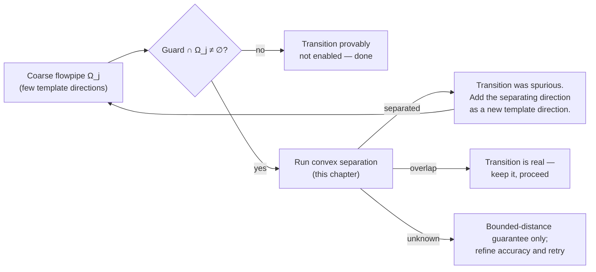

# Elimination of Spurious Transitions

[[book-guidelines|↩ Back to guidelines]] · builds on [[Flowpipe-Approximation-and-Support-Functions|Flowpipe Approximation and Support Functions]]

## The problem: an over-approximation lies to you about reachability

A reachability analysis for a hybrid automaton never computes the exact set of states a system can reach — that set is generally impossible to represent exactly, because it's the image of a convex region under continuous time-driven evolution. Instead, the analysis computes a **flowpipe**: a sequence of convex over-approximations $\Omega_0, \Omega_1, \dots$ of the reachable region at each time step, each one guaranteed to contain the true reachable set but not guaranteed to equal it. This is the machinery covered in [[Flowpipe-Approximation-and-Support-Functions]] — half-spaces, support functions, and the flowpipe approximation algorithm that builds $\Omega_j$ from finitely many template directions.

That over-approximation is precisely the source of a new problem. A hybrid automaton's discrete transitions fire when the current region intersects a transition's **guard** — a polyhedral condition on the continuous variables. If you check guard-intersection against the over-approximated flowpipe $\Omega_j$ instead of the true reachable region $\mathcal{R}$, you can get a false positive: $\Omega_j$ touches the guard even though $\mathcal{R}$ never does. The transition fires in the abstract analysis but is impossible in the real system. The dissertation calls this a **spurious transition**, and Figure 34 in the source gives the canonical picture — an octagon over-approximation (eight fixed directions $d_1,\dots,d_8$) of a region $\mathcal{R}\subseteq\mathbb{R}^2$ produces $\mathcal{R}^\#\supsetneq\mathcal{R}$, and a guard point lies inside $\mathcal{R}^\#$ but outside $\mathcal{R}$.

This is structurally the same disease as a spurious counterexample in classical CEGAR (see [[Counterexample-Guided-Abstraction-Refinement-(CEGAR)]]): the abstraction is too coarse, it admits a behavior the concrete system doesn't have, and something has to detect that admission is unjustified and refine the abstraction to exclude it. What's specific to this chapter is *what* gets refined (template directions of a support-function representation, not predicates or automaton locations) and *how* the spuriousness check itself is turned into a fast, purely geometric decision procedure.



## The image of a region under a transition (Definition 45)

Before you can even ask "does the guard overlap the flowpipe," you need to be precise about what taking a transition *does* to a region — because the guard has to be intersected with the region **before** the transition's update is applied, and the target invariant has to be respected **after**.

A transition is $tr = (\ell, g, \xi, \ell')$: source location $\ell$, guard predicate $g$, affine update $\xi: x' = Rx + w$, target location $\ell'$. Writing the guard, source invariant, and target invariant as polyhedra $\mathcal{G}$, $\mathcal{I}^-$, $\mathcal{I}^+$, the book defines:

$$
\mathrm{post}_{tr}(\mathcal{R}) = R\big(\mathcal{R} \cap \mathcal{G} \cap \mathcal{I}^-\big) \oplus w \; \cap \; \mathcal{I}^+
$$

— intersect the source region with the guard and the source invariant, apply the affine map, then clip against the target invariant. The $\oplus$ here is not yet the Minkowski sum in the load-bearing sense of this chapter; it's just "add the constant vector $w$" (a Minkowski sum with a single point, which is just a translation).

The useful move is pulling the target invariant *backwards* through the update instead of applying it after the fact. Substituting $x' = Rx+w$ into the target invariant's half-space constraints $\bar a_i^T x' \le \bar b_i$ gives $\bar a_i^T R x \le \bar b_i - w^T\bar a_i$ — a polyhedron in the *source* variables. Intersecting that back-transformed invariant with the guard and source invariant gives a single combined polyhedron

$$
\mathcal{G}^* = \mathcal{G} \cap \mathcal{I}^- \cap \{x \mid \bar a_i^T R x \le \bar b_i - w^T \bar a_i,\ i=1,\dots,m\},
$$

which collapses the whole transition-image computation to a single intersection:

$$
\mathrm{post}_{tr}(\mathcal{R}) = R(\mathcal{R} \cap \mathcal{G}^*) \oplus w.
$$

The point of this algebra is that it turns "is `tr` spuriously enabled" into "does $\mathcal{R}$ (a flowpipe segment) intersect the fixed polyhedron $\mathcal{G}^*$" — a single, static convex-intersection question, decoupled from the details of $\xi$. Everything downstream in the chapter (§4.4–4.6) is about answering that one question efficiently when $\mathcal{R}$ and $\mathcal{G}^*$ are known only through (approximate) support functions rather than as explicit vertex/facet lists.

**What breaks without this reduction:** without folding the guard, source invariant, and back-transformed target invariant into one $\mathcal{G}^*$, you'd need to separately reason about three polyhedra plus the affine map at every candidate transition — three times the intersection tests, and no single object to run a separation algorithm against. The single-intersection form is what makes "spuriousness checking = convex separation" a clean reduction rather than a multi-step case analysis.

## Separating convex sets with the Minkowski sum (Lemma 3)

Now the geometric core. You have two closed, bounded convex sets $\mathcal{R}$ (a flowpipe segment) and $\mathcal{S}$ (the guard set $\mathcal{G}^*$, or an invariant). You want to know: do they intersect?

**First principles.** The classical way to certify that two convex sets *don't* intersect is to exhibit a separating hyperplane — a hyperplane with one set entirely on each side. This is the finite-dimensional separating hyperplane theorem, and it's an iff for convex sets: two closed bounded convex sets are disjoint if and only if a strictly separating hyperplane exists. So "prove non-intersection" and "find a separating hyperplane" are the same problem.

The obstacle is that neither $\mathcal{R}$ nor $\mathcal{S}$ is given to you as an explicit list of vertices or half-spaces — they're given only through their (possibly *approximate*) support functions $\rho_\mathcal{R}(d) = \max\{d^Tx \mid x\in\mathcal{R}\}$. So you need a separation test that only ever asks "what is $\rho$ in direction $d$," never "give me a point/vertex of the set."

**The trick — reduce two-set separation to one-set separation from the origin.** Define the Minkowski sum $\mathcal{Q} = \mathcal{R}\oplus(-\mathcal{S}) = \{r - s \mid r\in\mathcal{R}, s\in\mathcal{S}\}$. Intuitively: $\mathcal{Q}$ contains every possible *difference vector* between a point of $\mathcal{R}$ and a point of $\mathcal{S}$. If $0\in\mathcal{Q}$, that means some $r\in\mathcal{R}$ and $s\in\mathcal{S}$ satisfy $r-s=0$, i.e. $r=s$ — the sets overlap. If $0\notin\mathcal{Q}$, no such coincidence exists — the sets are disjoint. That's **Lemma 3**:

$$
\mathcal{R},\ \mathcal{S} \text{ are separated} \iff 0 \notin \mathcal{Q} = \mathcal{R}\oplus(-\mathcal{S}) \iff \exists\, d^*\in\mathbb{R}^n:\ \rho_\mathcal{Q}(d^*) < 0. \tag{4.4}
$$

The support function of a Minkowski sum decomposes additively — $\rho_\mathcal{Q}(d) = \rho_\mathcal{R}(d) + \rho_\mathcal{S}(-d)$ — which is exactly why this reduction is *computationally* useful, not just conceptually elegant: you never need to materialize $\mathcal{Q}$'s geometry, only evaluate the support function of $\mathcal{R}$ and $\mathcal{S}$ separately and add. The proof of Lemma 3 makes the "why" concrete: $\rho_\mathcal{Q}(d) < 0$ unpacks to $\max\{d^Tx \mid x\in\mathcal{R}\} < \min\{d^Tx \mid x\in\mathcal{S}\}$ — literally "the projections of the two sets onto direction $d$ don't overlap," which is the separating-hyperplane condition stated in terms of support functions instead of geometry.

**What breaks without this reduction:** without collapsing two-set separation to "is 0 in this one derived set," you'd need a genuinely two-set search procedure — track candidate points/directions in *both* $\mathcal{R}$ and $\mathcal{S}$ simultaneously and reason about their relative position. Reducing to a single set and a single fixed target point (the origin) is what lets both algorithms below reuse the same machinery (outer/inner polytope approximation, Hausdorff-distance-driven direction refinement) that Section 4.2.1's approximate-support-function apparatus already built for representing *one* convex set.

**Rust grounding.** The Minkowski-sum-as-a-lazy-support-function is naturally a zero-copy composition, not a materialized structure:

```rust
trait ConvexSet {
    /// Approximate support value in direction `d`, accurate to within `eps`.
    fn support(&self, d: &Vector, eps: f64) -> f64;
}

/// Q = R ⊕ (−S), represented lazily — never build Q's vertices/facets,
/// only ever answer support-function queries about it.
struct MinkowskiDiff<'a> {
    r: &'a dyn ConvexSet,
    s: &'a dyn ConvexSet,
}

impl<'a> ConvexSet for MinkowskiDiff<'a> {
    fn support(&self, d: &Vector, eps: f64) -> f64 {
        self.r.support(d, eps) + self.s.support(&(-d), eps)
    }
}

/// Lemma 3: separated iff some direction gives a negative support value.
fn is_separated(q: &dyn ConvexSet, d_star: &Vector, eps: f64) -> bool {
    q.support(d_star, eps) < 0.0
}
```

This `ConvexSet` trait is exactly the interface both convex separation algorithms below are built against — they never need a concrete representation of $\mathcal{R}$ or $\mathcal{S}$, just this one method.

**Lean grounding.** Lemma 3 is a clean logical biconditional worth stating formally — it's the kind of lemma whose *proof* (not just statement) matters for a trusted-kernel-style verifier, since the direction $d^*$ it produces becomes a certificate:

```lean
theorem separation_iff_origin_not_in_diff
    (R S : Set (Fin n → ℝ)) (hR : Convex ℝ R) (hS : Convex ℝ S)
    (hRb : IsCompact R) (hSb : IsCompact S) :
    Disjoint R S ↔ (0 : Fin n → ℝ) ∉ (R + (-S)) := by
  sorry -- the interesting content is the *constructive* direction:
        -- extracting d* from a proof of 0 ∉ Q via the separating
        -- hyperplane theorem, which is what Algorithm 7 computes.
```

The `sorry` is doing real work here: the mathematically interesting part of Lemma 3 for a proof-producing system isn't the biconditional (a standard consequence of the separating hyperplane theorem, likely already in a library like Mathlib) but the *witness extraction* — turning a proof of non-membership into an explicit $d^*$, which is precisely what the two algorithms below do algorithmically instead of existentially.

## Two convex separation algorithms

Both algorithms decide $0 \in \mathcal{Q}$ vs. $0 \notin \mathcal{Q}$ using **only** evaluations of $\mathcal{Q}$'s approximate support function — never exact support vectors (points realizing the max), because $\mathcal{R}$ and $\mathcal{S}$ are themselves only known approximately. Both can also honestly report **"unknown"** rather than guess, which matters: guessing wrong here means either missing a real transition (unsound) or failing to eliminate a spurious one (imprecise but not unsound) — the algorithms are designed to only ever err on the side of "don't know," never on the side of a wrong answer.

### Directed Approximation (Algorithm 7)

This is an adaptation of Kamenev's **Mutually Converging Polytopes (MCP)** algorithm (Algorithm 6 in the source), which builds an outer polytope approximation $Q_k$ (intersection of half-spaces from evaluated directions) and an inner polytope approximation $C_k$ (convex hull of points found so far) of a convex set, refining in the direction of largest gap (Hausdorff distance) between them until they converge.

**First principles — why not just use MCP directly?** MCP assumes you can compute exact *support vectors* (a point on the boundary realizing the support value), then build the inner approximation as their convex hull. But this chapter only has approximate support *values*, not points guaranteed to lie in $\mathcal{Q}$. Directed Approximation adapts MCP in three ways:

1. It uses an **inner estimation** — points that might *not* actually be in $\mathcal{Q}$ (constructed from facet-slab centers, cf. the Chebyshev-center construction from [[Flowpipe-Approximation-and-Support-Functions]]) — to pick the *next* refinement direction, since picking a good direction doesn't require the point to be exact.
2. It keeps a separate, provably-conservative **inner approximation** using $b_i^-$ (the farthest support value consistent with the facet slabs) purely as the *termination criterion* for detecting overlap — because claiming "overlap found" is a soundness-critical claim and can't be based on possibly-wrong estimated points.
3. It only refines directions that could plausibly *matter* for the separation decision, rather than refining uniformly like MCP's optimal-convergence-rate strategy — because here you only care about deciding "does $\mathcal{Q}$ contain 0," not about accurately approximating all of $\mathcal{Q}$.

The main loop (Algorithm 7): build the outer approximation $Q_k$ from all directions tried so far; compute facet slabs and a border point $c_{k,i}$ on each; take the convex hull $C_k$ of those border points; for each facet of $C_k$, compute a *conservative* farthest bound $b_i^-$ using the corresponding facet slabs. If every $b_i^- \ge 0$ (no half-space of the conservative inner hull excludes the origin), report **overlap** — Lemma 4 proves this is sound because the conservative hull is a genuine subset of $\mathcal{Q}$. Otherwise, pick the half-space with the largest gap to the outer approximation, evaluate the support function in its normal direction; if that value is negative, **separation** is proven (directly from Equation 4.4); otherwise add the direction and iterate, tightening the accuracy $\varepsilon_k$ by a factor of 10 whenever the eagerness parameter $\alpha>1$ signals that further direction-refinement alone won't help. If $\varepsilon$ bottoms out at $\varepsilon_{\min}$, return **unknown**.

**Lemma 4 (Soundness).** "Separation" and "overlap" results are always correct. An "unknown" result still gives you something: an explicit upper bound $\delta = \min_{x\in\mathcal{T}}\|x\|$ on the true distance between $\mathcal{R}$ and $\mathcal{S}$, where $\mathcal{T}$ is the conservative inner-hull polytope. This is the standard "abstain, but bound the residual uncertainty" pattern from sound-but-incomplete verification — the algorithm never lies, it just sometimes can't decide, and even then it hands you a quantitative certificate of *how close* the undecided case is.

### Adapted GJK (Algorithm 8)

The classical Gilbert–Johnson–Keerthi algorithm is a *closest-point* algorithm: it iteratively refines a simplex inside $\mathcal{Q}$ toward the point of $\mathcal{Q}$ closest to the origin, using exact support vectors (a point $q$ is a "maximizer" — the unique closest point to 0 — iff $q$ is the support vector of $\mathcal{Q}$ in direction $q$ itself). It's typically faster than polytope-refinement approaches in the closest-point-query world (physics engines, collision detection) precisely because it doesn't try to approximate the whole set, only chase the closest point.

**Adapting it to approximate support functions** requires giving up the property that made classical GJK's convergence proof work: with only support *function values*, you can't get exact support *vectors*, so the algorithm uses facet-slab centers as substitute points — which, as before, may not actually lie in $\mathcal{Q}$. Consequence: the algorithm can no longer guarantee it detects "0 is inside the simplex" as *actual* overlap (an estimated point being inside a simplex doesn't mean 0 is really in $\mathcal{Q}$), so it "pushes outward" instead — if the estimated closest point to 0 lies inside the current hull, it just picks the *closest boundary point of the hull* and keeps refining rather than declaring overlap. This means the adapted GJK, unlike Directed Approximation, **never returns "overlap"** — only "separation" or "unknown." It also loses the original's termination guarantee: a direction can recur due to approximation noise, at which point the algorithm detects the cycle and bails out with "unknown" rather than looping forever.

The tradeoff the dissertation reports experimentally (§4.6, Table 8): GJK typically needs far fewer direction evaluations to *prove separation* when separation genuinely holds, but it has a real chance of never terminating (or timing out) — visible in the benchmark as sub-100% success rates even for GJK, whereas the corresponding Directed Approximation runs (which can also declare overlap, and always terminate with "unknown" as a fallback) behave more predictably at the cost of typically needing more evaluations.

```rust
enum SeparationResult { Separation, Overlap, Unknown }

/// Both algorithms share this shape: iteratively refine a set of probed
/// directions against a lazily-evaluated ConvexSet, terminating early
/// the moment a support value goes negative.
trait ConvexSeparationAlgorithm {
    fn decide(&self, q: &dyn ConvexSet, eps0: f64, eps_min: f64) -> SeparationResult;
}
```

The point of naming this trait explicitly: Directed Approximation and Adapted GJK are two *implementations of the same interface* — same input (a `ConvexSet`, i.e. anything answering `support(d, eps)`), same output type, different internal refinement strategy and different soundness/completeness tradeoff. That's a template-method-pattern relationship, and it's worth building the Rust code that way rather than as two unrelated functions.

## From one time-slice to a whole flowpipe: timed flowpipe separation

Everything above decides separation for two *fixed* convex sets — but a flowpipe isn't one convex set, it's a time-indexed family $\mathcal{R}_t$ for $t$ ranging over an interval, and generally $\mathcal{R}_t$ is **not convex as a function of $t$** even though each individual $\mathcal{R}_t$ is convex (a consequence of the affine ODE, cf. [[Flowpipe-Approximation-and-Support-Functions]]). **Definition 46 (Separating Time Domain)** formalizes the target: a maximal subinterval $\mathcal{T}\subseteq[t_b,t_e]$ such that $\mathcal{R}_t\cap\mathcal{S}=\varnothing$ for *every* $t\in\mathcal{T}$ — the exact time window during which the transition provably cannot fire.

Two strategies get you there.

### Convexification (§4.5.1)

Split the flowpipe's time horizon into segments; over each segment, take the *least concave upper bound* $\hat s(t)$ of the piecewise-linear support-function bound $s^+_{d,\varepsilon}(t)$ that the flowpipe approximation algorithm already produces — i.e., convexify the segment's support-function envelope. If the resulting single support value is accurate enough ($\varepsilon_{\text{result}}\le\varepsilon$), treat the whole segment as one convex set and run a convex separation algorithm on it. If not, subdivide the time interval further until each piece is accurate enough. This is a direct reuse of the machinery above: "flowpipe separation" reduces to "run Directed Approximation or GJK on each convexified time-slice," at the cost of possibly needing many slices when the flowpipe curves a lot within one segment.

### Point-wise separation (§4.5.2, Lemma 5)

The alternative exploits that *each single time point's* region is genuinely convex, so instead of convexifying time-slices, pick individual time points and find a direction vector that separates $\mathcal{R}_t$ from $\mathcal{S}$ *at that instant* — then ask how far that same direction vector keeps working.

**Lemma 5** states the general criterion: the flowpipe $\mathcal{R}_{t_b,t_e}$ is separated from $\mathcal{S}$ over the whole interval iff for every $t$ there's *some* direction $d_t$ (possibly different for each $t$) with $\rho_{\mathcal{R}_t}(d_t) + \rho_\mathcal{S}(-d_t) < 0$.

The natural question is how much you can get away with a **single, fixed** direction versus needing it to **evolve**.

**Fixed direction (Lemma 6).** A fixed $d$ separates the flowpipe from $\mathcal{S}$ over $[t_b,t_e]$ iff $d$ separates the **convex hull of the entire flowpipe** from $\mathcal{S}$ — because the convex hull is an over-approximation containing every flowpipe point, and a hyperplane that excludes the hull excludes every point in it. This is elegant but weak: Figure 37 in the source shows a point orbiting the origin under circular dynamics — a single fixed direction *can* separate it from a nearby set only while the orbit doesn't sweep back around toward that direction; for a set positioned so the orbit eventually points straight at it, **no** fixed direction works over an unbounded horizon, no matter how you choose it.

**Dynamic direction (Lemma 7, Corollary 1).** Instead let the direction itself evolve with the system: $d_t = d_0^T e^{-At}$, i.e. propagate $d_0$ backward through the *transpose* of the system's flow. If $d_0$ is a facet normal of $\mathcal{R}_0$, then $d_t$ stays a facet normal of $\mathcal{R}_t$ at every later time — the direction vector "rides along" with the set's own rotation/shear instead of standing still. Lemma 7's proof (a substitution exercise using $\rho_\mathcal{X}(M^Td) = \rho_{M\mathcal{X}}(d)$) shows this reduces dynamic-direction separation to *fixed*-direction separation of a transformed problem: separating $\mathcal{R}_0$ (forward) with dynamic direction $d_0$ is equivalent to separating $\mathcal{S}$'s **backwards-reachable set** from $\mathcal{R}_0$ with the *fixed* direction $-d_0$. Corollary 1 packages this as a clean fixed-direction check on $\mathcal{S}^{-1}$ (the union of backward-reachable images of $\mathcal{S}$), so all the fixed-direction machinery (Lemma 6, convex hulls) is reusable — the "dynamic" case isn't a new algorithm, it's the old algorithm run on a transformed instance.

The complementary failure mode is now visible: dynamic directions succeed exactly when a fixed direction on the *time-reversed, role-swapped* problem would — Figure 38 shows the mirror image of Figure 37's failure case, where the orbiting point again defeats a *fixed* direction but a *dynamic* one (which itself rotates to track the orbit) succeeds for the whole unbounded horizon. Neither method dominates the other; §4.6's circle benchmark measures exactly this tradeoff and (per Table 9) finds that trying fixed **and** dynamic directions together, falling back to dynamic whenever fixed fails, is always at least as good as either alone.

```python
# Illustrative sketch only — not load-bearing production code.
# Dynamic direction propagation: d_t = d0^T * expm(-A * t)
import numpy as np
from scipy.linalg import expm

def dynamic_direction(d0: np.ndarray, A: np.ndarray, t: float) -> np.ndarray:
    return expm(-A * t).T @ d0
```

## Sphere and circle benchmarks (§4.6)

Two benchmark classes, each isolating one layer of the pipeline above.

**Sphere benchmark** isolates the *convex separation* algorithms alone (Directed Approximation vs. adapted GJK), stripping away the flowpipe/time dimension: separate a polytope over-approximation of an $n$-dimensional sphere ($m=4n^2$ facets) from a single point at distance $\delta$. By Lemma 3, this is equivalent to separating two sphere-approximations, and it's deliberately adversarial — spheres are the convex shape *hardest* to approximate accurately with few facets, so it stresses exactly the direction-refinement loop both algorithms share. The results (Table 8) show the expected two-way tradeoff: GJK needs markedly fewer direction evaluations on average, but its success rate degrades in higher dimensions and smaller $\delta$ (down to 0% success for $n=5,\ \delta=0.01$ in the reported timeout budget) — i.e., speed when it works, at the cost of a real chance it just doesn't converge, exactly matching the theoretical gap identified in §4.4.2 (GJK has no termination guarantee under approximate support functions; Directed Approximation always terminates, worst case with "unknown").

**Circle benchmark** isolates the *time* dimension: a 2D system with dynamics $\dot x = -y,\ \dot y = x$ (uniform circular motion) is checked for separation from a fixed rectangular region, both when the region sits outside the flowpipe's circular sweep and when it sits inside it (i.e. genuinely inside the orbit's path, the harder case). Table 9's headline result is the one this section's theory predicted: when the separating region is *outside* the swept circle, a single fixed direction suffices for the whole unbounded horizon in one call (matching Lemma 6's easy case); when it's *inside*, fixed-direction point-wise separation needs dozens of calls and hundreds of evaluated directions, while dynamic-direction separation collapses back down to a single call — matching Lemma 7's prediction that the orbiting geometry is exactly what defeats a fixed direction and exactly what a co-rotating direction handles for free. Combining fixed and dynamic directions (falling back to dynamic only when fixed fails) is never worse and often strictly better than either alone, which is the practically actionable takeaway: always try the cheap fixed-direction check first, only pay for dynamic-direction computation when it's actually needed.

## Where this leads

Within the dissertation, this chapter is the terminal application of the support-function machinery from [[Flowpipe-Approximation-and-Support-Functions]] — everything from Definition 38 onward (support functions, approximate accuracy, facet slabs, Chebyshev centers) exists so that Lemma 3's separation test and the two algorithms built on it can run without ever materializing exact polyhedral geometry. Structurally, it's the **continuous-dynamics sibling of Chapter 3's discrete abstraction refinement** ([[Assume-Guarantee-Reasoning-for-Hybrid-Systems]] if present, else see the CEGAR chapter): both detect that an abstraction is spuriously permissive and refine it — Chapter 3 splits merged discrete locations, this chapter adds template directions to a flowpipe's support-function representation. Both are instances of the same higher pattern from [[Counterexample-Guided-Abstraction-Refinement-(CEGAR)]]: coarsen for tractability, detect spurious behavior admitted only by the coarse model, refine precisely enough to exclude it, repeat.

For the standing project of a Rust-based refinement-type/Hoare-contract compiler with an embedded CEGAR-style abstract interpreter: this chapter is a worked example of **sound-but-incomplete decision procedures that can honestly abstain** ("unknown," with a quantitative bound) rather than force a guess — exactly the discipline a CHC/Horn-clause solver or invariant-refinement loop needs when a query genuinely can't be decided at the current precision. The Directed Approximation/GJK relationship (soundness always, completeness traded for speed) is a template for how your CSP kernel's over-approximating (abstract-interpretation) side and its counterexample-searching (constraint-solving) side should each report their limits: never wrong, sometimes silent, and when silent, bounded. The fixed-vs-dynamic direction-vector distinction is also a concrete, non-type-theoretic instance of a recurring theme in your goals list — **template refinement guided by a counterexample**, the same shape as Craig-interpolant-driven predicate refinement in CEGAR loops (the dissertation's own §4.7 draws this connection to Bogomolov et al.'s interpolant-based template refinement) — new template directions here play exactly the role new interpolant predicates play in a predicate-abstraction CEGAR loop, or new abstract-domain constraints play in an octagon/polyhedra-domain refinement step.
