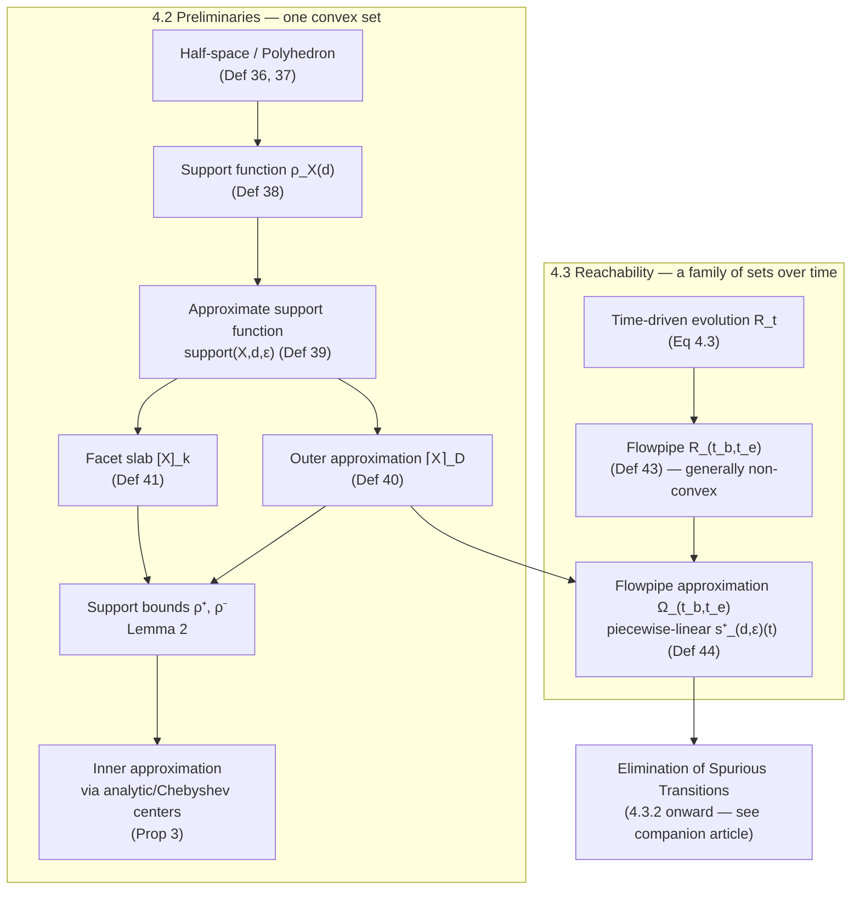

# Flowpipe Approximation and Support Functions

[[book-guidelines|↩ Back to guidelines]]

## The problem this machinery solves

Chapter 3 gave you the discrete half of hybrid-system abstraction: merge automaton locations,
check spuriousness, split when needed. This chapter turns to the *continuous* half, and the
continuous half has a much more basic problem to solve first: **how do you even represent the
set of points a system can reach while flowing according to a differential equation?**

For an affine hybrid automaton, the reachable set from a region $\mathcal{R}_0$ evolving under
$\dot{x}(t) = Ax(t) + u(t)$, $u(t) \in \mathcal{U}$, is given in closed form,

$$
\mathcal{R}_t = e^{At}\mathcal{R}_0 + \int_0^t e^{A(t-v)}u(v)\,dv,
$$

but this is a *description*, not a *data structure*. $\mathcal{R}_t$ is an uncountable set of
points, parameterized continuously by $t$. You cannot store it, intersect it against a guard,
or check whether it overlaps a bad location by enumerating its members — the same problem
[[Abstract-Interpretation|abstract interpretation]] solves for program states by picking a finite abstract domain (intervals,
octagons, polyhedra) instead of tracking the literal (infinite) set of reachable valuations.
Here the "abstract domain" is geometric: a *convex set of points in $\mathbb{R}^n$*, and the
representation Greitschus adopts — inherited from Le Guernic and Girard's SpaceEx line of work
[68, 127, 131] — is the **support function**. This section builds that representation from
first principles, then uses it to define what a *flowpipe* is: the data structure the rest of
Chapter 4 manipulates to detect and eliminate spuriously-enabled transitions
(see [[Elimination-of-Spurious-Transitions]] for that half of the story — this article stops
at flowpipe *construction*, not what you do with one once you have it).

## What breaks without a compact convex-set representation

Before the definitions: why not just store polyhedra as explicit vertex lists, or explicit
inequality systems from the start? Two reasons the book's approach avoids:

1. **Dimension blow-up.** A polytope in $\mathbb{R}^n$ can have exponentially many vertices in
   $n$ relative to its facet count (and vice versa). Operations like the Minkowski sum — which
   you'll need heavily in the companion article — are expensive on vertex representations but
   *linear-time per direction* on support functions.
2. **The dynamics don't hand you vertices.** Solving $\mathcal{R}_t = e^{At}\mathcal{R}_0 + \int_0^t e^{A(t-v)}u(v)\,dv$
   exactly, as a polytope, is generally intractable. But asking "how far does $\mathcal{R}_t$
   extend in *this one direction* $d$?" is a much easier question — often reducible to a
   well-understood optimization or an ODE integration bound — and that's exactly what a support
   function answers.

## Half-spaces and polyhedra: the vocabulary of convex regions

The book's starting vocabulary (Definitions 36–37) is the same one you'd reach for to describe
any bounded, convex, linearly-constrained region:

> **Definition 36 (Half-Space).** A half-space $\mathcal{H} \subseteq \mathbb{R}^n$ is
> $\mathcal{H} = \{x \in \mathbb{R}^n \mid a^Tx \le b\}$ for $a \in \mathbb{R}^n$, $b \in \mathbb{R}$.
>
> **Definition 37 (Polyhedron).** Given half-spaces $H = \{\mathcal{H}_1,\dots,\mathcal{H}_m\}$
> with $\mathcal{H}_i = \{x \mid a_i^Tx \le b_i\}$, the polyhedron is $\mathcal{P} = \bigcap_i \mathcal{H}_i$.
> A bounded polyhedron is a *polytope*.

Nothing surprising: a polyhedron is a finite conjunction of linear inequalities. The interesting
move is what comes next — instead of representing a convex set $\mathcal{X}$ *by* a fixed
polyhedron, represent it by a *function* that can generate the tightest half-space in any
direction on demand.

```rust
/// A half-space { x | a^T x <= b } in R^n.
struct HalfSpace {
    normal: Vec<f64>, // a
    offset: f64,      // b
}

/// A polyhedron as the intersection of finitely many half-spaces.
struct Polyhedron {
    constraints: Vec<HalfSpace>,
}
```

## The support function: a convex set's shadow in every direction

**Definition 38 (Support Function).** For a closed, bounded convex set $\mathcal{X} \subseteq \mathbb{R}^n$
and direction $d \in \mathbb{R}^n$,

$$
\rho_{\mathcal{X}}(d) = \max\{d^Tx \mid x \in \mathcal{X}\},
$$

with the set of maximizers (*support vectors*) $\sigma_{\mathcal{X}}(d) = \{x^* \in \mathcal{X} \mid d^Tx^* = \rho_{\mathcal{X}}(d)\}$.

Read this as: point the direction vector $d$ at the set, and $\rho_{\mathcal{X}}(d)$ tells you
how far $\mathcal{X}$ extends before you'd need to stop — the signed distance (scaled by
$\|d\|$) to the farthest point of $\mathcal{X}$ in that direction. Crucially, the halfspace
$\{x \mid d^Tx \le \rho_{\mathcal{X}}(d)\}$ is guaranteed to contain *all* of $\mathcal{X}$, by
construction (it's the tightest such half-space with normal $d$). So a support function is,
equivalently, a function that on request produces the tightest half-space bounding $\mathcal{X}$
in any given direction — and intersecting the half-spaces produced for a *finite* set of
directions gives a polyhedral over-approximation:

$$
\mathcal{X} \subseteq \bigcap_{d \in D} \{x \mid d^Tx \le \rho_{\mathcal{X}}(d)\} =: \mathcal{P}_D.
$$

This is the entire representational trick of the chapter: **a support function is an implicit,
infinite-precision description of a convex set that you materialize into a concrete polyhedron
only for the finitely many directions you actually care about** — the same move abstract
interpretation makes when it represents an infinite set of concrete states through a finite
abstract element and a concretization function. Here concretization is "intersect the
half-spaces you've queried"; the abstraction is exact only in the limit of infinitely many
directions, and strictly lossy (an over-approximation) for any finite $D$.

```rust
trait SupportFunction {
    /// rho_X(d): farthest extent of the set in direction d.
    fn rho(&self, d: &[f64]) -> f64;
}

/// Example: an axis-aligned box [lo_i, hi_i] has a closed-form support function —
/// no enumeration of vertices needed.
struct Box {
    lo: Vec<f64>,
    hi: Vec<f64>,
}

impl SupportFunction for Box {
    fn rho(&self, d: &[f64]) -> f64 {
        d.iter()
            .zip(self.lo.iter().zip(self.hi.iter()))
            .map(|(&di, (&lo, &hi))| if di >= 0.0 { di * hi } else { di * lo })
            .sum()
    }
}
```

In Python, the same idea for a quick sketch (e.g. to validate against a convex-optimization
library before committing to the Rust implementation):

```python
def rho_box(lo, hi, d):
    # farthest point in direction d of an axis-aligned box
    return sum(di * hi_i if di >= 0 else di * lo_i
               for di, lo_i, hi_i in zip(d, lo, hi))
```

## Approximate support functions: living with inexact bounds

For a box, $\rho$ has a closed form. For $\mathcal{R}_t = e^{At}\mathcal{R}_0 + \int_0^t e^{A(t-v)}u(v)\,dv$,
it generally doesn't — computing the *exact* support function requires solving an optimization
problem over an ODE flow, which is "often not possible or efficient" (the book's own words).
So Definition 39 relaxes exactness into a two-sided error bound:

> **Definition 39 (Approximate Support Function).** For accuracy $\varepsilon \in \mathbb{R}_{>0}$,
> $\mathrm{support}(\mathcal{X}, d, \varepsilon)$ satisfies
> $$
> \rho_{\mathcal{X}}(d) \le \mathrm{support}(\mathcal{X}, d, \varepsilon) \quad\text{and}\quad \mathrm{support}(\mathcal{X}, d, \varepsilon) - \varepsilon \le \rho_{\mathcal{X}}(d).
> $$

In other words: $\mathrm{support}(\mathcal{X}, d, \varepsilon)$ is always at least as large as
the true value (so the half-space it generates is *always sound* — never excludes any point of
$\mathcal{X}$), and it's never off by more than $\varepsilon$. This is the load-bearing design
decision for everything downstream: every geometric fact the chapter later proves about
separation and spuriousness has to be re-derived to hold under *interval* uncertainty on
$\rho$, not point values. That is genuinely harder than the exact case, and it's why Lemma 3 and
Algorithms 6–8 in the companion article look more elaborate than "just run GJK" — GJK assumes
exact support vectors are available; this chapter cannot assume that.

```rust
/// Approximate support function: guarantees rho(d) <= result and result - eps <= rho(d).
trait ApproxSupportFunction {
    fn support(&self, d: &[f64], eps: f64) -> f64;
}
```

## Outer approximations, facet slabs, and two-sided bounds

Given a finite set of directions $D = \{d_1,\dots,d_N\}$ and their approximate support values
$s_k^+ = \mathrm{support}(\mathcal{X}, d_k, \varepsilon)$, Definition 40 assembles them into a
polyhedron exactly as motivated above:

$$
\lceil \mathcal{X} \rceil_D = \bigcap_{k=1}^N \{x \mid d_k^Tx \le s_k^+\}, \qquad \mathcal{X} \subseteq \lceil \mathcal{X} \rceil_D.
$$

This is a *sound over-approximation regardless of how coarse $D$ is* — adding directions only
tightens it, never invalidates it. That soundness-independent-of-precision property is exactly
the "always-terminates-safe, refine-for-precision" shape you already know from widening in
abstract interpretation: an over-coarse abstract domain never causes an unsound *safety* verdict,
only spurious counterexamples (which is precisely the failure mode Chapter 4 goes on to study —
*flowpipes that are too coarse cause transitions to look reachable when they aren't*, the direct
geometric analogue of a CEGAR loop's spurious counterexample).

The lower bound is more subtle, because a single support value $s_k^+$ only bounds $\mathcal{X}$
from *outside* in direction $d_k$; it says nothing about how close $\mathcal{X}$ comes to the
origin along other directions. Definition 41's **facet slab** carves out, from the outer
approximation, the "belt" between the exact facet and the accuracy-adjusted floor beneath it:

$$
[\mathcal{X}]_k = \lceil \mathcal{X} \rceil_D \cap \{x \mid d_k^Tx \ge s_k^+ - \varepsilon\}.
$$

Since $\mathrm{support}(\mathcal{X},d_k,\varepsilon) - \varepsilon \le \rho_{\mathcal{X}}(d_k)$
by Definition 39, the true facet of $\mathcal{X}$ in direction $d_k$ lies *inside* this belt —
so the facet slab is guaranteed to contain at least one real point of $\mathcal{X}$. That
guarantee is the whole point: it converts an interval-valued measurement ($s_k^+ \pm \varepsilon$)
into a geometric region you can *provably* find a real point inside, which Definition 42 then
uses to sandwich the *true* support function between two computable bounds:

$$
\rho_{\mathcal{X}}^+(d) = \rho_{\lceil\mathcal{X}\rceil_D}(d), \qquad
\rho_{\mathcal{X}}^-(d) = \max_{k=1,\dots,N} -\rho_{[\mathcal{X}]_k}(-d).
$$

**Lemma 2** then states the sandwich formally: $\rho_{\mathcal{X}}^-(d) \le \rho_{\mathcal{X}}(d) \le \rho_{\mathcal{X}}^+(d)$
for every direction $d$, not just the sampled ones in $D$. This is the key fact that lets later
algorithms answer "is the true (unknown) support function negative in this direction?" —
needed for convex-set separation — using only the *bounds*, without ever computing the exact
value.

```rust
struct DirectionSample {
    d: Vec<f64>,
    s_plus: f64, // support(X, d, eps)
    eps: f64,
}

/// Outer approximation as an intersection of half-spaces from sampled directions.
fn outer_approx(samples: &[DirectionSample]) -> Polyhedron {
    Polyhedron {
        constraints: samples
            .iter()
            .map(|s| HalfSpace { normal: s.d.clone(), offset: s.s_plus })
            .collect(),
    }
}

/// Lower bound on rho_X(d): tightest of the facet-slab-derived bounds.
fn lower_bound(samples: &[DirectionSample], d: &[f64]) -> f64 {
    samples
        .iter()
        .map(|s| /* -rho_{[X]_k}(-d), computed via the facet slab polyhedron */ f64::NEG_INFINITY)
        .fold(f64::NEG_INFINITY, f64::max)
}
```

A short Lean formalization of the *shape* of Lemma 2 is worth stating explicitly, because the
sandwich property is exactly the kind of soundness statement your verifier's trusted kernel will
need to certify about any bound it hands upward — the geometric analogue of "the abstract
interpreter's join over-approximates every concrete successor state":

```lean
-- Lemma 2, stated as the soundness obligation an implementation must discharge.
theorem support_bounds_sandwich
    (X : ConvexSet) (D : Finset Direction) (d : Direction) :
    lowerBound X D d ≤ trueSupport X d ∧ trueSupport X d ≤ upperBound X D d := by
  sorry -- the real proof goes through Definitions 39-42 exactly as in the dissertation
```

The point of writing it this way is not that you'd literally verify hybrid-system reachability
in Lean end-to-end — it's that "bound sandwiches truth" is a *reusable proof obligation shape*
that recurs everywhere in your compiler project too: interval-domain soundness, refinement-type
subtyping bounds, and Hoare-triple weakest-precondition approximations are all instances of the
same pattern (a computable over/under approximation that is *provably* sound with respect to an
uncomputable or expensive exact semantics).

## Inner approximation: getting a guaranteed point inside the set

Outer approximations answer "what's definitely *not* excluded." But some of the machinery this
chapter sets up for the companion article's separation algorithms needs the opposite: a
polyhedron that is *provably contained inside* $\mathcal{X}$, so that finding a point in it
proves overlap rather than merely failing to prove separation.

The naive way to build one — pick a real point from each facet slab's *intersection with*
$\mathcal{X}$, take their convex hull — is exact but computationally expensive (it needs
alternating quantifiers and bilinear constraints, i.e., it's not just an LP). Proposition 3
instead shows you can get a valid inner approximation using only points from the *outer*
approximation's facet slabs, provided you're willing to shrink the resulting hull slightly using
the lower support bound $\rho^-$ you already have from Lemma 2.

Two standard ways to pick "the" point representing a facet slab are given:

- **Analytic center** — the point maximizing the geometric mean of the slacks $b_i - a_i^Tx$
  across all constraints of the polytope: $x_a = \arg\min_{x} -\sum_i \log(b_i - a_i^Tx)$.
- **Chebyshev center** — the center of the largest inscribed ball:
  $\langle x^*, z^*\rangle = \arg\max_{x,z\ge0} z$ subject to $a_i^Tx + \|a_i\|z \le b_i$ for all $i$.

Both reduce to convex programs (a log-barrier minimization and a linear program, respectively),
so both are tractable even though the exact-point-selection problem they approximate is not.
When the facet slab is *flat* — contains equality constraints, e.g. because it lies on a lower-
dimensional face — both centers degenerate, so the book computes the *relative* analytic/
Chebyshev center with respect to the affine hull of the equalities (holding the equality
constraints fixed and optimizing only over the remaining inequalities).

Proposition 3's actual content: take one point $c_i$ from each facet slab (via either center),
form $\mathcal{R} = \mathcal{CH}(c_1,\dots,c_N)$, then for each facet of $\mathcal{R}$, shrink its
offset from $b_i$ down to $b_i^- = \min_{j \in J_i} -\rho_{[\mathcal{X}]_j}(-a_i)$ — the tightest
lower support bound among the facet slabs that contributed a vertex to that facet. The shrunk
polytope $\mathcal{C}^- = \{x \mid \bigwedge_i a_i^Tx \le b_i^-\}$ is then guaranteed to satisfy
$\mathcal{C}^- \subseteq \mathcal{X}$ — a genuine, certified inner approximation, built entirely
from information you already had (support-function samples), without ever needing to verify
membership in $\mathcal{X}$ directly.

```rust
/// Build a certified inner approximation from a set of facet-slab center points
/// and their associated lower support bounds.
fn inner_approx(
    facet_points: &[(Vec<f64>, f64 /* lower support bound for this facet's direction */)],
) -> Polyhedron {
    // 1. R = convex_hull(facet_points.map(|(c, _)| c))   -- omitted: real hull algorithm
    // 2. For each facet of R with normal a_i, replace its offset b_i with the
    //    minimum lower support bound among the points on that facet.
    Polyhedron {
        constraints: facet_points
            .iter()
            .map(|(c, b_minus)| HalfSpace { normal: c.clone(), offset: *b_minus })
            .collect(),
    }
}
```

**What breaks without this shrinking step:** if you used the raw convex hull of estimated facet
points directly (without pulling the offsets in to $b_i^-$), the "inner" approximation could
actually poke *outside* $\mathcal{X}$ wherever the estimated center point wasn't a genuine member
of $\mathcal{X}$ — which is expected, since these points come from facet slabs (a superset
guaranteed to intersect $\mathcal{X}$), not from $\mathcal{X}$ itself. The shrink step is what
converts "probably close to the boundary" into "provably inside."

## Flowpipes: lifting support functions across time

Sections 4.2 and 4.2.1 give you a way to over/under-approximate one convex set. Section 4.3
applies this machinery to the *time-indexed family* of convex sets $\mathcal{R}_t$ produced by
a location's continuous dynamics.

> **Definition 43 (Flowpipe).** Given an initial region $\mathcal{R}_0$, time-driven evolution
> $\mathcal{R}_t$ per Equation 4.3, and a time interval $[t_b, t_e]$, the flowpipe is
> $$
> \mathcal{R}_{t_b,t_e} = \bigcup_{t_b \le t \le t_e} \mathcal{R}_t.
> $$

Note what's *not* claimed here: $\mathcal{R}_{t_b,t_e}$ is generally **not convex** — it's a
union of convex slices swept over time, and once you allow the continuous update to run over
several connected sub-intervals before the next discrete transition, the whole thing can be an
arbitrarily wiggly non-convex blob. This is a deliberate relaxation of Chapter 3's Definition 32
(where `contR` yielded a single convex region): letting the flowpipe be a union of many small
convex pieces trades one coarse over-approximation for many fine ones, at the cost of no longer
having a single polyhedron to reason about.

The **flowpipe approximation algorithm** (Definition 44, due to Frehse et al.) is how you make
that union of infinitely many convex slices ($t$ ranges continuously) computable: for each
direction $d \in D$ and accuracy $\varepsilon$, it builds a single *piecewise-linear* function
of time, $s^+_{d,\varepsilon} : [t_b, t_e] \to \mathbb{R}$, that upper-bounds $\rho_{\mathcal{R}_t}(d)$
at *every* time point simultaneously:

$$
s^+_{d,\varepsilon}(t) - \varepsilon < \rho_{\mathcal{R}_t}(d) \le s^+_{d,\varepsilon}(t) \quad \text{for all } t \in [t_b, t_e].
$$

Given such piecewise-linear bounds for each direction in $D$, the pointwise flowpipe
approximation at a single time $t$ is exactly the outer approximation from Definition 40, applied
at that instant:

$$
\Omega_t = \bigcap_{d_i \in D} \{x \mid d_i^Tx \le s^+_{d_i,\varepsilon}(t)\}, \qquad \mathcal{R}_t \subseteq \Omega_t,
$$

and the flowpipe approximation over the whole interval is $\Omega_{t_b,t_e} = \bigcup_{t_b \le t \le t_e} \Omega_t$,
which — because each $s^+_{d,\varepsilon}$ is piecewise linear — decomposes into finitely many
pieces $\Omega_{t_b,t_e} = \bigcup_{j=0}^{N} \Omega_j$, one convex polyhedral "time-slab" per
linear piece $[t_j, t_{j+1}]$. That finiteness is what makes the whole apparatus a genuine
algorithm rather than an idealized construction: you get a *finite, refinable, sound* over-
approximation of an infinite non-convex set, expressed entirely in terms of support-function
samples.

The refinement knob is direct: adding an extra direction $d'$ intersects each $\Omega_j$ with
the corresponding half-space in direction $d'$ (splitting $\Omega_j$ further if $s^+_{d',\varepsilon'}$
isn't concave on that piece), tightening the approximation exactly the way adding template
directions tightens an octagon or polyhedron abstract domain in Chapter 2's abstract
interpreter. This is the precision/cost knob the companion article's refinement loop turns.

```rust
/// A flowpipe approximation: a sequence of convex "time-slabs," each a polyhedron
/// valid over a sub-interval, built from piecewise-linear support-function bounds.
struct TimeSlab {
    interval: (f64, f64), // [t_j, t_{j+1}]
    region: Polyhedron,   // Omega_j
}

struct FlowpipeApproximation {
    directions: Vec<Vec<f64>>,
    slabs: Vec<TimeSlab>,
}

impl FlowpipeApproximation {
    /// Add a direction, refining every time-slab that intersects it.
    fn refine(&mut self, new_direction: Vec<f64>, eps: f64) {
        // For each slab, evaluate s^+_{d',eps}(t) across [t_j, t_{j+1}];
        // if concave, tighten the slab's polyhedron with the new half-space;
        // otherwise split the slab at the points where concavity breaks.
        self.directions.push(new_direction);
    }
}
```



## Where this leads

Everything here builds one thing: a **finite, refinable, provably sound (both inner and outer)
representation of the infinite, generally non-convex set of states a hybrid automaton can reach
over a time interval**. Chapter 3's location-merging abstraction told you *when* to trust a
compositional analysis of a discretely-abstracted controller; this section tells you *how* the
underlying continuous reachable sets actually get represented and computed at all — the two
chapters attack the discrete and continuous halves of the same abstraction-refinement problem
with structurally parallel tools (over-approximate for soundness, refine on demand for
precision, same as any CEGAR loop).

The immediate payoff is in [[Elimination-of-Spurious-Transitions]]: once a flowpipe is available
as a sequence of polyhedral time-slabs described by support functions, "is this transition
spurious?" becomes "does the flowpipe intersect the (back-transformed) guard set?" — a question
Lemma 3 answers by checking whether $0 \in \mathcal{R} \oplus (-\mathcal{S})$, the Minkowski sum
of the flowpipe and the negated guard. The Directed Approximation and adapted GJK algorithms that
decide this use *exactly* the outer approximations, facet slabs, and inner approximations built
here — Algorithm 6's MCP loop and Algorithm 7's Directed Approximation are, almost literally,
Definitions 40–42 and Proposition 3 run as an iterative refinement loop instead of a one-shot
construction.

For the standing compiler project: this is a clean instance of the "provably sound bound as a
first-class computable object" pattern that recurs in interval/octagon abstract domains,
refinement-type subtyping checks, and weakest-precondition approximations — worth remembering
the *shape* (accuracy-parameterized function, two-sided sandwich lemma, refinable outer/inner
pair) independent of the geometric setting, since you'll re-derive the same shape when your CSP
kernel needs sound-but-cheap bounds on numeric domains before falling back to exact constraint
solving.
