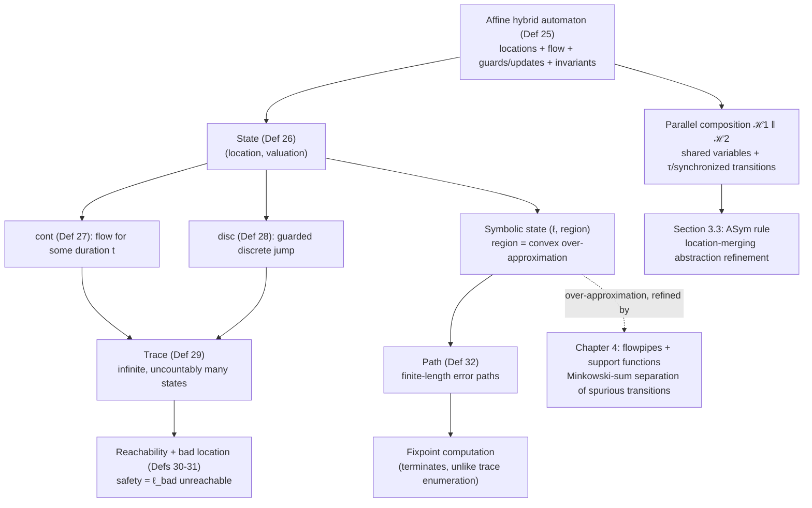

# Hybrid Automata and Their Semantics

[[book-guidelines|↩ Back to guidelines]]

## Why a new automaton model at all

Everything in Chapter 2 of this dissertation — path programs, trace abstraction, [[Abstract-Interpretation|abstract interpretation]] with widening — is built for systems whose state changes only at discrete steps: a statement executes, a variable gets a new value, control moves to the next node in a control-flow graph. That model is silent about *time*. It has nothing to say about a variable whose value evolves continuously while no discrete step is happening at all — a tank filling with water, a car's velocity decaying under braking, a thermostat's temperature drifting toward ambient. Cyber-physical systems are exactly the systems where both kinds of change coexist: a plant obeying a differential equation, and a controller that reacts to the plant's state with discrete switches. You need a model where reachability analysis has to reason about *both* an infinite, continuous flow and a finite, discrete graph structure, and where the two interact — the flow's current value gates which discrete transitions are enabled, and a discrete transition resets the state from which the next flow starts.

**Hybrid automata** are that model. Structurally they look exactly like the labeled-graph program representation from Chapter 2 (Def. 3): locations, connected by edges annotated with guards and updates. What's new is that every location additionally owns a *differential equation* describing how the variables evolve while control sits in that location, and an *invariant* that bounds how long control is allowed to stay there. A run of the system alternates between two very different kinds of step — flowing continuously along a location's differential equation for some duration, and jumping discretely across an edge when a guard becomes true — and reachability analysis has to account for infinitely many possible flow durations at every location, not just a fixed number of discrete transitions.

This is the discrete/continuous split the dissertation's introduction flags explicitly: Chapter 3 (this material) handles the *discrete* abstraction problem — coarsening the automaton's location structure — while Chapter 4 handles the *continuous* abstraction problem — coarsening the over-approximation of what values a differential equation reaches. Both need the same underlying semantics defined first, which is what Section 3.2 (Defs 25–32) sets up.

## Definition 25 — Affine Hybrid Automaton

**[[Counterexample-Guided-Abstraction-Refinement-(CEGAR)#What breaks without it|What breaks without it]].** If you tried to reuse the program automaton from Chapter 2 verbatim for a physical system, you'd have no way to express "while control is at this location, $x$ increases at rate 5" — a CFG edge is an instantaneous, atomic action, and physical evolution isn't atomic; it takes real, unbounded time and is described by a rate of change, not a single assignment.

The book's formal definition:

$$\mathcal{H} = (\mathrm{Loc}, \mathrm{Var}, \mathrm{Init}, \mathrm{Flow}, \mathrm{Trans}, \mathrm{Inv})$$

- $\mathrm{Loc}$: a finite set of locations (the graph's nodes — think "control states" or, in compiler terms, basic-block labels).
- $\mathrm{Var} = \{x_1, \ldots, x_n\}$: real-valued variables, i.e. the continuous state.
- $\mathrm{Init} : \mathrm{Loc} \to \mathrm{Pred}$: an affine predicate per location constraining the variables at start-up (predicates here are linear/affine constraints over $\mathrm{Var}$, not arbitrary first-order formulas).
- $\mathrm{Flow} : \mathrm{Loc} \to \mathrm{DiffEq}$: assigns each location a differential equation $\dot{x}(t) = Ax(t) + u(t)$, where $x(t) \in \mathbb{R}^n$, $A \in \mathbb{R}^{n \times n}$ is a fixed matrix, and $u(t)$ ranges over a closed, bounded, convex "disturbance" set $\mathcal{U} \subseteq \mathbb{R}^n$ (this is what makes the automaton *affine* — the dynamics are linear plus a bounded nondeterministic input, not arbitrary nonlinear ODEs).
- $\mathrm{Trans}$: discrete transitions $(\ell, g, \xi, \ell')$ — source location, affine guard predicate $g$, affine update $\xi: x' = Rx + w$, target location.
- $\mathrm{Inv} : \mathrm{Loc} \to \mathrm{Pred}$: an invariant per location, bounding how long/how far control may stay there under the flow.

The closed-form solution of the flow equation, $x(t) = e^{At}x_0 + \int_0^t e^{A(t-v)}u(v)\,dv$, is worth internalizing early: it's the reason "affine" dynamics are analyzable at all — the matrix exponential $e^{At}$ gives an exact, computable trajectory, whereas a general nonlinear $\dot x = f(x)$ has no closed form and forces numerical approximation from the start. This is precisely the fact Chapter 4's support-function machinery exploits (the dynamic direction vectors there are literally $d_t = d_0^T e^{-At}$).

**Grounding — Rust as a typestate machine.** The structural shape maps directly onto a typestate-flavored `enum`/trait design, which is the natural Rust idiom for "a finite set of modes, each with its own allowed operations and invariant":

```rust
type Var = String;

#[derive(Clone)]
struct AffinePred {
    // a conjunction of a·x <= b constraints — the guard/invariant language
    coeffs: Vec<(Var, f64)>,
    bound: f64,
}

struct DiffEq {
    a: na::DMatrix<f64>,      // A in R^{n x n}
    u_bounds: ConvexSet,      // U: closed, bounded, convex disturbance set
}

struct AffineUpdate {
    r: na::DMatrix<f64>,      // R in R^{n x n}
    w: na::DVector<f64>,      // w in R^n
}

struct Transition {
    source: LocId,
    guard: AffinePred,
    update: AffineUpdate,
    target: LocId,
}

struct HybridAutomaton {
    locations: Vec<LocId>,
    vars: Vec<Var>,
    init: HashMap<LocId, AffinePred>,
    flow: HashMap<LocId, DiffEq>,
    trans: Vec<Transition>,
    inv: HashMap<LocId, AffinePred>,
}
```

Note what this buys you compared to a plain program CFG: `flow` is data, not code — it's a *matrix*, so the "semantics" of a location's continuous behavior is something a verifier can symbolically manipulate (invert, exponentiate, over-approximate with a convex set) rather than something it has to interpret step by step.

**Grounding — Lean as the definitional record.** Lean makes the "each field is total, each location has exactly one flow/invariant/init" structure explicit as a dependent record, which is a faithful reading of the book's function-typed fields ($\mathrm{Flow} : \mathrm{Loc} \to \mathrm{DiffEq}$ really is a total function, not a partial map with defaults):

```lean
structure AffineHybridAutomaton (n : ℕ) where
  Loc      : Type
  Var      : Fin n → Type := fun _ => ℝ
  Init     : Loc → AffinePred n
  Flow     : Loc → DiffEq n         -- ẋ(t) = A x(t) + u(t), u(t) ∈ 𝒰
  Trans    : List (Loc × AffinePred n × AffineUpdate n × Loc)
  Inv      : Loc → AffinePred n
```

## Definition 26 — Hybrid Automaton State

A state is deliberately minimal: $s = (\ell, \mathbf{x})$, a location paired with a full valuation $\mathbf{x} \in \mathbb{R}^n$ of the variables. This is the hybrid analogue of a program state in Chapter 2 (Def. 5) — same shape, but now $\mathbf{x}$ ranges over an uncountable continuum rather than a finite (or discretely enumerable) set of valuations, which is exactly why the state space is infinite even before you consider transitions.

The notation $s \models p$ ("state $s$ satisfies affine predicate $p$") is inherited wholesale from Hoare-triple-style reasoning in Chapter 2 — it's the same satisfaction relation used for state assertions in the Floyd-Hoare automaton, just now over real-valued rather than program-typed variables. If you've been tracking the learning-goals thread on judgment forms as the shared ancestor of type checking and proof checking: $\models$ here is doing exactly the job a typing judgment or a Hoare-triple validity judgment does elsewhere in this material — it's the interface between syntax (a predicate) and semantics (a concrete valuation), and every later definition in this section (safety, reachability) is stated purely in terms of this one relation.

## Definitions 27–28 — Continuous and Discrete Update

**What breaks without separating these.** A single "step" relation conflating flow and jump would make it impossible to state invariants that must hold *continuously* (as opposed to just at the endpoints of a jump), and impossible to reason about the two kinds of transition with different techniques — continuous reachability needs calculus/convex geometry, discrete reachability needs guard/update composition exactly like a program's transition relation.

**Continuous update**, $\mathrm{cont} : S_\mathcal{H} \to 2^{S_\mathcal{H}}$: given $s = (\ell, \mathbf{x})$, $s' = (\ell, \mathbf{x}') \in \mathrm{cont}(s)$ iff

- the location doesn't change ($\ell = \ell'$),
- neither endpoint violates the location's invariant ($s \models \mathrm{Inv}(\ell) \wedge s' \models \mathrm{Inv}(\ell)$),
- there is *some* elapsed time $t \geq 0$ and *some* admissible disturbance trajectory $u(\cdot)$ realizing the flow equation from $\mathbf{x}$ to $\mathbf{x}'$.

The existential over $t$ and $u(\cdot)$ is what makes $\mathrm{cont}$ genuinely *set-valued* even for a single starting state — it returns every point reachable by flowing for any nonnegative duration, under any admissible disturbance, while staying inside the invariant. This is a continuum of successor states from one predecessor, which is a fundamentally different computational object than a program's (finite, or symbolically-representable) successor relation.

**Discrete update**, $\mathrm{disc} : S_\mathcal{H} \times \mathrm{Trans} \to S_\mathcal{H}$: given $s = (\ell, \mathbf{x})$ and $tr = (\ell, g, \xi, \ell')$, $s' = \mathrm{disc}(s, tr)$ is defined (nonempty) iff the source invariant holds, the guard holds, the update is applied exactly ($\mathbf{x}' = R\mathbf{x} + w$), and the *target* invariant holds at the result — otherwise $\mathrm{disc}(s, tr) = \emptyset$. Structurally this is identical to a guarded program transition: check a precondition (invariant + guard, playing the role of `assume`), apply a deterministic update (the assignment), check a postcondition (target invariant). The only novelty relative to Chapter 2's program transitions is that *both* endpoints of the edge carry their own separately-checked invariant, because in a hybrid automaton "being at a location" is itself a stateful condition that must hold, not just a control-flow position.

**Grounding — Rust.** This is a natural place to encode the "operation may fail (empty result)" pattern with `Option`, and the "operation returns a set" pattern with an iterator/closure over admissible durations — in practice tools like SpaceEx never enumerate `cont` pointwise; they compute a convex over-approximation of its image (a *flowpipe* — previewed here, formalized in Chapter 4):

```rust
fn disc(s: &State, tr: &Transition, aut: &HybridAutomaton) -> Option<State> {
    let inv_src = aut.inv(&s.loc)?;
    if !inv_src.satisfied_by(&s.x) { return None; }
    if !tr.guard.satisfied_by(&s.x) { return None; }
    let x_prime = tr.update.apply(&s.x);           // x' = R x + w
    let s_prime = State { loc: tr.target, x: x_prime };
    let inv_tgt = aut.inv(&tr.target)?;
    if !inv_tgt.satisfied_by(&s_prime.x) { return None; }
    Some(s_prime)
}

// cont is only representable as a set/predicate, never enumerated pointwise —
// this is exactly the "flowpipe" shape from Chapter 4.
fn cont_overapprox(s: &State, aut: &HybridAutomaton, horizon: f64) -> ConvexSet {
    aut.flow(&s.loc).reachable_set_over(s.x.clone(), 0.0..=horizon)
        .intersect(aut.inv(&s.loc))
}
```

## Definition 29 — Trace of a Hybrid Automaton

A trace $\pi = s_0 s_1 s_2 \ldots$ starts at an initial state ($s_0 \in \mathcal{I}$, where $\mathcal{I} = \{s = (\ell,\mathbf{x}) \mid s \models \mathrm{Init}(\ell)\}$) and every later state is reached from its predecessor by *either* $\mathrm{cont}$ or $\exists\, tr: \mathrm{disc}$ — with no fixed alternation pattern. There can be arbitrarily many continuous updates between two discrete ones (the automaton "dwells" at a location, flowing continuously through infinitely many intermediate valuations) and vice versa.

This "arbitrarily many continuous steps" clause is the crux of why traces are computationally useless as a reachability representation, and it's demonstrated concretely in the book's running example (Section 3.2.1, Figure 23): a car automaton with locations `accelerate` ($\dot v(t) = 5$) and `break` ($\dot v(t) = -10$), a `bad` location reached if $v > 130$ while accelerating or $v < 5$ while breaking. Between the state $s_0 = (\text{accelerate}, v=0)$ and the state where $v$ first reaches 85, the trace literally contains *one state per time point* $t \geq 0$ until $v=85$ — infinitely many states, all at the same location, differing only in the continuously-evolving valuation of $v$ (Figure 24a in the book plots exactly this). Any reachability algorithm that operates on traces directly is a nonstarter.

## Definition 30 — Reachability of States, and the Bad Location / Safety (Def. 31)

Reachability is exactly the trace-membership definition you'd expect: $s$ is reachable iff $\exists \pi \in \Pi_\mathcal{H} : s \in \pi$. What matters more than the definition itself is the encoding move the book makes immediately after it, because it's the same move Chapter 2 makes for program automata (Def. 22's error states) and it recurs throughout the verification literature: **safety is reduced to reachability of a single designated sink**. The book assumes WLOG a single location $\ell_{\mathrm{bad}} \in \mathrm{Loc}$ with $\mathrm{Inv}(\ell_{\mathrm{bad}}) = \mathrm{true}$, $\mathrm{Flow}(\ell_{\mathrm{bad}}) = \mathbf{0}$ (the automaton "freezes" there — the flow $\dot x(t) = 0$ has no dynamics), and no outgoing transitions. Then:

$$\mathcal{H} \text{ is safe} \iff \forall \pi \in \Pi_\mathcal{H}\, \forall s = (\ell, \mathbf{x}) \in \pi : \ell \neq \ell_{\mathrm{bad}}$$

This is the load-bearing move that turns "does this system violate this arbitrary safety property $P$" into "is this one specific graph node unreachable" — every guard on a transition *into* $\ell_{\mathrm{bad}}$ encodes the negation of the property you actually care about. It's the direct continuous-time analogue of encoding an assertion violation as a reachable "error" program location, which is exactly the Floyd-Hoare-automaton framing from Chapter 2. A trace reaching $\ell_{\mathrm{bad}}$ is called an *error trace*.

**Why this matters for the compiler/prover project.** This reduction — arbitrary safety property $\to$ single-node unreachability via a sink state with a `true`-guarded self-freeze — is the same trick a Hoare-triple/CHC-based verifier uses to turn a `requires`/`ensures` contract into a reachability query against a Horn-clause system: an "error" predicate becomes derivable exactly when the contract is violated, and proving the program correct is proving that predicate is never derivable. The affine-guard structure here (guards and invariants are all linear predicates over $\mathrm{Var}$) is also precisely the fragment that admits SMT/LP-based reachability checking rather than requiring full nonlinear arithmetic — the same reason refinement-type systems restrict themselves to decidable constraint theories (linear arithmetic, uninterpreted functions, arrays) rather than arbitrary first-order logic.

## Symbolic States and Regions

**What breaks without them.** Traces enumerate individual real-valued states — uncountably many, one per time instant. No algorithm can iterate over that. The fix, exactly parallel to how abstract interpretation replaces "one concrete state at a time" with "one abstract element summarizing a whole set" (Chapter 2, Defs 9–21), is to replace a single valuation with a *set* of valuations tracked as one symbolic object.

A **symbolic state** is a pair $s = (\ell, \mathcal{R})$ where $\mathcal{R} \subseteq \mathbb{R}^n$ is called a **region** — a set of points, not one point. $\mathrm{Sym}_\mathcal{H}$ denotes the set of all symbolic states. The continuous and discrete update functions lift pointwise to regions: $\mathrm{cont}_\mathcal{R}$ takes one symbolic state and returns the (single) symbolic state whose region is the union of $\mathrm{cont}(s)$ over every point $s$ in the input region; $\mathrm{disc}_\mathcal{R}$ takes a symbolic state and a transition and returns the symbolic state resulting from applying the transition's update to every point in the source region (subject to guard and invariants, exactly as in the pointwise Def. 28). $\mathrm{DISC}_\mathcal{R} : \mathrm{Sym}_\mathcal{H} \to 2^{\mathrm{Sym}_\mathcal{H}}$ collects the *discrete successors* — all symbolic states reachable by applying $\mathrm{disc}_\mathcal{R}$ over every enabled transition.

**Convexity as a working assumption, and its cost.** The book restricts attention to convex regions: for a region $\mathcal{R}$ and any sub-region $\mathcal{R}_i \subseteq \mathcal{R}$, the convex hull $\mathcal{CH}(\mathcal{R}_i) \subseteq \mathcal{R}$. For a finite point set $\{\mathbf{x}_1,\ldots,\mathbf{x}_m\}$:

$$\mathcal{CH}(\mathcal{R}) = \left\{ \sum_{i=1}^{m}\lambda_i \mathbf{x}_i \;\middle|\; \sum_{i=1}^{m}\lambda_i = 1,\; \lambda_i \geq 0 \right\}$$

This is not a free simplification — it's a deliberate **over-approximation**. If a set of points isn't naturally convex, taking its convex hull introduces new points not originally reachable, exactly the same way widening in abstract interpretation introduces spurious states to guarantee termination. The book is explicit that this can create imprecision in later $\mathrm{cont}_\mathcal{R}$/$\mathrm{disc}_\mathcal{R}$ computations, and flags Chapter 4 (flowpipe/support-function machinery) as the place that manages this imprecision more carefully than "just take the hull."

This is the single most important conceptual bridge in this section for anyone building an abstract-interpretation-based verifier: **a region is an abstract domain element**, convex polyhedra playing exactly the role intervals/octagons/congruences play in Chapter 2 — a computable, closed-under-the-relevant-operations representation of a (possibly infinite) set of concrete states, purchased at the price of soundness-preserving imprecision. The reachable region space (the union of regions across all reachable symbolic states) is the hybrid-automaton analogue of an abstract interpretation fixpoint.

**Grounding — Rust.** A region is naturally a trait object over convex representations (H-representation halfspace intersections, V-representation vertex sets, or a support-function oracle — this dissertation's Chapter 4 machinery is precisely about choosing/approximating this representation efficiently):

```rust
trait ConvexRegion {
    fn contains(&self, x: &na::DVector<f64>) -> bool;
    fn intersect(&self, other: &Self) -> Self;
    fn convex_hull_with(&self, other: &Self) -> Self;   // over-approximation step
    fn is_empty(&self) -> bool;
}

struct SymbolicState<R: ConvexRegion> { loc: LocId, region: R }

fn disc_r<R: ConvexRegion>(s: &SymbolicState<R>, tr: &Transition, inv_tgt: &R) -> Option<SymbolicState<R>> {
    let after_guard = s.region.intersect(&tr.guard.as_region());
    if after_guard.is_empty() { return None; }
    let updated = tr.update.apply_to_region(&after_guard);   // x' = Rx + w, lifted
    let result = updated.intersect(inv_tgt);
    if result.is_empty() { None } else { Some(SymbolicState { loc: tr.target, region: result }) }
}
```

## Definition 32 — Path of a Hybrid Automaton

A **path** $\pi = \mathrm{sym}_0\, \mathrm{sym}_1\, \mathrm{sym}_2 \ldots$ is the symbolic analogue of a trace: each $\mathrm{sym}_i = (\ell_i, \mathcal{R}_i) \in \mathrm{Sym}_\mathcal{H}$, the first region is contained in the convex hull of all initial points ($\mathcal{R}_0 \subseteq \mathcal{R}_\mathcal{I} = \mathcal{CH}(\mathcal{V})$, where $\mathcal{V}$ is the set of all points of all initial states), and each successive symbolic state is reached via $\mathrm{cont}_\mathcal{R}$ or $\mathrm{disc}_\mathcal{R}$. Safety and reachability transfer to paths exactly as for traces (Defs 30–31), and an **error path** — one ending in $\ell_{\mathrm{bad}}$ — is guaranteed to have *finite length*, which is the entire point of the symbolic reformulation: the book proves this concretely with the car example (Figure 24b), where the same behavior that needed infinitely many states as a trace collapses to five symbolic states as a path (one per location dwell), and reachability of $\ell_{\mathrm{bad}}$ can then be decided by a genuinely terminating fixpoint computation — structurally the same iterate-to-fixpoint loop as Algorithm 1 in Chapter 2, just operating over convex regions instead of interval/octagon abstract states. The book works this fixpoint by hand for the car example:

| Target | Input region | Operation | Output region |
|---|---|---|---|
| accelerate | $v \in [0,0]$ | $\mathrm{cont}_\mathcal{R}$ | $v \in [0,100]$ |
| break | $v \in [0,100]$ | $\mathrm{disc}_\mathcal{R}$ | $v \in [80,100]$ |
| break | $v \in [80,100]$ | $\mathrm{cont}_\mathcal{R}$ | $v \in [10,100]$ |
| accelerate | $v \in [10,100]$ | $\mathrm{disc}_\mathcal{R}$ | $v \in [10,20]$ |
| accelerate | $v \in [10,20]$ | $\mathrm{cont}_\mathcal{R}$ | $v \in [10,100]$ |

The fixpoint is reached at step 5 since $\mathcal{R}_5 \subseteq \mathcal{R}_1$ — after which checking both $\ell_{\mathrm{bad}}$-guards ($v > 130$ and $v < 5$) against the accumulated regions yields empty intersections, proving safety with a *finite, terminating* computation, in stark contrast to the trace-based picture which never terminates by construction.

**Grounding — Lean.** The finite-vs-infinite distinction between traces and paths is worth stating as a theorem shape, because it's exactly the kind of soundness statement a Lean-embedded verifier would need to discharge before trusting a path-based reachability check as a sound proxy for trace-based reachability:

```lean
-- The core soundness obligation this section is building toward:
-- if the (finite) symbolic path-reachability check says ℓ_bad is unreachable,
-- then no *trace* (concrete, possibly infinite) reaches ℓ_bad either.
theorem path_reachability_sound
    (H : AffineHybridAutomaton n) (ℓbad : H.Loc)
    (h : ¬ ∃ p : Path H, p.reaches ℓbad) :
    ¬ ∃ π : Trace H, π.reaches ℓbad := by
  -- proof sketch: every trace's states are pointwise contained in the region
  -- of the path obtained by tracking the same location-dwell structure —
  -- this is the over-approximation property baked into cont_R / disc_R.
  sorry
```

This is precisely the "trusted kernel / soundness of an abstraction" shape that recurs everywhere in this dissertation: an abstract (finite, computable) semantics is only useful once you've shown its reachable set over-approximates the concrete (possibly-infinite) one.

## Parallel Composition of Hybrid Automata

**What problem this solves.** A cyber-physical system is almost never one automaton — it's a plant and a controller (or, per Chapter 3's actual technique, a plant plus a *stratified* controller made of several interacting layers) running concurrently and communicating through shared variables. You need a composition operator that builds one automaton out of several without requiring you to hand-flatten the product state space every time — exactly the same motivation as CSP-style process composition or Rust's channel-based concurrency: components stay separately specified, composition is compositional.

For $\mathcal{N} = \mathcal{H}_1 \| \ldots \| \mathcal{H}_m$:

- Every variable occurring in more than one component is a **shared variable**, used to pass information between automata.
- Location sets $\mathrm{Loc}_1, \ldots, \mathrm{Loc}_m$ are pairwise disjoint, as are the transition sets.
- A state of $\mathcal{N}$ is $s = (\mathbf{l}, \mathbf{x})$ where $\mathbf{l} \in \mathrm{Loc}_1 \times \cdots \times \mathrm{Loc}_m$ (a location *vector*, one per component) and $\mathbf{x} \in \mathbb{R}^k$ ranges over all $k$ variables of $\mathcal{N}$ (shared and local, unioned).
- Every transition carries a synchronization label from a finite alphabet including a distinguished silent label $\tau$. A transition labeled $\tau$ fires unilaterally by one component (**interleaving**). A transition with any other label must fire *simultaneously* across every component whose alphabet contains that label (**synchronized transition**) — this is exactly CSP/CCS-style handshake synchronization, not message passing with buffering.

Traces and paths of the composition are defined exactly as for a single automaton — sequences of (symbolic) states where each component's continuous/discrete updates are applied while respecting its own invariants and guards, plus the synchronization discipline above.

**Why the dissertation needs this before Chapter 3's actual contribution.** The whole point of Chapter 3's assume-guarantee technique (previewed in Section 3.1, formalized in Section 3.3 immediately after this preliminaries section) is to analyze $\mathcal{H}_1 \| \mathcal{H}_2$ — plant and controller — *without* constructing their full product. The rule ASym,

$$\frac{\mathcal{H}_1 \| A \models P \qquad \mathcal{H}_2 \models A}{\mathcal{H}_1 \| \mathcal{H}_2 \models P}$$

replaces the controller $\mathcal{H}_2$ with an abstraction $A$ (over-approximating $\mathcal{H}_2$'s behavior, so premise 2 holds by construction) small enough that the composed system $\mathcal{H}_1 \| A$ is tractable to verify directly. Formalizing parallel composition here is the prerequisite for that rule to even typecheck as a statement — you need "$\|$" defined before you can write $\mathcal{H}_1 \| A \models P$. The motivating example the book gives (a plant whose velocity depends on a controller choosing among three discrete options every 10 time units, causing $3^n$ branching for $n$ iterations) shows exactly why: naively exploring the composed product is exponential in the number of controller iterations, and merging the controller's per-stratum locations into one abstract location (invariant $1 \le v \le 3$ replacing the three exact choices $v \in \{1,2,3\}$) reduces that branching to linear — at the cost of possible spuriousness, which [[Counterexample-Guided-Abstraction-Refinement-(CEGAR)#The refinement loop|the refinement loop]] (Section 3.3.4, not covered here) then repairs by selectively splitting merged locations back apart.

**Grounding — Rust.** Composition is naturally a struct combinator over a shared symbol table for variables plus a synchronization-alphabet check on transitions:

```rust
struct Composition {
    components: Vec<HybridAutomaton>,
    // shared vars: any Var appearing in >1 component's `vars`
}

impl Composition {
    fn enabled_transitions(&self, state: &CompositeState) -> Vec<CompositeTransition> {
        // tau-labeled: any single component's transition fires alone (interleaving)
        // non-tau label L: requires every component whose alphabet contains L
        // to simultaneously offer an L-labeled transition from its current location
        // -- classic CSP rendezvous, not buffered message passing
        todo!()
    }
}
```

## Where this leads



This section is the semantic bedrock for the rest of the dissertation's hybrid-systems half. Section 3.3 (immediately following) builds the location-merging abstraction $\alpha$/concretization $\alpha^{-1}$, the compositional analysis algorithm, and the refinement loop directly on top of these definitions — "abstract location" is a set of concrete locations, "abstraction" is a location-merging operation whose soundness is proved by showing it over-approximates exactly the region-based semantics defined here. Chapter 4 then attacks the imprecision this section flags but defers: the convex-hull over-approximation of regions (used casually here, and unavoidable once you fix the differential-equation flow) is the same imprecision that later manifests as *spuriously enabled transitions*, which Chapter 4 detects and eliminates via convex-set separation using the Minkowski sum — the dissertation's title concept.

For the standing project: this is the closest analogue in the dissertation to weakest-precondition/Hoare-triple reasoning over a continuous-time transition system. The $\mathrm{cont}/\mathrm{disc}$ split is structurally a bisimulation-style operational semantics with two transition relations instead of one, region-based symbolic states are literally an abstract domain (convex polyhedra, sitting one level more general than the interval/octagon domains of Chapter 2), and the reduction of arbitrary safety properties to reachability of a single sink location is the same encoding a CHC-based verifier uses to turn a contract violation into a derivable "error" predicate — worth keeping in mind when the invariant-generation engine for the Rust verifier eventually needs to reason about systems with continuous or hybrid components, or when abstract-domain design for the CSP kernel needs a convex-region representation richer than intervals.
