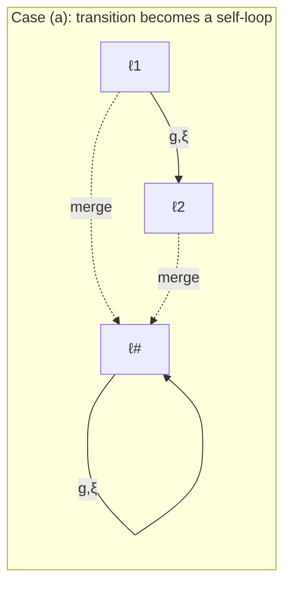
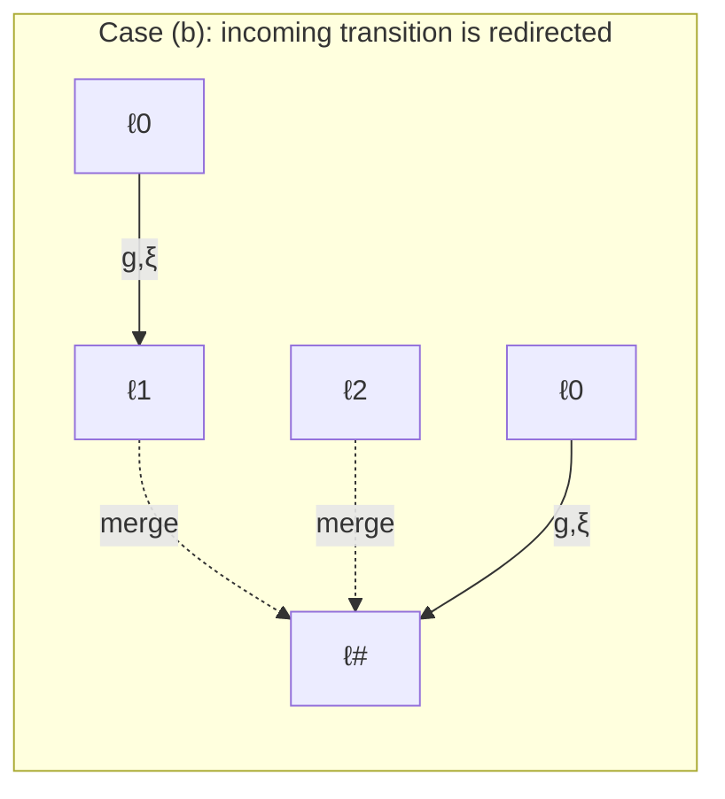
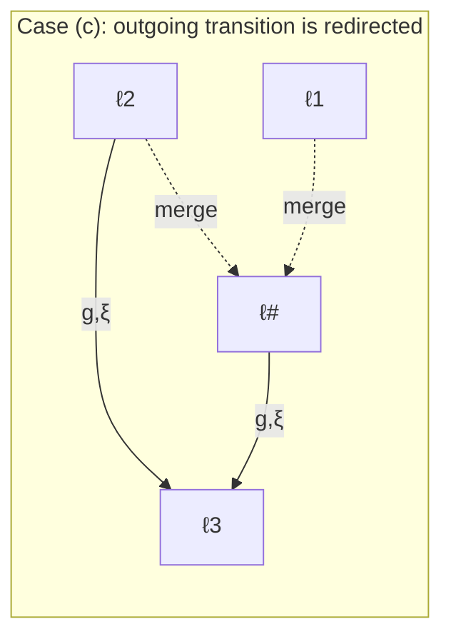
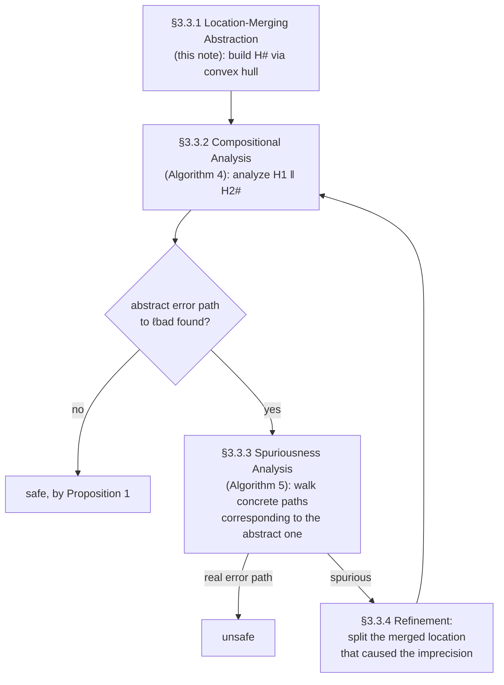

[[book-guidelines|↩ Back to guidelines]]

## The problem: a stratified controller blows up the state space

Picture a hybrid system made of a **plant** — some physical process evolving continuously in time, like a tank filling with liquid — and a **controller** that periodically picks from a menu of discrete options: which valve to open, which of several fixed pump speeds to run at, and so on. If the controller is *stratified* — organized into layers, where each layer independently picks one option per control cycle — then a model checker exploring $n$ control cycles with $3$ options per cycle has to explore $3^n$ branches. That's not a hypothetical inefficiency; it's the actual shape of the benchmark class this chapter is built around (a "switched buffer network" of tanks and channels), and it's exactly the kind of blow-up that makes exhaustive hybrid reachability analysis intractable in practice.

The chapter's core idea for taming this is deceptively simple: **if a safety property only cares about the *range* of values a variable can take, don't case-split on every option — merge the options into one location whose invariant is the smallest convex region containing all of them.** Concretely, if a controller stratum has three locations setting a velocity $v$ to $1$, $2$, or $3$, replace the three-way branch with a single location carrying the invariant $1 \le v \le 3$. Any behavior the concrete system could exhibit is still covered by the abstract one — you've thrown away *which* option was picked, but not the fact that *some* option in that range was picked. Three branches become one; for $n$ cycles, $3^n$ becomes $n \times (\text{one location})$, i.e. linear instead of exponential.

This is the same move [[Abstract-Interpretation|abstract interpretation]] makes everywhere: replace a large concrete state space with a smaller abstract one related by a **sound over-approximation**, verify the easier abstract problem, and only pay the cost of precision when a spurious abstract counterexample forces you to. What's specific to hybrid systems here is *what* the over-approximation operator has to be: not a numeric interval join like you'd use for `int` variables, but a genuine **convex hull** over $n$-dimensional real vector spaces, applied simultaneously to a location's invariant *and* to its continuous dynamics (the differential equation governing how variables evolve over time). That second part — merging *evolutions*, not just static value ranges — is the part that isn't obvious from the toy example above, and it's the mechanically interesting half of this topic.

**What breaks without this abstraction:** without location merging, the compositional analysis of Chapter 3 (`analyze(plant ‖ controller)`, Algorithm 4) has to case-split on every controller option at every one of its (potentially unboundedly many) iterations. For a stratified controller with $k$ strata and $b$ options per stratum, this is $b^k$ branches, each of which triggers a full continuous-reachability computation. Location merging is the only reason the compositional AGAR (assume-guarantee abstraction refinement) scheme in this chapter is tractable at all on the switched-buffer benchmarks the author evaluates against.

## The scaffolding: what a hybrid automaton's locations actually carry

Before formalizing the merge, it's worth being precise about what a *location* is, since the abstraction operates on every field attached to one. An **affine hybrid automaton** is

$$\mathcal{H} = (\text{Loc}, \text{Var}, \text{Init}, \text{Flow}, \text{Trans}, \text{Inv})$$

— a directed graph whose nodes (`Loc`) are annotated with:
- **Init**: an affine predicate over the variables, true only at the automaton's starting state(s);
- **Flow**: a differential equation $\dot{x}(t) = Ax(t) + u(t)$ governing how the variables evolve *while the automaton sits in this location* (this is the continuous half of "hybrid");
- **Inv**: an affine predicate that must stay true the whole time the automaton is in this location — the moment it would become false, the automaton is forced to take a discrete transition out;

and whose edges (`Trans`) carry a **guard** (an affine predicate that must hold for the edge to fire) and an **update** (an affine reassignment of the variables, $x' = Rx + w$).

A **region** is just a set of points in $\mathbb{R}^n$ — the set of variable valuations reachable while in some location. The dissertation's convex-hull assumption (stated right before this section) is doing a lot of quiet work: it stipulates that regions are always taken to be convex, and defines the **convex hull** $\mathcal{CH}$ of a finite point set $\mathcal{R} = \{x_1, \ldots, x_m\}$ as the set of all convex combinations of those points:

$$\mathcal{CH}(\mathcal{R}) = \left\{ \sum_{i=1}^m \lambda_i x_i \;\middle|\; \sum_{i=1}^m \lambda_i = 1,\ \lambda_i \ge 0 \right\}$$

In words: the smallest convex region that contains every point of $\mathcal{R}$ — geometrically, stretch a rubber band around the points. Convexity buys tractability (convex regions have compact representations and cheap intersection/inclusion tests), at the cost of imprecision: the convex hull of a set can introduce points that weren't in the original set at all. That imprecision is exactly the price the location-merging abstraction pays, and it's what later gets walked back by the refinement algorithm (§3.3.4) when it turns out to matter.

## Formalizing the merge: two functions and one big definition

The abstraction is defined as a function that decides *which* locations get merged, plus a mechanical recipe for building the abstract location's fields once you know the groups.

### The abstraction and concretization functions

**Definition 33 (Location Abstraction Function).** Given a concrete automaton $\mathcal{H}$ with locations $\text{Loc}$ and an abstracted automaton $\mathcal{H}^{\#}$ with locations $\text{Loc}^{\#}$, a function

$$\alpha : \text{Loc} \to \text{Loc}^{\#}$$

maps every concrete location to the abstract location it was merged into.

**Definition 34 (Location Concretization Function).** The inverse direction,

$$\alpha^{-1} : \text{Loc}^{\#} \to 2^{\text{Loc}}$$

maps an abstract location back to the *set* of concrete locations that were merged to produce it.

If this pairing — a forward function to a coarser space, and a backward function returning a whole preimage set — sounds like a **Galois connection**, that's because it structurally is one, even though the dissertation never uses that name here. $\alpha$ plays the role of the abstraction map $\alpha_{\text{AI}}$ from Chapter 2's abstract-interpretation machinery (Def. 19); $\alpha^{-1}$ plays the role of the concretization map $\gamma$. The soundness argument later (Proposition 1) is precisely the standard Galois-connection argument: *the abstract domain over-approximates, so anything unreachable abstractly is unreachable concretely.* If you've internalized Galois connections from the abstract-interpretation chapter, you already understand the shape of the argument here — the only new content is that the join operator this particular abstract domain uses is a geometric convex hull instead of, say, an interval join.

```rust
// α and α⁻¹ as an explicit partition of concrete locations into groups.
// This *is* the abstraction — everything else in Definition 35 is a
// deterministic recipe for building H# once you have this partition.
use std::collections::HashMap;

#[derive(Clone, Copy, PartialEq, Eq, Hash)]
struct ConcreteLoc(u32);
#[derive(Clone, Copy, PartialEq, Eq, Hash)]
struct AbstractLoc(u32);

struct LocationAbstraction {
    alpha: HashMap<ConcreteLoc, AbstractLoc>,        // Definition 33
    alpha_inv: HashMap<AbstractLoc, Vec<ConcreteLoc>>, // Definition 34
}

impl LocationAbstraction {
    fn from_groups(groups: Vec<Vec<ConcreteLoc>>) -> Self {
        let mut alpha = HashMap::new();
        let mut alpha_inv = HashMap::new();
        for (i, group) in groups.into_iter().enumerate() {
            let abs = AbstractLoc(i as u32);
            for &loc in &group {
                alpha.insert(loc, abs);
            }
            alpha_inv.insert(abs, group);
        }
        Self { alpha, alpha_inv }
    }
}
```

The constraint the dissertation places on $\alpha$ — $|\text{Loc}^{\#}| \le |\text{Loc}|$, i.e. abstraction never *creates* locations, only merges them — is enforced here simply by construction: `groups` partitions the concrete locations, so the number of groups can't exceed the number of concrete locations.

### Definition 35: building $\mathcal{H}^{\#}$ field by field

Given $\alpha$ and $\alpha^{-1}$, the **location-merging abstraction** $\mathcal{H}^{\#} = (\text{Loc}^{\#}, \text{Var}^{\#}, \text{Init}^{\#}, \text{Flow}^{\#}, \text{Trans}^{\#}, \text{Inv}^{\#})$ is built as follows. Read each bullet as "take everything the merged locations could possibly do, and be safe rather than precise":

- **Locations:** $\text{Loc}^{\#} = \text{Loc}'$ (the abstraction function's codomain, by definition). The bad location $\ell_{\text{bad}}$ is never merged with anything else — it stays a singleton group, so the property being checked is never itself blurred.
- **Variables:** $\text{Var}^{\#} = \text{Var}$ — unchanged. The abstraction only coarsens *locations*, not the variable set.
- **Initial condition:** for each abstract location $\ell^{\#}$,
$$\text{Init}^{\#}(\ell^{\#}) = \mathcal{CH}\!\Big(\bigvee_{\ell \in \alpha^{-1}(\ell^{\#})} \text{Init}(\ell)\Big)$$
  i.e. take the *disjunction* of the initial predicates of every concrete location that was merged in, and then take the convex hull of that disjunction's point set. (Disjunction alone wouldn't be convex in general — hence the extra hull step.)
- **Invariant:** identically,
$$\text{Inv}^{\#}(\ell^{\#}) = \mathcal{CH}\!\Big(\bigvee_{\ell \in \alpha^{-1}(\ell^{\#})} \text{Inv}(\ell)\Big)$$
  This is the mechanism behind the $1 \le v \le 3$ example: three point-invariants $v{=}1$, $v{=}2$, $v{=}3$, disjoined and hulled, collapse to one interval.
- **Transitions:** an abstract transition $(\ell^{\#}, g, \xi, \hat\ell^{\#})$ exists iff *some* concrete transition connects *some* concretization of $\ell^{\#}$ to *some* concretization of $\hat\ell^{\#}$:
$$\text{Trans}^{\#} = \{(\ell^{\#}, g, \xi, \hat\ell^{\#}) \mid \exists\, \ell \in \alpha^{-1}(\ell^{\#}),\ \hat\ell \in \alpha^{-1}(\hat\ell^{\#}) : (\ell, g, \xi, \hat\ell) \in \text{Trans}\}$$
  Guards and updates are carried over verbatim — no over-approximation needed here, since transitions are discrete, all-or-nothing events.
- **Evolution (the interesting one):** if only one concrete location was merged into $\ell^{\#}$ (a trivial "merge"), keep its flow exactly, to avoid throwing away precision for free. Otherwise, take the convex hull of the *over-approximated derivative behavior* of every merged location:
$$\text{Flow}^{\#}(\ell^{\#}) = \mathcal{CH}\Big(\bigcup_{\ell \in \alpha^{-1}(\ell^{\#})} F_\ell\Big), \qquad F_\ell = \exists\, x \in \mathbb{R}^n : \big(\text{Flow}(\ell)(x, \dot{x}) \wedge \text{Inv}(\ell)(x)\big)$$

The evolution merge deserves unpacking, because it's not "just" another convex hull — it's a two-step recipe called **differential inclusion**:

1. **Quantify away the unprimed (position) variables**, keeping only the derivatives $\dot{x}$, but *while respecting the location's invariant*. This turns "$\dot{x} = Ax + u$ for $x$ ranging over the invariant" into a pure constraint system $F_\ell$ over derivatives alone — literally "here is the *set of derivative vectors* this location's dynamics can produce, given how far $x$ is allowed to range."
2. **Take the convex hull across all merged locations' $F_\ell$ sets.** This is what actually merges *behavior*, not just *state ranges*.

Why the existential quantifier over $x$ at all? Because $\dot{x} = Ax + u(t)$ mixes state and derivative — you can't compare two locations' *evolutions* directly unless you first collapse each one down to "the set of derivative vectors reachable here," independent of which exact $x$ produced them. That's precisely what step 1 computes.

The dissertation's own worked example (Figure 25) makes this concrete with a two-variable system: location $\ell_1$ has invariant $0 \le x \le 1 \wedge 0 \le y \le 1$ and flow $\dot{x} = 2x + 3y,\ \dot{y} = 4x - 5y$; location $\ell_2$ has a different invariant and flow. Quantifying away $x, y$ in each yields a *polytope* $F_1$, $F_2$ in $(\dot{x}, \dot{y})$-space — literally a 2D shape you can plot, as the source figure does. The merged evolution's polytope is the convex hull enclosing both $F_1$ and $F_2$ — visually, the smallest convex shape containing both original shapes.

```rust
// The two-step recipe, sketched at the type level. `Polytope` stands in for
// whatever half-space/vertex representation the flowpipe machinery
// (Chapter 4 of this dissertation) actually uses.
trait AbstractDomain {
    /// F_ℓ: over-approximate this location's derivative behavior by
    /// quantifying out the state variables, keeping the invariant's bound.
    fn derivative_polytope(&self, flow: &Flow, invariant: &Invariant) -> Polytope;

    /// The convex-hull join — this domain's analogue of the abstract
    /// interpretation "⊔" operator from Chapter 2, except the lattice
    /// here is "sets of ℝⁿ points ordered by inclusion", not intervals.
    fn convex_hull(&self, polytopes: &[Polytope]) -> Polytope;
}

fn merge_evolution(dom: &impl AbstractDomain, group: &[Location]) -> Polytope {
    if let [only] = group {
        return dom.derivative_polytope(&only.flow, &only.invariant); // keep exact
    }
    let per_location: Vec<Polytope> = group
        .iter()
        .map(|loc| dom.derivative_polytope(&loc.flow, &loc.invariant))
        .collect();
    dom.convex_hull(&per_location)
}
```

Treating `convex_hull` as a domain-level join operator is not just a convenient analogy for a Rust programmer — it is the same abstract mathematical role that `⊔` plays for the interval, congruence, and octagon domains earlier in the dissertation (Chapter 2, §2.4.3). The only thing that changes between those domains and this one is *what the elements of the lattice are* (numeric intervals vs. real polytopes) and *how the join is computed* (interval max/min vs. geometric convex hull). If you're designing an abstract-domain trait for your own analyzer, this is a strong argument that "join" should be a trait method parameterized purely by the concrete domain's geometry, not hardcoded to intervals.

### Transitions after merging: three shapes

Figure 26 in the source shows what happens to edges once locations merge, and it's worth internalizing visually because it's exactly the kind of graph-rewriting logic a location-merging implementation has to get right:







A transition between two locations that end up in the *same* merged group becomes a self-loop (case a) — the abstraction can no longer tell you left that group and came back, only that it's still somewhere in the group. A transition into or out of a group from *outside* is simply redirected to the merged location's node (cases b, c) — the guard and update are unchanged, since they don't reference which specific concrete location was the source or target.

## Proposition 1: why merging is sound

**Proposition 1.** If $\mathcal{H}^{\#}$ (a location-merging abstraction of $\mathcal{H}$) is safe, then $\mathcal{H}$ is safe.

The proof is short precisely because Definition 35 was built to make it short: every field of $\mathcal{H}^{\#}$ is *either* copied verbatim from $\mathcal{H}$ (variables, transition guards/updates) *or* explicitly over-approximated via a convex hull (initial conditions, invariants, flows). Nothing is ever made *smaller* by the abstraction. So the reachable region space of $\mathcal{H}$ is contained in the reachable region space of $\mathcal{H}^{\#}$ — anything the concrete system can do, the abstract one can do too, possibly more. Contrapositively: if the abstract bad location is unreachable, no concrete trace can sneak past that unreachability either, because the abstract system's behavior is a superset.

This is worth stating in Lean-flavored terms, because the underlying inference — "abstract safety implies concrete safety, when abstraction is over-approximating" — is a fact you'll re-derive constantly if you build a checker around any Galois-connection-style abstract domain:

```lean
-- α maps concrete states to the abstract states that cover them (γ ∘ α is expansive);
-- `Reach` computes a system's reachable region space; `Bad` is the unsafe predicate.
-- Proposition 1, stripped to its logical skeleton:
theorem location_merge_sound
    (H : HybridAutomaton) (Habs : HybridAutomaton)
    (hcover : Reach H ⊆ α_concretize (Reach Habs))  -- "H# over-approximates H"
    (hsafe : Bad ∉ Reach Habs) :
    Bad ∉ Reach H := by
  intro hcontra
  exact hsafe (hcover hcontra)
```

The single hypothesis doing all the work, `hcover`, is exactly the convex-hull construction of Definition 35 — every field-by-field rule in that definition exists to *establish* `hcover`. If you ever build an abstract domain and want to reuse a soundness proof like this one, the discipline is the same: prove once, as a lemma, that your domain's join/widen operators are over-approximating (never drop concrete behavior), and every downstream safety-preservation theorem falls out as this same three-line contrapositive.

## Where this leads

Location-merging abstraction is the *first* of three linked pieces in this chapter, and it only pays off once the other two are in place:



This is a CEGAR loop, structurally identical in shape to the software CEGAR loop from Chapter 2 (build abstraction → analyze → check counterexample → refine → repeat) — but instantiated with a *different* abstract domain (convex hulls over hybrid-automaton locations, instead of intervals/octagons over program variables) and a *different* refinement move (splitting a merged location back into its constituents, instead of adding a predicate). If you're building a general CEGAR framework, this chapter is good evidence that the loop's control structure is genuinely domain-agnostic — what's domain-specific is (1) what "abstract" means for your state space and (2) what a spurious-counterexample-driven refinement step looks like.

The soundness of the whole scheme (Theorem 1) is literally *just* Proposition 1 composed with the assume-guarantee rule ASym from §3.1: over-approximate the controller, verify the easier system, and the assume-guarantee premises let you conclude safety of the full plant-controller composition without ever having built the concrete controller's full state space. The **relative completeness** result (Theorem 2) is the other half of the story: in the worst case, refinement keeps splitting merged locations until $\mathcal{H}_2^{\#}$ collapses back to $\mathcal{H}_2$ exactly — so the abstraction never *prevents* you from eventually finding a real counterexample, it only postpones the cost. That worst case is observed empirically in the chapter's evaluation (a documented blow-up on one benchmark instance where refinement is forced to split every merged location).

One more thread worth flagging for a verifier/elaborator project: the **spuriousness analysis** (Algorithm 5) that decides whether to trust an abstract counterexample is doing a search over concrete paths consistent with the abstract one — conceptually the same shape as a CSP backtracking search for a satisfying (here: reachability-witnessing) assignment, layered underneath an abstract-interpretation-style over-approximation used to prune the search space early. That pairing — abstract interpretation to *prove absence* cheaply, concrete/constraint search to *confirm presence* when the cheap proof fails — is exactly the CEGAR division of labor your own CSP-backed abstract-interpretation kernel will need to replicate.
