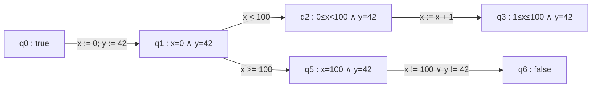
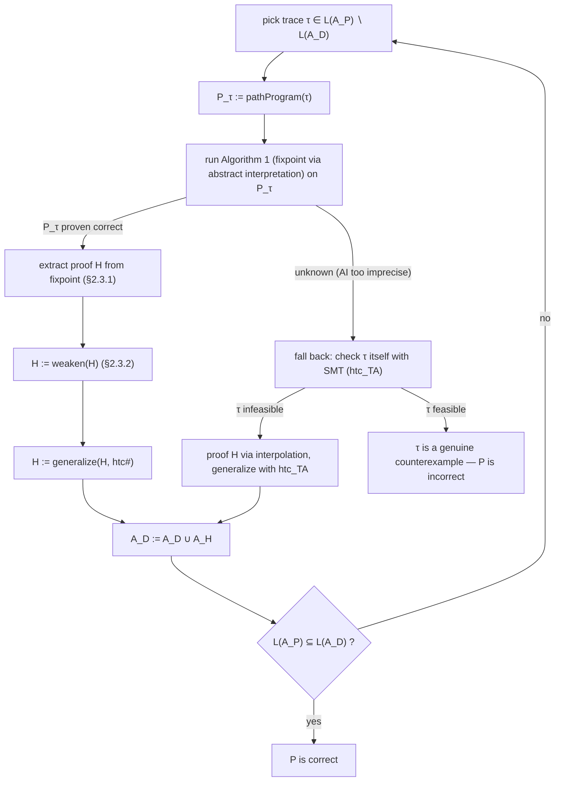

[[book-guidelines|↩ Back to guidelines]]

## Why bother slicing the program at all?

Picture a plain CEGAR loop trying to prove a program correct by ruling out one bad execution
trace at a time. It picks a sequence of statements from the start of the program to an error
location, asks an SMT solver "is this sequence actually executable?", and if the answer is no, it
extracts a proof of that infeasibility — usually via Craig interpolation — and uses the proof to
rule out that trace (and hopefully others like it) from further consideration.

This works, but it has a structural weakness: an interpolating SMT solver reasons about *one
finite, non-looping sequence of statements*. It has no mechanism for looking at a loop and
concluding "no matter how many times you run this body, some relation between the variables
keeps holding." That's precisely what a loop invariant is, and precisely what plain trace-based
interpolation is bad at producing. The dissertation's own running example makes this concrete
(§2.1): a loop that increments `x` by 1 and decrements `y` by 1 on one branch, or increments `x`
by 2 and decrements `y` by 2 on the other, starting from `x = 0, y = 1000`, with the property to
prove being `y ≤ 0` whenever `x == 1000`. An interpolating solver handed the trace

$$
\tau_2 = \texttt{x := 0; y := 1000} \;\; \texttt{x < 100} \;\; \texttt{x := x + 1} \;\; \texttt{y := y - 1} \;\; \texttt{x == 1000} \;\; \texttt{y > 0}
$$

will happily tell you this particular unwinding is infeasible, but the interpolants it hands back
(e.g. `x = 1 ∧ y = 999`) say nothing about *all* unwindings — they're facts about one run through
the loop, not the loop. To make progress, the CEGAR loop is forced to unwind the loop again,
and again, potentially forever, each time buying only "infinitesimally small progress," in the
author's own phrasing. **What breaks without an invariant-finding mechanism:** the refinement
loop degenerates into loop unrolling, which for an unbounded or non-deterministic loop simply
never terminates.

[[Abstract-Interpretation|Abstract interpretation]], by contrast, is built to compute exactly the kind of relational fact SMT
interpolation misses — it can find $x \geq 0 \land y \leq 1000 \land x + y = 1000$ as an
invariant at the loop head, and that one fact subsumes infinitely many individual unwindings at
once. The catch is the reverse: running abstract interpretation over the *entire* program tends to
be imprecise, because every time control paths merge (e.g. after an `if`), the analysis is forced
to `join` the abstract states of both branches, throwing away the correlation between which
branch was taken and which variable values resulted. Analyzing the whole program with abstract
interpretation may simply fail to find an invariant that a narrower analysis could find.

The chapter's central idea is to get the best of both: don't run abstract interpretation over the
whole program, and don't run interpolation over a single doomed unwinding — run abstract
interpretation over a *slice* of the program that corresponds to exactly the trace under
investigation. That slice is the **path program**.

## Path programs: a trace turned back into a program

### The formal machinery

Before path programs make sense, the dissertation first pins down what a program, a trace, and
an execution actually are (Defs. 1–7). None of this is exotic if you've built a CFG-based compiler
pass before, but the notation is worth internalizing because everything downstream (Floyd-Hoare
automata, the fixpoint algorithm) is phrased directly in these terms.

- **Statements** (Def. 2) are the minimal building blocks: `assume bexpr` (a guard/assumption),
  `x := expr` (an assignment), and sequencing `s;s`.
- A **program** $\mathcal{P} = (\mathrm{Loc}, \delta, \ell_0)$ (Def. 3) is a directed graph: locations
  are nodes, $\delta \subseteq \mathrm{Loc} \times \mathrm{Stmt} \times \mathrm{Loc}$ is a set of
  statement-labeled edges, $\ell_0$ is the initial location. This is exactly a control-flow graph.
- A **trace** $\tau = s_0 s_1 s_2 \ldots \in \mathrm{Stmt}^{*}$ (Def. 4) is a *sequence of edge
  labels* along some path through the graph, starting at $\ell_0$ — crucially, a trace is just a
  string of statements; it doesn't remember the intermediate locations, only that *some* path
  through $\mathcal{P}$ produces this labeling.
- A **program state** $\sigma : \mathrm{Var} \to \mathcal{D}$ (Def. 5) is a variable valuation, and
  the **successor relation** $\rho_s$ of a statement gives the standard small-step semantics:
  `assume bexpr` is the identity relation restricted to states where `bexpr` holds; `x := expr`
  updates $\sigma$ at `x`; sequencing composes relations.
- A trace $\tau$ is **feasible** (Def. 7) iff there exists a **program execution** — a matching
  sequence of states $\sigma_0 \sigma_1 \ldots$ respecting $\rho_{s_i}$ at each step (Def. 6) —
  and **infeasible** otherwise. This is the crux of what the whole chapter is trying to decide,
  automatically and at scale, for traces ending in an error location.

Now the key move (Def. 8, attributed to Beyer et al.):

> **Path program.** Given a program $\mathcal{P} = (\mathrm{Loc}, \delta, \ell_0)$ and a trace
> $\tau = s_0 s_1 \ldots \in T(\mathcal{P})$, the path program $\mathcal{P}_\tau = (\mathrm{Loc}_\tau,
> \delta_\tau, \ell_0^\tau)$ keeps only the locations touched by transitions labeled with a
> statement of $\tau$, keeps only those transitions themselves, and inherits $\mathcal{P}$'s
> initial location.

In plain words: **a path program is the subgraph of $\mathcal{P}$ that the trace $\tau$ actually
walks through.** It's a projection, or a slice, of the whole CFG down to just the locations and
edges relevant to one counterexample candidate. Figure 5/6 in the source work this through: a
program with a nested loop (outer loop on `x`, inner loop on `y`) has a trace that goes around the
outer loop once without ever entering the inner loop; the corresponding path program simply
*drops* the inner loop's location and edges entirely, because nothing in $\tau$ ever labels them.

Lemma 1 (Number of Path Programs) observes that even though a program can have infinitely
many traces (loops can be unwound arbitrarily many times), there are only **finitely many
distinct path programs**, because every path program is a subgraph of a finite graph, and a
finite graph has finitely many subgraphs. This is what makes it feasible to cache path-program
analyses across CEGAR iterations later on (§2.4.5) — many different traces collapse to the same
path program.

**Rust grounding.** If you've written a CFG-based analysis pass, `Def 3` is your `Cfg` type and
`Def 8` is a filter over it:

```rust
struct Cfg {
    locations: Vec<LocId>,
    edges: Vec<(LocId, Stmt, LocId)>,
    entry: LocId,
}

/// Def. 8: the path program of a trace is the sub-CFG touched by that trace's
/// statement sequence — a *slice*, not a fresh analysis target.
fn path_program(cfg: &Cfg, trace: &[Stmt]) -> Cfg {
    let trace_set: HashSet<&Stmt> = trace.iter().collect();
    let edges: Vec<_> = cfg.edges.iter()
        .filter(|(_, s, _)| trace_set.contains(s))
        .cloned()
        .collect();
    let locations: HashSet<LocId> = edges.iter()
        .flat_map(|(l, _, l2)| [*l, *l2])
        .collect();
    Cfg { locations: locations.into_iter().collect(), edges, entry: cfg.entry }
}
```

The important design fact this encodes: **the path program is not a fresh IR you invent per
trace — it's a restriction operator on the same CFG type your whole pipeline already uses.** That's
what makes it cheap to run the *same* fixpoint engine (Algorithm 1 from the abstract-interpretation
material) on it unmodified.

## Trace abstraction and Floyd-Hoare automata

Path programs answer "what should abstract interpretation analyze instead of a single trace?" A
separate question is: how do you organize *which* traces still need checking, across a
potentially infinite trace language, without re-deriving everything from scratch each iteration?
This is where **trace abstraction** (Heizmann et al.) supplies the automata-theoretic scaffolding
the chapter builds on.

### The program automaton: traces as a language

First, reinterpret the program itself as a finite automaton (Def. 22):
$\mathcal{A}_\mathcal{P} = (Q, \delta, q_0, F)$, where states are locations, transitions are
statement-labeled edges (same $\delta$ as before), and $F$ — the accepting states — are exactly the
error locations. The alphabet is the set of statements. By construction, the *language* of this
automaton, $\mathcal{L}(\mathcal{A}_\mathcal{P})$, is exactly the set of traces of $\mathcal{P}$
that reach an error location. Proving $\mathcal{P}$ correct is now a language question: is every
string in $\mathcal{L}(\mathcal{A}_\mathcal{P})$ actually infeasible?

### Floyd-Hoare automata: an automaton that carries its own proof

To answer that, the algorithm builds a second automaton, the **data automaton** $\mathcal{A}_D$,
whose language should end up containing $\mathcal{L}(\mathcal{A}_\mathcal{P})$ — i.e. every
error-reaching trace of the real program should also be a trace of $\mathcal{A}_D$, *because*
$\mathcal{A}_D$'s traces are provably infeasible. The mechanism that makes "provably infeasible"
a structural, checkable property of the automaton is the **Floyd-Hoare automaton** (Def. 23):

> A Floyd-Hoare automaton assigns to every state $q$ a *state assertion* $\phi_q$ such that
> (1) $\phi_{q_0} = \mathrm{true}$, (2) every transition $(q, s, q') \in \delta$ satisfies the
> valid Hoare triple $\{\phi_q\}\, s\, \{\phi_{q'}\}$, and (3) every accepting (error) state has
> $\phi_q = \mathrm{false}$.

This is worth pausing on, because it's the load-bearing definition of the whole chapter. A
Floyd-Hoare automaton is nothing more than a labeled-transition-system *encoding of an inductive
Hoare-logic proof*: each state is a program point annotated with an assertion, each edge is a
verified Hoare-triple step, and reaching an accepting state means you've derived `false` —
i.e. that state is unreachable by any feasible execution, because no concrete state can satisfy
`false`. Any trace accepted by such an automaton is, by construction, infeasible: composing valid
Hoare triples along a path from $\phi_{q_0} = \mathrm{true}$ to $\phi_q = \mathrm{false}$
is a proof, by the standard Hoare-logic *sequencing rule*, that the concatenation of statements
along the path can never actually execute.



*Every edge here is a checked Hoare triple; reaching `false` at $q_6$ proves that path can never
fire — this is Table 1/Figure 6's example wired up as a Floyd-Hoare automaton.*

### `generalize`: squeezing more mileage out of one proof

Deriving one Floyd-Hoare automaton per single infeasible trace would still leave you re-deriving
essentially the same facts trace after trace, because loops re-use the same handful of predicates
over and over. Algorithm 2 (`generalize`) exploits this: given a proof — a set of valid Hoare
triples $\mathcal{H}$ — and a **Hoare triple checker** `htc`, it closes $\mathcal{H}$ under all new
triples that can be formed from the predicates already occurring in it:

$$
\mathrm{H} = \{\{\phi\}\, s\, \{\psi\} \mid \phi, \psi \in \mathrm{Pred}(\mathcal{H}) \land s \in \mathrm{Stmt} \land \mathrm{htc}(\phi, s, \psi) = \mathrm{true}\}.
$$

Concretely: take every pair of predicates that appeared *anywhere* in the original proof, and
every statement in the program, and ask the checker whether that pair-plus-statement forms a
valid triple. Any that do get added. Because $\mathrm{Pred}(\mathcal{H})$ and $\mathrm{Stmt}$ are
both finite, this terminates, and the resulting automaton $\mathcal{A}_H$ typically accepts far
more of the error-reaching language than the single trace you started from — collapsing many
future CEGAR iterations into one.

**Rust grounding** for `htc` as a checker interface — note this is deliberately the *checking*
half of a verify/generate split, which is exactly the shape a trusted-kernel design wants:

```rust
/// A Hoare-triple checker: purely a decision procedure, no search.
/// Swappable backend — SMT-based (`htc_TA`) or abstract-transformer-based (`htc#`).
trait HoareTripleChecker {
    fn check(&self, pre: &Predicate, stmt: &Stmt, post: &Predicate) -> TriState;
}

fn generalize(h: &HashSet<HoareTriple>, checker: &dyn HoareTripleChecker, stmts: &[Stmt]) -> HashSet<HoareTriple> {
    let preds: HashSet<&Predicate> = h.iter().flat_map(|t| [&t.pre, &t.post]).collect();
    let mut result = h.clone();
    for s in stmts {
        for &phi in &preds {
            for &psi in &preds {
                if checker.check(phi, s, psi) == TriState::True {
                    result.insert(HoareTriple { pre: phi.clone(), stmt: s.clone(), post: psi.clone() });
                }
            }
        }
    }
    result
}
```

## Deriving invariants from the abstract interpretation fixpoint

Trace abstraction alone still analyzes one trace at a time via SMT. The chapter's contribution
is to interleave this with abstract interpretation *on path programs*, and Figures 11–13
(read as a sequence) are the cleanest way to see the idea assembled incrementally.



*This is Figure 13's algorithm, the chapter's full CEGAR loop, unrolled as one flowchart.*

The mechanism that turns a raw fixpoint into a usable proof is §2.3.1. Given the path program's
fixpoint $f : \mathrm{Loc}_\tau \to S^{\#}$ from Algorithm 1, and assuming a conversion function
$p$ from abstract states to (loss-free) SMT-compatible predicates, the proof is built directly:

$$
\forall \ell \in \mathrm{Loc}_\tau : \phi_\ell = p(f(\ell)), \qquad
\mathcal{H} = \{\{\phi_\ell\}\, s\, \{\phi_{\ell'}\} \mid (\ell, s, \ell') \in \delta_\tau\}.
$$

Every edge of the path program becomes a candidate Hoare triple, with pre/post assertions read
straight off the fixpoint at its endpoints. If the fixpoint proved the error location unreachable
(its abstract state is $\bot$, i.e. the predicate `false`), this set of triples *is* a proof of
infeasibility for every trace $\mathcal{P}_\tau$ represents — including, crucially, every loop
unwinding at once, because the fixpoint already accounts for arbitrarily many iterations through
`Loc∇` widening locations. **This is the mechanism by which the dissertation actually delivers
loop invariants**: $\phi_\ell$ at a loop head, read off the fixpoint, *is* the loop invariant, in
exactly the technical sense Hoare logic uses that term — an assertion that is both established on
loop entry and preserved by the loop body.

Worked example (Table 1, continuing the nested-loop program from Figure 5/6): analyzing the path
program with an interval abstract domain over integers produces exactly

$$
\phi_{\ell_1} = 0 \le x \le 100 \land y = 42, \quad
\phi_{\ell_5} = x = 100 \land y = 42, \quad
\phi_{\ell_6} = \mathrm{false}.
$$

The last equation, $\phi_{\ell_6} = \mathrm{false}$ at the error location, is the proof: no
feasible execution reaches $\ell_6$.

## Generalizing proofs with a cheap Hoare triple checker: `htc#`

`generalize` (Algorithm 2) needs *some* checker to decide new candidate triples, and the obvious
choice — an SMT solver, as trace abstraction uses (`htc_TA`, via verification-condition
generation) — is exactly what the chapter wants to avoid here, because state assertions coming
out of abstract interpretation tend to have many conjuncts (interval bounds for every variable,
or, worse, a full octagon closure), and an SMT query per candidate pair is expensive at that
scale.

The fix is to notice that a Hoare triple built from *abstract* states doesn't need an SMT solver
at all to be checked — it needs the abstract domain's own transformer:

$$
\{\phi_\ell\}\, s\, \{\phi_{\ell'}\} \text{ is valid} \iff \mathrm{post}^{\#}(\sigma_\ell^{\#}, s) \sqsubseteq \sigma_{\ell'}^{\#}.
$$

That is: apply the abstract transformer $\mathrm{post}^{\#}$ (the same one Algorithm 1 already
uses to compute the fixpoint) to the source state and the statement, and check that the result is
contained in the target abstract state via the domain's partial order $\sqsubseteq$ — a
lattice-membership check, not a satisfiability query. This defines `htc#`, and it's asymptotically
much cheaper than `htc_TA` for exactly the states abstract interpretation produces, at the cost of
being no more precise than the abstract domain itself (an inherent trade-off: `htc#` can return
"invalid" for triples that an SMT solver, reasoning at full concrete precision, would accept as
valid — a genuine loss, but one already implicit in choosing to use abstract interpretation at
all).

**What breaks without this distinction:** using `htc_TA` uniformly would make `generalize` pay an
SMT query for every pair of (often large) abstract-domain predicates × every program statement —
exactly the cost profile the whole path-program idea was trying to avoid. Swapping in `htc#` for
proofs that originate from abstract interpretation, while keeping `htc_TA` for proofs that
originate from single-trace interpolation (§2.3, Figure 13's bottom branch), lets each proof
source use the checker matched to its own representation.

**Lean framing.** This checker/generator split is structurally the same shape as a proof
assistant's elaborator-vs-kernel boundary: `generalize` is the "elaborator" doing unrestricted
search over candidate Hoare triples, and `htc#`/`htc_TA` are small, trusted "kernels" that only
*verify* a candidate, never invent one. Swapping which trusted checker backs a given proof
(`htc#` vs. `htc_TA`) is the same move as a kernel accepting a proof term either by unfolding
definitions (`rfl`-like reduction, cheap, limited) or by falling back to a heavier decision
procedure — the checker's power/cost trade-off is orthogonal to the soundness guarantee, exactly
as it is here.

## Weakening: fewer conjuncts, same proof

Even once `htc#` avoids SMT costs, `post#` itself is expensive on state assertions with many
conjuncts — cubically expensive for relational domains like octagons, whose closure computation
scales with the number of variable pairs. So the chapter adds one more optimization pass:
**weakening** (§2.3.2, Algorithm 3), which strips irrelevant conjuncts from each state assertion
in a proof *while preserving inductiveness* — i.e. while keeping every Hoare triple in the
sequence valid.

The proof from a path program has a special shape: because it comes from a single trace, it's a
linear chain

$$
\mathcal{H} = \{\phi_0\}\, s_0\, \{\phi_1\}\, s_1\, \{\phi_2\} \ldots \{\phi_n\}\, s_n\, \{\phi_{n+1}\},
$$

with $\phi_0 = \mathrm{true}$ and $\phi_{n+1} = \mathrm{false}$. `weaken` walks this chain
**backwards**, starting from `false`, tracking a set $K$ of "variables that must be kept" because
some assertion further along in the (already-processed, i.e. later) chain still depends on them.
At each step, for statement $s$: variables written-but-not-read by $s$ get dropped from $K$ (their
old value is dead — a standard liveness argument), variables read by $s$ are folded into $K$
(their value matters for validity), and any conjunct of $\phi$ that mentions *only* variables
outside $K$ gets deleted. Whatever remains, $\hat\phi$, then contributes its own variables back
into $K$ for the next (earlier) step.

The worked example in the source is illustrative: a proof carrying $y \geq 0 \land y \leq 10$
alongside every assertion about $x$, even though $y$ is never touched by the branch that fails —
weakening strips every $y$-conjunct across the whole chain, because $y$ is never in $K$ at any
point walking backward from `false`. The number of Hoare triples is unchanged; only their size
shrinks, and — this is the soundness property that matters — each new assertion is implied by
(covers) less than the original: $\forall \phi_i \in \mathcal{H}, \phi_j' \in \mathcal{H}' :
i = j \Rightarrow (\phi_i \Rightarrow \phi_j')$. A **weaker** assertion covering the same location
means the resulting automaton accepts a *superset* of traces the original would — i.e. weakening
also improves generalization, not just speed.

```python
# Python sketch — the shape of weaken (Algorithm 3), not the full domain machinery.
def weaken(triples):
    # triples: reversed list of (phi, stmt, phi_prime), already in reverse trace order
    K = set()
    result = []
    phi_p = "false"
    for phi, stmt, _ in triples:
        W_s = written_only_vars(stmt)      # written but not read
        R_s = read_vars(stmt)
        K -= W_s
        K_s = R_s | K
        phi_hat = drop_conjuncts_outside(phi, K_s)   # keep conjuncts mentioning K_s
        K |= vars_of(phi_hat)
        result.append((phi_hat, stmt, phi_p))
        phi_p = phi_hat
    return list(reversed(result))
```

This is a textbook **backward liveness/dead-variable analysis** wearing a Hoare-logic hat — worth
naming explicitly, since the dissertation doesn't call it that, but the fixpoint-free, single
backward pass over a linear chain is exactly a liveness dataflow computation specialized to one
trace.

## Combining abstract interpretation and SMT in one CEGAR loop

Putting §2.3–2.3.2 together, the full algorithm (Figure 13) is a single CEGAR loop with two
analysis engines feeding the same data automaton $\mathcal{A}_D$:

1. Pick an as-yet-uncovered trace $\tau$ (one not yet accepted by $\mathcal{A}_D$).
2. Build its path program $\mathcal{P}_\tau$ and run the fixpoint computation (Algorithm 1).
3. **If abstract interpretation proves $\mathcal{P}_\tau$ correct:** extract the proof from the
   fixpoint (§2.3.1), weaken it (§2.3.2), generalize it with `htc#` (Algorithm 2), and fold the
   resulting Floyd-Hoare automaton into $\mathcal{A}_D$. This is the path that finds genuine loop
   invariants and can dispose of infinitely many future unwindings in one shot.
4. **If abstract interpretation is inconclusive** (its over-approximation reaches the error
   location, which — because it's only an over-approximation — does *not* mean the program is
   actually incorrect): fall back to checking the single trace $\tau$ itself with an interpolating
   SMT solver, exactly as plain trace abstraction would. If $\tau$ turns out infeasible, its
   interpolant sequence becomes a proof, generalized with `htc_TA`, and folded in the same way.
   If $\tau$ is feasible, it's a genuine counterexample — the program is proven incorrect.
5. Repeat until $\mathcal{L}(\mathcal{A}_\mathcal{P}) \subseteq \mathcal{L}(\mathcal{A}_D)$ (every
   error-reaching trace is covered — program correct) or a real counterexample is found.

The termination argument this buys is worth stating precisely, since it's the whole point of the
chapter (and echoed in the guidelines' framing "the thesis aims to give abstraction-refinement
techniques that combine precision with stronger guarantees"): plain SMT-based CEGAR risks
unwinding a loop forever with no guarantee of ever finding a sufficient interpolant. Here, the
abstract interpretation branch, whenever it succeeds, is guaranteed by the widening operator
(Algorithm 1, `Loc∇`) to terminate and to produce a genuine loop invariant when the abstract
domain is expressive enough. Whenever it isn't expressive enough, the fallback to single-trace
analysis still guarantees the CEGAR loop *makes progress* — it removes at least the one checked
trace from further consideration, so the loop can't stall entirely, even in the worst case.
That combination — invariant-strength progress when possible, single-trace progress as a
floor — is the guarantee neither technique offers alone.

## Where this leads

This machinery is the analytical core that ULTIMATE TAIPAN (Topic 4) wraps in an actual
implementation: `htc#` becomes a concrete Java component inside the `FixpointEngine`, the abstract
domains it runs over (intervals, octagons, congruences, their reduced product) are exactly Topic
2's abstract-interpretation material applied here, and large/dynamic block encoding (Topic 4)
is an optimization on top of the same path-program idea — merging several path-program locations
into one before this whole loop even starts, to further cut down on `post#`/join calls.

**Load-bearing for the compiler/elaborator project:** this chapter is close to a direct blueprint
for the "abstract interpretation supports proving absence of bugs" half of the planned CSP+AI
verification kernel. Three pieces transfer almost directly: (1) the checker/generator split
(`generalize` searches, `htc#`/`htc_TA` verify) is the same shape as an elaborator producing
candidate proof terms for a small trusted kernel to check — worth carrying over as a design
pattern for how the eventual Hoare-triple/refinement-type checker should be structured, rather
than folding search and verification into one monolithic pass; (2) reading a loop invariant
directly off an abstract-interpretation fixpoint (§2.3.1's $\phi_\ell = p(f(\ell))$) is the
concrete mechanism for "abstract interpretation for automated invariant generation" from the
standing project goals — this *is* how you turn a fixpoint into a `requires`/`ensures`-shaped
contract automatically; (3) weakening is a cheap, syntactic way to keep those generated contracts
small enough to be useful as human-readable or SMT-checkable annotations, which matters directly
for any refinement-type inference pipeline that plans to hand generated invariants back to a
solver or a user.
