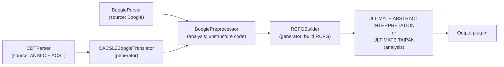
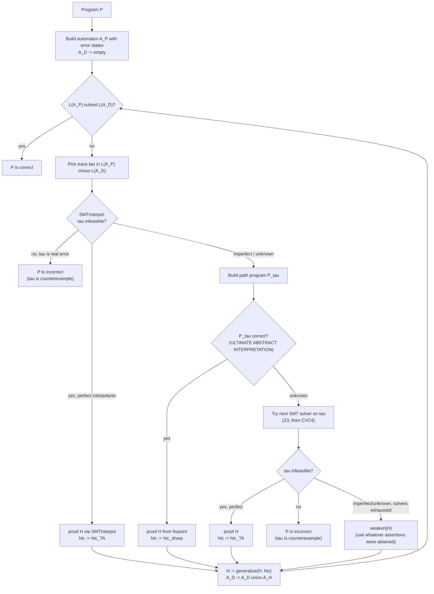
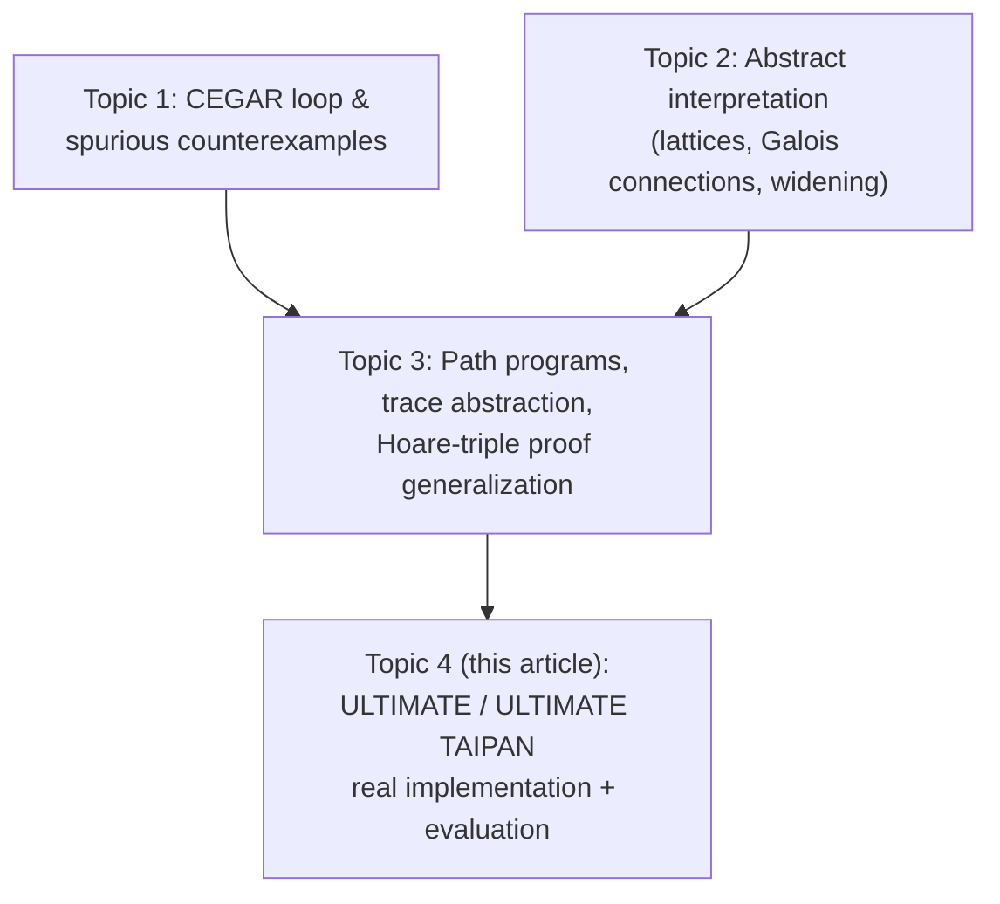

# ULTIMATE and ULTIMATE TAIPAN

[[book-guidelines|↩ Back to guidelines]]

## Why this chapter exists: an algorithm is not a tool

Chapters 2.1–2.3 of the dissertation give you an *algorithm*: interleave trace abstraction and [[Abstract-Interpretation|abstract interpretation]], use abstract interpretation's fixpoints to manufacture loop invariants, and fall back to SMT-based interpolation when abstract interpretation can't discharge a path program. That's the theory. But an algorithm description like "run abstract interpretation on the path program" hides a mountain of engineering decisions: What happens when abstract interpretation and the SMT solver disagree about which one to try first? What do you do when a single join operation collapses two precise abstract states into a useless one? What if the automaton you're building blows up because your control-flow graph has one transition per statement instead of one per basic block?

Section 2.4 is where the dissertation stops being a proof-obligation description and becomes a piece of software architecture. It matters for the same reason your own toolchain design will matter later: a CEGAR loop that is *sound on paper* can still be useless in practice if the plug-in boundaries are wrong, if the abstract domain can't represent the formula it's being asked to evaluate, or if the automaton operations don't scale. This is the "how you'd implement/check it" reading of Chapter 2 — and it is the reading that transfers most directly to your own CEGAR-based invariant generator.

## 1. ULTIMATE: a program analysis framework built as a plug-in pipeline

### What breaks without a plug-in architecture

Imagine building one monolithic tool that parses C, translates it to an intermediate representation, builds a control-flow graph, runs abstract interpretation, runs trace abstraction, and talks to three different SMT solvers — all as one hard-wired pipeline. The moment you want a second front-end language, or want to swap in a different invariant-generation strategy, or want to reuse the control-flow-graph builder for an entirely different back-end analysis, the monolith fights you. Every reusable piece (parsing, IR construction, invariant synthesis, output formatting) is coupled to every other piece.

ULTIMATE, the open-source framework the dissertation's tools are built on (Java, on top of the Eclipse Rich Client Platform), solves this by being a *plug-in pipeline*, called a **toolchain**. ULTIMATE recognizes six classes of plug-in:

1. **Controller** plug-ins — bootstrap the framework (CLI or GUI entry point).
2. **Source** plug-ins — parse an input file into a unified model representation. The dissertation uses `CDTParser` (ANSI-C with ACSL annotations) and `BoogieParser` (the Boogie intermediate verification language).
3. **Analysis** plug-ins — consume a model representation and analyze it (e.g. abstract interpretation, trace abstraction).
4. **Generator** plug-ins — produce a *new* model representation from an existing one (e.g. translating a C AST into a Boogie AST, or a Boogie AST into a control-flow graph).
5. **Output** plug-ins — render results (files, or an on-screen visualization).
6. **Library** plug-ins — shared infrastructure: automata data structures, an SMT-LIB translation layer, etc.

A concrete toolchain, as used in this dissertation, looks like:



Each plug-in's output is the next plug-in's input — a `Model → Model` pipeline where every stage is independently swappable. The model that flows through the analysis stages is a **recursive control-flow graph (RCFG)**: a control-flow graph augmented so that, for each procedure-return location, the graph also records the matching call location, so the analysis can correctly identify a call's successor after the callee returns. This is what "supergraph"-style representations (Sharir–Pnueli) look like once you need sound handling of recursive procedure calls.

### Rust grounding: the plug-in boundary as a trait

The exact shape of ULTIMATE's plug-in contract translates almost verbatim to Rust traits over a shared IR type. This is worth internalizing, because it is close to the architecture you'd want for your own Rust-based verifier's front end/back end split:

```rust
/// The unified model every plug-in in a toolchain speaks.
pub struct RecursiveCfg {
    pub locations: Vec<Location>,
    pub transitions: Vec<Transition>,
    pub entry: LocationId,
    // maps a procedure's return location to the location that called it,
    // so recursive calls resolve their successor correctly.
    pub call_return_map: std::collections::HashMap<LocationId, LocationId>,
}

/// Every analysis plug-in (ULTIMATE's `IAnalysis`) implements this.
pub trait Analysis {
    type Result;
    fn run(&mut self, program: &RecursiveCfg) -> Self::Result;
}

/// Every generator plug-in (e.g. AST -> RCFG) implements this.
pub trait Generator<In, Out> {
    fn transform(&self, input: In) -> Out;
}

/// A toolchain is just a typed pipeline of these, composed in sequence.
pub struct Toolchain<A: Analysis> {
    pub source: Box<dyn Fn(&std::path::Path) -> RecursiveCfg>,
    pub analysis: A,
}

impl<A: Analysis> Toolchain<A> {
    pub fn run(&mut self, file: &std::path::Path) -> A::Result {
        let cfg = (self.source)(file);
        self.analysis.run(&cfg)
    }
}
```

The key architectural insight worth carrying forward: **the analysis plug-in never needs to know which source plug-in produced the RCFG it received.** This is exactly the separation you want between your compiler's parser/elaborator front end and your CSP/abstract-interpretation back end — the back end should only ever see a normalized IR, never source-language syntax.

## 2. ULTIMATE ABSTRACT INTERPRETATION: implementing Algorithm 1 as a plug-in

`ULTIMATE ABSTRACT INTERPRETATION` is the analysis plug-in implementing the abstract fixpoint computation algorithm from Section 2.2.2 (the classical: initialize all locations to $\bot$, propagate `post#` along edges, apply the join operator $\sqcup$ at merge points, apply the widening operator $\nabla$ at loop heads until the ascending chain stabilizes). Its class structure (Figure 14 in the source) is:

- `AbstractInterpretation` implements `IAnalysis` — the entry point the toolchain calls.
- `AbstractInterpreter` (static) — configures settings and hands off to...
- `FixpointEngine` — contains `calculateFixpoint(program, maxUnwind, maxParallel)`, the actual Algorithm 1.
- `LoopDetector` — identifies loop heads (locations with two outgoing edges: "enter the loop body" and "skip/exit the loop"), which is exactly the set $\mathrm{Loc}_\nabla$ that Algorithm 1 uses to decide *where* to widen.
- `IAbstractDomain` / `IAbstractState` / `IPostOperator` / `IWideningOperator` — the pluggable abstract-domain interface (intervals, octagons, congruences, or a compound/reduced product of these — covered in depth under the "Abstract Interpretation" topic; here they matter only as the *thing this plug-in is generic over*).

Two implementation parameters matter enough to be worth internalizing on their own, because they are exactly the kind of "termination guarantee vs. precision" knob your own abstract-interpretation-driven invariant generator will need to expose:

**`maxUnwind`** — how many times a loop body is unrolled *before* widening kicks in. Default: 3. Unroll fully for loops with few iterations (precise, no information loss), widen for loops that could iterate arbitrarily many times (guaranteed termination, some precision loss). This is a direct engineering answer to the theoretical tension in Definition 18 (ascending chains, stabilization) — you don't widen *immediately* just because the theory permits it; you delay widening as long as you can still afford to.

**`maxParallel` and disjunctive abstract states** — this is the more interesting design decision. Ordinarily, if a location $\ell$ is reached twice during fixpoint iteration producing two abstract states $\sigma_1^\#$ and $\sigma_2^\#$, the algorithm merges them with the join operator (line 12 of Algorithm 1). If $\sigma_1^\# = (x \in [1,5])$ and $\sigma_2^\# = (x \in [6,10])$, the join produces $\sigma^\# = (x \in [1,10])$ — an over-approximation that admits values like $x = 5.5$ that neither original branch could actually produce (assuming integers, in fact it admits any integer in $[1,10]$, losing the gap). A **disjunctive abstract state** avoids this by storing *both* states side by side and representing their state assertion as an explicit disjunction:

$$\phi_{1,2} \equiv (x \ge 1 \land x \le 5) \lor (x \ge 6 \land x \le 10)$$

`maxParallel` (default 2) caps how many such disjuncts are kept at any one location before they get collapsed with $\sqcup$ anyway. This is a direct precision/cost trade: more disjuncts preserved means more precise state assertions later (which, per Section 2.3, is exactly what feeds into loop-invariant discovery and proof generalization) but a larger fixpoint computation because each disjunct is propagated independently.

**What breaks without disjunctive states:** consider a program with an `if`/`else` producing two disjoint value ranges that later feed into an `assert` that only one branch could ever violate. A naive join at the merge point can manufacture a spurious violation of the assertion that no concrete execution could ever trigger — this is precisely the kind of imprecision that would force an unnecessary refinement iteration (or an outright false alarm) in a CEGAR loop.

### Rust grounding: disjunctive states as `SmallVec<AbstractState>`

```rust
/// A disjunctive abstract state: represents the *disjunction* of the
/// abstract states it stores, up to `max_parallel` before collapsing.
pub struct DisjunctiveState<S: AbstractDomain> {
    disjuncts: Vec<S::State>,
    max_parallel: usize,
}

impl<S: AbstractDomain> DisjunctiveState<S> {
    /// Merge in a newly reached state at the same location.
    fn merge(&mut self, domain: &S, new_state: S::State) {
        self.disjuncts.push(new_state);
        if self.disjuncts.len() > self.max_parallel {
            // Collapse everything with the join operator, losing the
            // gaps between disjuncts but bounding memory/time.
            let joined = self.disjuncts
                .drain(..)
                .reduce(|a, b| domain.join(&a, &b))
                .unwrap();
            self.disjuncts.push(joined);
        }
    }
}
```

## 3. ULTIMATE TAIPAN: the full CEGAR workflow

`ULTIMATE TAIPAN` is where everything from Chapter 2 comes together as a real tool. It is built on top of `ULTIMATE AUTOMIZER`, an existing trace-abstraction-based model checker, and extends it by wiring in `ULTIMATE ABSTRACT INTERPRETATION` as an additional invariant source. TAIPAN currently does not handle arrays, bitvectors, or IEEE-754 floats/doubles, but does support Boogie's real-valued type.

The theoretical algorithm from Section 2.3 (Figure 12: pick a trace, try SMT, else build a path program and run abstract interpretation) gets one crucial engineering refinement in TAIPAN's actual workflow (Figure 18):



The one detail that isn't obvious from the diagram alone: **SMTInterpol runs first, before abstract interpretation is even tried.** SMTInterpol is tightly integrated into ULTIMATE and produces Craig interpolants very fast. Only when SMTInterpol fails to produce a *perfect sequence of state assertions* (defined precisely below) — or its result is `unknown` — does TAIPAN pay the cost of constructing a path program and running abstract interpretation on it. If abstract interpretation also comes back `unknown`, TAIPAN falls back further, trying Z3 and then CVC4 on the raw trace. This is a strict cost-ordered fallback chain: cheapest-and-often-good-enough first, most-expensive-but-most-powerful last.

### "Perfect" sequences of state assertions

A sequence of state assertions produced by interpolation is **perfect** iff: for every state assertion $\phi$ attached to a program location visited by the trace, and for every earlier occurrence of the *same* transition (same statement) in the trace with an associated assertion $\phi_t$, it holds that $\phi \implies \phi_t$. Put in words: if the trace revisits the same program point/transition multiple times (which happens whenever the trace goes around a loop), the later-derived assertion at that point must be at least as strong as every earlier one. Straight-line traces (no loop) are perfect by construction, trivially. The payoff for perfection: **a perfect sequence's assertions at loop-head locations are, by construction, valid loop invariants** — which is exactly the deliverable the whole CEGAR scheme needs to make genuine progress instead of unrolling the loop one more time.

### Two engineering optimizations

1. **Skip path-program construction for straight-line traces.** If the picked trace $\tau$ never touches a loop, plain SMT-based analysis of $\tau$ is both faster and typically yields *more general* state assertions than path-program analysis would. Abstract interpretation is only invoked when there's an actual loop to find an invariant for.
2. **Cache analyzed path programs.** If the algorithm has already tried a path program and found the available abstract domains too weak to prove it, re-analyzing the identical path program later (which happens naturally as loop unrolling revisits the same shape) is wasted work — TAIPAN detects the repeat and routes straight to SMT-based analysis of the trace instead.

### Rust grounding: the fallback chain as a `Result`-chained pipeline

The "try cheap, escalate to expensive" shape recurs throughout verification tooling (and will recur in your own solver's tactic dispatch). It maps naturally onto Rust's `?`/combinator style rather than a nested if-else pyramid:

```rust
enum ProofOutcome {
    Correct(StateAssertions),
    Counterexample(Trace),
    Unknown,
}

fn analyze_trace(tau: &Trace, cfg: &RecursiveCfg) -> ProofOutcome {
    // Cheapest: SMTInterpol with Craig interpolation.
    match smt_interpol::analyze(tau) {
        SmtResult::Feasible => return ProofOutcome::Counterexample(tau.clone()),
        SmtResult::Infeasible { assertions } if assertions.is_perfect() =>
            return ProofOutcome::Correct(assertions),
        SmtResult::Infeasible { .. } | SmtResult::Unknown => {} // fall through
    }

    // Middle: build a path program, hand it to abstract interpretation —
    // but only if tau actually touches a loop (optimization #1).
    if tau.touches_loop(cfg) {
        let path_program = build_path_program(tau, cfg);
        if let Some(cached) = path_program_cache::lookup(&path_program) {
            if cached.was_too_weak {
                // fall through to SMT fallback chain instead of re-analyzing
            }
        } else if let FixpointResult::Correct(assertions) =
            ultimate_abstract_interpretation::run(&path_program)
        {
            return ProofOutcome::Correct(assertions);
        }
    }

    // Most expensive: escalate through remaining SMT solvers in sequence.
    for solver in [Solver::Z3, Solver::Cvc4] {
        match solver.analyze(tau) {
            SmtResult::Feasible => return ProofOutcome::Counterexample(tau.clone()),
            SmtResult::Infeasible { assertions } if assertions.is_perfect() =>
                return ProofOutcome::Correct(assertions),
            _ => continue,
        }
    }
    ProofOutcome::Unknown // weaken() and use whatever partial assertions exist
}
```

## 4. Large block encoding: fewer automaton states, same semantics

TAIPAN represents programs and their traces as automata, and the cost of the core automaton operation the algorithm relies on — computing the language difference $\mathcal{L}(\mathcal{A}_\mathcal{P}) \setminus \mathcal{L}(\mathcal{A}_D)$ — grows with the number of automaton states. So it pays to keep the underlying program graph as small as possible *without changing its semantics*.

**Large block encoding** merges a chain of locations/transitions, each labeled by a single statement, into one location pair connected by a single transition labeled by the *sequence* of statements. Concretely, for the Boogie program

```
procedure f() {
  var a, b : int;
  assume a <= 5;
  assume b == a;
  assert b <= 5;
}
```

without block encoding you get a chain $\ell_3 \xrightarrow{a \le 5} \ell_4 \xrightarrow{b=a} \ell_5 \xrightarrow{b > 5} \ell_6$ (the assertion's negation, `b > 5`, is what's checked for reachability of the error location $\ell_6$). With large block encoding this collapses to a single transition $\ell_3 \to \ell_6$ labeled with the whole sequence. Running `post#` on the merged single transition gives the identical resulting abstract state as running `post#` three times in sequence on the unmerged chain — large block encoding is a pure automaton-size optimization, not a precision change, *as long as `post#` is applied to each conjunct/statement in the same order as before*.

## 5. Dynamic block encoding: when conjunct order silently changes precision

Here's the subtlety that makes Section 2.4.6 more than "just merge some nodes." ULTIMATE can label transitions with **transition formulas** instead of raw statements — first-order logic formulas over SMT theories, formally a tuple

$$\psi = (\phi, \mathrm{IN}, \mathrm{OUT}, \mathrm{AUX}, pv)$$

where $\phi$ is a closed formula over three disjoint variable sets — input variables $\mathrm{IN}$, output variables $\mathrm{OUT}$ (written primed, e.g. $b'$), and auxiliary variables $\mathrm{AUX}$ — and $pv$ injectively maps those formula variables back to actual program variables. When large block encoding merges several statements into one transition, the transition formula becomes a **conjunction** of the individual statements' formulas: e.g. $a' \le 5 \land b' = a' \land b' > 5$.

Now the abstract transformer `post#` has to be applied to this whole conjunction, and there's more than one way to do that: $\mathrm{post}^\#(\sigma^\#, A \land B)$ can be computed as $\mathrm{post}^\#(\sigma^\#, A) \sqcap \mathrm{post}^\#(\sigma^\#, B)$, or as $\mathrm{post}^\#(\mathrm{post}^\#(\sigma^\#, A), B)$, or with $A$ and $B$ swapped. Logical $\land$ is commutative — but **the abstract post-computation is not**, because the domain being used may not be able to *represent* every conjunct precisely.

**Concrete failure mode.** The [[Abstract-Interpretation#Interval domain|interval domain]] cannot express the relation $b' = a'$ (a relation between two variables — intervals track each variable independently). Take the pre-state $\top$ (both variables unconstrained) and the conjunction $a' \le 5 \land b' = a' \land b' > 5$:

- If $b' = a'$ is evaluated **first**: $\mathrm{post}^\#(\top, b'=a') = \top$ (the interval domain literally cannot record the equality, so nothing changes), and the subsequent conjuncts are then applied to an already-useless state. The final result loses the contradiction entirely.
- If $b' = a'$ is evaluated **last** (after $a' \le 5$ and $b' > 5$ have already narrowed both variables): the result correctly reaches $\bot$ — the true, desired answer, since the conjunction is in fact unsatisfiable.

So *conjunct evaluation order determines whether precision is lost*, purely as an artifact of which relations a given abstract domain can or cannot represent. Large block encoding by itself gives no guidance on ordering; naively evaluating conjuncts left-to-right (or in whatever order they happen to be merged) can silently throw away exactly the information a later refinement step needed.

### Expressibility: choosing the order automatically

TAIPAN's fix is to equip each abstract domain with an **expressibility predicate** $\mathrm{ex}$: for a given non-logical symbol occurring in a transition formula (a relation, function application, variable, or constant), $\mathrm{ex}$ decides whether that symbol/relation can be represented in the domain *without loss of precision*. For example: the interval domain's $\mathrm{ex}$ is true only for relations touching a single variable; the [[Abstract-Interpretation#Octagon domain|octagon domain]]'s $\mathrm{ex}$ is true for relations of the shape $\pm v_i - \pm v_j \le c$.

Given a transition formula $\phi$, TAIPAN first converts it to disjunctive normal form $\phi = \phi_0 \lor \phi_1 \lor \dots \lor \phi_n$ (each $\phi_i$ a conjunction $\phi_i^0 \land \phi_i^1 \land \dots \land \phi_i^m$), and then for each disjunct $\phi_i$ computes $\sigma_i^{\#\prime} = \mathrm{post}^\#(\sigma^\#, \phi_i)$ in two passes:

1. **Expressible conjuncts first**, all at once (order among them doesn't matter, since none of them loses information):
$$\sigma_i^{\#\prime\prime} = \bigsqcap_{\mathrm{ex}(\phi_i^k)} \mathrm{post}^\#(\sigma^\#, \phi_i^k)$$
2. **Inexpressible conjuncts**, applied repeatedly to a fixpoint (they might still narrow the state indirectly, via join/interaction with what step 1 already established):
$$\sigma_i^{\#\prime} = \mathrm{fixpoint}\Big(\bigsqcap_{\lnot\mathrm{ex}(\phi_i^k)} \mathrm{post}^\#(\sigma_i^{\#\prime\prime}, \phi_i^k)\Big)$$

Finally the per-disjunct results are joined: $\mathrm{post}^\#(\sigma^\#, \phi) = \bigsqcup_{i=0}^n \sigma_i^{\#\prime}$. In the running example, step 1 evaluates $a' \le 5$ and $b' > 5$ (both single-variable, hence expressible in the interval domain) first, correctly narrowing to $(a \in (-\infty,5], b \in (5,\infty))$; step 2 then applies the inexpressible $b' = a'$ against that already-narrowed state and correctly derives $\bot$. This *reordering of conjuncts, chosen dynamically per abstract domain*, is what "dynamic block encoding" names — large block encoding decides *which statements to merge*; dynamic block encoding decides, given a merge, *the safest order in which to evaluate the resulting conjunction* for whichever domain happens to be running.

### Rust grounding: `ex` as a domain-supplied classifier

```rust
/// A single conjunct of a transition formula's DNF disjunct.
struct Conjunct { /* relation symbol, operands, ... */ }

trait AbstractDomain {
    type State;
    /// Can this conjunct be applied with post# without precision loss
    /// in this domain? (the domain-specific `ex` predicate)
    fn is_expressible(&self, conjunct: &Conjunct) -> bool;
    fn post(&self, state: &Self::State, conjunct: &Conjunct) -> Self::State;
    fn meet(&self, a: &Self::State, b: &Self::State) -> Self::State;
}

/// Dynamic block encoding: evaluate expressible conjuncts first (batched),
/// then repeatedly apply inexpressible ones to a fixpoint.
fn post_conjunction<D: AbstractDomain>(
    domain: &D,
    pre: D::State,
    conjuncts: &[Conjunct],
) -> D::State
where
    D::State: PartialEq + Clone,
{
    let (expressible, inexpressible): (Vec<_>, Vec<_>) = conjuncts
        .iter()
        .partition(|c| domain.is_expressible(c));

    let mut state = expressible
        .iter()
        .fold(pre, |acc, c| domain.post(&acc, c));

    loop {
        let next = inexpressible
            .iter()
            .fold(state.clone(), |acc, c| domain.post(&acc, c));
        if next == state {
            break state;
        }
        state = next;
    }
}
```

This function is a direct, load-bearing template for your own CSP/abstract-interpretation kernel: **any time you combine a domain-agnostic evaluation order with domain-specific expressiveness, you need an `is_expressible`-style predicate to decide evaluation order safely — otherwise your join/meet lattice operations silently discard information depending on incidental syntactic ordering of constraints.** This is precisely the sort of issue that will resurface when your CSP kernel does domain/lattice propagation over mixed integer/non-linear/automaton-shaped domains: some constraints will be exactly representable in a given domain (e.g. linear inequalities in an octagon-like domain) and others won't (e.g. non-linear or automaton-language constraints), and the propagation order you choose has the same precision consequences shown here.

## 6. Experimental comparison: does the theory actually pay off?

Section 2.5 runs two separate experiments.

**2.5.1 — Isolating the abstract-interpretation contribution.** `ULTIMATE ABSTRACT INTERPRETATION` (whole-program fixpoint computation, no path-program partitioning) is compared against `ULTIMATE SIMPLE TAIPAN` (the theoretical CEGAR scheme of Section 2.3 *without* the SMT fallback — i.e. it can only prove correctness, never report a counterexample), across five abstract-domain configurations (intervals `I`, congruences `C`, octagons `O`, and the compound/reduced-product domains `I+C` and `O+C`), on 850 correct SV-COMP 2018 programs from the `ReachSafety-ECA` and `ReachSafety-Loops` categories. Results: `SIMPLE TAIPAN` proves *more* programs correct (42 vs. 31, using the best domain `O+C`) and times out *less often* (712 vs. 736), because path programs are strict fragments of the whole program and therefore cheaper to find a fixpoint for — this is direct experimental confirmation of the motivating claim from Section 2.2.1's Lemma 1 (finitely many distinct path programs) and the whole premise of partitioning by trace rather than analyzing the program monolithically. The compound domain `O+C` (octagons + congruences) is the best precision/cost trade-off overall and becomes TAIPAN's default.

**2.5.2 — The full pipeline vs. pure trace abstraction.** Three configurations are compared on 359 programs (SV-COMP 2017, `ReachSafety-Loops` + a 200-program sample of `ReachSafety-ECA`):

- **AUTOMIZER** — SMTInterpol → Z3 → CVC4 (no abstract interpretation at all).
- **LAZY TAIPAN** — SMTInterpol → Z3 → CVC4 → *then* abstract interpretation (abstract interpretation only as a last resort).
- **TAIPAN** — SMTInterpol → abstract interpretation → Z3 → CVC4 (abstract interpretation tried early, per Figure 18).

| Configuration | Solved (of 359) | Solved exclusively |
|---|---|---|
| AUTOMIZER | 124 | 17 |
| LAZY TAIPAN | 145 | 0 |
| TAIPAN | 176 | 30 |

TAIPAN solves substantially more benchmarks than AUTOMIZER, and — importantly — 30 of those are solvable *only* by TAIPAN: programs in `ReachSafety-ECA` with many branches, where trace abstraction alone generates too many individual traces to converge, but abstract interpretation's ability to join/over-approximate across branches collapses large swaths of the state space at once. AUTOMIZER still wins 17 programs exclusively — cases where abstract interpretation's path-program overhead outweighs its precision gains, because the fixpoint computation loses too much precision to branching. LAZY TAIPAN, tellingly, solves *zero* programs exclusively: since it strictly dominates AUTOMIZER's method set and only reaches abstract interpretation after the SMT budget is often exhausted, it never gets to exploit abstract interpretation's advantage within the timeout. This is the experimental justification for TAIPAN's specific ordering choice in Figure 18 (SMTInterpol first for cheap wins, abstract interpretation *early* rather than as a last resort, remaining SMT solvers only as a final fallback) — ordering here is not incidental, it's load-bearing for how many benchmarks get solved at all.

## Where this leads

Structurally, this topic is the "does it actually work" answer to everything set up earlier in the chapter:



Everything downstream of Chapter 2 — the Conclusion's proposed future work on lasso programs and "logical interpretation" as an alternative to dynamic block encoding — is a proposed *fix* to specific bottlenecks this chapter's evaluation actually measured (abstract interpretation's relatively high per-path-program runtime; conjunct-ordering fragility).

For your own compiler/elaborator/CSP project, three things here are directly load-bearing, not just illustrative:

- **The `ex`/expressibility-predicate mechanism (Section 2.4.6)** is a concrete precedent for how your CSP kernel should decide propagation order across mixed domains (linear arithmetic, non-linear, automaton/DFA-shaped abstract data structures): whichever constraints are exactly representable in the active domain should propagate first, and inexpressible constraints should only be applied to the *already-narrowed* result, repeated to a fixpoint — exactly the two-pass structure in `post_conjunction` above.
- **TAIPAN's ordered-fallback architecture (cheap SMT interpolation → abstract interpretation on a reduced fragment → progressively more expensive SMT solvers)** is a template for how a verifier balances proof-search cost against completeness: try the analysis with the best cost/precision ratio for the *common* case first, and only pay for stronger (or more general) methods when the trace actually requires it. This is the same shape your Hoare-triple checker will eventually need when deciding whether to trust a cheap syntactic check versus invoking a full SMT query.
- **Disjunctive abstract states (`maxParallel`)** are the concrete mechanism behind "don't join too eagerly" — directly relevant to how your abstract-interpretation-based invariant generator should represent branch-sensitive facts before they get correctly forced into a single over-approximation.
