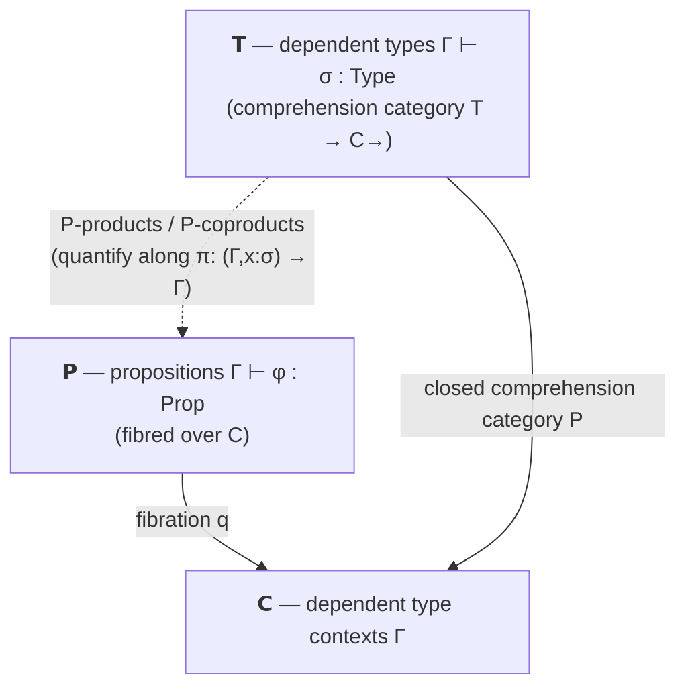

[[book-guidelines|↩ Back to guidelines]]

# Dependent Predicate Logic

## The question this chapter answers: what happens when context stops being empty

Go back to [[Subset-Types-and-Quotient-Types]] for a moment and notice something that was quietly true throughout: the subset type $\{x:\sigma \mid \varphi\}$ and the quotient type $\sigma/R$ were always formed in an *empty* type context. The formation rules from §4.6–4.7 literally required $\vdash \{x:\sigma\mid\varphi\}:\mathrm{Type}$ — nothing to the left of the turnstile. That restriction wasn't an oversight; it was forced by the setting. Ordinary (or "simple") predicate logic, SPL, is predicate logic *over [[Simple-Type-Theory|simple type theory]]* — and in simple type theory, types never depend on terms. A predicate $\varphi(x)$ can mention a term variable $x:\sigma$, but the type $\sigma$ itself can never be built *from* a term. So the moment you try to write $\{n : \mathbb N \mid n < p\}$ for some outer variable $p$, you've stepped outside SPL: the predicate $n < p$ needs $p$ in its context, and there's nowhere in simple type theory for that "outer" $p:\mathbb N$ to live *as part of the type-in-context bookkeeping* alongside $n$.

This is the whole motivating idea of Chapter 11, and it's worth sitting with why it's not a minor technical fix. Ordinary predicate logic asks: *for a fixed type $\sigma$, what propositions can I state about elements of $\sigma$?* Dependent predicate logic (DPL) asks a strictly more general question: *given a whole dependent context $\Gamma = (x_1{:}\sigma_1, \dots, x_n{:}\sigma_n)$ — where later types can already mention earlier variables — what propositions can I state about a further variable, itself possibly of a type that depends on $\Gamma$?* Once contexts are allowed to be non-empty and internally dependent, "predicate logic" quietly absorbs [[First-Order-Dependent-Type-Theory|dependent type theory]] (DTT) as its home, rather than living over bare simple types. The book states the defining feature of DPL in one line: for a type $\sigma$, term variables $x{:}\sigma$ **may occur both** in predicates $\varphi(x):\mathrm{Prop}$ **and** in types $\tau(x):\mathrm{Type}$. Under SPL those were two separate, non-interacting worlds — $\varphi$ lived over fixed types, and types never varied. DPL fuses them.

**What breaks without this move**: the natural-number-bounded-by-$p$ example is not a curiosity — it's the generic shape of "an array of length $n$," "a matrix of dimension $m \times n$," "a proof-carrying index into a fixed-size buffer." Every one of these needs a type that depends on an *earlier* variable in scope, and if you then want to refine that dependent type further with a predicate, you need the predicate itself to be allowed to see the same outer variables. SPL simply has no scope for that outer variable to be declared in. This is the precise sense in which DPL is not "SPL plus one more feature" — it's SPL relocated onto a richer notion of context, and that relocation is what unlocks dependent subset and quotient types "in full generality," as Jacobs puts it.

## The syntax: sequents over dependent contexts

### Two kinds of formation, one context

DPL's formation sequents come in two flavors, sharing the same dependent type context $\Gamma = (x_1{:}\sigma_1,\dots,x_n{:}\sigma_n)$:

$$
x_1{:}\sigma_1,\dots,x_n{:}\sigma_n \;\vdash\; \tau \;\mathrm{Type}
\qquad\text{and}\qquad
x_1{:}\sigma_1,\dots,x_n{:}\sigma_n \;\vdash\; \varphi : \mathrm{Prop}
$$

The first says $\tau$ is a well-formed dependent type in context $\Gamma$ (ordinary DTT); the second says $\varphi$ is a well-formed proposition in the *same kind of context* — a genuine advance over SPL, where a proposition's context was just a list of simple types with no internal dependency. Alongside these, DPL has **entailment** sequents:

$$
x_1{:}\sigma_1,\dots,x_n{:}\sigma_n \mid \varphi_1,\dots,\varphi_m \;\vdash\; \psi
$$

read as "$\psi$ follows from premises $\varphi_1,\dots,\varphi_m$, in the dependent type context $\Gamma$." Jacobs abbreviates the type context as $\Gamma$ and the list of premises — the **proposition context** — as $\Theta$, giving the compact $\Gamma \mid \Theta \vdash \psi$. This double-context shape (a dependent-type part, then a proposition part) is the syntactic seed of everything that follows categorically: it is exactly what forces *two* fibred structures — one for types, one for propositions — both living over the *same* base of contexts.

### The logical rules don't change shape — but variable order now matters

Here is a genuinely pleasant surprise: the introduction/elimination/formation rules for $\forall,\exists,\wedge,\vee,\top,\bot,\supset$ are **syntactically identical** to the SPL rules. For universal quantification, for instance:

$$
\dfrac{\Gamma, x{:}\sigma \vdash \varphi:\mathrm{Prop}}{\Gamma \vdash \forall x{:}\sigma.\varphi : \mathrm{Prop}}
\qquad
\dfrac{\Gamma,x{:}\sigma \mid \Theta \vdash \varphi \quad (x \text{ not in } \Theta)}{\Gamma \mid \Theta \vdash \forall x{:}\sigma.\varphi}
\qquad
\dfrac{\Gamma \vdash M{:}\sigma \qquad \Gamma \mid \Theta \vdash \forall x{:}\sigma.\varphi}{\Gamma \mid \Theta \vdash \varphi[M/x]}
$$

Type dependency doesn't force new logical connectives — it only changes what a "type context" *is* underneath [[Subset-Types-and-Quotient-Types#The rules|the rules]]. But there's a real wrinkle: in SPL you could freely reorder or interleave a quantified variable and an unrelated hypothesis, because simple contexts have no internal ordering constraints. In DPL you generally **cannot** form

$$
\dfrac{\Gamma, x{:}\sigma, A \vdash \varphi:\mathrm{Prop}}{\Gamma, A \vdash \forall x{:}\sigma.\varphi : \mathrm{Prop}}
$$

unless $x$ doesn't occur free in $A$ — only then can you invoke the exchange rule of dependent type theory to swap $x{:}\sigma$ and $A$ into the order the formation rule needs. **What breaks without tracking this**: dependent contexts are ordered lists where later entries can mention earlier ones, so "just permute the premises" (harmless in SPL) becomes a well-formedness question in DPL — exactly the kind of context-management bookkeeping a real type-checker's scope-and-substitution machinery has to get right, and exactly the discipline behind why a dependently-typed elaborator can't treat its context as an unordered set of hypotheses the way a Hindley–Milner-style checker often can.

### Higher order: `⊢ Prop : Type`

DPL becomes genuinely higher order with one further axiom:

$$
\vdash \mathrm{Prop} : \mathrm{Type}
$$

Propositions are themselves inhabitants of a type `Prop`, so proposition variables $a{:}\mathrm{Prop}$ can now occur inside *other* types and propositions, and you can quantify over them — impredicatively, since `Prop` quantifies over itself:

$$
\exists a{:}\mathrm{Prop}.\,\varphi(a) \qquad \forall a{:}\mathrm{Prop}.\,\varphi(a) \qquad \forall a{:}\mathrm{Prop}.\, a \supset a \qquad \forall a{:}\mathrm{Prop}.\forall p{:}a\to\mathrm{Prop}.\,\exists x{:}a.\,px
$$

This is the exact mechanism from [[Higher-Order-Predicate-Logic]] (Chapter 5's `Prop`-as-a-type move), now transplanted onto dependent contexts. An **extensionality of entailment** rule for predicates comes along for free, unchanged in shape from the simple-type setting:

$$
\dfrac{\Gamma \vdash P,Q : \sigma\to\mathrm{Prop} \qquad \Gamma,x{:}\sigma \mid \Theta, Px \vdash Qx \qquad \Gamma,x{:}\sigma\mid\Theta,Qx\vdash Px}{\Gamma\mid\Theta \vdash P =_{\sigma\to\mathrm{Prop}} Q}
$$

## Dependent subset and quotient types: the payoff

This is the section's headline result, and it's exactly the generalization the learning-goals project cares about most: subset and quotient types get **formation rules over a proper (non-empty) context** $\Gamma$:

$$
\dfrac{\Gamma, x{:}\sigma \vdash \varphi(x):\mathrm{Prop}}{\Gamma \vdash \{x{:}\sigma \mid \varphi(x)\}:\mathrm{Type}}
\qquad\qquad
\dfrac{\Gamma, x{:}\sigma, y{:}\sigma \vdash R(x,y):\mathrm{Prop}}{\Gamma \vdash \sigma/R : \mathrm{Type}}
$$

Compare directly with §4.6–4.7's rules in [[Subset-Types-and-Quotient-Types]]: syntactically these look almost the same, but $\Gamma$ was *forced to be empty* there (to stay inside simple type theory), and here it can be anything derivable in DTT. The introduction and elimination rules ($\iota$, $o$, and `pick x from a in N(x)`) are unchanged in form — you just read the ambient context as dependent.

**Say the load-bearing sentence plainly: this is a refinement type system, and this section is where it becomes a *dependent* one.** $\{x:\sigma \mid \varphi(x)\}$ with $\varphi$ ranging freely over an outer context $\Gamma$ is exactly a refinement type whose predicate may mention *other arguments already in scope* — precisely the shape of `{v : Nat | v < n}` where `n` is a function parameter bound earlier in the same signature. SPL's subset types could only refine a type by a predicate with no outside dependencies (think `{v : Nat | v > 0}` — fine, but you could never write `{v : Nat | v < n}` for a `n` bound elsewhere). DPL's version is the one every real refinement-type language (Liquid Haskell, F*, or a hand-rolled dependent/refinement checker) actually needs.

### Worked example: bounded naturals and modular integers

The book's two running examples make the point concretely. First, "natural numbers below $p$":

$$
p{:}\mathbb N, n{:}\mathbb N \vdash n < p : \mathrm{Prop}
\qquad\qquad
p{:}\mathbb N \vdash \mathrm{Nat}(p) \overset{\text{def}}{=} \{n{:}\mathbb N \mid n < p\} : \mathrm{Type}
$$

Here $\mathrm{Nat}(p)$ is a genuine *dependent* type — it varies with $p$ — built by refining $\mathbb N$ with a predicate that mentions the very variable $p$ the subset type itself depends on. This single definition is doing double duty: it's a dependent-type-former (indexed by $p$) *and* a refinement (cut down by $n < p$) simultaneously, and DPL is the minimal logic that can even state it.

Second, the integers mod $p$, worked through in full detail:

$$
p{:}\mathbb Z, x{:}\mathbb Z, y{:}\mathbb Z \vdash x \sim_p y \overset{\text{def}}{=} \exists z{:}\mathbb Z.\, (x-y) = z\cdot p : \mathrm{Prop}
\qquad\qquad
p{:}\mathbb Z \vdash \mathbb Z/p\mathbb Z \overset{\text{def}}{=} \mathbb Z/{\sim_p} : \mathrm{Type}
$$

with the group structure defined entirely via `pick`, exactly as in the non-dependent case, but now every operation lives in a context carrying $p$ along:

$$
p{:}\mathbb Z, x{:}\mathbb Z \vdash [x]_p : \mathbb Z/p\mathbb Z
\qquad
p{:}\mathbb Z \vdash 0_p \overset{\text{def}}{=} [0]_p : \mathbb Z/p\mathbb Z
$$
$$
p{:}\mathbb Z, a{:}\mathbb Z/p\mathbb Z \vdash -_p a \overset{\text{def}}{=} \mathsf{pick}\ x\ \mathsf{from}\ a\ \mathsf{in}\ [-x]_p : \mathbb Z/p\mathbb Z
$$
$$
p{:}\mathbb Z, a,b{:}\mathbb Z/p\mathbb Z \vdash a +_p b \overset{\text{def}}{=} \mathsf{pick}\ x,y\ \mathsf{from}\ a,b\ \mathsf{in}\ [x+y]_p : \mathbb Z/p\mathbb Z
$$

This makes $\mathbb Z/p\mathbb Z$ an honest Abelian group, parameterized by $p$ — you get a *family* of quotient groups, one per $p$, all stated as a single dependent definition. SPL could never express this family uniformly; you'd need to re-derive a separate, unrelated quotient construction for every fixed $p$.

DPL also lets you state genuinely mixed type-and-proposition-dependent facts that would be awkward to phrase otherwise, e.g. "every injective endofunction on a finite set is surjective":

$$
p{:}\mathbb N,\, f{:}\mathrm{Nat}(p)\to\mathrm{Nat}(p) \mid \mathrm{injective}(f) \;\vdash\; \mathrm{surjective}(f)
$$

Here the *type* of $f$'s domain and codomain is itself built (via $\mathrm{Nat}(p)$) from an earlier proposition-free variable, and the *statement* about $f$ is a further proposition over that dependent type — DPL is exactly expressive enough to phrase this in one sequent.

### Rust grounding: the dependent context is the function signature

The Rust analogy for "$\Gamma$ can be non-empty" is blunt but exact: $\Gamma$ *is* the parameter list, and a dependent subset type is a refinement type whose predicate is allowed to read earlier parameters.

```rust
// Γ = (n : usize)  ⊢  {v : usize | v < n} : Type
// A refinement type over an EARLIER-BOUND parameter n — this is
// precisely what SPL's context-free subset types could not express.
struct BoundedIndex<const N_TAG: ()> ; // (real Rust needs a runtime check;
                                        // a dependent/refinement checker
                                        // would carry `n` as a value-level
                                        // index and discharge `v < n`
                                        // statically via SMT)

fn bounded_index(n: usize, v: usize) -> Option<usize> {
    // introduction ι: witness v, PROOF OBLIGATION v < n
    if v < n { Some(v) } else { None }
}

fn use_index(n: usize, arr: &[i32], idx: usize) -> i32 {
    // elimination o: extracting idx back to a plain usize to index arr —
    // sound only because idx's *type* already carries `idx < n = arr.len()`
    arr[idx]
}
```

The proof obligation `v < n` at construction time (`bounded_index`) is, verbatim, a **verification condition**: a compiler for a real refinement-type language does not run this as an `if`-check — it hands `Γ, v:usize | v < n` (with whatever facts are known about `n` and `v` in scope) to an SMT solver at compile time, and rejects the program if the VC isn't discharged. The elimination side (`use_index`) is where the *type* of `idx` — the fact that it inhabits `{v : usize | v < n}` — gets *used* as a hypothesis: it's what would let the checker prove `arr[idx]` is in-bounds without a runtime check, if `arr.len()` is known to equal `n`. This introduction/elimination split is exactly the "construct a proof obligation / consume a refinement fact" pattern that a Hoare-style verifier's constraint generator implements: `ι` corresponds to emitting a VC, `o` corresponds to adding a hypothesis to the proof context.

### Lean grounding: this is the shape of a dependently-typed refinement

Lean's `Subtype` from [[Subset-Types-and-Quotient-Types]] generalizes immediately, because Lean's contexts are dependent by default — there was never an "empty context restriction" to lift:

```lean
-- Γ = (n : Nat) ⊢ {v : Nat | v < n} : Type  —  no special machinery needed,
-- because Lean's `Subtype` predicate is already allowed to close over
-- earlier local variables.
def BoundedNat (n : Nat) := {v : Nat // v < n}

def natModP (p : Int) := Quot (fun x y : Int => ∃ z : Int, x - y = z * p)
-- Γ = (p : Int) ⊢ ℤ/pℤ : Type — the SAME `Quot` primitive as the
-- non-dependent case, just applied to a relation that itself mentions
-- the outer variable p.
```

The reason Lean makes this look effortless is precisely the book's point: Lean's kernel is a dependent type theory *from the start*, so it never had SPL's empty-context restriction to begin with — Lean is, in this sense, always already "doing DPL." What Jacobs is doing in Chapter 11 is showing *categorically* why that generalization is safe and what structure it requires — which is the next section's job.

## The term model: two fibrations over one base of contexts

The syntax above organizes into a **term-model** triangle of (split) fibred categories:



- $\mathbb C$ is the category of dependent type contexts $\Gamma$ (from [[First-Order-Dependent-Type-Theory]]'s context calculus).
- $\mathbb T$ is the category of dependent-types-in-context $\Gamma \vdash \sigma{:}\mathrm{Type}$, fibred over $\mathbb C$ by $(\Gamma\vdash\sigma{:}\mathrm{Type})\mapsto\Gamma$ — this is a **closed comprehension category** $\mathbb T \to \mathbb C^\to$, the same device used throughout [[First-Order-Dependent-Type-Theory]] to give DTT its categorical semantics.
- $\mathbb P$ is the category of propositions-in-context $\Gamma\vdash\varphi{:}\mathrm{Prop}$. A morphism $(\Gamma\vdash\varphi{:}\mathrm{Prop}) \to (\Delta\vdash\psi{:}\mathrm{Prop})$ is a context morphism $M:\Gamma\to\Delta$ in $\mathbb C$ such that $\Gamma \mid \varphi \vdash \psi(M)$ is derivable in DPL — morphisms of propositions *are* proof-carrying entailments, not mere functions. $\mathbb P$ is fibred over $\mathbb C$ the same way, by $(\Gamma\vdash\varphi{:}\mathrm{Prop})\mapsto\Gamma$.

Because *both* propositions and types are indexed by the same contexts, you get two fibrations sharing one base, related in two precise ways:

1. **Quantification is fibred product/coproduct with respect to $\mathbb T \to \mathbb C^\to$.** For each dependent type $\Gamma\vdash\sigma{:}\mathrm{Type}$, the dependent projection $\pi:(\Gamma,x{:}\sigma)\to\Gamma$ induces a weakening functor $\pi^*:\mathbb P_\Gamma \to \mathbb P_{(\Gamma,x:\sigma)}$ (add a dummy variable), and $\exists x{:}\sigma.(-) \dashv \pi^* \dashv \forall x{:}\sigma.(-)$ — the *same* adjunction pattern from ordinary predicate logic's "mate rules" (recall $\dfrac{\Gamma\mid\varphi \vdash \forall x{:}\sigma.\psi}{\Gamma,x{:}\sigma\mid\varphi\vdash\psi}$ and its dual for $\exists$), now stated with respect to the comprehension category rather than plain Cartesian projections. Beck–Chevalley holds because substitution commutes appropriately with $\forall$/$\exists$.
2. **The higher-order axiom is a generic object.** $\mathbb P$ has a (split) **generic object** — the proposition $(a{:}\mathrm{Prop}\vdash a{:}\mathrm{Prop})$ sitting over the singleton context $(a{:}\mathrm{Prop})$ — and that context is itself the domain of the projection induced by the closed type $\vdash \mathrm{Prop}{:}\mathrm{Type}$. This is the fibred-category way of saying "there is a universal proposition that every other proposition is a fibre of," which is exactly what lets `⊢ Prop : Type` give you impredicative quantification over all propositions at once.

## §11.2: DPL-structure — the abstract categorical shape

Section 11.2 distills the term model into a definition that applies to *any* categorical model, not just the syntactic one. A **DPL-structure** combines:

- a preorder fibration $q : \mathbb D \to \mathbb E$ of propositions, and
- a **closed comprehension category** $P : \mathbb E \to \mathbb B^\to$ of types (as in [[First-Order-Dependent-Type-Theory]]),

sharing the intermediate category $\mathbb E$ (types-in-context), subject to four conditions:

1. $P$ is a closed comprehension category.
2. $q$ is a fibred bicartesian closed preorder fibration (so propositions have $\wedge,\vee,\top,\bot,\supset$ fibrewise).
3. $q$ has **$P$-products** $\forall$, **$P$-coproducts** $\exists$, and **$P$-equality** $\mathrm{Eq}$ — quantification and equality defined with respect to the comprehension category $P$, generalizing the Cartesian-projection quantification from [[First-Order-Predicate-Logic]].
4. **(Higher order)** there is a closed type $\Omega \in \mathbb E_1$ in the fibre over the terminal object $1\in\mathbb B$, such that $q$ has a generic object over $\{\Omega\} = \mathrm{dom}(P\Omega)$.

The term model built in §11.1 is the paradigm instance: $\mathbb T \to \mathbb C^\to$ supplies $P$, and $\mathbb P \to \mathbb C$ supplies $q$. The book's other running examples of DPL-structures are $\mathrm{Fam}(A) \to \mathrm{Sets}$ for a frame $A$, $\mathrm{Sub}(\mathbb B)\to\mathbb B$ for a topos $\mathbb B$, and $\mathrm{UFam}(\mathrm{PN})\to\mathrm{Sets}$ — each arising via **Proposition 11.2.2**: any higher order fibration over a base $\mathbb B$ automatically gives a "simple" DPL-structure using the trivial (Cartesian) comprehension category, and — the sharper part — if $\mathbb B$ is locally Cartesian closed and its dependent-product/coproduct adjoints satisfy Beck–Chevalley, you get a *genuinely dependent* DPL-structure by using $\mathbb B^\to \to \mathbb B$ (the codomain fibration) as $P$. In other words: an ordinary (non-dependent) higher-order predicate logic over a sufficiently nice base category *upgrades itself* to dependent predicate logic for free, just by re-reading the base's own codomain fibration as the comprehension category of types.

## Dependent subset types, categorically: a fibred right adjoint

This is the direct generalization of Definition 4.6.1 from [[Subset-Types-and-Quotient-Types]], and the added ingredient is exactly "now it has to be fibred over the type context, not just a bare adjunction." Form the auxiliary category $\mathrm{Fam}_P(\mathbb D)$ whose objects are pairs $(\sigma,\varphi)$ with $\Gamma\vdash\sigma{:}\mathrm{Type}$ and $\Gamma,x{:}\sigma \vdash \varphi{:}\mathrm{Prop}$ — a dependent type together with a predicate on it, living over the same $\Gamma$. There's a terminal-object functor

$$
T : \mathbb E \to \mathrm{Fam}_P(\mathbb D), \qquad (\Gamma\vdash\sigma{:}\mathrm{Type}) \mapsto (\sigma, \top)
$$

**Definition (dependent subset types).** The DPL-structure has dependent subset types if $T$ has a **fibred right adjoint** $\{-\} : \mathrm{Fam}_P(\mathbb D) \to \mathbb E$ — fibred meaning the adjunction respects $\Gamma$ throughout, because the formation rule keeps $\Gamma$ fixed:

$$
\dfrac{\Gamma, x{:}\sigma \vdash \varphi{:}\mathrm{Prop}}{\Gamma \vdash \{x{:}\sigma\mid\varphi\}{:}\mathrm{Type}}
$$

Unwinding this in the term model reproduces exactly the syntactic $\iota$/$o$ correspondence: a bijection between terms $\Gamma,x{:}\sigma \vdash M{:}\tau$ (with $\Gamma,x{:}\sigma\mid\top \vdash \psi[M/y]$) and terms $\Gamma,x{:}\sigma \vdash N : \{y{:}\tau\mid\psi\}$, given by $M \mapsto \iota(M)$ and $N \mapsto o(N)$ — identical in spirit to the non-dependent case, just with a dependent $\Gamma$ carried along everywhere. As before, the adjunction induces a fibred projection functor into the vertical-morphism subcategory $\mathbb V(\mathbb E)$, and **full dependent subset types** means this functor is full and faithful — the exact dependent analogue of "[[Subset-Types-and-Quotient-Types#Full subset types|full subset types]]" from §4.6, now meaning subtype inclusion between dependent refinements reduces to entailment *in context*.

**Proposition 11.2.4** (the payoff): for any topos $\mathbb B$, the associated DPL-structure $\mathrm{Sub}(\mathbb B) \to \mathbb B^\to$ **always has full dependent subset types**. The proof is a clean pullback argument: the terminal-object functor sends a subobject-of-a-family $(z \rightarrowtail i)$ to $(z \rightarrowtail z \rightarrowtail i)$, its right adjoint is given by [[Fibred-Category-Theory#Composition|composition]] of monos, and the resulting projection functor is visibly full and faithful because a mono factoring through a mono is determined uniquely by the composite. **Every topos model of dependent predicate logic gets full dependent refinement types automatically, with zero extra axioms** — this is the categorical reason "topos logic" and "a language with fully general refinement types" describe the same phenomenon from two directions.

### What this means for a refinement-type checker's proof obligations

Read the fibred right-adjoint condition operationally, and it says precisely what a compiler has to do at each of the two rule directions:

- **At introduction** ($\iota$): given $\Gamma, x{:}\sigma\vdash M{:}\tau$, forming $\iota(M) : \{y{:}\tau\mid\psi\}$ requires deriving $\Gamma,x{:}\sigma \vdash \psi[M/y]$ — this *is* the verification condition the checker must discharge (by SMT, by a decision procedure, or by requiring the programmer to supply a proof term), and the adjunction guarantees that if the VC is dischargeable, the term of subset type exists and is unique up to the $\iota$/$o$ isomorphism — no extra bookkeeping needed once the VC is closed.
- **At elimination** ($o$): given $\Gamma,x{:}\sigma \vdash N : \{y{:}\tau\mid\psi\}$, the checker gets to *assume* $\psi$ holds of the extracted witness for free, in any later proof obligation — this is exactly how a refinement-type checker's environment accumulates hypotheses as it walks through a program: every time a refined value flows into scope, its refinement predicate becomes an available fact for the *next* VC's SMT query.

Because the adjunction is *fibred* over a possibly non-empty, non-trivial context $\Gamma$, both directions above can freely use whatever facts are already true about $\Gamma$ — exactly the situation of "the predicate on parameter `v` may refer to an earlier parameter `n`" from the Rust example above. This fibred structure is the categorical reason a dependent refinement checker's VC generator can chain hypotheses through an arbitrarily long parameter list rather than being limited to isolated, context-free refinements.

## Dependent quotient types, categorically: a fibred left adjoint

Dually, form $\mathrm{RFam}_P(\mathbb D)$ by change of base along the "double-context" functor $\{\{-\}\} := \mathrm{cod}\circ\delta$, which sends a dependent type $\Gamma\vdash\sigma{:}\mathrm{Type}$ to the context $(\Gamma,x{:}\sigma,x'{:}\sigma)$ — objects of $\mathrm{RFam}_P(\mathbb D)$ are dependent types together with a relation $\Gamma,x{:}\sigma,x'{:}\sigma \vdash R(x,x') : \mathrm{Prop}$ on them. There's an equality-object functor

$$
\mathrm{Eq} : \mathbb E \to \mathrm{RFam}_P(\mathbb D), \qquad \sigma \mapsto (\sigma, \mathrm{Eq}(\{\sigma\}))
$$

**Definition (dependent quotient types).** The DPL-structure has dependent quotient types if $\mathrm{Eq}$ has a **fibred left adjoint** $Q$. Unwound in the term model, this reproduces exactly the `pick`-based correspondence: a bijection between $\Gamma,x{:}\sigma,x'{:}\sigma \mid R(x,x') \vdash N(x) =_\tau N(x')$ and $\Gamma,a{:}\sigma/R \vdash M{:}\tau$, via $N(x) \mapsto \mathsf{pick}\ x\ \mathsf{from}\ a\ \mathsf{in}\ N(x)$ and $M(a)\mapsto M[[x]_R/a]$ — the same elimination discipline from [[Subset-Types-and-Quotient-Types]], carried over a dependent $\Gamma$. **Full (or effective) dependent quotient types** means the induced "canonical quotient map" functor is full and faithful when restricted to genuine equivalence relations.

**Proposition 11.2.6**: every topos, as a DPL-structure, **has full dependent quotient types** — proved by literally forming the coequalizer of the kernel-pair relation in the topos ([[Toposes|toposes]] have all finite colimits) and checking the resulting universal property matches the adjunction's bijective correspondence exactly. **Combined with Proposition 11.2.4, a topos model of DPL automatically gets both full dependent subset types and full dependent quotient types** — this is the clean high-level fact worth remembering: *any* topos, viewed through the DPL-structure lens, is already a complete refinement-and-quotient type theory with no extra axioms to add. If you are choosing a semantic target for a dependent refinement checker's soundness proof, "interpret it in a topos" buys both refinement subtyping-as-entailment and quotient-elimination-as-well-definedness in one stroke.

## Where this leads

This section is the direct prerequisite for the rest of Chapter 11's arc: §11.3 takes DPL and applies a propositions-as-types translation to it — replacing the preorder fibration $q$ of propositions with a genuine fibred category of *proof-relevant* types — to get **[[Polymorphic-Dependent-Type-Theory|polymorphic dependent type theory]] (PDTT)**, and §§11.5–11.7 push further into **[[Full-Higher-Order-Dependent-Type-Theory|full higher order dependent type theory]] (FhoDTT)**, classified via the "dependency relation" between syntactic universes that Jacobs previews here. Every categorical gadget introduced in this section — the comprehension category $P$, the fibration $q$ with $P$-products/coproducts, the generic object for `Prop` — reappears verbatim as a *component* of those richer systems; DPL is deliberately "the logic level" of [[First-Order-Predicate-Logic#The construction|the construction]], isolated so the later chapters can bolt proof-terms onto it without re-deriving the fibred plumbing.

For the refinement-type/elaborator project specifically: this chapter is where "refinement types" stop being a special-case add-on and become a first-class feature of a genuinely dependent type theory. The fibred-adjunction definitions of dependent subset/quotient types (Definitions here vs. 4.6.1/4.8.1 in the non-dependent case) tell you exactly what changes when your checker's contexts become dependent — namely, nothing about the *rule shapes*, but everything about what has to be *fibred*: subtyping checks, VC generation, and quotient-elimination well-definedness all now have to be threaded through an arbitrary, possibly long, dependent context, not just a single isolated type. And Propositions 11.2.4/11.2.6's "toposes get both for free" result is the semantic target worth citing when you want a one-line soundness argument for "my dependent refinement checker's subtyping-as-entailment reduction is not secretly unsound" — build the model in a topos, and both properties come for free.
