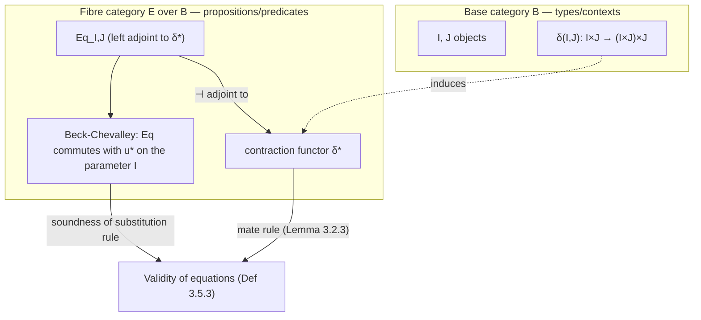

[[book-guidelines|↩ Back to guidelines]]

# Equational Logic

## Why start logic here, and why with equations?

Chapters 1 and 2 built [[Simple-Type-Theory|simple type theory]] (STT): contexts, terms, a classifying category $\mathfrak{C}(\Sigma)$ with finite products. But a type theory alone can't say anything is *true*. You can form the term $v_1 + v_1$, but STT has no vocabulary for asserting `v_1 + v_1 = 2 * v_1`. That assertion is a **proposition**, and propositions are a genuinely new syntactic universe, disjoint from types — they are the things that occur to the right of a turnstile $\vdash$, related to each other by *entailment*, not the things that occur to the right of a colon `:`.

Jacobs opens Chapter 3 by choosing the simplest possible logic to reason about: one whose only atomic propositions are equations $M =_\sigma M'$ between terms of the same type. No conjunction, no quantifiers, no implication — just equality. This is a deliberate methodological choice. Once the machinery for "a logic over a type theory" is worked out for equality alone, first order logic (Chapter 4) and higher order logic (Chapter 5) are extensions of the same skeleton, not new designs. Equational logic is the load-bearing prototype for everything that follows.

There's a second reason this chapter matters more than its narrow subject suggests: **the central result of the chapter — Lawvere's description of equality as a left adjoint to a contraction functor — is the categorical semantics of definitional equality checking.** If you've ever wondered what a type-checker's `isDefEq` function is *really* doing when it decides two terms are "the same," this chapter gives you the adjoint-functor picture underneath the syntax. That is the throughline this article will keep coming back to.

## What breaks without explicit contexts

Before touching equality, Jacobs has to fix how *sequents* work — because in a categorical account, contexts are not bookkeeping, they are indices into a fibration, and getting the notation wrong here derails everything downstream.

A logician might write a judgment as
$$\varphi_1, \dots, \varphi_n \vdash \psi$$
leaving free-variable typing implicit. Jacobs instead insists on

$$\Gamma \mid \varphi_1, \dots, \varphi_n \vdash \psi$$

with the **type context** $\Gamma$ (declaring the term variables and their types) written explicitly, separated by `|` from the **proposition context** (the assumptions). The `|` has no logical content — it's a divider, exactly like the `|` in $\{i \in I \mid \varphi(i)\}$ separates the set-theoretic part from the logical part. Why insist on this? Because in the categorical reading, **the type context $\Gamma$ is an object of a base category, and the proposition context is an object living in the fibre over that base object.** If you erase $\Gamma$ from the notation, you erase the index, and there is no fibration to speak of. This is the single most important notational commitment in the whole book, and it's worth internalizing before anything else: *every judgment is indexed by the context it's stated in, and substitution into that context is a functor.*

Concretely, an equational sequent looks like:
$$v_1 : \mathbb{N}, v_2 : \mathbb{N} \mid v_1 =_{\mathbb N} 3, v_2 + v_1 =_{\mathbb N} 5 \;\vdash\; v_2 =_{\mathbb N} 2.$$

**Lean [[Regular-and-Coherent-Categories#Grounding|grounding]].** This is precisely the shape of a Lean goal state: a local context (`v1 v2 : Nat`) together with hypotheses (`h1 : v1 = 3`, `h2 : v2 + v1 = 5`), and a target (`v2 = 2`). Lean's `Context` in the kernel *is* Jacobs's $\Gamma$; the hypotheses list *is* $\Theta$. The `|` separator has no Lean syntax because Lean doesn't need one — the local context already interleaves term-level and proof-level (`Prop`-typed) declarations in one list. Jacobs keeps them apart because he hasn't yet introduced a type of propositions (`Prop`) — that only happens in Chapter 5, higher order logic. Equational logic, for now, treats propositions as an external syntactic category, not as first-class terms.

### Structural rules and the "empty type" trap

The context rules (Fig. 3.1) are the ones you'd expect: identity, cut, weakening/contraction/exchange for both types and propositions, and substitution. One rule that looks like it should be valid but explicitly is *not*:

**Strengthening** (dropping an unused variable from the context):
$$\dfrac{\Gamma, x:\sigma \mid \Theta \vdash \psi \qquad (x \text{ not free in } \Theta, \psi)}{\Gamma \mid \Theta \vdash \psi}$$

This fails because $\sigma$ might denote the empty type. Jacobs's own counterexample (Exercise 3.1.3): in $\mathbf{Sets}$, for arbitrary $f, g : X \to Y$,
$$x : X, z : \emptyset \mid \vdash f(x) =_Y g(x)$$
is *vacuously* derivable ($X \times \emptyset \cong \emptyset$, so any two maps out of it agree), but $x:X \mid {} \vdash f(x) =_Y g(x)$ certainly is not — $f,g$ were arbitrary.

**What this buys you, mechanically.** If you are building a checker with dependent/refinement types, this is exactly the bug class where a checker silently admits an unsound derivation by discharging a hypothesis about an inhabited-but-possibly-empty type. Any refinement type system with `{x : T | false}`-style empty refinements has to track this explicitly — you cannot assume a context entry is inhabited just because it's syntactically present. This is a first, very concrete appearance of a theme that recurs constantly in dependent type theory: *typing contexts carry live obligations, and structural rules that look "obviously sound" from untyped logic can silently smuggle in an inhabitation assumption.*

### The classifying fibration of contexts

Jacobs immediately cashes out the notational discipline above into a fibration. Given a specification $(\Sigma, \Box)$ (a signature plus "extra stuff" — equations, for equational logic), there's a fibration of contexts

$$\mathcal{E}(\Sigma,\Box) \xrightarrow{\ p\ } \mathfrak{C}\ell(\Sigma)$$

over the classifying category of the underlying signature, where:

- the **fibre** over a type context $\Gamma$ is the *preorder* of proposition contexts in $\Gamma$, ordered by derivability: $\Theta \le \Theta'$ iff $\Gamma \mid \Theta \vdash \varphi$ for every $\varphi \in \Theta'$;
- it's a **fibred preorder** — deliberately: this chapter (and 4, and 5) model *provability*, not *proofs*. There are no proof terms as morphisms yet (that distinction — propositions-as-types with real proof terms — was Chapter 2's Curry–Howard discussion; here we're doing "logic over" a type theory in the sense of *truth*, not *witnesses*);
- the base has finite products (context concatenation), and the fibration has fibred finite products (proposition-context concatenation) — the terminal object in the fibre over $\Gamma$ is the empty proposition context, and the product of $\Theta, \Theta'$ is their concatenation.

The two special substitution functors singled out here are the ones that matter for the rest of the chapter:

- **weakening** $\pi^*$, induced by the projection $\pi: \Gamma, x{:}\sigma \to \Gamma$, acting by $(\Gamma \mid \Theta) \mapsto (\Gamma, x{:}\sigma \mid \Theta)$;
- **contraction** $\delta^*$, induced by the diagonal $\delta: \Gamma, x{:}\sigma \to \Gamma, x{:}\sigma, y{:}\sigma$, acting by $(\Gamma, x{:}\sigma, y{:}\sigma \mid \Theta) \mapsto (\Gamma, x{:}\sigma \mid \Theta[x/y])$.

Everything else in the chapter is: *what is the left adjoint to $\delta^*$, and what does having one buy you?*

## Internal versus external equality

Before answering that, Jacobs draws a distinction that is the conceptual heart of the chapter and, not coincidentally, the heart of every dependent type checker you will ever write.

STT already has a notion of sameness: **conversion**, $M \equiv M'$, generated by the $\beta/\eta$ rules of the type formers $\Rightarrow, \times, 1, +, 0$. This is **external equality** — a relation on terms decided (in principle, mechanically) by normalizing and comparing, entirely *outside* the logic, at the level of syntax.

Equational logic then adds a genuinely new atomic proposition:
$$\dfrac{\Gamma \vdash M : \sigma \qquad \Gamma \vdash M' : \sigma}{\Gamma \vdash M =_\sigma M' : \mathrm{Prop}}$$
This $M =_\sigma M'$ is **internal equality** — a *proposition*, established (or not) by derivation *within* the logic, using assumptions in $\Theta$.

The one-directional bridge between them:

$$\text{From external to internal equality} \qquad \dfrac{\Gamma \vdash M:\sigma \quad \Gamma \vdash M':\sigma \quad \Gamma \vdash M \equiv M'{:}\sigma}{\Gamma \vdash M =_\sigma M'}$$

Convertible terms are always provably equal. The converse — provable equality implies convertibility — is *not* assumed in general; when it does hold, the logic is called **extensional**. This asymmetry is exactly why the chapter later needs a name for logics where it holds: **very strong equality** (below).

**This is precisely Lean's `Eq` versus `isDefEq` distinction**, and naming the correspondence explicitly is worth doing because it removes a lot of confusion for anyone coming from a Lean/dependent-types background:

| Jacobs | Lean |
|---|---|
| external equality $M \equiv M'$ (conversion) | definitional equality, decided by `isDefEq` / `whnf` + syntactic comparison in the kernel |
| internal equality $M =_\sigma M'$ (a proposition) | `Eq M M'` / `M = M'`, a `Prop`, inhabited by a proof term |
| "external ⟹ internal" rule | `Eq.refl` composed with definitional unfolding — `rfl` succeeds exactly when the two sides are definitionally equal |
| logic where internal ⟹ external | *not* how Lean's `Prop`-valued `Eq` behaves in general (propositional equality is strictly weaker — e.g. function extensionality is provable but not definitional) |

The reason Jacobs is fastidious about keeping these apart, rather than declaring them identical from the start, is the same reason a real elaborator is fastidious about it: **conversion checking must be decidable and untrusted-kernel-cheap; propositional equality is a first-class citizen of the logic and can require arbitrarily deep proof search.** Conflating them (going "extensional") is a real design choice with real costs — extensional type theories (like the one Chapter 3 flags will reappear via "very strong equality") make type-checking undecidable in general, because you'd need to decide arbitrary propositional equalities to conversion-check.

## Lawvere's mate rule: equality as one adjunction

Ordinary equational logic textbooks give you four separate rules for $=$: reflexivity, symmetry, transitivity, replacement (substitution of equals for equals). Jacobs's first big payoff (Lemma 3.2.3) is that **all four are jointly equivalent to a single rule**, stated using contraction:

$$\text{Lawvere equality (=-mate)} \qquad \dfrac{\Gamma, x{:}\sigma \mid \Theta \vdash N[x/y] =_\tau N'[x/y]}{\Gamma, x{:}\sigma, y{:}\sigma \mid \Theta, x =_\sigma y \vdash N =_\tau N'}$$

with the double line meaning it's invertible — usable in either direction. Read top-to-bottom: if $N,N'$ agree after identifying $x$ and $y$ (i.e., after contraction), then $N,N'$ agree whenever $x =_\sigma y$ is assumed (i.e., before contracting). Read bottom-to-top, it's the more intuitive direction: knowing $N =_\tau N'$ under the *hypothesis* that $x = y$ tells you $N[x/y] =_\tau N'[x/y]$ once you actually perform that identification.

Jacobs proves the equivalence with the four classical rules by direct derivation (worth tracing once by hand — reflexivity drops out of the mate rule applied upward to $N = N' = x$, symmetry from a twist, transitivity from an instantiation with $\Theta = \{x =_\sigma y\}$, and replacement from a three-step derivation combining reflexivity, the mate rule, and cut/substitution). The mechanical content is: **the mate rule packages "substitute a proof of equality" as a single adjoint transpose**, rather than as four unrelated axiom schemes.

Why is this called a "mate"? Because it's exactly the transpose operation of an adjunction $F \dashv G$: a map $F(A) \to B$ corresponds ("is a mate of") a map $A \to G(B)$. Here, the contraction functor $\delta^*$ plays the role of $G$, and — as Section 3.4 will make precise — an "equality" left adjoint $\mathrm{Eq}$ plays the role of $F$. The four classical rules of equational logic are just what the naturality of that one adjunction transpose unpacks into, once you plug in identities, symmetric swaps, and composites.

A refined version (Lemma 3.2.4, "Lawvere equality with Frobenius") allows $y$ to occur free in $\Theta$ too — this generalization is what will later correspond to the **Frobenius property** for fibred equality, needed once equality has to interact correctly with an ambient proposition context rather than sitting in isolation.

**Rust/checker-shaped reading.** If you were implementing an equational-logic (or `rfl`-style) prover, this lemma tells you that you don't need four separate inference-rule cases in your kernel for `refl`/`symm`/`trans`/`subst` — you need *one* combinator (a "mate" transform between a hypothesis-form and a substituted-conclusion-form) from which the other three are derivable as special instantiations. That is a genuine implementation simplification, not just a proof-theoretic curiosity: fewer trusted primitives means a smaller, more auditable kernel.

```rust
// A sketch of the mate rule as one primitive combinator, from which
// refl/symm/trans/subst are derived — not separately trusted.
fn eq_mate(
    // Γ, x:σ | Θ ⊢ N[x/y] = N'[x/y]     (hypothesis form)
    proof_before_contraction: Proof,
) -> Proof {
    // Γ, x:σ, y:σ | Θ, x = y ⊢ N = N'    (conclusion form)
    // implemented once, used to derive refl/symm/trans/subst as instances
    apply_contraction_adjoint(proof_before_contraction)
}
```

## Algebraic and conditional equations

With the syntactic rules pinned down, Section 3.3 gives semantics — but only for the *non-conditional* fragment first, using ordinary (non-fibred) category theory, exactly the way Chapter 2 modeled STT with product-preserving functors.

- A **$\Sigma$-equation** $\Gamma \mid M_1 =_{\sigma_1} M_1', \dots, M_n =_{\sigma_n} M_n' \vdash M_{n+1} =_{\sigma_{n+1}} M_{n+1}'$ is **algebraic** (non-conditional) if $n=0$ — just $\Gamma \vdash M =_\sigma M'$ — and **conditional** otherwise (equations depending on other equations as hypotheses).
- An equation $\Gamma \vdash N =_\tau N'$ holds in a model $\mathcal{M}: \mathfrak{C}\ell(\Sigma) \to \mathbb{B}$ (a finite-product-preserving functor, as in Chapter 2's functorial semantics) iff the two interpreted maps $\mathcal{M}(N), \mathcal{M}(N') : \mathcal{M}(\Gamma) \to \mathcal{M}(\tau)$ are literally equal in $\mathbb{B}$.
- For a **conditional** equation, validity needs $\mathbb{B}$ to have equalizers: it holds iff the meet of the equalizers of the hypotheses is contained in the equalizer of the conclusion,
$$\mathrm{Eq}(\mathcal{M}(M_1), \mathcal{M}(M_1')) \wedge \cdots \wedge \mathrm{Eq}(\mathcal{M}(M_n), \mathcal{M}(M_n')) \;\le\; \mathrm{Eq}(\mathcal{M}(N), \mathcal{M}(N'))$$
in the subobject poset $\mathrm{Sub}(\mathcal{M}(\Gamma))$. This is the seed of the fibred definition of validity in Section 3.5 — notice $\mathrm{Eq}(u,v)$ already denotes an *equalizer* here, foreshadowing the general fibred notation of the same name.

**Soundness** (Lemma 3.3.2) is the routine check that all four equational rules preserve validity in models.

### Classifying categories quotient the term model

For an algebraic specification $(\Sigma, A)$, define $N, N'$ **equivalent modulo $A$** if $\Gamma \vdash N =_\sigma N'$ is derivable using $A$ as axioms. The classifying category $\mathfrak{C}\ell(\Sigma, A)$ is the classifying category $\mathfrak{C}\ell(\Sigma)$ of the bare signature, quotiented by this equivalence — same objects (contexts), morphisms are now equivalence classes $|M|$ instead of raw terms $[M]$ (note the deliberate notational contrast: $[M]$ was used in Chapter 2 for equivalence modulo *conversion*; $|M|$ here is modulo *propositional* equality — the external/internal distinction shows up again, now at the level of which quotient you take).

**Theorem 3.3.4** turns this into functorial semantics for equations: models of $(\Sigma,A)$ in $\mathbb{B}$ (finite-product-preserving functors $\mathfrak{C}\ell(\Sigma) \to \mathbb{B}$ satisfying $A$) correspond bijectively to finite-product-preserving functors $\mathfrak{C}\ell(\Sigma,A) \to \mathbb{B}$. **Corollary 3.3.5 (Completeness)** follows immediately by using [[Functorial-Lawvere-Semantics#The generic model|the generic model]] $\mathrm{id}: \mathfrak{C}\ell(\Sigma,A) \to \mathfrak{C}\ell(\Sigma,A)$: an equation is derivable from $A$ iff it holds in every model, because it certainly has to hold in this canonical one, and this one validates *exactly* the derivable equations.

### Lawvere's classical theorem: theories *are* categories with products

The capstone result of the section (**Theorem 3.3.8**) runs the correspondence backward. Every category $\mathbb{B}$ with finite products carries its own associated signature $\mathrm{Sign}(\mathbb{B})$ (objects become types, morphisms become function symbols) and its own associated set of algebraic equations $A(\mathbb{B})$ — namely, exactly the equations that happen to be true of the morphisms of $\mathbb{B}$ read as terms. Jacobs then proves:

> $\mathbb{B}$ is **equivalent** to the classifying category $\mathfrak{C}\ell(\mathrm{Sign}(\mathbb{B}), A(\mathbb{B}))$ of its own theory of algebraic equations.

This is Lawvere's original insight (his 1963 thesis) recast in Jacobs's fibred vocabulary: *an algebraic theory and a category with finite products are the same mathematical object*, viewed from two different angles — syntax (a theory presented by generators and equations) versus semantics (an actual category). The proof is a clean gluing argument: send $X \mapsto (x{:}X)$, note pairing/projections in $\mathbb{B}$ literally *are* the "empty tuple," "pair," "proj," "proj$'$" function symbols with their defining equations already forced true in $\mathbb{B}$ itself, hence context concatenation on the syntax side matches products on the semantics side up to the canonical isomorphism $(x_1{:}X_1,\dots,x_n{:}X_n) \cong (z : X_1 \times \cdots \times X_n)$.

The caveat Jacobs flags immediately (and the guidelines' third Key Question targets this directly) is that **this equivalence only works for non-conditional equations.** The reason is structural, not accidental: algebraic equations correspond to identifications between morphisms, and a category with finite products has no native way to talk about *predicates that aren't equations* — there's no room in "finite products alone" for a general subobject lattice. Capturing arbitrary predicates (not just equalities between terms) needs finite *limits* (for conditional reasoning via equalizers) and ultimately the fibred machinery of Chapter 4's regular/coherent/first-order fibrations. This is exactly why the book needs the fibred generalization that fills the rest of Chapter 3.

## Fibred equality: Lawvere's adjunction, made precise

Section 3.4 is the technical engine of the chapter. Fix a base category $\mathbb{B}$ with finite products. For objects $I,J$, write the **parametrised diagonal**
$$\delta = \delta(I,J) = (\mathrm{id}, \pi') : I \times J \longrightarrow (I \times J) \times J$$
— this is exactly the categorical shape of the contraction rule from Example 3.1.1: duplicate $J$, keeping $I$ as an untouched parameter (the rest of the context).

**Definition 3.4.1.** A fibration $p : \mathbb{E} \to \mathbb{B}$ **has (simple) equality** if:

1. every contraction functor $\delta(I,J)^*$ has a **left adjoint** $\mathrm{Eq}_{I,J} \dashv \delta(I,J)^*$, and
2. **Beck–Chevalley** holds: for $u: K \to I$, the canonical map $\mathrm{Eq}_{K,J}(u \times \mathrm{id})^* \Rightarrow ((u\times\mathrm{id})\times\mathrm{id})^* \mathrm{Eq}_{I,J}$ is an isomorphism — i.e., forming the equality predicate *commutes with substituting into the parameter $I$*.

This is Lawvere's slogan made literal: **equality is the left adjoint to contraction.** The mate rule from Section 3.2 is exactly the adjunction's transpose bijection, instantiated at the classifying fibration of an equational specification.

If $p$ additionally has fibred finite products, it has equality **satisfying Frobenius** when
$$\mathrm{Eq}_{I,J}(\delta^*(X) \times Y) \;\cong\; X \times \mathrm{Eq}_{I,J}(Y)$$
— i.e., the equality-forming operation distributes correctly over conjunction with a parameter-only predicate $X$. This is exactly the generalization needed for Lemma 3.2.4's "Lawvere equality with Frobenius" (allowing $y$ free in $\Theta$).

### The concrete predicate $\mathrm{Eq}(u,v)$

Given this adjunction, Jacobs derives the equality predicate between two *parallel morphisms* $u, v : I \rightrightarrows J$ that you actually reason with day to day:
$$\mathrm{Eq}(u,v) \;:=\; ((\mathrm{id},u),v)^*\big(\mathrm{Eq}_{I,J}(1)\big) \;\in\; \mathbb{E}_I$$
i.e., take the terminal predicate $1$ over $I \times J$, push it forward along equality to get a predicate $\mathrm{Eq}_{I,J}(1)$ over $(I\times J)\times J$, then pull that back along $(({\rm id},u),v) : I \to (I\times J)\times J$. Concretely this is "the fibre-object classifying, at each point of $I$, the proposition that $u$ and $v$ agree there."

- $u,v$ are **internally equal** if there's a proof $1 \to \mathrm{Eq}(u,v)$ over $I$ (a global section in the fibre).
- $u,v$ are **externally equal** if $u = v$ as morphisms in $\mathbb{B}$.
- Reflexivity (proved formally in Lemma 3.4.5) gives external $\Rightarrow$ internal, unconditionally. The converse is the extra property called **very strong equality** (below), and it does *not* hold in general.

Substitution behaves exactly as you'd want, and — critically — this is proved *using Beck–Chevalley*, not assumed:
$$\mathrm{Eq}(u \circ w,\, v \circ w) \;=\; w^*\,\mathrm{Eq}(u,v).$$
This single equation is the categorical incarnation of the syntactic fact $(M[L/z] =_\sigma M'[L/z]) = (M=_\sigma M')[L/z]$ — substitution commutes with equation-formation. **This is exactly the substitution lemma you have to prove for any type checker's `isDefEq`/unifier to be sound under context extension** — that checking equality after substituting is the same as substituting into an equality check. Beck–Chevalley is the categorical name for "your substitution lemma holds."

### Where the left adjoint comes from, concretely

Jacobs works four examples (3.4.4), each showing the *same* adjoint-equality pattern instantiated differently — this is the part of the chapter that de-mystifies the abstract definition by showing it's not exotic:

1. **Codomain fibration.** For $p = \mathrm{cod}: \mathbb{B}^\to \to \mathbb{B}$, $\mathrm{Eq}(u,v)$ *is* the ordinary categorical **equalizer** of $u,v$ — the standard pullback-of-a-diagonal construction. Internal equality here is "the equalizer is all of $I$," which recovers external equality — codomain fibrations automatically have equality *satisfying Frobenius* (via Lemma 3.4.3: any fibration with coproducts satisfying Frobenius automatically has equality satisfying Frobenius, and $\mathrm{cod}$ has simple coproducts).
2. **Subobject fibration** $\mathrm{Sub}(\mathbb{B}) \to \mathbb{B}$. Equality comes "for free": since monos compose and the diagonal is monic, $\delta^*$ (restricted to monos) automatically has a left adjoint.
3. **Family fibration** $\mathrm{Fam}(\mathbb{C}) \to \mathbf{Sets}$ (for $\mathbb{C}$ with an initial object $0$): $\mathrm{Eq}$ picks out the diagonal indices and puts the fibre object there, $0$ elsewhere — literally the indicator-function reading of equality.
4. **The classifying fibration of an equational specification $(\Sigma, \mathcal{H})$** — the one built in Section 3.1. Here $\mathrm{Eq}(\Gamma, x{:}\sigma \mid \Theta) := (\Gamma, x{:}\sigma, y{:}\sigma \mid \Theta, x =_\sigma y)$, and the required adjunction bijection is, verbatim, **Lawvere's mate rule from Lemma 3.2.3.** This closes the loop: the syntactic rule from Section 3.2 *is* the categorical adjunction of Section 3.4, applied to one specific (syntactic) fibration.

### Standard combinators, proved once and reused everywhere

Lemma 3.4.5 derives, purely from the adjunction (not re-proved from scratch each time), vertical morphisms:

$$1 \xrightarrow{\ \text{refl}\ } \mathrm{Eq}(u,u) \qquad \mathrm{Eq}(u,v) \xrightarrow{\ \text{sym}\ } \mathrm{Eq}(v,u) \qquad \mathrm{Eq}(u,v)\times\mathrm{Eq}(v,w) \xrightarrow{\ \text{trans}\ } \mathrm{Eq}(u,w)$$
$$\mathrm{Eq}(u,v) \xrightarrow{\ \text{repl}\ } \mathrm{Eq}(t\circ(\mathrm{id},u),\, t\circ(\mathrm{id},v)) \qquad u^*(X)\times \mathrm{Eq}(u,v) \xrightarrow{\ \text{subst}\ } v^*(X)$$

— which is exactly `Eq.refl`, `Eq.symm`, `Eq.trans`, `▸`/`Eq.mpr` (rewriting), and `Eq.subst` in Lean's core library, derived here *once*, categorically, from a single adjunction, rather than postulated as five independent axioms. Lean's kernel doesn't derive them this way (it takes them as primitive recursor-generated facts about the inductive `Eq` type), but the *mathematical content* — that all of `Eq`'s API is generated by one universal property — is exactly Jacobs's point.

**Proposition 3.4.6** — tuples are equal iff their components are equal, $\mathrm{Eq}((u_1,u_2),(v_1,v_2)) \cong \mathrm{Eq}(u_1,v_1) \wedge \mathrm{Eq}(u_2,v_2)$ — is the categorical form of the fact that equality on product/struct types is componentwise, proved by a genuinely intricate diagram chase using Frobenius and Beck–Chevalley together (this is one of the few places in the chapter where the categorical bookkeeping is *harder* than the syntactic fact it's proving — a good illustration of the price paid for full generality).

## Eq-fibrations and validity

**Definition 3.5.1.** An **Eq-fibration** is a fibration that is (i) a fibred preorder, (ii) has fibred finite products and base finite products, and (iii) has equality satisfying Frobenius. This packages exactly the structure needed to state and prove soundness/completeness for equational logic.

**Definition 3.5.3 (Validity)** generalizes the equalizer-based validity of Section 3.3 to an arbitrary Eq-fibration $p$: given a model $\mathcal{M}: \mathfrak{C}\ell(\Sigma) \to \mathbb{B}$, the conditional equation
$$\Gamma \mid M_1 =_{\sigma_1} M_1', \dots, M_n =_{\sigma_n} M_n' \vdash N =_\tau N'$$
holds w.r.t. $p$ iff
$$\mathrm{Eq}(\mathcal{M}(M_1),\mathcal{M}(M_1')) \wedge \cdots \wedge \mathrm{Eq}(\mathcal{M}(M_n),\mathcal{M}(M_n')) \;\le\; \mathrm{Eq}(\mathcal{M}(N),\mathcal{M}(N'))$$
in the preorder fibre over $\mathcal{M}(\Gamma)$. Taking $p = \mathrm{Sub}(\mathbb{B})$ recovers exactly Section 3.3's equalizer-based definition, confirming there's no ambiguity introduced by the generalization.



### The flexibility of the fibred approach: same base, different logics

The two "extended examples" (3.5.4, 3.5.5) are, in this author's view, the most conceptually important part of the whole chapter for someone building verification tooling, because they demonstrate something a purely syntactic account of equality *cannot* show you: **the same base category can carry genuinely different, individually coherent notions of equality**, depending entirely on which fibration (which predicates) you choose to put over it.

**On $\mathbf{Dcpo}$** (directed-complete posets, Scott-continuous maps): taking *admissible* subsets (closed under directed joins) as predicates recovers ordinary pointwise equality of continuous functions ($f =_{\text{internal}} g \iff \forall x.\, f(x) = g(x)$, matching external equality). But taking *down-closed* subsets as predicates instead gives a **different, weaker** internal equality:
$$f,g \text{ internally equal in this second fibration} \iff \forall x\, \exists z.\, f(x) \le z \wedge g(x) \le z$$
— "agree up to having a common upper bound," which is strictly coarser than actual equality, and (Exercise 3.5.1) this second fibration's equality is not even transitive, hence doesn't satisfy Frobenius.

**On $\mathbf{REL}$** (sets and relations, viewed as multifunctions $I \to \mathcal{P}J$): one fibration ("PredREL") declares $R,S: I \to J$ internally equal iff their outputs merely *overlap* for every input ($R(i) \cap S(i) \neq \emptyset$ for all $i$); a second ("EPredREL") recovers genuine extensional equality of relations. Both are legitimate Eq-fibrations sitting on the identical base category $\mathbf{REL}$.

The lesson, stated as sharply as the guidelines' second Key Question demands: **equality is not an intrinsic property of a base category — it's a choice of fibration on top of it**, because $\mathrm{Eq} \dashv \delta^*$ is *defined by* which reindexing functor $\delta^*$ you're taking a left adjoint to, and $\delta^*$ in turn depends on which predicates (which fibre objects) you've decided to track. This is a genuinely different message from "equality is decidable/undecidable" — it says equality's *meaning* is underdetermined by the base category alone, and a verification system that fixes "the" equality relation on a datatype without being explicit about which predicate-fibration it's using is making a hidden design choice, not stating an obvious fact.

**Where this bites in practice (Rust/refinement-types framing).** If you're building a refinement-type checker over, say, floating point numbers or over quotients of a base type, this is precisely the phenomenon you hit when deciding what "equal" means for your verification conditions: bit-pattern equality, IEEE `==`, or equality-up-to-epsilon are three different fibrations over the same base type `f64`, and picking one is a semantic decision baked into your soundness proof, not something the base type hands you for free.

## Very strong equality

A fibration has **very strong equality** if internal equality implies external equality — the converse of the always-true direction. Section 3.4 names this explicitly (in the discussion right after Example 3.4.2) because it is *rare*, not automatic:

- $\mathbf{Sub}(\mathbb{B})$-style and codomain fibrations tend to have it (equalizers being "all of $I$" really does mean the maps are equal).
- The Dcpo down-closed-subsets fibration and the PredREL fibration above **do not** — that's exactly what makes them interesting alternative logics rather than notational variants of the same equality.
- Exercise 3.5.3 gives a sharp topological instance: for the closed-subobject fibration on $\mathbf{Top}$, equality is very strong on $Y$ **iff $Y$ is Hausdorff** — a genuinely nontrivial characterization theorem hiding inside what looks like a definitional exercise. (A space fails to be Hausdorff exactly when two distinct points cannot be topologically separated, i.e., when "internally indistinguishable by closed sets" doesn't force literal equality — very strong equality failing is *the same phenomenon* as failing Hausdorff-ness, restated fibrationally.)

This terminology is explicitly forward-referenced (Section 11.4, later reused in Chapter 21's "[[Strength-of-Sum-and-Equality-Types|Strength of Sum and Equality Types]]") — "strong" and "very strong" reappear as a graded hierarchy once dependent equality (identity) types enter the picture. If you are tracking the book's treatment of identity types for your own elaborator work, **this is the first rung of that ladder**, phrased purely in terms of adjoints, before any dependent type theory syntax exists.

## Fibred functorial semantics: EqFib and the equality-forcing quotient

Section 3.6 does for Eq-fibrations what Section 3.3 did for ordinary categories: turn "model" into "structure-preserving functor," but now between fibrations.

**Definition 3.6.1.** A morphism of Eq-fibrations is a morphism of fibrations preserving base products, fibre products, *and* $\mathrm{Eq}$. This yields a category (in fact 2-category) $\mathbf{EqFib} \hookrightarrow \mathbf{Fib}$.

A useful sanity check baked into [[Full-Higher-Order-Dependent-Type-Theory#The definition|the definition]] (worked right after 3.6.1): any morphism of Eq-fibrations *automatically* preserves internal equality, not just external equality — if $u,v$ are internally equal (there's a proof $\top \le \mathrm{Eq}(u,v)$), then applying the base functor and using that it preserves $\mathrm{Eq}$ up to iso, $Ku, Kv$ are internally equal too. This matters operationally: **a translation between two verification systems that respects "equal" syntactically had better also respect "provably equal," or it silently breaks soundness of anything downstream that relies on substituting equals for equals.**

**Definition 3.6.2 + Theorem 3.6.3** identify a *model of an equational specification $(\Sigma,\mathcal H)$ in an arbitrary Eq-fibration $p$* with a morphism of Eq-fibrations $\mathfrak{C}\ell(\Sigma,\mathcal H) \to \mathbb{E}$ out of the classifying fibration — and prove this is equivalent to the more familiar "an underlying model $\mathcal M$ that happens to validate $\mathcal H$" (a genuine soundness+completeness statement dressed as a universal property: the extension $M'$ exists, is unique up to isomorphism, and exists iff $\mathcal M \models \mathcal H$).

**Proposition 3.6.5** then closes an adjunction: $\mathfrak{C}\ell(-)$ (from equational specifications to Eq-fibrations) is left adjoint to an assignment $p \mapsto (\mathrm{Sign}(\mathbb{B}), \mathcal H(p))$ (every Eq-fibration has an underlying signature-plus-derivable-equations). This makes the classifying Eq-fibration of $(\Sigma,\mathcal H)$ the **free Eq-fibration** generated by that specification — the same "syntax is free, semantics is a forgetful functor, and they're adjoint" pattern that appeared for STT in Chapter 2, now one level up.

Jacobs is explicit that the naive hope — that this correspondence is always an *equivalence*, mirroring Theorem 3.3.8's "every FP-category is (equivalent to) the classifying category of its own theory" — **fails here**: an arbitrary Eq-fibration can carry predicates that are not of the form $\mathrm{Eq}(u,v)$ at all, since equational logic has no other atomic propositions to express them. Recovering that expressive power is exactly what Chapter 4's regular/coherent/first order fibrations are for.

### Forcing internal = external: the quotient $p/\mathrm{Eq}$

The chapter's closing construction answers a natural question directly: given an Eq-fibration where internal and external equality diverge, can you *force* them to coincide, and is there a best (universal) way to do it?

**Definition 3.6.7 + Proposition 3.6.8.** Quotient the base category $\mathbb{B}$ by internal equality — $[u] = [v]$ in $\mathbb{B}/\mathrm{Eq}$ iff $u,v$ are internally equal in $p$ — and quotient the total category $\mathbb{E}$ the same way over $p$. The induced functor $p/\mathrm{Eq}: \mathbb{E}/\mathrm{Eq} \to \mathbb{B}/\mathrm{Eq}$ is again an Eq-fibration, and by construction internal and external equality *do* coincide in it (a proof $\top \le \mathrm{Eq}([u],[v])$ literally forces $[u]=[v]$ as equivalence classes — that's what quotienting by internal equality means). This quotient is **universal**: the canonical projection $\eta: p \to p/\mathrm{Eq}$ factors every morphism of Eq-fibrations $p \to q$ landing in an *already extensional* $q$ uniquely through $p/\mathrm{Eq}$.

This is worth dwelling on because it's a genuinely useful piece of engineering advice disguised as a universal-property theorem: **if you need an extensional (very-strongly-equal) version of a verification system built on an intensional one, don't hand-roll the quotient — it's canonically constructed, and it's the terminal such quotient**, so any other "extensionalization" you might invent factors through this one. Concretely, this is the categorical shape of what quotient types do to a setoid, and it's the same universal-property pattern that reappears (in far more structured form) as **effective quotients** in Chapter 4's treatment of quotient types.

## Where this leads

Equational logic is the prototype the rest of the book's logics are built by extending, not by redesigning:

- **Chapter 4 ([[First-Order-Predicate-Logic|First Order Predicate Logic]])** takes the exact adjoint pattern here — $\mathrm{Eq} \dashv \delta^*$ — and adds $\exists \dashv \pi^* \dashv \forall$ ([[First-Order-Predicate-Logic#Quantifiers as adjoints to weakening|quantifiers as adjoints to weakening]]) on top of the same Eq-fibration skeleton, producing regular/coherent/first-order fibrations. The "Main theorem" characterizing subobject fibrations (4.9.4) explicitly needs **very strong equality** — the very notion coined in this chapter — as one of its three defining conditions, alongside [[Subset-Types-and-Quotient-Types#Full subset types|full subset types]] and unique choice.
- **Chapter 5 ([[Higher-Order-Predicate-Logic|Higher Order Predicate Logic]])** reintroduces Leibniz equality, $M =_\sigma N \equiv \forall P{:}\sigma\to\mathrm{Prop}.\, PM \supset PN$, definable once quantifiers exist — an alternative, purely logical characterization of equality that becomes *equivalent* to the fibred $\mathrm{Eq}$ once the ambient fibration has enough structure; separated objects and sheaves are later characterized (5.8) via very strong equality of the diagonal, directly reusing this chapter's terminology.
- **Chapter 21 (Strength of Sum and [[Polymorphic-Type-Theory#Equality types|Equality Types]])** returns to "strong" vs. "very strong" as a graded hierarchy once dependent identity types are on the table, generalizing the binary internal/external split of this chapter into a spectrum.
- For the elaborator/verifier project this vault is oriented toward: the internal/external equality split **is** the definitional-vs-propositional-equality split that any dependent kernel must get right, the mate rule **is** the minimal trusted primitive an equality-reasoning core needs (with `refl`/`symm`/`trans`/`subst` as derived combinators, not separately-trusted axioms), and Beck–Chevalley **is** exactly the substitution-lemma soundness obligation that a metavariable-unification engine has to discharge whenever it substitutes a solved metavariable into an already-checked equality constraint. The "different fibrations, same base" phenomenon (Dcpo, REL) is the abstract version of a decision you will make concretely and by hand the first time you pick what "equal" means for a refinement predicate over floats, options, or quotiented data — and Jacobs's framework is telling you, correctly, that this is a semantic commitment requiring its own soundness argument, not a fact the base type supplies for free.
