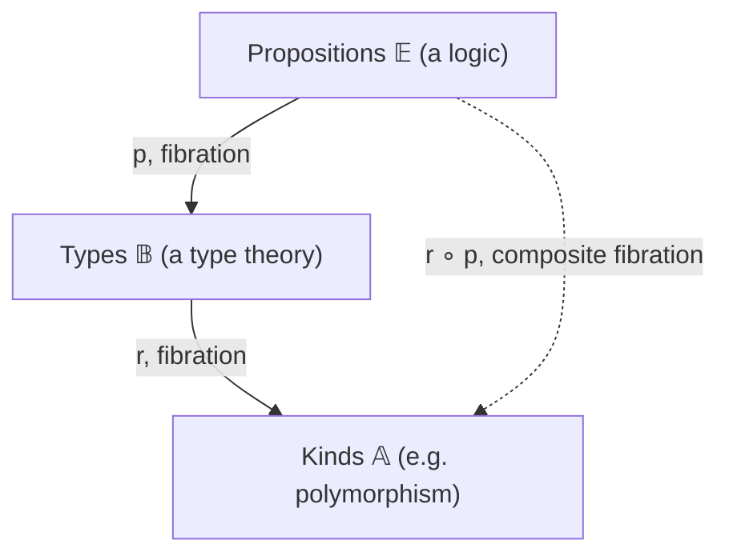
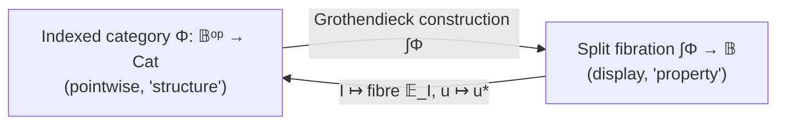

[[book-guidelines|↩ Back to guidelines]]

# Fibred Category Theory

## Why index categories at all

Start from a problem that has nothing to do with category theory yet. You have a type checker. A term `M` is well-typed only *relative to a context* `Γ` — `Γ ⊢ M : σ`. The same raw term can be well-typed in one context and ill-typed in another; the judgment is never about `M` alone. If you want to model this categorically — objects for types, morphisms for terms — you immediately hit the fact that the "collection of things classified by `σ`" is not one set, it's a whole *family* of sets, one per context, and the family changes coherently as you move between contexts (add a variable, forget a variable, rename a variable, specialize a variable to a concrete term).

That's the phenomenon this chapter formalizes: **a category that varies over another category.** Jacobs calls it *fibred category theory*, and it is the single technical device the entire book is built on. The slogan from the Prospectus — "a logic is always a logic over a type theory" — becomes, once you have this machinery, the statement that one fibration sits on top of another. Everything else in the book ([[Equational-Logic|equational logic]], predicate logic, dependent types, polymorphism, [[Toposes|toposes]]) is an instance of this one pattern with different fibres and different base categories.

If you've built a compiler, you already have working intuition for the two ways to represent "a thing that varies over an index":

- **Pointwise / by value.** A `HashMap<ContextId, TypeEnv>` — literally, for each index, store the associated object. This is how you'd naively store "the set of well-typed terms in context `Γ`" for each `Γ`.
- **By projection / display.** A single flat structure with a "which context does this belong to" tag, `Vec<(ContextId, Term)>`, or more precisely a function `terms_with_tags -> contexts` sending each tagged term to its context.

These look different, but for finite/discrete indexing they carry exactly the same information — you can reconstruct one from the other. Jacobs opens the chapter by making this equivalence precise for *sets* indexed by a set, and then generalizes the *display* style (representation (b)) to arbitrary categories, because "function from total space to index space" makes sense in any category, whereas "collection of things" does not (a category doesn't literally have a notion of "collection indexed by an object" without more assumptions). This is the entire motivation for defining a fibration as a *functor* `p : 𝔼 → 𝔹`, rather than as a functor `𝔹ᵒᵖ → Cat` (an indexed category) — even though the two turn out to be essentially interchangeable (Grothendieck's theorem, see below).

## 1. Fibrations and Cartesian morphisms

### What breaks without a universal lifting property

Suppose you have a functor `p : 𝔼 → 𝔹` and you want to say "the fibre over `I`, called `𝔼_I`, is the category of things `p` sends to `I`." Fine — that's just `p⁻¹(I)`. But you also want: given a morphism `u : I → J` in the base, a way to *transport* an object `Y` living over `J` back to something living over `I`. This is substitution: if `Y` is "the type `σ` in context `Γ, x:τ`" and `u` is "the weakening map from `Γ` to `Γ, x:τ`," you want `u*(Y)` to be "the same type `σ`, now considered as living in the smaller context `Γ`" — or in the other direction, the substitution `[N/x]σ`.

The naive thing to ask for is: "given `u : I → J` and `Y` over `J`, some object `X` over `I` and a morphism `X → Y` above `u`." But *any* map above `u` would do — there's no uniqueness, no way to call one choice "the" substitution. What's missing is a universal property that pins down *the best possible* such lift. That's exactly what a Cartesian morphism supplies.

### The definition, and why the universal property is exactly what's needed

> **Definition (Cartesian morphism).** A morphism `f : X → Y` in `𝔼` is **Cartesian** over `u = pf : I → J` in `𝔹` if for every `g : Z → Y` in `𝔼` with `pg = u ∘ w` for some `w : pZ → I`, there is a *unique* `h : Z → X` above `w` with `f ∘ h = g`.

Read this as: `f : X → Y` is Cartesian precisely when every map into `Y` that "factors through `u` on the base level" factors *uniquely* through `f` on the total-category level. This is the categorical incarnation of "`X` is exactly the pullback / restriction of `Y` along `u`, and nothing more." Concretely, for the codomain functor `cod : Sets^→ → Sets` (families displayed as `φ : X → I`), Cartesian morphisms are precisely pullback squares — so the abstract definition is a direct generalization of "pull back a family along a function."

> **Definition (fibration).** `p : 𝔼 → 𝔹` is a **fibration** if every `u : I → pY` in `𝔹` has a Cartesian lifting `f : X → Y` above it.

**Uniqueness up to (vertical) isomorphism.** Cartesian liftings of a given map are not literally unique — but any two are related by a unique *vertical* isomorphism (a map above the identity). This is Proposition 1.1.4, and it is the reason the whole theory can be developed either "up to choice" (cloven, §1.4) or "on the nose" — the choice never matters up to coherent isomorphism.

**What breaks without Cartesian-ness.** If you only require *some* lift (a "weak Cartesian" lift, unique factorization only for maps literally over `u`, not over any `w` factoring through `u`), you lose closure under composition of Cartesian morphisms and the clean equivalence with pullback squares — Jacobs shows in Exercise 1.1.6 that fibrations can equivalently be built from this weaker "weak Cartesian" notion plus closure under composition, precisely because composition is where the extra universal property (factoring through arbitrary `w`, not just literal equality) is needed.

```rust
// A fibration, Rust-shaped: `p` is a functor E -> B. Concretely, model
// the total category and base as trait objects, and Cartesian-ness as a
// universal-factorization obligation you'd have to *prove*, not just code.
// This is the shape of a "family indexed by a base," e.g. typing contexts.
trait Fibration {
    type Base;      // objects/morphisms of B
    type Total;     // objects/morphisms of E
    fn proj(&self, x: &Self::Total) -> Self::Base;      // p
    // Cartesian lifting of u : I -> pY at Y: produces X with p(X) = I
    // and a map f : X -> Y above u, universal among such maps.
    fn cartesian_lift(&self, u: &Self::Base, y: &Self::Total) -> (Self::Total, /* f: X->Y */ ());
}
```

In Lean's elaborator, the closest first-class analogue of "Cartesian lifting" is what `isDefEq`-driven unification does when it *specializes* a metavariable's expected type along a substitution — the substitution functor `u*` below is precisely the categorical shadow of "apply substitution `u` to a typing judgment and get back a well-formed judgment in the smaller context," which is exactly what happens every time the kernel checks a lambda application.

### The leading example: the codomain fibration

For any category `𝔹` with pullbacks, `cod : 𝔹^→ → 𝔹` (sending `φ : X → I` to `I`) is a fibration — the **codomain fibration**. Its fibre `𝔹_I` over `I` is the *slice category* `𝔹/I`. This will become the standard model of **dependent type theory**: a context `Γ` is an object of `𝔹`, and a type in context `Γ, x:σ` is a display map `Γ.σ → Γ`; substituting a term for `x` is literally pulling back this display map.

Two more standard fibrations recur throughout the book:

- **Simple fibration** `s(𝔹) → 𝔹`, for `𝔹` with finite products: fibre over `I` is the "simple slice" `𝔹//I`, whose objects are just objects of `𝔹` (not pairs `(I, X)` glued to `I`) and whose morphisms `X → Y` are maps `I × X → Y`. This models **[[Simple-Type-Theory|simple type theory]]**: a context doesn't change the *objects* available, only what morphisms out of them look like (they get an extra parameter `I`).
- **Subobject fibration** `Sub(𝔹) → 𝔹`: fibre over `I` is the poset of subobjects of `I` (equivalence classes of monos into `I`). This models **predicate logic**: a predicate on `I` is (up to logical equivalence) a subobject of `I`.

Jacobs explicitly calls the simple and codomain fibrations the "type theoretic" fibrations, and the subobject fibration the vehicle for "internal logic." This is a load-bearing distinction for your project: **type theory lives in codomain/simple fibrations, logic lives in subobject fibrations, and "a logic over a type theory" is literally one fibration's total category being the base of another.**

### Concrete non-Sets examples: ω-sets and PERs

To have models beyond plain sets, Jacobs introduces:

- **ω-sets**: a set `X` with, for each `x ∈ X`, a non-empty set of natural numbers `E(x) ⊆ ℕ` (its "realizers"/witnesses of existence); morphisms are functions tracked by a single recursive code `e` (Kleene application `e·n`) sending realizers of `x` to realizers of `f(x)`.
- **PER**s (partial equivalence relations on `ℕ`): symmetric, transitive (not necessarily reflexive) relations `R ⊆ ℕ×ℕ`; morphisms are tracked functions between the quotient sets `ℕ/R`.

Both categories have finite limits and exponents, and there is a **reflective subcategory chain** `Sets ↪ ω-Sets ↩ PER` — sets embed fully-faithfully into ω-sets (every element realized by everything), and PERs embed fully-faithfully into ω-sets (forcing realizer sets disjoint), with left adjoints going the other way. These are not decoration: PERs and ω-sets are exactly the machinery a **realizability model of dependent types** needs — a PER-indexed type family is precisely "a type whose terms are equivalence classes of *codes* (programs) modulo an equivalence the type specifies," which is the semantic backbone for later chapters' treatment of constructive/realizability semantics, and for anyone building a Miller-pattern unifier over an untyped term representation with definitional equality given by a PER on codes, this is the textbook categorical picture of that exact setup.

**What this buys your project directly:** if your refinement-type checker's trusted kernel ever needs a realizability-style soundness argument (`Γ ⊢ e : {x:τ | φ}` implies `e` actually satisfies `φ` at runtime), PER models are the standard tool — "well-typed" becomes "tracked by a code realizing the specification," and type soundness becomes exactly "the interpretation functor lands in the PER category."

## 2. Cloven versus split fibrations

### The problem: "there is a Cartesian lift" is an existence statement

[[Full-Higher-Order-Dependent-Type-Theory#The definition|The definition]] of fibration says "for every `u`, `Y`, *there exists* a Cartesian lift." It does not hand you a specific one. If you want an actual *function* `u ↦ u*`, you need to *choose* — for every `u` and every `Y`, a specific Cartesian lifting `u(Y) : u*(Y) → Y`. Making such a choice (possible in general only via Axiom-of-Choice-strength reasoning in the metatheory) is called giving the fibration a **cleavage**, and a fibration equipped with one is **cloven**.

Once you have a cleavage, each `u : I → J` induces an actual functor `u* : 𝔼_J → 𝔼_I` — the **substitution functor** (also: reindexing, relabelling, inverse-image, or pullback functor).

### What breaks without splitting

Now ask: for composable `I --u--> J --v--> K`, are `u*v*` and `(v∘u)*` literally the same functor `𝔼_K → 𝔼_I`? In general, **no** — they are only naturally isomorphic, via a canonical map arising because Cartesian liftings compose (two different Cartesian liftings of `v∘u` exist by composing, and by uniqueness up to vertical iso, they're isomorphic, not identical). Likewise `id*` is only isomorphic to the identity functor, not equal to it.

This matters enormously in practice: if you build a term model where substitution functors satisfy `u*v* = (v∘u)*` only up to isomorphism, then every time you compose two substitutions in your elaborator you must thread a coherence isomorphism through the rest of the calculation — a "coercion insertion" problem exactly analogous to what happens when a compiler represents definitional equality by *provable* isomorphism rather than *syntactic* identity. This is precisely why Lean's kernel treats `isDefEq` (definitional/judgmental equality) as a first-class, silently-inserted operation: without it, every substitution composition would need explicit `cast`s.

> **Definition.** A fibration is **split** if it is cloven and the induced isomorphisms `id ≅ (id_I)*` and `u*v* ≅ (v∘u)*` are literally **identities**, not just isomorphisms.

The general theorem (deferred to a later chapter, invoking [[Higher-Order-Predicate-Logic#The fibred Yoneda lemma|the fibred Yoneda lemma]]) is that *every* fibration is equivalent, in the fibred sense, to a split one — but the split *presentation* of a specific fibration is often more convenient than the naturally-occurring cloven one. The book's running example: the codomain fibration `Sets^→ → Sets` is cloven but **not** split (substitution is by literal pullback, and pullbacks of pullbacks are only isomorphic, not equal, to the composite pullback) — but it is *equivalent*, as a fibration, to the **family fibration** `Fam(Sets) → Sets` (pointwise indexing `(Xᵢ)ᵢ∈I`), whose substitution is by literal re-indexing (composition of functions), and which *is* split.

```rust
// Cloven: you've picked a specific Cartesian lift for every (u, Y).
// Split: additionally, id* and u*;v* are the identity function/composition,
// not merely isomorphic to it -- no coercions needed when composing substitutions.
trait ClovenFibration: Fibration {
    fn reindex(&self, u: &Self::Base, y_over_j: &Self::Total) -> Self::Total; // u*
}
// Splitting is a *property* of a chosen cleavage: reindex(id, y) == y
// (by ==, not merely "isomorphic to") and
// reindex(u, reindex(v, y)) == reindex(compose(v, u), y).
```

An **indexed category** packages exactly the pointwise/(a)-style data: a pseudo-functor `Φ : 𝔹ᵒᵖ → Cat` sending `I ↦ Φ(I)` and `u ↦ u* : Φ(J) → Φ(I)`, together with coherence isomorphisms `η_I : id ≅ (id_I)*` and `μ_{u,v} : u*v* ≅ (v∘u)*` satisfying pentagon/triangle-style coherence laws. A **split indexed category** is the special case where `Φ` is an honest functor (η, μ are identities). Proposition 1.4.5 shows that a cloven fibration always induces an indexed category via `I ↦ 𝔼_I`; it induces a *split* one exactly when the cleavage is a splitting.

**Where this connects to your project.** This cloven/split distinction is the categorical face of a very concrete engineering decision in a dependent-type checker: do you represent substitution as an *operation you re-run* every time (cloven — you always have "a" answer, but two paths to the same substitution give merely propositionally-equal results), or do you *normalize* substitutions so that composing them is literally associative on-the-nose (split — you've engineered your representation, e.g. explicit substitution calculi with confluent normal forms, so the coherence is free)? Lean's kernel effectively works hard to behave like a split fibration at the level of `whnf`-normalized terms, precisely to avoid the coercion bookkeeping a merely-cloven presentation would force on every unification step.

## 3. Substitution, reindexing, and change-of-base functors

Given a fibration `p`, there are two standard ways to manufacture new fibrations from old, and the book uses both relentlessly.

### Change-of-base (pullback)

> **Lemma 1.5.1.** If `p : 𝔼 → 𝔹` is a fibration and `K : 𝔸 → 𝔹` is any functor, form the pullback of categories `𝔸 ×_𝔹 𝔼`. The resulting projection `K*(p) : 𝔸 ×_𝔹 𝔼 → 𝔸` is again a fibration (cloven/split if `p` is).

Intuitively: restrict the base category along `K`, and the fibres over `𝔸` become exactly the fibres of `p` over the images `K(I)`. This is literally the substitution functor's own defining construction, lifted a level: whenever you want a family "of PERs indexed by PERs" instead of "of PERs indexed by ω-sets," you obtain it by change-of-base along the inclusion `PER ↪ ω-Sets` (Proposition 1.5.3) — a fibration you already understand gets specialized to a smaller universe for free.

### Composition

> **Lemma 1.5.5.** If `p : 𝔼 → 𝔹` and `r : 𝔹 → 𝔸` are both fibrations, then `r∘p : 𝔼 → 𝔸` is again a fibration, and `f` is `(rp)`-Cartesian iff `f` is `p`-Cartesian **and** `pf` is `r`-Cartesian.

This is the categorical statement that **repeated indexing is itself a form of indexing** — exactly the "propositions indexed by types indexed by kinds" tower that shows up once you stack logic over dependent types over polymorphism. When `p` sits over `r` this way, the book says "`p` is a fibration *over* `r`" (elaborated fully in §9.4, "category theory over a fibration" — see below).

### Substitution as adjoint-preserving structure

The single most important payoff of a good substitution/reindexing theory is **Lemma 1.4.10**: for a cloven fibration, every morphism `f : X → Y` in the total category factors uniquely as a vertical part followed by a Cartesian part:
$$
\mathbb{E}(X,Y) \;\cong\; \coprod_{u : pX \to pY} \mathbb{E}_{pX}(X, u^*(Y)).
$$
This is the formal version of "every derivation `Γ ⊢ M : σ` decomposes into 'which base-level map are we above' plus 'what's left to check once we've substituted along it.'" It's the mechanism that lets you switch between reasoning globally (in the total category) and reasoning locally (inside one fibre) without losing information — indispensable once you start proving soundness lemmas by induction on typing derivations, since the base component and vertical component of a derivation step can be handled by separate, independently-provable lemmas.

Weakening and contraction (next section) are the two special-case substitution functors that make this concrete for logic.

## 4. Weakening and contraction as special substitutions

This is where fibred category theory stops being abstract plumbing and starts *being* the structural rules of a type theory.

Take `𝔹` with finite products. Two families of maps recur everywhere:

- **Projections** `π : I × J → I` (forget the `J`-component).
- **Diagonals** `δ : J → J × J` (duplicate the `J`-component).

> **Definition.** The substitution functor `π*` induced by a **projection** is called a **weakening functor**. The substitution functor `δ*` induced by a **diagonal** is called a **contraction functor**.

Why these names? Substituting a family `(Y_{j})_{j∈J}` along `π : J × I → J` produces the family `(Y_j)_{(j,i) ∈ J×I}` with a "dummy" extra index `i` that plays no role (Example 1.1.1(iii)) — in logical terms, this is exactly **weakening**: taking a proposition/type valid under context `J` and considering it under the larger context `J × I`, i.e. adding an assumption you don't use. Substituting along the diagonal `δ : J → J×J` instead *identifies* two occurrences of the same index — this is **contraction**: replacing two variables `j, j'` by a single one, `[j/j']`.

This single observation is the seed of an enormous simplification carried through the whole book: rather than treating "weakening," "contraction," "exchange," and general "substitution" as four separate syntactic rules that must each be verified sound in every calculus, Jacobs shows (starting in Ch. 0, developed structurally here) that **weakening and contraction are just substitution along two specific, canonical shapes of morphism** (`π` and `δ`). Once you know a fibration's *arbitrary* substitution functors behave well, weakening and contraction come for free as special cases — you never need a separate soundness argument for them.

This directly foreshadows the book's headline categorical results, previewed already in Ch. 0 and developed rigorously in Chapters 1, 3, and 4:
- **quantifiers** `∃, ∀` are adjoints (left/right respectively) to weakening functors `π*`,
- **equality** is a left adjoint to a contraction functor `δ*`.

**What this buys a compiler/elaborator.** If your bidirectional type checker implements context weakening as "shift de Bruijn indices" and contraction/substitution as "replace a variable with a term," you are literally implementing `π*` and `δ*` on the codomain (or simple) fibration for your syntactic category. Any lemma you need about "substitution commutes with weakening" or "weakening then substituting a *different* variable is substitution then weakening" is a Beck–Chevalley-flavored coherence fact (§7 below) about these two functors — meaning you can look up (or re-derive) the general fibred statement rather than hand-proving de Bruijn index arithmetic from scratch every time.

```rust
// Weakening = substitute along a projection I x J -> I: add an unused var.
// Contraction = substitute along a diagonal J -> J x J: identify two vars.
enum StructuralSubst {
    Weaken { dummy_ty: TypeId },      // π* : adds a variable nothing depends on
    Contract { shared_var: VarId },   // δ* : merges two occurrences into one
    General(Box<dyn Fn(Ctx) -> Ctx>), // u* : arbitrary substitution functor
}
```

## 5. Composition of fibrations

(Covered above in §3 as one of the two fibration-building operations — restated here because the Topic List calls it out separately.) The key fact bears repeating in its own right because of how often it is invoked later: **fibrations compose, and Cartesian-ness in the composite decomposes into "Cartesian for the inner fibration, and Cartesian-after-projection for the outer one."** This is what makes towers of the form



well-behaved: propositions-over-types-over-kinds is not an ad hoc three-level bookkeeping exercise, it is a single fibration `r∘p`, and every general theorem about fibrations (completeness, fibred CCC structure, Beck–Chevalley, ...) applies to it automatically as soon as it holds for `p` and `r` separately (with due care — see §9.4 on "fibrations over fibrations," which studies exactly what data is needed to reason about one level in the tower without re-deriving everything about the tower as a whole).

## 6. Categories and 2-categories of fibrations

Once fibrations are the objects of study, you need to know what a *morphism between fibrations* is, so that "fibration" itself organizes into a category (in fact a 2-category, since there is also a sensible notion of *morphism between morphisms*).

> **Definition 1.7.1.** A **morphism of fibrations** `(K, H) : p → q` consists of functors `K : 𝔹 → 𝔸`, `H : 𝔼 → 𝔻` making the square commute **on the nose** (not just up to iso) and sending Cartesian morphisms to Cartesian morphisms. Such `H` is called a **fibred functor**.

Four flavors, organized by (fixed base? / split?):

| | over a fixed base 𝔹 | over arbitrary bases |
|---|---|---|
| **split** | `Fib_split(𝔹)` | `Fib_split` |
| **not necessarily split** | `Fib(𝔹)` | `Fib` |

`Fib(𝔹)` is obtained as the *fibre* over `𝔹` of the fibration `Fib → Cat` (fibrations sending a fibration to its base category) — a satisfying bit of self-application: the category of fibrations over a fixed base is itself literally a fibre of a bigger fibration.

**2-cells.** A 2-cell between morphisms `(K,H) → (L,G)` in `Fib` is a pair of natural transformations `σ : K ⇒ L`, `τ : H ⇒ G` compatible with the projections; when the base is fixed (`K = L = id`), this specializes to a **vertical (fibred) natural transformation** — every component of `τ` is a vertical morphism. This 2-categorical scaffolding is what lets the book later say things like "fibred adjunction" (an adjunction internal to `Fib(𝔹)`, §8) with a precise, reusable meaning rather than inventing bespoke definitions per situation.

**Fibred equivalence.** Two fibrations over the same base are *fibred-equivalent* if there are fibred functors `F, G` back and forth with **vertical** natural isomorphisms `GF ≅ id`, `FG ≅ id`. All the "these two presentations are secretly the same fibration" results mentioned so far — `Fam(Sets) ≃ Sets^→`, `UFam(ω-Sets) ≃ ω-Set^→`, `UFam(PER) ≃ PER^→` — are fibred equivalences in exactly this sense (Proposition 1.7.8), not merely equivalences of the total categories.

**Lifting natural transformations (Lemma 1.7.10).** A subtler but important fact: given `K, L : 𝔸 → 𝔹` and a natural transformation `α : K ⇒ L`, and a *cloven* fibration `p`, `α` lifts to a genuine 2-cell between the change-of-base fibrations `K*(p)` and `L*(p)`, with every component of the lift Cartesian. This is what makes change-of-base functorial not just on fibrations-as-objects but on the natural transformations between the functors you change base along — needed, for instance, whenever your elaborator needs to track how a metavariable instantiation (a natural transformation between "before" and "after" substitution functors) propagates through an entire indexed structure.

## 7. Fibrewise structure and fibred Cartesian closed categories

### Structure inside a fibre, and structure that survives substitution

There are two ways ordinary categorical structure (products, terminal objects, exponents, ...) can generalize to a fibred setting, and distinguishing them is essential:

> **Definition 1.8.1.** A fibration has **fibred (fibrewise) ◇'s** if (a) every fibre category has ◇'s, and (b) every reindexing functor `u*` **preserves** ◇'s. A split fibration has **split fibred** ◇'s if additionally the chosen ◇'s are preserved *on-the-nose* (not just up to iso).

The second clause is the one people forget, and it's the one that matters. It is not enough that "each context has products" — you also need "substituting into a product gives (up to iso, or literally) the product of the substituted pieces." Without it, your typing rules for products would need an extra coherence axiom every time you substitute into a pair type, exactly the kind of hidden proof obligation that turns into a soundness bug if silently assumed.

> **Definition 1.8.2.** A **(split) fibred CCC** is a fibration with (split) fibred finite products and fibred exponents.

**Concrete payoff:** the codomain fibration on `𝔹` is a fibred CCC **iff** `𝔹` is **locally Cartesian closed** (LCCC) — every slice `𝔹/I` is Cartesian closed. This single equivalence is the categorical definition of "dependently-typed function spaces exist" and reappears constantly: an LCCC base is precisely what lets you form Π-types with the expected substitution behavior, because "Π-type formation" is exactly "the codomain fibration has fibred exponents," and "exponents in slice `𝔹/I`" are exactly "dependent products over the type displayed by `I`."

### Fibred adjunctions

Ordinary categorical structure (terminal objects, products, ...) is equivalent to certain adjunctions (`1 ⊣ !`, `Δ ⊣ ×`, ...). The fibred generalization: a **fibred adjunction over 𝔹** is an adjunction in the 2-category `Fib(𝔹)` — fibred functors `F ⊣ G` with **vertical** unit and counit.

> **Lemma 1.8.9 (the central mechanism).** A fibred functor `H : 𝔼 → 𝔻` over `𝔹` has a fibred left/right adjoint **iff** both:
> (a) each restriction `H_I : 𝔼_I → 𝔻_I` to the fibres has an ordinary left/right adjoint `K(I)`; and
> (b) **Beck–Chevalley** holds: for every `u : I → J`, the canonical map `K(I)∘u#  ⇒  u*∘K(J)` (resp. the dual) is an isomorphism.

This is the pattern that recurs *every single time* the book introduces a piece of logical/type-theoretic structure: build it fibrewise (locally, in each context), then impose Beck–Chevalley to guarantee the local construction glues coherently across all contexts via substitution. It is the fibred analogue of "define a function pointwise, then check it's natural."

## 8. Fibred products, coproducts, and the Beck–Chevalley condition

### Simple quantification: adjoints to weakening

> **Definition 1.9.1.** `p` has **simple products** (resp. **coproducts**) if every weakening functor `π*_{(I,J)} : 𝔼_I → 𝔼_{I×J}` has a right adjoint `∏_{(I,J)}` (resp. left adjoint `∐_{(I,J)}`), and **Beck–Chevalley** holds: for `u : K → I`, the canonical map `u* ∏_{(I,J)} ⇒ ∏_{(K,J)}(u × id)*` (dually for `∐`) is an isomorphism.

This is precisely $\forall, \exists$ in first-order logic, and `Π, Σ` in simple/[[Polymorphic-Type-Theory|polymorphic type theory]]: `∏_{(I,J)}` right-adjoint-to-weakening-along-`J` is universal quantification/dependent product over the "parameter" `J`; `∐_{(I,J)}` is existential quantification/dependent sum.

### General quantification: adjoints to arbitrary substitution

> **Definition 1.9.4.** `p` has **products** (resp. **coproducts**) if *every* substitution functor `u* : 𝔼_J → 𝔼_I` (for arbitrary `u : I → J`, not just projections) has a right adjoint `∏_u` (resp. left adjoint `∐_u`), with Beck–Chevalley for every pullback square in the base.

The simple form suffices for `∀, ∃` in ordinary predicate logic and `Π, Σ` in simple/polymorphic type theory, where quantification only ever ranges over a fixed "extra parameter." **Dependent type theory needs the general form**, because a dependent Π/Σ-type's "extra parameter" is itself a *type depending on the context*, not a fixed object — the Cartesian projection `π : I × J → I` has to be replaced by a genuinely dependent "projection" (a display map), which is exactly an arbitrary morphism in the codomain fibration's base. This is precisely why the book needs *both* notions on the books: simple quantification is the special case Jacobs proves is recovered by *localizing* the general notion to every slice at once (Theorem 1.9.10) — ordinary products relative to `𝔹` correspond exactly to simple products relative to every slice `𝔹/I`.

### Why Beck–Chevalley is not a formality

Beck–Chevalley says a canonical comparison map is an isomorphism — but nothing forces this. Jacobs is explicit that it can fail (Exercise 1.9.10). Concretely: Beck–Chevalley for `∃` says "existentially quantifying and then substituting gives the same predicate as substituting and then existentially quantifying" — i.e. $u^*(\exists y.\varphi) \Leftrightarrow \exists y.\, u^*\varphi$ when `u` doesn't touch `y`. This is intuitively obvious in `Sets`, but it's a genuine *theorem* about the pullback square being a pullback, not a free consequence of having adjoints — the categorical incarnation of the (informally obvious, formally non-trivial) fact that **quantifier scope commutes correctly with substitution only when the substitution doesn't capture the bound variable**. For anyone implementing capture-avoiding substitution, this is the precise abstract shape of the correctness property you're maintaining by hand with fresh-variable renaming.

### Completeness and cocompleteness

> **Definition 1.9.11.** A fibration is **complete** if it has products `∏_u` (along arbitrary `u`) and fibred finite limits. Dually, **cocomplete** if it has coproducts `∐_u` and fibred finite colimits.

The codomain fibration of an LCCC is complete (Proposition 1.9.8(iii): products `∏_u` exist **iff** `𝔹` is LCCC, with Beck–Chevalley automatic via the Pullback Lemma). This single fact is why "dependent type theory needs an LCCC" is not an arbitrary requirement — it is *exactly* "the ambient codomain fibration is complete," i.e., Π-types (general, not just simple) exist coherently everywhere.

## 9. The Frobenius law

A distribution law that keeps reappearing under different guises across logic, type theory, and even process calculus:

> **Lemma 1.9.12 (Frobenius).** Let `p` be a fibred CCC with simple coproducts. For `Y ∈ 𝔼_I`, `Z ∈ 𝔼_{I×J}`, the canonical map
> $$
> \coprod_{(I,J)}\bigl(\pi^*_{(I,J)}(Y) \times Z\bigr) \;\longrightarrow\; Y \times \coprod_{(I,J)}(Z)
> $$
> is an isomorphism.

Read this instance logically: it is exactly $\exists x.\,(\varphi \wedge \psi(x)) \;\Leftrightarrow\; \varphi \wedge \exists x.\,\psi(x)$ when `x` doesn't occur free in `φ` — the rule you use constantly, silently, when simplifying quantified formulas or hoisting a loop-invariant conjunct out of an existential during weakest-precondition computation. The proof is a one-line Yoneda argument once you note the map is a transpose composite built from the counit of `∐_{(I,J)} ⊣ π*_{(I,J)}` — it is an isomorphism *automatically* whenever reindexing functors preserve exponents (which they do, in a fibred CCC), but the book notes it can also hold even *without* fibred exponents, in which case one just says the coproducts **satisfy Frobenius** as an extra hypothesis. This distinction matters for CHC/Horn-clause style verification-condition generation: Frobenius is precisely the law that licenses moving a side-condition in and out of an existentially-quantified auxiliary variable when flattening nested `let`-bindings into flat clauses — get it wrong and your generated VC is not logically equivalent to the source program's specification.

## 10. Complete and cocomplete fibrations

(See §8 above for the formal statement; restated briefly because the Topic List separates it out.) The headline structural fact worth remembering on its own: **completeness of a fibration is not "each fibre is a complete category."** It is the *combination* of (i) fibred finite limits (so each fibre has the small, non-quantifier limits, preserved by substitution) **and** (ii) products `∏_u` along every base morphism (the "quantifier" half). Only together do these give you, e.g., a semantics where you can form both ordinary conjunctions inside a context *and* universally-quantify over a dependent variable, with substitution behaving correctly for both. Chapter 7 ([[Internal-Category-Theory|internal category theory]]) later shows that every *small diagram* in a complete fibration has a limit — the technical subtlety there being what "a small diagram" even means once diagrams themselves can vary fibrewise.

## 11–14. Opfibrations, bifibrations, fibred spans, category theory over a fibration, and (local) smallness

These four topics are developed in Chapter 9 ("Advanced fibred category theory," §§9.1, 9.4–9.6) rather than Chapter 1 — the book explicitly earmarks them as a "second pass" over fibred category theory, revisited once the reader has seen fibrations put to work on real logics and type theories in the intervening chapters. They are included here because the guidelines' Topic List groups them under "Fibred Category Theory" as a whole.

### Opfibrations and bifibrations

Everything so far chased a **terminal**-lifting property (Cartesian morphisms, universal *into* an object). Dualize: a functor `p : 𝔼 → 𝔹` is an **opfibration** if `p : 𝔼ᵒᵖ → 𝔹ᵒᵖ` is a fibration — equivalently, every `pX → J` has an **opcartesian** lifting, universal *out of* `X`. Where fibrations give you *restriction* (`u*`), opfibrations give you *extension* (written `u!` or `∐_u` when it exists as a left adjoint): pushing a family forward along a map, rather than pulling one back.

> **Lemma 9.1.2.** A fibration is a **bifibration** (fibration *and* opfibration) **iff** every reindexing functor `u*` has a left adjoint `u!` — note, critically, *without* requiring Beck–Chevalley. Every fibration with coproducts (§8, with Beck–Chevalley) is automatically a bifibration, but the converse addition is free: you get the adjunction `u! ⊣ u*` for cheap, and Beck–Chevalley is the *extra* condition needed to call it "coproducts" in the technical sense used for `∃`/`Σ`.

Bifibrations are exactly the shape of "modules over a varying ring" (`R → S` gives restriction `f* : Mod_S → Mod_R` and extension-of-scalars `f! : Mod_R → Mod_S`) and, in the syntactic setting, of algebraic-specification morphisms (`φ : (Σ,A) → (Σ',A')` gives model restriction `φ*` and best-possible-extension `φ!` via left Kan extension) — this is the precise categorical name for what an elaborator's "coercion insertion" or "generalize then re-specialize" step is doing when it moves a partially-elaborated term across a signature morphism.

### Fibred spans

A **fibred span** generalizes both notions at once: a diagram `𝔸 ← 𝔼 → 𝔹` where the left leg is a fibration and the right leg is an opfibration, with a compatibility condition tying Cartesian and opcartesian maps together (roughly: Cartesian-then-opcartesian factorizations and opcartesian-then-Cartesian factorizations agree). This is the fibred analogue of a *profunctor* `𝔸ᵒᵖ × 𝔹 → Sets` generalized to `Cat`-valued — **Proposition 9.1.8** gives a Grothendieck-style correspondence: split fibred spans correspond exactly to functors `𝔸ᵒᵖ × 𝔹 → Cat`. Comma categories `(F ↓ G)` for `F : 𝔸 → ℂ ← 𝔹 : G` are the paradigm example (Lemma 9.1.6), and this is precisely the categorical shape of Goguen–Burstall **institutions** — the machinery for "reindexing along signature morphisms is contravariant on models, reindexing along model morphisms is covariant," a distinction that matters whenever your elaborator's notion of "model" (e.g. an assignment of concrete values/proof terms to metavariables) needs to transport correctly in *both* directions across a specification refinement.

### Category theory over a fibration

The chapter's central generalization for multi-level indexing: instead of asking "is `p : 𝔼 → 𝔹` a fibration over the plain category `𝔹`?", ask "is a morphism `r : 𝔻 → 𝔼` a fibration *relative to* an already-fibred `p : 𝔼 → 𝔹`?" — formalized 2-categorically via comma objects and a right-adjoint-right-inverse condition (Street's reformulation, Definition 9.4.1), specializing the ordinary "fibration" definition itself when the ambient 2-category is `Cat`.

> **Proposition 9.4.3.** `r : q → p` is a fibration in `Fib(𝔹)` **iff** `r` is itself a cloven fibration **iff** `r` is "fibrewise a fibration": each restriction `r_I : 𝔻_I → 𝔼_I` is a cloven fibration, coherently with `p`'s own reindexing.

This is exactly the tool for "propositions fibred over types, types fibred over kinds" (the polymorphic-predicate-logic situation previewed in Ch. 8), i.e., for a tower where you want to reason about one level (say, well-formedness of refinement predicates) *without* re-deriving everything about the levels below it (well-formedness of the base types they refine) from scratch — the Simple-fibration-over-a-fibration and Codomain-fibration-over-a-fibration constructions the book gives as leading examples are the direct semantic model of "refinement types are a fibration of predicates sitting over a fibration of base types."

### Locally small and definable fibrations

**Local smallness** generalizes "homsets are sets, not proper classes" to an arbitrary base-category universe: `p` is **locally small** if for objects `X, Y` in the same fibre `𝔼_I`, the presheaf `(𝔹/I)ᵒᵖ → Sets`, `(u:J→I) ↦ 𝔼_J(u*X, u*Y)`, is *representable* — by an object `Hom_I(X,Y) → I` in the base. Intuitively: the "set of vertical maps `X → Y`" is itself representable *inside the universe the fibration is a family over*, not merely a genuine set in the ambient metatheory.

**Why this matters for definitional equality specifically:** Lemma 9.5.2 shows a fibred CCC is locally small **iff** the fibred terminal-object functor `1 : 𝔹 → 𝔼` has a right adjoint `{−}` — i.e., **iff it has comprehension/subset types.** Local smallness is thus not an abstract size condition; it is *equivalent* to the fibration supporting the subset-type former `{x:σ | φ}`, and its failure is a genuine obstruction (§9.5.3 works out, via a diagonal argument on non-empty PERs, why the naive `Sets`-indexed-PER fibration is *not* locally small — a cardinality obstruction, not a technicality).

**Definability** then generalizes comprehension further: a collection `P` of objects of `𝔼` (think: "predicates satisfying some closure property") is **definable** if it's closed under substitution and every object `X` has a *best approximation* `X' ∈ P` reached by a universal Cartesian map — equivalently, a representing mono `{X ∈ P} ↣ pX` in the base (Lemma 9.6.2). Taking `P = Truth` (predicates provably true) recovers ordinary subset types exactly (Lemma 9.6.3); taking `P` to be families of finite sets inside `Fam(Sets)` recovers "finiteness is a definable predicate."

The capstone result ties smallness, local smallness, and definability together:

> **Corollary 9.5.6.** A fibration is **small** iff it is **locally small** and has a **generic object**.
>
> **Corollary 9.6.11.** A **definable subfibration** of a small fibration is again small.

This is the fibred analogue of "a category is small iff it has a small set of objects and a small set of morphisms" — and the second corollary is exactly the fact you need if you want to build an internal universe hierarchy (types-of-types) where cutting out a *definable* sub-collection (say, "the refinement types whose predicate is decidable," or "the types satisfying some closure condition your elaborator checks") is guaranteed to stay inside the small/well-behaved fragment rather than accidentally escaping into a larger, unmanageable universe. If you are building a universe-polymorphic kernel in the Lean style, this corollary is the semantic justification for why restricting attention to a definable sub-universe (e.g., "predicative" types below some level) doesn't silently break smallness invariants the kernel relies on.

## 15. Category theory over a fibration and Grothendieck's equivalence (indexed categories, §1.10)

Returning to Chapter 1's closing section: the promised passage back from pointwise-style indexed categories to display-style fibrations.

> **Definition 1.10.1 (Grothendieck construction).** For an indexed category `Φ : 𝔹ᵒᵖ → Cat`, the **Grothendieck completion** `∫Φ` has objects `(I, X)` with `X ∈ Φ(I)`, and morphisms `(I,X) → (J,Y)` given by `u : I → J` together with `f : X → u*(Y)` in `Φ(I)`.

> **Theorem 1.10.7 (Grothendieck).** [[First-Order-Predicate-Logic#The construction|The construction]] gives an **equivalence of (2-)categories** `ICat ≃ Fib_split` over `Cat` — [[Indexed-Categories-and-the-Grothendieck-Construction#Split indexed categories|split indexed categories]] are, up to this equivalence, exactly the same data as split fibrations.

This equivalence is the precise formal content behind the informal slogan "an indexed category is just a presentation of a fibred category" (quoting Bénabou, whom Jacobs cites approvingly). Jacobs argues — and this is worth internalizing rather than skimming — that fibrations are usually the *better* choice to work with, even though indexed categories look more elementary:

- **Properties vs. structure.** A fibration's Cartesian-lifting property, once a cleavage is chosen, *induces* the indexed-category structure (reindexing functors, coherence isos) — but you don't have to carry the structure around explicitly, or re-verify coherence pentagons every time you compose. An indexed category *is* that structure, always exposed.
- **Composition.** Fibrations are closed under composition cleanly (§5 above); the corresponding statement for indexed categories exists but is comparatively clumsy — precisely the tower-of-indexing situation (propositions over types over kinds) that recurs later needs this closure property to stay tractable.
- **2-categorical generality.** "Fibration" makes sense as a *definition inside any 2-category* (Street's formulation, used again in §9.4) — indexed-category-style presentations don't generalize this way without extra machinery.

For opposite categories, the asymmetry sharpens: taking the opposite of an indexed category is trivial (`Φᵒᵖ(I) = Φ(I)ᵒᵖ`, fibrewise). Taking the opposite of a *fibration* `p^{op}` (Bénabou's construction, Definition 1.10.11) is considerably more delicate — you must reverse only the *vertical* part of every morphism (recall every map factors as vertical-then-Cartesian) while leaving the Cartesian/base-level part alone, which forces an equivalence-relation quotient construction on pairs of (Cartesian, vertical) maps. This asymmetry is exactly Jacobs's point (iv) in the discussion of 1.10.4: some things genuinely are easier with indexed categories, but they're outweighed by the composition and 2-categorical advantages of fibrations.



## Synthesis: how this chapter organizes the rest of the book

Every subsequent chapter is an instance of the pattern fixed here:

- **Simple type theory (Ch. 2)** = the simple fibration `s(𝔹) → 𝔹`; exponents there are literally **simple products** `∏_{(I,J)}` in disguise, sidestepping the need for `𝔹` itself to have products.
- **Equational logic (Ch. 3)** = equality as a left adjoint to a **contraction functor** — the general adjoint-to-`δ*` machinery from §4/§8 specialized to one connective.
- **First-order predicate logic (Ch. 4)** = `∃, ∀` as adjoints to **weakening functors**, formalized precisely via **simple (co)products** and their **Beck–Chevalley** condition (§8); subset and quotient types are, respectively, a right adjoint to truth and a left adjoint to equality — dual instances of the same "adjoint to a distinguished functor" pattern that generalizes into **definability** (§9.6) later.
- **Higher-order logic and toposes (Ch. 5–6)** need **generic objects** and a fibred Yoneda lemma to make a type of propositions meaningful — machinery that presupposes the split/cloven distinction (§2) and the general fibration/indexed-category equivalence (§15).
- **Dependent type theory (Ch. 10–11)** needs the **codomain fibration's completeness** in full generality (general products `∏_u`, not just simple ones) precisely because dependent Π-types quantify along arbitrary display maps, not fixed-parameter projections — this is why §8's distinction between simple and general quantification is flagged as consequential rather than a mere generalization for its own sake.
- **Polymorphic and higher-order combined systems (Ch. 8, 20–22)** are exactly where "category theory over a fibration" (§9.4) becomes unavoidable: propositions-over-types-over-kinds is a fibration-over-a-fibration, not a single-level fibration, and reasoning about it correctly requires the machinery of §14.

## Where this leads

The immediately next payoff, in Chapter 3, is Lawvere's description of **equality as a left adjoint to contraction** — the mate-rule unification of reflexivity/symmetry/transitivity/replacement into a single adjunction, directly generalizing the weakening/contraction distinction fixed here. Chapter 4 then builds the full categorical anatomy of quantifiers and subset/quotient types on top of the simple- and general-quantification machinery from §8. For the compiler/elaborator project specifically: the **cloven-vs-split** distinction (§2) is the precise theoretical account of why explicit-substitution calculi with confluent normalization behave better under composition than naive re-substitution; the **Beck–Chevalley condition** (§8) is the abstract shape of every "substitution commutes with a binder" lemma a capture-avoiding substitution routine has to get right; and **local smallness/definability** (§14) is the exact semantic scaffolding needed if a universe-polymorphic kernel is going to carve out sub-universes (decidable refinements, predicative fragments) without breaking smallness invariants. Chapter 9's "category theory over a fibration" is the tool to reach for the moment your elaborator needs two simultaneous levels of indexing — propositions over refined types over base types — rather than one.
