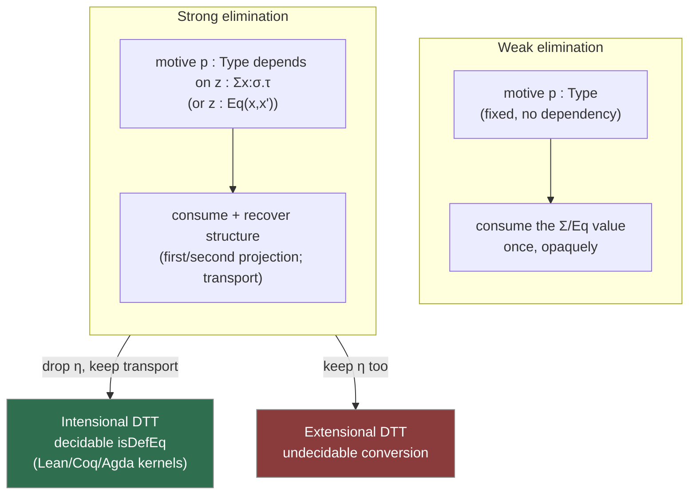

# First Order Dependent Type Theory

[[book-guidelines|↩ Back to guidelines]]

## Why Cartesian products stop working

Every earlier calculus in this book — [[Simple-Type-Theory|simple type theory]] (STT), [[Polymorphic-Type-Theory|polymorphic type theory]] (PTT) — has one property that makes its categorical semantics easy to bootstrap: **a context is a product of its types.** $\Gamma = (v_1{:}\sigma_1,\dots,v_n{:}\sigma_n)$ denotes the object $\sigma_1\times\cdots\times\sigma_n$, concatenating two contexts is literally forming a categorical product, and everything else (weakening, exponents, quantifiers) is built as an adjoint to a projection or diagonal *between products*. Jacobs formalized this pattern as a "CT-structure" (category with finite products, plus a distinguished subcollection $T\subseteq\mathrm{Obj}\,\mathbb B$ of objects-as-types): types are objects, contexts are products of objects, done.

Dependent type theory (DTT) breaks this at the first step. Consider

$$n:\mathbb N \vdash \mathrm{NatList}(n):\mathrm{Type}$$

— the type of length-$n$ lists of naturals. The type $\mathrm{NatList}(n)$ is not a fixed object; it's a *family* of objects indexed by the term variable $n$. If you try to model the context $(n{:}\mathbb N,\, \ell{:}\mathrm{NatList}(n))$ as a product $\mathbb N \times \mathrm{NatList}$, you immediately hit a wall: there is no single object $\mathrm{NatList}$ to take the product with, because which list-type you get depends on *which element of $\mathbb N$* you picked first. The second component's type is not independent of the first component's value.

This is exactly the situation of an $I$-indexed family of sets $(X_i)_{i\in I}$ — what Jacobs calls "sets depending on sets." The right categorical description of pairing up $i:I$ with an element of $X_i$ is not a product $I\times X$, it's the **disjoint union** $\coprod_{i\in I}X_i$. Categorically, a context extension $(\Gamma, x{:}\sigma)$ is the *domain* of a map $\coprod_{\Gamma}\sigma \to \Gamma$ (the family $\sigma$ collected together and projected back down), and the operation that recovers "concatenate two contexts, second may depend on first" is a **pullback along that projection**, not a product. This is the single fact the entire chapter is built to make categorically precise:

> Context concatenation in DTT is *pullback along a display map*, not Cartesian product.

**What breaks without this fix.** If you insist on modeling dependent types with the codomain fibration $\mathbb B^{\to}\!\!\downarrow\mathbb B$ (arbitrary morphisms of $\mathbb B$ as "families") the way you'd naively generalize CT-structures, you get *too much structure for free*: every codomain fibration automatically has strong dependent sums and strong equality (Jacobs points this out explicitly — codomain fibrations "suffer from the same defect that subobject fibrations do," p. 583). You can no longer study "DTT with only weak sums" or "DTT without [[Polymorphic-Type-Theory#Equality types|equality types]]" as separate, comparable theories, because the ambient semantics has silently baked in the strongest possible versions of everything. The fix is to single out a *restricted, well-behaved subclass* of morphisms — the **display maps** — that will represent exactly the type-formers your syntax actually has, no more. This is why the chapter needs a new categorical notion (**comprehension category**) rather than reusing the CT-structure/codomain-fibration machinery wholesale: STT could get away with "the ambient category has products, done" because there was no dependency to be selective about.

If you are building a Rust/Lean-style dependent-type checker, the practical shadow of this fact is that **your `Context` cannot be a flat product of independent type slots.** It has to be a *telescope*: an ordered list of bindings where binding $k$'s type is allowed to mention bindings $0..k-1$ by variable (or de Bruijn index). Extending it is not "append a new independent field," it's "extend a family, indexed by everything already bound." This is display-map pullback, executed at run time.

```rust
// A DTT context is a telescope: each entry's type may reference EARLIER entries.
// This is exactly what "concatenation of contexts = pullback along a display map"
// buys you at the syntax level — the type at position k lives in the fibre over
// the context truncated at position k, not in some fixed global type-universe slot.
struct Context {
    // invariant: types[k] may only mention free variables bound in types[0..k]
    entries: Vec<(Ident, Term)>, // (name, type) -- `Term` because types contain terms
}

impl Context {
    // "weakening" = pulling a type/term back along the display map that forgets
    // the newest binding. It's cheap (shift de Bruijn indices) but it is a real
    // categorical operation, not a no-op — see π* below in §10.3/10.4.
    fn extend(&self, name: Ident, ty: Term) -> Context { /* telescope append */ }
}
```

```lean
-- Lean's own `Expr`/`LocalContext` is literally this telescope: a `LocalContext`
-- is an ordered list of `LocalDecl`s, and adding a new one (`LocalContext.mkLocalDecl`)
-- is well-typed only relative to everything already in scope. Lean's kernel
-- never treats a context as a product of independent slots.
```

---

## 10.1 The calculus: Π, Σ, and Eq, weak and strong

### Three new type formers

DTT adds exactly three new ways to build types, on top of whatever base type formers you already have:

$$\Pi x{:}\sigma.\,T(x) \qquad \Sigma x{:}\sigma.\,T(x) \qquad \mathrm{Eq}_\sigma(x,x')$$

read as: the dependent product of $T(x)$ as $x$ ranges over $\sigma$; the dependent sum of $T(x)$ as $x$ ranges over $\sigma$; and the type of $\sigma$-equality proofs between $x$ and $x'$ (also called the **identity type**). Set-theoretically these generalize the indexed product and sum:

$$\Pi_{i\in I}X_i = \{f : i \mapsto \textstyle\bigcup_i X_i \mid \forall i.\ f(i)\in X_i\}\qquad \Sigma_{i\in I}X_i = \{(i,x)\mid i\in I,\ x\in X_i\}$$

$\Pi x{:}\sigma.T(x)$ is "functions $f$ such that for each $a{:}\sigma$, $fa : T[a/x]$" — note the **substitution** $T[a/x]$ inside the codomain, which is the entire syntactic novelty of DTT: types now have holes that terms fill. $\Sigma x{:}\sigma.T(x)$ is pairs $(a,b)$ with $a{:}\sigma$ and $b : T[a/x]$. And $\mathrm{Eq}_\sigma(x,x')$ is, intuitively, a singleton type when $x=x'$ and empty otherwise — a *type-valued* equality predicate, which is the thing that makes DTT strictly stronger than STT/PTT logic: propositions about term equality now live *inside* the type system as inhabitable types, not as an external judgment.

**Well-formed contexts.** A context $\Gamma=(x_1{:}\sigma_1,\dots,x_n{:}\sigma_n)$ is well-formed exactly when each $\sigma_{i+1}$ is a valid type *in the preceding context*: $x_1{:}\sigma_1,\dots,x_i{:}\sigma_i \vdash \sigma_{i+1}{:}\mathrm{Type}$. So $(n{:}\mathbb N,\,\ell{:}\mathrm{NatList}(n))$ is fine, but $(n{:}\mathbb N,\,z{:}\mathrm{Matrix}(n,m))$ is not — $m$ was never declared. This dependency-respecting order is exactly the telescope invariant above, and it's why the four sequent forms of DTT —

$$\Gamma\vdash\sigma{:}\mathrm{Type}\qquad \Gamma\vdash M{:}\sigma\qquad \Gamma\vdash M=N{:}\sigma\qquad \Gamma\vdash \sigma=\tau{:}\mathrm{Type}$$

— include a fourth kind absent from STT: *type* equality, because terms occurring in types means conversions can propagate into types. Jacobs deliberately underplays the **conversion rule** relating these ($\Gamma\vdash M{:}\sigma$, $\Gamma\vdash\sigma=\tau{:}\mathrm{Type}$, therefore $\Gamma\vdash M{:}\tau$) and instead adopts the "categorically motivated extensional view that types are equal if they are inhabited by the same terms" — an early signal that the chapter's semantics will be built around *fibres* (families of definitionally-equal types) rather than raw syntactic type equality.

### Introduction and elimination, weak first

The introduction rules are what you'd expect from the set-theoretic reading:

$$\dfrac{\Gamma,x{:}\sigma\vdash M{:}\tau}{\Gamma\vdash \lambda x{:}\sigma.M : \Pi x{:}\sigma.\tau}\qquad\qquad \dfrac{\Gamma\vdash \sigma{:}\mathrm{Type}\quad\Gamma,x{:}\sigma\vdash\tau{:}\mathrm{Type}}{\Gamma,x{:}\sigma,y{:}\tau\vdash (x,y) : \Sigma x{:}\sigma.\tau}$$

Application for $\Pi$ is the usual $\beta$-rule: $\Gamma\vdash MN : \tau[N/x]$ for $M:\Pi x{:}\sigma.\tau$, $N:\sigma$. Elimination for $\Sigma$ and for $\mathrm{Eq}$ is where DTT diverges sharply from anything in STT, and where the book's central strong/weak distinction lives.

The **weak** sum-elimination rule lets you destructure a $\Sigma$-value, but only to build a result in a type $p$ that *does not mention* the pair itself:

$$\dfrac{\Gamma\vdash p{:}\mathrm{Type}\quad \Gamma,x{:}\sigma,y{:}\tau\vdash Q{:}p}{\Gamma,z{:}\Sigma x{:}\sigma.\tau \vdash (\mathrm{unpack}\ z\ \mathrm{as}\ (x,y)\ \mathrm{in}\ Q) : p}\ (\mathrm{weak})$$

The **strong** version allows $p$ to depend on an extra variable $z{:}\Sigma x{:}\sigma.\tau$ — i.e. the *motive of elimination may mention the very thing you're eliminating*:

$$\dfrac{\Gamma,z{:}\Sigma x{:}\sigma.\tau\vdash p{:}\mathrm{Type}\quad \Gamma,x{:}\sigma,y{:}\tau\vdash Q{:}p[(x,y)/z]}{\Gamma,z{:}\Sigma x{:}\sigma.\tau\vdash(\mathrm{unpack}\ z\ \mathrm{as}\ (x,y)\ \mathrm{in}\ Q):p}\ (\mathrm{strong})$$

Proposition 10.1.3(i) reformulates strong sum elimination as ordinary projections $\pi P{:}\sigma$, $\pi'P{:}\tau[\pi P/x]$ satisfying $(\pi(M,N)=M,\ \pi'(M,N)=N,\ (\pi P,\pi'P)=P)$ — i.e. strong $\Sigma$ *is exactly* the dependent pair type with genuine, extractable first/second projections, which weak $\Sigma$ does not give you (weak $\Sigma$ only lets you *consume* a pair once, into a fixed non-dependent target — you cannot in general recover "the first component" as a standalone term). **Convention 10.1.4** fixes strong $\Sigma$ and strong $\mathrm{Eq}$ as the chapter's default from here on, because — as will be shown in §10.5 — they are the ones that correspond to clean, well-understood categorical structure (fibred coproducts and fibred equalisers).

**This is exactly `match` on a dependent pair.** If your elaborator supports

```lean
example (p : Σ n : Nat, Vector Nat n) : Nat :=
  match p with
  | ⟨n, _⟩ => n   -- the *type* of the match result may depend on `p` (or on `n`)
```

you are using strong $\Sigma$-elimination: the compiler lets the return type of the match depend on which constructor/components you destructured. A "weak" pattern match would only be legal if the return type were fixed before you looked inside the pair — which is precisely what you get if all you have is an opaque `impl Trait`-style existential in Rust: you can call trait methods on the hidden witness, but you can't project "give me back the concrete type index" into the surrounding context. Rust's closest approximate for a genuine strong $\Sigma$ is a GADT-style enum carrying a type-level index (`enum Sized<const N: usize> { ... }` plus const generics), which lets downstream code recover `N` and use it in later types — but Rust has no native dependent pair, so the honest answer here (per the style guidelines) is that Rust cannot show this construct with real ceremony; Lean is the faithful target.

### Weak vs. strong equality — and why it matters for your elaborator

Equality elimination follows the same pattern. Weak:

$$\dfrac{\Gamma,x{:}\sigma,x'{:}\sigma,A\vdash p{:}\mathrm{Type}\quad \Gamma,x{:}\sigma,A[x/x']\vdash Q{:}p[x/x']}{\Gamma,x{:}\sigma,x'{:}\sigma,z{:}\mathrm{Eq}_\sigma(x,x'),A\vdash(Q\ \mathrm{with}\ x'=x\ \mathrm{via}\ z):p}\ (\mathrm{weak})$$

with an explicit **parameter context** $A$ (easy to forget, but Jacobs stresses it's load-bearing — categorically it encodes a Frobenius property). Strong equality elimination drops the parameter context but lets the motive $p$ depend on the proof term $z$ itself:

$$\dfrac{\Gamma,x{:}\sigma,x'{:}\sigma,z{:}\mathrm{Eq}_\sigma(x,x')\vdash p{:}\mathrm{Type}\quad \Gamma,x{:}\sigma\vdash Q{:}p[x/x',r_\sigma(x)/z]}{\Gamma,x{:}\sigma,x'{:}\sigma,z{:}\mathrm{Eq}_\sigma(x,x')\vdash (Q\ \mathrm{with}\ x'=x\ \mathrm{via}\ z):p}\ (\mathrm{strong})$$

Proposition 10.1.3(ii) shows the strong rule is equivalent to two "obvious" facts about identity types: **inhabitation implies equality** ($\Gamma\vdash P{:}\mathrm{Eq}_\sigma(M,M') \Rightarrow \Gamma\vdash M=M'{:}\sigma$) and **all proofs of an equality are themselves equal** ($\Gamma\vdash P{:}\mathrm{Eq}_\sigma(M,M') \Rightarrow \Gamma\vdash P = r_\sigma{:}\mathrm{Eq}_\sigma(M,M')$, i.e. the $\eta$-law for $\mathrm{Eq}$). The book calls **DTT with strong equality (with $\eta$) "extensional DTT"**, and flags its major disadvantage explicitly: because conversion between terms now depends on inhabitation of an equality type, **type-checking/conversion becomes undecidable** (Jacobs cites [133, 3.2.2]). The literature Jacobs points to instead calls "extensional equality" what he calls "strong equality," and "intensional equality" is "strong equality without the $\eta$-conversion" — i.e. you keep the strong elimination principle (transport along a proof, `Eq.mpr`/`Eq.subst`-style) but you *drop* uniqueness of identity proofs, and this restores decidability.

This is not a historical footnote — **it is the single most important design decision your compiler's `isDefEq` routine has to make.** Lean, Coq, Agda's core calculi are all intensional: definitional equality is decided by a terminating algorithm (whnf reduction, plus $\eta$ for structures/functions, plus occasionally definitional proof-irrelevance for `Prop`), and *propositional* equality (`Eq`/identity types, inhabitants of `Eq a b`) is checked for by tactics (`rfl`, `simp`, `rw`) rather than folded into the kernel's own conversion check. Extensional type theory (what Jacobs calls strong-with-$\eta$) would let you write `theorem foo : Eq a b := proof` and then have the kernel silently accept `a` wherever `b` is expected *without you ever writing `▸` or `Eq.mpr`* — which is exactly the undecidable behavior Jacobs is warning about, because now type-checking a term can require solving an arbitrary theorem-proving problem (deciding whether some `Eq` type is inhabited) as a side effect.

```lean
-- Lean is intensional: `rfl` only closes goals that reduce to the SAME normal
-- form by computation. The following needs an explicit propositional rewrite —
-- it is NOT handled by the kernel's definitional-equality check.
theorem add_comm_ex (n : Nat) : n + 0 = 0 + n := by
  induction n with
  | zero => rfl                          -- 0 + 0 defeq 0 + 0: kernel-decidable
  | succ n ih => simp [Nat.add_succ, ih] -- genuinely needs a PROOF, not `rfl`
```

For a Rust-hosted elaborator design, the takeaway is architectural: **keep `isDefEq` restricted to a decidable fragment** (weak-head normalization + structural congruence + maybe $\eta$ for records/closures) and represent propositional/identity-type equality as a *separate* judgment whose proofs are terms you must construct (or that your embedded prover discharges via unification/SMT), never something the kernel conversion check reaches for on its own. This is the intensional/extensional line drawn exactly by strong-equality-with-$\eta$ vs. strong-equality-without-$\eta$ in §10.1, and it is the load-bearing reason a trusted kernel stays small and terminating.

### Two worked uses of the calculus: replacement, and Π/Σ generalize →/×

Example 10.1.2 shows $\Pi$ and $\Sigma$ genuinely generalize the exponent and product of a non-dependent calculus: if $x{:}\sigma$ does not occur free in $\tau$, define $\sigma\!\to\!\tau := \Pi x{:}\sigma.\tau$ and $\sigma\times\tau := \Sigma x{:}\sigma.\tau$; then ordinary projections $\pi,\pi'$ satisfy the expected $\beta$- and $\eta$-laws (proved via `unpack`). This is why the STT article's Cartesian-closed-category structure is literally the $x$-doesn't-occur-in-$\tau$ special case of everything in this chapter — DTT strictly subsumes STT syntactically, and (as §10.5 will show) semantically.

The **replacement** argument (Example 10.1.1, generalizing Lemma 8.1.2) is worth internalizing because it's the schema every "substitute an equal for an equal inside a proof obligation" step in a real checker follows: given $P{:}\mathrm{Eq}_\sigma(M,M')$ and $Q:\rho[M/x]$ for some $\Gamma,x{:}\sigma\vdash \rho{:}\mathrm{Type}$, you derive $Q\ \mathrm{with}\ M'=M\ \mathrm{via}\ P : \rho[M'/x]$ — this *is* `Eq.mpr`/`▸`/`cast` in Lean, and it's exactly what your bidirectional checker needs when a metavariable gets solved to `M` but the surrounding expression was elaborated expecting `M'`.



---

## 10.2 What dependent types buy you

### Precise encodings: the `date` example

Naively, `date` is $\mathbb N\times\mathbb N\times\mathbb N$ (year, month, day). Refining: $\mathbb N\times\mathrm{Nat}(12)\times\mathrm{Nat}(31)$ where $\mathrm{Nat}(n)$ is "naturals from 1 to $n$" — better, but wrong, because not every month has 31 days and February's length depends on the year. The type that is actually correct is a genuinely dependent tuple:

$$\mathrm{date} = \Sigma y{:}\mathbb N.\ \Sigma m{:}\mathrm{Nat}(12).\ \mathrm{Nat}(\mathrm{length\_of\_month}(m,y))$$

where the third component's *type itself* is computed from the first two components' *values*. This is the paradigm case for **refinement-adjacent dependent typing in a real compiler**: any time your language wants "an index that is provably in bounds," "a buffer whose length matches a runtime-known field," or "a leap-year-aware calendar type," you are writing a $\Sigma$-type whose later projections' types are literally programs over the earlier ones. If your refinement-type inference system ever needs to synthesize this kind of nested-existential shape from a specification, this is the target normal form it's aiming for.

### Propositions-as-types, two ways

**À la Howard** (what you already know): types are propositions, terms are proofs. $\Pi x{:}\sigma.\tau$-inhabitants are functions transporting a witness $a{:}\sigma$ to a proof $\tau[a/x]$ — universal quantification; $\Sigma x{:}\sigma.\tau$-inhabitants are witness-plus-proof pairs — existential quantification. Because $\to$ and $\times$ are special cases (§10.1), this recovers the Brouwer–Heyting–Kolmogorov reading of $\supset$ and $\wedge$ for free. Jacobs works a genuinely instructive example: proving

$$\exists x{:}\sigma.(\varphi\wedge\psi) \supset (\exists x{:}\sigma.\varphi)\wedge(\exists x{:}\sigma.\psi)$$

produces the strong-sum-elimination term $\lambda z{:}\Sigma x{:}\sigma.(\varphi\times\psi).\ ((\pi z, \pi(\pi'z)),(\pi z,\pi'(\pi'z)))$ — literally "take the same witness twice," the argument you'd give informally. With only *weak* $\Sigma$ (as in polymorphic type theory, Chapter 8) the analogous proof term has to route everything through `unpack`, because you cannot pull the witness back out as a standalone term — a concrete illustration of why strong $\Sigma$ is strictly more useful for proof extraction.

Jacobs also derives a full proof term for the **Axiom of Choice** in DTT: $\Pi x{:}\sigma.\Sigma y{:}\tau.\varphi(x,y) \to \Sigma f{:}(\Pi x{:}\sigma.\tau).\Pi x{:}\sigma.\varphi(x,fx)$, via $\mathrm{ac} = \lambda z.\ (\lambda x.\pi(zx),\ \lambda x.\pi'(zx))$ — AC is *constructively free* once you have strong $\Sigma$, because "choose a witness for each $x$" is just "project the first component of each pair, pointwise," no choice principle required. This is one of the cleanest illustrations in the book that strong elimination for $\Sigma$ is doing real logical work, not just syntactic convenience.

**À la de Bruijn** works differently, and is the more important reading for a compiler/elaborator project: types are *not* used as propositions directly. Instead you set up DTT as a **logical framework** — a system for *encoding* other logics — by postulating a type of propositions $\vdash \Omega{:}\mathrm{Type}$ with a "lifting" operator $a{:}\Omega \vdash T(a){:}\mathrm{Type}$ mapping a proposition to its type-of-proofs, then encoding each connective as a constant plus introduction/elimination constants acting on $T(-)$:

$$\vdash \supset : \Omega\to\Omega\to\Omega \qquad a{:}\Omega,b{:}\Omega\vdash \mathrm{implIntro} : (T(a)\to T(b))\to T(a\supset b) \qquad \mathrm{implElim} : T(a\supset b)\to T(a)\to T(b)$$

Universal quantification over a fixed first-order domain $D$ is similarly a constant $\forall_D$ with introduction/elimination acting on $\Pi x{:}D.T(\alpha x)$. This is *exactly* the architecture of Lean's/ELF's/Isabelle's own kernels: the framework's own variable-binding and substitution machinery (built once, correctly, for the ambient DTT) is reused to implement variable binding for *every logic encoded inside it*, rather than re-implementing capture-avoiding substitution once per object logic. Jacobs is explicit about this payoff: "the mechanism for handling variables can be described once and for all for the framework." **This is the precise argument for why your elaborator's metaprogramming layer should be built on top of one core dependently-typed kernel rather than juggling several bespoke ASTs** — every embedded DSL (Hoare-triple specifications, refinement predicates, Horn clauses) becomes a constant-plus-lifting-operator encoding into the one trusted core, and gets correct-by-construction substitution/capture-avoidance for free.

### Encapsulation via Σ, and the donkey sentence

Encapsulating an algebraic structure is a $\Sigma$-type whose later components are *proof obligations* about the earlier ones:

$$\mathrm{Mon}(\sigma) = \Sigma m{:}\sigma\to\sigma\to\sigma.\ \Sigma e{:}\sigma.\ \big(\Pi x{:}\sigma.\mathrm{Eq}_\sigma(mxe,x)\times\mathrm{Eq}(x{:}mex,x)\big)\times\big(\Pi x,y,z{:}\sigma.\mathrm{Eq}_\sigma(mx(myz),m(mxy)z)\big)$$

An inhabitant is a tuple $(m,(e,(p,q)))$: operation, identity element, and *proof terms* $p,q$ that the laws hold. This is the direct ancestor of every "bundled typeclass with laws" pattern (Lean's `Monoid` structure bundles the carrier's operations with `Prop`-valued law fields; a Rust trait with a `#[requires]`/`#[ensures]` contract encodes the operations but pushes the law-checking outside the type — DTT's advantage is that the *laws themselves are types*, so an implementation that doesn't satisfy them is simply ill-typed, not merely un-verified).

Geach's **donkey sentence** ("Every man who owns a donkey beats it") is the chapter's sharpest illustration of why naive predicate logic can't express certain dependent quantification, and DTT can:

$$\Pi m{:}\mathrm{Man}.\ \Pi x{:}(\Sigma d{:}\mathrm{Donkey}.\ \mathrm{Owns}(m,d)).\ \mathrm{Beats}(m,\pi x)$$

Quantifying over the *pair* (a donkey, a proof that $m$ owns it) and then projecting the donkey back out with $\pi x$ is exactly what lets "it" refer back correctly — a first-order formula with separate $\forall d{:}\mathrm{Donkey}$ can't scope the reference the same way. This is a nice small illustration that $\Sigma$-types with strong projections (not just existentials you can only "use once") are doing indispensable referential work, not merely convenience.

---

## 10.3 The term model: contexts, substitution, and display maps

### The category of contexts, precisely

Fix a dependently typed calculus and build a category $\mathcal C$: objects are (equivalence classes under conversion of) contexts $\Gamma$; a morphism $\Gamma\to\Delta$, for $\Delta=(x_1{:}\sigma_1,\dots,x_n{:}\sigma_n)$, is an $n$-tuple of terms $(M_1,\dots,M_n)$ — a **context morphism**, i.e. a simultaneous substitution — typed as

$$\Gamma \vdash M_i : \sigma_i[M_1/x_1,\dots,M_{i-1}/x_{i-1}]$$

Note the explicit, *sequential* substitution inside each type: $M_i$'s type depends on all the previously chosen $M_1,\dots,M_{i-1}$. This dependency is the syntactic residue of exactly the "Cartesian product breaks" observation from the opening section. [[Fibred-Category-Theory#Composition|Composition]] substitutes componentwise (Jacobs spells out the well-typedness check via nested substitution lemmas — a genuinely non-trivial associativity proof, glossed over here but flagged as real work even in STT).

### The key structural fact: concatenation is pullback

The empty context is still terminal (as in STT/PTT — no type dependency issue there). But concatenation of $(\Gamma, x{:}\sigma)$ with a further type is **not** a product. A context morphism $\Gamma\to(x{:}\sigma,y{:}\tau)$ is *not* a pair of independent morphisms $\Gamma\to(x{:}\sigma)$ and $\Gamma\to(y{:}\tau)$; it's a pair $M:\Gamma\to(x{:}\sigma)$ and $N:\Gamma\to(y{:}\tau[M/x])$ — the second morphism's target *depends on the first's choice*. Jacobs packages this as a **pullback along a display map**:

$$\pi : (\Gamma, z{:}\rho) \longrightarrow \Gamma$$

— the "obvious" projection erasing the last binding, for any $\Gamma\vdash \rho{:}\mathrm{Type}$. These display maps ("dependent projections") are stable under pullback:

**Lemma 10.3.1.** For a context morphism $M:\Gamma\to\Delta$ and a display map $\pi:(\Delta,y{:}\tau)\to\Delta$, there is a display map on $\Gamma$ forming a pullback square:

<svg viewBox="0 0 560 260" xmlns="http://www.w3.org/2000/svg" font-family="monospace" font-size="15">
  <rect x="0" y="0" width="560" height="260" fill="none"/>
  <text x="60" y="40" fill="#4a90d9">(Γ, z:τ[M/x])</text>
  <text x="380" y="40" fill="#4a90d9">(Δ, y:τ)</text>
  <line x1="230" y1="35" x2="360" y2="35" stroke="#888" stroke-width="1.5" marker-end="url(#arrow)"/>
  <text x="270" y="25" fill="#999">(M,z)</text>

  <line x1="90" y1="55" x2="90" y2="150" stroke="#888" stroke-width="1.5" marker-end="url(#arrow)"/>
  <text x="30" y="105" fill="#999">π*(π)</text>

  <line x1="400" y1="55" x2="400" y2="150" stroke="#888" stroke-width="1.5" marker-end="url(#arrow)"/>
  <text x="410" y="105" fill="#999">π</text>

  <text x="70" y="180" fill="#4a90d9">Γ</text>
  <text x="390" y="180" fill="#4a90d9">Δ</text>
  <line x1="105" y1="175" x2="360" y2="175" stroke="#888" stroke-width="1.5" marker-end="url(#arrow)"/>
  <text x="220" y="165" fill="#999">M</text>

  <path d="M 105 60 L 120 60 L 120 75" fill="none" stroke="#888" stroke-width="1.2"/>
  <text x="200" y="230" fill="#c98a2a">"the pullback of a display map is again a display map —</text>
  <text x="200" y="250" fill="#c98a2a">this is what makes weakening/substitution compose cleanly"</text>

  <defs>
    <marker id="arrow" markerWidth="8" markerHeight="8" refX="7" refY="4" orient="auto">
      <path d="M0,0 L8,4 L0,8 z" fill="#888"/>
    </marker>
  </defs>
</svg>

Notice the proof needs **none of the type constructors** $1,\Pi,\Sigma,\mathrm{Eq}$ — it's purely about context-extension-by-a-single-type and substitution. This is the "basic categorical structure induced by context concatenation" the rest of the chapter builds on. Substitution *along* a display map is called **weakening** (moving a type from context $\Gamma$ to the bigger context $\Gamma,x{:}\sigma$); this is the $\pi^*$ every fibred-category argument in the book keeps invoking, and it is literally "shift de Bruijn indices when you push a new binding" in an implementation.

### Propositions 10.3.2–10.3.3: type formers *are* adjoints along display maps

Write $\mathcal D$ for the collection of display maps in $\mathcal C$; by Lemma 10.3.1 they form a split fibration $\mathcal D^\to \hookrightarrow \mathcal C^\to$ over $\mathcal C$. Jacobs then reads off the type formers as categorical universal properties of this fibration:

- **Unit type** (Prop. 10.3.2): $1{:}\mathrm{Type}$ corresponds to a **terminal object functor** $1:\mathcal C\to\mathcal D^\to$ — and the domain functor $\mathcal D^\to\to\mathcal C$ (extend-context-with-a-type) is *right adjoint* to it. This right-adjoint-to-terminal-object-functor pattern is exactly "comprehension" as it was used for subset types back in §4.6 (there, for preorder fibrations only) — the chapter is generalizing that pattern to arbitrary fibrations.
- **Dependent product** (Prop. 10.3.3(i)): $\Pi$ corresponds to the fibration having **right adjoints $\prod_\pi$ to weakening $\pi^*$** along display maps, satisfying Beck–Chevalley (pullback squares turn the canonical comparison map into an isomorphism — "product commutes with the substitution you performed to get here").
- **Weak dependent sum** (Prop. 10.3.3(ii)): correspondingly, **left adjoints $\coprod_\pi$ to $\pi^*$**, plus Beck–Chevalley.
- **Strong dependent sum** (Prop. 10.3.3(iii)): weak sum *plus* the canonical comparison map $\kappa:(\Gamma,x{:}\sigma,y{:}\tau)\to(\Gamma,z{:}\Sigma x{:}\sigma.\tau)$ being an **isomorphism**. Its inverse supplies exactly `fst`/`snd`, matching Prop. 10.1.3(i) syntactically.

This is the moment the chapter cashes out its central slogan concretely: $\Pi$ and $\Sigma$ are not new primitive categorical gadgets, they're the *same* right-adjoint/left-adjoint-to-weakening pattern already used for $\forall/\exists$ in predicate logic (Ch. 4) and for polymorphic $\Pi/\Sigma$ (Ch. 8) — just relativized to display maps instead of Cartesian projections, because display maps are the general shape "projection that quantification happens along" takes once contexts stop being products. Equality follows the same pattern (Exercise 10.3.3): it corresponds to a **left adjoint to a contraction functor** $\delta^*$ induced by the diagonal $\delta:(\Gamma,x{:}\sigma)\to(\Gamma,x{:}\sigma,x'{:}\sigma)$ — the exact weakening/contraction comonad structure from Chapter 9's §9.3, now specialized to display maps.

**Implementation reading.** If your type checker represents a typing context as an actual data structure with an `extend` operation, then: `extend` is weakening ($\pi^*$, pulling a type back along "forget the newest binding"); "generalize a check over all instantiations of the last binding" is $\prod_\pi$; "the newest binding collapses two equal variables into one" (e.g. during unification, when a metavariable gets solved by identifying two context entries) is the contraction functor $\delta^*$; and the reason all of this composes correctly across nested substitutions is precisely Lemma 10.3.1's pullback-stability. Every "substitution commutes with weakening" lemma you'd have to hand-prove by induction on term structure is, categorically, Beck–Chevalley for this fibration.

---

## 10.4 Display map categories and comprehension categories

### Display map categories: axiomatizing "the right subclass of projections"

**Definition 10.4.1.** A display map category is a pair $(\mathbb B,\mathcal D)$: a category $\mathbb B$ with terminal object, and a class $\mathcal D\subseteq\mathrm{Arr}\,\mathbb B$ closed under pullback (pulling any $\varphi\in\mathcal D$ back along any $\mathbb B$-morphism stays in $\mathcal D$). On top of this skeleton, conditions mirror §10.1's type formers directly:

| condition | categorical content |
|---|---|
| **(unit)** | all isomorphisms are in $\mathcal D$ |
| **(product)** | $\varphi^*$ has right adjoint $\prod_\varphi$ + Beck–Chevalley, for every $\varphi\in\mathcal D$ |
| **(weak sum)** | $\varphi^*$ has left adjoint $\coprod_\varphi$ + Beck–Chevalley |
| **(strong sum)** | $\mathcal D$ closed under composition (this *implies* weak sum) |
| **(weak equality)** | the diagonal $\delta(\varphi)^*$ has a left adjoint $\mathrm{Eq}_\varphi$ + Beck–Chevalley |
| **(strong equality)** | every such diagonal $\delta(\varphi)$ is itself in $\mathcal D$ (implies weak equality) |

A display map category satisfying (unit)+(product)+(strong sum) is a **relatively Cartesian closed category (RCCC)**. Notice how much cleaner strong sum/equality are to state (closure under composition; diagonals are display maps) than their weak counterparts (explicit adjoint-plus-Beck–Chevalley) — a recurring theme: strength is often *the more natural condition to state categorically*, even though it's the *more restrictive* one type-theoretically.

Jacobs is explicit about the analogy that motivates all of §10.4–10.6: CT-structures (a category with products, plus a subcollection of *objects* singled out as types) generalized STT/PTT; **display map categories generalize this by instead singling out a subcollection of *morphisms*** — because in DTT, "type" is inherently relational (a type lives over a context), so you classify morphisms of the arrow category $\mathrm{Obj}(\mathbb B^\to)$, not objects of $\mathbb B$. Every CT-structure $(\mathbb B,T)$ still embeds as a display map category by taking $\mathcal D$ to be the constant-family projections $I\times X\to I$ for $X\in T$ — so display map categories are strictly more general, consistent with STT being the "no type dependency" special case throughout this chapter.

### Comprehension categories: making types, not projections, the primitive

Display map categories are unsatisfying for one reason: they put projections front and center and treat *types themselves* as derived. **Comprehension categories** (reused from Definition 9.3.5/Theorem 9.3.4 — comprehension categories correspond bijectively to weakening-and-contraction comonads) flip this:

**Definition 10.4.2.** A comprehension category is a functor $\mathcal V : \mathbb E \to \mathbb B^\to$ such that (i) $\mathrm{cod}\circ\mathcal V : \mathbb E \to \mathbb B$ is a fibration, and (ii) $\mathcal V$ sends Cartesian morphisms to pullback squares in $\mathbb B$. It's **full** if $\mathcal V$ is full-and-faithful as a functor $\mathbb E\to\mathbb B^\to$, and **split** if the underlying fibration is split.

For the term model, this is realized concretely by building a *second* category $\mathcal T$ of types-in-context (objects: judgments $\Gamma\vdash\sigma{:}\mathrm{Type}$; morphisms $(\Gamma\vdash\sigma)\to(\Delta\vdash\tau)$: a context morphism $M:\Gamma\to\Delta$ plus a term $\Gamma,x{:}\sigma\vdash N{:}\tau[M/v]$) and a functor $\mathcal P:\mathcal T\to\mathcal C^\to$ sending a type to its display-map projection. $\mathcal P$ is full and faithful and sends Cartesian morphisms to the Lemma 10.3.1 pullback squares — exactly the two comprehension-category axioms, verified for free by construction. **Corollary 10.4.5**: any comprehension category $\mathcal V:\mathbb E\to\mathbb B^\to$ induces a display map category $(\mathbb B,[\mathcal V])$ by closing the image of $\mathcal V$ under vertical isomorphism — so comprehension categories are (at least) as expressive as display map categories, while keeping types (not projections) as the primary data. This double role — comprehension categories both *classify quantification* (Ch. 9) and *carry context structure* (this chapter) — is why Jacobs prefers them for everything from here on.

### Comprehension categories with unit, and local smallness

**Definition 10.4.7.** A fibration $p:\mathbb E\to\mathbb B$ **admits comprehension** if its fibred terminal-object functor $1:\mathbb B\to\mathbb E$ has a right adjoint $\{-\}:\mathbb E\to\mathbb B$. This gives, for each $X\in\mathbb E$ over $I$, a canonical morphism $\pi_X:\{X\}\to I$ (via the counit), and $X\mapsto\pi_X$ turns out to *be* a comprehension category — "comprehension category with unit." Examples enumerated (10.4.8): the simple comprehension category $s(\mathbb B)\to\mathbb B^\to$ for $\mathbb B$ with finite products; the identity comprehension category $\mathbb B^\to\to\mathbb B^\to$ for $\mathbb B$ with pullbacks; the **family comprehension category** $\mathrm{Fam}(\mathbb C)\to\mathrm{Sets}^\to$ (right adjoint via disjoint union $\coprod_{i}\mathbb C(1,X_i)$); and the term model $\mathcal T\to\mathcal C^\to$ itself, whose right adjoint sends $\Gamma\vdash\sigma{:}\mathrm{Type}$ to the extended context $(\Gamma,x{:}\sigma)$.

The chapter closes §10.4 with a representability result that is quietly one of the most useful facts in the book for anyone implementing a checker: **Corollary 10.4.11** — a fibred CCC (Cartesian closed fibration) admits comprehension **iff it is locally small**, because vertical morphisms $X\to Y$ correspond to global sections $1\to (X\Rightarrow Y)$, so "hom-sets are representable" and "the internal exponent's global sections classify morphisms" are the same fact. If you're designing a universe hierarchy or a decidable sub-universe of your kernel's type theory, this corollary is telling you exactly which smallness property has to hold for "comprehension" (i.e., for context-extension-by-a-type to be a well-defined operation at all) to make sense.

---

## 10.5 Closed comprehension categories: unit + Π + strong Σ

### The definition, and what a CCompC buys you automatically

**Definitions 10.5.1–10.5.3.** A comprehension category $\mathcal V:\mathbb E\to\mathbb B^\to$ *admits products* if its underlying fibration has products **with respect to $\mathcal V$'s own projections** (right adjoints $\prod_X\dashv \pi_X^*$ + Beck–Chevalley); *admits weak coproducts* similarly with left adjoints; and *admits strong coproducts* when additionally the canonical comparison map $\kappa$ (analogous to Prop. 10.3.3(iii)'s $\kappa$) is an isomorphism. A **closed comprehension category (CCompC)** is: full comprehension category with unit, admitting products and strong coproducts, with terminal object in the base. Split if all the fibred structure is split.

**Proposition 10.5.4** — the payoff — is that the underlying fibration of a CCompC is automatically **Cartesian closed**, with

$$X\times Y = \coprod_X\!\big(\pi_X^*Y\big) \qquad\qquad X\Rightarrow Y = \prod_X\!\big(\pi_X^*Y\big)$$

matching syntactically $\sigma\times\tau=\Sigma x{:}\sigma.\tau$ and $\sigma\to\tau=\Pi x{:}\sigma.\tau$ (for $x$ not free in $\tau$) from Example 10.1.2. In particular the underlying fibration of a CCompC is automatically locally small (Cor. 10.4.11) — a CCompC is exactly the fibred analogue of a Cartesian closed category, upgraded with genuine type dependency.

**Theorem 10.5.5** collects the three master examples in one statement: for $\mathbb A$ with finite products and $\mathbb B$ with finite limits, the simple fibration, the codomain fibration, and the subobject fibration *all* admit full comprehension with strong coproducts unconditionally, and become full-blown CCompCs exactly when: $\mathbb A$ is a CCC (simple fibration); $\mathbb B$ is **locally Cartesian closed** (codomain fibration); the base is a **fibred CCC** (subobject fibration). This single theorem is the categorical spine connecting "ordinary CCC," "locally Cartesian closed category," and "fibred CCC" as the *same underlying phenomenon* (comprehension + products + strong coproducts) viewed through three different comprehension categories — which is exactly why LCCCs are the textbook semantics for DTT (Seely's original 1984 observation, which Jacobs is here explaining *why* it works rather than just asserting).

**10.5.6 (term model)** confirms the syntactic calculus with $1,\Pi,\Sigma$(strong) really does assemble into a CCompC: the product/coproduct functors act directly on types $(\Gamma,x{:}\sigma\vdash\tau)\mapsto(\Gamma\vdash\Pi x{:}\sigma.\tau)$ / $\Sigma x{:}\sigma.\tau$, the mate correspondence for $\Pi,\Sigma$ (Exercise 10.3.2) supplies the adjunctions, and the pairing map $(\Gamma,x{:}\sigma,y{:}\tau)\to(\Gamma,z{:}\Sigma x{:}\sigma.\tau)$ being an isomorphism is *strength*, with inverse $(v,\pi z,\pi'z)$.

### Strong equality ⟺ fibred equalisers

**Theorem 10.5.10.** A CCompC has strong equality **iff its underlying fibration has fibred equalisers** — and in that case the fibration is a fibred LCCC. This is the categorical explanation of *why* strong equality (Convention 10.1.4's default) is the natural choice: it isn't an arbitrary strengthening, it corresponds to the fibration having one of the most basic categorical limits (equalisers), fibrewise. Every example the chapter exhibits with strong equality (PERs, $\omega$-sets, the domain-theoretic models of §10.6) has it *because* the underlying fibration happens to have fibred equalisers pointwise — not by a separate ad-hoc argument each time.

For an elaborator, this theorem is the semantic justification for treating `Eq`/identity-type elimination as "the categorical shadow of an equaliser": when your unifier decides two terms are propositionally equal and needs to *use* that fact to rewrite a type, it's exploiting exactly this equaliser structure — the strong-equality elimination rule *is* the equaliser's universal property, spelled out syntactically.

PERs, $\omega$-sets, and [[Toposes|toposes]] (10.5.8–10.5.9) all instantiate CCompCs with strong equality by this route; the topos case is particularly instructive because it re-derives the codomain fibration's CCompC structure via an *equivalent split fibration* $\mathcal T(\mathbb B)\to\mathbb B$ built from a partial-map classifier, trading "substitution by pullback" (non-split, in the raw codomain fibration) for "substitution by composition" (split, once you fix subobject representatives) — precisely the cloven-vs-split distinction that determines whether your implementation's substitution operation composes strictly or only up to isomorphism.

---

## 10.6 Domain-theoretic models, and a cautionary paradox

### Continuous families of dcpos

$\mathrm{Dcpo}^{ep}$ has dcpos as objects and **embedding–projection pairs** $(f^e,f^p)$ ($f^p\circ f^e=\mathrm{id}$, $f^e\circ f^p\le\mathrm{id}$) as morphisms. A **continuous functor** $\phi:A\to\mathrm{Dcpo}^{ep}$ from an index dcpo $A$ assigns each $a\in A$ a dcpo $\phi(a)$ (the "type at index $a$"), each inequality $a_1\le a_2$ an embedding-projection pair between them, and preserves directed joins in a precise sense. $\mathrm{CFam}(\mathrm{Dcpo})\to\mathrm{Dcpo}$ — the fibration of such continuous families over dcpos — gets:

- **full comprehension** via a Grothendieck completion $\{\phi\}=\{(a,x)\mid a\in A,\ x\in\phi(a)\}$ ordered lexicographically-with-transport (Lemma 10.6.2);
- **strong coproducts** $\coprod_\phi(\psi)(a) = \{\psi(a,-)\} = \{(x,y)\mid x\in\phi(a),\ y\in\psi(a,x)\}$, with the canonical map to $\{\coprod_\phi(\psi)\}$ an order-isomorphism (Lemma 10.6.3);
- **products** $\prod_\phi(\psi)(a) = \{h:\phi(a)\to\{\coprod_\phi\psi\}(a)\mid h\ \text{continuous},\ \pi\circ h=\mathrm{id}\}$ — i.e. continuous *sections* pointwise (Lemma 10.6.4).

Together (Theorem 10.6.5) these make $\mathrm{CFam}(\mathrm{Dcpo})\to\mathrm{Dcpo}$ a (split) CCompC — a genuinely domain-theoretic model where "a type indexed by a type" is realized as a continuous function between domains, giving DTT a denotational semantics compatible with recursion/fixpoints, unlike the purely combinatorial PER/family models.

### Closures indexed by closures — and Girard's paradox

The second model works inside $P\omega$ (subsets of $\mathbb N$ with a continuous untyped-$\lambda$-calculus structure via $F,G$). A **closure** is $a\in P\omega$ with $a\circ a=a\ge I$; closures form a Cartesian closed category $\mathbf{Clos}$. The crucial fact (attributed to Martin-Löf, Hancock, and Dana Scott independently) is that there exists a distinguished closure $\Omega$ with $\mathrm{Im}(\Omega) = \mathrm{Obj}\,\mathbf{Clos}$ — a closure whose image is *literally the collection of all closures*, i.e. $\Omega$ behaves as "the type of all types" internally. This lets Jacobs build $\mathrm{Fam}(\mathbf{Clos})\to\mathbf{Clos}$ — closure-indexed closures — as a split CCompC (full comprehension via $\{-\}$, strong coproducts/products given by explicit formulas over $P\omega$'s pairing/application).

Exercise 10.6.3 draws the conclusion the chapter is quietly building toward: this fibration has a **split generic object**, hence is *small*, and as a result **realizes $\vdash\mathrm{Type}{:}\mathrm{Type}$** — a genuine model where the universe of types is itself a type. Jacobs flags this explicitly as **inconsistent as a foundational system** (every type ends up inhabited, by Girard's paradox, developed in Exercise 11.5.3 of the next chapter) — Martin-Löf's original 1971 calculus had exactly this axiom, and Girard's thesis showed it collapses. The closure model is presented here precisely as **a working model of the unsafe theory**, so that Chapter 11's discussion of Girard's paradox has a concrete categorical structure to point at rather than a purely syntactic derivation.

**Why this matters for a universe-polymorphic kernel design:** any implementation choice equivalent to "one universe classifies itself" (`Type : Type`, or careless universe-polymorphism defaults) reproduces this inconsistency. Every real dependently-typed kernel (Lean, Coq, Agda) instead maintains a strict, well-founded universe hierarchy $\mathrm{Type}_0 : \mathrm{Type}_1 : \mathrm{Type}_2 : \cdots$ specifically to avoid landing in the closure-model situation. If your compiler's kernel ever needs a "type of all types" convenience (for a generic metaprogramming API, say), this section is the concrete warning that it must be stratified, not collapsed to a single self-membered universe — the closure model shows the failure isn't a proof-theoretic technicality, it's a fully explicit, checkable categorical structure that happens to be unsound.

---

## Where this leads

This chapter's whole argument rests on one prerequisite from Chapter 9: **Theorem 9.3.4**, the correspondence between comprehension categories and weakening-and-contraction comonads. Everything here — display maps as $\mathcal V$'s projections, weakening functors $\pi_X^*$, contraction functors $\delta_X^*$, Beck–Chevalley conditions — is that comonad correspondence, specialized and made syntactically concrete for a term model. If Chapter 9 is "quantification with respect to an arbitrary comprehension category," Chapter 10 is "the syntax that produces one specific, canonical comprehension category, and what its extra type-formers force it to look like."

Going forward, **Chapter 11** builds directly on top of this machinery twice over: *dependently typed predicate logic* (PDTT) reuses comprehension categories to add a second, propositions-only universe on top of the $\mathrm{Type}$ universe developed here; and *full higher order DTT* (FhoDTT, the basis of LEGO/Coq-style calculi) stratifies the single-universe theory of this chapter into $\mathrm{Kind}$ over $\mathrm{Type}$, precisely so it can encapsulate PTT-style polymorphism (Ch. 8) *and* DTT-style dependency (this chapter) simultaneously without collapsing into the closure model's $\vdash\mathrm{Type}{:}\mathrm{Type}$ inconsistency. Girard's paradox (Exercise 11.5.3) is the formal proof of exactly the failure mode §10.6's closure model exhibits concretely.

For the standing compiler project, this chapter *is* the categorical semantics your type checker implements operationally, almost line for line:

- **Display maps are environments.** A display map $\pi:(\Gamma,x{:}\sigma)\to\Gamma$ *is* your `Context::extend`; pullback-stability (Lemma 10.3.1) is the guarantee that "substitute, then extend" and "extend, then substitute-under-the-binder" commute — the exact property capture-avoiding substitution has to preserve.
- **Strong Σ-elimination is pattern matching on dependent pairs.** Proposition 10.1.3(i)'s `fst`/`snd` are what a `match` arm on a `Σ`/existential value has to produce, and "the motive may depend on `z`" is exactly "the match's result type may depend on which components you destructured" — the bidirectional-typing rule for dependent pattern matching.
- **Weak vs. strong equality is intensional vs. extensional definitional equality.** Strong equality *without* $\eta$ is intensional DTT: `isDefEq` stays decidable, and identity-type inhabitants are ordinary proof terms your elaborator constructs (via `rfl`, transport, or unification). Strong equality *with* $\eta$ collapses definitional and propositional equality and makes conversion checking undecidable — precisely the failure mode a trusted, terminating kernel must engineer around.
- **CCompCs are the target semantic interface.** Whatever concrete representation your kernel picks for contexts and types, Proposition 10.5.4's formulas ($X\times Y=\coprod_X\pi_X^*Y$, $X\Rightarrow Y=\prod_X\pi_X^*Y$) and Theorem 10.5.10 (strong equality ⟺ fibred equalisers) are the correctness properties to state and, ideally, machine-check against — they are the precise, checkable specification of "this is a sound model of dependent product, strong sum, and identity types," independent of any particular syntax.
