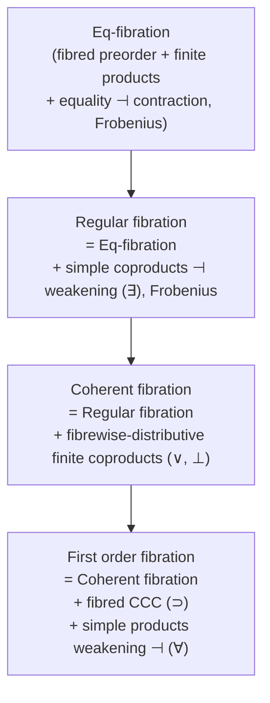

[[book-guidelines|↩ Back to guidelines]]

# First Order Predicate Logic

## Why equations aren't enough

[[Equational-Logic|Chapter 3]] built a whole categorical machine — Eq-fibrations, Lawvere's adjoint description of equality — but that machine could only ever say one kind of thing: *these two terms are equal*. You could derive `x + 2 =_N 5 ⊢ x =_N 3`, but you could not say "`x` is prime," "`x < y`," or "there exists a `y` bigger than `x`." Equality is a single, fixed binary relation baked into the type theory itself. Everything else — ordering, membership, reachability, divisibility, any relation you actually care about when specifying a program — is invisible to it.

Jacobs opens Chapter 4 by removing that restriction in the most economical way possible: keep the whole fibred machinery from Chapter 3 (contexts as objects of a base category, propositions as objects living in a fibre above them, structural rules as functors), and just enrich the *signature* with arbitrary predicate symbols, then add the standard connectives ($\wedge, \vee, \supset, \bot, \top$) and — the genuinely new ingredient — the quantifiers $\exists$ and $\forall$. If you've been thinking of type-checking and proof-checking as the same kind of judgment-shaped machine (a running thread in this project), this chapter is where that machine first needs to reason about *properties of data*, not just *definitional identity of terms* — which is exactly the move a refinement-type checker has to make going from "these two indices are the same" to "this index is within bounds."

The chapter's organizing bet, stated up front, is this: **every one of these logical operations is an adjoint functor.** Equality was a left adjoint to a contraction functor (Chapter 3). Now $\exists$ turns out to be a left adjoint, and $\forall$ a right adjoint, to a *weakening* functor. Once you see quantifiers this way, "regular," "coherent," and "first order" logic stop being an arbitrary hierarchy of feature-sets and become a hierarchy of increasingly rich adjoint structure a fibration can support.

## Signatures with predicate symbols

### What breaks without them

A many-typed signature $\Sigma = (T, \mathcal F)$ (Chapter 1–2) gives you types and *function* symbols $F : \sigma_1, \ldots, \sigma_n \to \sigma_{n+1}$. From these you can build terms, and from terms you can build equations $M =_\sigma M'$. But a function symbol can only ever produce a *value* — there's no syntactic slot for a symbol that produces a *proposition*, i.e. that classifies tuples of values without computing anything from them. `insert(n, l)` is a term of type `NList`; "`n` occurs in `l`" is not a term of any type — it's a yes/no fact about `n` and `l`, and STT has nowhere to put it.

### The formal fix

Jacobs' fix is a **signature with predicates**: a pair $(\Sigma, \Pi)$ where $\Pi$ assigns to every sequence of types $\sigma_1, \ldots, \sigma_n$ a *set* $\Pi(\sigma_1,\ldots,\sigma_n)$ of predicate symbols of that arity, written $P : \sigma_1, \ldots, \sigma_n$. Categorically this is nothing exotic — it's the same change-of-base trick used everywhere in the book:

$$
\begin{array}{ccc}
\mathbf{SignPred} & \longrightarrow & \mathrm{Fam}(\mathbf{Sets}) \\
\downarrow & & \downarrow \\
\mathbf{Sets} & \xrightarrow{\ \ } & \mathbf{Sets}
\end{array}
$$

A signature with predicates gives two new **atomic propositions**, alongside the equation $M =_\sigma M'$ already available:

$$
\frac{\Gamma \vdash M_1 : \sigma_1 \quad \cdots \quad \Gamma \vdash M_n : \sigma_n}{\Gamma \vdash P(M_1,\ldots,M_n) : \mathrm{Prop}} \quad (P : \sigma_1,\ldots,\sigma_n)
$$

Note the judgment form: `Prop` here is treated as a separate syntactic universe (this is *not yet* higher-order logic — `Prop` isn't a type you can quantify over, it's just the classifier used in formation rules; that step comes in [[book-guidelines|Chapter 5]]).

**[[Regular-and-Coherent-Categories#Grounding|Grounding]] (Rust).** A signature with predicates is exactly what you'd reach for if you were adding refinement predicates to a Rust-like IR: alongside `fn insert(n: Nat, l: NList) -> NList`, you declare an *uninterpreted relation symbol* `occurs(n: Nat, l: NList) -> Prop` with no body — just an arity, to be axiomatized or interpreted later. This is precisely the shape of an SMT-LIB `declare-fun` for a `Bool`-sorted symbol, or a Horn-clause relational predicate in a CHC solver: the symbol carries no computation, only a slot that axioms and interpretations get to fill in.

```rust
// A "signature with predicates" as data, the way a verifier front-end
// might represent it before elaboration into logical formulas.
enum Symbol {
    Function { name: String, arity: Vec<Type>, result: Type },
    Predicate { name: String, arity: Vec<Type> }, // no result type: classifies, doesn't compute
}
```

### The full sequent, and where the logics differ

With atomic propositions in hand, Jacobs allows the standard connectives $\bot, \top, \wedge, \vee, \supset$ and the two **quantifiers** $\forall x{:}\sigma.\varphi$ and $\exists x{:}\sigma.\varphi$ (binding $x$), and gives natural deduction rules for all of them over the now-familiar two-part sequent

$$
\Gamma \mid \varphi_1,\ldots,\varphi_n \vdash \psi
$$

— type context $\Gamma$ on the left of `|` (an object of the base category), proposition context on the right (an object of the fibre above $\Gamma$). This is the same notational commitment [[Equational-Logic|Chapter 3]] insisted on, now carrying quantifiers as well as equality.

Three named fragments matter for everything that follows, because each corresponds to a different *amount* of categorical structure a semantic domain needs to support:

| Fragment | Connectives allowed | Missing |
|---|---|---|
| **Regular logic** | $=, \wedge, \top, \exists$ | $\vee, \bot, \supset, \forall$ |
| **Coherent logic** | $=, \wedge, \top, \vee, \bot, \exists$ | $\supset, \forall$ |
| **Full first order logic** | all of the above, plus $\supset, \forall$ | — |

This is worth sitting with, because the reason for the split is not pedagogical simplification — it is that $\vee/\bot$ require a genuinely different piece of structure (fibred coproducts) than $\supset/\forall$ (fibred exponents and simple products), and *many important semantic models have one but not the other* (see the frame example below, which has $\vee$ but derives $\forall$/$\supset$ only because frames happen to be complete). Regular logic alone is already expressive enough for a large chunk of ordinary mathematics — Jacobs' example: "a ring $R$ is local" is expressible with only $=, \wedge, \exists, \vee$ (coherent, no $\forall$/$\supset$ needed at all).

**[[Simple-Type-Theory#Grounding|Grounding]] (Rust/CHC).** This hierarchy maps almost verbatim onto the fragments used in constrained Horn clause (CHC) solving: regular logic (no disjunction, no negation) is exactly the language of **definite Horn clauses**, the bread-and-butter target of CHC-based invariant synthesis (Spacer, Eldarica). Coherent logic adds disjunction — needed once you want to case-split on a predicate abstraction, but still no implication-in-the-goal or universal quantification in synthesized invariants. Only full first order logic needs the full apparatus (arbitrary $\forall$, nested $\supset$) that shows up in, say, a full weakest-precondition calculus with arbitrary nesting. If you are ever choosing *how expressive* to make an invariant-generation fragment, this is the same design fork Jacobs is naming here.

## Quantifiers as adjoints to weakening

This is the chapter's central idea, and it deserves to be built up slowly, because the payoff — "$\exists$ and $\forall$ are just adjoint functors" — sounds like a slogan until you see exactly which functor they're adjoint to and why that functor has to be *weakening specifically*.

### What breaks without the adjoint reformulation

The traditional natural-deduction rules for $\exists$ are an introduction and an elimination rule:

$$
\frac{\Gamma \vdash M{:}\sigma \quad \Gamma \mid \Theta \vdash \varphi[M/x]}{\Gamma \mid \Theta \vdash \exists x{:}\sigma.\varphi}
\qquad\qquad
\frac{\Gamma \mid \Theta \vdash \exists x{:}\sigma.\varphi \quad \Gamma,x{:}\sigma \mid \Theta,\varphi \vdash \chi}{\Gamma \mid \Theta \vdash \chi} \ (x \notin \Theta,\chi)
$$

These are perfectly good syntax, but they don't obviously *say* anything about a functor. To build a semantic model of predicate logic you need to know: given a fibration $p : \mathbb E \to \mathbb B$ interpreting types-as-objects-of-$\mathbb B$ and predicates-as-objects-of-fibres, what operation on $\mathbb E$ should interpret $\exists$? The introduction/elimination rules don't tell you directly — you have to reverse-engineer the universal property.

### Reformulating as a mate

Jacobs does this reverse-engineering explicitly (Lemma 4.1.8). The two $\exists$-rules above are *equivalent* to a single "double rule" — a **mate** — stated as a bijective correspondence between derivability judgments:

$$
\frac{\Gamma \mid \Theta, \exists x{:}\sigma.\varphi \vdash \psi}{\Gamma, x{:}\sigma \mid \Theta, \varphi \vdash \psi} \quad (\exists\text{-mate})
\qquad\qquad
\frac{\Gamma \mid \Theta \vdash \forall x{:}\sigma.\psi}{\Gamma, x{:}\sigma \mid \Theta \vdash \psi} \quad (\forall\text{-mate})
$$

Read top-to-bottom and bottom-to-top, each of these is a bijection between two derivability statements — which is precisely the shape of a **hom-set bijection witnessing an adjunction**. Concretely: consider the **weakening functor** $\pi^* : \Gamma\text{-predicates} \to (\Gamma,x{:}\sigma)\text{-predicates}$, which takes a proposition in context $\Gamma$ and just adds the unused hypothesis $x{:}\sigma$ (this is reindexing along the projection $\pi : \Gamma, x{:}\sigma \to \Gamma$, i.e. literally "weakening" in the structural-rules sense from Chapter 1). The mate rules say:

$$
\exists x{:}\sigma.(-) \ \dashv\ \pi^* \ \dashv\ \forall x{:}\sigma.(-)
$$

$\exists$ is **left adjoint** to weakening; $\forall$ is **right adjoint** to weakening. This is the same adjoint-triple shape as $[[\text{Equational-Logic}|\text{equality} \dashv \text{contraction}]]$ from Chapter 3 — the book keeps reusing exactly one pattern ("some derived logical operation is adjoint to a *structural* functor") for every connective in the language. Once you've internalized this pattern, the entire chapter (and much of the book) reads as an exercise in identifying which structural functor each new construct is adjoint to.

### Why weakening, specifically — and the empty-type trap

The chapter is explicit that this can't be sloppily generalized to reindexing along an *arbitrary* morphism $u : I \to J$ without extra hypotheses (Beck–Chevalley — more on this below); the base case that actually appears in the syntax is reindexing along **projections**, i.e. weakening. This matters because a subtlety about *empty types* lurks here. The **strengthening** rule

$$
\frac{\Gamma, x{:}\sigma \mid \varphi_1,\ldots,\varphi_n \vdash \psi}{\Gamma \mid \varphi_1,\ldots,\varphi_n \vdash \psi} \quad (x \text{ not free in the } \varphi_i, \psi)
$$

is *not* assumed as a general rule, precisely because it fails when $\sigma$'s interpretation is empty (Jacobs works a concrete derivation showing how skipping this restriction lets you "prove" $\vdash \exists x{:}\sigma. x =_\sigma x$ out of thin air by exploiting vacuous implications over an empty type). This is a genuinely important engineering fact, not a logician's fussiness: **any verifier that treats "the context has a variable of this type" as free information about non-emptiness is unsound the moment a refinement type like `{n : Nat | n < 0}` is inhabited by nothing.** Rust's own type system sidesteps this by having no empty *inhabited-looking* types matter to soundness (an empty `enum` genuinely proves unreachability), but a refinement-type elaborator adding predicates on top of existing types must track potential emptiness explicitly, or risk exactly this unsoundness. This is one of the sharper "what a formalism actually has to get right" moments in the chapter.

**Grounding (Lean).** This adjoint picture is *exactly* what a dependent-type kernel's context management is doing whenever it introduces or discharges a bound variable. In Lean, `Exists.intro` and `Exists.elim` correspond to unit/counit of this exact adjunction, and the "$x$ not free in..." side conditions in the classical rules are the same freshness condition Lean's kernel enforces when it checks that a metavariable's local context doesn't capture a variable being generalized over. If you've ever worked through why Lean's elaborator refuses to let a metavariable escape its scope, that's the same failure mode as trying to apply $\exists$-elimination when $x$ occurs free in the conclusion — both are "the weakening functor's counit doesn't typecheck against this context."

## Regular, coherent, and first order fibrations

Having pinned down exactly *which* categorical structure interprets each connective, Jacobs assembles three nested notions of fibration, each corresponding to one of the three logic fragments above:



Spelling out the definitions (4.2.1):

- **Regular fibration**: an Eq-fibration whose fibres have finite products (for $\top, \wedge$) *and* whose weakening functors have left adjoints satisfying Frobenius (for $\exists$).
- **Coherent fibration**: a regular fibration whose fibres additionally have finite coproducts ($\bot, \vee$) that are *fibrewise distributive* over the products — i.e. each fibre is a distributive lattice, not just a preorder with meets. Distributivity is exactly what licenses $\varphi \wedge (\psi \vee \chi) \dashv\vdash (\varphi\wedge\psi)\vee(\varphi\wedge\chi)$.
- **First order fibration**: a coherent fibration that is additionally a *fibred cartesian closed category* (for $\supset$) and whose weakening functors also have right adjoints (for $\forall$).

Every one of these fibrations is, by construction, a **preorder fibration** (its fibres are preorders, not general categories) — Jacobs calls this a *proof-irrelevance* model: $\varphi \vdash \psi$ records only that a proof exists, never *which* proof, in contrast to a Curry–Howard-style model where morphisms in the fibre would be actual proof terms $x{:}\varphi \vdash P{:}\psi$. This distinction matters directly for the elaborator project in view: a type-checker that must produce **proof terms** (a proof-relevant model, morphisms-as-derivations) is doing more work than one that only needs to decide **derivability** (a proof-irrelevance model, like the ones in this chapter) — the difference between an SMT-style decision procedure and a proof-producing kernel is precisely the difference between these two kinds of fibration.

### The syntactic (classifying) fibration, as the canonical example

The book's first, and most structurally important, example is the **classifying fibration** $\mathcal L(\Sigma,\Pi,A) \to \mathrm{Cl}(\Sigma)$ built directly from the syntax: objects of the total category are (context, proposition) pairs, morphisms are context maps under which the proposition is derivable using axioms $A$. Jacobs shows, essentially by unwinding the mate rules, that:

- adding just $=, \wedge, \top, \exists$ makes this fibration **regular** (weakening's left adjoint literally sends $\Gamma, x{:}\sigma \vdash \psi$ to $\Gamma \vdash \exists x{:}\sigma.\psi$ — the syntax and the semantics coincide by construction);
- adding $\vee, \bot$ makes it **coherent**;
- adding $\supset, \forall$ makes it **first order**.

This "the syntax models itself" phenomenon is not a triviality — it is the seed of the **internal language** construction below, and it is the categorical analogue of the trivial-but-load-bearing fact that a term elaborator's own typing judgment is a fixed point of [[Subset-Types-and-Quotient-Types#The rules|the rules]] it implements.

## Models of predicate logic

Jacobs' point in surveying five very different-looking models side by side is that **the fibred definitions above are genuinely uniform** — they don't just happen to work for sets, they work for anything with the right adjoint structure, however exotic.

### Set-theoretic models

A $(\Sigma,\Pi)$-**algebra** is what you'd expect: carrier sets $A_\sigma$, functions interpreting function symbols, and — new — a literal *subset* $\llbracket P\rrbracket \subseteq A_{\sigma_1}\times\cdots\times A_{\sigma_n}$ interpreting each predicate symbol. The induced first order fibration has base category of type-tuples and fibres $\mathcal P(A_{\sigma_1}\times\cdots\times A_{\sigma_n})$ (powersets, ordered by inclusion — a Boolean algebra, so classical logic and reductio ad absurdum come for free). Quantification along a projection is literally the set-theoretic formula you already know:

$$
\exists(X) = \{\vec x \mid \exists y.\ (\vec x, y) \in X\}, \qquad \forall(X) = \{\vec x \mid \forall y.\ (\vec x, y) \in X\}
$$

This is the model everyone already carries around informally; the chapter's job is showing it *is* an instance of the adjoint pattern, not an exception to it.

### Kripke models

A Kripke model replaces the single algebra with a **functor** $\mathcal K : I \to \mathbf{Alg}(\Sigma,\Pi)$ from a poset of "stages" (think: possible worlds, or increasing information states) into $(\Sigma,\Pi)$-algebras, monotone along $i \le j$. Truth of a proposition becomes a *monotone family of subsets*, one per stage, and crucially:

$$
\llbracket \Gamma \vdash \varphi \supset \psi\rrbracket(i) = \{\vec x \mid \forall j \ge i,\ \vec x^j \in \llbracket\varphi\rrbracket(j) \Rightarrow \vec x^j \in \llbracket\psi\rrbracket(j)\}
$$

— implication (and $\forall$) at stage $i$ quantifies over *all future stages* $j \ge i$. This is exactly why intuitionistic implication is *not* decidable by looking at the current state alone, and it is the semantic picture underlying every "must hold in all reachable future states" reading of a program property. The resulting fibre categories are Heyting algebras (not Boolean — no reductio ad absurdum in general), matching the fact that Kripke semantics is the standard completeness model for **intuitionistic**, not classical, predicate logic.

**Grounding (abstract interpretation / CHCs).** If you replace "possible world" with "program point reachable along some execution," a Kripke model is structurally the same object as a **transition-system-indexed family of reachable-state predicates** — which is exactly the semantic domain a CHC-based invariant generator or an abstract interpreter is computing a fixed point over. The "$\forall$ quantifies over future stages" clause above is the semantic ancestor of a **weakest-precondition** computation over an unbounded-depth transition relation: you can't decide $wp(\text{loop}, \varphi)$ by looking at one iteration, for the same reason you can't decide $\varphi \supset \psi$ at a Kripke stage $i$ by looking only at $i$.

### Order-theoretic (frame / locale) models — Tarski's topological semantics

For a **frame** $A$ (a poset with finite meets and *arbitrary* joins, distributing over meets — equivalently a complete Heyting algebra, e.g. the opens $\mathcal O(X)$ of a topological space), the family fibration $\mathrm{Fam}(A) \to \mathbf{Sets}$ is automatically **coherent** (finite meets/joins give $\wedge,\vee$; the *frame's own defining distributivity law* gives Frobenius for $\exists$, which is realized as arbitrary joins $\bigvee$), and in fact **first order**, since implication can be *defined* from the frame structure as a Heyting implication $a \supset b = \bigvee\{c \mid a \wedge c \le b\}$ — you get $\forall$ and $\supset$ for free once you have arbitrary meets and the adjunction machinery, rather than needing to postulate them. Specializing $A$ to $\mathcal O(X)$ for a topological space $X$ recovers **Tarski's 1930s interpretation** of constructive first order logic in open sets, where $\vee$ is union, $\wedge$ is intersection, and (crucially, since intersections of opens can fail to be open in the infinite case) $\forall$ is realized using the **interior** operator: $\mathrm{Int}\left(\bigcap_i U_i\right)$.

### Realisability models (Kleene)

Kleene's 1945 realisability reading treats a "proof" of $\varphi$ as *a natural number code for a partial recursive function witnessing $\varphi$* — this is the Brouwer–Heyting–Kolmogorov (BHK) interpretation made computational. Jacobs builds the set-indexed version: for a set $I$, a **non-standard predicate** $X \in (\mathcal{PN})^I$ assigns each $i \in I$ a *set of realizing codes*, and:

$$
n \Vdash (\varphi \wedge \psi) \iff n = \langle n_1,n_2\rangle,\ n_1 \Vdash \varphi,\ n_2 \Vdash \psi
\qquad
n \Vdash (\varphi \supset \psi) \iff \forall m.\ m \Vdash \varphi \Rightarrow (n\cdot m) \Vdash \psi
$$

The resulting fibration, $\mathrm{UFam}(\mathcal{PN}) \to \mathbf{Sets}$ (the "realisability fibration"), is a genuine first order fibration, but its ordering is **uniform, not pointwise** — $X \le Y$ means a *single* code realizes the implication *at every index*, not that each index has its own witness. This uniformity is what makes realisability models exhibit intuitionistic phenomena unavailable in Kripke or set models (it reappears prominently once the book builds the [[book-guidelines|effective topos]] out of exactly this fibration in Chapter 6).

**Grounding (proof-carrying code / proof terms).** Realisability is the cleanest bridge in the whole chapter between "logic" and "compiler engineering": a realizer *is* a proof term in executable form, and $n \Vdash \varphi$ is precisely the relation a proof-carrying-code system or a proof-term-producing tactic engine needs to check between a candidate certificate and the property it's supposed to certify. If your compiler's theorem prover is meant to emit *proof certificates* that a small trusted kernel can re-check (rather than trusting the prover itself), realisability semantics is the mathematical justification for treating "proof" as "data with a checkable relationship to the proposition," which is exactly the trusted-kernel architecture in the standing project.

### Recursive enumerability and cylindric algebra models

Two further examples round out the survey, both showing the fibred definitions absorb structures that don't obviously look like "logic" at all:

- **Recursively enumerable relations** on $\mathbb N^n$, ordered by inclusion, form a coherent fibration over a base category of partial recursive functions — a single-typed logic where the base category's objects $n \in \mathbb N$ literally *are* "$n$ term variables of one type." This is a direct model of decidability-flavored reasoning: an r.e. relation is exactly a semidecidable predicate, so this fibration is the semantic home of "provable-but-maybe-not-refutable" facts — the same asymmetry SMT solvers exploit when they can *confirm* satisfiability by finding a model but can only *conjecture* unsatisfiability via incompleteness of a decision procedure.
- **Cylindric algebras** (Tarski) algebraize first order logic *without* explicit contexts: a single Boolean algebra $A$ stands for "all propositions," with cylindrification operators $c_n$ standing in for $\exists v_n.(-)$ and diagonal elements $d_{n,m}$ standing in for $v_n =_\cdot v_m$. Jacobs reconstructs a genuine fibration from a cylindric algebra by taking $A(n) = \{x \in A \mid \forall m \ge n.\ c_m x = x\}$ as the fibre over $n \in \mathbb N$ (the "finitary part" depending only on the first $n$ variables) — a nice illustration that **the fibred/indexed formulation is strictly more informative** than the flat algebraic one, because it makes explicit *which* variables a proposition actually depends on, information the flat Boolean algebra erases. (The parking-area trick used to define simultaneous substitution $\delta^*$ from single-variable substitutions $s^k_i$ without variable capture is, not coincidentally, exactly the "gensym a fresh slot, substitute, rename back" trick every capture-avoiding substitution routine in a real compiler needs.)

## Internal language and internal logic of a fibration

This is the payoff of the whole chapter, and the reason Section 4.3 exists at all: once you know *any* fibration $p : \mathbb E \to \mathbb B$ satisfying the regular/coherent/first-order axioms, you can **read logic off the fibration itself**, without reference to any external syntax.

### The construction

For a fibration $p$, define $\mathrm{Sign}(\mathbb B)$ — objects of $\mathbb B$ become types, morphisms become function symbols — and extend it with predicates $\Pi(p)$: an object $X \in \mathbb E_{I_1\times\cdots\times I_n}$ *is* a predicate symbol of that arity. There is then a tautological model of this signature **in $p$ itself** (the identity functor, essentially), and Jacobs' **Theorem 4.3.6** shows this yields an *equivalence*: $p$ can be fully reconstructed, up to equivalence, from $(\mathrm{Sign}(\mathbb B), \Pi(p), \mathcal A(p))$ — its own internal signature plus the axioms $\mathcal A(p)$ recording which entailments already hold in $p$.

The practical upshot: you're licensed to write

$$
i : I \vdash X_i : \mathrm{Prop}
$$

for an arbitrary object $X \in \mathbb E_I$ — treating fibre-objects as ordinary predicates in ordinary notation — and to compute in this notation instead of doing raw categorical diagram chases. Jacobs calls this the **internal language** of $p$ (the signature-level vocabulary) and, once axioms are added, the **internal logic** of $p$ (everything derivable from what actually holds in $p$).

### What this buys you, concretely

Example 4.3.7 is the clearest demonstration. In a merely *regular* fibration you only know weakening functors $\pi^*$ (along projections) have left adjoints. Working in the internal language, Jacobs *derives* that **every** reindexing functor $u^*$, for arbitrary $u : I \to J$, has a left adjoint:

$$
\coprod\nolimits_u(X) \;=\; \big(j{:}J \vdash \exists i{:}I.\ (u(i) =_J j \wedge X_i) : \mathrm{Prop}\big)
$$

— i.e. **existential quantification along an arbitrary morphism is definable from existential quantification along projections plus equality**, once you're inside the internal logic where you can just write the formula down. This is a genuine theorem (later named: it makes $p$ an **opfibration**, Section 9.1), but proving it by raw adjoint-functor manipulation would be considerably more painful than writing one line of first order logic and checking the mate correspondence. Note also the caveat Jacobs is careful to flag: this general $\coprod_u$ need **not** satisfy Beck–Chevalley (that's an *external* fact about pullbacks in $\mathbb B$, invisible to the internal logic) — a sharp reminder that "definable in the internal language" and "well-behaved under substitution" are different properties, and conflating them is a classic source of unsoundness in a fibred-semantics-based verifier.

The same internal-language technique builds the categories $\mathrm{Rel}(p)$ of relations (objects of $\mathbb B$, morphisms are equivalence classes of predicates $R : I \times J \to \mathrm{Prop}$ under the internal preorder, [[Fibred-Category-Theory#Composition|composition]] given by the informal-looking but perfectly rigorous $\exists j.\, R(i,j)\wedge S(j,k)$) and $\mathrm{FRel}(p)$ of *functional* relations (single-valued + total, stated as two internal sequents) — and defines **internal injectivity/surjectivity** of a base morphism $u$ purely logically:

$$
u \text{ internally injective} \iff i,i' \mid u(i)=_J u(i') \vdash i=_I i'
\qquad
u \text{ internally surjective} \iff j \mid {} \vdash \exists i.\, u(i)=_J j
$$

A subtlety worth keeping: internal existence ($\exists i.\,X_i$ holds) is *strictly weaker* than external existence (some specific global element witnesses $X$) in general — the frame example makes this vivid: $\exists i{:}I.\,X_i$ holding just means $\bigvee_i X_i = \top$ in the frame, which does not require any single $X_{i_0}$ to itself equal $\top$. This is the fibred-logic version of the classical constructive-vs-classical gap around the Axiom of Choice, revisited later (Section 4.5, 4.9) in exactly that connection.

**Grounding (Lean / elaborator design).** "Internal language of a fibration" is the categorical semantics precisely underlying what it means for a type checker's *own metatheory* to be expressible *in* the object language it checks — the same self-hosting phenomenon that lets Lean's kernel be (mostly) specified in terms of judgments it can itself represent as propositions. More concretely for the compiler project: once your refinement-type checker's verification-condition generator is emitting first order formulas over some background theory, *that background theory itself* is playing the role of $p$'s base category $\mathbb B$, and the VCs you emit are literally objects "read off" the internal language of whatever semantic fibration your theory induces (a regular fibration if you stick to $=,\wedge,\exists$-shaped VCs — as most Horn-clause-style tools do — a first order one if you need full $\forall/\supset$ nesting).

## Soundness, completeness, and functorial semantics

The last piece ties syntax back to semantics in the Lawvere style already familiar from Chapters 2–3. A **morphism of regular/coherent/first order fibrations** is a fibration morphism preserving exactly the structure named by the fragment (simple coproducts; additionally distributive fibred coproducts; additionally exponents and simple products). A **model** of a specification $(\Sigma,\Pi,A)$ in a fibration $p$ is then just such a structure-preserving morphism out of the classifying fibration:

$$
\mathcal L(\Sigma,\Pi,A) \xrightarrow{(M,\mathcal N)} \mathbb E \quad \text{over} \quad \mathrm{Cl}(\Sigma) \xrightarrow{M} \mathbb B
$$

**Soundness** (Lemma 4.3.3) says every sequent derivable from $A$ holds in every such model. **Completeness** (Lemma 4.3.4) says the converse holds for the single canonical **generic model** — the identity morphism out of the classifying fibration into itself. This soundness/completeness pairing, plus the reconstruction theorem (4.3.6) discussed above, is what licenses treating "build a model" and "prove derivability in the internal logic" as interchangeable activities — precisely the equivalence a compiler's elaborator relies on when it discharges a proof obligation by handing it to an external solver (a *model-theoretic* check) instead of constructing an explicit derivation (a *proof-theoretic* one), and then trusts that the solver's answer is exactly as good as a syntactic proof would have been.

## Where this leads

This chapter's three sections (4.1–4.3) are the skeleton; the rest of Chapter 4 (Sections 4.4–4.9, covered separately under [[book-guidelines|Regular and Coherent Categories]] and [[book-guidelines|Subset Types and Quotient Types]]) specializes everything here to the single most important class of examples — **subobject fibrations** $\mathrm{Sub}(\mathbb B) \to \mathbb B$ — and shows that a category $\mathbb B$ being *regular* or *coherent* (in the classical algebraic-geometry/logic sense of those words) is exactly the base-category shadow of its subobject fibration being a regular/coherent fibration in *this* chapter's sense. Everything about images, covers, and the mono-cover factorization system in the next topic is this chapter's adjoint machinery specialized to $X = $ "subobjects of $I$."

Further out: **Chapter 5** repeats this entire pattern one level up, adding a type `Prop` of propositions so you can quantify *over* predicates themselves (needing "generic objects" to make sense of `Prop` internally) — [[Higher-Order-Predicate-Logic|higher order predicate logic]] is, structurally, "do everything in this chapter, but make the classifier itself a first-class citizen of the base category." And the realisability fibration $\mathrm{UFam}(\mathcal{PN})$ built here as one example among several becomes, in **Chapter 6**, the literal construction material for Hyland's effective topos — the "uniform, not pointwise" ordering flagged above is exactly the phenomenon that gives [[The-Effective-Topos|the effective topos]] its distinctive recursion-theoretic flavor.

For the standing compiler/elaborator project specifically: this chapter is the direct theoretical ancestor of (a) any Horn-clause or first order fragment your verification-condition generator targets — regular logic is definite Horn clauses, coherent logic is where case-splitting invariants live; (b) the "quantifier elimination along weakening" pattern used whenever your elaborator has to eliminate an existentially-introduced metavariable or generalize a universally-quantified one back out of a local context; and (c) the internal-language technique itself, which is the precise justification for why a checker built on adjoint structure can be reasoned about using ordinary first order notation instead of raw category theory — exactly the abstraction gap your own kernel-vs-elaborator boundary needs to manage.
