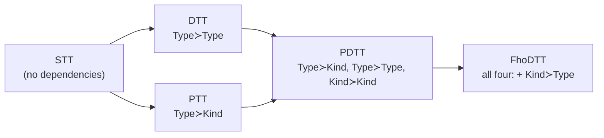
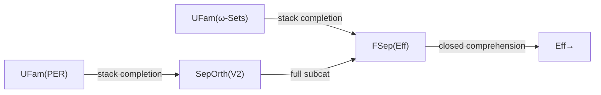

[[book-guidelines|↩ Back to guidelines]]

This is the book's capstone chapter, and it earns the label. Everything from [[Simple-Type-Theory]] through [[Polymorphic-Dependent-Type-Theory]] and [[Strength-of-Sum-and-Equality-Types]] was building toward a single question: what happens when you let *every* kind of dependency a type theory can have happen *at once*? The answer is the Calculus of Constructions (CoC) — Coquand and Huet's system, and the direct theoretical ancestor of the kernels inside Coq, Lean, and Agda. It is also, in its most naive form, inconsistent. This article is about exactly where that inconsistency lives, why it's so easy to fall into, and how the categorical semantics of the chapter draws a fence around it — a fence that every real dependently-typed kernel, including the one implicit in the learning-goals project behind this vault, still has to respect today.

## 1. A classification device: who depends on whom

Before naming FhoDTT, the book introduces a single organizing relation that lets you place STT, DTT, PTT, and PDTT (all already covered) on one chart, and then shows that FhoDTT is simply "all four boxes checked."

### The dependency relation

Take a type theory with (at least) two syntactic universes/sorts, e.g. $\mathrm{Type}$ (the sort of ordinary types — think `enum`, `struct`) and $\mathrm{Kind}$ (the sort of *type constructors* — things like `Vec` before you apply it to an element type, or `Type -> Type` in Rust-generics terms). Jacobs' Definition 11.5.1:

$$s_2 \succ s_1 \iff \text{there are well-formed } A : s_1,\ B(x) : s_2 \text{ with } x:A \text{ free in } B$$

Read $s_2 \succ s_1$ as "$s_2$ depends on $s_1$," or equivalently "there is an $s_1$-indexed family of $s_2$'s": $(B(x):s_2)_{x:A}$, for $A:s_1$.

This is a genuinely useful lens because it's exactly the same shape as *fibration* in category theory: $s_2 \succ s_1$ means the collection of $s_2$-things sits fibred over the collection of $s_1$-things, indexed by terms of $s_1$-sort. Every dependency in the type theory literally becomes an indexing/fibration in the semantics — that correspondence is the reason the whole book can talk about type theories through [[Fibred-Category-Theory|fibred category theory]] in the first place.

### The four possible dependencies, and what each one buys you

With two sorts $\mathrm{Type}, \mathrm{Kind}$, there are exactly four dependencies you could have:

| dependency | reading | typical example |
|---|---|---|
| $\mathrm{Type}\succ\mathrm{Kind}$ | types indexed by kinds | $(\lambda\alpha{:}\mathrm{Kind}.\alpha)_{\alpha:\mathrm{Kind}} : \mathrm{Type}$ — polymorphism: a type depending on which type-constructor you plug in |
| $\mathrm{Type}\succ\mathrm{Type}$ | types indexed by ordinary terms | $\mathrm{NatList}(n):\mathrm{Type}$ for $n:\mathbb{N}$ — the textbook dependent type |
| $\mathrm{Kind}\succ\mathrm{Kind}$ | kinds indexed by kinds | higher-kinded polymorphism, e.g. `F<G>` where `G` is itself generic |
| $\mathrm{Kind}\succ\mathrm{Type}$ | kinds indexed by ordinary terms | a *type constructor* whose shape depends on a runtime value — e.g. "the set of derivation-steps of proof $p$," `steps(p)` |

Figure 11.1's table then reads off as a lattice of escalating type theories:

- **STT** (Simple Type Theory): no dependencies at all — this is your ordinary Rust `enum`/`struct` world, no generics, no dependent indexing.
- **DTT** (Dependent Type Theory): adds $\mathrm{Type}\succ\mathrm{Type}$ — types depending on terms. This is where refinement types and `NatList(n)`-style indexed families live.
- **PTT** ([[Polymorphic-Type-Theory|Polymorphic Type Theory]], System F): adds $\mathrm{Type}\succ\mathrm{Kind}$ — types depending on kinds, i.e. `fn identity<T>(x: T) -> T`.
- **PDTT** (Polymorphic Dependent Type Theory, covered already in [[Polymorphic-Dependent-Type-Theory]]): combines the first three — $\mathrm{Type}\succ\mathrm{Kind}$, $\mathrm{Type}\succ\mathrm{Type}$, and $\mathrm{Kind}\succ\mathrm{Kind}$ — but crucially keeps kind-contexts and type-contexts *separate*. Kinds still never depend on terms.
- **FhoDTT** (Full Higher Order Dependent Type Theory): adds the fourth box, $\mathrm{Kind}\succ\mathrm{Type}$ — kinds depending on terms. This is the Calculus of Constructions.

The table earns its keep again when the book revisits weak/strong/very-strong sums from [[Strength-of-Sum-and-Equality-Types]]: recall that a *strong* $(s_1,s_2)$-sum needs the eliminated variable $z:\Sigma x{:}C.D$ to be allowed to appear in the motive $B:s_2$ — i.e. it needs $s_2\succ s_2$ — and a *very strong* one additionally needs $B$ of sort $s_1$, requiring $s_1\succ s_2$ too. The dependency vocabulary turns "is this strong or very strong?" into "which box of the table is checked" — a purely combinatorial question about which dependencies your theory has. That combinatorial framing is precisely what will let Girard's paradox be diagnosed as "this one specific box got checked that shouldn't have."

## 2. Why the fourth dependency is dangerous

Here is the intuitive crux, before any symbols: $\mathrm{Kind}\succ\mathrm{Type}$ means "a type-constructor can be built by case-analysis on an ordinary value." Combined with $\mathrm{Type}\succ\mathrm{Kind}$ (already present since PTT — "an ordinary type can quantify over all type-constructors"), you get a **cycle**: kinds can be built from types, and types can be built from (all) kinds. Once both directions of that arrow exist, you have the type-theoretic version of a set that can contain itself, or a set of all sets — and that is exactly the family of paradoxes Russell, Cantor, and Mirimanoff spent careers on.

Concretely, FhoDTT's four sum/product formation rules are:

$$
\Pi x{:}C.D \ (C,D:\mathrm{Type}/\mathrm{Kind}), \qquad
\Sigma x{:}C.D \text{ for } (C,D) \in \{(\mathrm{Kind},\mathrm{Type}), (\mathrm{Type},\mathrm{Type}), (\mathrm{Type},\mathrm{Kind}), (\mathrm{Kind},\mathrm{Kind})\}
$$

Three of the four sum-flavors — (Type,Type), (Type,Kind), (Kind,Kind) — are taken to be *very strong* without incident (indeed for these two, strong and very strong coincide). The fourth, **(Kind,Type)-sums** — a *type* built by packaging up a *kind* together with a term inhabiting it — is the one the book deliberately keeps merely **strong**, not very strong, and flags this as load-bearing:

> "having very strong (Kind,Type)-sums has some detrimental effects... it results in an equivalence of types and kinds. This effectively gives us a type theory with a type of all types (Type : Type)... The result is known as 'Girard's paradox'."

### Walking through the shape of the paradox (à la Mirimanoff)

The book relegates the actual construction to Exercise 11.5.3, but it's worth walking through slowly, because the shape is genuinely illuminating — it's the type-theoretic double of a classical set-theoretic argument.

**Classical version first.** Mirimanoff asked: is there a set $\Omega$ of *all well-founded sets*? If $\Omega$ existed, you could ask whether $\Omega$ itself is well-founded — but $\Omega \in \Omega$ would have to hold (since $\Omega$ is well-founded, hence in $\Omega$), which immediately breaks well-foundedness. There is no way to have "the set of all well-founded sets" as a well-founded set itself. This is a cousin of Russell's paradox and one of the reasons ZFC has a separation axiom rather than unrestricted comprehension.

**Type-theoretic mimicry.** Define, inside FhoDTT with very strong (Kind,Type)-sums:

$$
Q \;=\; \Sigma\alpha{:}\mathrm{Type}.\ \Sigma{<}{:}\alpha\to\alpha\to\mathrm{Type}.\ \mathrm{WF}(\alpha,{<})
$$

Read this as: "$Q$ is the type of triples (a type $\alpha$, an ordering $<$ on $\alpha$, a proof that $<$ is well-founded)." $Q$ is meant to be the type-theoretic analogue of "the collection of all well-founded ordered types." $\mathrm{WF}(\alpha,{<})$ itself is defined by an impredicative encoding over $\mathrm{Type}$ (quantifying over *all* predicates $p:\alpha\to\mathrm{Type}$) — the standard Leibniz-style encoding of "no infinite descending chain," using $\bot = (\Pi\alpha{:}\mathrm{Type}.\alpha):\mathrm{Type}$ for falsum.

Now — and this is the step that needs the dangerous sum — you build an ordering $\lhd$ **on $Q$ itself**: $u \lhd v$ says "the well-founded type packaged in $u$ embeds, order-preservingly, into a proper initial segment of the one packaged in $v$." Defining $u \lhd v : \mathrm{Type}$ requires *unpacking* $u$ and $v$ — i.e. eliminating a $\Sigma$ whose first component has sort $\mathrm{Type}$ — to produce a result of sort $\mathrm{Type}$. Since $u,v : Q$ and $Q$'s outer sum has $\mathrm{Kind}$ over which the whole triple is packaged... the elimination motive is $\mathrm{Type}$-sorted while the eliminated sort chain runs through $\mathrm{Kind}$. This is *exactly* the shape of a very strong $(\mathrm{Kind},\mathrm{Type})$-sum elimination: you need to eliminate against a motive of the "wrong" sort relative to what a merely-strong sum permits.

Once $\lhd$ is definable, the trap springs the same way Mirimanoff's does:

1. You can prove $Q$ itself, ordered by $\lhd$, is well-founded — producing a proof term $q_\Omega : \mathrm{WF}(Q,\lhd)$. So $\Omega := (Q,(\lhd,q_\Omega))$ is a legitimate inhabitant of $Q$.
2. But then $\Omega$ packages a well-founded type that itself contains $\Omega$ as an element indexed below itself — you can construct a term $r : \Omega \lhd \Omega$ (the self-referential embedding, the same move as $\Omega \in \Omega$ classically).
3. $\mathrm{WF}$ was defined precisely to reject any element that is $\lhd$-below itself. So from $q_\Omega$ and $r$ you mechanically derive a term $s : \bot$ — a proof of falsum, from no assumptions.

That is Girard's paradox. The type theory doesn't literally become *inconsistent* in the sense of proving $0=1$ arithmetically in a useless way — worse, it proves **every proposition is inhabited**, because from $\bot$ you get anything via $\bot$'s own elimination rule. Under the propositions-as-types reading central to this whole book (recall [[Propositions-as-Types]]), a type theory where every type is inhabited is not just "wrong," it's *useless as a logic*: every claim has a proof, so proof no longer means anything.

**What breaks without the restriction.** If you don't keep (Kind,Type)-sums merely strong, you cannot write down a type theory that both (a) has kinds depending on types (needed for the propositions-as-types view of "sets of proofs," among other legitimately useful things) and (b) is safe to use for proving theorems. The strong/very-strong line is not a technicality — it is *the* dividing line between "expressive enough to be interesting" and "expressive enough to prove False."

### The fibred reflection: how the danger is fenced off, not eliminated

The remarkable thing is that FhoDTT does not forbid kinds-depending-on-types wholesale — it keeps the useful direction (Proposition 11.5.2–11.5.3) while blocking the collapse. With a unit kind $1_K$ and **weak** $(\mathrm{Type},\mathrm{Kind})$-sums, there is a functor from types to kinds,

$$
\mathcal{I}: \mathbb{T} \to \mathbb{K}, \qquad (\Gamma \vdash \sigma:\mathrm{Type}) \mapsto (\Gamma \vdash \Sigma x{:}\sigma.1_K : \mathrm{Kind})
$$

("view a type as the trivial kind built from it"). If the $(\mathrm{Type},\mathrm{Kind})$-sums are **very strong**, $\mathcal{I}$ becomes full and faithful. And with **very strong** $(\mathrm{Type},\mathrm{Kind})$-sums together with only **weak** $(\mathrm{Kind},\mathrm{Type})$-sums, Proposition 11.5.3 produces a genuine adjunction — a **fibred reflection**

$$
\mathcal{I} \dashv \mathcal{R} : \mathbb{K} \to \mathbb{T}
$$

with $\mathcal{I}$ full and faithful, embedding types as a reflective subcategory of kinds. This is precisely the "unit type + subset-like coercion" pattern from [[Strength-of-Sum-and-Equality-Types]] and [[Subset-Types-and-Quotient-Types]], now happening one level up, between the universes themselves rather than within one universe.

Corollary 11.5.4 states the punchline explicitly: **if you strengthen the (Kind,Type)-sums to very strong as well**, the reflection's right adjoint $\mathcal{R}$ becomes full and faithful too, and $\mathcal{I}\dashv\mathcal{R}$ collapses into an *equivalence* $\mathbb{T}\simeq\mathbb{K}$ — types and kinds become the same thing, i.e. $\mathrm{Type}:\mathrm{Type}$, which is exactly the closure model of the previous chapter and exactly the situation Girard's paradox exploits. So the entire safety argument of FhoDTT comes down to a single asymmetry: **which side of the (Kind,Type)-sum gets to be "very strong."** Type-over-Kind: very strong, safe, gives you the useful embedding. Kind-over-Type: only strong, and that one restriction is the whole firewall.

## 3. FhoDTT, categorically: closed comprehension category + reflection + generic object

Section 11.6 turns this syntax into fibred category theory. Because kinds now depend on types, FhoDTT (unlike PDTT) cannot use *two* base categories of contexts (one for kind-contexts, one for type-contexts, as PDTT does) — there is a single base category $\mathbb{B}$ of mixed type-and-kind contexts, over which both fibrations of kinds and types live.

### The definition

**Weak FhoDTT-structure** (Definition 11.6.1) is a diagram

$$
\mathbb{D} \underset{\mathcal{X}}{\overset{\mathcal{R}}{\rightleftarrows}} \mathbb{E} \xrightarrow{\ \mathcal{P}\ } \mathbb{B}^\to
$$

where:
- $\mathcal{P}:\mathbb{E}\to\mathbb{B}^\to$ is a **closed comprehension category of kinds** ("closed" recall from [[Standard-Fibrations-Used-Throughout-the-Book]] means it supports strong sums/products internally — this is the categorical translation of "(very) strong (Kind,Kind)-sums exist");
- $q = \mathrm{cod}\circ\mathcal{P}\circ\mathcal{X}$ is a fibration of *types*, and $\mathcal{X}\dashv\mathcal{R}$ (equivalently $\mathbb{D} \rightleftarrows \mathbb{E}$) is a **fibred reflection** of types-in-kinds — the direct categorical incarnation of Proposition 11.5.3's $\mathcal{I}\dashv\mathcal{R}$;
- there is a generic object $\Omega\in\mathbb{E}$ over the terminal object of $\mathbb{B}$, giving $q$ a generic object over $\{\Omega\}$ (recall generic objects from the higher-order predicate logic material — this is what lets $\mathrm{Prop}$/$\mathrm{Type}$ itself be classified as an object, not just a meta-level sort).

The reflection alone already forces the four coproduct flavors to exist (via Lemma 9.3.9's "products/coproducts transport along a reflector"): (very) strong (Kind,Kind)-sums come free from $\mathcal{P}$ being closed; strong (Type,Kind)-sums come from $q$-projections coinciding with $\mathcal{P}$-projections; weak (Kind,Type)- and weak (Type,Type)-sums come from the reflection itself. Note the asymmetry survives at the categorical level too — only a **strong FhoDTT-structure** (Definition 11.6.2) additionally requires the *types* comprehension category $\mathcal{Q}=\mathcal{P}\mathcal{X}$ to be closed, i.e. requires the (Type,Type)- and (Kind,Type)-sums to actually be strong rather than merely weak.

### What breaks without closedness on the types side

If $\mathcal{Q}$ is not closed, you're in the "weak FhoDTT" regime — types are closed under weak $\Sigma$ but you cannot eliminate against a motive that mentions the packaged variable. This is not a corner case: the book's own **Example 11.6.7 (ExPERs over $\omega$-Sets)** is a real, useful model that lands exactly here, and it fails to be strong for a genuinely deep reason (Streicher's counterexample, walked through below) — not because anyone chose weakness for safety, but because the model's own extensionality requirement makes strong elimination structurally unavailable. This is a good early warning that "strong" is a substantive semantic property, not a free upgrade you can always assume.

### Degenerate models, as cautionary bookends

Two examples show what happens at either extreme:

- **[[Toposes|Toposes]]** (Example 11.6.3): take $\mathbb{B}$ a topos, use the fibred reflection $\mathrm{Sub}(\mathbb{B})\rightleftarrows \mathbb{B}^\to$ from regular-epi/mono factorization. This gives a genuine FhoDTT-structure, but a *degenerate* one: the fibration of types is a **poset** — between any two types there's at most one map. All proof-relevant structure collapses to provability. This is the "logic, no programs" extreme.
- **Closures** (Example 11.6.4, recalling the closure model from the previous chapter): the closed comprehension category of closure-indexed-closures has a universal closure $\Omega$ that is its own generic object — literally $\mathrm{Type}:\mathrm{Type}$, with types = kinds. This is the "programs, no safety" extreme: Girard's paradox applies directly, every type is inhabited.

FhoDTT proper sits strictly between these: neither trivialized to provability, nor collapsed to inconsistency.

### The realizability models

Three examples build directly on [[Realizability-Models-Omega-Sets-and-PERs]] and [[The-Effective-Topos]]:

1. **PERs over $\omega$-Sets** (11.6.5): the reflection $\mathrm{PER}\rightleftarrows\omega\text{-}\mathbf{Sets}$ you already know lifts fibredly to $\mathrm{UFam}(\mathrm{PER})\rightleftarrows\mathrm{UFam}(\omega\text{-}\mathbf{Sets})$ over $\omega\text{-}\mathbf{Sets}$. Kinds = $\omega$-set-indexed families of $\omega$-sets; types = $\omega$-set-indexed families of PERs. The generic object is literally the *set of all PERs* as an object of $\omega\text{-}\mathbf{Sets}$. This is a genuine **strong** FhoDTT-structure.
2. **PERs over $\mathbf{Eff}$** (11.6.6): the same reflection lifts over the effective topos instead, giving another strong FhoDTT-structure — this is the one Section 11.7 zooms in on.
3. **ExPERs over $\omega$-Sets** (11.6.7): restrict to *extensional* PERs (those where the canonical map into $N_\perp^{N_\perp}$ is a regular mono — intuitively, "equality of realized elements is externally observable"). Streicher's counterexample shows the coproduct of a family of ExPERs need not itself be extensional: it constructs two distinct functions $g_1, g_2$ in the coproduct $\omega$-set that no morphism into $N_\perp$ can distinguish, using the **Myhill–Shepherdson theorem** (effective operations are continuous) to force a contradiction if you assumed strength. So ExPERs give a *bona fide weak* FhoDTT-structure — proof that "weak" isn't a lesser cousin invented for [[Realizability-Models-Omega-Sets-and-PERs#The definition|the definition]] to be complete; it's forced by real mathematics.

### Theorem 11.6.9: types-in-a-weak-FhoDTT-structure is a full internal category

This is the structural payoff of the section. For $q:\mathbb{D}\to\mathbb{B}$ the fibration of types in *any* weak FhoDTT-structure:

- **(i)** $q$ is a **fibred CCC** (Cartesian closed — products from the $\Pi$'s, exponentials from the closed comprehension structure) and hence, by earlier results on comprehension categories, **locally small**.
- **(ii)** $q$ is a **full small fibration**: it is the *externalisation* of an actual internal category $\mathcal{C} = \mathrm{Full}(U)$ living inside $\mathbb{B}$ itself, where $U$ is the generic object. "Full" means the embedding $\mathrm{Fam}(\mathcal{C}) = \mathbb{D}\to\mathbb{B}^\to$ is full and faithful — no artificial identifications, the internal category really does capture the whole fibration.

In plain terms: once you have a FhoDTT-structure, the whole tower of "types indexed by contexts" can be repackaged as one small internal category object living inside your base category. This is a strict generalization of how a topos's subobject-classifier $\Omega$ gives you an internal *preorder* of propositions — here you get a proper internal *category* of types, with real morphisms (proof-relevant programs), not just a provability order.

### Theorem 11.6.10: completeness of that internal category ⟺ existence of the reflector

This is the "fibred adjoint functor theorem" result, and it's the technical heart connecting FhoDTT-structures to ordinary category theory. Let $\mathbb{B}$ be locally Cartesian closed (LCCC) containing a full internal category $\mathcal{C}$, with $\mathcal{I}:\mathrm{Fam}(\mathcal{C})\to\mathbb{B}^\to$ full and faithful. Then:

$$
\mathcal{I} \text{ has a fibred left adjoint} \iff \mathcal{C} \text{ is a small complete category in } \mathbb{B} \text{ and } \mathcal{I} \text{ is continuous.}
$$

The forward direction (reflection $\Rightarrow$ complete) is easy: the codomain fibration of an LCCC is always complete, and a reflection transports that completeness down onto $\mathcal{C}$. The hard direction — completeness $\Rightarrow$ reflector exists — is a genuine adjoint-functor-theorem construction, done here in explicit type-theoretic notation: build a *weak* left adjoint using the internal products $\Pi$ (the standard "define a coproduct using an end/limit formula" trick), then upgrade weak-adjoint to real adjoint using **equalizer types** $E(M_1,M_2)$ — the same "turn a weak initial object into a real one via equalizers" move used classically (Mac Lane V.6). Concretely this is what lets you go from "for every kind $A$ I *can* find *some* type $\mathcal{R}(A)$ satisfying the universal property up to non-uniqueness" to "there is a functorial choice $\mathcal{R}$ with genuine naturality" — precisely the gap between a weak product and an honest categorical product mentioned in Section 11.7 below.

The upshot: for a FhoDTT-structure of this codomain-fibration-of-kinds shape, "does the reflection $\mathcal{I}\dashv\mathcal{R}$ exist" and "is the internal category of types complete" are **the same question**. This reframes the whole enterprise of building models of FhoDTT as: find a base category, put a small internal category of types in it, and check completeness. If it's complete, the FhoDTT structure (with its safety-critical reflection) falls out automatically.

## 4. Completeness of PERs in $\mathbf{Eff}$: the capstone result

Section 11.7 asks the obvious follow-up question about the *specific* model everyone actually cares about: is the internal category of PERs in the effective topos $\mathbf{Eff}$ (recall [[The-Effective-Topos]]) complete, in the sense Theorem 11.6.10 needs?

**No** — and the reason is instructive. The Beck–Chevalley condition fails for the product functor $\Pi_F$ (right adjoint to reindexing along an arbitrary map $F$ in $\mathbf{Eff}$); there's a genuine counterexample. So PERs-over-$\mathbf{Eff}$ do **not** form a full FhoDTT-structure with kinds also interpreted as families-of-PERs — you don't get honest completeness "on the nose." (They *do* still give a working FhoDTT model when kinds are instead interpreted as families of plain $\omega$-sets, per Example 11.6.6 — the failure is specifically about self-indexing PERs over PERs, not about the model being useless.)

What you get instead is **weak completeness** — and pinning down exactly what that phrase buys you, without invoking the Axiom of Choice, is the whole payoff of the chapter.

### Weak completeness via stacks

A **stack** (w.r.t. the regular-epi topology — recall every epi in a topos is regular) is a subfibration $\mathcal{V}/\mathbb{B} \subseteq \mathbb{B}^\to$ (a collection of "display maps" closed under pullback) such that objects glue along epis exactly like sheaves glue along covers, but now with *categories* as fibers instead of sets — Definition 11.7.1: for a pullback square along a regular epi $u:J\twoheadrightarrow I$, $\varphi \in \mathcal{V}$ over $I$ iff $u^*(\varphi)\in\mathcal{V}$. The **stack completion** $\bar{\mathcal V}$ freely closes $\mathcal V$ under this gluing.

**Definition 11.7.2**: $\mathcal{V}/\mathbb{B}$ is **weakly complete** if its stack completion $\bar{\mathcal{V}}$ is an (ordinarily) complete fibration.

The book is explicit about what's actually being relaxed here, and it's worth sitting with the analogy: ordinary completeness says "there is a right adjoint to the diagonal functor" — an *external*, functorial, uniformly-chosen limit. Weak completeness says "in the internal language, for every diagram, *some* limiting cone exists" — but the choice of which cone, indexed continuously over varying base points, is only guaranteed *locally*, after passing to a cover. Going from the internal/local statement to the external/global one is precisely where the Axiom of Choice would be invoked in an ordinary (Boolean, classical) setting — and inside a topos like $\mathbf{Eff}$, choice can and does fail. **Weak completeness is exactly what internal, choice-free reasoning can still deliver you.** This is genuinely different from ordinary completeness failing to hold *at all*: it's completeness holding, but only after you're willing to work up to (and be honest about) a covering refinement — a distinctly constructive substitute for a classical theorem.

### Orthogonality and Freyd's characterization

The key technical device connecting "orthogonal to $V2$" (where $V2\in\mathbf{Eff}$ is the image of the two-element set) to "is a genuine PER":

**Definition 11.7.7.** $X$ is **orthogonal** to $A$ if every morphism $A\to X$ is constant — formally, the canonical map $X \to (A\Rightarrow X)$ is an isomorphism.

**Proposition 11.7.8 (Freyd).** An $\omega$-set $(I,E)\in\mathbf{Eff}$ is a **modest set** (i.e. isomorphic to one coming from a PER) **iff it is orthogonal to $V2$**.

The proof is short and worth internalizing because it's the crux fact making everything downstream work: modest sets have "at most one witness per element" (that's exactly what a PER's equivalence classes give you), and a map out of $V2$ into something with at-most-one-witness-per-class is forced to send both elements of $2$ to codes realizing the *same* class — because the tracking realizer for the map has to work uniformly on a code that could denote either $0$ or $1$. So "orthogonal to $V2$" is the *external, purely categorical* way of saying "no genuine binary case-split survives" — which is precisely the PER discipline (identify realizers up to the partial equivalence) stated without any reference to codes or realizers at all. It's the same "connectivity" flavor as a topological space being connected iff every map from it to the discrete two-point space is constant — hence the book's remark about a "formal resemblance with connectivity."

### The two main theorems

**Theorem 11.7.6.** $\mathrm{UFam}(\omega\text{-}\mathbf{Sets})/\mathbf{Eff}$ is weakly complete, with stack completion equal to $\mathrm{FSep}(\mathbf{Eff})$ — the fibration of **separated families** for [[Nuclei-Separated-Objects-and-Sheaves#The double-negation nucleus|the double-negation nucleus]] $\neg\neg$ (recall separated objects $\simeq \omega$-Sets from [[The-Effective-Topos]]'s Theorem 6.2.8). The proof direction that matters: given any separated family, use **Lemma 11.7.5** — "every object of $\mathbf{Eff}$ has a separated cover," constructed explicitly by an $\omega$-set $(I',E)$ mapping epically onto $(I,\in)$ — to pull it back along that epi and land inside an honest $\omega$-set-indexed family. So "separated" is exactly the closure-under-gluing you get for free from $\omega$-sets, no choice needed.

**Theorem 11.7.10 — the main result.** $\mathrm{UFam}(\mathrm{PER})/\mathbf{Eff}$ is weakly complete, with stack completion equal to $\mathrm{SepOrth}(V2)$ — **separated families that are additionally orthogonal to $V2$**. This is Freyd's Proposition 11.7.8 lifted fibrewise: a family of PERs gives a separated family (via the same construction as before) which is *automatically* orthogonal to $V2$ (this is the technical heart of the proof — chasing realizer codes $a,b,c,d,e$ through a commuting triangle to show any map out of $(I,\kappa)\times V2$ is forced constant), and conversely any separated-and-orthogonal family, after passing to a separated $\omega$-set cover, is fibrewise a genuine modest set by Freyd's theorem — hence really is (isomorphic to) a family of PERs.

Putting the two theorems together gives the diagram the book closes the section with:

Every arrow here is choice-free and internal to $\mathbf{Eff}$. **That's the constructive substitute for ordinary completeness**: instead of "there exists a right adjoint" (a classical existence claim, potentially choice-dependent), you get "there exists a stack — a *sheaf-of-categories* — that this fibration densely embeds into, and that stack is honestly, externally complete." The PER model doesn't need to be complete on the nose to be usable as a semantics for FhoDTT-flavored reasoning; it needs only to be *weakly* complete, and Theorem 11.7.10 proves exactly that, using nothing but realizer-chasing and the double-negation topology.

## Synthesis: the whole book in one escalation, and where this leads

Zooming out, the five-row table from Section 1 is the entire book's syntactic arc compressed to one page: **STT → DTT / PTT (two orthogonal generalizations) → PDTT (their union) → FhoDTT (the union plus the one dangerous fourth dependency)**. Each arrow adds exactly one new dependency edge, and each new edge is paid for with new categorical machinery: $\mathrm{Type}\succ\mathrm{Type}$ needed a fibration of types over contexts (dependent types, [[Standard-Fibrations-Used-Throughout-the-Book]]); $\mathrm{Type}\succ\mathrm{Kind}$ needed generic objects and a second fibration (polymorphism); $\mathrm{Kind}\succ\mathrm{Type}$ — the last edge — needed something genuinely new: a *fibred reflection* strong enough to be useful (very strong one way) but deliberately too weak to be an equivalence (only strong the other way). That single asymmetric adjunction, $\mathcal{I}\dashv\mathcal{R}$, is the entire difference between "the Calculus of Constructions" and "an inconsistent type theory with $\mathrm{Type}:\mathrm{Type}$."

**For the compiler project this vault is building toward**, this chapter is about as load-bearing as source material gets. The core calculus of any serious dependently-typed kernel — Lean's, Coq's, and by extension the Rust-based verifier this project is aiming at — *is* FhoDTT/CoC, whether or not the implementation ever spells out "dependency relation" or "fibred reflection" by name. Concretely:

- **Girard's paradox is the exact boundary a trusted kernel must never cross.** The Mirimanoff-style argument above is not a historical curiosity; it is the reason every real system stratifies its universe of types into an infinite, strictly ordered hierarchy — `Type u : Type (u+1)` in Lean, `Type@{i} : Type@{i+1}` in Coq — rather than allowing `Type : Type`. Universe polymorphism with strict cumulativity is the engineering realization of "keep (Kind,Type)-sums strong, never very strong": a term at universe level $i$ is never permitted to quantify over *all* types including those at level $i$ or above. If the kernel's universe-checker ever has a bug that lets a universe unify with itself (a "universe inconsistency" bug — these have been found and fixed in real proof assistants), the result is precisely Girard's paradox reincarnated: every proposition becomes provable, and the kernel is unsound. Any elaborator built on Miller-pattern unification and bidirectional typing, per this project's stated goals, must treat universe-level constraint solving with the same rigor as term-level unification — a universe cycle is exactly as fatal as a term-level occurs-check failure, arguably more so, because it silently poisons every subsequent proof.
- **The (weak) completeness-of-PERs result is a template for what a realizability-flavored, proof-producing architecture needs.** Theorem 11.7.10 shows that "being a good semantic model" doesn't require classical completeness — it requires being *weakly* complete, with limits recoverable after passing to a cover, using nothing beyond internal, constructive reasoning and explicit realizer-tracking. That's structurally the same shape as a **proof-producing / proof-certificate architecture**: a verification condition doesn't need a single globally-chosen witness handed down by an oracle (the "choice" a classical completeness proof would silently assume); it needs a *locally reconstructible* witness — a realizer, a certificate, a resolution proof, an SMT model or Craig interpolant — that can always be found after refining the search space (the stack-completion analogue of "pass to a cover"). If this project's theorem prover is going to emit proof terms the kernel re-checks (proof reconstruction, per the standing learning goals), the PER/realizability discipline here is the right mental model for what such a certificate must carry: not just "a proof exists" (classical, choice-flavored) but "here is the explicit realizer/code that witnesses it" (constructive, PER-flavored) — exactly the distinction Freyd's orthogonality theorem turns into a clean categorical statement.

Chapter 11 is where the book's two long threads — the syntactic type-theory hierarchy and the fibred-category-theory semantics — finally converge into the one system that matters most for practice, and it does so by teaching, in full technical detail, exactly where that system's edge of soundness lies.
