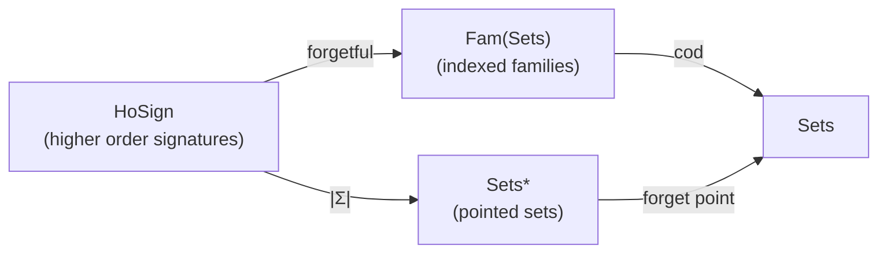
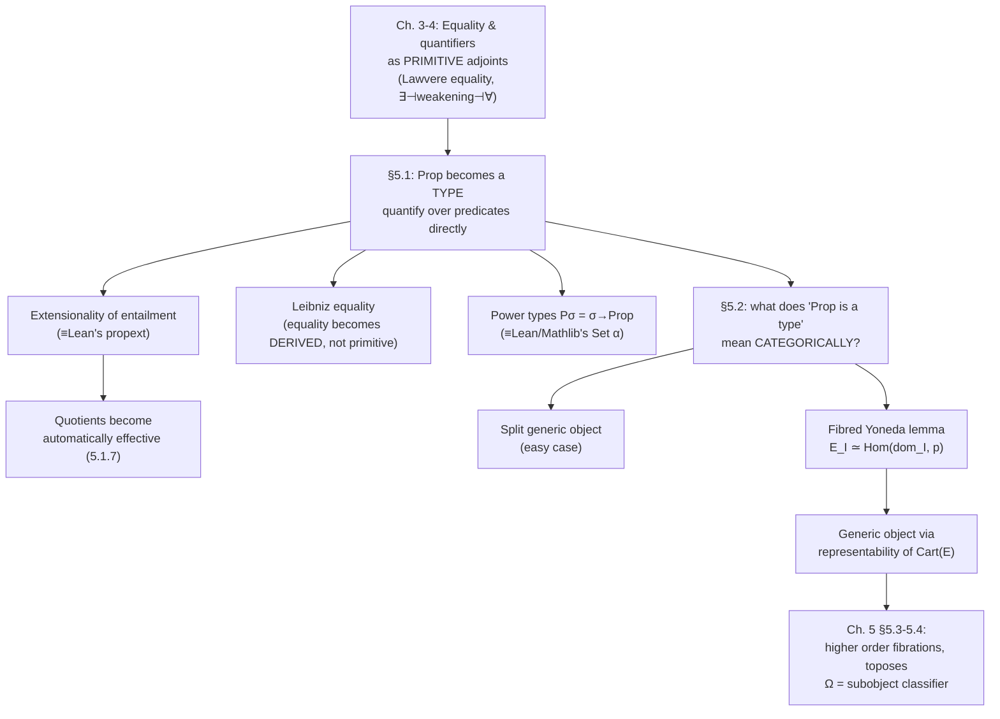

[[book-guidelines|↩ Back to guidelines]]

# Higher Order Predicate Logic

## Why first order logic isn't enough

Jacobs opens Chapter 5 with a deliberately concrete counterexample: the notion of a **Noetherian ring** — a ring $R$ in which every ideal $I \subseteq R$ has a finite basis. You cannot write this down in [[First-Order-Predicate-Logic|first order predicate logic]]. Not because it's semantically subtle, but because it requires quantifying over *subsets* ("for every ideal..."), and in first order logic quantifiers only range over elements of a type, never over predicates on a type.

This is the same wall you hit if you've ever tried to state "$X$ is well-founded" or "$f$ is injective on some invariant subset" inside a first-order specification language: you keep needing to say "there exists a subset such that..." and first order logic has no variable of subset-hood to quantify.

The fix Jacobs adopts is disarmingly simple to *state*, even though making it categorically rigorous is the entire content of this chapter: **turn `Prop`, the collection of propositions, into an ordinary type.** Once propositions are terms of type `Prop`, quantifying over predicates $\sigma \to \mathrm{Prop}$ is just quantifying over a type like any other — you get $\forall P{:}\sigma\to\mathrm{Prop}.\, \dots$ for free from the ordinary $\forall$ you already have for arbitrary types. Higher order logic doesn't need new quantifiers; it needs one new *type former* (well, one new base type, `Prop`) plumbed into a type theory you already have.

That one design decision has a long tail of consequences, and this article walks through five of them in the order the book builds them:

1. What it means, syntactically, to add a distinguished type `Prop` (§5.1).
2. Why you then need an *extensionality of entailment* rule to keep the internal equality on `Prop` sane (§5.1).
3. How this machinery hands you a definition of equality — **Leibniz equality** — for free, without a separate equality primitive (§5.1).
4. What "power types" and set-builder notation look like once `Prop` exists as a type (§5.1).
5. The genuinely hard categorical question this all raises: what does "`Prop` is a type" *mean* inside an arbitrary fibration, when the fibration isn't built syntactically from a signature? The answer is the notion of a **generic object**, and pinning it down correctly for non-split fibrations requires a **fibred Yoneda lemma** (§5.2).

Throughout, keep the running theme from the book's overall thesis in view: a *logic* is a logic *over* a type theory. Higher order logic just says: let the type theory itself be rich enough to contain its own logic's truth values as a type. Everything else in this chapter is working out what that costs you, categorically.

---

## 1. A distinguished type of propositions

### The syntax: `Prop` as a base type

A **higher order signature** $\Sigma$ (Definition 5.1.1) is, syntactically, almost identical to an ordinary many-typed signature — except its set of atomic types $|\Sigma|$ is *pointed*, with the distinguished point being `Prop`. There is no separate class of "predicate symbols" the way there was in first order signatures (Definition 4.1.1, from the previous chapter): a function symbol $P : \sigma_1, \dots, \sigma_n \to \mathrm{Prop}$ simply *is* a predicate symbol. Predicates stopped being a syntactic category of their own and became ordinary functions into a type.

Categorically, $\mathbf{HoSign}$ is presented (as with every syntactic category in this book) as a change-of-base square:



The pointed set $|\Sigma|$ just says: here is your usual collection of atomic types, and here is the one among them you're required to have, called `Prop`.

Once `Prop` is a type, an axiom appears that has no analogue in earlier chapters:

$$\vdash \mathrm{Prop} : \mathrm{Type}$$

This single line is doing something conceptually large: it says the *sort of propositions* is itself classified by a further sort, `Type`. Propositions $\Gamma \vdash \varphi : \mathrm{Prop}$ are now *terms*, on exactly the same syntactic footing as any other term $\Gamma \vdash M : \sigma$. This is why the book calls the resulting system "higher order **simple** predicate logic" — simple because the underlying type theory is still non-dependent, unlike the dependent/polymorphic systems in later chapters where the type-over-type hierarchy gets much richer.

**What breaks without this.** If `Prop` is only a metatheoretic notion of "the collection of formulas" — as it is in ordinary first order logic, where "formula" is a syntactic category defined by a grammar external to the term language — then you cannot write $\forall P{:}\sigma \to \mathrm{Prop}.\, \varphi$ inside the object language, because $P$ has no *type* to range over: predicates live outside the term calculus entirely. Making `Prop` an ordinary type is precisely what licenses binding a variable of "predicate-hood" with the same $\forall$/$\exists$ machinery already built in Chapter 4 (§4.1) for quantifying over any type $\sigma$.

**[[Regular-and-Coherent-Categories#Grounding|Grounding]] — Lean's `Prop`.** This is the single cleanest match in the whole book to something you already know from Lean. Lean's universe hierarchy has `Prop` sitting alongside `Type 0, Type 1, ...`, and crucially `Prop` is itself classified: `Prop : Type`. Lean's kernel really does treat propositions as ordinary terms of a type, exactly as Jacobs axiomatizes here — `Prop` is impredicative and proof-irrelevant, but syntactically it is a first-class citizen of the term language, not a metatheoretic label. When Lean elaborates `∀ P : α → Prop, P x → P x`, the elaborator is quantifying over a term of type `α → Prop` using the *same* Pi-type machinery it uses for `∀ n : Nat, ...` — there is no separate "predicate quantifier." That uniformity is exactly what Jacobs is building here, thirty years before Lean's kernel, using the fibred vocabulary of adjoints to weakening instead of a dependent Pi-former (dependent types don't arrive in this book until Chapter 12 — here everything is simply typed, so $\forall$ is genuinely just an adjoint to weakening, as in Chapter 4).

**[[Simple-Type-Theory#Grounding|Grounding]] — Rust.** Rust has no type of "propositions" as a first-class citizen — `bool` is a two-element *value* type, not a type of formulas closed under quantification, and there's no way in the surface language to write `fn(P: Type -> Prop)`. If you were building a verifier's internal representation, though, you'd do exactly what Jacobs does: give your intermediate representation (IR) a dedicated `Prop` variant of your `Type` enum, so predicates are literally IR terms:

```rust
enum Ty {
    Base(String),
    Arrow(Box<Ty>, Box<Ty>),
    Prop,                 // the distinguished type
}

enum Term {
    Var(usize),
    App(Box<Term>, Box<Term>),
    Lam(Ty, Box<Term>),
    // predicates are just terms of type `Arrow(sigma, Prop)`
}
```

This is precisely the move a refinement-type checker's core IR needs to make: refinement predicates ("this `Term` has type `Prop`") must be *terms* your substitution and typing code already knows how to handle, not a separate AST node type requiring its own substitution logic.

---

## 2. Extensionality of entailment

### The problem this rule solves

Once `Prop` is a type, a question that didn't exist before becomes urgent: propositions are now terms of type `Prop`, so they can be compared by the ordinary internal equality $=_{\mathrm{Prop}}$ inherited from Chapter 3's [[Equational-Logic|equational logic]]. But propositions were *already* comparable via **logical equivalence** ($\vdash$ in both directions, i.e. $P \vdash Q$ and $Q \vdash P$). Are these the same relation?

Nothing forces them to be, a priori — $=_{\mathrm{Prop}}$ is just Lawvere/Leibniz-style term equality, while entailment $\vdash$ is a separate judgement about derivability. The **extensionality of entailment** rule is the axiom that identifies them (stated for predicates $P, Q : \sigma \to \mathrm{Prop}$):

$$
\frac{\Gamma \vdash P, Q : \sigma \to \mathrm{Prop} \qquad \Gamma, x{:}\sigma \mid \theta, Px \vdash Qx \qquad \Gamma, x{:}\sigma \mid \theta, Qx \vdash Px}{\Gamma \mid \theta \vdash P =_{\sigma \to \mathrm{Prop}} Q}
$$

In words: if $P$ and $Q$ are logically interderivable pointwise, they are *equal as terms*. This is not automatic — the book is explicit that it will "not standardly assume this rule," flagging every place it's actually used.

A sharp corollary (Example 5.1.2) shows what this rule buys you: a proposition $\alpha : \mathrm{Prop}$ is derivable ($\vdash \alpha$) **if and only if** $\alpha =_{\mathrm{Prop}} \top$ is derivable. One direction needs only Lawvere's equality rule from Chapter 3; the converse genuinely needs extensionality of entailment (instantiated at $\sigma = 1$, using $1 \to \mathrm{Prop} \cong \mathrm{Prop}$). This equivalence — "true propositions are exactly those equal to $\top$" — is the internal-logic mirror of what a Boolean-valued semantics gives you externally, and it's the reason the rule is called "extensionality": it's forcing $\mathrm{Prop}$ to behave like a genuine truth-value object rather than an opaque syntactic label.

**What breaks without it.** Without extensionality of entailment, you can have two predicates that are provably equivalent in every possible sense a logician cares about ($P \dashv\vdash Q$) and yet remain *distinct terms* of type $\sigma \to \mathrm{Prop}$ — Leibniz equality (below) would then fail to hold between them even though no proof could ever distinguish their behavior. This matters concretely once you reach quotient types: Lemma 5.1.7 shows that **under extensional entailment, quotients become automatically effective** — $[x]_R =_{\sigma/R} [y]_R$ is derivable *exactly when* $R(x,y)$ is, with no extra effectiveness axiom needed (contrast this with first order predicate logic in §4.8, where effectiveness of quotients required extra hypotheses about the category being exact). Extensionality of entailment is what makes the higher-order quotient the "obviously correct" one instead of merely a formal approximation to it.

**Grounding — Lean's `propext`.** This is not an analogy; it is literally the same axiom. Lean's standard library axiom

```
theorem propext {a b : Prop} : (a ↔ b) → a = b
```

*is* the extensionality of entailment rule, specialized to $\sigma = 1$ (no free variable — Jacobs's version is the pointwise/predicate-indexed generalization, needed because his `Prop`-terms can depend on a variable $x{:}\sigma$). Lean needs `propext` as an *axiom*, not a theorem, because it does not follow from definitional equality (`isDefEq` in the kernel) — two logically-equivalent-but-syntactically-different propositions are not judgementally equal in Lean's kernel; `propext` has to be asserted as an extra postulate exactly because the kernel's native equality checker (unification up to $\beta\delta\iota$-reduction) has no way to derive it. This is a genuinely load-bearing distinction for an elaborator: **definitional equality never encompasses propositional/logical-equivalence-based equality** unless you build in an extensionality principle explicitly — which is exactly why Lean ships it as an axiom rather than deriving it, and exactly the phenomenon Jacobs is isolating here as a *rule you must choose to add*.

**Grounding — Rust.** Rust's type system has no internal notion of "propositional equality between predicates" to extend at all — trait bounds are checked structurally/nominally by the compiler, and there is no way to assert "these two trait implementations are provably equivalent, therefore treat them as the same type." If your refinement checker's IR carries predicates as terms (per the `Prop` sketch above), extensionality of entailment is the rule you'd need to add explicitly to your term-equality routine — e.g., normalize predicates up to provable logical equivalence *before* comparing them for the substitution lemmas your soundness proof needs — rather than something the host language (Rust) gives you.

---

## 3. Leibniz equality

### Getting equality for free

Here is one of the most elegant payoffs of making `Prop` a type: you no longer need a *primitive* equality relation at all. Define, for $M, N : \sigma$:

$$(M =_\sigma N) \;\stackrel{\mathrm{def}}{=}\; \forall P{:}\sigma \to \mathrm{Prop}.\; PM \supset PN$$

This is **Leibniz equality**: two things are equal exactly when they satisfy the same predicates — the *indiscernibility of identicals*, turned into a definition instead of an axiom schema. Note what's doing the work: $\forall$ and $\supset$ alone (Example 5.1.4 shows $\bot, \top, \vee, \wedge, \exists$ are *all* similarly definable from $\forall$ and $\supset$ — higher order logic's connective set is wildly redundant once quantification over `Prop` is available).

Lemma 5.1.5 proves the equality rules (reflexivity, symmetry, transitivity, replacement — the ones Chapter 3 took as primitive via the Lawvere adjunction) *follow* from this definition. Symmetry is the instructive case: assume $M =_\sigma N$, i.e. $\forall P.\, PM \supset PN$. To show $N =_\sigma M$, fix $P$ with $PN$, and instantiate the assumption not at $P$ but at the *derived* predicate

$$P' = \lambda x{:}\sigma.\, (Px \supset PM) : \sigma \to \mathrm{Prop}$$

Since $M =_\sigma N$ gives $P'M \supset P'N$, and $P'M$ holds trivially (it unfolds to $PM \supset PM$), you get $P'N$, i.e. $PN \supset PM$; combined with the assumed $PN$, that yields $PM$ — exactly the "witness" needed to close the proof of $N =_\sigma M$. The trick — instantiating a universally quantified predicate variable at a *predicate you build on the spot* — is the recurring proof technique of impredicative encodings; you'll see the identical move if you've ever proven properties of Church-encoded data in System F.

**What breaks without it.** In first order logic (Chapter 4), equality had to be introduced as a *primitive* — the Lawvere adjunction "equality is left adjoint to contraction" (§3.4) is elegant, but it is additional structure a fibration must be equipped with; nothing forces a first order fibration to have it (that's why "Eq-fibration" is its own definitional layer). Higher order logic doesn't have this problem: *any* fibration modeling higher order logic (i.e. with $\forall, \supset$ and a generic object — see §4 below) automatically has equality, derived, with all its expected properties proved as theorems rather than assumed as structure. This is a genuine reduction in axiomatic overhead, not just a notational convenience.

**Grounding — definitional vs. propositional equality (the load-bearing distinction).** Leibniz equality is a *propositional* equality — a term of type `Prop`, requiring a proof (the quantifier instantiation above) to establish, exactly like Lean's inductive `Eq` type (`a = b` requires a proof term, even though Lean's actual `Eq` is defined via the identity-type eliminator rather than impredicately). This is squarely a different thing from **definitional equality** — the kernel's `isDefEq`, which checks $\beta\delta\iota$-convertibility with no proof term at all. When you're building a unifier for an elaborator, this is exactly the fork in the road: definitional equality is what the unifier tries *first*, cheaply, by normalizing both sides; propositional equality (Leibniz-style, or Lean's `Eq`/`Iff` machinery) is what you fall back to when defeq fails and a tactic or the user has to supply a proof term. Jacobs's derivation shows *why* Leibniz equality, specifically, is the "smallest" congruence closed under substitution that you can get purely from $\forall/\supset$ — it's the impredicative *lower bound* on any reasonable propositional equality, which is why Girard/Reynolds-style impredicative encodings of equality in System F and CIC all bottom out at this same formula.

**Grounding — Rust.** You can sketch Leibniz equality directly, even though Rust's trait system can't actually enforce the universal quantifier over *all* predicates (it isn't impredicative — a Rust trait bound quantifies over implementors, not over arbitrary boolean-valued closures at the type level):

```rust
// Leibniz equality as a *value-level* witness: for a closed-world
// finite set of predicates, "x and y satisfy the same predicates."
fn leibniz_eq<T>(x: &T, y: &T, predicates: &[Box<dyn Fn(&T) -> bool>]) -> bool {
    predicates.iter().all(|p| p(x) == p(y))
}
```

This is deliberately only an *illustration*, not a faithful encoding — real Leibniz equality quantifies over *all* predicates $\sigma \to \mathrm{Prop}$, not a finite enumerable list, and Rust cannot express "for every possible closure" as a compile-time universal. The gap between this sketch and the real definition is itself instructive: it's exactly the gap between a first-order approximation and genuine impredicative quantification, which is why Leibniz equality needs `Prop` to be a *type you can quantify over inside the logic*, not just a value classifier like `bool`.

---

## 4. Power types and membership

### Predicates as first-class subset terms

With `Prop` as a type, the exponent $\sigma \to \mathrm{Prop}$ (already available from [[Simple-Type-Theory|simple type theory]]'s function types, Chapter 2) acquires a second life as a **power type**:

$$P\sigma \;\stackrel{\mathrm{def}}{=}\; \sigma \to \mathrm{Prop} : \mathrm{Type}$$

Terms of $P\sigma$ can be read either as predicates on $\sigma$ or as *subsets* of $\sigma$ — the same term, two readings, unified by the typed **membership** relation:

$$x{:}\sigma,\, a{:}P\sigma \;\vdash\; x \in_\sigma a \;\stackrel{\mathrm{def}}{=}\; a\, x : \mathrm{Prop}$$

Membership is literally application. There's no new primitive here — $\in_\sigma$ is notation for "apply the predicate." Inclusion then follows compositionally:

$$a{:}P\sigma,\, b{:}P\sigma \;\vdash\; a \subseteq_\sigma b \;\stackrel{\mathrm{def}}{=}\; \forall x{:}\sigma.\, (x \in_\sigma a) \supset (x \in_\sigma b) : \mathrm{Prop}$$

And for any proposition $x{:}\sigma, y{:}\tau \vdash \varphi(x,y) : \mathrm{Prop}$, set-builder notation becomes definable, not primitive:

$$x{:}\sigma \;\vdash\; \{y{:}\tau \mid \varphi(x,y)\} \;\stackrel{\mathrm{def}}{=}\; \lambda y{:}\tau.\, \varphi(x,y) : P\tau$$

The book is careful to flag a notational trap here: $\{y \in \tau \mid \varphi(x,y)\}$ (a *term* of type $P\tau$, built via the above $\lambda$) is not the same construct as the subset *type* $\{y{:}\tau \mid \varphi(x,y)\}$ from §4.6 — same-looking curly braces, entirely different categorical status. The power-type version is a first-class value you can pass around, quantify over, and compare with $\subseteq$; the subset-type version is a genuinely new *type*, requiring its own formation/introduction/elimination rules and existing only where the ambient fibration "has subsets" (§4.6). They happen to satisfy a convertibility ($\beta$-equivalence between $\varphi(x,y)$ and $z \in_\tau \{y \mid \varphi(x,y)\}$), which is why they're easy to conflate, but one is a term and the other is a type.

Two small but load-bearing lemmas round out §5.1 (Lemma 5.1.6, assuming extensional entailment): the singleton predicate $\{x\}_\sigma := \lambda z.\, (x =_\sigma z)$ is *internally injective* — $\{x\}_\sigma =_{P\sigma} \{y\}_\sigma$ entails $x =_\sigma y$ — and $\subseteq_\sigma$ is internally a partial order on $P\sigma$ (antisymmetry here is where extensionality of entailment is actually invoked: $a \subseteq b$ and $b \subseteq a$ give exactly the two entailment premises the rule needs). The singleton map $\{-\}_\sigma : \sigma \to P\sigma$ reappears constantly later in the book — it is the seed of the powerobject's universal membership relation in the topos chapter.

**What breaks without power types.** Subset types (§4.6) already let you form *a* type of elements satisfying $\varphi$. What they don't let you do is treat "the collection of all subsets of $\sigma$" as itself a single type you can quantify over — there is no way to say $\forall a{:}P\sigma.\, \dots$ using only subset types, because each subset type $\{x{:}\sigma\mid\varphi\}$ is a different type for each $\varphi$, not a uniform family living inside one ambient type. Power types collapse "all possible predicates on $\sigma$" into one type precisely because `Prop` already is one.

**Grounding — Lean/Mathlib's `Set`.** This is, again, not merely analogous — it's the actual definition. Mathlib defines:

```
def Set (α : Type u) := α → Prop
```

verbatim Jacobs's $P\sigma$. Membership `x ∈ s` unfolds to `s x` (exactly $x \in_\sigma a := a\,x$), and `s ⊆ t` unfolds to `∀ x, x ∈ s → x ∈ t` — exactly $\subseteq_\sigma$ above. Every basic lemma about `Set.ext` (set extensionality: `s = t ↔ ∀ x, x ∈ s ↔ x ∈ t`) is exactly an instance of the extensionality-of-entailment rule from §2, specialized to comparing two power-type terms pointwise. If you've used Mathlib's `Set` API, you have already been using Jacobs's §5.1 power types under a different name.

**Grounding — Rust.** A predicate-as-subset shows up naturally as a boxed closure or, for a checker's IR, as a first-class term:

```rust
type Pow<T> = Box<dyn Fn(&T) -> bool>;   // P sigma

fn member<T>(x: &T, a: &Pow<T>) -> bool { a(x) }          // x ∈ a
fn subset<T>(a: &Pow<T>, b: &Pow<T>, domain: &[T]) -> bool {
    domain.iter().all(|x| !member(x, a) || member(x, b))  // a ⊆ b, checked pointwise
}
```

The caveat that matters: `subset` above can only check inclusion by *enumerating* a finite `domain`, because Rust closures over `Fn(&T) -> bool` are opaque — you can't inspect or quantify over the closure's logic itself, only apply it. This is the same gap noted for Leibniz equality: genuinely quantifying over `P\sigma` internally (as $\forall a{:}P\sigma.\dots$ does) needs `P\sigma` to be a type your logic can bind a variable over, which is exactly what an IR built on the `Prop`-as-a-type design (§1's sketch) gives you, and a host language's opaque closures do not.

---

## 5. Generic objects and the fibred Yoneda lemma

Everything above was syntax: rules for a term calculus with a `Prop` type. Now comes the categorical question the rest of the book actually cares about: **what does it mean, in an arbitrary fibration $p : \mathbb{E} \to \mathbb{B}$ (not necessarily built from a signature), for the base category $\mathbb{B}$ to contain "the type of propositions"?**

### The easy case: split fibrations

If $p$ is split, the answer is direct. A **split generic object** (Definition 5.2.1) is an object $\Omega \in \mathbb{B}$ together with bijections

$$\theta_I : \mathbb{B}(I, \Omega) \;\cong\; \mathrm{Obj}\,\mathbb{E}_I$$

natural in $I$ — i.e., maps into $\Omega$ correspond *exactly* to objects of the fibre over $I$, and this correspondence commutes with substitution ($\theta_J(u \circ v) = v^*(\theta_I(u))$). Read categorically: a "predicate on $I$" (an object of $\mathbb{E}_I$) is the same data as a "classifying map $I \to \Omega$" — precisely what `Prop` gives you syntactically, now stated purely in terms of the fibration's structure, with no reference to terms or signatures at all.

Lemma 5.2.2 reformulates this more usefully: $p$ has a split generic object iff there is a single **distinguished object** $T \in \mathbb{E}$ (living over $\Omega = pT$) such that

$$\forall X \in \mathbb{E}.\; \exists! u : pX \to pT.\; u^*(T) = X$$

Every object of the total category is, uniquely, a pullback (reindexing) of this one universal object $T$. This "$\exists!$" is not decoration — it is exactly the shape of the universal property you'd write for a subobject classifier, and it's the categorical residue of the syntactic fact that every predicate $x{:}\sigma \vdash \varphi(x) : \mathrm{Prop}$ is *classified* by (i.e., is a pullback of) the single canonical predicate "truth" sitting over `Prop` itself. Example 5.2.3(iii) confirms this is not a coincidence: the syntactic classifying fibration of a higher order specification has exactly $\mathrm{Prop}$ itself as its split generic object, with $T$ being the tautological predicate — [[First-Order-Predicate-Logic#The construction|the construction]] closes the loop between §5.1's syntax and §5.2's semantics.

### Why the split case isn't enough

Most fibrations of real interest — codomain fibrations, subobject fibrations on non-split categories — aren't split. Corollary 5.2.5 (every fibration is *equivalent* to a split one) tells you the split notion still covers everything up to equivalence, but "equivalent to a split generic object" is a weaker, more delicate statement than "has one on the nose," and pinning down exactly what survives requires machinery: the **fibred Yoneda lemma**.

### The fibred Yoneda lemma

Recall the domain fibration $\mathrm{dom}_I : \mathbb{B}/I \to \mathbb{B}$ (the codomain functor on the slice category) — this plays the role of a "representable fibration," the fibred analogue of the representable functor $\mathbb{B}(-, I)$ in ordinary category theory. The fibred Yoneda lemma (Lemma 5.2.4) says:

$$\mathbb{E}_I \;\simeq\; \mathrm{Hom}(\mathrm{dom}_I,\, p)$$

— the fibre category over $I$ is equivalent to the category of **fibred functors** $\mathbb{B}/I \to \mathbb{E}$ over $\mathbb{B}$ (together with vertical natural transformations between them), naturally in $I$. This is exactly the ordinary Yoneda lemma ($\mathrm{Hom}(\mathbb{C}(-,I), F) \cong F(I)$), reproved with "sets and functions" replaced everywhere by "fibres and fibred functors."

The proof is worth internalizing because it's the template for the rest of the section: given $X \in \mathbb{E}_I$, build the functor $F_X : \mathbb{B}/I \to \mathbb{E}$ sending $u : J \to I$ to $u^*(X)$ (reindexing) — this is the fibred analogue of the Yoneda embedding $I \mapsto \mathbb{B}(-, I)$. Conversely, any fibred functor $G$ recovers its "value" as $G(\mathrm{id}_I) \in \mathbb{E}_I$. That $F_{G(\mathrm{id}_I)} \cong G$ and $G_{F_X}(\mathrm{id}_I) = X$ is a direct chase using the fibred-functor law $u^*G(\mathrm{id}) = G(u^*(\mathrm{id})) = G(u)$. In the split case, all the isomorphisms in this argument degenerate to identities — which is exactly why the split case felt "easy": it's the fibred Yoneda lemma with every coherence isomorphism silently discharged for free.

A fibration is **representable** if it is equivalent to some $\mathrm{dom}_\Omega$. Fibred Yoneda then delivers, via Proposition 5.2.10, the correct non-split generalization: restrict attention to the sub-fibration $\mathrm{Cart}(\mathbb{E}) \to \mathbb{B}$ built from *all objects but only Cartesian morphisms* (this restriction matters — it's what makes the correspondence rigid enough to pin down a specific classifying map rather than merely a family of candidates). Then:

$$p \text{ has a generic object} \iff \mathrm{Cart}(\mathbb{E}) \to \mathbb{B} \text{ is representable}.$$

Definition 5.2.8 spells out three grades of "generic object," differing only in how much uniqueness you demand of the classifying map $u : pX \to pT$ and the comparison isomorphism $u^*(T) \cong X$:

| | classifying map $u$ | comparison iso | 
|---|---|---|
| **weak** generic object | exists | exists |
| **generic** object | exists, *unique* | exists |
| **strong** generic object | exists, unique | exists, *unique* |

(Lemma 5.2.9: generic and strong generic objects are determined up to isomorphism; weak ones are not — without uniqueness of $u$, nothing forces two candidate classifiers to agree.) Ordinary "generic" is the sweet spot Proposition 5.2.10 targets, precisely because it's the one that corresponds to plain representability (as opposed to some stronger universal-element condition needed for the "strong" case).

### A worked example: the classifier for monos in Sets

Example 5.2.11(i) makes this concrete with the fibration of monos $\mathrm{Mono}(\mathbf{Sets}) \to \mathbf{Sets}$. Take $T = (1 = \{\top\} \subseteq \{\bot,\top\} = 2)$. This is a **strong** generic object: for every injection $m : X \rightarrowtail I$ there is a *unique* classifying map $\chi_m : I \to 2$ fitting a pullback square:

<svg viewBox="0 0 480 260" xmlns="http://www.w3.org/2000/svg" font-family="Georgia, serif" font-size="17">
  <style>
    .lbl { fill: #444; }
    .arr { stroke: #666; stroke-width: 1.6; fill: none; marker-end: url(#arrow); }
  </style>
  <defs>
    <marker id="arrow" markerWidth="10" markerHeight="10" refX="8" refY="3" orient="auto">
      <path d="M0,0 L8,3 L0,6 Z" fill="#666"/>
    </marker>
  </defs>
  <text x="60"  y="40" class="lbl">X</text>
  <text x="330" y="40" class="lbl">1</text>
  <text x="60"  y="220" class="lbl">I</text>
  <text x="330" y="220" class="lbl">2 = {⊥,⊤}</text>

  <line x1="80" y1="32" x2="310" y2="32" class="arr"/>
  <text x="185" y="20" class="lbl" font-style="italic">! (unique)</text>

  <line x1="72" y1="55" x2="72" y2="200" class="arr"/>
  <text x="30" y="130" class="lbl" font-style="italic">m</text>

  <line x1="345" y1="55" x2="345" y2="200" class="arr"/>
  <text x="395" y="130" class="lbl">⊤ ↦ true</text>

  <line x1="80" y1="222" x2="300" y2="222" class="arr"/>
  <text x="185" y="252" class="lbl" font-style="italic">χ_m (classifying map)</text>

  <rect x="60" y="55" width="12" height="12" fill="none" stroke="#888" stroke-width="1.3"/>
</svg>

The classifying map is determined completely by the injection: $\chi_m(i) = \top \iff \exists x{\in}X.\, m(x) = i$. In everyday terms, $\chi_m$ is exactly the characteristic function of the subset $m(X) \subseteq I$ — and Example 5.2.3(ii) confirms this is the same "$\{\bot,\top\}$ classifies subsets" fact you already know informally, now derived as an instance of the fibred generic-object machinery rather than assumed. This is the germ of the **subobject classifier** you'll meet formally when [[Toposes|toposes]] are defined in the next chapter (§5.4): "the subobject fibration is a higher order fibration" turns out to mean precisely "$\mathrm{Sub}(\mathbb{B})$ has a generic object," and that generic object *is* $\Omega$, the subobject classifier.

Example 5.2.11(ii) also flags the weak case explicitly, so you can see the gap: for a codomain fibration restricted to pullback-stable morphisms $\mathcal{V}$ of a single arrow $a$, $a$ itself is a *weak* generic object — a classifying map exists for every object in $\mathcal{V}$, but nothing pins it down uniquely, because $\mathcal{V}$ wasn't built with the rigidity (Cartesian-morphism-only) restriction that Proposition 5.2.10 needs.

**What breaks without the fibred Yoneda lemma.** Definition 5.2.1's split notion silently assumes you can *choose* a single natural bijection $\theta_I$ for every $I$ simultaneously, coherently. In a non-split fibration, cleavages are only pseudo-functorial — reindexing composes up to natural isomorphism, not on the nose — so demanding an equality $u^*(T) = X$ (as Lemma 5.2.2 does) is simply the wrong ask; you need to demand an *isomorphism*, and then you need a theorem (fibred Yoneda) to certify that working up to isomorphism still gives you a coherent, well-behaved notion, rather than an ad hoc patch that happens to work for a hand-picked example.

**Grounding — unification and metavariables (the load-bearing connection).** The universal property "$\exists! u : pX \to pT.\ u^*(T) \cong X$" has exactly the shape of a **unification problem with a unique most general solution**. Read $u$ as a metavariable assignment: given a "goal" $X$, you're asking for the unique substitution $u$ making $u^*(T)$ match $X$ (up to the vertical isomorphism, playing the role of "up to definitional equality"). This is structurally the same demand Miller pattern unification makes on flex-rigid equations $?m\,\vec{x} \doteq t$ — existence *and* uniqueness of the solving substitution is exactly what makes pattern unification decidable and syntax-directed, as opposed to general higher-order unification, which can have many incomparable solutions or none. The "weak" generic object (existence, no uniqueness) is the categorical shadow of a *non-pattern* flex-rigid equation: a classifying map exists but isn't canonical, so — like general higher-order unification — you cannot commit to it without search or backtracking. When you eventually build a unifier that must decide "is this metavariable's assignment unique," you are asking Jacobs's exact question from Definition 5.2.8, just about a fibration of typing derivations instead of a fibration of subsets.

**Grounding — Lean's `Prop` universe and impredicativity.** The reason `Prop` in Lean is *impredicative* (you can quantify over all of `Prop` — including quantifying over itself — from inside a single proposition, unlike `Type u`, where quantifying over `Type u` lands you in `Type (u+1)`) is precisely so that a generic-object-style classifier can live *at* `Prop` rather than one universe above it. If `Prop` behaved predicatively, [[Full-Higher-Order-Dependent-Type-Theory#The definition|the definition]] of Leibniz equality above — $\forall P{:}\sigma \to \mathrm{Prop}.\, PM \supset PN$, itself a term of type `Prop` quantifying over predicates *into* `Prop` — would need to live in a strictly larger universe than the equality it's defining, which is exactly the kind of universe-stratification headache that impredicative `Prop` is designed to sidestep. Jacobs's generic-object story is the semantic reason *why* that design choice pays off: it's what lets a single object $\Omega$ (or type `Prop`) classify all the predicates that can themselves quantify over $\Omega$, without an infinite regress of larger classifiers.

---

## Synthesis: where this sits in the book's structure



Two threads converge here from earlier chapters and one thread launches forward:

- **Converging in:** the adjoint-based treatment of $\exists,\forall,=$ built up across Chapters 3–4 turns out to be exactly what's needed to prove the higher order derived facts in §5.1 (Leibniz equality's rules, the redundancy of the connective set) — nothing new is assumed about the logic itself, only about the type theory hosting it (namely, that it now contains `Prop`).
- **Converging in:** [[Subset-Types-and-Quotient-Types|subset types and quotient types]] (§4.6–4.9) reappear transformed — quotients specifically become *automatically effective* the moment extensional entailment is available, closing a gap that first order logic could only patch with extra exactness hypotheses on the category.
- **Launching forward:** the generic object is the load-bearing concept for the rest of the chapter and the next. "Higher order fibration" (§5.3) is defined as *first order fibration + generic object + Cartesian closed base* — nothing more. A **topos**, in this book's preferred logical formulation, is simply a category whose *subobject* fibration happens to be a higher order fibration in this sense — meaning the entire theory of toposes, elementary or otherwise, is downstream of getting the generic-object story in §5.2 exactly right, including the non-split subtleties the fibred Yoneda lemma exists to handle.

## Where this leads

The immediate next stretch of the book (§5.3–§5.4, Topic 13 in this vault's index) defines **higher order fibrations** and **toposes** directly on top of the generic object developed here — the subobject classifier $\Omega$ of an elementary topos is nothing but a generic object for the subobject fibration, and Kock's characterisation of a topos via powerobjects is a global, coherent version of the power-type construction from §4. For your compiler/elaborator project specifically: the "$\exists! u$" pattern in Definition 5.2.8 is worth remembering concretely once you implement pattern unification — it is the same shape of problem, and the weak/generic/strong distinction here is a clean categorical vocabulary for "does this metavariable have a canonical solution, or merely *a* solution" — a question you will ask constantly once bidirectional typing starts generating flex-rigid constraints during elaboration.
