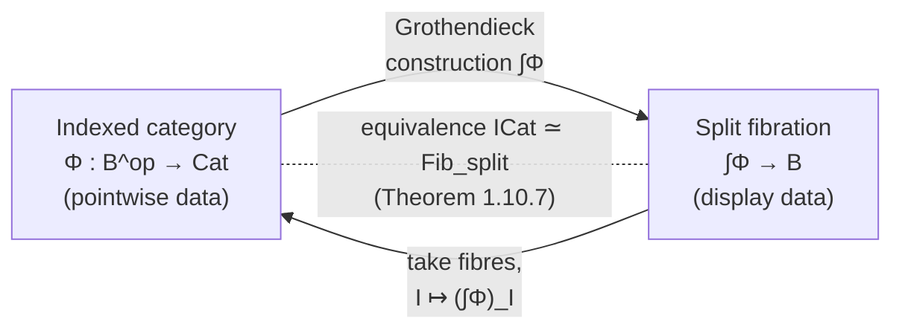

[[book-guidelines|↩ Back to guidelines]]

## Why you need a second way to say "family of categories"

Chapter 1 spent its first three sections building up *fibrations*: a functor $p:\mathbb E\to\mathbb B$ whose fibres $\mathbb E_I = p^{-1}(I)$ vary "over" a base category, with Cartesian morphisms telling you exactly what it means to substitute an object of $\mathbb E_J$ back along $u:I\to J$ to get an object of $\mathbb E_I$. That's what Jacobs calls **display indexing**: you see the family $(\mathbb E_I)_{I\in\mathbb B}$ only indirectly, through the single functor $p$ that displays everything glued together in one total category $\mathbb E$.

But there's an older, more naive way to hand someone a family of things indexed by $\mathbb B$: just *give them the family directly*. For sets, this was already the very first distinction the book made (Section 1.1): $(X_i)_{i\in I}$ (pointwise — literally an $I$-tuple of sets) versus $\varphi: X\to I$ (display — one set with a projection). The book showed these two presentations of "a family of sets" are equivalent. Section 1.4 and 1.10 now do the categorical-strength version of that same equivalence: instead of a family of *sets* indexed by *elements* of one set $I$, you want a family of *categories* indexed by *objects* of a base category $\mathbb B$, contravariantly, so that a morphism $u:I\to J$ in the base gives you a way to move fibre-category-valued content from $J$ back to $I$.

This matters for reasons that go well past bookkeeping. If you are ever going to model a *type theory* categorically — types depending on a context $\Gamma$, substitution $u:\Delta\to\Gamma$ acting on those types — you need to decide, precisely, what "the collection of types-in-context" looks like as mathematical data. An **indexed category** answers that question in "pointwise" form: to each context you assign directly the category of things classified there. The **Grothendieck construction** is the theorem-strength bridge back to fibrations, telling you these two answers are (up to a controlled amount of coherence data) the same theorem.

## Indexed categories as pseudo-functors into $\mathbf{Cat}$

### What breaks if you just try to write down "$I \mapsto \mathbb E_I$" as a functor

Start from a fibration $p:\mathbb E\to\mathbb B$ that has been given a **cleavage** — an explicit, chosen Cartesian lifting for every $u:I\to J$ and every $Y\in\mathbb E_J$ (Definition 1.4.3(i); a fibration admitting some cleavage is called **cloven**). A cleavage lets you build, for every $u:I\to J$, an actual functor
$$
u^{*}:\mathbb E_J \to \mathbb E_I
$$
by sending $Y$ to the domain of its chosen Cartesian lifting, and lifting morphisms via the universal property of Cartesian arrows (this is [[First-Order-Predicate-Logic#The construction|the construction]] spelled out just before Definition 1.4.3 — every vertical map over $J$ transports uniquely along the chosen lifting). So you *do* get an assignment $I \mapsto \mathbb E_I$, $u\mapsto u^{*}$. The tempting next move is to call this a functor $\mathbb B^{\mathrm{op}}\to\mathbf{Cat}$.

It almost is one, and that "almost" is the entire content of this section. Two composable morphisms $u:I\to J$, $v:J\to K$ give you two ways to get from $\mathbb E_K$ down to $\mathbb E_I$: apply $(v\circ u)^{*}$ directly, or apply $v^{*}$ then $u^{*}$. Both are Cartesian liftings of $v\circ u$ at the same object (Cartesian liftings compose), so by the uniqueness-up-to-vertical-isomorphism that defines Cartesian morphisms (Prop. 1.1.4), they agree — **but only up to a canonical natural isomorphism**, not on the nose:
$$
\mu_{u,v}: u^{*}v^{*} \xRightarrow{\ \cong\ } (v\circ u)^{*}.
$$
Likewise the identity morphism $\mathrm{id}_I$ has its own Cartesian lifting, which need not literally be the identity functor on $\mathbb E_I$, only isomorphic to it:
$$
\eta_I: \mathrm{id}_{\mathbb E_I} \xRightarrow{\ \cong\ } (\mathrm{id}_I)^{*}.
$$
This is not a defect you can engineer away in general — it's a structural fact about how a chosen-liftings construction behaves under [[Fibred-Category-Theory#Composition|composition]], forced by the same uniqueness property that makes Cartesian liftings useful in the first place. The two isomorphisms $\eta$ and $\mu$ must additionally satisfy the coherence diagrams in **Definition 1.4.4** (the same shape of law a monad's unit/multiplication satisfy, as Jacobs remarks — right down to a formal analogy worked out later in Exercise 1.10.7), which say roughly: composing three morphisms and re-associating the $\mu$'s gives the same isomorphism regardless of which pair you combine first, and $\eta$ interacts correctly with $\mu$ at either end.

### The formal definition

**Definition 1.4.4(i).** A **$\mathbb B$-indexed category** is a *pseudo-functor* $\Phi:\mathbb B^{\mathrm{op}}\to\mathbf{Cat}$: an assignment of a category $\Phi(I)$ to each $I\in\mathbb B$ and a functor $\Phi(u):\Phi(J)\to\Phi(I)$ (often just written $u^{*}$) to each $u:I\to J$ — note the reversal of direction, mirroring contravariant substitution — together with the coherence isomorphisms $\eta_I$ and $\mu_{u,v}$ above, subject to the coherence laws.

The word "pseudo" is doing real work here: an ordinary functor $\mathbb B^{\mathrm{op}}\to\mathbf{Cat}$ would demand $\mathrm{id}^{*}=\mathrm{id}$ and $u^{*}v^{*}=(v\circ u)^{*}$ as *equations*. A pseudo-functor only demands them up to specified, coherent isomorphism. **Proposition 1.4.5** packages the whole discussion above into one sentence: any cloven fibration $p:\mathbb E\to\mathbb B$ yields a $\mathbb B$-indexed category by $I\mapsto\mathbb E_I$, $u\mapsto u^{*}$.

*[[Regular-and-Coherent-Categories#Grounding|Grounding]] — why this is exactly the "structure vs. property" line you already know from Lean.* Think of $\Phi(I)$ as "the category of well-formed data classified at context $I$," and $u^{*}$ as "substitute along $u$." A pseudo-functor is precisely what you get when you build a type-family-indexed-by-context and only know that "substitute along $u$, then along $v$" and "substitute along $v\circ u$ directly" produce results related by *some* canonical isomorphism — not that they are *identical* terms. In Rust terms, imagine a trait
```rust
trait Fibre {
    type Obj;
    type Mor;
}

trait IndexedCategory<B: BaseCategory> {
    type At<I: B::Obj>: Fibre;                     // Φ(I)
    fn subst<I: B::Obj, J: B::Obj>(u: B::Mor<I, J>)
        -> FunctorTo<Self::At<J>, Self::At<I>>;     // u*
    // η_I : id ≅ subst(id_I)      — witnessed, not assumed equal
    // μ_{u,v} : subst(u) ∘ subst(v) ≅ subst(v ∘ u)  — witnessed, not assumed equal
}
```
Rust's type system has no native notion of "this isomorphism must additionally satisfy coherence axioms," so the trait can only gesture at the shape; the $\eta$/$\mu$ witnesses and their laws would have to be carried as explicit proof obligations, which is exactly what a Lean formalization does directly and honestly.

## Split indexed categories

**Definition 1.4.4(ii).** A **split indexed category** is a genuine functor $\Phi:\mathbb B^{\mathrm{op}}\to\mathbf{Cat}$ — i.e. an indexed category in which $\eta_I$ and $\mu_{u,v}$ are the identity natural transformations. Equivalently (Definition 1.4.3(ii)): a cloven fibration is **split** when its induced substitution functors satisfy $\mathrm{id}^{*}=\mathrm{id}$ and $u^{*}v^{*}=(v\circ u)^{*}$ as literal equalities of functors, not merely natural isomorphisms.

*[[Fibred-Category-Theory#What breaks without splitting|What breaks without splitting]].* If you only have $u^{*}v^{*}\cong(v\circ u)^{*}$, every time you reindex along a composite morphism you have to explicitly carry around, and reason about, which isomorphism you're using and check it's the coherent one — the "cumbersome, dangerous to ignore" cost Jacobs flags directly in Discussion 1.10.4(i)(b). This is not a cosmetic inconvenience: it is *exactly* the difference between a type theory whose substitution calculus satisfies $(\sigma\circ\tau)\,T \equiv \sigma(\tau\,T)$ by **definitional equality** (split — the kernel can silently unify these two type expressions) versus one where you'd only have a **propositional** equality between them that a checker must actively invoke and track (cloven-but-not-split — closer to what you get if you try to encode substitution "up to isomorphism" in a category-with-families that isn't strict). This is precisely why real proof assistants engineer their internal calculi (explicit substitutions, de Bruijn indices, closure-based evaluation) to make substitution composition hold **on the nose** wherever possible: a split presentation is a presentation whose bookkeeping the kernel's `isDefEq` can discharge for free, instead of a propositional equality that has to be `rewrite`-transported through every downstream construction.

Jacobs gives concrete split [[Internal-Category-Theory#Examples worth internalizing|examples worth internalizing]] (1.10.3, 1.4.6–1.4.9):

- The **family fibration** $\mathrm{Fam}(\mathbb C)\to\mathbf{Sets}$ arises from the split indexed category $I \mapsto \mathbb C^I$ (the functor category of $I$-indexed families of objects/morphisms of $\mathbb C$), with substitution along $u:I\to J$ given by literal precomposition $u^{*}(X)_i = X_{u(i)}$ — composition of functions is associative on the nose, so this is split for free.
- **UFam($\omega$-Sets)** and **UFam(PER)**: families of $\omega$-sets (respectively PERs) uniformly tracked by a single recursive code across an $\omega$-set index — again split, again because substitution is by composition rather than by pullback.
- By contrast, the **codomain fibration** $\mathbb B^{\to}\to\mathbb B$ (fibres = slice categories $\mathbb B/I$, substitution by pulling back) is only cloven in general: pullbacks are unique up to isomorphism, not on the nose, so $u^{*}v^{*}$ and $(v\circ u)^{*}$ genuinely differ as functors even though they agree up to canonical iso.

The moral the book draws (and one worth keeping as a standing heuristic): whenever you have a choice, prefer to *present* your fibred structure in split form, because split indexed categories are functors — plain, ordinary, strictly-composing data — while merely-cloven fibrations force you to carry coherence isomorphisms as first-class citizens of every proof.

## The Grothendieck construction

Now for the theorem that makes "indexed category" and "fibration" two views of *the same fact* rather than two different facts.

**Definition 1.10.1 (Grothendieck construction).** Given an indexed category $\Phi:\mathbb B^{\mathrm{op}}\to\mathbf{Cat}$, its **Grothendieck completion** $\int_{\mathbb B}\Phi$ (or just $\int\Phi$) is the category with:

- **objects** pairs $(I,X)$ with $I\in\mathbb B$ and $X\in\Phi(I)$;
- **morphisms** $(I,X)\to(J,Y)$ are pairs $(u,f)$ with $u:I\to J$ in $\mathbb B$ and $f: X \to u^{*}(Y)=\Phi(u)(Y)$ in $\Phi(I)$.

Composition of $(I,X)\xrightarrow{(u,f)}(J,Y)\xrightarrow{(v,g)}(K,Z)$ is $(v\circ u,\ \mu_{u,v}(Z)\circ u^{*}(g)\circ f)$ — you push $f$ forward, apply $u^{*}$ to $g$, and then use the coherence isomorphism $\mu_{u,v}$ to land in $(v\circ u)^{*}(Z)$ rather than in $u^{*}v^{*}(Z)$. The identity on $(I,X)$ is $(\mathrm{id}_I,\ \eta_I(X))$. Jacobs is explicit that the coherence diagrams for $\eta,\mu$ are *precisely* what's needed to make this composition associative and unital — the coherence laws aren't ornamental, they're load-bearing for $\int\Phi$ to be a category at all.

**Proposition 1.10.2.** The first projection $\int\Phi \to \mathbb B$, $(I,X)\mapsto I$, is a cloven fibration — split whenever $\Phi$ is split. And going the other way (fibration $\to$ indexed category via Prop. 1.4.5, then back via $\int(-)$) recovers a fibration *equivalent* to the one you started with; going indexed category $\to$ fibration $\to$ indexed category recovers something "essentially the same" as the original.

*This is the payoff, made concrete.* Recall the family fibration example: $\mathrm{Fam}(\mathbb C)\to\mathbf{Sets}$ is literally $\int\Phi$ for the split indexed category $\Phi = \mathbb C^{(-)}: \mathbf{Sets}^{\mathrm{op}} \to \mathbf{Cat}$. This isn't a coincidence particular to sets — it's the Grothendieck construction specialized to that one $\Phi$.

*[[Simple-Type-Theory#Grounding|Grounding]] — this is your $\Sigma$-type.* Look again at the shape of $\int\Phi$'s objects: a pair $(I,X)$ where $I$ ranges over a base and $X$ ranges over a category *that depends on* $I$. That is exactly the shape of a dependent pair type $\Sigma(I:\mathbb B).\ \Phi(I)$ — read "index" as "first projection of a $\Sigma$" and "fibre category" as "the type family the second component lives in." In Lean, the correspondence is close to literal:
```lean
-- Φ : B → Type is the object part of an indexed category valued in discrete
-- categories; a genuine Cat-valued Φ needs the fibre's morphisms too, but the
-- object-level shape is already the point:
structure GrothendieckObj (B : Type) (Φ : B → Type) where
  idx  : B
  elt  : Φ idx
-- literally: Σ i : B, Φ i
```
A morphism $(I,X)\to(J,Y)$ in $\int\Phi$ being a pair $(u, f: X \to u^{*}Y)$ is the categorical generalization of "two elements of a $\Sigma$-type are related by a base-path $u$ and a fibre-map $f$ transported along $u$" — precisely the shape that appears when you reason about equality or morphisms of dependent pairs, and precisely the discipline a **comprehension category** (the semantic device Jacobs uses in Chapter 18 for genuine dependent type theory) formalizes as its total-category/fibration pair. In Rust, without native dependent types, the closest honest analogue is an existential/trait-object pair `(I, Box<dyn Fibre<I>>)`, but Rust cannot express "$\Phi(u)$ acts on the second component" as a checked operation — that transport step is exactly the piece of type theory Rust's type system doesn't have and Lean's does.

## The equivalence: indexed categories $\simeq$ split fibrations

**Theorem 1.10.7 (Grothendieck).** The Grothendieck construction extends to an equivalence of categories fibred over $\mathbf{Cat}$:
$$
\int(-) : \mathbf{ICat} \ \xrightarrow{\ \simeq\ }\ \mathbf{Fib}_{\mathrm{split}}
$$
where $\mathbf{ICat}$ is the category of (split) indexed categories with morphisms $(K,\alpha):\Phi\to\Psi$ — a functor $K:\mathbb A\to\mathbb B$ on bases plus a natural transformation $\alpha:\Phi \Rightarrow \Psi K^{\mathrm{op}}$ whose components $\alpha_I:\Phi(I)\to\Psi(KI)$ are the fibrewise action (Definition 1.10.5) — and $\mathbf{Fib}_{\mathrm{split}}$ is the category of split fibrations over arbitrary bases, with fibration-morphisms. The functor back, $\mathfrak I:\mathbf{Fib}_{\mathrm{split}}\to\mathbf{ICat}$, is exactly Proposition 1.4.5's "take the fibres" construction. **Proposition 1.10.9** upgrades this to an equivalence of 2-categories $\mathbf{ICat}(\mathbb B) \simeq \mathbf{Fib}_{\mathrm{split}}(\mathbb B)$ once you fix a base $\mathbb B$ and add 2-cells: a 2-cell $\sigma:\alpha\Rightarrow\beta$ between morphisms $\alpha,\beta:\Phi\to\Psi$ of split indexed categories over the same base is a **modification** — a family $\sigma_I:\alpha_I\Rightarrow\beta_I$ of natural transformations compatible with substitution (Definition 1.10.8).



Why should you care that this is an *equivalence*, rather than just "these two things are related"? Because it licenses a habit the rest of the book relies on constantly: whichever presentation is more convenient for the argument at hand, use it, and translate freely. Jacobs is candid about the trade-offs (Discussion 1.10.4):

- **Indexed categories carry explicit structure** (the reindexing functors and the $\eta,\mu$ isomorphisms); **fibrations only assert a property** (the existence of Cartesian liftings). Category theory generally prefers properties to structure, because a property, once you know it holds, doesn't force you to keep re-verifying it's the "right" witness — whereas structure must be checked at every use site for whether a given fact about it is intrinsic (independent of the specific choice) or an artifact of the chosen cleavage.
- **Fibrations compose cleanly** (already shown in Section 1.6); the corresponding statement for indexed categories is markedly less smooth — a real cost, because the book will later stack multiple levels of indexing on top of each other precisely by composing fibrations (logic-over-type-theory is fibration-over-fibration).
- **Fibrations generalize to 2-categories** the way display indexing generalizes to arbitrary categories; a genuinely dependent-type-theoretic semantics (rather than merely simple or polymorphic) tends to force you into working with the Grothendieck completion anyway — at which point, Jacobs notes dryly, "one might as well use fibrations from the beginning."
- In practice the book's compromise, which it names explicitly, is to use **split indexed categories** as a *presentation device* for introducing a split fibration, but to reason about the resulting structure as a fibration once it exists.

*Grounding.* This structure/property tension is the same one you meet choosing between an explicit substitution calculus (structure: you carry substitution terms and prove equations about them — a "cloven" style) and a semantic, closed-under-composition notion of definitional equality decided by an algorithm (property: `isDefEq` either succeeds or doesn't, and once it succeeds you never re-litigate *how*). Elaborators that build explicit coercion/cast terms at every substitution site are working "cloven"; elaborators that normalize and compare via a decision procedure are working "split." The theorem tells you these views coincide up to equivalence — but the *engineering* cost of maintaining explicit coherence data versus getting it for free from a strict, split presentation is real, and is exactly Jacobs's point 1.10.4(i)(a)-(b).

## Opposite of an indexed category vs. opposite of a fibration

This subtopic is a small, sharp illustration of the structure/property asymmetry just discussed, applied to one specific operation: "reverse all the arrows in the fibre."

**Definition 1.10.10 — the indexed-category opposite (easy).** For a split indexed category $\Phi:\mathbb B^{\mathrm{op}}\to\mathbf{Cat}$, define $\Phi^{\mathrm{op}}:\mathbb B^{\mathrm{op}}\to\mathbf{Cat}$ **fibrewise**: $I\mapsto \Phi(I)^{\mathrm{op}}$, and a morphism $u:I\to J$ acts by $(\Phi(u))^{\mathrm{op}}:\Phi(J)^{\mathrm{op}}\to\Phi(I)^{\mathrm{op}}$. That's the entire definition. Because $\Phi$ is split, $\Phi(u)$ is a genuine functor, and "take the opposite of a functor" is a completely mechanical, on-the-nose operation — no new coherence data to check.

**Definition 1.10.11 (Bénabou) — the fibration opposite (not easy).** For a fibration $p:\mathbb E\to\mathbb B$, you want $p^{\mathrm{op}}:\mathbb E^{(\mathrm{op})}\to\mathbb B$ over the *same* base, fibrewise the opposite of $p$, but defined intrinsically (i.e., without secretly choosing a cleavage first — that would make it depend on a choice the construction has no right to depend on). Recall that any morphism $f$ in $\mathbb E$ factors as a vertical morphism followed by a Cartesian one (Lemma 1.4.10, via $f = u(Y)\circ \bar f$). [[Realizability-Models-Omega-Sets-and-PERs#The idea|The idea]] behind $p^{\mathrm{op}}$: reverse only the *vertical* part of every such factorization. Concretely:

- Let $CV$ be the collection of composable pairs $(f_1,f_2)$ with $f_1$ Cartesian, $f_2$ vertical, sharing a domain.
- Identify $(f_1,f_2)\sim(g_1,g_2)$ when there's a vertical isomorphism $h$ with $g_1\circ h = f_1$ and $g_2\circ h = f_2$.
- The total category $\mathbb E^{(\mathrm{op})}$ has the *same objects* as $\mathbb E$, but a morphism $X\to Y$ is an equivalence class $[f_1,f_2]$ of such a pair — informally, "go from $X$ vertically to some $Z$, then Cartesian-lift from $Z$ up to $Y$," with the vertical leg now pointing the *opposite* way a plain vertical map in $\mathbb E$ would.
- $p^{\mathrm{op}}$ sends $X\mapsto pX$ and $[f_1,f_2]\mapsto p(f_1)$.

**Lemma 1.10.12** confirms this does what you want: $p^{\mathrm{op}}$ is again a fibration; $[f_1,f_2]$ is Cartesian in $p^{\mathrm{op}}$ exactly when $f_2$ is a vertical *isomorphism* in $p$; each fibre of $p^{\mathrm{op}}$ is naturally isomorphic to $(\mathbb E_I)^{\mathrm{op}}$; and $(p^{\mathrm{op}})^{\mathrm{op}} \cong p$.

Jacobs's own recommended mental shortcut (Discussion 1.10.4(iv)) is worth stating plainly, because it turns Bénabou's construction from a scary equivalence-class gadget into something you can hold in your head: *the easiest way to understand $p^{\mathrm{op}}$ is to first turn $p$ into an indexed category (choose a cleavage), take the fibrewise opposite the easy way (Definition 1.10.10), then feed that back through the Grothendieck construction.* Definition 1.10.11 is simply what you get when you insist on doing the same operation **without** picking a cleavage first — you pay for cleavage-freeness with equivalence classes.

**Lemma 1.10.13** shows the payoff is real duality, not just bookkeeping: for a fibration $p$,
$$
p \text{ has fibred limits of shape } J \iff p^{\mathrm{op}} \text{ has fibred colimits of shape } J^{\mathrm{op}},
$$
$$
p \text{ has simple products} \iff p^{\mathrm{op}} \text{ has simple coproducts}, \qquad p \text{ has products} \iff p^{\mathrm{op}} \text{ has coproducts}.
$$
This is the fibred lift of the ordinary fact that $\mathbb C$ has limits of shape $J$ iff $\mathbb C^{\mathrm{op}}$ has colimits of shape $J^{\mathrm{op}}$ — except now it has to hold *fibrewise, compatibly with substitution*, which is exactly why the construction needs the vertical/Cartesian factorization machinery rather than a naive "reverse everything."

*Why this distinction earns its place in the book, not just as a curiosity.* $\exists$ and $\forall$ are, respectively, simple coproducts and simple products in a predicate fibration (Chapter 4). Lemma 1.10.13 tells you, for free and without redoing any adjunction proof, that a fibration modeling $\forall$ automatically gives you a "dual" fibration (its Bénabou opposite) modeling $\exists$ for the same base logic — an early hint of the intuitionistic-versus-classical, existential-versus-universal symmetries that recur throughout the predicate-logic chapters.

## Synthesis: where this sits, and where it leads

Structurally, this section closes out Chapter 1's toolkit. Sections 1.1–1.3 gave you fibrations and Cartesian morphisms; 1.4 showed every cloven fibration secretly *is* a pseudo-functor (indexed category), and singled out the well-behaved (split) case; 1.10 proved that correspondence is an honest equivalence and worked out its edge cases (opposites, 2-cells, morphisms of indexed categories). Everything downstream that says "fibration" could, in principle, be re-derived by first constructing the corresponding indexed category and taking $\int(-)$ — the book just usually won't bother, preferring the cleaner fibration-side statements per the trade-offs above.

Two concrete places this pays off later in the book:

- The **family fibration**, **codomain fibration**, and the **UFam($\omega$-Sets)**/**UFam(PER)** fibrations that recur through the whole book (Chapter 1's own Section 1.2–1.3, and reused constantly afterward) are all literally instances of $\int\Phi$ for an explicitly named split indexed category $\Phi$ — you now have the general theorem that manufactured all of them.
- The pattern "objects of the total category are pairs (base object, fibre object), morphisms transport along the base map" is the direct ancestor of **comprehension categories** in Chapter 18, the device Jacobs uses to give the categorical semantics of genuine dependent type theory (types-in-context as a fibration, terms as sections). If you are building a dependent/refinement-type checker, the Grothendieck construction is where you should locate the precise moment "a context-indexed family of types" and "a single total space with a projection" stop being two different data structures and become, provably, the same thing up to equivalence — which is exactly the freedom a type checker exploits when it sometimes represents a context extension as `Γ, x : T` (pointwise) and sometimes as a single dependent-pair object (display), depending on which is more convenient for the pass at hand.

For the split-vs-cloven strand specifically: this is the categorical seed of the design decision every dependent type checker eventually has to make about how strictly its substitution calculus computes — whether $u^{*}v^{*} = (v\circ u)^{*}$ holds by construction (split, cheap for the kernel) or only up to a propositional equality you must invoke explicitly (cloven, expensive). Keep that distinction in mind when Chapter 18's comprehension categories, and later the discussion of definitional versus propositional equality in dependent type theory, come back to exactly this fork.
