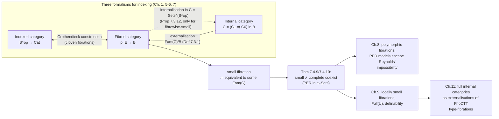

[[book-guidelines|↩ Back to guidelines]]

## Why define a category *inside* another category?

Section 1.10 gave you indexed categories: a functor $\mathbb{B}^{op} \to \mathbf{Cat}$ sending each object of a base category to a category of "fibres." Chapter 5–6 gave you fibred categories: a single functor $p: \mathbb{E} \to \mathbb{B}$ with Cartesian liftings, which is really the same information packaged without choosing a splitting. Both formalisms describe indexing *externally* — from the vantage point of an ambient category $\mathbf{Cat}$ or of the total category $\mathbb{E}$, looking down at fibres.

Chapter 7 introduces a third formalism, and it comes from a completely different direction. Recall Section 3.3's trick for defining a group *inside* an arbitrary category with finite products: instead of saying "a group is a set with an associative binary operation, etc.," you say a group is an object $G$ equipped with morphisms $m: G \times G \to G$, $e: 1 \to G$, $i: G \to G$ making certain diagrams commute. Nothing here mentions elements — it's pure arrow-pushing. Do this in $\mathbf{Sets}$ and you get an ordinary group. Do it in $\mathbf{Sp}$ (topological spaces) and you get a topological group, for free, with no extra work, because continuity of the group operations is just "the diagrams commute in $\mathbf{Sp}$."

The natural next question: can you do the same thing to the notion of *category*? Can you write down "the diagrammatic essence of being a category" and then interpret those diagrams in any sufficiently structured ambient category $\mathbb{B}$, getting for free a notion of "category as seen from inside $\mathbb{B}$"?

You can — but a category needs more raw material than a group. A group only needed finite products. A category has partial [[Fibred-Category-Theory#Composition|composition]] (you can only compose $f: A \to B$ with $g: B \to C$ if their endpoints match), and expressing "the composable pairs" diagrammatically requires an **equaliser**, not just a product. So the ambient category $\mathbb{B}$ needs finite limits, not just finite products. This is the first sign that internal category theory is doing something structurally different from indexed/[[Fibred-Category-Theory|fibred category theory]]: it is asking the base category itself to have enough categorical structure to talk about categories, rather than asking for a functor *out of* the base into $\mathbf{Cat}$.

Why bother? Three reasons, each of which becomes concrete later in the chapter:

1. **Uniformity.** An ordinary small category is a special case (internal to $\mathbf{Sets}$) rather than a foundational primitive. This lets you reuse "ordinary" categorical vocabulary — functor, natural transformation, adjunction, Cartesian closure — verbatim inside any base with enough structure, including bases where "set of objects" doesn't even make classical sense (like $\omega$-Sets or [[The-Effective-Topos|the effective topos]] $\mathrm{Eff}$).
2. **A genuinely new model of realizability structure.** The category $\mathrm{PER}$ of partial equivalence relations, which recurs throughout this book as *the* concrete semantic model for typed calculi, turns out to literally *be* an internal category in $\omega$-Sets and in $\mathrm{Eff}$ — not just externally definable there, but constructible using only the ambient category's own finite limits.
3. **It resolves into fibred category theory anyway — but usefully.** The chapter's technical payoff is a functor ("externalisation") turning every internal category into a split fibration. This gives you a third, often more convenient, presentation of the same indexing phenomenon, and it is precisely this externalisation machinery that lets the book prove something startling: fibred categories that are simultaneously *small* and *complete* exist, even though Freyd's classical theorem says no ordinary category can be both.

If you're building a type-checker or elaborator, there's a clean way to hold onto this idea: an internal category is what you get when you insist on **defining your data structure using only the ambient type theory's own limit constructions** — no escape hatch to an external meta-language of "sets of objects." This is exactly the discipline a dependently-typed kernel is under: a context, a typing judgment, a substitution calculus all have to be expressible using the type theory's own equalisers/pullbacks (definitional equality, substitution) rather than appealing to some external notion of "collection." Internal category theory is the categorical semantics of that discipline pushed to its logical conclusion.

---

## 7.1 The definition, and what it costs

**Definition 7.1.1.** Let $\mathbb{B}$ be a category with finite limits. An **internal category** $\mathbf{C}$ in $\mathbb{B}$ consists of two objects $C_0, C_1 \in \mathbb{B}$ — the object of objects and the object of arrows — together with morphisms

$$
C_1 \underset{d_1}{\overset{d_0}{\rightrightarrows}} C_0, \qquad C_0 \xrightarrow{\ i\ } C_1
$$

for domain, codomain, and identity, satisfying $d_0 \circ i = \mathrm{id} = d_1 \circ i$. To add composition you first need the object $C_2 = C_1 \times_{C_0} C_1$ of composable pairs — literally the pullback of $d_1$ against $d_0$ — and $C_3 = C_1 \times_{C_0} C_1 \times_{C_0} C_1$ for composable triples. A composition morphism $m: C_2 \to C_1$ then has to satisfy the usual domain/codomain compatibility and the associativity/unit laws, expressed as commuting diagrams involving $m$, $i$, and the projections out of $C_2, C_3$.

Notice what changed relative to internal groups: forming $C_2$ needs a *pullback*, not just a product, because composability is a *constraint* ("codomain of $f$ equals domain of $g$"), and constraints are what equalisers/pullbacks are for. This is why Definition 7.1.1 requires $\mathbb{B}$ to have finite limits rather than merely finite products — the minimal actual requirement is just that $C_2$ and $C_3$ exist as pullbacks, but to reason about internal categories using the ambient category's *internal language* (the internal language of the subobject fibration $\mathrm{Sub}(\mathbb{B})$) you want the fuller finite-limit structure so that substitution makes sense.

This gives you something concrete and useful immediately: because $\mathrm{Sub}(\mathbb{B})$ has "[[Subset-Types-and-Quotient-Types#Full subset types|full subset types]]" over $\mathbb{B}$ whenever $\mathbb{B}$ has finite limits, you can write $C_2$ and $C_3$ *as if they were sets*:

$$
C_2 = \{(f,g) : C_1 \times C_1 \mid d_1(f) = d_0(g)\}, \qquad
C_3 = \{((f,g),h) : C_2 \times C_1 \mid d_1(g) = d_0(h)\}
$$

and the associativity/unit laws become ordinary-looking equations in a typed sequent calculus, e.g.

$$
f: C_1,\, g: C_1 \mid d_1(f) =_{C_0} d_0(g) \;\vdash\; d_0(m(f,g)) =_{C_0} d_0(f).
$$

This is the book's recurring move: whenever the ambient category is rich enough (has an internal language with subset types), internal category theory can be done *as if writing ordinary category theory in a typed programming language*, with the substitution and dependent-typing discipline of that internal language silently doing the diagram-chasing for you. If you've internalized bidirectional typing and substitution calculi, this should feel immediately familiar — the internal language of $\mathrm{Sub}(\mathbb{B})$ is playing the role of a small dependently-typed DSL whose terms are exactly the diagrams you'd otherwise have to draw.

**Convention.** Internal categories are written in boldface ($\mathbf{C}$) to distinguish them from ordinary categories ($C$), and the whole 6-tuple $(C_0, C_1, d_0, d_1, i, m)$ is usually abbreviated to the parallel-pair notation $\mathbf{C} = (C_1 \rightrightarrows C_0)$.

### Examples worth internalizing

- **Small categories are exactly internal categories in $\mathbf{Sets}$.** $C_0 = \mathrm{Obj}\,C$, $C_1 = \coprod_{X,Y} C(X,Y)$. This is the origin of the alternative name "small category (in a base)" for an internal category — the terminology generalizes the classical size distinction (small vs. proper-class-sized) to an arbitrary ambient category.
- **Discrete internal categories.** Any object $I \in \mathbb{B}$ gives a discrete internal category with $C_0 = C_1 = I$ and all structure maps identities. General definition: $\mathbf{C}$ is **discrete** if $i: C_0 \to C_1$ is an isomorphism (every arrow is an identity).
- **The internal category $\mathrm{PER}$ in $\omega$-Sets and in $\mathrm{Eff}$.** This is the example the rest of the book leans on. $\mathrm{PER}$ (partial equivalence relations on $\mathbb{N}$) is small as an ordinary category, hence trivially internal in $\mathbf{Sets}$ — but the striking fact is that it is *also* internal in $\omega$-Sets, with object of objects $\mathrm{PER}_0 = \nabla \mathrm{PER}$ (the set of PERs given the trivial/total realizability structure) and object of morphisms $\mathrm{PER}_1$ built as a disjoint union of "tracked function" quotients $\mathbb{N}/(R \Rightarrow S)$, where $R \Rightarrow S$ is the exponent PER on realizers of functions $R$-to-$S$-respecting maps. Since $\omega\text{-Sets} \hookrightarrow \mathrm{Eff}$ is a right adjoint (hence limit-preserving), the same data is automatically an internal category in $\mathrm{Eff}$ too. This is the categorical seed of every PER-indexed semantic model used later for polymorphic and dependent type theories (Chapters 8, 11).
- **Kernel-pair construction (an internal groupoid from any map).** Given any $a: A \to B$ in a finite-limit category, form the kernel pair $A \times_B A$ (the pullback of $a$ against itself). This yields an internal category with $C_0 = A$, $C_1 = A \times_B A$: informally, "objects are elements $x \in A$, and there's a unique morphism $x \to y$ iff $a(x) = a(y)$." Every morphism is invertible (swap the pair), so this is in fact an **internal groupoid** — the beginning of descent theory, and (iterated) the beginning of simplicial objects.
- **$\mathrm{Full}_{\mathbb{B}}(a)$.** The second general construction, requiring $\mathbb{B}$ to be *locally* Cartesian closed. Given $a: A \to B$, form $\pi^*(a), \pi'^*(a)$ in $\mathbb{B}/(B \times B)$ (pulling $a$ back along the two projections) and exponentiate: $(\partial_0, \partial_1) = \pi^*(a) \Rightarrow \pi'^*(a)$. Informally: objects are elements of $B$, and morphisms $x \to y$ are all maps between the *fibres* $a^{-1}(x) \to a^{-1}(y)$. [[First-Order-Predicate-Logic#The construction|The construction]] of identity/composition uses a correspondence between maps in slice categories that will resurface constantly in Chapter 7's later sections — it's worth internalizing the shape of it once here, because externalisation is going to be its exact converse.

**What breaks without finite limits in the base.** Drop the assumption that $\mathbb{B}$ has (at least) the pullbacks needed for $C_2$: you can still write down $C_0, C_1, d_0, d_1, i$, but there is no way to *state*, diagrammatically, which pairs of arrows are composable — composability is a fibre-product condition, and without pullbacks you have no object to classify it. You'd be stuck with a "reflexive graph object" (Chapter 1's building block for internal preorders and equality) but no category.

---

## 7.2 Internal functors, natural transformations, and $\mathrm{cat}(\mathbb{B})$

Everything scales up the same way. An **internal functor** $F: \mathbf{C} \to \mathbf{D}$ is a pair of morphisms $F_0: C_0 \to D_0$, $F_1: C_1 \to D_1$ commuting with domain, codomain, identity, and composition — four commuting squares, the same four equations you'd write for an ordinary functor, just phrased between $\mathbb{B}$-objects instead of set elements. An **internal natural transformation** $\alpha: F \Rightarrow G$ between $F, G: \mathbf{C} \rightrightarrows \mathbf{D}$ is a *single* morphism $\alpha: C_0 \to D_1$ (one arrow per object of $\mathbf{C}$, packaged into one $\mathbb{B}$-morphism) satisfying naturality, which in the internal language reads

$$
f: C_1,\, x: C_0,\, y: C_0 \mid x =_{C_0} d_0(f),\, y =_{C_0} d_1(f) \;\vdash\; G_1(f) \circ \alpha_x =_{C_1} \alpha_y \circ F_1(f).
$$

Internal categories, internal functors, and internal natural transformations organize into a genuine 2-category $\mathrm{cat}(\mathbb{B})$.

**Proposition 7.2.2.** If $\mathbb{B}$ has finite limits, $\mathrm{cat}(\mathbb{B})$ has finite limits too; if $\mathbb{B}$ is additionally Cartesian closed, so is $\mathrm{cat}(\mathbb{B})$.

The finite-limit half is proved the honest way — componentwise: the discrete category on $1 \in \mathbb{B}$ is terminal, products of internal categories are componentwise products of $(C_0, C_1)$, and equalisers of two internal functors are built from equalisers of $F_0, G_0$ and $F_1, G_1$ in $\mathbb{B}$. The Cartesian-closed half is where the internal language earns its keep: the internal-functor-category $\mathbf{D}^{\mathbf{C}}$ is defined by writing down, as a subset-type predicate over $D_0^{C_0} \times D_1^{C_1}$, the literal proposition "$F_0, F_1$ form an internal functor $\mathbf{C} \to \mathbf{D}$" — quantifying internally over $C_1$ and $C_2$. This is a nice illustration of a recurring theme in the book: once you have a rich enough internal language, higher-order-seeming constructions (a *category* of functors) reduce to writing down a first-order-looking predicate and taking its subset type.

Having a 2-category means you can define an **internal adjunction**: two internal functors $F \dashv G$ between $\mathbf{C}, \mathbf{D}$ plus internal unit/counit natural transformations satisfying the triangle identities $G\varepsilon \circ \eta G = \mathrm{id}$, $\varepsilon F \circ F \eta = \mathrm{id}$ — verbatim the ordinary definition, just relocated to live inside $\mathrm{cat}(\mathbb{B})$.

This machinery lets internal categories carry internal structure, all defined via adjoints to canonical functors:

| Structure | Defined as |
|---|---|
| internal terminal object $t$ | right adjoint to the unique $! : \mathbf{C} \to \mathbf{1}$ |
| internal Cartesian products | right adjoint to the diagonal $\Delta: \mathbf{C} \to \mathbf{C} \times \mathbf{C}$ |
| internal equalisers | right adjoint to $\Delta: \mathbf{C} \to \mathbf{C}^{\rightrightarrows}$ (into the internal category of parallel pairs) |
| internal exponents | right adjoint to $\mathrm{prod} = (\pi, \times \circ (D \times \mathrm{id})): \lvert C_0\rvert \times \mathbf{C} \to \lvert C_0\rvert \times \mathbf{C}$ |
| internal simple (co)products | for each $I \in \mathbb{B}$: right/left adjoint to the diagonal $\mathbf{C} \to \mathbf{C}^I$ |

The book flags a genuine trap here, and it's worth dwelling on because it's exactly the kind of subtlety a compiler-writer needs to internalize about internal-vs-external quantification: **having an internal terminal object is strictly stronger than the internal language validating** $\exists t{:}C_0.\,\forall x{:}C_0.\,\exists! f{:}C_1.\, d_0(f) =_{C_0} x \wedge d_1(f) =_{C_0} t$. Internal existential quantification does not come with a canonical witness-extraction procedure the way structure given by an explicit adjunction does — going from "internally, a terminal object exists" to "here is a chosen internal functor $! \dashv t$" requires something equivalent to the Axiom of Choice *inside* $\mathbb{B}$'s internal logic, which need not hold (it certainly fails in $\mathrm{Eff}$, the whole point of realizability models). This is the internal-category-theory analogue of the difference between "a type is inhabited" (a `Prop`, in Lean's terms — proof-irrelevant, no extractable witness) and "here is a specific term of that type" (a `Type`, computationally relevant): internal existence is propositional, an explicit adjunction is a witness, and conflating the two is exactly the kind of soundness bug an elaborator's `isDefEq`/unification machinery has to be careful never to introduce silently.

---

## 7.3 Externalisation: turning $\mathbf{C}$ into a fibration

This is the technical heart of the chapter, and the piece that makes internal, fibred, and indexed category theory genuinely three views of the same object rather than three unrelated formalisms.

**Definition 7.3.1 (Externalisation).** Given an internal category $\mathbf{C} = (C_1 \rightrightarrows C_0)$ in $\mathbb{B}$, build for each $I \in \mathbb{B}$ a category $\mathbf{C}^I$:

- **objects**: morphisms $X: I \to C_0$ in $\mathbb{B}$ — think of these as "$I$-indexed families of $\mathbf{C}$-objects," $(X_i)_{i \in I}$;
- **morphisms** $X \to Y$: morphisms $f: I \to C_1$ with $d_0 \circ f = X$, $d_1 \circ f = Y$ — an $I$-indexed family of $\mathbf{C}$-arrows.

Reindexing along $u: I \to J$ is precomposition, $u^* = (- \circ u): \mathbf{C}^J \to \mathbf{C}^I$, which makes $I \mapsto \mathbf{C}^I$ a genuine split indexed category (functorially, on the nose, not just up to iso) — and [[Indexed-Categories-and-the-Grothendieck-Construction#Split indexed categories|split indexed categories]] correspond exactly to split fibrations (Grothendieck construction, Section 1.10). The resulting split fibration is written $\mathrm{Fam}_{\mathbb{B}}(\mathbf{C})$, or just $\mathrm{Fam}(\mathbf{C})$, over $\mathbb{B}$. Concretely, the total category $\mathrm{Fam}(\mathbf{C})$ has objects $(I \xrightarrow{X} C_0)$, and a morphism $(I,X) \to (J,Y)$ is a pair $(u: I \to J,\, f: I \to C_1)$ compatible with $X, Y, u$ in the evident square.

**Lemma 7.3.2.** $\mathrm{Fam}(\mathbf{C})$ is a split fibration with a **split generic object**, namely $(C_0 \xrightarrow{\mathrm{id}} C_0)$ sitting above $C_0 \in \mathbb{B}$.

The generic object is what makes externalisation reversible in spirit: it's the single fibre-object from which every other object is a pullback, the categorical shadow of "$\mathrm{Fam}(\mathbf{C})$ knows everything about $\mathbf{C}$ because it's just the family construction dressed up as a fibration."

This motivates the chapter's central definition:

**Definition 7.3.3.** A fibration is **small** if it is equivalent to the externalisation of some internal category in its base.

This directly generalizes the classical fact "a category is small iff its objects/morphisms form sets": *fibred* smallness means "arises, up to equivalence, from an internal category" — a purely diagrammatic replacement for "has a set's worth of objects," phrased so it makes sense over any base.

**Full internal categories, Proposition 7.3.6, and the $\mathrm{Full}(a)$ characterization.** Definition 7.3.5 calls $\mathbf{C}$ a **full internal (sub)category** if there is a fibred functor $\mathrm{Fam}(\mathbf{C}) \to \mathbb{B}^{\to}$ (into the codomain fibration) that is full and faithful. The name is explained by:

**Proposition 7.3.6.** In a locally Cartesian closed base $\mathbb{B}$, every full internal category is (isomorphic to) $\mathrm{Full}_{\mathbb{B}}(a)$ for a specific morphism $a$, namely $a = V(C_0 \xrightarrow{\mathrm{id}} C_0) \in \mathbb{B}/C_0$ — the very map you'd extract by applying the full-and-faithful functor $V$ to the generic object.

The proof is a clean, mechanical Yoneda argument, chasing the chain of natural isomorphisms across the slice categories $\mathbb{B}/(C_0 \times C_0)$, $\mathbb{B}/I$, and $\mathrm{Fam}(\mathbf{C})/(X,Y)$, using fullness/faithfulness of $V$ at the last step. The upshot: the *ad hoc*-looking $\mathrm{Full}_{\mathbb{B}}(a)$ construction from §7.1 wasn't arbitrary — it's *the* construction that produces full internal categories, and every full internal category in an LCCC arises this way.

$\mathrm{PER}$ recovers its familiar fibrations exactly this way (Proposition 7.3.7): externalising $\mathrm{PER}$-as-internal-category-in-$\omega$-Sets reproduces the already-known fibration of PERs over $\omega$-Sets from Definition 1.4.8, and similarly for $\mathrm{Eff}$ — so the "internal category" and "fibration" presentations of the PER model are, quite literally, the same object described two ways.

**Proposition 7.3.8 — externalisation is functorial, and locally full and faithful.** The assignment $\mathbf{C} \mapsto \mathrm{Fam}(\mathbf{C})/\mathbb{B}$ extends to a 2-functor

$$
\mathrm{cat}(\mathbb{B}) \longrightarrow \mathrm{Fib}_{\mathrm{split}}(\mathbb{B})
$$

that is **locally full and faithful** — full and faithful on both 1-cells (internal functors correspond bijectively to split fibred functors between the externalisations) and 2-cells (internal natural transformations correspond bijectively to vertical natural transformations between those). It also preserves finite products and exponents. This is the technical fact that licenses the whole "internal vs. fibred, two views of the same thing" slogan: nothing is lost translating from $\mathrm{cat}(\mathbb{B})$ to $\mathrm{Fib}_{\mathrm{split}}(\mathbb{B})$, because the translation is an embedding at both the functor and natural-transformation level.

Two clean corollaries fall out immediately:

- **Corollary 7.3.9.** $\mathbf{C}$ is internally Cartesian closed iff $\mathrm{Fam}(\mathbf{C})$ is a split Cartesian closed fibration.
- **Corollary 7.3.10.** $\mathbf{C}$ has internal simple (co)products iff $\mathrm{Fam}(\mathbf{C})$ has split simple (co)products.

Both proofs are pure formal manipulation once 7.3.8 is in hand — you translate an internal adjunction ($! \dashv t$, $\Delta \dashv \times$, etc.) across the 2-functor and get exactly the fibred version of the same adjunction, because 2-cells transport too.

**Why the book prefers the fibred/external phrasing when it has a choice.** Two stated reasons: (a) internal category theory done purely diagrammatically is cumbersome — you're drawing four-object pullback diagrams for things that are one line externally; (b) the internal language is more convenient but has the existence-vs-witness gap flagged above (internal $\exists$ is not external $\exists$), and it's specifically *external* existence that the book needs for modeling logics and type theories faithfully. This is worth remembering as a design principle: internal category theory is the right *foundational* definition (it tells you precisely what "small" should mean over an arbitrary base), but externalisation is usually the right *working* tool.

**Proposition 7.3.12 (Internalisation — the converse direction).** Given any fibrewise-small split fibration $p: \mathbb{E} \to \mathbb{B}$ over a locally small base, there is an internal category $\mathbf{P}$ in the presheaf topos $\widehat{\mathbb{B}} = \mathbf{Sets}^{\mathbb{B}^{op}}$ and a change-of-base square relating $p$ to $\mathrm{Fam}(\mathbf{P})$ via the Yoneda embedding — both comparison functors full and faithful. So externalisation isn't a one-way street: any sufficiently tame fibration can be recovered as (the externalisation of) an internal category, just possibly in a *different*, larger ambient category (the presheaves on the original base) than the one it started in.

---

## 7.4 Internal diagrams, and the surprising completeness theorem

### What is an internal diagram?

The goal of this section is a fibred generalization of a completely ordinary fact: *if $A$ has equalisers and arbitrary products, every diagram $C \to A$ out of a small category $C$ has a limit.* To fibre this statement, replace $A$ by a fibration $p: \mathbb{E} \to \mathbb{B}$ and the small category $C$ by an internal category $\mathbf{C}$ in the base $\mathbb{B}$. The one new ingredient needed is a notion of "functor from an internal category into a fibration" — an **internal diagram**.

**Definition 7.4.1.** An internal diagram of type $\mathbf{C}$ in $p$ is a pair $(U, \mu)$ where $U \in \mathbb{E}_{C_0}$ (an object of the total category sitting above $C_0$), and $\mu$ is a vertical morphism $d_0^*(U) \to d_1^*(U)$ in $\mathbb{E}$ (the "action" of the diagram), satisfying compatibility with identities and composition — pullback-square analogues of functoriality.

Specializing $p$ to the codomain fibration on $\mathbb{B}$ recovers the most familiar shape: a family $U \to C_0$ plus an action map $U \times_{C_0} C_1 \to U$ satisfying unit/associativity laws, exactly a "category action" in the classical sense. And specializing further to $\mathbb{B} = \mathbf{Sets}$, an internal diagram in $\mathrm{Sets}^{\to}/\mathrm{Sets}$ is literally the same data as a presheaf $C \to \mathbf{Sets}$ (Remark following 7.4.1) — so internal diagrams really do generalize functors out of a small category, and the "action morphism" in [[Full-Higher-Order-Dependent-Type-Theory#The definition|the definition]] is exactly what you'd expect a functor's action-on-morphisms to look like once you strip away elements and phrase it as a commuting square.

**Remark 7.4.2 gives three equivalent reformulations**, and it's worth having all three because each is the natural tool in a different later argument:

1. **As a fibred functor** $\mathrm{Fam}(\mathbf{C}) \to \mathbb{E}$ (over $\mathbb{B}$). This is arguably the cleanest formulation — an internal diagram just *is* a fibred functor out of the externalisation, recovering the internal-diagram data by evaluating at the generic object $\mathrm{id}_{C_0}$. Internal functors $G: \mathbf{D} \to \mathbf{C}$ act on diagrams by precomposition with $\mathrm{Fam}(G)$, giving diagram-reindexing along internal functors "for free" from functoriality of externalisation.
2. **As an algebra of a coproduct-induced monad**, $T = \coprod_{d_1} d_0^*$ on $\mathbb{E}_{C_0}$ — internal diagrams of type $\mathbf{C}$ correspond exactly to $T$-algebras $T(U) \to U$. This needs the fibration to have fibred coproducts $\coprod_{d_1}$.
3. **As a coalgebra of the corresponding right adjoint comonad** $\prod_{d_1} d_0^*$, when the fibration additionally has fibred products — by the Eilenberg–Moore correspondence between algebras of a monad and coalgebras of its adjoint comonad.

If you've worked through operational-semantics-as-coalgebra or denotational-semantics-as-algebra framings before, this trio should feel immediately native: "a functor out of a small indexing category" living simultaneously as an algebra structure and (dually) a coalgebra structure is the same phenomenon that shows up whenever a recursive/coinductive structure is packaged via an adjoint pair of (co)monads.

### $I$-parametrised diagrams and the fibred category $E^{\mathbf{C}}$

**Definition 7.4.3.** An $I$-parametrised internal diagram of type $\mathbf{C}$ in $p$ is just an internal diagram of type $I \times \mathbf{C}$ (the product with the discrete internal category on $I$) — concretely, an object $U \in \mathbb{E}_{I \times C_0}$ with an action over $I \times C_1$.

**Lemma 7.4.4** shows these coincide (essentially) with fibred functors $\mathbb{B}/I \times_{\mathbb{B}} \mathrm{Fam}(\mathbf{C}) \to \mathbb{E}$, and also with objects of the fibre over $I$ of an "exponent" fibration $p_{\mathbf{C}} \Rightarrow p$. Collecting all $I$-parametrised diagrams (for varying $I$) into a single structure gives the fibred category $E^{\mathbf{C}}$ (**Definition 7.4.5**), which projects to $\mathbb{B}$ via $(I, U, \mu) \mapsto I$ (**Lemma 7.4.6(i)**), and carries a fibred diagonal functor $\Delta: \mathbb{E} \to E^{\mathbf{C}}$ sending $X$ over $I$ to the "constant diagram" $\pi^*(X)$ with the identity action (**Lemma 7.4.6(ii)**). $E^{\mathbf{C}}$ is the fibred analogue of "the functor category $A^C$" from ordinary category theory — its fibre over $I$ collects the diagrams *of shape $\mathbf{C}$* living in the localisation of $p$ at $I$.

### Simple limits, and the machine that computes them

**Definition 7.4.7.**
- $p$ has **simple limits of type $\mathbf{C}$** if $\Delta: \mathbb{E} \to E^{\mathbf{C}}$ has a fibred right adjoint (this is the fibred analogue of "the constant-diagram functor has a right adjoint," i.e., "diagrams of shape $\mathbf{C}$ have a limit").
- $p$ has **all small limits** if, for every $I \in \mathbb{B}$ and every internal category $\mathbf{C}$ *in the slice* $\mathbb{B}/I$, the localisation fibration $I^*(p)$ has simple limits of type $\mathbf{C}$.

The "localise at every slice" clause is doing real work: it's what upgrades a merely *fibrewise* limit-taking capacity into a genuinely fibred one, uniform in a varying parameter $I$ — the fibred counterpart of quantifying "for every diagram, wherever it happens to live."

**Lemma 7.4.8** is the actual construction. Given a fibration $p$ with **fibred equalisers** and **simple products** $\prod_{(I,J)}$ (products along Cartesian projections $I \times J \to I$), and an $I$-parametrised diagram $(U, \mu)$, you build the limit $L$ as an equaliser in the fibre over $I$:

$$
L \rightarrowtail \prod\nolimits_{(I,C_0)}(U) \;\rightrightarrows\; \prod\nolimits_{(I,C_1)}(d_1^*(U))
$$

where the two parallel maps are obtained by transposing (i) the action $\mu$ composed appropriately and (ii) the identity, both along $d_0, d_1: C_1 \to C_0$. This is a literal fibred transcription of the classical construction of a limit as an equaliser of a pair of maps out of a big product $\prod_{c \in \mathrm{Obj}(C)} F(c)$ (one map "restrict along $f$," the other "project directly") — the book notes explicitly that the construction is essentially the one used for ordinary categories.

This lemma immediately yields the chapter's headline positive result:

**Theorem 7.4.9.** A fibration with products $\prod_u$ (for every reindexing map $u$) and fibred equalisers has all small limits.

*Proof sketch:* each localisation $I^*(p)$ inherits simple products from $\prod_u$ (via Theorem 1.9.10 from Chapter 1), so Lemma 7.4.8 applies uniformly across every slice.

### The converse, and the Freyd paradox resolved

Here is where the chapter delivers its most striking payoff. For *small* fibrations (i.e. $p = p_{\mathbf{D}} := \mathrm{Fam}(\mathbf{D})/\mathbb{B}$ for some internal category $\mathbf{D}$), Theorem 7.4.9 has a converse. The argument runs by unwinding "all small limits" one instance at a time:

- Taking $\mathbf{C} = \mathbf{0}$ (empty), simple limits give $\mathbf{D}$ an internal terminal object.
- Taking $\mathbf{C} = \mathbf{2}$ (discrete, two objects), simple limits give $\mathbf{D}$ internal binary products.
- Taking $\mathbf{C} = (\bullet \rightrightarrows \bullet)$, simple limits give $\mathbf{D}$ internal equalisers.

Each of these instantiations of "$E^{\mathbf{C}}$ has simple limits" translates, via Lemma 7.4.4 and the local-full-faithfulness of externalisation (Prop 7.3.8), into "the corresponding internal diagonal functor $\mathbf{D} \to \mathbf{D}^{\mathbf{C}}$ has an internal right adjoint" — i.e., directly into $\mathbf{D}$ having the corresponding *internal* structure from §7.2. Then a further argument (localising at each slice $I$, and invoking that $I^*(\mathbf{D})$ having all small limits gives *its own* diagonal functors internal right adjoints) recovers the fibred products $\prod_u$ needed for the other direction of Theorem 7.4.9. This yields:

**Theorem 7.4.10.** A small fibration $\mathrm{Fam}(\mathbf{D})/\mathbb{B}$ has all small limits if and only if it is a **complete fibration** (has fibred products $\prod_u$ and fibred equalisers).

Now recall the classical fact the book invokes explicitly (labeled Fact 8.3.3 later, attributed to Freyd): **no ordinary category can be both small and complete**, unless it degenerates into a preorder. The classical proof is a diagonal argument: if $C$ is small and complete, form the product of *all* endomorphisms of some non-terminal object indexed by $\mathrm{Hom}(1,1)$-many copies, or more precisely exploit that a small complete category has, for each object $X$, a set-sized $\mathrm{Hom}(X,X)$ that must simultaneously be big enough to index arbitrary limits and small enough to be a set — you can construct a strictly-larger-than-itself power object and derive a contradiction (this is the same family of arguments behind Russell's paradox and behind the classical proof that there's no category of all categories that is itself small and complete).

Theorem 7.4.10 says this classical impossibility **does not transfer to the fibred setting** — a fibration can be both small (equivalent to an externalisation, i.e. it has the fibred analogue of "a set's worth of objects and morphisms") *and* complete (has all fibred limits) simultaneously. The book's own example is exactly the one you'd hope for: **the externalisation of $\mathrm{PER}$ in $\omega$-Sets is such a small and complete fibration.**

Why does the classical diagonal argument fail here? The book's own gloss (and this is worth being precise about, since it's the crux of the "genuinely surprising" claim): the diagonal argument for ordinary categories exploits *external* size comparisons between $\mathrm{Hom}$-sets — you compare the cardinality of the object of endomorphisms against the cardinality of a putative "set of all objects," using classical (external) set-theoretic reasoning about power sets. In the fibred/internal setting, "smallness" is instead a *structural* condition (arises from an internal category over a possibly very non-classical base like $\omega$-Sets or $\mathrm{Eff}$), and "completeness" is a *fibred* condition quantified via reindexing $u^*$ and fibred adjoints $\prod_u$ — not via an internal, externally-comparable cardinality. There is no internal "set of all objects of $\mathrm{PER}$" in the sense the classical argument needs, because $\omega$-Sets and $\mathrm{Eff}$ are not classical set theory: the whole point of a realizability topos is that its internal logic is intuitionistic and its objects don't carry a classical notion of cardinality that a Cantor-style diagonal argument could exploit. The paradox is dissolved not by finding a subtle error in Freyd's proof, but by noting that the proof's key step genuinely uses excluded middle / classical cardinal comparison, which the fibred/internal framework simply never needs, and which fails in $\omega$-Sets/$\mathrm{Eff}$'s internal logic.

The book adds two pleasant consequences of this kind of completeness (both failing classically outside of posets): **completeness automatically yields cocompleteness** for a small complete category-object in a base $\mathbb{B}$ — a fact from Moggi and Hyland's original work — which in ordinary $\mathbf{Sets}$ only holds for posets, and which underlies "synthetic domain theory," where one tries to model domains and continuous functions as literally *sets and ordinary functions* inside a topos whose internal logic is intuitionistic enough to support this (following ideas of Dana Scott).

**Where this cashes out for the rest of the book.** $\mathrm{PER}$ being small-and-complete (via its externalisation) is exactly what lets $\mathrm{PER}$-indexed models serve as *actual semantic models of typed calculi with rich type structure* (products, exponents, dependent sums/products) — a category that can only take *some* limits would not be able to interpret arbitrary type-formers uniformly. This is the semantic backbone Chapter 8 needs for [[Polymorphic-Type-Theory|polymorphic type theory]] (where $\mathrm{PER}$ models are used to escape Reynolds' classical impossibility for naive set-theoretic polymorphism, which is itself a close cousin — see Fact 8.3.3 — of the very Freyd argument just discussed) and that Chapter 11 needs again for full higher-order dependent type theory.

---

## Synthesis: three views of one thing, and what's downstream

Internal category theory turned out not to be a fourth, independent way of talking about indexing so much as a *generator* of fibrations with a guaranteed extra property (smallness) that is invisible from the fibred side alone. The 2-functor of Prop 7.3.8 is the precise statement that nothing is lost going from $\mathrm{cat}(\mathbb{B})$ to $\mathrm{Fib}_{\mathrm{split}}(\mathbb{B})$ — internal category theory and fibred category theory really are two descriptions of the same phenomenon, related by a fully faithful (on 1- and 2-cells) translation, with internal category theory being the more "constructive"/diagrammatic description and fibred category theory the more convenient one to actually compute with.

The chapter's genuinely load-bearing result for everything that follows is the completeness theorem. Chapter 8 needs small-and-complete PER fibrations specifically because polymorphic type theory's impredicative $\Pi\alpha{:}\mathrm{Type}.\sigma(\alpha)$ quantifies over *all* types including itself — exactly the self-referential structure that makes Reynolds' theorem kill naive $\mathbf{Sets}$-models, and exactly the structure that a small-and-complete fibred category can support without contradiction, because "small" here means something fibration-internal rather than classical-cardinality-based. Chapter 9's "locally small fibrations" and $\mathrm{Full}(U)$ construction directly generalize this chapter's $\mathrm{Full}_{\mathbb{B}}(a)$ and Corollary 9.5.6 ("small = locally small + generic object") is the abstract shape of Lemma 7.3.2 stated as a characterization rather than a construction. And Chapter 11's treatment of full higher-order dependent type theory explicitly reuses "the fibration of types is the externalisation of a full internal category" (Theorem 11.6.9) as its semantic backbone — internal category theory's externalisation machinery is quite literally the toolkit those later chapters keep reaching for.

**On the standing project.** If your target is a Rust dependent/refinement-type kernel with a Lean-style elaborator: the internal/external duality here maps cleanly onto a distinction your own type-checker already has to make between *the AST/environment as data your elaborator manipulates* (internal — every context, substitution, and typing derivation has to be built from your compiler's own limited vocabulary of constructors, with no escape to some richer meta-language) and *the semantic model you use to justify soundness* (external/fibred — where you're free to reason set-theoretically about the meaning of your judgments). The existence-vs-witness gap flagged in §7.2 (internal $\exists$ vs. an explicit chosen adjoint) is precisely the gap between "this typing obligation is provable" (a `Prop`-like fact your kernel might discharge by decision procedure) and "here is the actual elaborated term/proof term" (a witness your elaborator's unifier has to *construct*, e.g. via Miller pattern unification for metavariables) — keeping that distinction sharp is exactly what keeps an elaborator's trusted kernel small and its metavariable-resolution logic outside the trusted core.
