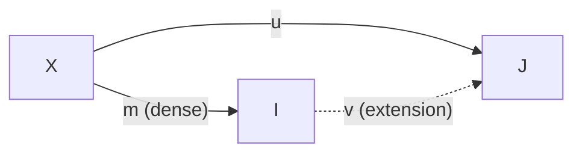
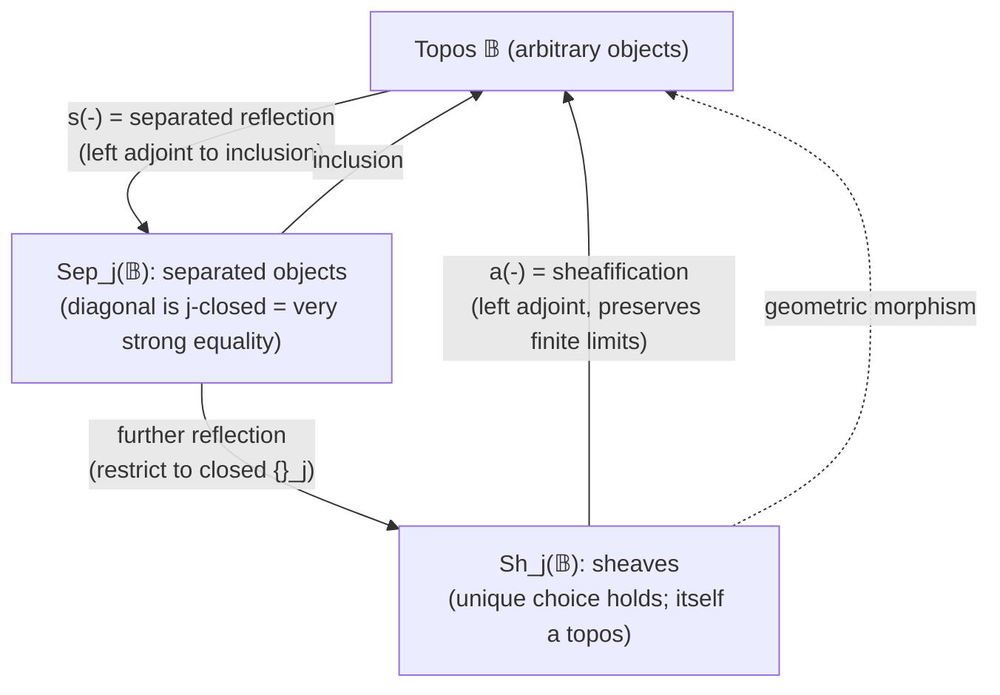

[[book-guidelines|↩ Back to guidelines]]

# Nuclei, Separated Objects, and Sheaves

## The problem: not every proposition deserves to be classical

Everything up to this point in the book has treated the subobject classifier $\Omega$ of a topos as *the* truth-value object — a proposition about $I$ is a subobject of $I$, and "true" and "false" behave, internally, the way a Heyting algebra says they should. But a topos's internal logic is intuitionistic by default, and even that full internal logic is sometimes *too fine-grained* for what you actually want to reason about.

Here's the concrete failure mode. Suppose you have a notion of "these two things are the same" that is more permissive than literal equality — two Cauchy sequences that converge to the same real number, two open covers that generate the same topology, two partial functions that agree wherever both are defined. Ordinary categorical equality (the diagonal $\delta: J \rightarrowtail J \times J$) is too strict: it only relates an element to itself. You want a *coarser* notion of "the same," and you want to identify exactly which objects are well-behaved enough that this coarser equality still lets you speak sensibly of "the" element satisfying a condition, rather than a haze of extensionally-equivalent candidates.

A second, dual failure mode: some objects are so extensional that even a *partial* answer determines a unique global answer. Real analysis works this way — if you know a continuous function's values on a dense subset, you know it everywhere. Sheaf theory formalizes exactly this: given consistent local data, is there a unique global datum extending it? This section builds the categorical machinery for both problems at once: a *nucleus* singles out which subobjects count as "well-approximated by dense data," and then classifies objects into three tiers — arbitrary objects, **separated objects** (partial data has *at most one* consistent extension), and **sheaves** (partial data has *exactly one*).

This is not idle generalization. The book flags upfront (p. 360) that Chapter 6's *effective topos* — the topos used to model realizability semantics — recovers ordinary $\mathbf{Sets}$ as its sheaves and $\omega$-**Sets** (assemblies) as its separated objects, both with respect to the double-negation nucleus. So this machinery is the precise technical bridge between "an exotic realizability topos" and "the sets and typed data structures you already know."

## §5.6 Nuclei: a controlled closure operator on truth values

### What a nucleus is, and why three equations

A **nucleus** (also called a **Lawvere–Tierney topology**) is a map $j: \Omega \to \Omega$ satisfying three equations (Def. 5.6.1):

$$
j \circ \mathsf{true} = \mathsf{true}, \qquad j \circ j = j, \qquad j \circ \wedge = \wedge \circ (j \times j).
$$

In words: $j$ fixes truth, is idempotent, and distributes over conjunction. Read $j(\varphi)$ as "$\varphi$ holds modulo the equivalence I've decided to care about" — a *closure operator* on propositions. The three axioms are exactly the axioms of a closure operator on a Heyting algebra (monotone, extensive, idempotent) restricted to the case where you also want it compatible with "and."

If you know Galois connections and abstract-interpretation lattices, this should look immediately familiar: **a nucleus is precisely an abstraction/closure operator on the lattice of propositions**, in the same sense that a Galois-connection-induced closure operator on a program's concrete state lattice defines an abstract domain. $j$ is monotone (it's a map of Heyting algebras respecting $\wedge$), it's extensive in effect (idempotent + fixes $\mathsf{true}$ forces $\varphi \leq j(\varphi)$ — see Exercise 5.6.6's frame-theoretic phrasing: $x \le j(x)$, $j(j(x)) \le j(x)$, $j(x \wedge y) = j(x) \wedge j(y)$), and idempotent by definition. If you've built abstract domains for reachability analysis, this is the same shape of object, just living in $\Omega$ instead of a powerset lattice.

**What breaks without this.** Without a nucleus you're stuck with exactly one notion of "true" — literal, intuitionistic truth in $\Omega$. You can't express "true up to the equivalence I care about" internally; you'd have to hand-roll a quotient every single time, external to the logic. The nucleus internalizes the closure operation itself as a morphism, so the topos's *own* internal language can quantify over and reason about it.

### The double-negation nucleus

The nucleus you'll actually use is double negation, $\neg\neg: \Omega \to \Omega$ (Example 5.6.2). Negation $\neg$ is defined as the unique map making
$$
\begin{array}{ccc}
1 & \xrightarrow{\ \mathsf{false}\ } & \Omega \\
\| & & \downarrow \neg \\
1 & \xrightarrow{\ \mathsf{true}\ } & \Omega
\end{array}
$$
a pullback. Since $\Omega$ is internally a Heyting algebra, $\neg\neg\,\mathsf{true} = \mathsf{true}$ and $\neg\neg\neg\neg\varphi = \neg\neg\varphi$ come for free from Heyting-algebra identities. The one nontrivial fact — that $\neg\neg\varphi \wedge \neg\neg\psi \vdash \neg\neg(\varphi \wedge \psi)$ — needs an actual sequent-calculus derivation (the book gives one, p. 355), because intuitionistically $\neg\neg$ does *not* distribute over $\wedge$ for free the way it does classically.

This is the nucleus that will later force *classical* logic onto a sub-theory of an otherwise intuitionistic topos (Lemma 5.6.8, below) — the mechanism by which [[The-Effective-Topos|the effective topos]]'s "sets" behave classically even though the ambient realizability topos does not.

### Closure of a subobject; closed and dense

For a subobject $m: X \rightarrowtail I$ with characteristic map $\mathrm{char}(m): I \to \Omega$, define its **$j$-closure** $\overline{m}: \overline{X} \rightarrowtail I$ by pulling back $\mathsf{true}: 1 \to \Omega$ along $j \circ \mathrm{char}(m)$ (Notation 5.6.4). Then:

- $X \rightarrowtail I$ is **closed** if $\overline{X} = X$ (the subobject already contains everything $j$ would add).
- $X \rightarrowtail I$ is **dense** if $\overline{X} = I$ (its $j$-closure is everything — nothing is "detectably outside" $X$ modulo $j$).

Closure commutes with pullback (Lemma 5.6.5(i)) — $u^*(\overline{n}) = \overline{u^*(n)}$ — which is exactly why closed and dense subobjects are stable under reindexing, the technical property that lets you build a *fibration* out of them.

**Rust framing.** Think of $j$-closure the way you'd think of a `.canonicalize()` or `.normalize()` step in a compiler pass: it maps a syntactic/structural predicate to a semantically-saturated one, is a no-op on inputs already saturated (idempotent), and commutes with substitution/renaming (the pullback-stability). If you've ever written a fixpoint worklist algorithm that closes a set of facts under some inference rule until nothing new is derivable, that closure operator is a nucleus-shaped construction, just concretely realized on finite sets rather than internally in $\Omega$.

```rust
// A closure operator in the nucleus sense: monotone, extensive, idempotent,
// and compatible with meet (here: set intersection of "facts").
trait Nucleus<Fact: Eq + Clone> {
    fn close(&self, facts: &[Fact]) -> Vec<Fact>; // extensive + idempotent
}

// closed:  close(S) == S      (already saturated)
// dense:   close(S) == everything (nothing detectably missing)
```

### Nuclei ↔ Grothendieck topologies

For a presheaf topos $\mathbf{C} = \mathbf{Sets}^{\mathbf{C}^{op}}$, a nucleus $j$ corresponds exactly to a **Grothendieck topology** $J$ on $\mathbf{C}$ (Example 5.6.3) — an assignment, to each object $X$, of a set $J(X)$ of *sieves* (downward-closed collections of maps into $X$) satisfying:

- **Identity**: the maximal sieve $M_X = \{f \mid \mathrm{cod}(f) = X\}$ is in $J(X)$.
- **Stability**: if $S \in J(X)$ and $f: Y \to X$, then $f^*(S) \in J(Y)$.
- **Transitivity**: if $S \in J(X)$ and, for every $f: Y \to X$ in $S$, $f^*(R) \in J(Y)$, then $R \in J(X)$.

$(\mathbf{C}, J)$ is a **site**; elements of $J(X)$ are **covers**. This is the categorical generalization of "an open cover of a topological space": the two worked examples in the book are exactly this —

1. The **sup topology** on a frame $A$ (in particular $A = \mathcal{O}(X)$ for a space $X$): a family of opens covers $U$ if their union is $U$.
2. The **regular epi topology** on a regular category: the covers of $A$ are singleton sets $\{f: Y \twoheadrightarrow A\}$ where $f$ is a regular epi.

The upshot: "nucleus on a topos" and "Grothendieck topology on a site" are the *same data*, viewed from two different angles — algebraic (a closure operator on $\Omega$) versus combinatorial (which families of maps count as jointly-surjective). Standard sheaf theory on a topological space is the special case where the topos is $\mathbf{Sets}^{\mathcal{O}(X)^{op}}$ (presheaves on the open-set poset) with the sup topology.

### Closed subobjects form a higher-order fibration

Proposition 5.6.6 is the section's technical payoff: the fibration $\mathsf{ClSub}_j(\mathbb{B}) \to \mathbb{B}$ of $j$-closed subobjects is itself a **higher-order fibration** — it has all the logical connectives ($\top, \wedge, \Rightarrow, \forall$ as for ordinary subobjects), plus:

$$
\bot_j = \overline{\bot}, \qquad X \vee_j Y = \overline{X \vee Y}, \qquad \Sigma_j(X) = \overline{\Sigma(X)}, \qquad \mathrm{Eq}_j(X) = \overline{\mathrm{Eq}(X)},
$$

and $\mathsf{true}: 1 \rightarrowtail \Omega_j$ (where $\Omega_j$ is the equalizer of $j$ and $\mathrm{id}_\Omega$) is a split generic object. In plain terms: **you can do full higher-order logic using only $j$-closed predicates**, with disjunction, existential quantification, and equality all redefined as "ordinary version, then close." This is what makes the double-negation-closed fragment of a topos behave like a self-contained logical universe — and (Lemma 5.6.8) for $j = \neg\neg$ specifically, that universe is *classical*: $\neg\neg X = X$ holds identically for closed $X$, i.e. double-negation elimination is valid there even though it fails for arbitrary (non-closed) propositions in the ambient topos.

A map $u: I \to J$ is called **almost monic** if it's internally injective with respect to this closed-subobject logic (equivalently: the diagonal's closure equals the kernel pair of $u$, i.e. $u$'s kernel pair is *dense* over the actual diagonal); **almost epic** if internally surjective (the mono part of its image factorization is dense); **bidense** if both. These are the maps that a nucleus is willing to treat as "as good as an isomorphism" — the precise technical notion sheafification will later collapse to actual isomorphisms.

## §5.7 Separated objects and sheaves

### Dense partial maps and extensions

A **partial map** $I \rightharpoonup J$ is a span $I \xhookleftarrow{m} X \xrightarrow{u} J$ with $m$ mono; it's **dense** if $m$ is a dense subobject. An **extension** of $(m, u)$ is a total map $v: I \to J$ with $v \circ m = u$ — literally, filling in the dashed arrow:



- $J$ is **separated** if every dense partial map into $J$ has **at most one** extension.
- $J$ is a **sheaf** if every dense partial map into $J$ has **exactly one** extension.

This is literally the classical sheaf condition restated at the abstraction level of an arbitrary topos: given consistent data on a "dense enough" subobject, is there a — and is there at most a — unique way to extend it to the whole object? Spelling this out for presheaves recovers the textbook definition exactly (p. 361): a matching family of sections over a cover glues to a unique global section.

**What breaks without separation.** Take an object where two genuinely different global elements agree on every dense subobject — dense data underdetermines the global answer, so you cannot recover "the" element from local information even in principle. That's an object failing to be separated. Take an object where consistent local data exists but *doesn't* glue to anything global — that's separated (no ambiguity when it does extend) but not a sheaf (existence fails). Sheaves are the objects where local-to-global reconstruction is total *and* deterministic.

### The Main Theorem, part 1: separated ⟺ diagonal closed ⟺ very strong equality

Lemma 5.7.3(i): **$J$ is separated iff the diagonal $\delta(J): J \rightarrowtail J \times J$ is $j$-closed.** The book calls this "equality on $J$ is *very strong*" in the fibration of closed subobjects — internal equality (computed via $\mathrm{Eq}_j$, i.e. closure of the diagonal) coincides with external, actual equality (the literal diagonal), with no closure needed. If you've internalized the language of subset types (`{x : J // P x}` in Rust-refinement-type terms, `{x // P x}` set-builder in Lean), "[[Equational-Logic#Very strong equality|very strong equality]]" says: **the canonical map $J \to \{x, y : J \mid x =_j y\}$ is an isomorphism** — there's no slack between "provably equal up to the nucleus" and "actually the same term."

This is the sharpest point of contact with the compiler/elaborator project in these learning goals, even though the ambient topos-theoretic apparatus is not: **"very strong equality" is exactly the property you want definitional equality to have relative to your unifier's notion of equivalence.** If your elaborator's `isDefEq` check (its own $j$-like closure — reduction, unfolding, eta) ever identifies two syntactically distinct normal forms that a downstream pass then treats as literally interchangeable without justification, you've built a nucleus whose closed diagonal is *not* the real diagonal — i.e., a non-separated notion of term equality. The book's diagonal-closedness criterion is a clean, checkable specification for "this equivalence relation on terms is safe to treat as equality."

### The $j$-singleton map, and $s(-)$/$a(-)$ as left adjoints

Define $\mathcal{P}_j(I) = \Omega_j^I$ (closed-predicate "power object") and the **$j$-singleton map** $\{-\}_j: I \to \mathcal{P}_j(I)$, the internal map sending $x$ to "the $j$-closed predicate $\{x\}$." Lemma 5.7.5 characterizes the tiers exactly by this one map:

- $I$ is **separated** $\iff$ $\{-\}_j: I \to \mathcal{P}_j(I)$ is **mono**.
- $I$ is a **sheaf** $\iff$ $\{-\}_j: I \to \mathcal{P}_j(I)$ is a **closed mono**.

This gives a completely constructive route to the reflections (Definition 5.7.6 / Theorem 5.7.7): factor $\{-\}_j$ as epi-then-mono,
$$
I \xrightarrow{e_I} s(I) \rightarrowtail \mathcal{P}_j(I),
$$
and $s(I)$ — the image of the singleton map — is the **separated reflection**. Then take the $j$-*closure* of that mono inside $\mathcal{P}_j(I)$ to get $a(I)$, the **sheafification**. Both assignments are functorial (using $\mathcal{P}_j$'s functoriality) and, crucially,

$$
s(-) \dashv (\mathsf{Sep}_j(\mathbb{B}) \hookrightarrow \mathbb{B}), \qquad a(-) \dashv (\mathsf{Sh}_j(\mathbb{B}) \hookrightarrow \mathbb{B}).
$$

So separated-reflection and sheafification are the *best approximations from below* of an arbitrary object by a separated object / sheaf — exactly the universal-property shape you'd expect from "quotient by an equivalence relation," except landing in a subcategory rather than a quotient object. **Sheafification preserves finite limits** (Lemma 5.7.8) — this is what makes it well-behaved enough to build a new topos out of.

### Geometric morphisms vs. logical morphisms

The adjunction $\mathsf{Sh}_j(\mathbb{B}) \rightleftarrows \mathbb{B}$ is an instance of a **geometric morphism**: an adjoint pair $(F^*, F_*)$ between [[Toposes|toposes]] where the left adjoint $F^*$ (the "inverse image") preserves finite limits. This is deliberately a *different* notion from the **logical morphism** of Definition 5.4.1 (a functor strictly preserving the topos structure — finite limits, exponentials, $\Omega$ on the nose). Geometric morphisms are weaker but far more common in practice: sheafification, and any continuous map of topological spaces (via pushforward/pullback of sheaves), are geometric morphisms that are essentially never logical morphisms. The book flags (Remark 5.7.10) that geometric morphisms are the backbone of functorial semantics for *geometric logic* — logic restricted to $\wedge$, $\vee$, and $\exists$, the fragment stable under inverse image.

$\mathsf{Sh}_j(\mathbb{B})$ being a topos in its own right (Corollary 5.7.12) — with, for $j = \neg\neg$, *classical* internal logic — is the mechanism that lets you "carve a classical universe out of an intuitionistic one": take the sheaves for double negation, and you land back in ordinary two-valued reasoning, inside an ambient topos that need not have been two-valued at all.

## §5.8 The logical description: very strong equality and unique choice

Section 5.8 restates the previous section's results purely in terms of the internal-language vocabulary developed in Chapter 4 (subset types, very strong equality, unique choice — recall from Exercise 4.9.1 that a subobject fibration is characterized by exactly these three properties: [[Subset-Types-and-Quotient-Types#Full subset types|full subset types]], very strong equality, and unique choice). A **functional relation** $R: I \to J$ in the closed-subobject fibration is a predicate $R(i, j)$ that is:

- **single-valued**: $i, j, j' .\ R(i,j) \wedge R(i,j') \vdash j =_j j'$
- **total**: $i .\ \top \vdash \exists j.\ R(i,j)$

**Unique choice** on $J$ holds when every such single-valued (not necessarily total) relation's canonical map $\{R\} \to \{\Sigma_j(R)\}$ is an isomorphism — i.e. a functional graph really does pick out a unique function, with no extra identifications or gaps.

**Main Theorem (5.8.2).**
$$
J \text{ is separated} \iff \text{equality on } J \text{ is very strong (in } \mathsf{ClSub}_j\text{)}, \qquad J \text{ is a sheaf} \iff \text{unique choice holds on } J.
$$

This closes the circle: separated objects and sheaves are not *ad hoc* gluing conditions — they are precisely the objects for which the closed-subobject fibration satisfies the two extra axioms (beyond subset types) that make a fibration into a genuine *subobject fibration*. Restricting to sheaves turns the fibration of $j$-closed subobjects into an actual subobject fibration on $\mathsf{Sh}_j(\mathbb{B})$ — giving a second, purely logical proof that $\mathsf{Sh}_j(\mathbb{B})$ is a topos, independent of the more computational route through Proposition 5.6.6.

**Where this echoes the standing project.** "Single-valued and total" is exactly the specification of a function's graph in a Horn-clause / CHC encoding: a relation $R(i, j)$ used as a transfer function is well-formed as a function precisely when it's provably functional (single-valued) and provably total (covers every input) — the same two side-conditions a CHC solver or an abstract-interpretation transfer-function synthesizer has to discharge before treating a synthesized relation as an actual function summary. The book's "unique choice" is the topos-theoretic name for "this relation is safe to skolemize into a function."

## Structural picture



## Where this leads

The double-negation nucleus built here is exactly the tool Chapter 6 uses to dissect the **effective topos** $\mathrm{Eff}$: ordinary $\mathbf{Sets}$ turns out to be $\mathsf{Sh}_{\neg\neg}(\mathrm{Eff})$ (the sheaves), and $\omega$-**Sets** — the category of assemblies used to model realizability — turns out to be $\mathsf{Sep}_{\neg\neg}(\mathrm{Eff})$ (the separated objects). That identification is only legible once you know, precisely, what "separated" and "sheaf" mean and why they're the fixed points of $s(-)$ and $a(-)$ — which is exactly what this section built. The classicality result (Lemma 5.6.8, $\neg\neg X = X$ on closed subobjects) is also the reason ordinary set theory can sit classically *inside* an intuitionistic realizability universe: it's not an accident or an approximation, it's a theorem about which nucleus you closed under.

Beyond that direct dependency, the material here is fairly self-contained algebraic geometry / topos theory with only a thin, structural connection to the Rust dependent-type-compiler project — the genuine points of contact are the ones flagged above (nuclei as closure operators, in the same shape as abstract-interpretation domain closures; very strong equality as a specification for safe definitional-equality checking; unique choice as the functional/totality side-conditions a CHC or refinement-type solver must verify before skolemizing a relation into a function). Treat those as useful analogies to carry forward, not as machinery you'll implement directly.
