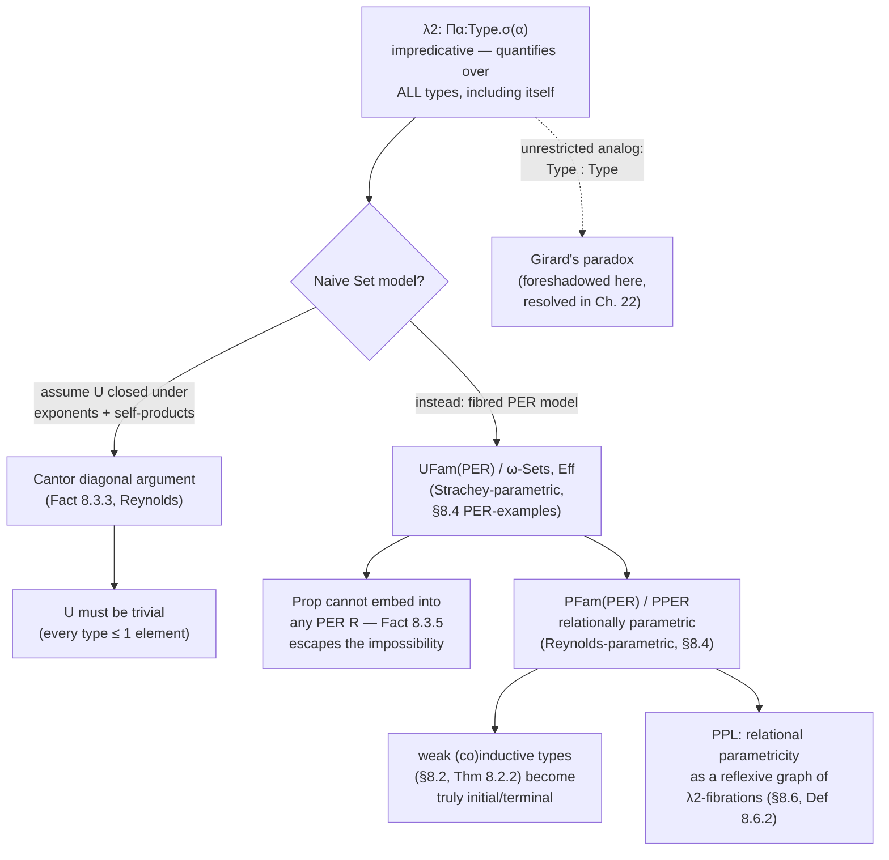

[[book-guidelines|↩ Back to guidelines]]

# Polymorphic Type Theory

## Why simple types run out of road

[[Simple-Type-Theory|Simple type theory]] gives you an identity function on `bool`, another on `int`, another on `list<char>` — one term per type, each a syntactically distinct thing you have to write again. There is no term `identity : ∀α. α → α` you write *once* and instantiate everywhere; the arrow type $\sigma \to \sigma$ is fixed the moment you write it down, because $\sigma$ is not a variable, it's a fully-resolved atomic type. A sort function, similarly, has to be written once for `Vec<i32>` and again for `Vec<String>`, unless the language lets you abstract over the *type itself*, not just over values.

That's the gap Chapter 8 closes. Polymorphic type theory (PTT) adds a second axis of variables — type variables $\alpha,\beta,\gamma,\dots$, alongside the term variables $x,y,z,\dots$ of simple type theory — so you can write

$$
I = \lambda\alpha\!:\!\mathrm{Type}.\, \lambda x\!:\!\alpha.\, x \;:\; \Pi\alpha\!:\!\mathrm{Type}.\,(\alpha \to \alpha)
$$

once, and get $I\,\sigma : \sigma \to \sigma$ for any $\sigma$ by application — exactly a generic function in Rust (`fn id<T>(x: T) -> T`) or a universally quantified type in Lean (`fun (α : Type) (x : α) => x : ∀ α, α → α`). This is *the* mechanism your bidirectional elaborator will need: `∀α. σ` is a kind of universal type, and instantiating it at a concrete type is a metavariable-free special case of the same "solve for the argument" machinery that Miller pattern unification generalizes for implicit arguments. Get comfortable with $\Pi\alpha\!:\!\mathrm{Type}.\sigma$ here; it is the ancestor of `Πα:Type. σ` handling in a dependently-typed kernel.

But this power is not free. Quantifying "over all types, including this one" — $\Pi\alpha\!:\!\mathrm{Type}.\,\sigma(\alpha)$ ranges over every type in the universe, and $\sigma(\alpha)$ built from $\Pi$ is itself a type in that universe — is *impredicative*. Section 8.3 shows this impredicativity is not just philosophically uncomfortable, it is mathematically **inconsistent with naive set-theoretic semantics**: there is no non-trivial set of sets closed under exponents and self-indexed dependent products (Reynolds' theorem). This single fact is why the rest of the chapter — and much of Chapters 9–11 — exists: you need [[Fibred-Category-Theory|fibred category theory]], not naive `Set`, to model a language with `∀`.

## 8.1 — Syntax: three calculi, two levels of indexing

### The two-level picture: kinds over types over terms

STT has one indexing axis: term variables in a context $\Gamma$. PTT doubles it. Now there's a **kind context** $\Xi = (\alpha_1{:}A_1,\dots,\alpha_n{:}A_n)$ binding type variables to kinds, sitting *above* the ordinary **type context** $\Gamma = (x_1{:}\sigma_1,\dots,x_m{:}\sigma_m)$ binding term variables to types. A well-formed judgment carries both:

$$
\alpha_1{:}A_1,\dots,\alpha_n{:}A_n \mid x_1{:}\sigma_1,\dots,x_m{:}\sigma_m \;\vdash\; M : \tau
$$

with the bar `|` separating the two levels — visually the same separator predicate logic used between type context and proposition context (Chapter 3). This is exactly the shape of a compiler's symbol table split into a *generic-parameter environment* (`<T, U>`) and a *value environment* (`x: T, y: U`) — a Rust type-checker literally carries two nested scopes for this reason. In the language of this book's standing project: $\Xi$ is your elaborator's **kind context**, tracking which metavariables/type-parameters are in scope and at what kind, exactly parallel to how a term context tracks which term-level variables are in scope and at what type.

There are two connected simple type theories here: one of kinds (with `Type` as an object) and one of types (with terms as inhabitants) — connected because a type $\sigma{:}\mathrm{Type}$ is *itself* a term of the distinguished kind `Type : Kind`, just as in higher-order logic a proposition $\varphi{:}\mathrm{Prop}$ is a term of type `Prop : Type`. This single axiom `⊢ Type : Kind` is, categorically, a **generic object** — a distinguished object $\Omega$ in the base category such that types over a kind context $I$ correspond exactly to classifying maps $I \to \Omega$ (a fibred Yoneda-style correspondence, echoing the generic object of Chapter 5's higher-order logic).

### Three calculi

| Calculus | Kinds | Extra type formers | What breaks without it |
|---|---|---|---|
| $\lambda^{\to}$ (first order) | only `Type` | $1,\ \sigma\times\tau,\ \sigma\to\tau$ | you can substitute a type variable into `α → α`, but you can never *bind* `α` inside a term — no way to write `fn id<T>` itself, only its instantiations |
| $\lambda2$ (second order / System F) | only `Type` | $+\ \Pi\alpha{:}\mathrm{Type}.\sigma,\ \Sigma\alpha{:}\mathrm{Type}.\sigma$ | without $\Pi$ you cannot express "for every type" as a single term; without $\Sigma$ you cannot hide an implementation type (no abstract data types, no existential encapsulation) |
| $\lambda\omega$ (higher order) | many kinds, closed under $\times,\to$ | all of the above, over *any* kind, not just `Type` | without kinds-of-kinds you cannot quantify over *type constructors* like `List` or `Option`, which themselves have kind `Type → Type` — this is exactly Rust's higher-kinded-type gap (no `impl<F: * -> *>`) |

$\lambda2$'s new formation and term rules:

$$
\frac{\Xi,\alpha{:}\mathrm{Type} \vdash \sigma : \mathrm{Type}}{\Xi \vdash \Pi\alpha{:}\mathrm{Type}.\sigma : \mathrm{Type}}
\qquad
\frac{\Xi,\alpha{:}\mathrm{Type}\mid\Gamma \vdash M{:}\sigma}{\Xi\mid\Gamma \vdash \lambda\alpha{:}\mathrm{Type}.M : \Pi\alpha{:}\mathrm{Type}.\sigma}\ (\alpha \notin \Gamma)
$$

$$
\frac{\Xi\mid\Gamma \vdash M : \Pi\alpha{:}\mathrm{Type}.\sigma \qquad \Xi \vdash \tau{:}\mathrm{Type}}{\Xi\mid\Gamma \vdash M\tau : \sigma[\tau/\alpha]}
$$

and dually for $\Sigma$ with `unpack z as (α, x) in N` (also written `let (α,x) := z in N`). In Rust terms: $\Pi\alpha{:}\mathrm{Type}.\sigma$ is a generic function type `fn<T>() -> σ[T]`, application is monomorphization/instantiation, and $\Sigma\alpha{:}\mathrm{Type}.\sigma$ is `Box<dyn Trait>` or an existential type `impl Trait` — a hidden concrete type paired with an interface. In Lean, `Πα : Type, σ` *is* the literal syntax for a dependent Pi-type whose domain happens to be `Type`, no separate mechanism needed — Lean doesn't distinguish $\lambda2$ from $\lambda\to$; both fall out of one dependent Pi former, quantifying over the universe `Type` like any other type.

Exercise 8.1.1 is worth internalizing directly: the untypeable-in-STT self-application term $\lambda x. x\,x$ *is* typeable in $\lambda2$, as $\Pi\alpha{:}\mathrm{Type}.(\Pi\beta{:}\mathrm{Type}.\beta)\to\alpha$ — because you can quantify away the circularity that broke simple types.

### Polymorphic signatures

A **polymorphic signature** $(\Sigma, (\Sigma_{\mathbf a}))$ (Def. 8.1.1) is two connected levels: a higher-order signature $\Sigma$ of atomic *kinds* (e.g. `List : Type → Type`, `Tree : Type, Type → Type`), plus, for every sequence of kinds $\mathbf a$, an ordinary signature $\Sigma_{\mathbf a}$ of *type-level function symbols* built in that kind context (e.g. `nil : 0 → List(α)`, `cons : α, List(α) → List(α)` over the single-variable context $\alpha{:}\mathrm{Type}$). This is a compiler's declaration of a generic type constructor plus its associated data constructors — think Rust's `enum List<T> { Nil, Cons(T, List<T>) }` split into "the type-level shape `List : Type → Type`" and "the term-level constructors indexed by `T`."

### Equality types

$\mathrm{Eq}_A(\sigma,\tau) : \mathrm{Type}$ for $\sigma,\tau : A$ internalizes equality of terms of kind $A$ — the same Lawvere-style internal equality seen in [[Equational-Logic|equational logic]] (Chapter 3), just one level up. Introduction gives reflexivity $r_A(\sigma) : \mathrm{Eq}_A(\sigma,\sigma)$; elimination is a substitution ("with β = α via z") principle. Lemma 8.1.2 derives symmetry, transitivity and replacement combinators purely from this one rule — exactly how Lean's kernel derives `Eq.symm`/`Eq.trans` from `Eq.rec` (the eliminator) rather than taking them as primitives. This is a direct, load-bearing preview of `isDefEq`: the elimination rule *is* the categorical shadow of what a kernel's definitional-equality checker implements operationally.

### Propositions-as-types, one level up

Chapter 8 restates Curry–Howard for the polymorphic setting: predicate-logic *propositions* correspond to PTT *types*, and logic's *types* correspond to PTT's *kinds* (with $\mathrm{Prop} = \mathrm{Type}$, $\mathrm{Type} = \mathrm{Kind}$ at the meta-level). $\forall x{:}\sigma.\varphi$ and $\exists x{:}\sigma.\varphi$ become $\Pi\alpha{:}\sigma.\varphi$ and $\Sigma\alpha{:}\sigma.\varphi$. The book states the full correspondence formally: a sequent is derivable in higher-order predicate logic iff there is an inhabiting term in $\lambda\omega$. This is *the* precise sense in which higher-order logic and $\lambda\omega$ are the same system read two ways — proof search in one is type inhabitation in the other, the theoretical bedrock under any "verification condition ⟷ proof term" pipeline you'd build for a proof-producing kernel.

## 8.2 — Use: ML polymorphism, encoding data types, encapsulation

### ML-style ("let") polymorphism vs. explicit $\lambda2$

ML restricts $\Pi$-quantification to **type schemes** $\Pi\alpha{:}\mathrm{Type}.\sigma$ that occur only "on the outside" — bindable by `let`, not by `λ`. The crucial asymmetry: `let f = λx. x in f f` type-checks (`f` gets the *scheme* $\Pi\alpha.\alpha\to\alpha$, each use of `f` instantiated separately), but `λf. λx. λy. if (f x) < 100 then (f y) else 100` **cannot** give `f` a $\Pi$-type, because `f` is $\lambda$-bound — you'd need a $\Pi$-type *inside* a function argument, which ML forbids (rank-1 polymorphism). This is precisely the difference between Rust generics (parametric at the function-definition boundary, `fn foo<T>(f: impl Fn(T) -> T)` won't let you actually call `f` at two different types inside one monomorphic instantiation) and full System F where a function can take a *genuinely* polymorphic argument. It is exactly the rank-1-vs-rank-n polymorphism boundary that shows up in Hindley–Milner-based inference (why Haskell needs `RankNTypes` / `forall` annotations to go beyond ML). For your elaborator: ML-style let-polymorphism is decidable to *infer* (Algorithm W) precisely because generalization only happens at `let`-boundaries; full $\lambda2$-style explicit polymorphism (instantiation sites written by hand, as `f τ`) sidesteps inference but demands the programmer supply type applications — the same trade-off Lean resolves via elaboration with metavariables standing in for the omitted `τ`.

### Encoding inductive/co-inductive types via weak (co)initiality

This is the chapter's most concrete payoff. A **Hagino signature** $\Xi, X{:}\mathrm{Type} \vdash \sigma(X){:}\mathrm{Type}$ (built from products/coproducts, with a distinguished variable $X$) gives rise, by substitution, to an endofunctor $\sigma[-/X]$ on the category of types-in-context (Lemma 8.2.1) — the same "signature → polynomial functor" translation from Chapter 2, but now the substitution happens through type variables rather than an external construction.

**Theorem 8.2.2**: in $\lambda2$, every such functor has both a *weakly* initial algebra and a *weakly* terminal co-algebra — always, no extra axioms needed. [[First-Order-Predicate-Logic#The construction|The construction]] for the initial algebra is the celebrated Church-encoding trick:

$$
T_0 = \Pi X{:}\mathrm{Type}.\,(\sigma(X)\to X)\to X, \qquad \mathrm{constr} = \lambda x{:}\sigma[T_0/X].\,\lambda X.\lambda y{:}\sigma(X)\to X.\, y(\sigma[(\lambda z. zXy)/X]\,x).
$$

Specializing $\sigma(X) = 1+X$ (the naturals functor) recovers exactly the Church numerals $\mathrm{Nat} = \Pi\alpha{:}\mathrm{Type}.(\alpha\to\alpha)\to\alpha\to\alpha$: this is the type-theoretic justification for why Church encoding "just works" as a definition of natural numbers, not a coincidence. Dually, $\Sigma X{:}\mathrm{Type}.\,X\times(X\to\sigma(X))$ gives a weakly terminal co-algebra, instantiated for $\sigma(X)=\alpha\times X$ to give co-recursive `stream(α)` with `head`/`tail` destructors.

**"Weak" is the key word — what breaks without more**: the mediating morphism exists but is *not unique*. Categorically that's the difference between an initial algebra (unique mediating map, gives you an *induction principle* — you can prove properties by structural induction) and a merely weakly-initial one (you get a recursor but not induction). This is exactly the gap between an inductive type defined by a raw Church encoding (weak, no free induction principle) and one defined via Lean's/Coq's native `inductive` mechanism (strict initiality, comes with `.rec` *and* the induction tactic for free). The chapter flags (and Exercise 8.4.5 develops) that under **relational parametricity** the weak initiality upgrades to strict — a first hint of why parametricity matters beyond elegance: it is what makes Church-encoded data actually behave like real inductive types.

### Encapsulation via $\Sigma$

A signature of $n$ atomic types and $m$ operations packs into one $\Sigma$-type — $\Sigma\alpha_1{:}\mathrm{Type}.\cdots.\Sigma\alpha_n{:}\mathrm{Type}.\,(\sigma_1\to\tau_1)\times\cdots$ — and an instantiation is `unpack`ed with `abstype α with e:α, m:α×α→α is z in N`. This is literally an existential type used as a module/interface boundary: Rust's `Box<dyn Trait>` or an OCaml/ML module signature, where the *implementation* type is hidden from client code and only the operations are visible. The chapter notes explicitly that you cannot yet express equational laws like `m(x,e) = x` inside this system — that needs a *logic over* polymorphic type theory (Section 8.6's payoff).

## 8.3 — Naive set-theoretic semantics, and why it fails

### The setup, and where the double indexing shows up

A naive model interprets `Type` as some set of sets $\mathcal{U}$; a type $\alpha{:}A \vdash \sigma(\alpha){:}\mathrm{Type}$ becomes a function $\llbracket A\rrbracket \to \mathcal{U}$; a term becomes a "doubly-indexed" dependent function — once over the type-variable instantiation, once over the term-variable instantiation. This works cleanly for $\lambda^\to$: you just need $\mathcal U$ closed under exponents. It's for $\lambda2$ that trouble starts: interpreting $\Pi\alpha{:}\mathrm{Type}.\sigma(\alpha)$ naively requires $\mathcal{U}$ closed under **dependent products over itself** — for every $F : \mathcal{U} \to \mathcal{U}$, the set $\Pi F = \{f : \mathcal{U} \to \bigcup_{X\in\mathcal U} X \mid \forall X.\, f(X)\in F(X)\}$ must again be a member of $\mathcal{U}$.

### The impossibility results

**Fact 8.3.2 (Freyd)**: there is no small complete category except a preorder — proved by an injection $P(C_1) \hookrightarrow C_1$ argument (a powerset into a hom-set), which Cantor forbids. Reynolds' theorem is the same trick one level up:

**Fact 8.3.3 (Reynolds)**: there is no set of sets $\mathcal U$ closed under exponents and self-indexed dependent products except a *trivial* one (every $X \in \mathcal U$ has at most one element). The proof: assuming some $X$ has two elements, build $D = \prod_{Z\in\mathcal U} X^Z$ and $V = \coprod_{Z\in\mathcal U} Z$; there's an obvious injection $D \hookrightarrow V$, but for every subset $A \subseteq V$ you can *also* build an element $h(A) \in D$ by a diagonal argument, giving an injection $\mathcal P(V) \hookrightarrow D \hookrightarrow V$ — Cantor's theorem forbids that. **What breaks concretely**: if you tried to give System F a naive-`Set` denotational semantics — model every type as literally a set, $\Pi\alpha.\sigma(\alpha)$ as literally "the set of all functions picking a compatible element from each $\sigma(X)$" — the model collapses to sets with at most one element. Second-order polymorphism, taken at face value in classical set theory, is *inconsistent* with having more than trivial types.

**Proposition 8.3.4** restates the *logical* essence: there is no injection $P\sigma \hookrightarrow \sigma$ (powertype into a type) in higher-order logic, proved by a self-referential Russell/Cantor-style diagonal term $a = \{x{:}\sigma \mid \exists b{:}P\sigma.\, x \in_{\sigma} b \wedge x\notin_{\sigma}m(b)\}$; assuming $m: P\sigma \hookrightarrow \sigma$ leads to $e \in a \iff e\notin a$ for $e=m(a)$. **Fact 8.3.5** generalizes this: any model of higher-order logic with an object-level embedding $\mathrm{Prop}\hookrightarrow\sigma$ is impossible. This is the deep reason: it's not classical logic per se that's the problem (regular subobjects of $\omega$-Sets are also classical, and *do* support polymorphism — Remark 8.3.6(ii)), it's specifically that `Prop` cannot embed into any type. PER models escape because there genuinely is no monomorphism $\mathrm{Prop} \hookrightarrow R$ for a PER $R$ — in $\omega$-Sets, `Prop` is $\nabla 2$ and every map $\nabla 2 \to (\mathbb N/R, \in)$ is forced constant by realizability tracking; in $\mathrm{Eff}$, `Prop = PN` (all subsets of $\mathbb N$, encoded by their characteristic realizers) and the same constancy argument applies. This is why the chapter next reaches for fibred PER models rather than patching naive sets.

## 8.4 — Fibred semantics for polymorphism

### Polymorphic fibrations, and the three flavors

A **polymorphic fibration** (Def. 8.4.1) is a fibration with a generic object, fibred finite products, and finite products in the base — the base category's objects are kinds, the fibre over a kind-context object is its types-in-context, and the generic object is what turns `⊢ Type : Kind` into a categorical universal property (types over $I$ correspond to maps $I \to \mathrm{Type}$ in the base, the same fibred-Yoneda idea as Chapter 5's generic objects for `Prop`).

Layering on structure gives (Def. 8.4.3):

- **$\lambda^\to$-fibration**: polymorphic fibration + fibred exponents.
- **$\lambda2$-fibration**: + **simple $\Omega$-products/coproducts** (quantification along the projection $I \times \Omega \to I$, where $\Omega$ interprets `Type`) — this is the fibred shape of $\Pi\alpha{:}\mathrm{Type}.\sigma$.
- **$\lambda\omega$-fibration**: + simple products/coproducts along *all* Cartesian projections (quantifying over every kind, not just `Type`) + exponents in the base category itself (since kinds now form a Cartesian closed structure).

This is Jacobs' standard move: reuse the machinery already built for quantifiers-as-adjoints-to-weakening (Chapters 1, 4) verbatim, just moved to the *kind* level. The fibres here are honest categories, not preorders — because terms inhabiting types carry real structure (proof-relevance, not just provability), which the propositions-as-types view demands.

### PER models over Sets, ω-Sets, and Eff

The chapter's flagship examples are three "uniform families of PERs" fibrations, connected by change-of-base:

$$
\mathrm{UFam(PER)}/\mathbf{Sets} \;\longleftarrow\; \mathrm{UFam(PER)}/\omega\text{-}\mathbf{Sets} \;\longleftarrow\; \mathrm{UFam(PER)}/\mathrm{Eff}
$$

- Over $\omega$-Sets (Prop. 8.4.5, Moggi–Hyland): a *small split* $\lambda\omega^=$-fibration, with explicit formulas for simple products/coproducts/equality on families of PERs given essentially set-theoretically but respecting realizer tracking.
- Over Sets (Cor. 8.4.6): obtained by change-of-base along $\mathrm{Sets}\hookrightarrow\omega\text{-}\mathbf{Sets}$; morphisms of PER-families must have a *single common realizing code* $e$ that tracks every component $f_i$ simultaneously.
- Over Eff (Cor. 8.4.7): obtained by change-of-base along the separated-reflection functor $\mathrm{Eff}\to\omega\text{-}\mathbf{Sets}$.

These are called **"parametric in the sense of Strachey"** — a term of $\Pi\alpha{:}\mathrm{Type}.\sigma(\alpha)$ has one underlying untyped realizer program that computes every instantiation *uniformly*. This is the operational notion of "generic code" you already know from monomorphization-free generics (a Java-style type-erased generic, or a realizability interpreter running the *same* bytecode regardless of instantiation type) — but it is strictly weaker than what comes next.

### Relational parametricity in the sense of Reynolds

Strachey-uniformity says: one code for every instantiation. **Reynolds parametricity** additionally says: the term must map *related* types to *related* results — for any relation $r \subseteq \tau\times\rho$ between two types, and $M{:}\Pi\alpha.\sigma(\alpha)$, the instantiations $M\tau$ and $M\rho$ must lie in the relation $\sigma[r]$ obtained by extending $r$ structurally through $\sigma$. This is *the* categorical formalization of the informal engineering intuition "a generic function can't inspect its type parameter" — the theorem behind free theorems, and directly the soundness argument for why Rust's generics (monomorphized, but conceptually meant to behave parametrically) can't smuggle type-specific behavior through a bound type variable without a trait bound giving it explicit capability. This is squarely load-bearing for your compiler project: **if you ever add unconstrained universal quantification over types to your language and want soundness guarantees for user-written generic code (e.g. "this generic sort function can't peek at concrete representations"), relational parametricity is the theorem you're implicitly relying on** — and this section shows exactly how to build a model where it's a *theorem*, not folklore.

Definitions 8.4.8–8.4.9 build this model concretely as $\mathbf{PPER}$/$\mathrm{PFam(PER)}$: objects are natural numbers (arities); a morphism $n\to 1$ is a *pair* of functions $(f^p, f^r)$ — $f^p$ acting on $n$-tuples of PERs (the "parametric" action, giving the type's interpretation), and $f^r$ acting on $n$-tuples of *relations between* PERs (the action on relatedness), subject to two conditions:

- **Identity extension** (types respect equality on the nose): $\mathrm{Eq}(f^p(R)) = f^r(\mathrm{Eq}(R))$ — instantiating the relational action at the *equality* relation must give back equality on the result.
- **Abstraction** (Prop. 8.4.10, morphisms in the fibre satisfy): every term-level morphism must map related elements to related elements, uniformly tracked by a single realizer $e$.

**Proposition 8.4.10** verifies this $\mathrm{PFam(PER)}/\mathbf{PPER}$ is a genuine $\lambda2$-fibration (fibred CCC via pointwise PER products/exponents plus their induced relational actions, and $\Pi$-products defined by universally quantifying over *all* related pairs at once). The payoff, stated informally right after: a term $[n]$ inhabiting a polymorphic product, when instantiated at two related types $U,V$ via relation $B$, produces two results automatically related by $f^r(B)$ — **Reynolds parametricity holds by construction**, not by a side proof.

## 8.5 — Making polymorphic fibrations small

A polymorphic fibration having a generic object doesn't automatically mean it comes from an *internal category* — e.g. $\mathrm{UFam(PER)}$ over plain Sets is a $\lambda\omega^=$-fibration but is **not small** (this gets confirmed later at Example 9.5.3). Smallness matters because it's what lets you reason about the fibration's structure *internally*, using the ambient category's own logic, rather than needing an external, possibly-too-large metatheory.

**Theorem 8.5.1 (standard construction, extending Prop. 7.3.12)**: any split fibration with locally small base and small fibres gives an internal category $P$ in the presheaf topos $\mathbb B = \mathbf{Sets}^{\mathbb B^{op}}$, with a change-of-base recovering the original fibration from $\mathrm{Fam}(P)$ — and if the original is a $\lambda^\to$- or $\lambda2$-fibration, so is the internalisation, preserved by the comparison functor.

**Pitts' construction (Theorem 8.5.5/8.5.7)** takes a different, more concrete route: given a $\lambda^\to$- (or $\lambda2$-) fibration $p: \mathbb E\to\mathbb B$, first form the **simple fibration on $p$**, $\mathrm{Sp}(\mathbb E)$ (Def. 8.5.3 — objects are pairs $X,X'$ in the *same* fibre, generalizing the ordinary "simple fibration on a category" construction from Chapter 1 by one level of fibring), then build a *full internal category* directly inside the total category $\mathbb E$ using the fibred CCC structure lifted to a genuine CCC on $\mathbb E$ itself (Lemma 8.5.2 — fibred products/exponents in fibres plus base products/exponents combine to give real products/exponents on the total category, by a Beck–Chevalley-flavored calculation). The chapter's punchline (Theorem 8.5.7) is that applying the presheaf standard construction to Pitts' simple fibration coincides exactly with applying his internal-category construction directly and then Yoneda-embedding — two routes to the same small model, unified.

**Why this matters for your project**: Section 8.5's chain (small ⟺ locally small ⟺ "comprehension category with unit") previews the exact structure Chapter 9's "comprehension categories" formalize for dependent types generally, and is the categorical face of what an elaborator does concretely when it needs to treat a *type* (or a universe level) as itself an ordinary term subject to unification and substitution — small fibrations are precisely the semantic condition under which "types are first-class terms" is coherent.

## 8.6 — Logic over polymorphic type theory

### Two different things "adding logic" could mean

Once you have a type theory with two levels (kinds, types), "putting a logic on top" bifurcates:

- **Logic of kinds**: a preorder fibration on the *base* category $\mathbb B$. Propositions $\alpha{:}A \vdash \varphi(\alpha){:}\mathrm{Prop}$ depend on kind-level variables — this is the natural home for *subtyping* judgments $\alpha{:}\mathrm{Type},\beta{:}\mathrm{Type} \vdash \alpha \mathrel{<:} \beta : \mathrm{Prop}$, with entailments like the familiar contra/covariance rule
$$
\alpha,\alpha',\beta,\beta'{:}\mathrm{Type} \mid \alpha\mathrel{<:}\alpha',\, \beta\mathrel{<:}\beta' \;\vdash\; \alpha'\to\beta \mathrel{<:} \alpha\to\beta'.
$$
  This is exactly variance-checking in a real type checker — Rust's covariant/contravariant/invariant lifetime and type-parameter rules are an instance of a logic of kinds in this precise sense.

- **Logic of types**: a preorder fibration on the *total* category $\mathbb E$. Propositions depend on both kind- and type-level variables, giving three nested contexts (kinds ⊢ types ⊢ propositions), and — crucially — **two separate quantifier mechanisms**: quantification $\exists x{:}\sigma.\varphi,\ \forall x{:}\sigma.\varphi$ over term-inhabited *types* (ordinary simple products/coproducts, exactly as in first-order predicate logic, vertical with respect to the fibration of types over kinds — the kind context doesn't change), versus quantification $\exists\beta{:}B.\varphi,\ \forall\beta{:}B.\varphi$ over *kinds* themselves (needing "**lifted simple**" products/coproducts — a Cartesian projection between *kinds* has to be lifted to a Cartesian morphism between *types-over-kinds* before you can take an adjoint along it, since the naive projection would erase the restriction that the bound kind-variable doesn't occur free in the surrounding type context).

**This is precisely the universe/kind-checking split a real elaborator needs to get right.** A bidirectional elaborator with universe polymorphism has to distinguish "reasoning about term-level values at a fixed type" from "reasoning about which universe/kind a type itself lives in" — exactly the logic-of-types vs. logic-of-kinds distinction here. Getting the two conflated is a classic source of soundness bugs (accidentally letting kind-level reasoning leak into term-level typing rules, or vice versa) — this section is the categorical statement of why they must stay separate fibrations, related by an explicit lifting, not collapsed into one.

### Relational parametricity, formalized via a reflexive graph of fibrations

Section 8.6 closes by giving the promised rigorous definition of "relationally parametric $\lambda2$-fibration" (Def. 8.6.2, after Ma–Reynolds/Robinson–Rosolini): given a $\lambda2$-fibration $\mathbb E/\mathbb B$ and a logic of types $\mathbb D/\mathbb E$, the fibration is relationally parametric if there is a second $\lambda2$-fibration $\mathbb F/\mathbb C$ (of *relations*) and a **reflexive graph**

$$
\mathbb E \xleftarrow{\ \pi_0,\pi_1\ } \mathbb F \xrightarrow{\ \Delta\ } \mathbb E, \qquad \pi_0\circ\Delta = \mathrm{id} = \pi_1\circ\Delta
$$

of $\lambda2$-fibrations, such that the fibre of $\mathbb F$ over the terminal object recovers exactly the category of relations from the logic $\mathbb D$ on the fibre of $\mathbb E$ over the terminal object. **Proposition 8.6.3** verifies this concretely for $\mathrm{PFam(PER)}$: the relation-fibration is $\mathrm{RFam(PER)}/\mathbf{RPER}$, built from pairs of maps $n\to p \leftarrow n'$ in $\mathbf{PPER}$ with fibres of *regular relations* between PERs, and the reflexive-graph structure is the diagonal-and-projection maps between $\mathbf{PPER}$ and $\mathbf{RPER}$. This machinery generalizes what Section 8.4 did informally: instead of hand-verifying that $\mathrm{PFam(PER)}$'s $\Pi$-construction happens to respect relatedness, you now have an abstract, reusable *definition* of what "respects relatedness" means for any $\lambda2$-fibration paired with any logic of types — reusable, for instance, if you wanted to verify parametricity for a different model (a step-indexed logical-relations model for a Rust-like language with mutable state, say).

## Reynolds' theorem and Girard's paradox — a closing diagram

## Where this leads

Chapter 9 ("Advanced fibred category theory") develops general quantification (weakening/contraction comonads, comprehension categories) and "[[Fibred-Category-Theory#Category theory over a fibration|category theory over a fibration]]" precisely to give a uniform account of the logic-of-types-over-a-polymorphic-fibration situation sketched informally in Section 8.6 — the machinery introduced ad hoc here (lifted simple products, reflexive graphs of fibrations) gets its proper abstract home there. Chapter 11 ([[Polymorphic-Dependent-Type-Theory|Polymorphic Dependent Type Theory]]) is the direct sequel: it combines the type-variable indexing of this chapter with the term-variable indexing of dependent types (Chapters 10, 12), needing kinds over kinds, types over types, *and* types over kinds simultaneously — the natural next step once both indexing axes from this chapter and from dependent type theory are on the table together. And this chapter's central negative result — that unrestricted quantification over "the type of all types" collapses — is the shape Girard's paradox takes when $\mathrm{Type}$ is allowed to quantify over itself without stratification (`Type : Type`); Chapter 22's Calculus of Constructions has to keep `Type` and `Kind` (or, in dependent-type terms, successive universes) strictly separate for exactly the reason Fact 8.3.3 proves here.

For the standing project: the identity-extension-plus-abstraction pair (Def. 8.4.8) is the closest thing this book gives to a soundness proof template for a generics system — if you ever formalize "generic Rust code is parametric," you'll be re-deriving something isomorphic to Proposition 8.4.10. And the logic-of-kinds/logic-of-types split (Section 8.6) is worth keeping explicit in your elaborator's design from day one: subtyping and variance checks are a logic *of kinds*, ordinary value-level typing (with quantifiers over both values and type parameters) is a logic *of types*, and conflating the two fibrations is a common source of unsoundness in ad hoc generics implementations.
