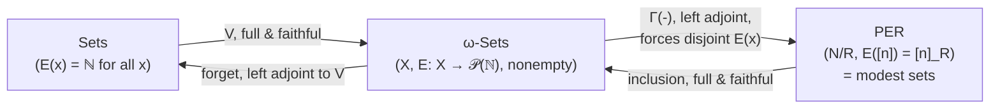
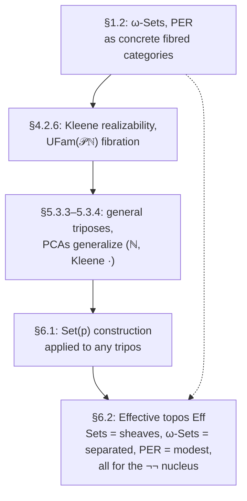

[[book-guidelines|↩ Back to guidelines]]

## Why you'd want a model like this at all

Start from a question that has nothing to do with category theory: what does it *mean* for a proof of a proposition to carry computational content? Under the Brouwer–Heyting–Kolmogorov reading, a proof of $\varphi \wedge \psi$ is a pair of proofs, a proof of $\varphi \supset \psi$ is a *method* turning proofs of $\varphi$ into proofs of $\psi$, and so on. Curry–Howard formalizes this for typed calculi: a proof term literally *is* a program. But there's a version of this idea that's older and more radical, going back to Kleene in 1945 (§4.2.6, p. 240): instead of proof terms in some fixed calculus, let the "evidence" for a proposition be a *natural number* — a code (Gödel number) for a partial recursive function that discharges the proposition's implicit obligations. Kleene called this relation "$n$ realises $\varphi$," written $n\,r\,\varphi$.

This matters for a very concrete reason: it gives you a model of intuitionistic logic that is *not* classical, built entirely out of ordinary sets and Turing-computable functions, with no need to invoke Heyting algebras of opens in a topological space or Kripke structures. If you're building a verifier and ever need semantics for a logic where "provability" should coincide with "there is an algorithm certifying this," realizability is the categorical machine that makes that idea rigorous — and it does so by *indexing sets with sets of witnesses*, which is exactly the shape of ω-sets, and by then *quotienting* those witnesses down to get PERs. This note develops those two structures, the notion of a "tracked" morphism between them, how they interlock as reflective subcategories, and finally the general engine (partial combinatory algebras) that produces realizability models like Kleene's not just for $\mathbb{N}$ but for arbitrary models of computation, including the untyped $\lambda$-calculus.

Jacobs introduces all of this early (§1.2, immediately after fibrations themselves) precisely because $\omega$-sets and PERs will recur as *the* leading examples of categorical models throughout the book — they get their own fibrations, they interpret polymorphism (Reynolds' parametricity, Ch. 17), and they turn out to literally live *inside* one distinguished topos, [[The-Effective-Topos|the effective topos]] $\mathrm{Eff}$ (Ch. 6), as three nested subcategories.

## ω-sets: sets with existence certificates

### What breaks if you just use ordinary sets

Suppose you want a category where objects are sets but morphisms $f : X \to Y$ additionally carry a certificate of *how* they're computed — not just that a function exists set-theoretically, but that it's given by an actual algorithm. Plain $\mathbf{Sets}$ has no room for that: a morphism is a graph, nothing more. You need each element of the domain to come with a notion of "the ways of presenting it" so that a morphism can be required to act uniformly on those presentations.

### The definition

An **$\omega$-set** (Def. 1.2.3, p. 34) is a pair $(X, E)$ where $X$ is a set and $E$ assigns to each $x \in X$ a *non-empty* set of natural numbers $E(x) \subseteq \mathbb{N}$ — its **existence predicate**. Read $E(x)$ as "the set of codes that count as valid presentations/realizers of $x$." A morphism $f : (X,E) \to (Y,E)$ is a function $f : X \to Y$ on underlying sets for which there exists a single code $e \in \mathbb{N}$ that **tracks** it:

$$\forall x \in X,\ \forall n \in E(x): \quad e \cdot n \text{ is defined and } e \cdot n \in E(f(x))$$

Here $e \cdot n$ is Kleene application — the result of running the $e$-th partial recursive program on input $n$. Crucially, the code $e$ is only required to *exist*; it is not part of the morphism's identity. This is exactly the categorical move that turns "being computable" into a *property* of a function rather than *extra data* attached to it — the analogue, in a compiler, of proof-irrelevant existence: you can have `∃ e, tracks e f` without `e` itself being observable in the category's arrows.

$\omega$-Sets has finite limits and exponents (Prop. 1.2.4). [[First-Order-Predicate-Logic#The construction|The construction]] on codes is instructive: the product $(X,E) \times (Y,E) = (X\times Y, E)$ takes $E(x,y) = \{\langle n,m\rangle \mid n \in E(x), m \in E(y)\}$ using an effective pairing $\langle-,-\rangle : \mathbb{N}\times\mathbb{N} \to \mathbb{N}$, and the exponent restricts the underlying function space to the *trackable* functions:

$$(X,E) \Rightarrow (Y,E) \;=\; \big(\{f : X \to Y \mid f \text{ is tracked by some } e\},\ E'\big), \qquad E'(f) = \{e \mid e \text{ tracks } f\}.$$

Note how self-referential this is: the existence predicate of a function *is* the set of its own tracking codes.

### Grounding: ω-sets as a witness-carrying wrapper type

The Rust shape that matches an $\omega$-set most directly is a value paired with a non-empty *set* of "proof tokens" — think of it as a refinement type where inhabitation is witnessed by more than one certificate, and morphisms must act uniformly across all of them:

```rust
struct OmegaSet<X> {
    // underlying carrier; existence predicate as a map from elements
    // to non-empty sets of codes (represented abstractly as usize here)
    exists: fn(&X) -> Vec<usize>, // must be non-empty on every value produced
}

// A tracked morphism carries the single code `e` and a proof obligation
// (checked externally, not encoded in the type) that for every x and every
// n in exists(x), applying the partial recursive function coded by e to n
// terminates and lands in exists(f(x)).
struct Tracked<X, Y> {
    f: fn(X) -> Y,
    code: usize, // the tracking code `e`
}
```

The key discipline an implementation must respect is exactly the "uniformity" clause: `code` must work for *every* realizer of *every* input, not just the ones the implementation happens to compute with. That is the computational content of "tracked," and it's what later lets $\omega$-Sets support exponents — a tracked higher-order function is one whose *own* realizers are codes that correctly transform realizers into realizers.

In Lean terms, an $\omega$-set is close to a `Subtype`-indexed family together with a *Prop*-valued (or, more precisely, $\Sigma$-valued, since existence is witnessed data, not proof-irrelevant) predicate `E : X → Set ℕ` with `E x |>.Nonempty` — except that in Lean you would normally want existence of a *witness type*, whereas here existence is deliberately *untyped*: any natural number will do as a code, and nothing about its internal structure is checked except operationally, via $e \cdot n\!\downarrow$. This gap — computational reality checked by execution rather than by a typed kernel — is precisely the trade-off realizability models make, and it's worth sitting with, because your own project's trusted kernel makes the opposite choice (checking, not running, certificates).

### What breaks without the existence predicate

If you drop $E$ and just track *functions* $X \to Y$ by codes ranging over some fixed enumeration of $X$, you lose the ability to have *multiple, non-canonical* presentations of the same element coexist — which is exactly what you need to model, e.g., different (but denotationally equal) representations of a datum, or partiality (an $\omega$-set element can simply have $E(x)$ be a set of divergent-looking codes that nonetheless all converge on the *same* target under tracking, since only $e \cdot n \in E(f(x))$ is demanded, never that $e\cdot n$ pins down a canonical realizer).

## Partial equivalence relations (PERs)

### The idea

An $\omega$-set separates "the data" ($X$) from "the ways of presenting it" ($E$). A **PER** goes one step further and throws away $X$ entirely: it works *purely* with codes, and defines "sameness of the thing being coded" as an equivalence relation *on a subset of* $\mathbb{N}$.

### The definition

A **partial equivalence relation** (Def. 1.2.5, p. 35) on $\mathbb{N}$ is a relation $R \subseteq \mathbb{N}\times\mathbb{N}$ that is symmetric and transitive — but *not required to be reflexive*. Because of this, $R$ is an honest equivalence relation only on its **domain**

$$|R| = \{n \in \mathbb{N} \mid n \mathrel{R} n\},$$

with equivalence classes $[n]_R = \{m \mid m \mathrel{R} n\}$ and quotient $\mathbb{N}/R = \{[n]_R \mid n \in |R|\}$ (Jacobs writes this loosely as $\mathbb{N}/R$ even though formally it's $|R|/R$). The category $\mathbf{PER}$ has objects $R \in \mathbf{PER}$, and a morphism $R \to S$ is a *tracked* function between the quotients: $f : \mathbb{N}/R \to \mathbb{N}/S$ such that for some code $e$,

$$\forall n \in |R|: \quad f([n]_R) = [e \cdot n]_S.$$

**Why symmetric-and-transitive-but-not-reflexive is exactly the right laxness.** Reflexivity on all of $\mathbb{N}$ would force every natural number to be a valid code for something — but most partial recursive functions diverge on most inputs, so most $n$ shouldn't count as "defined" at all. Dropping reflexivity, keeping symmetry and transitivity, is precisely how you say "this is an equivalence relation on however much of $\mathbb{N}$ turns out to be well-defined," without pre-committing to which numbers those are. This is the PER analogue of a *partial* function: definedness is not assumed, only consistency (if $n$ and $m$ are both defined and related, they denote the same abstract value) and closure once definedness holds.

$\mathbf{PER}$ also has finite limits and exponents (Prop. 1.2.6), and here the exponent construction is the cleanest possible statement of "tracked function space by simulation":

$$R \Rightarrow S = \{(n,n') \mid \forall m,m' \in \mathbb{N}.\ m \mathrel{R} m' \Rightarrow (n\cdot m) \mathrel{S} (n'\cdot m')\}.$$

Two codes $n, n'$ are related in the exponent exactly when, fed any two $R$-related inputs, they produce $S$-related outputs. This is *extensional equality of programs relative to $R$ and $S$*, expressed with zero extra machinery beyond application and the relations themselves — arguably the cleanest possible categorical rendering of "same behavior."

### Grounding: PERs as a "trusted equivalence" over raw codes

```rust
// A PER is not a data structure you materialize (it ranges over all of ℕ);
// what you actually implement is a *decision procedure* (or, realistically,
// a semi-decision procedure) for the two clauses.
trait PartialEquivalence {
    // symmetric, transitive, but need NOT be reflexive on every input
    fn related(&self, n: u64, m: u64) -> bool;
    fn domain_witness(&self, n: u64) -> bool { self.related(n, n) }
}

// The exponent PER, built purely from an "apply" operation on codes:
struct ExpPer<R: PartialEquivalence, S: PartialEquivalence> {
    r: R,
    s: S,
    apply: fn(u64, u64) -> Option<u64>, // Kleene application e · n, partial
}
impl<R: PartialEquivalence, S: PartialEquivalence> PartialEquivalence for ExpPer<R, S> {
    fn related(&self, n: u64, np: u64) -> bool {
        // in a real implementation this ranges over an enumeration and is only
        // semi-decidable; shown here as a (non-terminating in general) check
        (0..).all(|m| {
            let mp_candidates: Vec<u64> = (0..).take_while(|_| true).collect(); // conceptual
            true // the honest statement is a ∀m,m' quantifier, not computably total
        })
    }
}
```
The comment in the exponent implementation is doing real work: [[Full-Higher-Order-Dependent-Type-Theory#The definition|the definition]] of $R \Rightarrow S$ quantifies over *all* pairs $m \mathrel{R} m'$, which is not something you evaluate by brute enumeration in general. This is a genuine disanalogy with how a Rust type-checker works — a PER-based equivalence is a *specification* of extensional sameness, not an algorithm; algorithmic definitional equality (what your elaborator's `isDefEq` computes) is always a *decidable approximation* to something PER-shaped. Keep that gap in view: it's the same gap between denotational equality and syntactic/normalization-based equality that shows up whenever a kernel has to decide $\alpha\beta\eta$-equality of terms.

## Tracking and codes for morphisms — the load-bearing idea

Both categories above are built on the same primitive: a morphism is *witnessed* by a natural-number code $e$ satisfying an operational condition, and the morphism's identity in the category forgets which code was used. This has three consequences worth naming explicitly, because they are the mechanism this whole topic is "about":

1. **Morphisms are proof-irrelevant over their realizers, but not proof-free.** Existence of *some* tracking code is required — you can't just assert set-theoretic well-definedness. This is a categorical "trusted-kernel-lite": the kernel here is Kleene application itself, i.e., an actual Turing machine execution model, playing the role your elaborator's kernel plays for type-checking.
2. **[[Fibred-Category-Theory#Composition|Composition]] of tracked morphisms is composition of realizers.** If $e$ tracks $f$ and $d$ tracks $g$, then $\lambda x.\, d \cdot (e \cdot x)$ tracks $g \circ f$ — realizers compose exactly the way a proof-term calculus composes derivations. This is the realizability analogue of *proof reconstruction*: the categorical composite tells you a witness exists; producing the actual composite code is the reconstruction step.
3. **Identity is tracked by a fixed combinator.** The identity on $(X,E)$ is tracked by (a code for) the identity function on $\mathbb{N}$ — i.e. $\lambda x. x$. This foreshadows the PCA machinery below: once you generalize from $\mathbb{N}$ with Kleene application to an arbitrary **partial combinatory algebra**, "identity is trackable" becomes "the algebra has a combinator behaving like $I = SKK$."

If you are building a proof-producing pipeline, this is the right mental model for *why* realizability semantics is attractive as a target: soundness of a typing/verification rule can be proved by exhibiting a tracking code for the corresponding semantic operation, and that code is, in essence, a certificate — checkable by execution rather than by re-deriving a proof term. It's a fundamentally different trust model from a Lean-style kernel (which trusts a small typed core checking proof terms) — realizability trusts an *untyped* execution model and pushes correctness into "this program halts with the right shape of output," which is much closer to how a symbolic-execution or abstract-interpretation soundness argument is usually phrased (an abstract transformer is sound because running it never under-approximates reachable behavior — a claim about execution, not about typed derivations).

## Reflective subcategory relationships: $\mathbf{Sets} \hookrightarrow \omega\text{-}\mathbf{Sets} \hookleftarrow \mathbf{PER}$

Now assemble the three categories into one diagram. Every ingredient below is either full-and-faithful with a left or right adjoint (a *reflection*), and Jacobs proves each leg explicitly (Prop. 1.2.7, p. 38):

- **$\mathbf{Sets} \hookrightarrow \omega\text{-}\mathbf{Sets}$**: send a set $X$ to $(X, E)$ with $E(x) = \mathbb{N}$ for every $x$ — every natural number witnesses every element equally well, since there is nothing more to know. This functor $V$ is full and faithful, and the *forgetful* functor $\omega\text{-}\mathbf{Sets} \to \mathbf{Sets}$ (which just discards $E$) is left adjoint to it: $\mathrm{forget} \dashv V$. So $\mathbf{Sets}$ is a reflective subcategory of $\omega\text{-}\mathbf{Sets}$, with $V$ as the inclusion.
- **$\mathbf{PER} \hookrightarrow \omega\text{-}\mathbf{Sets}$**: send a PER $R$ to the $\omega$-set $(\mathbb{N}/R,\, E)$ with $E([n]) = [n]_R$ (the equivalence class itself, viewed as a set of codes). This is full and faithful, and the *left* adjoint $\Gamma(-) : \omega\text{-}\mathbf{Sets} \to \mathbf{PER}$ works by forcing an $\omega$-set's existence sets to become disjoint: define $x \sim x'$ when $E(x) \cap E(x') \neq \emptyset$, take the transitive closure, and let codes that ever witness $\sim$-related elements become identified. Concretely,
$$\Gamma(X,E) = \{(m,m') \mid \exists x, x' \in X.\ m \in E(x),\ m' \in E(x'),\ x \sim x'\}.$$
So $\mathbf{PER}$ is *also* a reflective subcategory of $\omega\text{-}\mathbf{Sets}$, this time via a left adjoint that "collapses overlapping presentations."

An $\omega$-set on which this reflection unit is already an isomorphism — i.e. one whose existence sets are *already* pairwise disjoint — is exactly what Jacobs calls a **modest set** (Exercise 1.2.9, p. 39, after Dana Scott): $\mathbf{PER}$ is equivalent to the full subcategory of $\omega\text{-}\mathbf{Sets}$ on the modest sets. This is a genuinely useful invariant to hold onto: a modest set is an $\omega$-set where every code realizes *at most one* element, i.e. where "which code you used" already determines "which value you got," with no further quotienting needed.



Both reflections preserve finite limits and exponents, which is what makes this diagram compatible with using any of the three categories as a *model of type theory*: passing along an inclusion never breaks products or function types, and passing along a reflection is at worst a well-behaved quotient.

### The bigger picture: three subcategories of one topos

Chapter 6 closes the loop. The **effective topos** $\mathrm{Eff}$ (constructed via the general "Set($p$)" tripos-to-topos machine of §6.1, applied to the realizability fibration below) contains all three categories as full subcategories, distinguished by how an object's "abstract equality" predicate $\approx$ interacts with reflexivity/existence, relative to the **double-negation nucleus** $\neg\neg$ on $\mathrm{Eff}$ (§6.2, p. 386–389):

| Category | Characterization inside $\mathrm{Eff}$ | Role for $\neg\neg$ |
|---|---|---|
| $\mathbf{Sets}$ | *canonically a sheaf*: $\|i \approx_I i'\| \neq \emptyset \Rightarrow i = i'$, and $\bigcap_i E(i) \neq \emptyset$ | sheaves for $\neg\neg$ (Thm. 6.2.8) |
| $\omega\text{-}\mathbf{Sets}$ | *canonically separated*: $\|i \approx_I i'\| \neq \emptyset \Rightarrow i = i'$ | separated objects for $\neg\neg$ |
| $\mathbf{PER}$ | *modest*: canonically separated **and** $E(i)\cap E(i') \neq \emptyset \Rightarrow i = i'$ | — |

That is: the same reflective-subcategory pattern from §1.2 reappears, now internal to a single topos, with a precise logical characterization (separated = internal equality coincides with external equality; sheaf = *unique choice* holds, per the general Thm. 4.9.4/5.8.2 machinery elsewhere in the book) of exactly which objects belong to which layer. $\omega\text{-}\mathbf{Sets}$ itself is *not* a topos (Exercise 6.2.5) — it's missing enough colimits/quotients — which is exactly the gap $\mathrm{Eff}$ is built to fill.

## Kleene realizability and partial combinatory algebras

### From one relation to a general recipe

Kleene's realizability relation $n\,r\,\varphi$ (§4.2.6) is defined by structural recursion on $\varphi$:

$$n\,r\,(\varphi\wedge\psi) \iff n = \langle n_1,n_2\rangle,\ n_1\,r\,\varphi,\ n_2\,r\,\psi$$
$$n\,r\,(\varphi\vee\psi) \iff n=\langle n_1,n_2\rangle,\ (n_1{=}0 \Rightarrow n_2\,r\,\varphi) \text{ and } (n_1{=}1 \Rightarrow n_2\,r\,\psi)$$
$$n\,r\,(\varphi\supset\psi) \iff \text{for every } m\,r\,\varphi,\ n\cdot m \text{ is defined and } (n\cdot m)\,r\,\psi$$

Jacobs immediately generalizes this to a *set-indexed, first-order* version, producing the **realizability fibration** $\mathrm{UFam}(\mathcal{PN}) \to \mathbf{Sets}$: predicates on a set $I$ become functions $X : I \to \mathcal{P}\mathbb{N}$ (non-standard predicates), with $X$ **valid** iff $\bigcap_{i\in I} X(i) \neq \emptyset$ — a single uniform realizer witnesses the predicate at *every* index at once. The propositional connectives ($\wedge,\vee,\supset$) and quantifiers ($\coprod,\prod$ along projections) are given by exactly the Kleene-style clauses above, now indexed. This fibration turns out to model full first-order logic (it's shown to be a **first order fibration** in the sense developed in Ch. 4), but it is *not* extensional at the higher-order level (§5.3.2, p. 331): two predicates $P, Q$ can realize each other mutually without being literally equal, because "there is a realizer of $P \supset Q$ and of $Q \supset P$" is weaker than "$P = Q$ as subsets of $\mathbb{N}$."

### Partial combinatory algebras: Kleene application, unbundled

The construction above uses one specific structure, $(\mathbb{N}, \cdot)$ with Kleene application. Jacobs then asks the natural generalization question: what is the *minimal* algebraic structure an "applicative universe" needs to support this whole realizability recipe? The answer is a **partial combinatory algebra** (Def./Example 5.3.4, p. 332):

> A PCA is a set $A$ with a partial application $\cdot : A \times A \to A$ and elements $K, S \in A$ such that $Kx{\downarrow}$, $Sx{\downarrow}$, $Sxy{\downarrow}$, and
> $$Kxy \simeq x, \qquad Sxyz \simeq xz(yz)$$
> where $P \simeq Q$ (Kleene equality) means $P$ is defined iff $Q$ is, and then they're equal.

$K$ and $S$ are exactly the SK-combinators from combinatory logic, and $(\mathbb{N}, \bullet)$-with-Kleene-application is a PCA (Exercise 5.3.1) — but so is **any model of the untyped $\lambda$-calculus** (e.g. Scott's $D_\infty$, or $P_\omega$), because $K$ and $S$ are definable there as $\lambda xy.x$ and $\lambda xyz.xz(yz)$. This is the crucial move: it separates "realizability" from "recursion theory specifically" and re-expresses it as "realizability over *any* combinatorially complete applicative structure."

**Combinatory completeness.** From $K, S$ alone you can define, via Schönfinkel's bracket abstraction —
$$\lambda x.x = SKK, \qquad \lambda x.M = KM \ (x \notin \mathrm{FV}(M)), \qquad \lambda x.(MN) = S(\lambda x.M)(\lambda x.N)$$
— an element $a = \lambda x_1 \cdots x_n. M \in A$ for *every* term $M$ built from variables, constants, and application, such that $a b_1 \cdots b_n \simeq \llbracket M \rrbracket(b_1,\ldots,b_n)$ for all $b_i \in A$. This is exactly what lets you build pairing $\langle a,b\rangle := S(SI(Ka))(Kb)$ and projections $\pi c = cK$, $\pi'c = c(KI)$ purely from $K, S$, with $\pi\langle a,b\rangle = a$ and $\pi'\langle a,b\rangle = b$ — the entire realizability apparatus (pairing for conjunction, injections for disjunction) is *derived*, not primitive.

**PCAs generate triposes.** Any PCA $A$ yields a fibration $\mathrm{UFam}(\mathcal{P}A) \to \mathbf{Sets}$ by the identical recipe as Kleene's, with predicates $\varphi : I \to \mathcal{P}A$ and the ordering $\varphi \vdash \psi \iff \bigcap_i \varphi(i) \Rightarrow \psi(i) \neq \emptyset$ (a single uniform realizer again). Jacobs defines a **tripos** (Def. 5.3.3, p. 332) as a higher order fibration over $\mathbf{Sets}$ where the induced $\prod_u, \coprod_u$ along *arbitrary* functions (not just projections) satisfy Beck–Chevalley — and shows this PCA construction always produces one. Taking $A = (\mathbb{N}, \bullet)$ recovers exactly the realizability tripos from §4.2.6; taking $A$ to be a $\lambda$-model like $D_\infty$ or $P_\omega$ produces genuinely different realizability universes used, for instance, in synthetic domain theory. This is the general engine; Kleene's original relation is its most classical instance.

### Grounding: a PCA as a trait, combinators as derived methods

```rust
trait PCA {
    fn apply(&self, a: usize, b: usize) -> Option<usize>; // partial application, a·b
    fn k(&self) -> usize; // K
    fn s(&self) -> usize; // S
}

// Derived: identity combinator I = SKK
fn identity_combinator<P: PCA>(pca: &P) -> Option<usize> {
    let sk = pca.apply(pca.s(), pca.k())?;
    pca.apply(sk, pca.k())
}

// Derived: pairing ⟨a,b⟩ = S(SI(Ka))(Kb)
fn pair<P: PCA>(pca: &P, a: usize, b: usize) -> Option<usize> {
    let i = identity_combinator(pca)?;
    let si = pca.apply(pca.s(), i)?;
    let ka = pca.apply(pca.k(), a)?;
    let si_ka = pca.apply(si, ka)?;
    let kb = pca.apply(pca.k(), b)?;
    pca.apply(si_ka, kb)
}
```
Two implementations of `PCA` — one where `apply` runs a partial-recursive-function interpreter over Gödel numbers, another where `apply` is untyped $\lambda$-calculus reduction over de Bruijn-indexed closures — satisfy the *same trait contract* and support *the same derived combinators*, precisely because combinatory completeness is a purely equational consequence of the $K,S$ laws, uniform across every model. This is a genuinely nice illustration of "programming to an interface": the realizability machinery (pairing, projections, the whole propositional apparatus) is written once against the `PCA` interface and specializes automatically to any concrete applicative universe you plug in — recursive functions, $\lambda$-calculus, or otherwise.

In Lean, the closest citable phenomenon is the kernel's own treatment of definitional equality up to $\beta\iota$-reduction (and $\eta$ for structures): Lean's `whnf`/`isDefEq` machinery is, in effect, deciding a *typed, terminating* fragment of the same "does this term reduce compatibly with that one" question that a PCA's raw, untyped, possibly-divergent application answers unconditionally (via partiality, `↓`, rather than via a termination guarantee). The PCA route buys generality (works for genuinely untyped, possibly non-terminating computation) at the cost of exactly the guarantee a trusted kernel needs (termination / decidability) — which is why PCA-style realizability is a *semantic* tool for justifying a logic's soundness, not a *checking* algorithm you'd embed in a kernel.

## Synthesis: where this sits in the book, and where this leads

Structurally, this topic is the payoff of the fibration machinery from earlier in §1.2 applied to a concrete, non-set-theoretic universe, and it is the seed of a much larger construction three chapters later:



- **What this depends on:** the fibration framework of Ch. 1 §1.1 (Cartesian morphisms, the codomain fibration) — $\omega\text{-}\mathbf{Sets}^{\to} \to \omega\text{-}\mathbf{Sets}$ is a fibration precisely because $\omega\text{-}\mathbf{Sets}$ has pullbacks (Prop. 1.2.4's finite limits).
- **What depends on this:** the realisability fibration reappears as a first order fibration in Ch. 4 (models of first-order predicate logic), as a higher order fibration/tripos in Ch. 5 (the generic object being $\mathcal{P}A$ itself), and is the literal input to the Set($p$) construction that builds $\mathrm{Eff}$ in Ch. 6. Later still, **PER models of [[Polymorphic-Type-Theory|polymorphic type theory]]** (Ch. 17) use exactly this $\mathbf{PER}$ category to interpret second-order quantification and to prove Reynolds' relational-parametricity results — impossible in $\mathbf{Sets}$ but achievable once "type" means "PER" and "term" means "tracked equivalence class."
- **For your compiler/elaborator project specifically:** the tracking discipline here is a clean, minimal model of what a *proof-carrying* or *certificate-checked* verification backend looks like when the checker is an untyped execution engine rather than a typed kernel — worth having in mind as a contrast case to Lean's `isDefEq`-style definitional equality, which is the same "when are two things the same" question answered by a terminating, typed decision procedure instead of by partial, untyped simulation. The PER exponent's $\forall m,m'. \, mRm' \Rightarrow (n{\cdot}m)\,S\,(n'{\cdot}m')$ clause is also the cleanest available warm-up for **logical relations** arguments (parametricity, normalization proofs) that recur once you get into Girard–Reynolds-style polymorphism and strong normalization proofs for typed calculi — the technique is structurally the PER exponent, generalized from $\mathbb{N}$-codes to syntactic terms.
