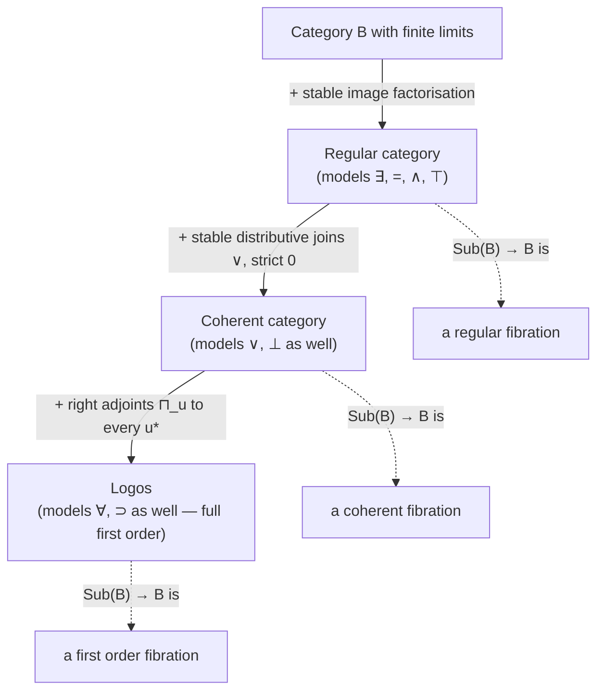

[[book-guidelines|↩ Back to guidelines]]

## Why bother naming these categories at all?

By the time you reach Section 4.4, Jacobs has already told you, abstractly, what a **regular fibration** is (Definition 4.2.1): an Eq-fibration with simple coproducts $\coprod$ satisfying Frobenius — the fibred structure needed to model $\exists$. What he hasn't told you yet is *where such fibrations actually come from* in ordinary mathematics. You know the recipe for $\exists$ in the fibres of $\mathbf{Pred}\to\mathbf{Sets}$ because sets are simple. But the entire point of the fibred method is that it should also apply to $\omega$-Sets, PERs, sheaves, domains — categories with no obvious "set of subsets" to fall back on. So the question this section answers is completely concrete: **for an arbitrary category $\mathbb{B}$, when does its subobject fibration $\mathrm{Sub}(\mathbb{B})\to\mathbb{B}$ happen to be regular / coherent / first order?**

This matters for a reason that goes beyond bookkeeping. If you are building a type checker or a program verifier, "predicates over program states" is exactly a subobject fibration: a predicate on states of type $I$ is (up to logical equivalence) a subset $X\rightarrowtail I$, i.e. a mono into $I$. Existential quantification $\exists$ is what a program's **forward image** (strongest postcondition, reachable-states computation) actually computes. Universal quantification $\forall$ is what a **weakest-precondition** transformer computes. If you want these operators to behave sanely — to commute with substitution, to satisfy the laws your verifier's soundness proof needs — your category of program states needs to satisfy exactly the closure properties this section isolates: **stable image factorisation**. Get this wrong (work in a category without stable images) and your "reachable set" computation silently stops commuting with renaming/substitution, which is precisely the kind of soundness gap that shows up as a mystifying bug in a real verifier.

So the throughline of this article is: *regular category* = the minimal amount of categorical structure needed for $\exists$ (image) to behave like image behaves in $\mathbf{Sets}$; *coherent category* adds what's needed for $\vee$ (disjunction, join) to behave sanely; *logos* adds what's needed for $\forall$ (a full right adjoint) to exist too — matching, level by level, the regular/coherent/first-order hierarchy of fibrations from Section 4.2.



Each downward arrow is Jacobs's actual theorem, not just an analogy: Theorem 4.4.4 ($\mathbb{B}$ regular $\iff$ $\mathrm{Sub}(\mathbb{B})$ regular fibration), Theorem 4.5.3 (coherent $\iff$ coherent fibration), Theorem 4.5.5 (logos $\iff$ first order fibration).

## Images and stable image factorisation

### The intuition first

In $\mathbf{Sets}$, every function $u: I \to J$ has an *image* — the subset of $J$ that $u$ actually hits, $\{\, j \in J \mid \exists i \in I.\, u(i) = j \,\}$. This is completely mundane, but notice what it secretly is: it is the **smallest subset of $J$ through which $u$ factors**. That "smallest" is a universal property, and universal properties are the thing category theory knows how to state without mentioning elements.

$$
I \xrightarrow{\ u\ } J \quad = \quad I \twoheadrightarrow \mathrm{Im}(u) \rightarrowtail J
$$

Jacobs's Definition 4.4.2(i) states exactly this: a category **has images** if every morphism $u: I \to J$ factors as $I \to \mathrm{Im}(u) \rightarrowtail J$ where $\mathrm{Im}(u) \rightarrowtail J$ is a mono, and it is the *least* such mono — any other factorisation $I \to K \rightarrowtail J$ through a mono admits a unique map $\mathrm{Im}(u) \to K$ making the triangle commute.

That alone is not quite enough for what a logician wants. Existential quantification needs images to be **stable under pullback** — condition (ii) of Definition 4.4.2 — meaning that if you pull back along some $w: I' \to I$, the image of the pulled-back map $w^*(u)$ is the pullback of the original image:

$$
\mathrm{Im}(w^*(v)) \;=\; w^*(\mathrm{Im}(v))
$$

**What breaks without stability.** Without this, "the set of $j$ such that $\exists i.\, u(i)=j$" would not commute with substituting a different index into $j$'s free variable — i.e. $\exists$ would fail to satisfy the Beck–Chevalley condition, and the fundamental adjunction $\exists \dashv u^*$ that the whole book is built on (recall Chapter 0's slogan: $\exists,\Sigma \dashv \text{weakening} \dashv \forall,\Pi$) would not be natural in the base. A "regular category," Definition 4.4.2(iii), is simply: **finite limits + stable images.**

Theorem 4.4.4 is the payoff — it proves five different-looking conditions equivalent, and the one to hold onto is (i) $\iff$ (v): *$\mathbb{B}$ is regular exactly when its subobject fibration $\mathrm{Sub}(\mathbb{B})\to\mathbb{B}$ is itself a regular fibration* (i.e. has fibred coproducts $\coprod_u$ satisfying Frobenius, matching Section 4.2's abstract definition). The proof constructs $\coprod_u(m) = \mathrm{Im}(u \circ m)$ for a mono $m: X \rightarrowtail I$ — literally: "push $X$ forward along $u$, then take the image." This is Observation 4.4.1's quantification-along-monos fact, generalized to quantification along *arbitrary* morphisms by factoring $u$ as a Cartesian projection composed with a mono (proof step (iv)$\Rightarrow$(iii)).

### Grounding: image as reachable-state computation

This is precisely the "strongest postcondition" / forward-reachability transformer from program analysis. If $u: \mathrm{State} \to \mathrm{State}$ is a (possibly nondeterministic, relational) transition step and $X \subseteq \mathrm{State}$ is a set of starting states, $\mathrm{Im}(u|_X)$ *is* the one-step reachable set. Stability under pullback is exactly the statement that computing "states reachable from $X$, restricted to states satisfying some extra predicate $\varphi$" commutes correctly with substitution of the predicate — which is the soundness property an abstract interpreter's `post` transformer needs.

```rust
// A "regular category" fact of life, made concrete: images of relations
// between finite state spaces, and why they must be pullback-stable.
use std::collections::HashSet;

/// A relation I -> J represented as its graph; think "transition relation"
/// or "one CFG edge's semantics" in a verifier/abstract interpreter.
struct Relation<I, J> {
    edges: HashSet<(I, J)>,
}

impl<I: Eq + std::hash::Hash + Copy, J: Eq + std::hash::Hash + Copy> Relation<I, J> {
    /// Im(u) restricted to a starting subset X ⊆ I — the "forward image",
    /// i.e. the categorical image factorisation I -> Im(u) >-> J specialised
    /// to a sub-mono X >-> I first.
    fn image(&self, start: &HashSet<I>) -> HashSet<J> {
        self.edges
            .iter()
            .filter(|(i, _)| start.contains(i))
            .map(|&(_, j)| j)
            .collect()
    }
}

// Stability under pullback, concretely: if you first restrict the *source*
// index set (substitute a smaller I' for I via w), the image you get is the
// pullback of the big image along w — NOT some ad hoc, possibly smaller or
// incomparable set. This is exactly what lets `image` above be used safely
// under nested foralls/exists in a verification condition: reindexing and
// "take image" always agree, regardless of which order you do them in.
```

If `image` failed to be stable — imagine some pathological setup where restricting the source set could produce an image *not* expressible as a pullback of the unrestricted image — then a verifier computing reachability compositionally, module by module, could get a different (unsound) answer than computing it globally. Regularity is the categorical guarantee that this never happens.

**Lean correspondence.** Mathlib's `CategoryTheory.Limits.image` is a direct, literal implementation of Definition 4.4.2: `image.ι f : Limits.image f ⟶ Y` is the mono, and `factorThruImage f : X ⟶ Limits.image f` is the epi part, with `Limits.image.factorization` giving exactly Jacobs's `u = m(u) ∘ u'`. The universal "least mono" property is `image.lift` — the mediating map Jacobs draws as an unnamed commuting triangle right after Definition 4.4.2(i). A category having *all* such stable factorisations is `CategoryTheory.Regular` (or, closer to Jacobs's Grothendieck-school phrasing, a **regular category** with pullback-stable regular epi–mono factorisations) — the same definition, arrived at independently in the Lean ecosystem for the same reason: it's the minimal setting where $\exists$-style constructions behave.

## Covers as regular epimorphisms

### Why give the "other half" of the factorisation a name

Once every morphism factors as (epi-like thing) followed by (mono), it's worth asking exactly what kind of epi-like thing that is. Jacobs's answer, Definition 4.4.5: $u: I \to J$ is a **cover** (written $u: I \twoheadrightarrow J$) when its monic part $m(u): \mathrm{Im}(u) \rightarrowtail J$ is already an isomorphism — informally, $u$ hits *all* of $J$, not just some sub-mono of it. In $\mathbf{Sets}$, covers are exactly the surjections (as stated right after Definition 4.4.5) — no surprise, but now it's a definition that transports to any regular category, including ones with no elements to speak of.

Lemma 4.4.6 is where the payoff comes: it gives **four equivalent characterisations** of "cover," and each one is a genuinely different way of thinking about "surjective":

1. **(i) Extremal**: for any factorisation $u = m \circ u'$ with $m$ monic, $m$ must already be an isomorphism. (You can't "waste" any of the codomain.)
2. **(iii) Fixed-point of $\coprod_u$ on truth**: $\coprod_u(\top) \to \top$ is an isomorphism. (Existentially quantifying "always true" along $u$ gives back "always true" — nothing in $J$ is missed by the image of $u$.)
3. **(vii) Orthogonal to all monos**: every commuting square from $u$ into a mono has a *unique* diagonal filler. This is the lifting-property definition category theorists usually reach for first (it's the "$u \perp m$ for all monos $m$" formulation used to build factorisation systems in general).
4. **(viii) Regular epimorphism**: $u$ arises as *some* coequaliser $R \rightrightarrows I \xrightarrow{u} J$.

The hard direction is (i)/(vii) $\Rightarrow$ (viii): showing an extremal epi is automatically a coequaliser of its own kernel pair. Jacobs's proof (attributed to a standard argument, cf. [169]) builds the kernel pair $\pi_1,\pi_2: R \rightrightarrows I$ of $u$ against itself, and for any $v$ coequalising $\pi_1,\pi_2$, factors the pairing $\langle u,v\rangle: I \to J\times K$ through its image $W$, then shows the projection $\pi \circ m: W \to J$ is simultaneously a cover (composite of covers) and monic (a diagram chase using that covers are epi and stable under pullback), hence — by (ii), "a monic cover is an isomorphism" — an isomorphism, which is exactly the datum needed to build the mediating map $J \to K$.

**Why this matters for a verifier.** "Cover" is the categorical shape of *surjective/total transition relation* and, dually, of *quotient by an equivalence relation* — the operation you use to collapse a refinement type's carrier down to the subset actually satisfying a predicate's negation-of-emptiness, or to implement `Quot`-style quotients for definitional equality up to some congruence. Whenever your elaborator needs "is this substitution / evaluation total on the domain it claims," it is really asking "is this map a cover."

### Grounding

**Rust**: think of a cover as an enum-flattening / exhaustiveness fact — a function `fn eval(e: Expr) -> Value` from an AST enum onto a semantic domain is a cover precisely when every `Value` is denoted by *some* expression (surjective interpretation function), which is exactly the "no dead codomain" reading of extremality.

**Lean**: `Function.Surjective` is the underlying-set-level notion; `CategoryTheory.regularEpiOfRegularEpi` / `RegularEpi` in mathlib package the categorical version, and the coequaliser characterisation (Lemma 4.4.6(viii)) is literally `CategoryTheory.Limits.isColimitCoforkOfCokernelCofork` machinery for a map presented as a coequaliser of its kernel pair. Lean's own `Quotient.mk` for a `Setoid` is a cover of the corresponding equivalence relation's kernel pair — the categorical statement "every equivalence relation that is a kernel pair has a quotient which is a cover" is exactly the **exact category** condition that Section 4.7/4.8 (quotient types) will build on top of this chapter's regular categories.

## The mono–cover factorisation system

Lemma 4.4.6's four characterisations aren't separate curiosities — together they establish that $(\mathrm{Monos}, \mathrm{Covers})$ form a genuine **factorisation system** (Jacobs cites [18] — Freyd–Kelly's standard reference on factorisation systems) on any regular category:

- **Existence**: every $u$ factors as a cover followed by a mono (Lemma 4.4.6(vi)).
- **Uniqueness (up to unique iso)**: this follows from orthogonality (vii) — a cover is, by definition, left-orthogonal to every mono, which is exactly the diagonal-lifting condition that forces any two factorisations of the same map to be canonically isomorphic.
- **Closure**: covers are closed under [[Fibred-Category-Theory#Composition|composition]] and satisfy the two-out-of-three-ish law "(iv) if $v\circ u$ and $u$ are covers, then $v$ is a cover"; covers are stable under pullback (v); monos trivially compose and pull back.

Lemma 4.4.7 then cashes this out logically: in a **subobject fibration**, a morphism is *internally injective* iff it is a mono, and *internally surjective* iff it is a cover. This closes a loop opened back in Section 4.3 (internal injectivity/surjectivity were defined purely in terms of the fibration's equality and existential structure, Definition 4.3.9) — showing that the abstract fibred definitions of "injective"/"surjective" reduce, in the one setting that actually models ordinary predicate logic, to the classical mono/epi picture you'd expect. The proof is a short unwind: internal injectivity of $u$ says $\mathrm{Eq}(u\pi, u\pi') \leq \mathrm{Eq}(\pi,\pi')$ over $I\times I$, which (since equality in a subobject fibration is computed by equalisers) says the equaliser of $u\pi, u\pi'$ factors through the diagonal — precisely the elementary statement "$u$ is monic."

**Why a factorisation system, and not just a factorisation, matters for a compiler.** A factorisation system is what makes "the" image well-defined up to unique isomorphism, which is exactly the property you need before you can talk about "the" elaborated/normalized form of anything — orthogonality/unique-diagonal-filling is structurally the same universal property that makes a **unifier's most general unifier** canonical (any other solution factors uniquely through it), and the same shape recurs in Miller pattern unification: a pattern unification problem has a most-general solution precisely because the relevant maps are orthogonal to the class of "renamings" in the same sense monos here are orthogonal to covers.

```rust
// The "mono-cover factorisation" pattern shows up directly as: every
// well-typed elaboration step factors into "the part that throws away
// information" (a cover — e.g. forgetting universe levels, or coalescing
// metavariables via unification) followed by "the part that's a faithful
// embedding" (a mono — e.g. injecting a checked term into a larger AST type).
trait Factorable<Src, Dst> {
    type Image;
    fn cover(&self, src: Src) -> Self::Image;      // extremal epi part
    fn embed(&self, img: Self::Image) -> Dst;       // mono part
    // Well-formedness: `embed` must be injective, and the pair must be
    // the *least* factorisation — any other Dst' through which the
    // composite factors receives a unique map from `Image`.
}
```

## Coherent categories and distributive joins

### From "exists" to "or"

Regular categories give you $\exists, \wedge, =, \top$ (Definition 4.2.1's regular fibration: Eq-fibration + coproducts modeling $\exists$). To model $\vee$ and $\bot$ as well — i.e. to reach *coherent* logic — you need binary joins in each fibre $\mathrm{Sub}(I)$ that behave well under substitution, plus an honest bottom.

**Definition 4.5.1.** A **coherent category** is a regular category with:
- binary joins $\vee$ in each subobject poset $\mathrm{Sub}(I)$, preserved by pullback functors $u^*$;
- a **strict** initial object $0$ (strict: every map $X \to 0$ is automatically an isomorphism — i.e. nothing nontrivial maps into "the empty type").

**What breaks without strictness.** A merely-initial (non-strict) $0$ lets you have a nonempty object with a map to $0$, which would make $\bot$ (the bottom of $\mathrm{Sub}(I)$, pulled back from $0$) satisfiable in a nonempty context — collapsing the distinction between "false" and "something." Strictness is exactly the categorical way of insisting `False` really has no elements, which is precisely the property a type theorist relies on when using `False.elim` or an empty-match `!` in Rust: the whole soundness of "from falsity, anything follows" rests on there being no actual inhabitant to produce a counterexample from.

**Where the joins come from (Lemma 4.5.2).** If your regular category happens to have *universal* (i.e. stable-under-pullback) binary coproducts $+$, you get joins for free: $X \vee Y := \mathrm{Im}(\, [\text{in}_1,\text{in}_2]: X + Y \to I \,)$ — literally, take the image of the cotupled inclusion map. This is the disjoint-union-then-collapse-the-overlap construction you'd expect $\vee$ to be.

**Theorem 4.5.3** proves the fibred correspondence: $\mathbb{B}$ is coherent $\iff$ $\mathrm{Sub}(\mathbb{B})\to\mathbb{B}$ is a coherent fibration (has fibred distributive $\bot,\vee$). The forward direction's key computation is the **distributivity law** falling directly out of $\coprod_n$ being a left adjoint:
$$
n \wedge (m_1 \vee m_2) \;=\; \coprod_n n^*(m_1 \vee m_2) \;=\; \coprod_n\bigl(n^*(m_1)\vee n^*(m_2)\bigr) \;=\; (n\wedge m_1)\vee(n\wedge m_2)
$$
i.e. $\wedge$ automatically distributes over $\vee$ once $\vee$ is built from a left-adjoint image construction — you don't need to postulate distributivity separately; it's a corollary of $\exists$'s adjunction.

### Grounding: joins as abstract-domain unions

This is one of the most direct hits against the learning goals in this whole chapter: **the join $\vee$ in $\mathrm{Sub}(I)$ is exactly the join ($\sqcup$) operation of an abstract interpretation lattice**, used whenever control-flow paths merge (an `if`/`else` join point, or a loop's fixpoint iteration union). Distributivity of $\wedge$ over $\vee$ is exactly what licenses splitting a conjunctive verification condition like $\varphi \wedge (\psi_1 \vee \psi_2)$ into a disjunction of two independently-checkable conjuncts $(\varphi\wedge\psi_1)\vee(\varphi\wedge\psi_2)$ during path-based symbolic execution (case-splitting on which branch was taken) — without that law, case-splitting a formula wouldn't be sound.

```rust
// Sub(I) as an abstract domain: subsets of program states at program
// point I, ordered by inclusion, joined at control-flow merges.
#[derive(Clone)]
struct AbstractState<S> {
    reachable: std::collections::HashSet<S>, // a "subobject" of the state space
}

impl<S: Eq + std::hash::Hash + Clone> AbstractState<S> {
    /// Join at a control-flow merge point (an if/else confluence, or one
    /// iteration of a loop fixpoint) — the Sub(I) join ∨ from Def 4.5.1.
    fn join(&self, other: &Self) -> Self {
        AbstractState {
            reachable: self.reachable.union(&other.reachable).cloned().collect(),
        }
    }

    /// The strict bottom ⊥ — "unreachable" — with the strictness property
    /// that the *only* way to map into it is if you were already empty.
    fn bottom() -> Self {
        AbstractState { reachable: std::collections::HashSet::new() }
    }
}
```

**Lean correspondence.** `Sub X` in mathlib's `CategoryTheory.Subobject` carries exactly this order structure; `CoherentTopology`/`Preregular`+`Precoherent` category classes in mathlib package Definition 4.5.1 near-verbatim (a `Precoherent` category has stable finite effective unions of subobjects, matching the "joins preserved by pullback" clause here). The strict-initial-object clause matches `InitialMonoClass`/strict initial objects used when mathlib builds coherent topologies for the effective epimorphism (= cover) topology — the same "cover" notion from the previous section reappears as the covering family generator of a genuine Grothendieck topology, foreshadowing Chapter 14's sites and sheaves.

## Logoses: adding a right adjoint for $\forall$

### The last piece: universal quantification

A coherent category gives you $\exists,\wedge,\vee,\bot,\top,=$ — everything except $\forall$ and $\supset$. Definition 4.5.4: a **logos** is a coherent category in which *every* pullback functor $u^*:\mathrm{Sub}(J)\to\mathrm{Sub}(I)$ has a **right adjoint** $\prod_u$ (Jacobs writes this $\bigsqcap_u$ in the source). (Jacobs notes in passing that this notion goes by other names elsewhere — "pre-logos" in [85], "logical category" in [211] — for a coherent category alone; he reserves *logos* specifically for the version with the extra right adjoints.)

**Theorem 4.5.5**: $\mathbb{B}$ is a logos $\iff$ $\mathrm{Sub}(\mathbb{B})\to\mathbb{B}$ is a **first order fibration** — the strongest of the three fibration classes from Section 4.2, closing the correspondence table from the introduction's diagram. [[First-Order-Predicate-Logic#The construction|The construction]] is elegant: once you have $u^* \dashv \coprod_u$ (from coherence) *and* $u^* \dashv \prod_u$ from logos-hood, you get fibred exponents in $\mathrm{Sub}(\mathbb{B})$ for free, by the standard "exponentials from dependent products along a mono" trick:
$$
m_1 \supset m_2 \;:=\; \prod_{m_1}m_1^*(m_2)
$$
and the adjunction calculation in the proof is a direct transposition chase showing $\mathrm{Sub}(I)(n, m_1\supset m_2) \cong \mathrm{Sub}(I)(m_1\wedge n, m_2)$ — implication really is "the biggest thing that, conjoined with the hypothesis, gets you the conclusion," now derived rather than postulated.

### Worked examples, and why they matter for logical strength

Jacobs's Example 4.5.6 gives three logoses, and the contrasts between them are instructive:

- **$\mathbf{Sets}$** is a logos because $\mathrm{Sub}(I) \cong (\mathcal{P}I,\subseteq)$ is a Boolean algebra — joins, meets, and (via $\prod_u(X) = \{i \mid \forall j\in J.\, (i,j)\in X\}$) universal quantification are all just the classical powerset operations.
- **$\mathbf{PER}$** (partial equivalence relations) is *also* a logos — but this is a nontrivial theorem (cited to [143]), not automatic, and it matters precisely because $\mathbf{PER}$ is a *realizability* model, i.e. constructive/computational by construction. Its images are built explicitly from tracking codes: $\mathrm{Im}(f) = \{(n,n') \mid f([n]_R) = f([n']_R)\}$, and covers are characterized (Exercise 4.5.2) by an existence-of-a-tracker condition — logos-hood here means "constructive realizability still supports full first order logic," which is exactly why realizability models are usable as semantics for a dependently-typed proof assistant's logic in the first place.
- **Proposition 4.5.7** sharpens this: the *regular* subobjects of a PER $R$ (as opposed to arbitrary subobjects) correspond bijectively to **saturated subsets of the quotient set** $\mathbb{N}/R$ — and this smaller sub-fibration of regular subobjects is a first order fibration with **classical** logic, even though $\mathbf{PER}$ itself is inherently constructive. This is a genuinely important distinction for anyone building a verifier on constructive foundations: it tells you precisely *where* classical reasoning is recoverable (the "regular"/saturated fragment) versus where you're stuck with intuitionistic logic (arbitrary subobjects) — the same fault line that shows up whenever a theorem prover offers both a constructive core and a classical `Prop`-level escape hatch (e.g. Lean's `Classical.choice` versus its constructive kernel).

**Why the AC/lAC exercises (4.5.4–4.5.5) matter here.** The exercises define the (internal) Axiom of Choice for a regular/first-order category: AC holds iff every cover splits (has a section). This is *exactly* the categorical shape of the question "does every existentially-quantified specification come with a witness-extraction function" — which is the proof-theoretic question a **proof-producing / witness-carrying architecture** must answer. A verifier whose specification language uses $\exists$ freely, but whose underlying model doesn't validate AC, cannot in general turn "a specification is satisfiable" into "here is a concrete witness" — it can only assert existence abstractly. Internal AC (Exercise 4.5.5) sharpens this to the exponent-preserving-covers condition, which is precisely the semantic counterpart of "function extraction from an existential proof is computable" in a realizability-style, proof-producing kernel.

### Grounding

**Lean** is the most literal correspondence here: `∀` and `∃` as right/left adjoints to weakening is *exactly* how Lean's own kernel treats quantifiers over a context, and the logos condition — *every* substitution functor having both adjoints — is what licenses using Lean's `∀`/`∃` freely inside arbitrary nested binders without special-casing "am I allowed to quantify at this point." The classical-vs-constructive fork in Proposition 4.5.7 (regular subobjects of PER give classical logic) is a categorical mirror of Lean's `Classical.em`/`Decidable` distinction: some propositions are decidable/classical "for free" (the regular/saturated fragment) while others genuinely require an axiom to reason about classically.

**Rust**, for the internal-AC intuition: a cover splitting is precisely a function with a *computable* right inverse — think `TryFrom`/`From` pairs, or a parser/pretty-printer pair where the parser is a cover (every valid AST comes from *some* string) and the pretty-printer is a section witnessing that the cover splits. If your `parse` function is a cover but you cannot write a total `unparse` that's a section of it, you don't have (internal) choice for that transition, and any specification of the form "for every valid AST there exists a string that parses to it" is only classically, not constructively, true in your toolchain.

## Synthesis: where this sits in the book's structure

This section is a *representation theorem* section: Chapter 4 spent Sections 4.1–4.3 defining regular/coherent/first order fibrations purely axiomatically (as fibred categorical structure modeling $\exists,\wedge,\vee,\bot,\forall,\supset$), and Sections 4.4–4.5 answer "but which ordinary categories actually give rise to these fibrations, via their subobjects?" The answer — regular categories, coherent categories, logoses, respectively — is what makes the abstract fibred logic machinery usable on concrete mathematics ($\mathbf{Sets}$, $\mathbf{PER}$, frames $\mathrm{Fam}(A)$) rather than a purely formal exercise.

Three threads pick this material up later in the book:

- **Section 4.9** (subset types, quotient types, and the logical characterisation of subobject fibrations) directly uses Lemma 4.4.7's mono/cover $\leftrightarrow$ internal-injective/surjective correspondence, and Observation 4.4.1's "subobject fibrations always have unique choice" fact, to state the Main Theorem characterising exactly when an arbitrary fibration *is* (equivalent to) a subobject fibration.
- **Section 4.8**'s notion of an **exact category** (every equivalence relation is a kernel pair) sharpens "regular" further, and needs the cover/regular-epi machinery of this section as its base case.
- **Chapter 5**'s [[Toposes|toposes]] are, in particular, always logoses (Example 4.5.6(i) already previews this for $\mathbf{Sets}$) — the entire logical apparatus of a topos's internal logic is inherited wholesale from the logos structure of its subobject fibration developed here.

## Where this leads

The mono–cover factorisation system introduced here is the seed of the **(Mono, Cover) factorisation** that Section 4.6–4.8 use to define subset types (right adjoint to truth — a mono-side construction) and quotient types (left adjoint to equality — a cover-side construction) as two faces of the same adjoint pattern, and it's the categorical backbone Chapter 13 relies on when it upgrades "logos" to "topos" via powerobjects. If you are carrying this material toward a Rust-based refinement-type checker: the image/cover machinery here is the semantic justification for treating a refinement predicate's "witness set" computation (checking $\exists x.\varphi(x)$) as a well-behaved, substitution-stable operation on your abstract domain — get the pullback-stability of images right in your implementation, and your invariant-generation pass will compose correctly across function boundaries; get it wrong, and it won't.
