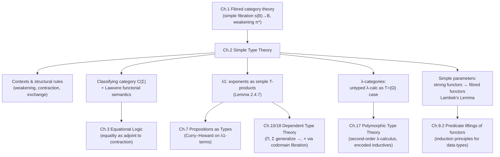

# Simple Type Theory

[[book-guidelines|↩ Back to guidelines]]

## Why this chapter exists, and why it's harder than it looks

Simple type theory (STT) is, on the surface, the most boring type theory there is: no type variables, no types depending on terms, just a fixed universe of types and a typing relation $\Gamma \vdash M : \sigma$. You'd expect Jacobs to knock it out in a page and move on to the interesting dependent stuff. Instead he spends an entire chapter on it, and the reason is worth sitting with, because it previews the whole book's method.

The naive plan for giving STT categorical semantics is: build a syntactic category of contexts and terms (a *classifying category*), then say a model is a structure-preserving functor out of it into some target category. That works cleanly the moment your calculus has products, because then a context $\Gamma = (v_1{:}\sigma_1,\dots,v_n{:}\sigma_n)$ *is* an object — the product $\sigma_1 \times \cdots \times \sigma_n$ — and a Cartesian closed category (CCC) gives you exponents $\sigma \to \tau$ for free. Every textbook treatment of the simply typed $\lambda$-calculus does exactly this.

But Jacobs deliberately considers the *minimal* calculus $\lambda1$, which has exponent types $\sigma \to \tau$ and nothing else — no product types, no way to tuple two terms into one. What breaks without products? You can no longer identify a multi-variable context $v_1{:}\sigma_1,\dots,v_n{:}\sigma_n$ with a single object $\sigma_1\times\cdots\times\sigma_n$. So the standard move — "exponent = right adjoint to $(-)\times\sigma$" — has no home to live in, because there's no product functor $(-)\times\sigma$ on objects-as-types when contexts and types aren't the same thing. Categorical exponents, Jacobs observes, "are not described in isolation, but require (binary) products" (p. 120) — and $\lambda1$ was built expressly to have none.

The chapter's real payload is the fix: **use a fibration instead of a plain category**, and locate the exponent as a *simple product along a weakening functor* rather than as an exponent object in a CCC. This lets contexts keep their product structure (via concatenation, which requires no extra axiom) while types-as-such need no products at all. It's the same trick — adjoints to substitution functors — that the book will reuse for $\Pi$ and $\Sigma$ types in dependent type theory later; STT is the "no type dependency" special case where $\Pi$ degenerates to $\to$ and $\Sigma$ degenerates to $\times$.

If you are building a Rust type-checker or a Lean-style elaborator, this chapter is where the book teaches you the pattern you'll rediscover constantly: *a type former is a universal construction relative to a specific class of substitutions (weakening, contraction, or general reindexing), not just "a categorical construction in the ambient category."* Contexts-as-objects and weakening-as-a-functor are the direct ancestors of what your checker's context/environment data structure and its "add a binding" operation are doing.

---

## 1. Contexts, typing judgements, and the structural rules

### The problem: naming variables without name clashes

Before any type former exists, you need a syntax of terms indexed by contexts, and a discipline for adding, removing, and reordering the assumptions in a context. Jacobs is unusually careful here, more careful than most treatments, because the later categorical semantics depends on getting weakening and contraction exactly right.

He fixes a denumerable set of variables $\mathrm{Var} = \{v_1, v_2, \dots\}$ once and for all, and defines a **context** as a finite sequence of *positional* declarations:
$$\Gamma = (v_1{:}\sigma_1, \dots, v_n{:}\sigma_n).$$
Crucially, variables are drawn from one global, pre-fixed pool and always used in the canonical order $v_1, v_2, \dots$ — this is unlike universal algebra's typed families of variables $(X_\sigma)_{\sigma \in T}$ (Chapter 1's signatures), where variable sets are a free parameter. Fixing the variable-naming scheme in advance is what lets you talk about contexts as literal *objects*, with concatenation as a literal categorical operation, without worrying about renaming or $\alpha$-equivalence bookkeeping getting mixed into the semantics.

**Typing judgement.** $\Gamma \vdash M : \sigma$ reads "$M$ is a term of type $\sigma$ in context $\Gamma$," or "$M$ inhabits $\sigma$." A signature $\Sigma$ supplies atomic types and typed function symbols $F : \sigma_1,\dots,\sigma_n \to \sigma_{n+1}$; the **term calculus** built from $\Sigma$ has two generating rules —

$$\dfrac{}{v_i{:}\sigma \vdash v_i{:}\sigma}\ (\text{identity}) \qquad\qquad \dfrac{\Gamma \vdash M_1{:}\sigma_1 \quad \cdots \quad \Gamma \vdash M_n{:}\sigma_n}{\Gamma \vdash F(M_1,\dots,M_n){:}\sigma_{n+1}}\ (\text{function symbol})$$

— plus three **structural rules**, which are the real subject of this section, because they will later be reified as three specific categorical functors:

$$\text{weakening: } \dfrac{v_1{:}\sigma_1,\dots,v_n{:}\sigma_n \vdash M{:}\tau}{\Gamma, v_{n+1}{:}\rho \vdash M{:}\tau} \qquad \text{contraction: } \dfrac{\Gamma, v_n{:}\sigma, v_{n+1}{:}\sigma \vdash M{:}\tau}{\Gamma, v_n{:}\sigma \vdash M[v_n/v_{n+1}]{:}\tau} \qquad \text{exchange: } \dfrac{\Gamma, v_i{:}\sigma_i, v_{i+1}{:}\sigma_{i+1}, \Delta \vdash M{:}\tau}{\Gamma, v_{i+1}{:}\sigma_{i+1}, v_i{:}\sigma_i, \Delta \vdash M{:}\tau}$$

Weakening adds an unused hypothesis; contraction merges two variables of the same type into one (by substituting one for the other); exchange permutes assumptions. Jacobs stresses that most textbooks leave these implicit — but he calls them out explicitly, "because weakening and contraction play an important role in the categorical description of type constructors" (p. 122), and because making them explicit is exactly what lets *linear logic* be defined later by *restricting* them.

**Worked example from the book.** Given function symbols $\mathsf{plus} : N,N \to N$ and $\mathsf{if} : B,N,N \to N$, the sequent
$$v_1{:}B, v_2{:}N \vdash \mathsf{if}(v_1,v_2,\mathsf{plus}(v_2,v_2)){:}N$$
is derived by building up two independent proofs of $v_1{:}B,v_2{:}N \vdash v_1{:}B$ and $v_1{:}N,v_2{:}N\vdash \mathsf{plus}(v_2,v_2){:}N$ (each requiring a weakening or exchange step to align contexts) and combining them via the function-symbol rule for $\mathsf{if}$. This kind of derivation is exactly what a bidirectional type checker's context-manipulation code performs at each call site — every "extend the environment," "look up a de Bruijn index," or "rename to avoid capture" in a checker's `Ctx` module is a structural rule from this section, executed silently.

**Substitution** is defined first on raw (possibly ill-typed) terms by structural recursion, then shown to preserve typing — this is the **substitution lemma**, proved via induction and left as Exercise 2.1.3, and its correctness is precisely what makes [[Fibred-Category-Theory#Composition|composition]] in the classifying category (below) associative.

### Grounding: contexts as an environment, weakening as a functor

```rust
// A context is literally a stack of typed bindings, addressed positionally —
// exactly Jacobs's Γ = (v1:σ1, ..., vn:σn), if you use de Bruijn levels/indices
// instead of the meta-variable names v1, v2, ... to sidestep alpha-equivalence.
#[derive(Clone)]
struct Context {
    bindings: Vec<Type>, // position i corresponds to v_{i+1} in the book's notation
}

impl Context {
    // Weakening: Γ ⊢ M:τ  =>  Γ,ρ ⊢ M:τ   (M unchanged, index shifted if de Bruijn)
    fn weaken(&self, extra: Type) -> Context {
        let mut ctx = self.bindings.clone();
        ctx.push(extra);
        Context { bindings: ctx }
    }

    // Contraction: Γ,σ,σ ⊢ M:τ  =>  Γ,σ ⊢ M[v_n/v_{n+1}]:τ
    // In de Bruijn terms: merge the two most recent bindings, substituting
    // the surviving index for the discarded one throughout M.
    fn contract(&self) -> Context {
        let mut ctx = self.bindings.clone();
        ctx.pop(); // the duplicate binding disappears; substitution handles M
        ctx
        // (the caller is responsible for the term-level substitution M[v_n/v_{n+1}])
    }
}
```

In Lean's kernel, the analogous operation is `LocalContext` extension (`LocalContext.mkLocalDecl` when elaborating a new binder) — every `fun x => e` or `∀ x, e` elaboration step weakens the ambient local context by one declaration before entering the body. Contraction has no everyday counterpart in Lean's *surface* syntax (Lean doesn't let you write two variables and then identify them), but it is exactly what happens *internally* when the elaborator unifies two metavariables and merges their scopes.

**What this section sets up:** the classifying category. Jacobs defines $\mathfrak{C}(\Sigma)$ — the **classifying category** (or *term model*) of a signature — with contexts as objects and morphisms $\Gamma \to \Delta$ (where $\Delta = (v_1{:}\tau_1,\dots,v_m{:}\tau_m)$) given by $m$-tuples of terms $(M_1,\dots,M_m)$ with $\Gamma \vdash M_i : \tau_i$ derivable for each $i$. The identity on $\Gamma$ is the tuple of its own variables $(v_1,\dots,v_n)$; composition is simultaneous substitution. Jacobs draws the analogy explicitly: this is "like [[First-Order-Predicate-Logic#The construction|the construction]] of the Lindenbaum algebra of a (propositional) logic" — turnstile becomes arrow, exactly as (in the propositional case) turnstile becomes $\le$ in a preorder. **Proposition 2.1.2**: $\mathfrak{C}(\Sigma)$ has finite products — the empty context is terminal, and concatenation $\Gamma,\Delta$ is the categorical product, with the two halves of the context serving as the projection morphisms. This is the crucial fact that makes contexts, even without an internal notion of "type of a context," behave as objects of a category with products.

---

## 2. Functorial (Lawvere) semantics

### The problem: what *is* a model, abstractly?

A concrete $\Sigma$-model in the sense of universal algebra (Chapter 1) is a family of carrier sets $A_\sigma$ plus interpretations $\llbracket F \rrbracket$ of function symbols as actual functions. That's fine as far as it goes, but it's tied to $\mathbf{Sets}$. Lawvere's insight — which Jacobs reconstructs in full — is that a model is *nothing but* a structure-preserving functor out of the classifying category:

**Theorem 2.2.1.** $S\text{-}\mathbf{Model}(\Sigma) \simeq \mathrm{FPCat}(\mathfrak{C}(\Sigma), \mathbf{Sets})$ — an equivalence between set-theoretic $\Sigma$-models and finite-product-preserving functors $\mathfrak{C}(\Sigma) \to \mathbf{Sets}$.

The passage is completely mechanical once you see it: a model $(A_\sigma)_{\sigma}$ turns into a functor $A : \mathfrak{C}(\Sigma) \to \mathbf{Sets}$ sending context $\Gamma$ to $A_{\sigma_1} \times \cdots \times A_{\sigma_n}$ and a morphism $(M_1,\dots,M_m) : \Gamma \to \Delta$ to the tuple of the terms' *interpretations as functions*, $(\llbracket \Gamma \vdash M_1{:}\tau_1\rrbracket, \dots)$. Finite-product preservation is basically free — up to isomorphism of bracketing.

**What breaks without functorial semantics:** you're stuck defining "model" separately for every target category (models in $\mathbf{Sets}$, models in $\mathbf{Dcpo}$, models in a topos...) with a fresh ad-hoc definition each time, and no uniform notion of morphism between models. Definition 2.2.2 fixes this at a stroke: a **model of $\Sigma$ in $\mathbb{B}$** (any category with finite products) is simply a finite-product-preserving functor $\mathfrak{C}(\Sigma) \to \mathbb{B}$, and morphisms of models are natural transformations. This is why, later, "a continuous $\Sigma$-algebra" is *by definition* a model $\mathfrak{C}(\Sigma) \to \mathbf{Dcpo}$ — no separate axiomatization needed.

### The generic model

**Example 2.2.3**: among all $\Sigma$-models, one is distinguished — the *identity functor* $\mathfrak{C}(\Sigma) \to \mathfrak{C}(\Sigma)$, called the **generic model**. It's the categorical avatar of the syntactic term model from universal algebra: "the model that computes with terms themselves, and nothing else." Every other model factors through it via the unique product-preserving functor guaranteed by the universal property below.

**Theorem 2.2.5** packages the adjunction precisely: for a category $\mathbb{B}$ with finite products, there is a bijective correspondence (up to isomorphism)
$$\dfrac{\Sigma \xrightarrow{\phi} \mathrm{Sign}(\mathbb{B}) \text{ in } \mathbf{Sign}}{\mathfrak{C}(\Sigma) \xrightarrow{M} \mathbb{B} \text{ in } \mathbf{FPCat}}$$
i.e. $\mathfrak{C}(-) \dashv \mathrm{Sign}(-)$: the classifying-category construction is **left adjoint** to the forgetful functor sending a category-with-products to its underlying signature (objects as types, morphisms $X_1\times\cdots\times X_n \to X_{n+1}$ as function symbols). So $\mathfrak{C}(\Sigma)$ is literally *the free category with finite products generated by $\Sigma$* — this is Lawvere's original thesis result, stated in full categorical dress.

This adjunction, run through the standard monad-from-adjunction construction, produces a monad $T = \mathrm{Sign}(\mathfrak{C}(-))$ on $\mathbf{Sign}$, whose Kleisli category $\mathbf{Sign}_{tr}$ (**signatures and translations**) is arguably more useful in practice than plain signature morphisms: a **translation** $\Sigma \to \Sigma'$ sends types to *contexts* and function symbols to *terms* of $\Sigma'$, rather than types to types and symbols to symbols. Jacobs gives the textbook example: two different one-sorted signatures for groups — $\Sigma_1$ with $(m, e, i)$ and $\Sigma_2$ with just $(d, a)$ where $d(x,y) := x \cdot y^{-1}$ — are related by a translation, not an isomorphism of signatures, because $d$ maps to a *compound term* $m(i(v_1),v_2)$, not to an atomic symbol.

### Grounding: functorial semantics as trait-based interpretation, and the elaborator connection

```rust
// The classifying category, concretely: contexts and context morphisms.
// "Functorial semantics" = implementing a trait that interprets every
// syntactic construct compositionally and product-preservingly.
trait Model<B> {
    fn interpret_type(&self, sigma: &Type) -> B;              // σ ↦ ⟦σ⟧ ∈ B
    fn interpret_term(&self, ctx: &Context, m: &Term) -> B;   // Γ⊢M:τ ↦ a B-morphism ⟦Γ⟧→⟦τ⟧
}

// The "generic model" is the identity instantiation: B = the syntax itself.
struct GenericModel;
impl Model<Term> for GenericModel {
    fn interpret_type(&self, sigma: &Type) -> Term { Term::TypeAsTerm(sigma.clone()) }
    fn interpret_term(&self, _ctx: &Context, m: &Term) -> Term { m.clone() }
}
```

For the elaborator project this is exactly the pattern you want your typed-AST-to-target-IR lowering pass to follow: fix a syntactic "classifying category" (well-typed ASTs modulo the structural rules), then define semantics as *any* structure-preserving map out of it — evaluators, compilers to bytecode, and denotational models in domains are all instances of "a model in $\mathbb{B}$" for different $\mathbb{B}$, unified by the same interface. Lean's own elaborator similarly treats the kernel's `Expr` type as a syntactic category and defines multiple "models" of it (the definitional-equality checker, the compiler's IR lowering, the pretty printer) as structure-preserving maps out of the same core representation.

---

## 3. Cartesian closed and bicartesian closed categorical semantics

Once you *do* allow product types (calculus $\lambda1_\times$) and further coproduct types (calculus $\lambda1_{(\times,+)}$), the semantics becomes the familiar textbook story, and Jacobs dispatches it quickly before turning to the harder $\lambda1$-only case.

**$\lambda1_\times$-calculus**: adds unit type $1$ and product types $\sigma\times\tau$ with pairing/projection rules and their $\beta/\eta$-conversions. The classifying category $\mathfrak{C}\lambda1_\times(\Sigma)$ now has *types* (not contexts) as objects, since with products around, a whole context $v_1{:}\sigma_1,\dots,v_n{:}\sigma_n$ can be collapsed to the single type $\sigma_1\times\cdots\times\sigma_n$ (the unit type $1$ if $n=0$). **Proposition 2.3.2**: $\mathfrak{C}\lambda1_\times(\Sigma)$ is **Cartesian closed**: $1$ is terminal, $\sigma\times\tau$ is the categorical product, and abstraction/application give exactly the universal property of the exponent $\sigma\Rightarrow\tau$, with the $\beta$ and $\eta$ syntactic conversions translating verbatim into the categorical triangle identities for the exponential adjunction.

**$\lambda1_{(\times,+)}$-calculus**: further adds coproduct types $0,\sigma+\tau$ with the "unpack"/case-elimination rule (a form of pattern match) and its conversions. **Proposition 2.3.5**: the resulting classifying category is Cartesian closed *and* has finite coproducts — a **bicartesian closed category (BiCCC)**. Two structural facts fall out for free, and are worth internalizing because they are exactly the kind of "sanity check" a compiler backend for sum types needs to verify:

- **Proposition 2.3.4(i) — automatic distributivity.** The canonical map $(\sigma\times\tau) + (\sigma\times\rho) \to \sigma\times(\tau+\rho)$ is *always* invertible in these type-theoretic BiCCCs, with no extra axiom — unlike in an arbitrary category with products and coproducts, where distributivity can fail. The proof constructs the inverse term explicitly using a **commutation conversion** (Lemma 2.3.3: unpacking commutes with substitution into the branches), a lemma the book flags as "typical for 'colimit' types, like $+, \Sigma$, quotients and equality."
- **Proposition 2.3.4(ii) — automatic injectivity of coprojections.** $\kappa M = \kappa M' \Rightarrow M = M'$ is *derivable*, again with no separate axiom — a fact any compiler implementing tagged unions relies on implicitly (two values of the same variant compare equal iff their payloads do) but that a type theorist must actually *prove* holds of the syntax.

### What breaks without the fibred reformulation: the minimal calculus $\lambda1$

Here is the crux the whole chapter has been building to. In $\lambda1$ (exponents *only*, no product types), contexts of length $>1$ cannot be collapsed to a single type, so the classifying category $\mathfrak{C}\lambda1(\Sigma)$ has *contexts* as objects, not types — and **Proposition 2.3.1** shows it merely has finite products *as a category of contexts* (via concatenation), while the *types* $T_1$ (closed under $\to$) sit inside it only as a distinguished subcollection of objects (via the identification of a type $\sigma$ with the singleton context $(v_1{:}\sigma)$). There is no exponent object $\sigma \Rightarrow \tau$ available in general, because "exponent" as ordinarily defined needs $\sigma$ and $\tau$ to already be objects with a product $\sigma \times \tau$ around them, and here they're both just distinguished objects of $T_1$, not stably closed under products relative to arbitrary contexts. This structure — a category $\mathbb{B}$ with finite products, plus a subcollection $T \subseteq \mathrm{Obj}(\mathbb{B})$ of "types" — is exactly a **CT-structure** (introduced back in Section 1.3), and it's the object whose simple fibration will carry the semantics of $\lambda1$. That's Section 4 below.

---

## 4. Exponents as simple products in a simple fibration

### Setting up the fibred picture

Recall (from Chapter 1) the **simple fibration** $s(\mathbb{B}) \to \mathbb{B}$ associated to a category $\mathbb{B}$ with finite products: its fibre over $I$ is the **simple slice** $\mathbb{B}/\!/I$, whose objects are just objects $X \in \mathbb{B}$ (reinterpreted as "living over $I$") and whose morphisms $X \to Y$ are maps $I \times X \to Y$ in $\mathbb{B}$ — i.e., functions from $I$-parametrized $X$'s to $Y$'s. A weakening functor $\pi_J^* : \mathbb{B}/\!/I \to \mathbb{B}/\!/(I\times J)$, induced by the projection $\pi : I\times J \to I$, adds a dummy extra parameter $J$.

Jacobs restricts general "simple products" (right adjoints to weakening, from Section 1.9) to only quantify over a **CT-structure** $(\mathbb{B}, T)$: a category with products $\mathbb{B}$ plus a chosen collection of types $T \subseteq \mathrm{Obj}(\mathbb{B})$.

**Definition 2.4.3 — simple $T$-products.** A fibration $p$ has simple $T$-products if for every $I \in \mathbb{B}$ and $X \in T$, the weakening functor $\pi_{I,X}^* : \mathbb{E}_I \to \mathbb{E}_{I\times X}$ has a right adjoint $\Pi_{(I,X)}$, subject to Beck–Chevalley. The point of restricting to $X \in T$ (types only) rather than all objects is that we want to quantify — abstract a function — only over *type-shaped* parameters, matching exactly what $\lambda$-abstraction in $\lambda1$ does: $\lambda v{:}\sigma.M$ abstracts over a variable of a *type*, not over an arbitrary context object.

**Definition 2.4.4 — $\lambda1$-category.** A non-trivial CT-structure $(\mathbb{B}, T)$ is a $\lambda1$-category if its associated simple fibration has *split* simple $T$-products. "Non-trivial" just means $T$ is inhabited by some type with a global point $1 \to X$ — this technical condition ends up being exactly what's needed later to make abstraction well-defined (see the auxiliary object $Z$ in the proof below).

**Example 2.4.5 checks this against syntax**: for a signature $\Sigma$ with non-empty atomic types $T$, taking $(\mathfrak{C}(\Sigma), T_1)$ and unwinding the adjunction $\pi^* \dashv \Pi_{(\Gamma,\sigma)}$ recovers *precisely* $\lambda$-abstraction and application as mutually inverse operations — the counit/unit correspondence of the adjunction literally *is* the $\beta/\eta$-conversion. This is the payoff: **exponent types have been recovered as a universal construction without ever assuming product types existed.**

### The elementary reformulation (Lemma 2.4.7) — the one to actually remember

Unwinding the abstract adjunction into concrete elements gives an equivalent, much more usable characterization:

**Lemma 2.4.7.** $(\mathbb{B}, T)$ is a $\lambda1$-category **iff** $T$ is closed under exponents: for $X, Y \in T$ there is $X \Rightarrow Y \in T$ with an evaluation map $\mathrm{ev} : (X\Rightarrow Y)\times X \to Y$ such that every $f : I\times X \to Y$ factors uniquely as $f = \mathrm{ev}\circ(\Lambda(f)\times\mathrm{id})$ for some $\Lambda(f) : I \to X\Rightarrow Y$.

This is just the universal-mapping-property definition of an exponent object you already know from any CCC — except it is now stated **without ever assuming binary products of types $X\times Y$ exist**. The trick in the (i)$\Rightarrow$(ii) direction of the proof is to build the evaluation map from the *counit of the simple-product adjunction*, and to build abstraction using the auxiliary non-trivial type $Z$ (with its point $1 \to Z$) purely as bookkeeping to introduce and then discard a dummy variable — a device that has no analogue in the ordinary CCC story, precisely because ordinary CCCs already have products to play that role.

**Corollary 2.4.8** ties it back to the familiar case: taking $T = \mathrm{Obj}(\mathbb{B})$ (quantify over *everything*, not just a subcollection) recovers the classical fact that $\mathbb{B}$ is Cartesian closed iff its simple fibration $s(\mathbb{B})\to\mathbb{B}$ has (unrestricted) simple products — i.e. $\lambda1_\times$-semantics is the $T=\mathrm{Obj}(\mathbb{B})$ special case of $\lambda1$-semantics. The dual fact (Exercise 2.4.7) is equally clean: simple $T$-*coproducts* exist iff $T$ is closed under binary products $\times$ — so **product types are left adjoints to weakening**, dually to exponents being right adjoints. This products/exponents-as-adjoints-to-weakening pairing is the STT shadow of $\Sigma \dashv \text{weakening} \dashv \Pi$ for dependent types, which is the single adjunction triple this whole book is built around (see Chapter 0's prospectus).

### Grounding: this is what a checker actually verifies

```rust
// Lemma 2.4.7 read operationally: to typecheck lambda abstraction/application
// for a *fixed, closed* collection of function types, you need:
//   1. a way to form X => Y whenever X, Y are in your type collection,
//   2. an `apply` operation satisfying the universal property,
//   3. `abstract` as its unique mediating morphism.
// This is precisely what a typechecker's `check_lambda` / `infer_app` pair does —
// note it does NOT require the checker to support arbitrary tuple/struct types.
enum Type { Base(String), Arrow(Box<Type>, Box<Type>) }

fn infer_app(ctx: &Context, f: &Term, arg: &Term) -> Result<Type, TypeError> {
    match infer(ctx, f)? {
        Type::Arrow(dom, cod) => {
            check(ctx, arg, &dom)?;   // this IS "ev ∘ (Λ(f) × id) = f", specialized
            Ok(*cod)
        }
        other => Err(TypeError::NotAFunction(other)),
    }
}
```

In Lean, this maps directly onto how `isDefEq` handles `Expr.app` nodes and how the elaborator's bidirectional algorithm splits into `infer` (synthesize a type bottom-up, the $\mathrm{ev}$ direction) versus `check` (push an expected type down, the $\Lambda$/abstraction direction) — Lemma 2.4.7's asymmetry between "evaluation is given" and "abstraction is the unique mediator" is exactly the asymmetry between type-inference mode and type-checking mode in bidirectional typing.

---

## 5. The untyped lambda calculus as a degenerate simple type theory

### The idea, and why it's not a joke

Historically, the untyped $\lambda$-calculus predates simple type theory. Jacobs runs the historical order backwards: he shows the untyped calculus is *literally* the $T = \{\Omega\}$ special case of $\lambda1$-semantics — a $\lambda1$-category whose collection of types is a *singleton* $\{\Omega\}$, satisfying $\Omega \cong \Omega \to \Omega$ (a *reflexive object*). Every untyped term $M(v)$ becomes uniformly typeable as $v_1{:}\Omega,\dots,v_n{:}\Omega \vdash M{:}\Omega$.

**Definition 2.5.1 — $\lambda$-category**: a category $\mathbb{B}$ with finite products and a distinguished object $\Omega$ such that $(\mathbb{B},\{\Omega\})$ is a $\lambda1$-category.

**Lemma 2.5.2**, the singleton-$T$ specialization of Lemma 2.4.7: $(\mathbb{B},\Omega)$ is a $\lambda$-category iff there's an $\mathsf{app} : \Omega\times\Omega \to \Omega$ such that every $f : I\times\Omega\to\Omega$ has a unique $\Lambda(f) : I \to \Omega$ with $\mathsf{app}\circ(\Lambda(f)\times\mathrm{id}) = f$. No exponent object is separately postulated — $\Omega$ *is* its own function space, up to the isomorphism that makes self-application ($\lambda x.xx$) typecheck.

**What breaks without this reformulation:** the classical way to model the untyped $\lambda$-calculus (Scott, Plotkin) is to demand a full CCC containing a reflexive object $\Omega \cong (\Omega\Rightarrow\Omega)$ — you need *all* exponents of the ambient category to exist, even though you only ever use the one exponent $\Omega\Rightarrow\Omega$. Jacobs's $\lambda$-category notion is strictly more economical: it needs *only* the single simple-product adjunction at $\Omega$, nothing else. This matters conceptually — it says the untyped $\lambda$-calculus's semantics never actually depended on the ambient category being Cartesian closed; that was always more structure than necessary.

**Worked examples given in the book:**
- The **pure closed-term model**: objects are $n\in\mathbb{N}$ (a context of $n$ variables), morphisms $n\to m$ are $m$-tuples of $\beta\eta$-equivalence classes of pure untyped terms with free variables among $v_1,\dots,v_n$. This is a categorical repackaging of the standard "closed term model" from untyped $\lambda$-calculus textbooks.
- **Scott's $D_\infty$**: a reflexive dcpo, $D \cong [D\to D]$ via continuous $F, G$ mutually inverse — the original domain-theoretic model.
- Any CCC with an extensional reflexive object $\Omega \cong (\Omega\Rightarrow\Omega)$, generalizing both.
- **Non-extensional $\lambda$-categories** (Exercise 2.5.2), where abstraction $\Lambda(f)$ need not be unique — handled via "semi-adjunctions," giving models like Scott's $P_\omega$ where $F\circ G \ne \mathrm{id}$.

### Grounding

This is a good place to flag a genuine disanalogy rather than force one: production type-checkers *don't* implement the untyped $\lambda$-calculus, because untyped self-application is exactly the thing typing disciplines exist to rule out. The value of this section for the compiler/elaborator project is conceptual, not code-shaped: it demonstrates that "having exactly one type that is its own function space" is a coherent, well-behaved *limiting case* of your type system, useful for understanding what a "universe" $\mathsf{Type} : \mathsf{Type}$ inconsistency (Girard's paradox, covered in Chapter 22) looks like in embryonic form — a reflexive object is the STT shadow of the self-application catastrophe that a dependent type theory must avoid by stratifying universes.

---

## 6. Data types with simple parameters

### The problem: ordinary initiality is parameter-blind

A natural numbers object (NNO) $1 \xrightarrow{0} N \xrightarrow{S} N$ is initial among diagrams $1\xrightarrow{x} X \xrightarrow{g} X$: there's a unique $h:N\to X$ with $h(0)=x$, $h(Sn)=g(hn)$ — ordinary structural recursion. But real recursive functions usually carry an extra parameter — think `fn fold(list: List<A>, seed: B, combine: fn(B,A)->B) -> B` — and you want the *recursor itself*, not just the final answer, to be uniform in that parameter. Jacobs's fix: define an **NNO with simple parameters** as $1\xrightarrow0 N\xrightarrow S N$ such that for every parameter object $I$ and pair of maps $f:I\times 1\to X$, $g:I\times X\to X$, there's a *unique* $h:I\times N\to X$ making the parametrized diagram commute — in functional notation, $h(i,0)=f(i)$ and $h(i,Sn)=g(i,h(i,n))$.

**Proposition 2.6.3** identifies this with fibred structure: $\mathbb{B}$ has an NNO with simple parameters $\iff$ $\mathbb{B}$ has an ordinary NNO and every reindexing functor $I^*$ into the simple slice $\mathbb{B}/\!/I$ preserves it $\iff$ the simple fibration $s(\mathbb{B})\to\mathbb{B}$ has a **fibred NNO** (Definition 2.6.2: every fibre has an NNO, preserved by reindexing). Distributive coproducts get the same treatment in Proposition 2.6.1: "coproducts with simple parameters" $\equiv$ fibred coproducts in $s(\mathbb{B})$ $\equiv$ the ordinary distributivity law $(I\times X)+(I\times Y)\cong I\times(X+Y)$.

### Hagino signatures, strong functors, and Plotkin's correspondence

To handle *arbitrary* inductively/coinductively defined types (not just $\mathbb{N}$ or lists), Jacobs introduces the general framework of **Hagino signatures** (Definition 2.3.7, elaborated here): fix atomic types $S$ and a fresh type variable $X$; a Hagino signature is a single symbol
$$\sigma(X) \xrightarrow{\mathsf{constr}} X \qquad \text{(inductive)} \qquad\text{or}\qquad X \xrightarrow{\mathsf{destr}} \sigma(X) \qquad \text{(co-inductive)}$$
where $\sigma(X)$ is built from $S \cup \{X\}$ using $(1,\times,0,+)$. Examples: $1+X\to X$ (naturals: $\mathsf{constr} = [0,S]$), $1+A\times X\to X$ (finite lists: $\mathsf{nil},\mathsf{cons}$), $X\to A\times X$ (streams: head/tail destructors).

Each such $\sigma$ determines a **polynomial functor** $T(A)_\sigma : \mathbb{B}\to\mathbb{B}$ by structural recursion on $\sigma$ (Definition 2.6.4): atomic types become constant functors, $X$ becomes the identity functor, $+$ and $\times$ become the functor sum/product. For an arbitrary endofunctor $T$, an **algebra** is a pair $(Y,\varphi)$ with $\varphi:T(Y)\to Y$; dually a **coalgebra** is $(Z,\psi)$ with $\psi:Z\to T(Z)$. Algebras form a category $\mathrm{Alg}(T)$ (morphisms are carrier maps commuting with the structure maps); an **initial algebra** — the freest solution — is a Hagino "inductive" model, a **terminal coalgebra** is a Hagino "co-inductive" model.

**Lambek's Lemma (2.6.5).** An initial $T$-algebra $\varphi:T(Y)\to Y$ is automatically an *isomorphism*. So initial algebras are literally **fixed points** $T(Y)\cong Y$ — this is the categorical form of the recursion-theoretic fact that a well-founded inductive type genuinely equals "one more layer of itself, or nothing." The proof is a slick two-line diagram chase: apply $T$ to $\varphi$ to get a new algebra $T(\varphi):T^2(Y)\to T(Y)$, use initiality to get an algebra map $f:Y\to T(Y)$ back, then show $\varphi\circ f$ and $f\circ\varphi$ are both identities by uniqueness of algebra endomorphisms out of an initial object. Dually, terminal coalgebras give fixed points too.

This is arguably **the single most load-bearing fact in this chapter for a compiler/verifier project**: it is the categorical justification for why an inductive `enum` type in Rust really does satisfy the isomorphism $\mathrm{List}(A) \cong 1 + A\times\mathrm{List}(A)$ that pattern matching relies on, and it is the fixed-point equation that a Coq/Lean-style kernel's strict-positivity check exists to guarantee actually has a solution (an inductive definition where $T$ is *not* built from $(1,\times,+)$-positive occurrences of $X$ may fail to have an initial algebra at all — this is the categorical seed of the positivity-checker requirement).

### Strong functors: the machinery for "with parameters," and Plotkin's fibred reformulation

To lift the *parametrized* recursion principle (like `fold` above) to arbitrary Hagino signatures, not just $\mathbb{N}$, Jacobs needs the functor $T$ to interact coherently with an extra parameter object $I$. This is exactly what a **strong functor** provides:

**Definition 2.6.7.** $T:\mathbb{B}\to\mathbb{B}$ is *strong* if equipped with a natural **strength** $\mathrm{st}_{I,X} : I\times T(X) \to T(I\times X)$ satisfying two coherence squares (compatibility with the identity parameter and with associativity of nested parameters).

Every polynomial functor built from $(1,\times,0,+)$ is automatically strong (Example 2.6.8), and on $\mathbf{Sets}$ *every* functor is strong via $\mathrm{st}(i,a) = T(\lambda x.(i,x))(a)$.

**Proposition 2.6.9 (Plotkin)** — the key structural theorem of this section — gives a **bijective correspondence** between strong functors $\mathbb{B}\to\mathbb{B}$ and *split endofunctors of the simple fibration* $s(\mathbb{B}) \to s(\mathbb{B})$ (functors on the total category that commute with the projection to $\mathbb{B}$). In other words: **"having a coherent way to add a parameter" and "being a fibred endofunctor" are literally the same piece of data.** This is exactly the "strong functor = fibred functor" correspondence that later chapters generalize (Proposition 2.6.11, attributed to Paré, is the dependent-parameter analogue for the codomain fibration).

With this in hand, Definition 2.6.10 formalizes "initial *with* simple parameters": an algebra $\varphi:T(X)\to X$ is initial with simple parameters if, for every parameter object $I$, the reindexing functor $I^*$ sends $\varphi$ to an initial algebra of the induced fibred functor $T/\!/I$ on the simple slice $\mathbb{B}/\!/I$ — i.e. initiality holds *uniformly and compatibly across every choice of extra parameter*, not just once at $I=1$. Spelled out concretely (matching Cockett–Spencer's original formulation), this says: for every $I$ and every "algebra with parameter" $\psi: I\times T(Y) \to Y$, there's a unique $h: I\times X \to Y$ making the evident diagram (using the strength map to route the parameter through $T$) commute. Specializing $T(X) = I+X$ recovers exactly the NNO-with-simple-parameters from earlier in the section — confirming this is the right general notion.

### Grounding: this is a large fraction of a functional compiler's data-type layer

```rust
// The polynomial functor for lists: T(X) = 1 + A × X
enum ListF<A, X> { Nil, Cons(A, X) }

// An algebra T(Y) -> Y is exactly a "fold step":
fn list_algebra<A, Y>(step: ListF<A, Y>, cons: impl Fn(A, Y) -> Y, nil: Y) -> Y {
    match step {
        ListF::Nil => nil,
        ListF::Cons(a, y) => cons(a, y),
    }
}

// Lambek's Lemma made concrete: List<A> IS (isomorphic to) 1 + A × List<A> —
// this is precisely why `match` on Vec<A>/List<A> feels total and lossless:
// constr and its inverse (destructuring) are mutually inverse by Lambek.
enum List<A> { Nil, Cons(A, Box<List<A>>) }
// The "initial algebra with simple parameters" is what makes generic `fold`
// over List<A, Extra> well-typed and unique for *every* choice of Extra —
// this is the categorical reason a `fold` combinator can be derived once,
// generically over the accumulator type, rather than special-cased per use.
```

In Lean, an `inductive` declaration's constructors are exactly a Hagino-signature-style presentation of $\sigma(X)\to X$, and the kernel's generated `rec`/`brecOn` eliminators are precomputed witnesses to Lambek's Lemma plus the initiality universal property — the elaborator does not re-derive initiality from a general fixed-point construction each time (that would require checking $\omega$-colimit preservation, Exercise 2.6.4's construction); it *trusts* the strict-positivity check as evidence the initial algebra exists, then hard-codes the eliminator. This is a direct illustration of a **trusted-kernel design tradeoff**: positivity-checking is the cheap syntactic proxy for the expensive semantic fact (Lambek's Lemma applies) that the kernel actually needs.

---

## Synthesis: where this chapter sits, and where it leads



Everything in this chapter is a **template that gets reused, never a one-off**. The three structural rules (weakening, contraction, exchange) reappear verbatim as the base-case machinery of every later logic in the book — Chapter 3 defines equality itself as a left adjoint to the *contraction* functor, and Chapter 4 defines $\exists,\forall$ as adjoints to the *weakening* functor. The "exponent = simple product along weakening" trick of Section 2.4 is the $T=\mathrm{Obj}(\mathbb{B})$-and-no-dependency special case of general dependent products $\Pi_u$ over an arbitrary substitution $u$, which Chapter 10 develops once type dependency is allowed (the book flags this explicitly: "$\Pi$ becomes $\to$ and $\Sigma$ becomes $\times$" when there is no type dependency). The strong-functor/fibred-functor correspondence of Section 2.6 is picked back up in Section 9.2, where a polynomial functor on the base of *any* fibration gets lifted to a predicate-level functor whose algebras encode induction *principles* (not just the data type itself) — this is the direct route from "what is a list" to "what is the induction principle for lists," i.e., from data types to their associated proof rules.

**For the compiler/elaborator/verifier project specifically:** this chapter is the direct ancestor of (1) your typing-context data structure and its weakening/substitution operations, whose correctness properties are exactly the structural-rule admissibility lemmas proved here; (2) the bidirectional infer/check split, which is the operational unpacking of the universal property in Lemma 2.4.7; (3) your inductive-type representation and its generated eliminators, whose soundness rests on Lambek's Lemma actually holding — which is precisely what a strict-positivity checker is a syntactic proxy for; and (4) the strong-functor formalism, which is the right abstraction if you ever need *generic, parameter-uniform* folds/recursors rather than one recursor per concrete instantiation. The chapter's throughline — "characterize a construct as a universal property relative to a *restricted* class of morphisms (here: weakening), not the whole category" — is the exact move you will need again, at much higher stakes, when Miller's pattern unification restricts general higher-order unification to a tractable fragment by constraining which substitutions (patterns) are allowed.
