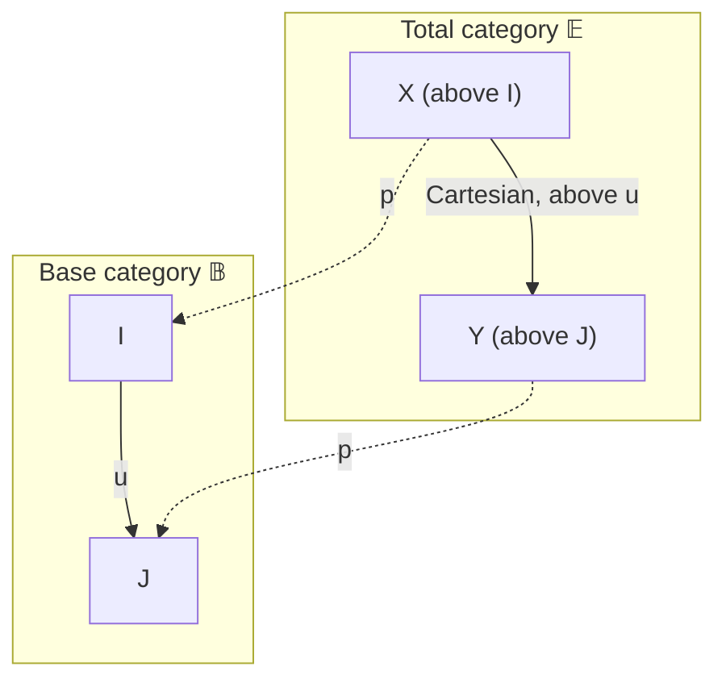
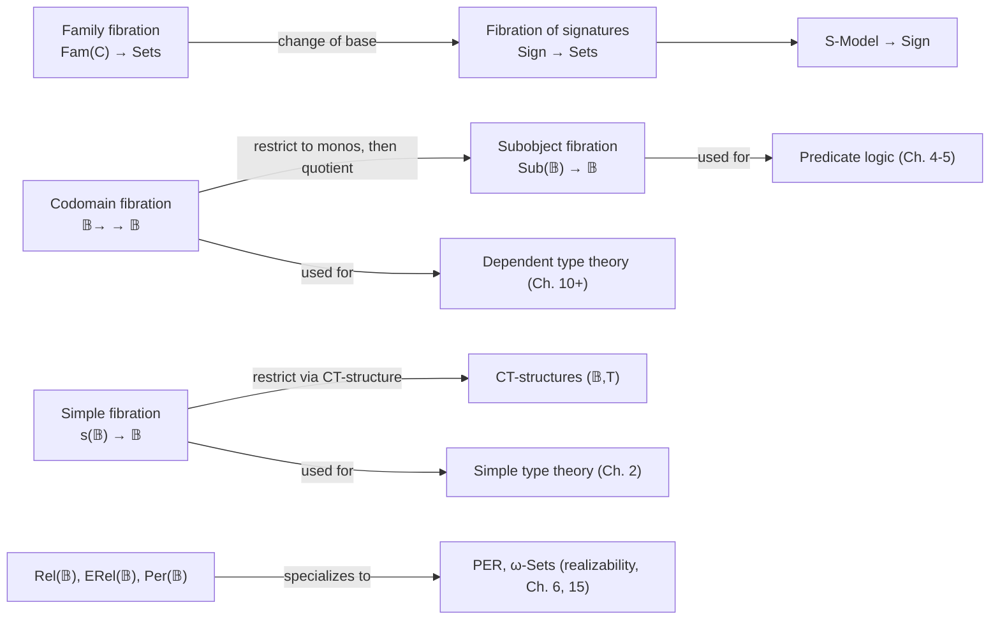

# Standard Fibrations Used Throughout the Book

[[book-guidelines|↩ Back to guidelines]]

## Why bother naming a handful of fibrations at all?

Jacobs' whole book runs on one slogan: *a logic is always a logic over a type theory*, and categorically this becomes *one fibration sitting on top of another*. That slogan is useless until you have concrete fibrations to plug into it. Chapter 1 spends its middle sections (1.1–1.3, 1.6) building exactly that toolkit: a small, fixed cast of fibrations that recur, by name, for the rest of the book's 700-odd pages. Every later construction — [[Simple-Type-Theory|simple type theory]], predicate logic, dependent types, [[Toposes|toposes]] — is obtained by taking one of these standard fibrations and asking it to satisfy extra closure properties (has products, has equality, has a generic object, ...).

If you are building a type checker or elaborator, the payoff of learning this vocabulary precisely is this: **a fibration is the categorical shape of "a family of things indexed by contexts,"** and a type checker's core data structure — a context together with the judgments that live over it — is always secretly a fibre of one of these fibrations. Once you see which fibration you're in, you immediately know what "substitution," "weakening," and "well-typedness" *mean* structurally, instead of having to re-derive them by hand each time.

### What breaks without a *fibration*, specifically

You could try to model "a type $\sigma$ possibly depending on variables in context $\Gamma$" naively as a function from contexts to sets of types. That's an **indexed category** presentation — and it works, but it forces you to carry around explicit functoriality/coherence data ($\Gamma \mapsto \mathrm{Types}(\Gamma)$, and for every substitution $\Gamma' \to \Gamma$ an actual substitution *function* $\mathrm{Types}(\Gamma) \to \mathrm{Types}(\Gamma')$ satisfying strict functor laws). Real elaborators very rarely have such strict, on-the-nose functoriality: reindexing along a composite substitution is *isomorphic*, not *equal*, to composing the two reindexings, unless you go out of your way to enforce it (this is the cloven/split distinction from §1.4, out of scope here but worth flagging). Jacobs' fix is to flip the presentation: instead of indexing by hand, package everything — base objects (contexts) *and* fibre objects (types-in-context, terms, propositions) — into one big total category $\mathbb{E}$, with a functor $p : \mathbb{E} \to \mathbb{B}$ remembering which context each thing lives over. "Substitution" then isn't extra data you supply — it's *recovered*, uniquely up to iso, from a universal-property lifting condition (the Cartesian morphism, Def. 1.1.3). This is what buys you the freedom to have only weak (natural-iso) functoriality when that's all you have, while still getting *a* substitution operation that behaves correctly.

## The recurring picture: base category, total category, fibres

Before the specific fibrations, fix the shared vocabulary from §1.1, since every fibration below is an instance of it. Given a functor $p : \mathbb{E} \to \mathbb{B}$:

- $\mathbb{B}$ is the **base category** — think "contexts" or "index objects."
- $\mathbb{E}$ is the **total category** — think "things classified over a context: types, terms, subsets, relations, models..."
- For $I \in \mathbb{B}$, the **fibre** $\mathbb{E}_I = p^{-1}(I)$ has as objects the $X \in \mathbb{E}$ with $pX = I$, and as morphisms those $f$ in $\mathbb{E}$ with $pf = \mathrm{id}_I$ (the **vertical** morphisms).
- A morphism $f : X \to Y$ in $\mathbb{E}$ over $u : I \to J$ is **Cartesian** if it is a *universal* lifting of $u$: every $g : Z \to Y$ over some $w$ factoring through $u$ (i.e. $pg = u \circ w$) factors uniquely through $f$ via a vertical-compatible $h$ above $w$.
- $p$ is a **fibration** if every $Y \in \mathbb{E}$ and every $u : I \to pY$ in $\mathbb{B}$ has a Cartesian lifting.



Read this diagram as: $\mathbb{B}$ is the world of contexts and substitutions; $\mathbb{E}$ is the world of "judgment-shaped" data over those contexts; $p$ forgets which context you're in; a Cartesian morphism over $u$ *is* — up to canonical vertical iso — the reindexing/substitution functor $u^{*} : \mathbb{E}_J \to \mathbb{E}_I$. Once a fibration is **cloven** (a chosen Cartesian lifting for every $u$), you literally get functors $u^{*}$ for every substitution, and this is precisely the substitution operation an elaborator implements.

**Rust [[Regular-and-Coherent-Categories#Grounding|grounding]].** A fibre $\mathbb{E}_I$ is exactly "the set of well-formed judgments over context $I$." If you model a context as `Ctx` and a type-in-context as an enum indexed loosely by it:

```rust
struct Ctx { bindings: Vec<(String, Type)> }

// A "fibre object": a type living over a specific context.
struct TypeInCtx {
    ctx: Ctx,
    ty: Type,
}

// Reindexing / substitution: u* : E_J -> E_I induced by a substitution u: I -> J.
fn reindex(u: &Substitution, ty_in_j: &TypeInCtx) -> TypeInCtx {
    TypeInCtx {
        ctx: u.source_ctx.clone(),
        ty: apply_substitution(u, &ty_in_j.ty),
    }
}
```

The forgetful map `TypeInCtx -> Ctx` (project out `.ctx`) is the functor $p$; `reindex` is (a chosen cleavage for) $u^{*}$. That `reindex` is *total and well-defined* is exactly the Cartesian-lifting property doing its job: it says "there's a canonical, unique-up-to-iso way to specialize a judgment along a substitution," which is what makes substitution lemmas in a type-safety proof go through at all.

## The seven standard fibrations

### 1. The family fibration

**Motivation.** The most primitive notion of "many things indexed by a set" is a pointwise family $(X_i)_{i \in I}$ — an $I$-indexed tuple of objects of some category $\mathcal{C}$. Jacobs wants this literally packaged as a fibration over $\mathbf{Sets}$, because "index set" is exactly what a base category is for.

**Definition (§1.2, Def. 1.2.1).** For an arbitrary category $\mathcal{C}$, $\mathrm{Fam}(\mathcal{C})$ has objects $(X_i)_{i \in I}$ — equivalently pairs $(I, X)$ with $X : I \to \mathcal{C}_0$ a function into the objects of $\mathcal{C}$ — and a morphism $(X_i)_{i \in I} \to (Y_j)_{j \in J}$ is a pair $(u, (f_i)_{i \in I})$ with $u : I \to J$ a function and $f_i : X_i \to Y_{u(i)}$ a morphism in $\mathcal{C}$ for each $i$. The projection $p : \mathrm{Fam}(\mathcal{C}) \to \mathbf{Sets}$, $(X_i)_{i \in I} \mapsto I$, is the **family fibration** of $\mathcal{C}$; a Cartesian lifting of $u : I \to J$ over $(Y_j)_{j \in J}$ is obtained by literally *reindexing*, $(Y_{u(i)})_{i \in I}$, with identity components. The fibre over $I$ is the functor category $\mathcal{C}^I$.

Taking $\mathcal{C} = \mathbf{Sets}$ recovers *pointwise indexing* of sets by sets, and Jacobs proves (Prop. 1.2.2) that $\mathrm{Fam}(\mathbf{Sets})$ is equivalent, as a fibration, to the codomain fibration $\mathbf{Sets}^{\to} \to \mathbf{Sets}$ below — this equivalence is the precise categorical statement that "indexing pointwise" and "indexing by a display map" are the same information, just packaged two ways.

**What breaks without this.** If you insist on always presenting indexed data as a single map $\varphi : X \to I$ (the "display" style below), you lose the ability to talk cleanly about a family whose fibre category is something other than $\mathbf{Sets}$ — e.g. a family of *models*, or a family of *vector spaces* — without first flattening everything into one big total set/space. $\mathrm{Fam}(\mathcal{C})$ keeps $\mathcal{C}$ as an explicit parameter, which is exactly how Jacobs later builds the family fibration of models, of PERs, of signatures, etc., by simply changing $\mathcal{C}$.

**Rust [[Simple-Type-Theory#Grounding|grounding]].** `Fam(C)` is a `HashMap<Index, C>`-shaped structure, or more precisely a dependent function `I -> C` reified as data:

```rust
struct Family<I, C> {
    index: I,          // the base object
    at: std::collections::HashMap<I, C>, // the I-indexed C-objects (schematically)
}
```

In Lean terms, `Fam(C)` for `C = Type` is essentially `Σ (I : Type), I → C` — a sigma type of an index type and a family of types over it. This is worth pausing on: **the family fibration of `Sort`/`Type` in Lean's own metatheory is, categorically, exactly $\mathrm{Fam}(\mathbf{Sets})$** — it's the fibration your elaborator's own universe of dependent types lives in.

### 2. The codomain fibration

**Motivation.** Dual to pointwise indexing is *display* indexing: instead of handing over a family as a lookup table, you hand over a single map $\varphi : X \to I$, and the "family" is the collection of fibres $\varphi^{-1}(i)$. This is how dependent types are represented syntactically almost everywhere (a display map is the categorical residue of "a type $B(x)$ depending on $x : A$," realized as a projection $\{(x, b) \mid b : B(x)\} \to A$).

**Definition (§1.1, Def. 1.1.5–1.1.6).** For a category $\mathbb{B}$, the arrow category $\mathbb{B}^{\to}$ has objects $\varphi : X \to I$ and morphisms pairs $(u, f)$ making the obvious square commute. The **codomain functor** $\mathrm{cod} : \mathbb{B}^{\to} \to \mathbb{B}$, $\varphi \mapsto I$, has fibre over $I$ equal to the slice category $\mathbb{B}/I$. Jacobs proves: (i) Cartesian morphisms in $\mathbb{B}^{\to}$ are exactly **pullback squares** in $\mathbb{B}$; (ii) $\mathrm{cod}$ is a fibration *iff* $\mathbb{B}$ has pullbacks — in that case it is called the **codomain fibration** on $\mathbb{B}$.

So reindexing $u^{*}$ in the codomain fibration is literally "pull back along $u$." This is the fibration Jacobs singles out (Remark 1.3.4) as one of the book's two **type-theoretic fibrations**: the codomain fibration is used for the categorical semantics of *dependent* type theory (types-in-context become display maps; a type $B$ depending on $x : A$ is a map $B \to A$, and substitution $B[a/x]$ is pullback along $a : 1 \to A$).

**What breaks without this.** Trying to do dependent types purely in the family-fibration style forces you to carry a literal function from *elements* of the index to objects, which doesn't compose well with categorical structure (limits, exponentials) unless the ambient category already looks like $\mathbf{Sets}$. Pullback-based reindexing generalizes immediately to any category with pullbacks — realizability categories, domains, presheaf toposes — which is exactly the generality the later chapters need.

**Rust grounding.** A display map is naturally an indexed enum or a dependent-sum-shaped struct:

```rust
// "B -> A" as a display map: elements of B come tagged with which fibre (A-value)
// they sit over.
struct Display<A, B> {
    project: fn(&B) -> A, // the map φ : B → A
}

// Pullback / substitution along u : I -> A: reindex B over I.
fn pullback<A: PartialEq, I, B: Clone>(
    u: impl Fn(&I) -> A,
    disp: &Display<A, B>,
    total_b: &[B],
) -> Vec<(I, B)> {
    // conceptually: { (i, b) | φ(b) = u(i) }
    unimplemented!()
}
```

**Lean grounding — this is the load-bearing one for your elaborator.** Lean's own dependent function/sigma types *are* the internal-language rendering of the codomain fibration. A judgment `Γ ⊢ B : Type` (a type depending on context `Γ`) is exactly an object of the fibre $\mathbb{E}_\Gamma$ over $\Gamma$ in a codomain-shaped fibration where $\mathbb{B}$ is the category of contexts. Substitution `B[σ]` for a context morphism `σ : Δ → Γ` is reindexing $\sigma^{*}$, which is *definitionally* how Lean computes `Type`-valued metavariable instantiation during elaboration — every time the elaborator specializes a dependent type at a metavariable assignment, it is applying the Cartesian lifting of the codomain fibration. This is the precise sense in which "substitution lemma soundness" in a dependent type checker is a statement about Beck–Chevalley-style coherence of reindexing (developed further in §1.9, out of scope here, but this is where it starts).

### 3. The subobject fibration

**Motivation.** Restrict the codomain fibration further: instead of all maps into $I$, only keep the *monic* ones — the subobjects. This is the categorical shape of "predicates over $I$" or "propositions in context $I$," and it is the fibration used throughout the book to model **logic** as opposed to types.

**Definition (§1.3).** $\mathrm{Mono}(\mathbb{B})$ is the full subcategory of $\mathbb{B}^{\to}$ on monic maps $X \rightarrowtail I$; if $\mathbb{B}$ has pullbacks, the restricted codomain functor is the **fibration of monos** — its fibres are automatically **preordered** (a *fibred preorder*), since between two monos $m, n$ into $I$ there is at most one map $m \Rightarrow n$ over $I$. Quotienting each fibre by the induced preorder ($m \sqsubseteq n$ iff there's a map $f$ with $n \circ f = m$; $m \cong n$ iff mutually so) yields **subobjects**, and the category $\mathrm{Sub}(\mathbb{B})$ obtained this way, fibred over $\mathbb{B}$, is the **subobject fibration**. For $\mathbb{B} = \mathbf{Sets}$, $\mathrm{Sub}(\mathbf{Sets})$ was already introduced in the Prospectus as $\mathbf{Pred} \to \mathbf{Sets}$, with fibre $\mathrm{Sub}(I) \cong (\mathcal{P}I, \subseteq)$.

Jacobs explicitly flags (Remark 1.3.4) that the subobject fibration, the simple fibration, and the codomain fibration are "the three fibrations that will play a crucial role in this book," and that the subobject fibration specifically will be used to describe **internal (predicate) logic** — connectives are fibrewise structure, quantifiers are adjoints to weakening (Chapter 4), and the axiomatic characterization of *when* a fibration is (equivalent to) a subobject fibration is Theorem 4.9.4, one of the book's central results.

**What breaks without this.** If logic is modeled inside the full codomain fibration (all maps, not just monos), "a predicate holds" and "a term of dependent type exists" become indistinguishable — you'd be conflating *propositions* with *data*. Restricting to monos, and then to *preordered* fibres, is precisely what encodes proof-irrelevance for propositions (there's at most one proof-morphism between two subobjects related by entailment) while dependent types in the codomain fibration keep their full non-preordered structure (multiple distinct terms of the same type). This distinction is exactly what separates a refinement-type system's "proposition" layer from its "data" layer.

**Rust grounding.** A subobject of `I` is naturally a predicate/filter, not an arbitrary map:

```rust
// A subobject X ↪ I, represented as (equivalent to) a predicate on I.
struct Subobject<I> {
    holds: fn(&I) -> bool,   // the monic inclusion, "propositionally"
}

// Reindexing u* along u : J -> I: pull the predicate back.
fn reindex_pred<J, I>(u: impl Fn(&J) -> I, sub: &Subobject<I>) -> Subobject<J> {
    unimplemented!() // holds_J(j) = holds_I(u(j))
}
```

**Lean grounding.** This is exactly `Prop`-valued predicates vs. `Type`-valued families in Lean: `P : I → Prop` lives in the fibre of the subobject fibration over `I`, whereas `B : I → Type` lives in the fibre of the codomain fibration over `I`. Lean's proof irrelevance for `Prop` is the type-theoretic shadow of "fibres of the subobject fibration are preorders" — two proofs of the same proposition are definitionally/propositionally identified, exactly as two monos representing the same subobject are identified up to the unique comparison iso.

### 4. The simple fibration and simple slices

**Motivation.** Both the codomain and subobject fibrations vary the *object* being indexed while keeping full categorical structure. But simple type theory (Chapter 2) needs something more restrictive and more computational: a way to talk about "$I$-indexed families of maps into a *fixed* object $X$" without ever forming dependent sums. This is what the simple fibration is for, and Jacobs flags it as central "in the next chapter on simple type theory."

**Definition (§1.3, Def. 1.3.1).** For $\mathbb{B}$ with Cartesian products, $s(\mathbb{B})$ has objects pairs $(I, X)$ (both ordinary objects of $\mathbb{B}$) and a morphism $(I, X) \to (J, Y)$ is a pair $(u, f)$ with $u : I \to J$ and $f : I \times X \to Y$ — note $f$'s domain is a *product*, not a dependent sum. The projection $s_{\mathbb{B}} : s(\mathbb{B}) \to \mathbb{B}$ is the **simple fibration**; the fibre over $I$, written $\mathbb{B}/\!/I$ (the **simple slice**), has the *same objects as $\mathbb{B}$* but morphisms $X \to Y$ given by $I \times X \to Y$. This is the crucial difference from the ordinary slice $\mathbb{B}/I$: a simple slice re-uses $\mathbb{B}$'s objects wholesale, whereas the ordinary slice's objects are maps into $I$.

Concretely: maps in the fibre $s(\mathbb{B})_I$ are $I$-indexed families $f_i : X \to Y$ for $i \in I$, with $X, Y$ held *fixed* — this is "simple" (non-dependent) parametrization, contrasted with the family fibration's fully dependent indexing.

**Generalization: CT-structures.** Def. 1.3.2 restricts the simple fibration to a chosen subcollection of objects: a **CT-structure** is a pair $(\mathbb{B}, T)$ where $\mathbb{B}$ has finite products and $T \subseteq \mathrm{Obj}(\mathbb{B})$ is a non-empty class of designated "**types**" (the 'C' is for "context," the 'T' for "type" — $\mathbb{B}$ is thought of as a category of *contexts*, and $T \subseteq \mathrm{Obj}(\mathbb{B})$ picks out which objects count as legitimate types, via the identification of a type $\sigma$ with the singleton context $(x : \sigma)$). It is **non-trivial** if some $X \in T$ has a global element $1 \to X$. The **simple fibration associated to $(\mathbb{B}, T)$**, $s(T) \to \mathbb{B}$, restricts the second component of objects to $T$. The two extremes: $T = \mathrm{Obj}(\mathbb{B})$ recovers the full simple fibration $s(\mathbb{B})$; $T = \{\Omega\}$ a single type gives $s(\Omega) \to \mathbb{B}$, used later (§2.5) for the **untyped lambda calculus** modeled as "typed with exactly one type."

**What breaks without this.** If you tried to model simply-typed exponentials $X \Rightarrow Y$ directly as ordinary CCC exponentials, you would be forced to first assume $\mathbb{B}$ has all finite products — but $\lambda 1$ (the minimal exponent-only calculus in §2.3) is deliberately designed *not* to assume product types exist. The simple fibration sidesteps this: an exponent becomes a **simple product** (a fibred right adjoint to weakening) inside $s(\mathbb{B})$, which requires no ambient product structure on $\mathbb{B}$ at all — Jacobs' Lemma in §2.4 shows $(\mathbb{B}, T)$ supports exponents iff $T$ is closed under $X \Rightarrow Y$, full stop.

**Rust grounding.** A simple slice's morphisms are curried functions, i.e. a simple fibration is what you get if you model "context-indexed function types" using ordinary Rust closures instead of dependent records:

```rust
// A morphism in the fibre over I, from X to Y in the simple slice B//I:
// a function I × X -> Y, i.e. a closure capturing I.
struct SimpleSliceHom<I, X, Y> {
    apply: Box<dyn Fn(&I, &X) -> Y>,
}
```

This is precisely how a non-dependently-typed language's function types are compiled: `fn(X) -> Y` inside an environment `I` is `I × X -> Y` curried on `I`. It is the categorical reason "simple type theory doesn't need dependent sums to get exponentials" — your compiler's ordinary closures already witness this.

**Lean/Python note.** This construct is intrinsically about *non-dependent* function spaces, so Lean grounding is less natural here (Lean's `→` is already the dependent codomain-fibration story); a short Python sketch is more apt for illustrating "same objects, product-shifted homs":

```python
# CT-structure with T = {Omega}: untyped lambda calculus as one-type STT.
class UntypedTerm:
    def __init__(self, body): self.body = body  # Omega -> Omega, reflexively
```

### 5. Fibrations of relations and partial equivalence relations

**Motivation.** Equality, and more generally binary relations, need their own fibred home, because later chapters (Chapter 3 onward) treat equality itself as *adjoint data* (Lawvere's equality-as-left-adjoint-to-contraction), and PERs specifically are the backbone of [[Full-Higher-Order-Dependent-Type-Theory#The realizability models|the realizability models]] used throughout (§1.2, Chapters 4–6, 15).

**Definitions (§1.2–1.3).**
- An **$\omega$-set** $(X, E)$ is a set $X$ with an existence predicate $E(x) \subseteq \mathbb{N}$, $E(x) \neq \emptyset$, for each $x \in X$; a morphism $f : (X,E) \to (Y,E)$ is a function *tracked* by a Kleene code $e$: for $x \in X$, $n \in E(x)$, $e \cdot n$ is defined and lies in $E(f(x))$. This gives the category $\omega\text{-}\mathbf{Sets}$.
- A **partial equivalence relation (PER)** is a symmetric, transitive (not necessarily reflexive) relation $R$ on $\mathbb{N}$; write $|R|$ for its domain (where it *is* reflexive) and $\mathbb{N}/R$ for the quotient. $\mathbf{PER}$ is the resulting category, with $\mathbf{Sets} \hookrightarrow \omega\text{-}\mathbf{Sets} \hookleftarrow \mathbf{PER}$ a reflective-subcategory chain (Ex. 1.2.9: $\mathbf{PER}$ is equivalent to the full subcategory of $\omega$-sets with *disjoint* existence-predicate images, i.e. **modest sets**).
- For an arbitrary $\mathbb{B}$ with finite limits, a **relation** on $I$ is a subobject $R \rightarrowtail I \times I$; $\mathrm{Rel}(\mathbb{B})$ has these as objects, fibred over $\mathbb{B}$ via the carrier $I$ (again a fibration, since monos pull back to monos). A relation $R \rightarrowtail I \times I$ (with legs $r_1, r_2$) is:
  - **reflexive** if the diagonal $\delta_I = (\mathrm{id}, \mathrm{id})$ factors through $R$;
  - **symmetric** if there is a "swap" map making $R$ self-commute under the transposed legs $(r_2, r_1)$;
  - **transitive** if a canonically-constructed pullback of composable pairs factors through $R$ (diagrammatic composability, not element-chasing).

  A relation that is reflexive, symmetric, and transitive is an **equivalence relation**; symmetric and transitive but not necessarily reflexive is a **partial equivalence relation**, giving fibrations $\mathrm{ERel}(\mathbb{B}) \to \mathbb{B}$ and $\mathrm{Per}(\mathbb{B}) \to \mathbb{B}$ respectively — internal to *any* $\mathbb{B}$ with finite limits, generalizing the number-theoretic $\mathbf{PER}$ above to an arbitrary base.

**What breaks without this.** Naively defining "equivalence relation" set-theoretically (as a subset of $I \times I$ closed under three first-order axioms) doesn't survive reindexing along an arbitrary morphism in a general category with only finite limits — you need the diagrammatic (pullback-based) reformulations above precisely so that "being a PER" is *stable under substitution*, which is what makes $\mathrm{Per}(\mathbb{B})$ itself a fibration rather than just a fibrewise-defined property.

**Lean/Rust grounding — this is directly your unification/definitional-equality machinery.** A PER is the exact categorical shape of a **partial** equality judgment: not every term is "equal to itself" (not reflexive), only those that are *well-behaved* (e.g., terminating, or well-typed) are guaranteed `x ~ x`. This is precisely the situation in an elaborator with metavariables: `isDefEq(?m, e)` is a symmetric, transitive relation on partial elaboration states, but it is *not* reflexive on ill-formed/stuck terms. Modeling definitional equality as a PER rather than a total equivalence relation is the technically correct way to represent "defined but possibly-non-terminating" computation:

```rust
// A PER on terms: not every term is related to itself.
trait PartialEqRel<T> {
    fn related(&self, a: &T, b: &T) -> bool; // symmetric, transitive
    // NOTE: deliberately no `reflexive` requirement — related(a, a) may be false
    // for stuck / ill-typed / non-terminating a.
}
```

```lean
-- Lean's `Eq` is a *total* equivalence relation on well-formed terms of a type;
-- the PER perspective is what you need if you model definitional equality
-- over an untyped or partially-elaborated term syntax, where `t ~ t` can fail
-- (e.g. t loops, or t contains unresolved metavariables).
def PER (α : Type) := { R : α → α → Prop // (∀ x y, R x y → R y x) ∧
                                            (∀ x y z, R x y → R y z → R x z) }
```

### 6. Fibrations of signatures

**Motivation.** Everything above concerns fibrations of *semantic* structure. Chapter 1 closes (§1.6) by fibring the *syntactic* side too: signatures — the raw material (types + typed function symbols) out of which a logic or type theory is generated — should themselves form a fibration, because a signature is "a bunch of function-symbol data indexed by its underlying set of types," which is exactly a change-of-base instance of the family fibration.

**Definition (§1.6, Def. 1.6.1).** A **many-typed signature** is a pair $\Sigma = (T, \mathcal{F})$: $T$ a set of basic types, and $\mathcal{F} : T^{\star} \times T \to \mathbf{Sets}$ assigning to each pair (input-type-sequence, output-type) a set of function symbols $F : \sigma_1, \ldots, \sigma_n \to \sigma_{n+1}$. A morphism of signatures $\Sigma \to \Sigma'$ is a function on types plus a compatible family of functions on function symbols. Jacobs defines $\mathbf{Sign}$ **by change-of-base**, in one crisp diagram:
$$
\begin{array}{ccc}
\mathbf{Sign} & \to & \mathrm{Fam}(\mathbf{Sets}) \\
\downarrow & & \downarrow \\
\mathbf{Sets} & \xrightarrow{T \mapsto T^{\star}\times T} & \mathbf{Sets}
\end{array}
$$
i.e. $\mathbf{Sign} \to \mathbf{Sets}$ (sending $\Sigma \mapsto |\Sigma|$, its type set) is obtained by pulling back the family fibration $\mathrm{Fam}(\mathbf{Sets}) \to \mathbf{Sets}$ along the "Kleene star" functor $T \mapsto T^{\star} \times T$. Since change-of-base of a (split) fibration is again a (split) fibration (Lemma 1.5.1, invoked here), $\mathbf{Sign} \to \mathbf{Sets}$ is a **split fibration** essentially for free — this is Jacobs' running illustration that once you have a small stock of standard fibrations plus closure operations (here: change-of-base, from §1.5), new fibrations of practical interest (here: signatures) come out "at once," as he puts it, rather than needing bespoke verification.

On top of signatures sit **terms** (defined inductively from typed variables and function symbols, with the usual free-variable and substitution operations) and **[[First-Order-Predicate-Logic#Set-theoretic models|set-theoretic models]]** (a $T$-indexed family of carrier sets plus one function per function symbol). Models organize into a category $\mathbf{S\text{-}Model}$ with two composable projection functors
$$
\mathbf{S\text{-}Model} \to \mathbf{Sign} \to \mathbf{Sets},
$$
and Jacobs proves (Lemma 1.6.6) that $\mathbf{S\text{-}Model} \to \mathbf{Sign}$ is *also* a split fibration, with fibre over $\Sigma$ the category of $\Sigma$-models — the **initial model** in that fibre is the term model on the empty set of variables (every element is literally a closed term). This double-fibred stack (models over signatures over type-sets) is the direct ancestor of Chapter 2's **functorial (Lawvere) semantics**, where a model becomes a finite-product-preserving functor out of the classifying category $\mathfrak{C}(\Sigma)$.

**What breaks without this.** Without exhibiting $\mathbf{Sign} \to \mathbf{Sets}$ as a fibration, "changing which types a signature ranges over" and "translating one signature into another" would need to be handled as separate, ad hoc constructions. Framing it as change-of-base means the substitution functor $u^{*}$ for a type-renaming $u : T \to |\Sigma|$ — i.e. *relabeling* a signature's types — comes for free from the general theory, and composes correctly with everything else built via change-of-base in the same chapter (§1.5).

**Rust grounding — this is close to literal compiler infrastructure.** A signature is exactly a symbol table indexed by arities:

```rust
struct Signature {
    types: Vec<TypeId>,
    // F : σ1,...,σn -> σ_{n+1}, keyed by (arg types, result type)
    symbols: std::collections::HashMap<(Vec<TypeId>, TypeId), Vec<SymbolId>>,
}

// A model / algebra for a signature: one carrier set (as a Rust type or enum
// of values) per basic type, plus one function per symbol, arity-checked
// against the signature.
struct Model {
    carriers: std::collections::HashMap<TypeId, CarrierSet>,
    interpret: std::collections::HashMap<SymbolId, Box<dyn Fn(&[Value]) -> Value>>,
}
```

The fact that `S-Model -> Sign -> Sets` is a *chain* of fibrations is the categorical reason a compiler's "symbol table" and "runtime environment/model" layers are cleanly separable: renaming/relabeling types (an operation on `Sign`) reindexes both the signature *and* every model over it, functorially and predictably — which is exactly the guarantee you want before implementing signature morphisms (e.g. module instantiation, or universe-polymorphic signature specialization) in a compiler front end.

## Synthesis: how these seven fit into the book's architecture



Jacobs' Remark 1.3.4 is the key orienting sentence: the **simple** and **codomain** fibrations are the book's *type-theoretic* fibrations (simple type theory and dependent type theory respectively), while the **subobject** fibration is the vehicle for *logic* on top of either. Everything else in this list either instantiates one of those three at a specific base category (the family fibration is the $\mathrm{Fam}(\mathbf{Sets})$-flavored presentation equivalent to the codomain fibration; $\mathbf{PER}$/$\omega\text{-}\mathbf{Sets}$ are concrete realizability models living inside the family/relation fibrations), or supplies the syntactic scaffolding (signatures) that the semantic fibrations above are eventually asked to classify.

The single biggest payoff of internalizing this list before Chapter 2 onward: whenever the book says "we now show fibration $p$ has [products / equality / a generic object / quotients]," you should immediately ask *which* of these seven $p$ is (or is built from), because the axioms attached to each closure property were reverse-engineered from what these seven examples already satisfy or fail to satisfy (e.g. $\mathbf{PER}$ famously does *not* extend to a full higher-order fibration — Streicher's cardinality obstruction, flagged for Chapter 5 — precisely because of how the PER fibration's fibres are built).

## Where this leads

- The **simple fibration** and **CT-structures** are the direct setup for Chapter 2's simple type theory, where exponents are recast as *simple products* (fibred adjoints to weakening) rather than ordinary CCC exponentials — sidestepping the need for product types in the minimal calculus $\lambda 1$.
- The **codomain fibration** reappears, closed under local-Cartesian-closedness, as the model of dependent type theory in Chapter 10 and [[Full-Higher-Order-Dependent-Type-Theory#The definition|the definition]] of a topos ("$\mathbb{B}$ is locally Cartesian closed") in Chapter 5.
- The **subobject fibration** is the backbone of first-order predicate logic (Chapter 4), where quantifiers become simple products/coproducts internal to $\mathrm{Sub}(\mathbb{B})$, and its axiomatic characterization ([[Equational-Logic#Very strong equality|very strong equality]] + [[Subset-Types-and-Quotient-Types#Full subset types|full subset types]] + unique choice) is Theorem 4.9.4.
- **$\omega$-Sets and PERs** are picked back up in full in Chapter 6 (Realizability Models) as objects of [[The-Effective-Topos|the effective topos]], where the family/relation fibrations built here become the machinery for Kleene realizability, Church's Thesis, and recursive mathematics.
- The **fibration of signatures** is the direct precursor of Chapter 2's classifying category $\mathfrak{C}(\Sigma)$ and Lawvere's functorial semantics — the adjunction $\mathfrak{C}(-) \dashv \mathrm{Sign}(-)$ between signatures and finite-product categories is exactly what turns a signature into a syntax-independent term model. For the elaborator project specifically, this is the layer where "signature + model" becomes "classifying category + product-preserving functor," which is the abstract shape of "type-check against a symbol table" your compiler front end will implement concretely.
