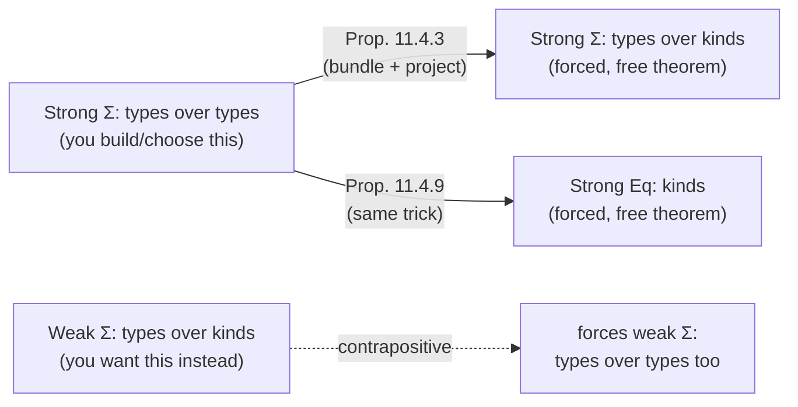

[[book-guidelines|↩ Back to guidelines]]

# Strength of Sum and [[Polymorphic-Type-Theory#Equality types|Equality Types]]

## The question this section finally makes precise

Twice already in this book, a distinction between "weak," "strong," and "very strong" versions of a construct has shown up and been left semi-informal. [[Equational-Logic|Chapter 3]] gave you Lawvere's picture of equality as a left adjoint to contraction, and flagged **[[Equational-Logic#Very strong equality|very strong equality]]** as the extra property "internal equality implies external equality" — the thing that makes a type theory extensional and its type-checking undecidable in general. [[First-Order-Dependent-Type-Theory|Chapter 10]] (Theorem 10.5.10) then did the same move for dependent sum types: **strong** $\Sigma$-elimination is what lets you actually project components back out of a pair with a definitional (not just propositional) computation rule, and it corresponds categorically to fibred coproducts whose canonical comparison map is *orthogonal* to the projections, with **very strong** meaning that map is an *isomorphism*.

Section 11.4 does something genuinely useful: it stops treating "strong" as a per-construct ad hoc adjective and gives a single, uniform, syntactic knob that produces weak/strong/very-strong sums *and* weak/strong/very-strong equality out of the same mechanism. The knob is: **which extra variable is the elimination motive allowed to see?** Once you see the knob, you can ask "how strong is *this* eliminator" of any type former in any calculus — not just the two Jacobs happened to name in Chapters 3 and 10 — and the answer is decided by nothing more than *what the motive's type is allowed to depend on*. That uniform answer is also the machine that produces this section's one surprising theorem (Prop. 11.4.3): strength is not always something you get to choose freely — sometimes strength at one level of the universe hierarchy *forces* strength one level up, whether you wanted it or not.

## Why "strength" is a spectrum and not a yes/no property

Here is the concrete problem. Suppose you have a dependent sum (existential) type $\Sigma a{:}A.\,\sigma$ — think of it as "a pair of a type-index $a$ and a value $x$ of type $\sigma$ depending on $a$" — and you want to eliminate (pattern-match) it: given $z : \Sigma a{:}A.\,\sigma$, produce something of some target type $p$ by unpacking $z$ into its components $a$ and $x$.

The question the book asks, that most textbooks and most working type-checkers gloss over, is: **when you write down the target type $p$, are you allowed to mention $z$ itself in it?**

This sounds like a small technicality. It is not. It is exactly the difference between:

- **Non-dependent elimination** — $p$ is a fixed type, computed before you even look at $z$. You can consume a sum, but you can never say "the result type depends on which pair you gave me."
- **Dependent (motive-generic) elimination** — $p$ can mention a fresh variable standing for $z$'s *type*, e.g. "if you fed me a sum whose second component lives in $\sigma[a]$, I promise to give you back something in $p[a]$" — but $p$ cannot mention $z$'s *value*.
- **Fully dependent elimination** — $p$ can mention $z$'s *value* directly. Now you can write things like "the result type is $\text{Vect}(n)$ where $n$ is literally the first component of the pair I was handed" and have that be checked, not just asserted.

**What breaks without the strongest version:** if your eliminator can't put $z$ itself into the return type, you cannot state — let alone prove by definitional unfolding — that unpacking a specific pair $(M,N)$ and immediately reusing it is the same term as $N$ itself. You get *propositional* equalities you have to prove by induction, instead of *definitional* equalities the type-checker verifies by unfolding. This is the entire reason Lean, Coq, and Agda distinguish `rfl`-checkable definitional equality from `Eq`/`=`-provable propositional equality — and it is exactly what "strong" vs "weak" elimination is doing here, just stated for a general categorical semantics rather than for one specific proof assistant's kernel.

The same knob, turned on equality types instead of sum types, answers a different practical question: when you eliminate a proof of $M =_\sigma N$ (i.e. you have some $z : \mathrm{Eq}_A(M,N)$ and want to use it), can the type you're proving *itself* mention $z$? If yes, you can do the thing every dependent-pattern-matching language relies on: substitute $N$ for $M$ *inside the type itself*, not just inside the term. If no, you're stuck doing classical Leibniz-substitution style reasoning where the type was already fixed before you knew the two things were equal.

## The three elimination rules for sums, unpacked

Jacobs works in a setting with two syntactic universes, `Kind` and `Type` (kinds classify types, types classify terms — the same "next level up" pattern as `Type : Kind : Sort` towers in real proof assistants). The construct under study is the **polymorphic sum** $\Sigma a{:}A.\,\sigma$ of *types* $\sigma$ indexed over a *kind* $A$ — e.g., "the type of some existentially-packaged type together with a value of that type," a `dyn Trait`-flavored existential package.

**Weak elimination.** The motive $p$ is chosen *before* you know anything about the specific packed value:

$$
\dfrac{\Xi \mid \Gamma \vdash p:\mathrm{Type} \qquad \Xi,a{:}A \mid \Gamma,x{:}a \vdash Q:p}
{\Xi \mid \Gamma,z{:}\Sigma a{:}A.\,a \vdash (\text{unpack } z \text{ as } (a,x) \text{ in } Q):p}\quad(\text{weak})
$$

$p$ has no way to refer to $z$ or even to the bound variable $a$ that unpacking introduces. This is the elimination rule you'd write for plain polymorphic (non-dependent) type theory — think Rust's `dyn Trait` object: you can call trait methods on it, but the *return type* of your consuming function can never depend on which concrete type was erased inside the box.

**Strong elimination.** Now $p$ is allowed to mention the sum-typed variable $z$ itself (as a term of type $\Sigma a{:}A.\,\sigma$, sitting in a `Type`-classified motive):

$$
\dfrac{\Xi \mid \Gamma, z{:}\Sigma a{:}A.\,\sigma \vdash p:\mathrm{Type} \qquad \Xi,a{:}A \mid \Gamma,x{:}a \vdash Q:p[(a,x)/z]}
{\Xi \mid \Gamma,z{:}\Sigma a{:}A.\,\sigma \vdash (\text{unpack } z \text{ as } (a,x) \text{ in } Q):p}\quad(\text{strong})
$$

This is only well-formed in a type theory where *types can depend on types* (Jacobs' "polymorphic **dependent** type theory," PDTT) — you need a place for a variable of the sum type to live inside a type-classified expression. This is the rule that lets you write, e.g., "given a packed `(dim, vector)` pair, produce a value whose *type itself* mentions `dim`" — dependent pattern matching in the small.

**Very strong elimination.** The motive $p$ is now allowed to range over *either* `Type` *or* `Kind` — and either way, it can mention $z$:

$$
\dfrac{\Gamma, z{:}\Sigma x{:}A.\,\sigma \vdash C:\mathrm{Type}/\mathrm{Kind} \qquad \Gamma,a{:}A,x{:}a \vdash Q:C[(a,x)/z]}
{\Gamma,z{:}\Sigma a{:}A.\,\sigma \vdash (\text{unpack } z \text{ as } (a,x) \text{ in } Q):C}\quad(\text{very strong})
$$

This only type-checks in a calculus where *kinds may depend on types* — Jacobs notes this is not yet available in PDTT and has to wait for FhoDTT (§11.5), because it requires contexts that mix kind- and type-declarations freely ($x_1{:}C_1,\dots,x_n{:}C_n$ where each $C_i$ may itself be a kind or a type).

**The unifying knob, stated plainly:** weak = motive can't see the eliminee at all; strong = motive can see the eliminee, but only inside a same-or-lower universe; very strong = motive can see the eliminee and jump *up* a universe level. In every case the reduction ($\beta$) and expansion/uniqueness ($\eta$) conversions are identical — `unpack (M,N) as (a,x) in Q` reduces to `Q[M/a,N/x]` regardless of strength. **Strength is entirely a statement about what the type-checker is allowed to *state*, not about what the term *computes to*.** This is worth sitting with: the operational content of pattern-matching a pair never changes; strength is purely a property of the *typing discipline* wrapped around it.

**Remark 11.4.1, and why it matters for your mental model:** if `Kind` and `Type` happen to coincide (as in first-order dependent type theory, Chapter 10), strong and very strong collapse into the same thing — there's no "jump up a universe" to distinguish, because there's only one universe. So the strong/very-strong split is *only* visible once you have at least two distinct universe levels in play — which is precisely why Chapter 10's $\Sigma$-types only ever needed the strong/weak dichotomy, while this chapter needs the third rung.

## Categorical formulation: orthogonality vs. isomorphism

Recall from [[First-Order-Dependent-Type-Theory]] (Def. 10.5.2) the **canonical map** $\kappa: \{A\} \to \{\coprod_X(A)\}$ that compares an object with the coproduct-of-a-coproduct construction, arising from the (op)cartesian lifting used to define the coproduct itself. Section 11.4 reuses this exact map, now between two possibly-different comprehension categories $\mathcal{D} \xrightarrow{P} \mathbb{B}^\rightarrow \xleftarrow{Q} \mathcal{E}$ over a shared base — one comprehension category modeling kinds ($\mathcal E$), the other types ($\mathcal D$):

- $Q$ has **$P$-coproducts** if the underlying fibration has ordinary fibred coproducts $\coprod_X$ (left adjoints to reindexing, satisfying Beck–Chevalley).
- $Q$ has **strong $P$-coproducts** if, additionally, $\kappa$ is **orthogonal** to every $Q$-projection: for any commuting square from $\kappa$ into a $Q$-projection, there's a *unique* diagonal filler. Concretely (Lemma 11.4.5): given $u:\{A\}\to\{B\}$ over $\{\coprod_X(A)\}$, there's a unique $\bar u:\{\coprod_X(A)\}\to\{B\}$ with $\bar u\circ\kappa=u$ and $\pi_B\circ\bar u=\mathrm{id}$. That unique filler *is* the strong eliminator — categorical orthogonality and strong elimination are the same fact stated in two vocabularies.
- $Q$ has **very strong $P$-coproducts** if $\kappa$ is not just orthogonal to projections but an outright **isomorphism**. An isomorphism is orthogonal to *everything*, so very-strong $\Rightarrow$ strong $\Rightarrow$ ordinary, always — the spectrum really is a strict hierarchy, not three independent options.

The picture for equality is the mirror image with contraction in place of weakening: $Q$ has **strong $P$-equality** when the canonical comparison $\kappa:\{A\}\to\{\mathrm{Eq}_X(A)\}$ (built from the left adjoint $\mathrm{Eq}_X \dashv \delta_X^*$ to the diagonal, exactly [[Equational-Logic|Lawvere's adjunction from Chapter 3]]) is orthogonal to projections, and **very strong** when it's an isomorphism. Proposition 11.4.8 cashes this out syntactically: very strong equality elimination is equivalent to having *both* a reflection rule ($P:\mathrm{Eq}_A(M,N) \Rightarrow \vdash M=N{:}A$) *and* the converse ($M=N{:}A \Rightarrow P:\mathrm{Eq}_A(M,N)$, uniquely equal to $r$) — i.e., **internal equality (a term of the equality type) and external/definitional equality (judgmental convertibility) coincide.** That's the exact fact [[Equational-Logic|Chapter 3]] called "very strong equality" and flagged as the thing that makes a logic extensional. Section 11.4's contribution isn't a new idea here — it's showing that this is the *same* $\kappa$-is-iso condition that governs sums, expressed for the contraction adjunction instead of the weakening adjunction. One classification, two instances.

## The surprising part: Proposition 11.4.3

Here's the theorem that gives this section its teeth, and the reason it's worth reading past the definitions. You might expect that whether a $\Sigma$-type's elimination rule is weak or strong is a free design choice at every universe level, independently. It is not:

> **If a type theory has strong dependent sums $\Sigma a{:}A.\,\sigma$ of *types over types*, then its polymorphic sums $\Sigma a{:}A.\,\sigma$ of *types over kinds* are automatically strong** — you get the stronger elimination rule for free, whether or not you asked for it, by *building it out of the weak rule plus the type-level projections*.

The proof is a genuine piece of engineering, worth walking through because the trick recurs constantly in dependent type theory (it's the same trick behind deriving large eliminators from small ones, and behind "sigma-splitting" motives in real proof assistants):

1. Start with a *weak* elimination problem: a motive $p$ (can't see $z$) and a branch $Q$.
2. **Bundle the eliminee into the motive itself.** Form the combined type $p' := \Sigma z{:}(\Sigma a{:}A.\,\sigma).\,p$ — pack the original sum-value together with the (would-be) strong result. Correspondingly bundle the branch: $Q' := ((a,x),Q) : p'$.
3. Run the *weak* eliminator (which you have, unconditionally) on this bundled problem: `unpack z as (a,x) in Q' : p'`. This only needed the weak rule because $p'$ doesn't mention $z$ — it's a fixed type built before elimination.
4. **Project back out.** Use the *strong* first/second projections for the type-over-type $\Sigma$ (which you assumed exist, at the type level) to recover a term of the strong motive: `unpack z as (a,x) in Q := π'(unpack z as (a,x) in Q')`. The projections do the work of "recovering dependency on $z$" that the weak elimination rule itself couldn't provide.
5. Check the required computation rule holds by unfolding — Jacobs verifies this by direct calculation using the $\beta/\eta$ conversions, confirming the constructed term really does have type $p$ and really does reduce correctly.

The intuition, compressed: **you don't need a strong sum-eliminator at the level where you want strength, if you have a strong sum-eliminator one level down that you can smuggle the dependency through.** Bundling-then-projecting converts "the motive can see $z$" into "the motive is a component of a pair that a strong-projection can already extract," using strength you already paid for elsewhere.

Proposition 11.4.9 runs the identical proof, verbatim in structure, for polymorphic **equality**: strong dependent sums of types over types force polymorphic equality $\mathrm{Eq}_A(a,\beta)$ (for $A:\mathrm{Kind}$) to be automatically strong too. Same bundling trick, same projection-recovery step, same conclusion: strength at the "types over types" layer is contagious upward into "kinds"-indexed constructs.

**Why this is genuinely surprising, not just a technical curiosity:** it means the designer of a type theory like PDTT ([[Polymorphic-Dependent-Type-Theory|polymorphic dependent type theory]], Chapter 11.3) doesn't get to independently specify "strong sums of types over types" *and separately* "weak sums of types over kinds" — the first choice pins down the second. Jacobs notes explicitly that this is *why* PDTT's presentation never bothered stating a strength requirement for its polymorphic sums: it's not an oversight, it's a free theorem. Symmetrically: if you *want* weak polymorphic sums over kinds (maybe for a lighter-weight, more decidable theory), you're forced to also weaken your sums of types over types — strength doesn't propagate downward, only upward, but the implication runs both ways as a contrapositive.

## Where this bites: Girard's paradox, precisely located

This is the payoff that makes the whole classification worth having, and it's flagged directly in the text right after Proposition 11.4.8: **very strong polymorphic equality is common and generally safe, but very strong polymorphic *sums* of types over kinds are not** — in the presence of the higher-order axiom $\vdash \mathrm{Type}:\mathrm{Kind}$ (i.e., once `Type` is itself an inhabitant of `Kind`, so you can quantify over "all types" from inside a type), a *very strong* $(\mathrm{Kind},\mathrm{Type})$-sum reconstructs enough self-reference to derive **Girard's paradox** — the type-theoretic analogue of Russell's paradox, which crashes the whole system into inconsistency (§11.5, Exercise 11.5.3, forward-referenced here).

A merely **strong** sum at that same spot is fine — you get dependent pattern-matching on packed existentials, full compositional power, no contradiction. It's specifically the jump from "the canonical map is orthogonal to projections" (strong) to "the canonical map is an isomorphism" (very strong) that opens the door, because an isomorphism lets you reconstruct the packed type-index from the projection *and vice versa* with no loss — which is exactly the round-trip a Russell-style diagonal argument needs to bite.

This is why Proposition 11.4.3 has teeth rather than being a curiosity: it tells you that **strength at the types-over-types level is safe and automatically propagates**, so a type-theory designer who wants dependent pattern matching on ordinary $\Sigma$-types gets it "for free" at the polymorphic-sum layer too, with no extra inconsistency risk — the propagation Prop. 11.4.3 proves only ever reaches *strong*, never *very strong*, because the proof only ever invokes strong projections, never an isomorphism. The paradox needs a design choice nobody's theorem forces on you; strength alone never manufactures it.

## Mapping the three rungs onto real systems

This is the part where the abstract classification cashes out into concrete design decisions you'll recognize:

| Rung | What the motive can see | Categorical signature | Real-system analogue |
|---|---|---|---|
| **Weak** | Nothing about the eliminee — motive fixed in advance | left adjoint exists, no orthogonality required | Non-dependent elimination; **proof-irrelevant / opaque** reasoning. Coq's `Prop` sort restricts elimination into `Type` precisely to stay at this rung for large targets — a `Prop`-classified proof is deliberately "erased" and can't leak its identity into computationally relevant types. |
| **Strong** | The eliminee itself, at the *same or lower* universe | canonical map $\kappa$ orthogonal to projections | **Dependent-pattern-matching-safe.** This is exactly what lets you write `match p with | (n, v) => ...` in Lean/Agda/Idris and have the result type mention `n`. It's also what Coq's and Lean's kernel does when checking a `match` with dependent return type. Safe, and (per Prop. 11.4.3) often gotten "for free" once you have it one level down. |
| **Very strong** | The eliminee itself, freely, even jumping a universe | canonical map $\kappa$ an *isomorphism* | **Definitionally-computing / η-like.** Internal and external equality coincide — this is what an *extensional* type theory buys you (proof irrelevance for equality proofs, `UIP` holding definitionally). Lean's default kernel is intensional (no unrestricted very-strong equality — `Eq.mpr`/`rfl` only fire on definitional unfolding); Agda's `--with-K` flag is a deliberate opt-in to a very-strong-flavored equality principle (Streicher's Axiom K / uniqueness of identity proofs) that Lean and cubical/HoTT-style systems deliberately withhold, precisely because it's inconsistent with univalence. And at the *sum*-type rung, this table's bottom row is the one no consistent higher-order system with `Type : Kind` is allowed to reach — it's the row Girard's paradox lives in. |

The `Prop`-vs-`Type` split in Coq and Lean is the clearest real-world echo of the weak/strong line: `Prop` intentionally caps elimination strength (large elimination out of `Prop` into `Type` is disallowed, or restricted to singleton eliminators) to keep proofs computationally inert, while `Type`/`Set` supports full strong elimination because you *want* your data's shape to drive downstream types. That is a type-theory-level decision replaying, one universe down, exactly the strong/very-strong knob this section formalizes at the Kind/Type frontier.

## Where this leads

Section 11.5 introduces **[[Full-Higher-Order-Dependent-Type-Theory|full higher order dependent type theory]] (FhoDTT)** — the Calculus of Constructions, ancestor of Coq and Lean's type theory — by generalizing this section's weak/strong/very-strong classification into a general theory of "dependencies" $s_2 \succ s_1$ between arbitrary syntactic universes, of which Kind-over-Type and Type-over-Kind are just two of four combinatorially possible slots. The strength machinery built here is exactly what lets Jacobs later state, with precision instead of hand-waving, that FhoDTT's inconsistency-inducing move is specifically a *very strong* $(\mathrm{Kind},\mathrm{Type})$-sum — the same abstract $\kappa$-is-an-isomorphism condition proved safe-but-limited here. For the elaborator/kernel work this vault is building toward: this is the formal vocabulary for deciding, when you design a `match`/`unpack` elaboration rule, exactly how much the return-type metavariable is allowed to depend on the scrutinee — get that wrong in the "very strong, jump a universe" direction and you've built a paradox into your type-checker, not just an inefficiency.
