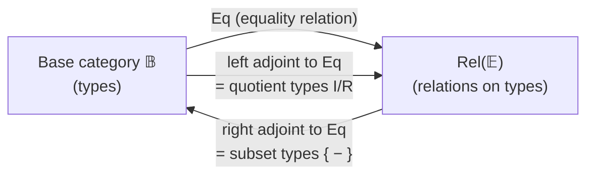
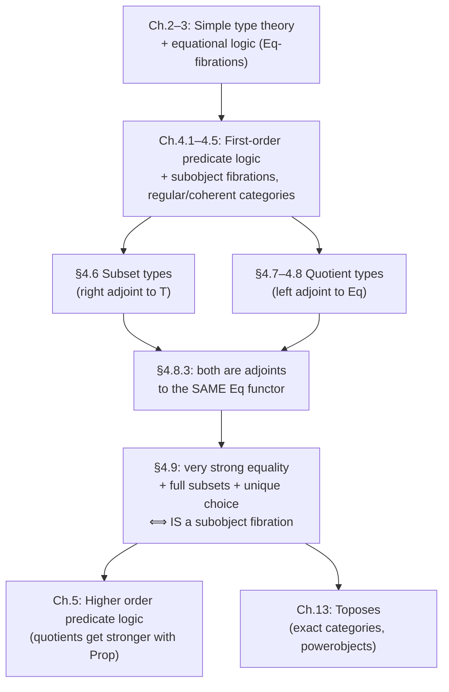

[[book-guidelines|↩ Back to guidelines]]

# Subset Types and Quotient Types

## Why you need to cut a type down, and why you need to glue one together

[[Simple-Type-Theory|Simple type theory]] gives you types and terms, and predicate logic on top of it gives you propositions about those terms — `x : σ ⊢ φ(x) : Prop`. But a proposition and a type are different kinds of thing: a proposition is a *claim*, evaluated at a point, while a type is a *domain you can quantify, substitute, and build functions out of*. The moment you want to actually compute with "the natural numbers less than `n`" or "the integers, built from pairs of naturals" as first-class citizens — pass them to functions, form products of them, iterate over them — a bare proposition won't do. You need the proposition itself to *become* a type.

There are exactly two directions this move can go, and Jacobs treats them as mirror images of each other:

- **Restrict**: given `φ : Prop` depending on `x : σ`, form the type of *those* `x` for which `φ` holds. This is the **subset type** `{x : σ | φ}` — the categorical shadow of "carve out a subtype."
- **Collapse**: given a relation `R` on `σ`, form the type where related elements are *identified*. This is the **quotient type** `σ/R` — the categorical shadow of "glue points together."

Both moves look like simple set-builder notation from the outside — {x | φ} and σ/∼ are notation every mathematician already has muscle memory for. The point of this section of the book is to show that both are instances of a single categorical pattern (adjoints to canonically-defined functors), that the pattern makes their formation/introduction/elimination rules *derivable* rather than ad hoc, and — the payoff — that the two constructions turn out to be *dual* to each other in a precise, provable sense. Once you see that duality, a fibration that has both plus two extra logical properties turns out to be *nothing but* the fibration of subobjects on its base category (Theorem 4.9.4) — a full logical characterization of what "being a category of predicates over sets/objects" really means.

If you are building a refinement-type compiler, subset types are the formal object you are already building intuitions about informally: `{x : σ | φ}` *is* a refinement type, `ι`/`o` *are* the coercions your elaborator inserts at refinement boundaries, and "full subset types" is exactly the property that makes subtyping between refinements decidable by implication-checking rather than needing extra machinery. Quotient types are the harder cousin — they show up the moment your language needs `ℤ` from `ℕ × ℕ`, or wants to reason about ASTs "up to α-equivalence," and Lean's actual kernel primitive for this (`Quot`) is close to a literal transcription of what follows.

---

## Subset types: formation, introduction, elimination

### The rules, read before the notation

The book's motivating idea (§4.6): a proposition `x : σ ⊢ φ : Prop` should give rise to a type `{x : σ | φ}`, meant to denote *the subtype of `σ` consisting of those terms `M : σ` for which `φ[M/x]` holds*. That's the whole idea — everything else is bookkeeping to make it work formally.

The **formation rule**:

$$
\dfrac{x:\sigma \vdash \varphi : \mathrm{Prop}}{\vdash \{x:\sigma \mid \varphi\} : \mathrm{Type}}
$$

The **introduction rule** packages a witness `M : σ` together with a *proof* that `φ` holds of it, into a term of the subset type, via an operator `ι` ("in"):

$$
\dfrac{x:\sigma \vdash \varphi:\mathrm{Prop} \qquad \Gamma \vdash M:\sigma \qquad \Gamma \vdash \varphi[M/x]}{\Gamma \vdash \iota(M) : \{x:\sigma\mid\varphi\}}
$$

The **elimination rule** goes the other way: given a term of the subset type, you can extract the underlying witness via `o` ("out"), and this extraction is compatible with anything you could have proved using the extra hypothesis `φ`:

$$
\dfrac{\Gamma \vdash N : \{x:\sigma\mid\varphi\} \qquad \Gamma,\, x:\sigma \mid \varphi \vdash \psi}{\Gamma \vdash o(N):\sigma \qquad \Gamma,\, y:\{x:\sigma\mid\varphi\} \vdash \psi[o(y)/x]}
$$

with conversions $o(\iota(M)) = M$ and $\iota(o(N)) = N$ — `ι` and `o` are mutually inverse, so `{x : σ | φ}` really is (isomorphic to) a subtype of `σ`, not a separate copy with a coercion. Jacobs is explicit that in practice these `ι`, `o` markers are almost always dropped silently — you write `M : {x : σ | φ}` and reuse `M` at type `σ` without comment, exactly the way you'd expect from working with a refinement type in an ML-family language.

There's a subtlety worth flagging immediately, because it's exactly the thing a refinement-type implementer needs to get right: `o(ι(M)) = M` says extracting-then-injecting is the identity, but the elimination rule as stated only lets you transport a proof `φ ⊢ ψ` into the subtype — it does **not** automatically give you the converse, that `{x : σ | φ} ⊆ {x : σ | ψ}` implies `φ ⊢ ψ` (subtyping reflecting entailment). That converse needs an extra rule.

### Full subset types

The extra rule, called **full subset types**, is the converse of elimination:

$$
\dfrac{\Gamma,\, x:\sigma \mid \varphi \vdash \psi}{\Gamma,\, y : \{x:\sigma\mid\varphi\} \vdash \psi[o(y)/x]} \quad\Longleftrightarrow\quad \text{(full subset types adds the reverse implication)}
$$

Concretely: with fullness, for two predicates $x:\sigma \vdash \varphi,\psi:\mathrm{Prop}$, you can *derive* that $\{x:\sigma\mid\varphi\}$ is included in $\{x:\sigma\mid\psi\}$ **if and only if** $\varphi \vdash \psi$ — i.e. subtype inclusion between refinements is exactly entailment between their predicates, not merely implied by it. Jacobs proves the nontrivial direction using fullness explicitly (a short derivation via $y : \{x{:}\sigma\mid\varphi\} \vdash \iota_\psi(o_\varphi(y)) : \{x{:}\sigma \mid \psi\}$). **This is the property a refinement-type checker actually needs**: without it, your subtyping relation could be strictly weaker than logical entailment, and you'd reject programs that are provably safe. With it, refinement subtyping *reduces to* implication checking — which is exactly why refinement-type systems hand subtyping obligations to an SMT solver: fullness is the theorem that licenses that reduction.

**What breaks without fullness:** without the converse rule, two logically-equivalent predicates $\varphi \dashv\vdash \psi$ need not give rise to *isomorphic* subset types via a canonical map derivable from the rules alone — you'd need to postulate the isomorphism separately for every equivalent pair, which is exactly the kind of bureaucratic overhead an elaborator cannot afford to hand-wave.

### Rust grounding: subset types are refinement/newtype patterns

Subset types are precisely what a `NonZeroU32`, a validated `Email`, or a hand-rolled refinement type checker's core judgment looks like:

```rust
// A subset type {x : u32 | x > 0}, Rust-style: the newtype IS the
// subtype, and the constructor IS the introduction rule ι.
pub struct Positive(u32);

impl Positive {
    // introduction: needs a witness AND a proof obligation (checked here
    // at runtime; a refinement-type checker would discharge this
    // statically via an SMT call instead of a runtime branch)
    pub fn new(x: u32) -> Option<Self> {
        if x > 0 { Some(Positive(x)) } else { None }
    }

    // elimination: o(N) — extracting the underlying witness
    pub fn get(self) -> u32 {
        self.0
    }
}
```

The book's `o(ι(M)) = M` conversion is `Positive::new(x).unwrap().get() == x`; the injectivity/faithfulness of the projection functor (Lemma 4.6.2(i): "each `π_X : {X} → pX` is monic") is exactly the fact that `Positive` doesn't lose information — two different `u32`s can never collapse to the same `Positive`. Full subset types is the property that would let a checker treat `{x : u32 | x > 0}` and `{x : u32 | x >= 1}` as *literally interchangeable* by proving `x > 0 ⊢ x ≥ 1` and back — which is exactly the "refinement subtyping via implication" move a bidirectional refinement checker performs at every function-call boundary.

### Lean grounding: `Subtype` is the literal translation

Lean's `Subtype p` for a predicate `p : α → Prop` is definitionally the book's `{x : σ | φ}`:

```
-- Lean 4
structure Subtype {α : Sort u} (p : α → Prop) where
  val : α
  property : p val

-- ι(M) is ⟨M, proof⟩ ; o(N) is N.val
-- the notation {x // p x} is exactly {x : σ | φ}
example (n : Nat) (h : n > 0) : {x : Nat // x > 0} := ⟨n, h⟩
```

`Subtype.val` is `o`; the anonymous-constructor `⟨M, h⟩` is `ι`; `Subtype.ext` (two subtypes are equal iff their `.val`s are equal) is Lemma 4.6.2(i)'s monicity, made propositional. Because `property` lives in `Prop`, Lean gets full subset types *for free* by proof irrelevance — any two proofs of `φ[M/x]` are judgmentally interchangeable, so the reverse-entailment rule Jacobs has to add as an axiom is, in Lean, a consequence of `Prop`'s own definitional equality. This is a genuinely nice payoff of treating propositions as a separate sort from data, and it is exactly the "isDefEq treats proof-irrelevant terms as equal" behavior your elaborator's kernel will need if it separates `Prop` from `Type`.

### The categorical account: right adjoint to the terminal-object functor

Here is where the book cashes in the informal picture. Work in a preorder fibration $\genfrac{}{}{0pt}{}{\mathbb E}{\mathbb B}\!\!\downarrow p$ (types live in the base $\mathbb B$, propositions in fibres of the total category $\mathbb E$, both with finite products). There is always a **terminal-object functor** $T : \mathbb B \to \mathbb E$ sending a type $I$ to the trivially-true proposition $\top$ over $I$.

> **Definition 4.6.1.** The fibration $p$ **has subsets** (subset types) if $T$ has a right adjoint $\{-\} : \mathbb E \to \mathbb B$.

That's the entire definition — one adjunction. Unwinding it: for $X$ a proposition over $J$, the counit $\varepsilon_X : T\{X\} \to X$ transposes to a map $\pi_X : \{X\} \to pX = J$ in the base, called the **subset projection**. "Having *full* subset types" means the assignment $X \mapsto \pi_X$, viewed as a functor $\mathbb E \to \mathbb B^\to$ into the arrow category, is **full** (and faithful) — a single categorical condition that turns out to be exactly equivalent to the syntactic "full subset types" rule above (this equivalence is one of the concrete payoffs of Lemma 4.6.2).

Lemma 4.6.2 unpacks what the adjunction buys you:
1. every $\pi_X$ is **monic** — subtypes really do embed, they don't just map to their ambient type;
2. a bijective correspondence $T \le u^*(Y) \iff u$ factors through $\pi_Y$ — a map lands inside a subset exactly when the corresponding proposition holds along it, which is the semantic content promised informally at the top of §4.6;
3. $X \mapsto \pi_X$ sends Cartesian morphisms to **pullback squares** — pulling back a subtype along a substitution is again a subtype, computed by pullback, which is precisely why substitution into a refinement type is "just" a pullback of the projection;
4. the projection functor **preserves fibred limits** — subset types are compatible with products of propositions.

**Example 4.6.3(i) is the key structural fact for everything that follows**: *every subobject fibration has full subset types*, with $\{-\} : \mathrm{Sub}(\mathbb B) \to \mathbb B$ simply taking a monic representative $(m : X \rightarrowtail J)$ to its domain $X$. This is the "obvious" case where subsets-as-predicates and subsets-as-subobjects coincide by construction — but not every fibration with subset types is a subobject fibration (Example 4.6.3(ii)–(iv) exhibits non-full cases, e.g. a "metric predicate" fibration where $\{-\}$ picks out only the points where a fuzzy predicate is *exactly* true). This gap — having subsets vs. having *full* subsets vs. *being* a subobject fibration — is precisely what §4.9's characterization theorem closes.

---

## Quotient types: formation, introduction, elimination

### The rules

Dually, §4.7 starts from a relation rather than a predicate. Given $x:\sigma, y:\sigma \vdash R(x,y):\mathrm{Prop}$ (not assumed to be an equivalence relation!), the **formation rule** is:

$$
\dfrac{x:\sigma,\,y:\sigma \vdash R(x,y):\mathrm{Prop}}{\vdash \sigma/R : \mathrm{Type}}
$$

**Introduction** gives every term an equivalence class, and — crucially — makes $R$-related terms produce *propositionally equal* classes:

$$
\dfrac{\Gamma \vdash M:\sigma}{\Gamma \vdash [M]_R : \sigma/R} \qquad\qquad \dfrac{\Gamma \vdash M:\sigma \quad \Gamma \vdash M':\sigma \quad \Gamma \vdash R(M,M')}{\Gamma \vdash [M]_R =_{\sigma/R} [M']_R}
$$

This gives a canonical surjection-like map $[-]_R : \sigma \to \sigma/R$. **Elimination** is where quotient types earn their keep, and it is worth reading slowly, because it's the rule your elaborator will need whenever it lifts a function on representatives to a function on equivalence classes:

$$
\dfrac{\Gamma, x:\sigma \vdash N:\tau \qquad \Gamma, x:\sigma, y:\sigma \mid R(x,y) \vdash N(x) =_\tau N(y)}{\Gamma, a:\sigma/R \vdash \mathsf{pick}\ x\ \mathsf{from}\ a\ \mathsf{in}\ N(x) : \tau}
$$

Read this as: *if `N` is provably constant on `R`-related inputs, then `N` descends to a well-defined function on the quotient.* `pick x from a in N(x)` reaches into an opaque equivalence class `a`, pulls out *some* representative `x`, applies `N`, and the side condition guarantees the answer doesn't depend on which representative you happened to get. This is exactly the discipline every functional programmer already applies informally when they define, say, rational-number addition "on representatives (n₁,d₁), you can check it's independent of the representative chosen" — the elimination rule is what makes that informal check into a formal precondition for [[Full-Higher-Order-Dependent-Type-Theory#The definition|the definition]] to even typecheck.

The conversions:

$$
(\beta):\quad \mathsf{pick}\ x\ \mathsf{from}\ [M]_R\ \mathsf{in}\ N = N[M/x]
$$
$$
(\eta):\quad \mathsf{pick}\ x\ \mathsf{from}\ a\ \mathsf{in}\ N[[x]_R/a] = N[a/a] \quad(\text{i.e. reduces to } N)
$$

$(\beta)$ says computing on a known representative just substitutes, exactly as expected. $(\eta)$ (used mostly right-to-left, as an "expansion," per the book) says a function that already only touches `a` through its class-membership does nothing extra by round-tripping through `pick`.

### Effective (full) quotients

When $R$ actually **is** provably an equivalence relation, there is a natural converse to the introduction rule's equation — the **effective (full) quotients** rule:

$$
\dfrac{\Gamma \vdash M:\sigma \qquad \Gamma \vdash M':\sigma}{\Gamma \mid [M]_R =_{\sigma/R} [M']_R \vdash R(M,M')} \quad (R \text{ an equivalence relation})
$$

i.e.: two elements landing in the same class **must** have been related — the quotient doesn't accidentally identify *more* than $R$ demanded. Jacobs immediately flags the category-theoretic name for this: "effective" is the standard term, and it is the type-theoretic mirror of the classical fact that not every equivalence relation is automatically the kernel pair of its own quotient map (this becomes precise in §4.8's Proposition 4.8.6 below, and is the *entire content* of the notion of an exact category).

**What breaks without effectiveness:** you can form the quotient and reason with `pick`, but you lose the ability to prove two classes are *distinct* from the fact that their witnesses are unrelated — an essential capability if, e.g., you want to prove `[3]_∼ ≠ [4]_∼` when constructing ℤ from ℕ×ℕ (Example 4.7.3 below) by showing `3 ≁ 4`.

### Lemma 4.7.1 — quotients force function extensionality

This is one of the sharper, easy-to-miss results in the section, and it directly matters for anyone building a definitional-equality checker: **the mere presence of quotient types forces propositional equality on function types to become extensional**:

$$
f, g : \sigma \to \tau \ \big|\ \forall x{:}\sigma.\, fx =_\tau gx \ \vdash\ f =_{\sigma\to\tau} g
$$

The proof is a beautiful bit of "quotients constructing their own witnesses": form $\sigma \Rightarrow \tau := (\sigma \to \tau)/{\sim}$ where $f \sim g :\equiv \forall x.\, fx =_\tau gx$, exhibit a term round-tripping $(\sigma \Rightarrow \tau) \cong (\sigma \to \tau)$ using `pick`, and conclude that the quotient map $[-]$ *is* the identity up to isomorphism — which can only happen if pointwise-equal functions were already equal. Jacobs notes the categorical shadow of this fact precisely: quotients satisfying the **Frobenius property** (defined in §4.8, below) is equivalent to the equality functor `Eq` preserving exponents. **This is directly load-bearing for a Lean-style elaborator**: Lean's own function extensionality (`funext`) is *not* definitional (it's an axiom, or derived from `Quot` in certain formulations) — this lemma tells you *why* it can't be free: making it definitional would be tantamount to quietly assuming quotient types with the Frobenius property hold internally at the level of judgmental equality, which changes the decidability profile of the type checker.

### Worked example: ℤ as a quotient of ℕ × ℕ

Jacobs' running example (4.7.3) constructs the integers as the free abelian group on a commutative monoid $(N, 0, +)$ — concretely, the book works with an abstract commutative monoid and shows $\mathbb Z$ satisfies the universal property of "free abelian group on $N$," with ℕ as the intended instance:

$$
u \sim v :\equiv \pi u + \pi' v = \pi' u + \pi v \qquad (u, v : N \times N)
$$

$$
\mathbb Z := (N \times N)/{\sim}, \qquad [x,y] := [(x,y)]_\sim
$$

with the group operations defined *entirely via* `pick`:

$$
0_{\mathbb Z} := [0,0] \qquad -a := \mathsf{pick}\ w\ \mathsf{from}\ a\ \mathsf{in}\ [\pi'w, \pi w] \qquad a+b := \mathsf{pick}\ u,v\ \mathsf{from}\ a,b\ \mathsf{in}\ [\pi u + \pi v,\ \pi'u + \pi'v]
$$

Well-definedness of `+` — the side condition the elimination rule demands — is discharged by checking $u_1 \sim u_2 \Rightarrow (\pi u_1 + \pi v, \pi' u_1 + \pi' v) \sim (\pi u_2 + \pi v, \pi' u_2 + \pi' v)$, a routine monoid computation. The universal property (freeness) is then proved by constructing, for any abelian group $G$ and monoid homomorphism $M : N \to G$, a unique extension $\overline M : \mathbb Z \to G$ via $\overline M(a) = \mathsf{pick}\ u\ \mathsf{from}\ a\ \mathsf{in}\ M(\pi'u) \cdot M(\pi u)^{-1}$ — the entire proof is `pick`-chasing plus the equational theory of $G$.

### Rust grounding: quotients as "smart constructors + canonical representatives"

Rust has no built-in quotient type, but the discipline is enforceable by hiding the constructor and normalizing on construction — exactly `[-]_R` implemented eagerly:

```rust
// σ/R where R is "same reduced fraction" — a quotient type enforced by
// API design: the only way to get a Rational is through new(), which
// always returns a canonical (lowest-terms) representative.
#[derive(PartialEq, Eq)]  // structural equality on canonical reps
                          // stands in for =_{σ/R}
pub struct Rational { num: i64, den: i64 }

impl Rational {
    pub fn new(num: i64, den: i64) -> Self {           // [-]_R
        let g = gcd(num, den);
        Rational { num: num / g, den: den / g }
    }
}
// "pick x from a in N(x)": any function taking &Rational and reading
// .num / .den is automatically well-defined on classes, because two
// Rationals compare equal (PartialEq) iff their canonical fields match.
```

This pattern — force representatives into canonical form at construction time — is the *computational* way to realize a quotient without a genuine `pick` eliminator; it works whenever a canonical-representative function is computable, which (per Proposition 4.8.6 below) is closely related to when quotients are *effective*.

### Lean grounding: `Quot` is the literal quotient-type primitive

This is where Lean gets genuinely load-bearing, because `Quot` is a **primitive of Lean's kernel**, not a derived construction — it is, almost verbatim, Jacobs' formation/introduction/elimination rules:

```
-- Lean 4 kernel primitives
Quot        : {α : Sort u} → (α → α → Prop) → Sort u        -- σ/R
Quot.mk     : (r : α → α → Prop) → α → Quot r                -- [-]_R
Quot.lift   : {r : α → α → Prop} → (f : α → β) →
              (∀ a b, r a b → f a = f b) → Quot r → β         -- pick ... in ...
Quot.sound  : r a b → Quot.mk r a = Quot.mk r b               -- the introduction
                                                               -- equality rule
Quot.ind    : ∀ {r} {motive : Quot r → Prop},
              (∀ a, motive (Quot.mk r a)) → ∀ q, motive q     -- surjectivity of [-]_R
```

`Quot.lift f h` **is** `pick x from · in f x` with `h` **being** exactly the side condition $R(x,y) \vdash N(x) =_\tau N(y)$; the computation rule `Quot.lift f h (Quot.mk r a) = f a` is *definitional* in Lean — i.e. Lean gives you `(β)`-conversion as a kernel reduction rule, not merely a propositional equality, which is strictly stronger than what Jacobs' syntax demands (there, `(β)` is a term conversion at the level of the type theory being specified, which Lean's implementation choice happens to make judgmental). `Quot.sound` is the introduction rule's equation $R(M,M') \vdash [M]_R =_{\sigma/R} [M']_R$, taken as a primitive axiom of the kernel rather than derived — Lean does not require `R` to be an equivalence relation for `Quot`, matching Jacobs' unrestricted formation rule exactly; `Quotient` (capital-Q, in `Mathlib`/core) is the specialization to genuine `Setoid`s (equivalence relations) with **effectiveness** (`Quotient.exact`, recovering `R(M,M')` from `[M]_R = [M']_R`) added as an extra theorem — precisely the book's effective/full quotients rule. If your elaborator's kernel needs a quotient primitive, `Quot`'s four operations are the minimal, battle-tested interface to copy.

---

## The categorical account: quotients as a left adjoint to equality — and the duality with subset types

### Setting up: the relation fibration and the equality functor

To dualize the subset-type story, Jacobs needs a categorical stand-in for "a relation on `I`" — this is $\mathrm{Rel}(\mathbb E)$, obtained by *change of base* along the diagonal-pairing functor $\mathbb B \to \mathbb B \times \mathbb B$, $I \mapsto I \times I$:

$$
\mathrm{Rel}(\mathbb E) \longrightarrow \mathbb E, \qquad \text{fibre } \mathrm{Rel}(\mathbb E)_I \;=\; \mathbb E_{I\times I}
$$

There's a canonical **equality relation functor** $\mathrm{Eq} : \mathbb B \to \mathrm{Rel}(\mathbb E)$, sending $I$ to the "diagonal predicate" $\mathrm{Eq}(I) := \mathrm{Eq}_I(\top)$ (using the fibred-equality structure from §3.5's Eq-fibrations), and for a map $u$, the **kernel relation** $\mathrm{Ker}(u) := (u \times u)^*(\mathrm{Eq}(J))$ — "$u(i) = u(i')$," read off as a predicate on $I \times I$.

> **Definition 4.8.1.** $p$ **has quotients** if $\mathrm{Eq} : \mathbb B \to \mathrm{Rel}(\mathbb E)$ has a **left** adjoint.

Compare this side-by-side with subset types being a **right** adjoint to $T$. That asymmetry — right adjoint to truth vs. left adjoint to equality — is the raw material of the duality theorem below.

Unwinding the adjunction: the left adjoint sends a relation $R \in \mathbb E_{I\times I}$ to a quotient object $I/R \in \mathbb B$, with unit $\eta_R : R \to \mathrm{Eq}(I/R)$ whose underlying base map $c_R : I \to I/R$ is the canonical quotient projection. Lemma 4.8.2 is the mirror image of Lemma 4.6.2: every $c_R$ is **epi** (dually to subset projections being **mono**), a bijective correspondence $R \le \mathrm{Ker}(u) \iff c_R$ factors through $u$, and $R \mapsto c_R$ sends *opcartesian* morphisms in $\mathrm{Rel}(\mathbb E)$ to **pushout** squares (dually to Cartesian morphisms going to pullbacks for subsets).

### Theorem 4.8.3 — the duality, made precise

Here is the payoff the whole section has been building to:

> **Theorem 4.8.3.** For an Eq-fibration $p$, the equality functor $\mathrm{Eq} : \mathbb B \to \mathrm{Rel}(\mathbb E)$ has a **right** adjoint **if and only if** $p$ has (full) subset types.

Read that carefully: subset types were *defined* (Definition 4.6.1) as a right adjoint to the *truth* functor $T$. This theorem says they are **equally well described** as a right adjoint to the *equality* functor $\mathrm{Eq}$ — the very functor whose *left* adjoint gives you quotient types. Subset types and quotient types are literally two different adjoints (right vs. left) to the *same* functor `Eq`. This is not an analogy or a loose "these feel dual" — it's one functor, two adjoint sides, proved by direct calculation with the Yoneda-style hom-set chase Jacobs runs in the proof (using the change-of-base formula from Lemma 1.4.10 twice, once in each direction).



Everything downstream of this — the "full" conditions, effectiveness, the final characterization theorem — is really an exploration of the two-sided adjoint situation $\{-\} \dashv \mathrm{Eq} \dashv$-nothing-required-but-if-present-called-quotient-left-adjoint around a single functor. It's worth sitting with why this is surprising: "restrict to where a predicate holds" and "collapse along a relation" feel like operations on different kinds of input (a unary predicate vs. a binary relation) — the theorem says that once you route both through the equality functor on relations, they become literally the same categorical shape, differing only in which side of the adjunction you're looking at.

### Effectiveness, categorically, and the Frobenius property

Definition 4.8.4 gives the categorical counterparts of the two syntactic side-conditions flagged above:

- **Frobenius property** for quotients: for $R$ a relation on $I$ and $J \in \mathbb B$, forming $\tau(R) := (\pi\times\pi)^*\mathrm{Eq}(J) \wedge (\pi'\times\pi')^*(R)$ on $J \times I$, the canonical map $(J\times I)/\tau(R) \to J \times (I/R)$ is an **isomorphism**. (This is what licenses the elimination rule with *contexts*, i.e. `pick` under a `Γ` binding other variables — precisely the generality your elaborator needs when it eliminates a quotient nested inside a larger typing context.)
- **Effective (full) quotients**: for $R$ an equivalence relation, the unit map $\eta_R : R \to \mathrm{Eq}(I/R)$ is **Cartesian** over $c_R$ in the fibration of relations.

Proposition 4.8.5 gives the clean structural characterization: quotients are effective **iff** the "canonical quotient map" functor $C : \mathrm{ERel}(\mathbb E) \to \mathbb B^\to$ (restricted to *equivalence* relations) is **full** (and faithful) — the exact analogue of "full subset types = the subset-projection functor is full," now on the quotient side.

### Effective quotients and exact categories

Proposition 4.8.6 is where the abstract adjunction touches down on ordinary category theory, and it's the result that gives "exact category" its name:

> For $\mathbb B$ with finite limits: (i) if $\mathbb B$ has **coequalisers**, the subobject fibration $\mathrm{Sub}(\mathbb B) \to \mathbb B$ has quotients, and these are effective **iff** every equivalence relation $R \rightarrowtail I \times I$ is a **kernel pair** of some map $I \to J$. (ii) Conversely, if $\mathbb B$ is **regular**, having coequalisers is *equivalent* to the subobject fibration having quotients. (iii) The Frobenius property for these quotients holds iff coequalisers are preserved by $J \times (-)$.

> **A regular category with coequalisers, satisfying (i)'s effectiveness condition, is called an exact category.**

This is worth dwelling on because "exact category" is a term that recurs throughout categorical logic (and shows up again when the book discusses [[Toposes|toposes]]): it names *exactly* the situation where "quotient by an equivalence relation" behaves the way it does in `Sets` — every equivalence relation arises as the kernel pair of *some* map, and conversely every kernel pair is (the equivalence-relation closure of) a coequalized pair. In `Sets` this is automatic (every equivalence relation is trivially the kernel of its own quotient map); the content of "exact" is that this is a *nontrivial, checkable condition* in categories that aren't `Sets` — e.g. **PER** (partial equivalence relations, a realizability model the book returns to repeatedly) is exact, but plenty of naturally-occurring regular categories are not. **This is directly relevant to a Rust-based verifier's data model**: if your Rust IR represents quotient constructions (e.g. de Bruijn indices collapsing α-equivalent terms, or SSA collapsing equivalent value-numbers), exactness is the property that tells you when "build the quotient" and "recognize when two things are provably equal in the quotient" are genuinely the same computation — non-exact settings force you to maintain the equivalence relation and the quotient map as separate data, unable to recover one from the other.

---

## Unique choice and the logical characterization of subobject fibrations

### Single-valuedness and unique choice, defined via subset types

The final section (§4.9) closes the loop by asking: **when is a fibration of predicates *nothing more or less than* the fibration of subobjects on its base category?** This is the question "does my logic have exactly the expressive power of ordinary subset-based mathematics, no more, no less" — genuinely important if you're designing a logic for a verifier and want to know it isn't secretly weaker (or stranger) than naive set theory.

A relation $R \in \mathbb E_{I \times J}$ is **single-valued** if

$$
i:I,\, j,j':J \mid R(i,j) \wedge R(i,j') \ \vdash\ j =_J j'
$$

— "at most one $j$ per $i$." **Unique choice** ($\exists!$) then says: for every single-valued $R$, the coproduct $\coprod_{(I,J)}(R)$ (the "there exists $j$" predicate along the projection) exists, and the evident comparison map $\{R\} \to \{\coprod_{(I,J)}(R)\}$ is an **isomorphism**. Read informally: *if for every $i$ there is at most one related $j$, then "there exists such a $j$" and "here is that specific $j$, packaged up" carry the exact same information* — you can convert a unique-existence proof into an actual choice function, internally, without any extra axiom. Proposition 4.9.2 confirms the sanity check: **every subobject fibration has unique choice** — proved by a direct pullback argument showing the relevant projection is monic (hence, being also epi from single-valuedness, an isomorphism onto the domain of the choice function).

This is the internal, choice-free analogue of the axiom of unique choice from set theory, and — importantly for anyone thinking about proof assistants — it is **not** the general axiom of choice; it makes no existential leap, because uniqueness pins down the witness completely. This is precisely why "unique choice" is unproblematic constructively while general choice is controversial: there's nothing to *choose* when there's only one option.

### Very strong equality, characterized via subset types

Proposition 4.9.3 gives a strikingly clean reformulation of **[[Equational-Logic#Very strong equality|very strong equality]]** (external equality of two maps coinciding with internal, propositional equality — recall Notation 3.4.2 from the equational-logic chapter) purely in terms of the subset-type projection of the equality predicate:

> Equality is very strong **iff** the canonical map $\kappa : I \to \{\mathrm{Eq}(I)\}$ is an isomorphism.

In words: *equality is very strong exactly when the diagonal $\delta_I : I \to I \times I$ IS (up to iso) the subset projection carved out by the equality predicate* — "the type of pairs provably equal to each other" is literally isomorphic to the diagonal copy of $I$, nothing more, nothing less.

### Theorem 4.9.4 — the main characterization

Everything converges here:

> **Theorem 4.9.4.** An Eq-fibration $p$ is (equivalent to) **the subobject fibration on its base category $\mathbb B$** if and only if:
> - equality in $p$ is **very strong**;
> - $p$ has **full** subset types;
> - $p$ has **unique choice**.

Every subobject fibration trivially has all three (very strong equality because $\mathrm{Eq}(I)$ *is* the diagonal; full subset types by Example 4.6.3(i); unique choice by Proposition 4.9.2) — the substance is the converse. The proof constructs an explicit equivalence: full subset types give a full-and-faithful fibred functor $\pi_{(-)} : \mathbb E \to \mathrm{Sub}(\mathbb B)$; the *inverse* direction takes a mono $m : J \rightarrowtail I$, forms its **graph relation** $G_m := \mathrm{Eq}(\pi, m\circ\pi')$, checks it's single-valued (using very-strong equality plus $m$ being mono), and applies **unique choice** to package it back into a predicate whose subset projection recovers $m$ exactly. Every ingredient earns its place: very strong equality makes the graph well-behaved, fullness makes $\pi_{(-)}$ an equivalence rather than merely full, and unique choice is precisely what turns "graph of a mono" back into "a predicate" without extra data. Theorem 4.9.5 immediately specializes this to characterize **regular** subobject fibrations by weakening "unique choice" to "every predicate is literally an equation $\mathrm{Eq}(u,v)$" — the fibred logic where every proposition is, definitionally, an equality test.

**Why this matters for a logic-clause verifier:** this theorem is a completeness result for a *design choice*. If you are specifying a program logic and you can check that your model of propositions satisfies these three properties, you get, for free, that your logic is *exactly as expressive as* reasoning about subobjects (subsets) in the underlying category of program states — no hidden extra expressive power, and no missing expressive power either. It's the categorical version of a soundness-and-completeness theorem for "predicates = subsets," stated once, abstractly, so it applies uniformly across `Sets`-models, realizability models, [[First-Order-Predicate-Logic#Kripke models|Kripke models]], and anything else satisfying an Eq-fibration's axioms.

---

## Synthesis: where this sits in the book's structure



This section is the hinge of Chapter 4. Sections 4.1–4.5 built up progressively stronger fibrations (regular, coherent, first-order) purely to get connectives and quantifiers as fibred structure; 4.6–4.9 then asks the reverse question — given such a fibration, when does it *coincide* with the most familiar model of all, subsets of a base category? Subset and quotient types are the tools that make that question answerable, and the fact that they turn out to be two faces of one adjunction (Theorem 4.8.3) is what makes Theorem 4.9.4's characterization theorem *clean* rather than a laundry list of unrelated conditions.

Two threads carry forward explicitly: exactness (Proposition 4.8.6) recurs when the book studies [[The-Effective-Topos|the effective topos]] (Chapter 6) and toposes in general (Chapter 13), where "exact" becomes one of the standing background assumptions; and quotient types "get more powerful" once Chapter 5 adds a genuine type of propositions `Prop`, letting quotients be constructed by arbitrary relations rather than needing them handed to you syntactically (Lemma 5.1.8, flagged explicitly in §4.7 as future work).

## Where this leads

For the elaborator/refinement-type project specifically: subset types here *are* refinement types, and full subset types is the theorem that licenses treating refinement-subtyping as pure implication-checking (i.e., handing it to an SMT solver) rather than needing bespoke subtype-inference machinery. Quotient types, via Lean's `Quot`/`Quotient` primitives, are the mechanism you'll want for any construction that needs "equal up to a relation I can state but don't want to carry around explicitly" (α-equivalence, value numbering, canonical forms) — and Lemma 4.7.1's forced function extensionality is a direct warning about what a `Quot`-like primitive does to your kernel's definitional-equality decision procedure if you add it unrestricted. Theorem 4.9.4's full characterization of subobject fibrations is the abstract result that should eventually justify, once and for all, that your logic's model of "predicates on program states" has exactly the semantic content of subsets of program states — nothing hidden, nothing missing — the kind of soundness statement you want to be able to cite once rather than re-derive per-model.
