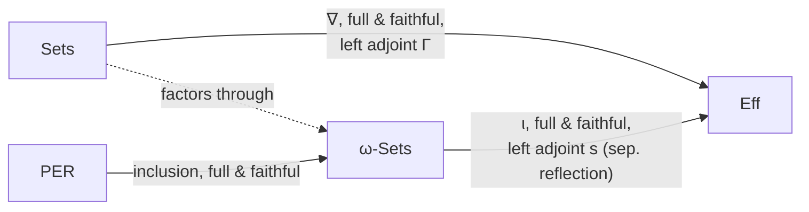
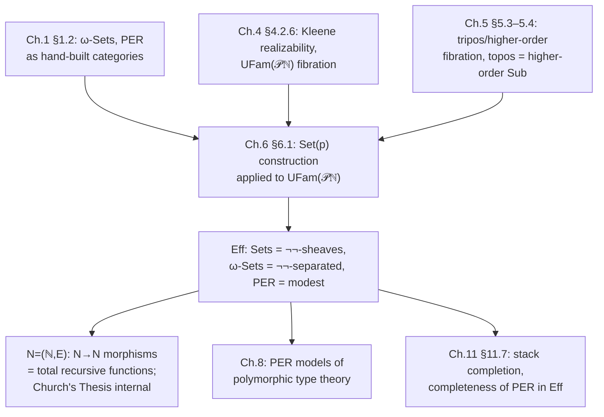

[[book-guidelines|↩ Back to guidelines]]

## Why you'd want one topos that contains everything

Suppose you've built three separate categorical universes for doing mathematics: ordinary $\mathbf{Sets}$, $\omega$-$\mathbf{Sets}$ (sets equipped with existence-witness codes), and $\mathbf{PER}$ (codes quotiented by a tracked equivalence relation). Each is useful for a different purpose — $\mathbf{Sets}$ for classical mathematics, $\omega$-$\mathbf{Sets}$ and $\mathbf{PER}$ for interpreting computation and polymorphism. But they're three *different* categories, related only by adjunctions bolted on from outside. If you wanted to build, say, a model of a dependent type theory where propositions can quantify over *types*, and types can themselves be either "ordinary" sets or PER-style computational types, you'd want all three universes living inside a single ambient category with its own internal logic — so that "type," "proposition," and "proof" all make sense uniformly, regardless of which universe a particular type happens to live in.

That ambient category is Hyland's **effective topos** $\mathrm{Eff}$. It is a single topos — meaning it has all finite limits, exponentials, and a subobject classifier, hence its own internal higher-order logic — in which $\mathbf{Sets}$, $\omega$-$\mathbf{Sets}$, and $\mathbf{PER}$ all appear as *full subcategories*, picked out not by some ad hoc restriction but by a single uniform topological operation ([[Nuclei-Separated-Objects-and-Sheaves#The double-negation nucleus|the double-negation nucleus]], more on this below). Jacobs' summary line is worth holding onto as the thesis of the whole chapter: $\mathrm{Eff}$ is a topos "in which the ordinary set theoretic world is combined with the recursion theoretic world." Concretely: there's a full and faithful embedding $\mathbf{Sets} \hookrightarrow \mathrm{Eff}$, and — this is the headline result of §6.4 — the internal endomorphisms $N \to N$ of the natural numbers object inside $\mathrm{Eff}$ are *exactly* the total recursive functions $\mathbb{N} \to \mathbb{N}$. Nothing else. Not "recursive functions plus some junk," not "a superset of recursive functions" — a topos-theoretic construction, built from pure logic, that lands *precisely* on Church–Turing computability. That coincidence is not an accident; it's the entire point of realizability semantics, and it's why this chapter matters for anyone thinking about what a "proof" or a "program" really has to be to count as evidence.

If you've read the companion note on [[Realizability-Models-Omega-Sets-and-PERs|ω-Sets and PERs]], you already have the raw materials: a partial combinatory algebra ($\mathbb{N}$ with Kleene application $e \cdot n$), the realizability fibration $\mathrm{UFam}(\mathcal{P}\mathbb{N})$ built from it, and [[Realizability-Models-Omega-Sets-and-PERs#The idea|the idea]] of "$n$ realises $\varphi$." This chapter's job is to show that feeding that fibration into a general tripos-to-topos construction — called $\mathrm{Set}(p)$ — actually produces a topos, and then to map out its internal geography.

## The $\mathrm{Set}(p)$ construction: turning logic into a category

### The motivating gap

A higher-order fibration $p$ (roughly: a system of typed predicate logic with quantifiers, connectives, and a type of propositions) gives you a *logic*. It doesn't automatically give you a *category of sets* to reason about within that logic — you have propositions, entailments, and predicates on a base category $\mathbb{B}$, but no notion yet of "an object built by taking a base type and imposing an internal equality on it, where equality itself is a matter of logical validity rather than literal identity." Jacobs' Set($p$) construction is exactly this missing piece: it manufactures a topos *purely syntactically*, out of the internal language of $p$, using only the connectives $\exists, \wedge, \top$ — the same fragment a regular fibration already has.

### The construction (Definition 6.1.1)

An object of $\mathrm{Set}(p)$ is a pair $(I, \approx_I)$: a base object $I \in \mathbb{B}$ together with an **abstract equality predicate** $\approx_I \in \mathbb{E}_{I \times I}$ that is required (as a matter of validity in $p$) to be symmetric and transitive —

$$i_1, i_2 : I \mid i_1 \approx_I i_2 \vdash i_2 \approx_I i_1 \qquad\qquad i_1,i_2,i_3:I \mid i_1\approx_I i_2,\, i_2 \approx_I i_3 \vdash i_1 \approx_I i_3$$

— but crucially *not required to be reflexive*. This is the single most important design choice in the whole chapter, and it's worth pausing on why. Reflexivity would force $\approx_I i \approx_I i$ to be logically valid for *every* $i \in I$, i.e. every element of the base type would have to "exist" as a citizen of $(I,\approx_I)$. Dropping it lets you carve out, from one ambient base type, a partial sub-universe of "the elements that actually exist" — exactly the partiality that a Turing machine's domain of definition needs. Jacobs makes this a first-class notion: $E_I(i) := |i \approx_I i|$ is the **existence predicate**, definable purely from $\approx_I$ itself (as the diagonal pullback of $\approx_I$).

Morphisms $(I,\approx_I) \to (J,\approx_J)$ are equivalence classes of relations $F \in \mathbb{E}_{I\times J}$ satisfying four internal-logic conditions — this is the precise generalization of "a function is a relation that is total and functional," except now "total" and "functional" only need to hold *relative to* the existence predicates:

- **extensional**: $F$ respects $\approx_I$ and $\approx_J$ on both sides,
- **strict**: $F(i,j) \vdash E_I(i) \wedge E_J(j)$ — a relation can only relate things that exist,
- **single-valued**: $F(i,j_1) \wedge F(i,j_2) \vdash j_1 \approx_J j_2$,
- **total**: $E_I(i) \vdash \exists j{:}J.\, F(i,j)$ — every existing element of $I$ maps *somewhere*.

[[Fibred-Category-Theory#Composition|Composition]] is relational composition ($\exists j.\, F(i,j) \wedge G(j,k)$), and the identity morphism on $(I,\approx_I)$ is $\approx_I$ itself — which only typechecks as "reflexive-looking" *relative to the elements that exist*, exactly as intended.

**What this construction buys you (Prop. 6.1.3, Cor. 6.1.7):** if $p$ is a *higher order* fibration (has a generic object / a type of propositions), then $\mathrm{Set}(p)$ is a full topos — finite limits, Cartesian closure, and a subobject classifier. The proof is a fully explicit, entirely logical construction of products, equalizers, and exponentials as displayed predicates (e.g. the exponent's underlying object is $\Omega^{I\times J}$ restricted by an internally-stated "is extensional/strict/single-valued/total" predicate $E(f)$ — literally reusing the four morphism conditions above, but now as *data inside* the exponent object rather than as a side condition on an external map). The subobject classifier of $\mathrm{Set}(p)$ turns out to be $\Omega$ itself, carried by $p$'s own generic object, with **strict predicates** (Def. 6.1.5: predicates $A$ satisfying $A(i_1), i_1\approx_I i_2 \vdash A(i_2)$ and $A(i) \vdash E_I(i)$) playing the role of subobjects — this is the technical bridge (Prop. 6.1.6) that lets you reason about subobjects of $\mathrm{Set}(p)$ entirely inside $p$'s logic, without leaving the syntax.

### Two instances — and why the second one is the interesting one

Feed two different fibrations into $\mathrm{Set}(-)$ and you get two very different [[Toposes|toposes]] (Example 6.1.2):

1. **$\Omega$-set**, from the family fibration over a complete Heyting algebra $\Omega$ (Fourman & Scott). This recovers ordinary sheaf semantics — the *validity* of a predicate is a value in $\Omega$, a genuine truth-degree.
2. **The effective topos $\mathrm{Eff}$**, from the realizability fibration $\mathrm{UFam}(\mathcal{P}\mathbb{N})$. Here objects are pairs $(I, \approx_I)$ where $\approx_I : I \times I \to \mathcal{P}\mathbb{N}$ assigns to each pair of elements not a truth value but a *set of realizing codes* — "validity" of $\approx_I$ means the intersection over all instances is non-empty, i.e. there's a *single uniform program* that proves symmetry, and another that proves transitivity. A morphism is now a relation $F : I\times J \to \mathcal{P}\mathbb{N}$ together with four explicit realizers $n_1, n_2, n_3, n_4 \in \mathbb{N}$, one per condition (extensionality, strictness, single-valuedness, totality) — Jacobs writes these out completely (p. 376–377), and it's worth seeing at least one to feel the texture:

$$n_4 \in \bigcap_{i \in I} \Big( E(i) \supset \bigcup_{j \in J} F(i,j) \Big)$$

says literally: feed $n_4$ any code $m$ witnessing that $i$ exists, and $n_4 \cdot m$ computes a witness that $F(i,j)$ holds for *some* $j$. Totality isn't a set-theoretic fact you assert — it's a program you exhibit.

This is the crucial shift from the previous topic's realizability *fibration* to a realizability *topos*: you no longer just have a logic of predicates over $\mathbf{Sets}$; you have an entire category of "sets with computational equality" that is itself Cartesian closed with its own subobject classifier — a self-contained mathematical universe.

### Grounding: Set($p$) as a generic "quotient-by-witness" construction

The closest Rust shape is a witnessed equivalence relation used as an object's *own* identity criterion, paired with morphisms that must carry realizer data for each of the four laws rather than being asserted:

```rust
// An object of Set(p): a base carrier plus a witnessed (non-reflexive!)
// equivalence relation. `Witness` stands in for a realizer/proof term
// depending on the fibration p (a term in the internal logic, or — in the
// Eff instance — a Gödel-coded partial recursive function).
struct SetPObject<I, Witness> {
    carrier: std::marker::PhantomData<I>,
    // approx(i1, i2) returns Some(witness) iff i1 ≈ i2 is *derivable*,
    // and existence E(i) = approx(i, i).is_some() — existence is derived,
    // not separately declared.
    approx: fn(&I, &I) -> Option<Witness>,
}

// A morphism carries four separate realizers, matching the four clauses.
struct TrackedRelation<I, J, W> {
    relates: fn(&I, &J) -> bool,
    extensional_witness: W,
    strict_witness: W,
    single_valued_witness: W,
    total_witness: W,
}
```

The load-bearing discipline is exactly what makes this differ from an ordinary `PartialEq` impl: reflexivity is *not* assumed anywhere in the type, and `approx(i, i)` can legitimately return `None` — that's what lets $(I,\approx_I)$ model partial/undefined elements. This is a genuinely unusual design point relative to how most type systems build equality (Lean's `Eq` and Rust's `PartialEq::eq` both presume the compared values already "exist" as terms); here, existence itself is a *derived, checkable* fact rather than a precondition.

In Lean, the relevant contrast is illuminating: Lean's `Setoid` bundles a genuinely reflexive equivalence relation, because Lean terms are always total (every well-typed term denotes). The abstract equality $\approx_I$ here is closer to what you'd need to model a **partial setoid** — precisely the PER pattern from the previous chapter, now generalized so that the "codes" are replaced by an arbitrary internal-logic witness. If your own elaborator's design ever needs a notion of "these two (possibly divergent, possibly not-yet-fully-elaborated) terms are equal *when both are defined*," a partial setoid built this way — rather than Lean's always-reflexive one — is the right formal object to reach for.

## Inside $\mathrm{Eff}$: global sections, and the two inclusions

### The global sections functor $\Gamma$

Before relating $\mathrm{Eff}$ back to $\mathbf{Sets}$, you need a way to *extract* an ordinary set from an $\mathrm{Eff}$-object. A **global element** of $(I,\approx_I)$ is a morphism $1 \to (I,\approx_I)$ — in $\mathbf{Sets}$ this is just "an element of $I$," but here (Lemma 6.2.1) it turns out to correspond to an equivalence class $[i_0]$ of elements $i_0$ with $E(i_0)\neq\emptyset$, under $i \sim i' \iff |i\approx_I i'| \neq \emptyset$:

$$\Gamma(I,\approx_I) := \{\, i \in I \mid E(i) \neq \emptyset \,\} \big/ {\sim}.$$

This defines a functor $\Gamma : \mathrm{Eff} \to \mathbf{Sets}$, the **global sections functor** — think of it as "run the object and see what set of actual, non-degenerate values comes out."

### The two inclusions $\nabla$ and $\iota$

**Proposition 6.2.2.** There is a functor $\nabla : \mathbf{Sets} \to \mathrm{Eff}$ sending a set $J$ to $(J, {=})$ with $|j \approx_J j'| = \mathbb{N}$ if $j=j'$ and $\emptyset$ otherwise (every element exists via *every* code — there's no computational content restricting which elements are "real," they just all are). This $\nabla$ is full and faithful, and — this is the topos-theoretic content — has $\Gamma$ as its **left adjoint**: $\Gamma \dashv \nabla$. A full-and-faithful right adjoint to a finite-limit-preserving functor is exactly the technical definition of a **geometric morphism** that is an **inclusion of toposes** — this is the precise sense in which $\mathbf{Sets}$ "sits inside" $\mathrm{Eff}$ without any information loss on the $\mathbf{Sets}$ side.

**Proposition 6.2.3.** The same pattern repeats one level down: there's a full and faithful $\iota : \omega\text{-}\mathbf{Sets} \to \mathrm{Eff}$ sending $(J,E)$ to $(J, \approx_J)$ with $|j \approx_J j| = E(j)$ when $j=j'$, else $\emptyset$ — i.e. an $\omega$-set's own existence codes become the realizability equality codes directly. Its left adjoint is called $s$ (for **separated reflection** — the name is deliberately anticipatory of §6.3), sending $(I,\approx_I)$ to $\Gamma(I,\approx_I)$ equipped with existence predicate $E([i]) = \bigcup_{i' \in [i]} E(i')$.

$\nabla$ factors through $\iota$ (via $\mathbf{Sets} \to \omega\text{-}\mathbf{Sets}$, $X \mapsto (X, E(x)=\mathbb{N})$), so you get the full picture as one commuting diagram — this is the internal-to-$\mathrm{Eff}$ mirror of the reflective-subcategory diagram from the [[Realizability-Models-Omega-Sets-and-PERs|previous topic]], now realized as actual subcategories of one topos rather than three separate categories glued by adjunctions:



### What breaks without a uniform criterion for "which objects count as which"

If you only had these two adjunctions, you'd know that $\mathbf{Sets}$ and $\omega$-$\mathbf{Sets}$ *embed* into $\mathrm{Eff}$, but you'd have no *intrinsic* characterization of their images — no way to look at an arbitrary $\mathrm{Eff}$-object and decide, from its own internal structure, "is this (isomorphic to) a plain set, an $\omega$-set, or a genuinely new kind of object with no analogue in either?" That's the gap Definition 6.2.4 closes.

## Three flavors of object, one topology

Definition 6.2.4 gives three purely internal conditions on an object $(I,\approx_I) \in \mathrm{Eff}$:

- **Canonically separated**: $|i \approx_I i'| \neq \emptyset \Rightarrow i = i'$ *and* $E_I(i) \neq \emptyset$ for all $i,i'$. Equivalently, $\approx_I$ is completely determined by the existence map $E_I : I \to \mathcal{P}\mathbb{N}$ alone — two elements are related exactly when they're literally the *same* underlying element and both exist. There is no room for two genuinely distinct-looking presentations of "the same abstract value" to be identified; identification only ever happens at the level of realizers of a single fixed $i$.
- **Canonically a sheaf**: canonically separated, *plus* $\bigcap_{i \in I} E(i) \neq \emptyset$ — a single uniform code realizes existence for *every* element of $I$ simultaneously. This extra uniformity is exactly what collapses the "witness-carrying" structure down to nothing observable: since one code works everywhere, the specific choice of witness carries no information distinguishing elements, and the object behaves exactly like a plain set.
- **Modest** (a.k.a. effective object): canonically separated, plus $E_I(i) \cap E_I(i') \neq \emptyset \Rightarrow i = i'$ — realizer sets for *distinct* elements are forced disjoint. This is precisely the "at most one thing per code" condition that defines a PER externally.

**Proposition 6.2.5** cashes these three conditions out exactly as expected: $\omega$-$\mathbf{Sets}$ $\simeq$ canonically separated objects, $\mathbf{Sets}$ $\simeq$ canonical sheaves, $\mathbf{PER}$ $\simeq$ modest sets. So the whole three-tier hierarchy from the previous chapter now has an *intrinsic, purely logical* description living inside one ambient topos — you can literally point at an object of $\mathrm{Eff}$ and, by checking these three predicates on its existence and equality data, read off which of the three worlds it belongs to.

### The double-negation nucleus, and why it's exactly the right topology

Here's the punch line that makes "canonically separated/sheaf" more than a naming convenience: these conditions turn out to coincide with the **general topos-theoretic** notions of separated object and sheaf, *for one specific topology* — the double-negation nucleus $\neg\neg$ on $\mathrm{Eff}$'s subobject lattice $\mathcal{P}\mathbb{N}$.

Computing $\neg\neg$ on a realizability truth-value $\alpha \subseteq \mathbb{N}$ (p. 389) gives:

$$\neg\neg\alpha = \begin{cases} \mathbb{N} & \text{if } \alpha \neq \emptyset \\ \emptyset & \text{otherwise} \end{cases}$$

In words: double negation *erases all the realizer content* and remembers only whether the set of witnesses was non-empty. This is the exact operation that "forgets computational information and keeps only classical truth" — which is precisely what you need to recover $\mathbf{Sets}$ (where truth values genuinely are just $\{\emptyset, \{*\}\}$-like, no internal structure) as sheaves for that topology. A strict predicate $A$ is **closed** for $\neg\neg$ exactly when $A(i) \neq \emptyset \Rightarrow \bigcap E_I(i) \ne \emptyset$-style uniformity holds (roughly: $A$ can already be tested by "is it non-empty," nothing more refined is observable), and **dense** when $E(i) \neq \emptyset \Rightarrow A(i) \neq \emptyset$ — existing elements are never excluded by $A$, only their realizer-witnesses might be smaller.

**Theorem 6.2.8** (the chapter's central structural result): *the sheaves of $\neg\neg$ on $\mathrm{Eff}$ are equivalent to $\mathbf{Sets}$, and the separated objects of $\neg\neg$ are equivalent to $\omega$-$\mathbf{Sets}$.* Jacobs gives a fully elementary proof (rather than the three-line abstract topos-theoretic argument sketched first, which needs machinery the book hasn't built) using the logical sheaf/separated characterizations from Ch. 5 §5.8: separatedness reduces to showing internal equality coincides with external ($\Gamma$-level) equality "up to $\neg\neg$," and sheafhood reduces to showing **unique choice** holds for closed, single-valued relations — both proved directly by exhibiting explicit realizing codes.

Why does this matter beyond internal tidiness? It means the entire three-tier hierarchy of "sets / computable-with-witnesses / computable-with-forced-uniqueness" is not a bespoke definition specific to realizability — it's an *instance of the general sheaf-theoretic machinery* that also produces, say, $G$-sets as sheaves for the canonical topology on $G$-torsors, or continuous functions as sheaves for the open-cover topology. The effective topos slots realizability semantics into the same conceptual slot that ordinary sheaf theory occupies for topological or geometric reasoning — a genuinely unifying result, and the reason category theorists consider $\mathrm{Eff}$ one of the most important toposes in the subject's history.

### Families of PERs and $\omega$-sets over $\mathrm{Eff}$ (§6.3, briefly)

Once you know types can live *inside* $\mathrm{Eff}$ as PERs or $\omega$-sets, the next question a dependent type theory needs answered is: what does it mean to have a *family* of PERs or $\omega$-sets, indexed by (global sections of) another object of $\mathrm{Eff}$? §6.3 sets up exactly this via split fibrations $\mathrm{UFam}(\mathrm{PER})/\mathrm{Eff}$ and $\mathrm{UFam}(\omega\text{-}\mathrm{Sets})/\mathrm{Eff}$, whose fibre over $(I,\approx_I)$ consists of $\Gamma(I,\approx_I)$-indexed families of PERs (resp. $\omega$-sets) with *uniformly tracked* morphisms — one code tracking the whole family of component maps at once. Proposition 6.3.2 relates indexing over $\mathrm{Eff}$ to indexing over $\omega$-$\mathrm{Sets}$ via change-of-base along the separated-reflection functor $s$; Proposition 6.3.4 shows this indexing embeds fully-and-faithfully into the more general fibration $\mathrm{FSep}(\mathrm{Eff})$ of $\neg\neg$-*separated families* — the fibration that will later (Ch. 11 §11.7) turn out to be the "stack completion" of the naive one. This machinery is exactly what lets Ch. 8 ([[Polymorphic-Type-Theory|polymorphic type theory]], PER models) and Ch. 11 (dependent type theory) interpret type *families* — not just single types — inside $\mathrm{Eff}$; the details are technical bookkeeping, but the shape (indexed categories of PERs, uniformly tracked morphisms between fibres) is the direct ancestor of how a dependent-type elaborator manages a context of type-valued metavariables that must all resolve consistently against a single substitution.

## $\mathrm{Eff}$ is the world of recursive mathematics

### The natural numbers object

**Proposition 6.4.1.** The pair $N = (\mathbb{N}, E)$ with $E(n) = \{n\}$ and $|n \approx m| = E(n) \cap E(m)$ is a natural numbers object in $\mathrm{Eff}$ — meaning it satisfies the universal property of $\mathbb N$ in category theory: for any object $(I,\approx_I)$ with a chosen point $i_0 \in I$ and an endomorphism $F : (I,\approx_I) \to (I,\approx_I)$, there's a *unique* mediating morphism $G : N \to (I,\approx_I)$ with $G \circ 0 = [i_0]$ and $G \circ S = F \circ G$ — the categorical rendering of "define by primitive recursion, and the result is unique." Notably, $N$ is *modest by definition* — since $E(n) = \{n\}$, distinct naturals have disjoint (in fact singleton) realizer sets, immediately satisfying the modesty condition.

The uniqueness proof (which Jacobs carries out in full) is worth flagging for what it *is*: to show two mediating maps $G, H$ agree, you don't just appeal to set-theoretic uniqueness — you have to **construct a realizer** $e$ witnessing $G = H$, and you build $e$ **by primitive recursion on $n$** itself, using the recursion equations $e \cdot 0 = a$ and $e\cdot(n+1) = \lambda m.\, d\cdot((e\cdot n)\cdot p(c\cdot m), p'(c\cdot m))$. This is realizability's recurring pattern: every abstract categorical statement ("this diagram commutes," "this map is unique") unpacks into an actual program you must exhibit — the semantics is not just *interpreted* computationally, it is *proved* computationally, at every step.

### Theorem 6.4.2: $N \to N$ morphisms are exactly the total recursive functions

This is the chapter's marquee result. Because $N$ is separated (indeed modest) and the embedding $\omega\text{-}\mathbf{Sets} \hookrightarrow \mathrm{Eff}$ is full and faithful, a morphism $N \to N$ in $\mathrm{Eff}$ corresponds *uniquely* to a morphism $(\mathbb N, E) \to (\mathbb N, E)$ in $\omega$-$\mathbf{Sets}$, and — since $E(n) = \{n\}$ is a singleton — such a morphism is *by definition* a function $f$ tracked by some code $e$ with $f(n) = e\cdot n$ for all $n$. That's a total recursive function, full stop. Conversely every total recursive function gives such a morphism. There is no gap on either side.

**Why this is not a triviality.** The interesting content isn't "recursive functions can be modeled" — that's true in $\mathbf{Sets}$ too, trivially, by just taking the set of recursive functions as a subset of all functions. The content is that $\mathrm{Eff}$'s *internal* function-space object $N^N$ — computed by the *general topos exponential construction* (§6.1's $P(I \times J)$ machinery, applied blindly, with no special-casing for recursion theory) — comes out, when you unwind the definitions, to *be* $(\mathrm{TR}, E)$ where $\mathrm{TR}$ is the set of total recursive functions and $E(f)$ is the set of codes for $f$ (Lemma 6.4.3). The topos doesn't know it's "supposed to" produce recursive functions; the generic exponential construction, run inside this one particular realizability structure, forces it. This is analogous to (Jacobs draws the comparison explicitly) Brouwer's intuitionistic universe where *all* functions $\mathbb{R} \to \mathbb{R}$ are continuous — not asserted by fiat, but a theorem about the specific model. $\mathrm{Eff}$ is the effective/recursive analogue: all functions $N \to N$ are computable, provably, as a consequence of the semantics.

### Church's Thesis, made internal

Theorem 6.4.2 is an *external* statement — a fact the metatheory proves about $\mathrm{Eff}$. Jacobs pushes further: can you state and *prove*, using $\mathrm{Eff}$'s own internal logic, the sentence usually called **Church's Thesis** —

$$\forall f{:}N^N.\ \exists e{:}N.\ \forall n{:}N.\ f(n) \simeq e \cdot n$$

— "every function is computed by some code," as an internal theorem, not a metatheoretic observation? The proof (§6.4, using Lemma 6.4.3 again) is almost disarmingly direct: you need a realizer for $\bigcap_{f \in \mathrm{TR}} \big(E(f) \supset (\bigcup_{e} E(e) \wedge \forall n. |f(n) \approx e\cdot n|)\big)$, and you can literally take $e \mapsto \langle e, e \rangle$ — since $E(f)$ *is already* the set of codes for $f$, a code for $f$ realizing its own existence *is* a witness $e$ with $f(n) = e\cdot n$; there is nothing left to construct. Church's Thesis holds in $\mathrm{Eff}$ not as an extra axiom bolted onto a classical universe (where it would in fact be *false*, since classically not every set-theoretic function $\mathbb N \to \mathbb N$ is computable) — it holds because $\mathrm{Eff}$'s internal notion of "function" was, by the topos's own construction, never anything but "tracked by a code" in the first place.

**This is the deepest connection to a proof-producing architecture.** If your compiler's trusted kernel ever needs to justify a notion of "this claimed total function is actually total and actually computes what the specification says," realizability semantics is the formal framework making precise the slogan "a proof that $\forall x.\exists y. P(x,y)$ *is* a program computing $y$ from $x$, together with a proof that $P$ holds of the result" — and Church's Thesis-in-$\mathrm{Eff}$ is the theorem certifying that, in this particular semantic universe, that slogan isn't aspirational, it's forced. A proof-carrying-code style kernel that trusts "this checked derivation is exactly this executable" is implicitly relying on the same equation Theorem 6.4.2 makes precise for $\mathrm{Eff}$: proof term and realizer coincide.

### Markov's Principle

Recall that in constructive logic, $\neg\neg\varphi$ is generally *weaker* than $\varphi$ — you can't just double-negation-eliminate. **Markov's Principle** (Prop. 6.4.4) is the specific, constructively-controversial exception granted for *decidable* predicates on $\mathbb{N}$:

$$\forall \beta{:}2^N.\ \neg\neg(\exists n{:}N.\, \beta(n)) \supset \exists n{:}N.\, \beta(n)$$

In words: if $\beta$ is a decidable predicate (a function to $\{0,1\}$, via Lemma 6.4.3's characterization of $2^N$) and it's impossible that $\beta$ fails everywhere, then some witness $n$ actually exists. The proof in $\mathrm{Eff}$ is a direct algorithm: since $\beta$ is total recursive, $\mu n.\, (e\cdot n = 1)$ — unbounded search / **minimalization** — actually terminates whenever $\neg\neg(\exists n.\beta(n))$ holds classically (there's no upper bound on the search, but termination is guaranteed nonetheless), so the realizer for Markov's Principle is literally $\lambda e.\lambda m.\, \mu n.\,(e\cdot n = 1)$ — run the decision procedure at $0,1,2,\dots$ until it says yes. Jacobs immediately uses this (Example 6.4.5) to show that the three basic recursion-theoretic predicates $e\!\cdot\! n{\downarrow}$, $e\!\cdot\! n{\uparrow}$, $e\!\cdot\! n = m$ — expressible via Kleene's $T$-predicate as $\exists x. T(e,n,x)$, primitive recursive hence decidable — are all $\neg\neg$-closed, meaning their $\mathrm{Eff}$-internal truth value coincides exactly with their classical, $\mathbf{Sets}$-level truth value. Markov's Principle is what licenses treating "the program halts" as a plain classical fact even inside a topos where, in general, propositions carry more structure than mere truth values.

### The Uniformity Principle

**Definition 6.4.6 / Proposition 6.4.7:** an object $U$ is **uniform** (w.r.t. $N$) if

$$\forall \alpha{:}\Omega^{U\times N}.\ (\forall u{:}U,\, \exists n{:}N.\, \alpha(u,n)) \supset (\exists n{:}N.\, \forall u{:}U.\, \alpha(u,n)).$$

Read this carefully: it says you can pull a *universal* natural-number choice *out of* a *pointwise* existential one — if every $u$ has *some* $n$ satisfying $\alpha$, then there's a *single* $n$ that works for *all* $u$ simultaneously. This is a startling principle to have hold of anything, and indeed it's false for most objects — but it holds (Prop. 6.4.7) when $U = P\mathbb{N} = \Omega^N$, the powerobject of $\mathbb N$ itself. The intuition Jacobs gives: $P\mathbb{N}$ is enormous and "amorphous" (there are wildly many distinct-looking predicates on $\mathbb N$, with no canonical enumeration by natural numbers), so if you've somehow assigned a natural number to *every* predicate on $\mathbb N$ at once, uniformly, the only way to have done that *without secretly using more information than a single fixed $n$ provides* is to have picked the very same $n$ for everything. This principle turns out to be the technical tool (§6.4, referencing [297]) that proves *products of PERs indexed by PERs* exist in $\mathrm{Eff}$ — exactly the ingredient needed to interpret **second-order universal quantification** ($\forall X{:}\mathrm{Type}.\, \tau$) in a PER model of polymorphic type theory (Ch. 8). If you're tracking how a compiler's elaborator justifies impredicative quantification over types, this is the semantic fact underwriting that it's even coherent to do so in a PER-based model.

### PERs as subquotients of $N$

The chapter closes (Prop. 6.4.8) by giving PERs a third equivalent description, purely internal to $\mathrm{Eff}$: a PER $R \subseteq \mathbb{N}\times\mathbb{N}$ corresponds exactly to a **separated subquotient** of the natural numbers object $N$ — a diagram

$$(\,\cdot\,, \approx) \twoheadleftarrow (|R|, \approx) \rightarrowtail (\mathbb{N}, E)$$

where the second map is a *closed mono* (a subobject picked out by a $\neg\neg$-closed strict predicate — recall closed means "membership is already just a yes/no fact, no further realizer content") and the first is an *epi* (a quotient) landing in a *separated* object. Concretely: take $M$ to be the inclusion of $|R| = \{n \mid n\,R\,n\}$ into $\mathbb N$, and $P$ the quotient map onto $\mathbb{N}/R$. This is genuinely satisfying as a capstone, because it says: you don't need the external apparatus of "codes plus an equivalence relation on codes" as a *primitive* notion — inside $\mathrm{Eff}$, a PER is just an ordinary categorical construction (subobject, then quotient) applied to the one canonical object $N$. Everything the previous chapter built by hand (the category $\mathbf{PER}$, tracked morphisms, the modesty condition) falls out of general topos machinery applied to a single natural numbers object. Proposition 6.4.9 extends this to *families* of PERs over a separated index, connecting straight back into §6.3's fibrational bookkeeping.

## Synthesis: where this sits, and where this leads

Structurally, this chapter is where three separate threads from earlier in the book converge into one object:



**What this depends on:** the entire apparatus of Ch. 5 — higher order fibrations, the notion of topos as "higher order subobject fibration," nuclei/sheaves/separated objects (§5.7–5.8) — is exactly what makes both the $\mathrm{Set}(p)$ construction (Cor. 6.1.7 cites Cor. 5.4.9 directly) and Theorem 6.2.8 (built on Thm. 5.8.2's logical sheaf characterization) *provable* rather than merely assertable. Ch. 4's realizability fibration is the raw fuel that $\mathrm{Set}(-)$ burns to produce $\mathrm{Eff}$ specifically, as opposed to $\Omega$-set or some other topos.

**What depends on this:** Ch. 8's PER models of polymorphic type theory use $\mathbf{PER}$-inside-$\mathrm{Eff}$ (with the Uniformity Principle underwriting impredicative products) to interpret System F-style quantification and prove parametricity results. Ch. 11's dependent type theories use the indexed-PER/indexed-$\omega$-set fibrations of §6.3 to model type *families*, and §11.7 comes back to prove a genuine completeness theorem about $\mathbf{PER}$ inside $\mathrm{Eff}$ using exactly the "stack completion" of $\mathrm{FSep}(\mathrm{Eff})$ that this chapter flags as unfinished business.

**For your compiler/elaborator project specifically:** this chapter is where "a proof is a program that computes a witness" stops being a slogan and becomes a theorem you can point to (Theorem 6.4.2, Church's Thesis internal to $\mathrm{Eff}$) — a semantic universe where the equation between proof term and realizer *holds by construction*, not by convention. That's directly relevant to designing a **trusted kernel**: it tells you what it would mean, in the most literal categorical sense, for your kernel's "proof certificates" to be sound relative to a computational model rather than merely relative to a syntactic derivation system. It's also worth carrying forward the **modest set / PER-as-subquotient** picture (Prop. 6.4.8) as the cleanest available model for what a **refinement type** really is semantically: a refinement type $\{n : \mathbb N \mid \varphi(n)\}$ quotiented by an equivalence on witnesses is exactly a subquotient of $N$, and asking whether your refinement-type checker's equality is *decidable* is asking whether the corresponding PER is $\neg\neg$-closed in exactly Example 6.4.5's sense. And the Uniformity Principle is worth remembering the next time you need to justify that a **metavariable ranging over all types** (impredicative polymorphism, à la a Lean-style universe of propositions) can be soundly instantiated — it's the semantic fact that makes "pick one answer that works uniformly across an amorphous type-indexed family" a coherent thing to ask a solver to do, rather than a category error.
